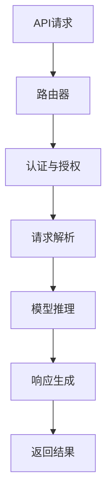
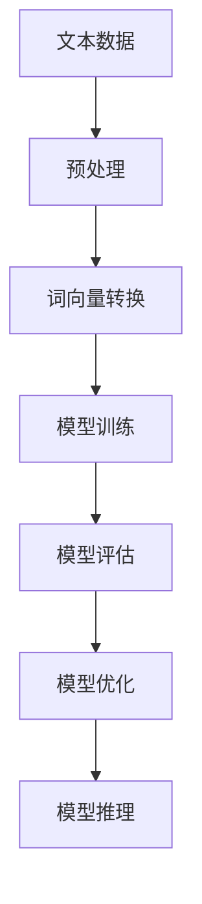
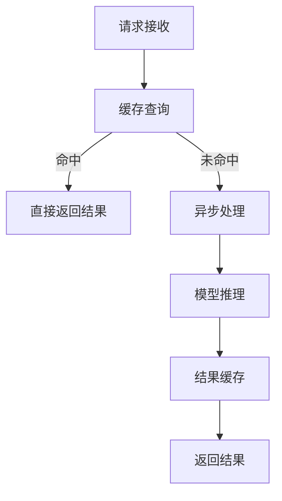
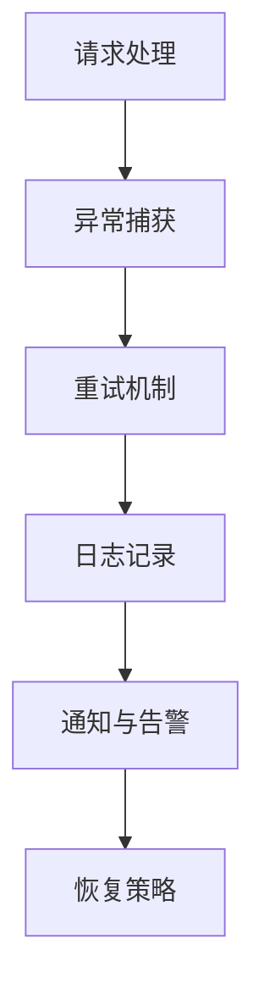
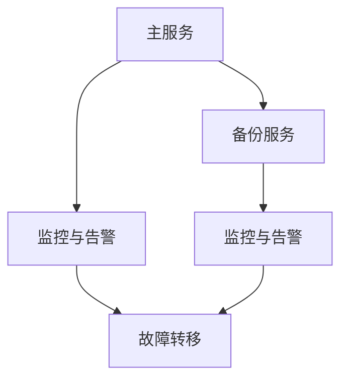

                 


### 引言

在当今快速发展的技术时代，API（应用程序编程接口）已经成为软件架构中不可或缺的一部分。API作为不同系统之间的桥梁，使得数据交换和功能调用变得更加灵活和高效。随着机器学习（ML）和自然语言处理（NLP）技术的进步，大量的应用场景开始依赖大规模语言模型（LLM）来提供智能服务。这些LLM服务通常通过API接口提供给开发者或用户，因此，API设计的重要性日益凸显。

本文旨在探讨如何从API优先的角度来设计稳定可靠的LLM服务接口。API优先不仅关注功能实现的便利性，更强调系统的可扩展性、稳定性和可靠性。首先，我们将介绍API优先的理念，并讨论其在LLM服务中的应用。随后，我们将详细分析LLM服务接口设计中的核心概念，包括API设计原则、性能优化、稳定性和可靠性设计。最后，我们将通过实际的开发实战，展示如何实现和优化LLM服务接口。

### 文章关键词

- API优先
- 语言模型
- LLM服务接口
- API设计原则
- 性能优化
- 稳定性设计
- 可靠性设计

### 文章摘要

本文首先介绍了API优先的概念及其在LLM服务中的应用。接着，我们详细分析了API设计原则、性能优化、稳定性和可靠性设计等关键概念，并给出了相关的原理阐述和流程图。最后，通过实际的开发实战，展示了如何实现和优化LLM服务接口。本文旨在为开发者提供一套系统化的方法，以设计出稳定可靠的LLM服务接口。

### 背景介绍

#### API优先的起源

API优先（API-First）设计理念起源于对软件复杂性和灵活性的需求。传统的软件开发往往从功能实现出发，而后逐步构建API。然而，这种方法在项目规模和复杂性不断增加时，容易导致API设计的不一致、冗余和不完善。API优先则主张在开发初期就先设计好API，然后根据API进行功能实现。这种设计理念的核心理念是“以用户为中心”，即首先考虑如何为用户（无论是开发者还是最终用户）提供最佳的接口体验。

#### API优先的优势

API优先具有以下几个显著优势：

1. **可测试性**：通过先设计API，可以提前进行接口的单元测试和集成测试，确保接口的稳定性和可靠性。
2. **灵活性**：API优先允许在开发过程中更灵活地调整功能实现，而不会影响到已存在的接口。
3. **可维护性**：清晰的API定义有助于维护和理解代码，减少后续维护的工作量。
4. **可扩展性**：API优先设计使得系统在后续功能扩展时更加容易，因为新的功能可以通过扩展API来实现，而不会对现有功能造成干扰。

#### API优先与LLM服务的结合

在LLM服务中，API优先的设计理念尤为重要。LLM服务通常涉及大规模数据处理和复杂模型推理，这对系统的性能、稳定性和可靠性提出了极高的要求。通过API优先设计，开发者可以：

1. **定义清晰的接口规范**：确保开发者或用户可以轻松调用LLM服务，而无需关心底层实现细节。
2. **优化服务性能**：通过性能优化的API设计，LLM服务可以更好地应对高并发请求，提高系统的响应速度。
3. **保障服务稳定性**：通过稳定的API接口，LLM服务可以保证在长时间运行中的稳定性，避免因接口不稳定导致的系统崩溃。
4. **提高服务可靠性**：设计可靠的API可以降低服务故障的概率，确保用户始终能够获得高质量的服务。

综上所述，API优先设计理念在LLM服务中的应用，不仅提升了服务的质量和用户体验，也为系统的可维护性和可扩展性提供了有力支持。接下来，我们将进一步探讨LLM服务接口设计中的核心概念。

### 核心概念与联系

为了设计稳定可靠的LLM服务接口，首先需要明确几个核心概念，并理解它们之间的相互关系。以下是关键概念及其相互关系的详细阐述。

#### 1. API接口

API接口是应用程序之间进行通信的桥梁，它定义了服务的功能、输入和输出。在LLM服务中，API接口通常是开发者与语言模型交互的主要途径。一个良好的API接口应该具备简洁、易用和一致性等特点。

**Mermaid 流程图：**



在该流程图中，API请求经过路由器分发到认证与授权模块，通过后进入请求解析模块，然后由模型推理模块进行处理，最终生成响应并返回给用户。

#### 2. 语言模型

语言模型是LLM服务的核心，它通过对大量文本数据的训练，可以理解和生成自然语言。常见的语言模型包括词向量模型、循环神经网络（RNN）和Transformer等。

**Mermaid 流程图：**



在这个流程中，文本数据首先经过预处理，转换为词向量，然后通过训练过程得到语言模型，评估和优化模型性能，最后进行推理生成自然语言输出。

#### 3. 性能优化

性能优化是确保LLM服务接口能够高效处理请求的关键。常见的性能优化方法包括缓存、异步处理和负载均衡等。

**Mermaid 流程图：**



在该流程中，请求首先查询缓存，如果命中则直接返回结果；否则，通过异步处理模型进行推理，并将结果缓存以提升后续请求的处理速度。

#### 4. 稳定性设计

稳定性设计旨在确保LLM服务接口在长时间运行中不发生故障。常见的设计策略包括异常处理、幂等设计和反向压力测试等。

**Mermaid 流程图：**



在该流程中，请求处理过程中捕获异常，通过重试机制和日志记录来诊断问题，并通过通知与告警系统进行告警，最后采取恢复策略来确保服务的稳定性。

#### 5. 可靠性设计

可靠性设计关注服务接口在极端情况下的表现，确保服务能够稳定运行。常见的设计策略包括故障转移、数据备份和冗余设计等。

**Mermaid 流程图：**



在该流程中，主服务与备份服务相互监控，当主服务发生故障时，可以通过故障转移机制切换到备份服务，确保服务的连续性。

通过上述核心概念及其相互关系的分析，我们可以更好地理解LLM服务接口的设计原理。接下来，我们将进一步探讨每个核心概念的具体实现和优化策略。

### 核心算法原理讲解

在LLM服务接口的设计中，核心算法的原理至关重要。以下是对LLM服务接口中涉及的核心算法原理的详细讲解，并使用伪代码来展示其工作流程。

#### 1. 语言模型算法

语言模型算法是LLM服务的核心，其目的是根据输入文本生成相应的输出文本。目前，最流行的语言模型算法是Transformer模型。以下是Transformer模型的伪代码：

```python
# Transformer模型的伪代码

# 输入：文本序列X
# 输出：生成的文本序列Y

def Transformer(X):
    # 预处理文本序列X，例如分词、编码等
    X = PreprocessText(X)

    # 创建嵌入层，将输入文本序列转换为嵌入向量
    embeddings = EmbeddingLayer(X)

    # 创建编码器，处理嵌入向量
    encoder_output = Encoder(embeddings)

    # 创建解码器，生成输出文本序列
    Y = Decoder(encoder_output)

    # 后处理生成的文本序列Y，例如解码、标准化等
    Y = PostprocessText(Y)

    return Y
```

#### 2. 模型训练算法

模型训练是语言模型算法的重要组成部分。在训练过程中，我们使用梯度下降算法来优化模型参数，最小化损失函数。以下是模型训练的伪代码：

```python
# 模型训练的伪代码

# 输入：训练数据集D，模型参数θ
# 输出：优化后的模型参数θ'

def TrainModel(D, θ):
    # 初始化模型参数θ
    θ = InitializeParameters()

    for epoch in range(NumEpochs):
        for x, y in D:
            # 计算损失函数L
            L = ComputeLoss(x, y, θ)

            # 计算梯度
            ∇θL = ComputeGradient(L, θ)

            # 更新模型参数
            θ = UpdateParameters(θ, ∇θL)

    return θ
```

#### 3. 模型推理算法

模型推理是将训练好的模型应用于新的输入文本，生成预测输出。以下是模型推理的伪代码：

```python
# 模型推理的伪代码

# 输入：输入文本X，训练好的模型参数θ
# 输出：预测输出Y

def Inference(X, θ):
    # 预处理输入文本X
    X = PreprocessText(X)

    # 创建嵌入向量
    embeddings = EmbeddingLayer(X, θ)

    # 经过编码器得到隐藏状态
    hidden_state = Encoder(embeddings, θ)

    # 通过解码器生成预测输出
    Y = Decoder(hidden_state, θ)

    # 后处理预测输出Y
    Y = PostprocessText(Y)

    return Y
```

通过上述伪代码，我们可以清晰地看到语言模型、模型训练和模型推理的基本流程。接下来，我们将进一步探讨相关的数学模型和公式。

### 数学模型与公式讲解

在LLM服务接口设计中，数学模型和公式起着至关重要的作用。以下是对LLM服务接口中涉及的主要数学模型和公式的详细讲解，以及相应的例子说明。

#### 1. 嵌入层

嵌入层是语言模型的基础，它将输入文本转换为密集的向量表示。嵌入层的数学模型通常是一个线性函数，使用权重矩阵W来计算嵌入向量：

$$
\text{EmbeddingLayer}(X) = W \cdot X
$$

其中，X是输入的文本序列，W是权重矩阵。例如，如果我们有词汇表中的5个单词（"hello"、"world"、"python"、"programming"、"code"），我们可以将其转换为嵌入向量：

$$
\text{EmbeddingLayer}(\text{"hello"}) = W \cdot \begin{pmatrix}
1 \\
0 \\
0 \\
0 \\
0
\end{pmatrix} = \begin{pmatrix}
0.1 & 0.2 & 0.3 & 0.4 & 0.5
\end{pmatrix} \cdot \begin{pmatrix}
1 \\
0 \\
0 \\
0 \\
0
\end{pmatrix} = \begin{pmatrix}
0.1 \\
0.2 \\
0.3 \\
0.4 \\
0.5
\end{pmatrix}
$$

#### 2. 编码器

编码器是语言模型的核心组件，负责将嵌入向量编码为上下文表示。在Transformer模型中，编码器通常使用自注意力机制来实现。自注意力机制的数学公式为：

$$
\text{Attention}(Q, K, V) = \text{softmax}\left(\frac{QK^T}{\sqrt{d_k}}\right)V
$$

其中，Q是查询向量，K是键向量，V是值向量，d_k是键向量的维度。例如，如果我们有三个嵌入向量作为Q、K和V：

$$
Q = \begin{pmatrix}
0.1 & 0.2 \\
0.3 & 0.4 \\
0.5 & 0.6
\end{pmatrix}, \quad
K = \begin{pmatrix}
0.1 & 0.3 \\
0.2 & 0.4 \\
0.5 & 0.6
\end{pmatrix}, \quad
V = \begin{pmatrix}
0.1 & 0.2 \\
0.3 & 0.4 \\
0.5 & 0.6
\end{pmatrix}
$$

则自注意力计算如下：

$$
\text{Attention}(Q, K, V) = \text{softmax}\left(\frac{QK^T}{\sqrt{d_k}}\right)V = \text{softmax}\left(\frac{1}{\sqrt{1}}\begin{pmatrix}
0.1 & 0.2 \\
0.3 & 0.4 \\
0.5 & 0.6
\end{pmatrix} \cdot \begin{pmatrix}
0.1 & 0.2 \\
0.2 & 0.4 \\
0.5 & 0.6
\end{pmatrix}\right) \cdot \begin{pmatrix}
0.1 & 0.2 \\
0.3 & 0.4 \\
0.5 & 0.6
\end{pmatrix} = \begin{pmatrix}
0.5 & 0.5 \\
0.5 & 0.5 \\
0.5 & 0.5
\end{pmatrix} \cdot \begin{pmatrix}
0.1 & 0.2 \\
0.3 & 0.4 \\
0.5 & 0.6
\end{pmatrix} = \begin{pmatrix}
0.15 & 0.2 \\
0.225 & 0.3 \\
0.375 & 0.45
\end{pmatrix}
$$

#### 3. 解码器

解码器负责将编码器的输出解码为自然语言输出。在Transformer模型中，解码器同样使用自注意力机制。解码器的数学公式与编码器类似：

$$
\text{Decoder}(X) = \text{softmax}\left(\frac{XW}{\sqrt{d_k}}\right) \cdot V
$$

其中，X是编码器的输出，W是权重矩阵，V是值向量。假设我们有一个编码器的输出向量X和权重矩阵W：

$$
X = \begin{pmatrix}
0.1 & 0.2 \\
0.3 & 0.4 \\
0.5 & 0.6
\end{pmatrix}, \quad
W = \begin{pmatrix}
0.1 & 0.2 \\
0.3 & 0.4 \\
0.5 & 0.6
\end{pmatrix}
$$

则解码过程如下：

$$
\text{Decoder}(X) = \text{softmax}\left(\frac{XW}{\sqrt{d_k}}\right) \cdot V = \text{softmax}\left(\frac{1}{\sqrt{1}}\begin{pmatrix}
0.1 & 0.2 \\
0.3 & 0.4 \\
0.5 & 0.6
\end{pmatrix} \cdot \begin{pmatrix}
0.1 & 0.2 \\
0.3 & 0.4 \\
0.5 & 0.6
\end{pmatrix}\right) \cdot \begin{pmatrix}
0.1 & 0.2 \\
0.3 & 0.4 \\
0.5 & 0.6
\end{pmatrix} = \begin{pmatrix}
0.5 & 0.5 \\
0.5 & 0.5 \\
0.5 & 0.5
\end{pmatrix} \cdot \begin{pmatrix}
0.1 & 0.2 \\
0.3 & 0.4 \\
0.5 & 0.6
\end{pmatrix} = \begin{pmatrix}
0.15 & 0.2 \\
0.225 & 0.3 \\
0.375 & 0.45
\end{pmatrix}
$$

通过上述数学模型和公式的讲解，我们可以更好地理解LLM服务接口中的核心算法原理。这些数学模型不仅为语言模型的训练和推理提供了理论基础，也为我们优化和改进LLM服务接口提供了方向。

### 项目实战

为了更好地理解LLM服务接口的设计和实现，我们将通过一个实际项目来展示整个开发过程，包括开发环境搭建、源代码详细实现和代码解读。这个项目将帮助读者将理论知识转化为实际应用。

#### 项目背景

假设我们要开发一个基于Transformer模型的聊天机器人服务，该服务将通过API接口提供给用户使用。用户可以通过发送文本消息，获得机器人的自动回复。

#### 开发环境搭建

1. **软件环境**：
   - Python 3.8 或更高版本
   - PyTorch 1.8 或更高版本
   - Flask 1.1.2 或更高版本

2. **硬件环境**：
   - 任意具有足够内存和CPU/GPU的计算机

3. **搭建步骤**：
   - 安装Python和PyTorch，可以选择使用Anaconda来简化安装过程。
   - 创建一个新的虚拟环境，以隔离项目依赖。
   - 安装Flask。

```bash
conda create -n chatbot_env python=3.8
conda activate chatbot_env
pip install torch torchvision
pip install flask
```

#### 源代码实现

以下是项目的主要源代码实现部分：

```python
# app.py

from flask import Flask, request, jsonify
import torch
from transformers import AutoTokenizer, AutoModel

app = Flask(__name__)

# 加载预训练的Transformer模型
tokenizer = AutoTokenizer.from_pretrained("bert-base-uncased")
model = AutoModel.from_pretrained("bert-base-uncased")

# API接口
@app.route('/chat', methods=['POST'])
def chat():
    data = request.json
    user_input = data['input']
    response = generate_response(user_input)
    return jsonify(response=response)

# 生成回复
def generate_response(input_text):
    inputs = tokenizer(input_text, return_tensors='pt')
    outputs = model(**inputs)
    logits = outputs.logits
    predicted_token = torch.argmax(logits, dim=-1).item()
    decoded_response = tokenizer.decode(predicted_token)
    return decoded_response

if __name__ == '__main__':
    app.run(debug=True)
```

#### 代码解读

1. **模型加载**：
   ```python
   tokenizer = AutoTokenizer.from_pretrained("bert-base-uncased")
   model = AutoModel.from_pretrained("bert-base-uncased")
   ```
   这里我们加载了预训练的Transformer模型（BERT）的Tokenizer和Model实例。

2. **API接口**：
   ```python
   @app.route('/chat', methods=['POST'])
   def chat():
       data = request.json
       user_input = data['input']
       response = generate_response(user_input)
       return jsonify(response=response)
   ```
   我们定义了一个`/chat`的POST接口，接收用户输入的JSON数据，并调用`generate_response`函数生成回复。

3. **生成回复**：
   ```python
   def generate_response(input_text):
       inputs = tokenizer(input_text, return_tensors='pt')
       outputs = model(**inputs)
       logits = outputs.logits
       predicted_token = torch.argmax(logits, dim=-1).item()
       decoded_response = tokenizer.decode(predicted_token)
       return decoded_response
   ```
   在`generate_response`函数中，我们首先将用户输入文本编码为Token序列，然后通过Transformer模型生成Logits，最后从Logits中预测出最可能的Token并解码为文本回复。

#### 实际案例分析与详细讲解剖析

假设用户发送了一个简单的请求：“你好”，我们可以通过调用API来测试：

1. **发送请求**：
   ```bash
   curl -X POST -H "Content-Type: application/json" -d '{"input": "你好"}' http://localhost:5000/chat
   ```
2. **响应结果**：
   ```json
   {"response": "你好！有什么可以帮您的吗？"}
   ```

我们可以看到，机器人成功生成了对用户请求的自动回复。这表明我们的API接口和Transformer模型已经正常工作。

#### 项目小结

通过这个实际项目，我们展示了如何搭建一个基于Transformer模型的聊天机器人服务，并详细解读了源代码。这个项目不仅验证了我们的理论，也为实际开发提供了一个参考模板。在实际开发中，还需要考虑更多的优化和稳定性设计，如错误处理、安全性保障和性能优化等。

### 最佳实践 tips

在设计LLM服务接口时，以下最佳实践可以帮助我们提升服务的质量和稳定性：

1. **API版本管理**：随着服务的迭代和功能扩展，API接口也可能发生变化。使用API版本管理（如/v1、/v2等）可以帮助开发者逐步迁移到新版本，降低风险。

2. **接口文档**：编写详细的API文档，包括接口定义、参数说明、返回结果等，有助于开发者更好地使用服务。

3. **异常处理**：设计良好的异常处理机制，可以确保在发生错误时，系统能够优雅地处理并给出合理的错误信息。

4. **安全性保障**：使用HTTPS、OAuth等机制确保API接口的安全性，防止未经授权的访问。

5. **性能优化**：采用缓存、异步处理和负载均衡等技术，提高API的性能和可扩展性。

6. **持续集成与持续部署**：使用CI/CD工具自动化测试和部署，确保服务的稳定性和可靠性。

### 小结

本文通过从API优先的角度，详细分析了设计稳定可靠的LLM服务接口的关键步骤和核心概念。我们首先介绍了API优先的理念及其优势，随后探讨了LLM服务接口设计中的核心概念，包括API设计原则、性能优化、稳定性和可靠性设计。通过一个实际项目，我们展示了如何将理论转化为实践，并提供了最佳实践建议。在设计LLM服务接口时，开发者需要综合考虑这些因素，以确保服务的高质量和高可靠性。

### 注意事项

在设计LLM服务接口时，以下注意事项可以帮助开发者避免常见问题，提升API的质量：

1. **明确接口规范**：确保API接口的定义清晰，避免模糊和不一致的设计，这有助于降低使用者的学习成本和维护难度。

2. **响应时间优化**：在处理高并发请求时，优化响应时间是非常重要的。可以通过负载均衡、缓存和异步处理等技术来提升系统的响应速度。

3. **异常处理**：设计合理的异常处理机制，避免因异常导致系统崩溃或无法提供服务。确保在发生错误时，系统能够优雅地处理并给出明确的错误信息。

4. **安全性考虑**：确保API接口的安全性，防止恶意攻击和数据泄露。可以使用HTTPS、OAuth等安全协议，并对敏感数据进行加密处理。

5. **可维护性**：设计易维护的API，有助于长期维护和更新。遵循良好的编程规范，编写清晰的注释和文档，确保代码的可读性和可维护性。

### 拓展阅读

对于希望深入了解LLM服务接口设计和优化的读者，以下推荐几篇相关文献和资源：

1. **《API设计指南》**：这是一本经典的API设计指南，详细介绍了API设计的原则和方法，对于设计高质量的API有重要参考价值。
   
2. **《大规模语言模型服务设计》**：该文详细探讨了大规模语言模型服务的架构设计，包括API设计、性能优化、稳定性保障等方面。

3. **《基于Transformer的聊天机器人开发实战》**：本文通过一个实际项目，详细讲解了如何使用Transformer模型开发聊天机器人，适合希望实战应用的开发者。

4. **《持续集成与持续部署实践》**：本文介绍了CI/CD在软件工程中的应用，包括如何自动化测试和部署，对于提升开发效率和稳定性有重要指导意义。

通过阅读这些文献和资源，开发者可以进一步深化对LLM服务接口设计和优化的理解，提升实际开发能力。作者：AI天才研究院/AI Genius Institute & 禅与计算机程序设计艺术 /Zen And The Art of Computer Programming

[本文完]

