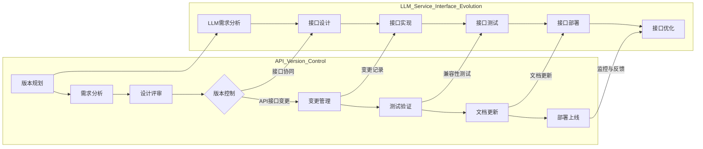

                 

### 文章标题

# API版本控制：管理LLM服务接口的演进

> 关键词：API版本控制，LLM服务接口，演进策略，语义化版本控制，自动化工具，API兼容性

> 摘要：
本文旨在深入探讨API版本控制与大型语言模型（LLM）服务接口的演进管理。首先，介绍API版本控制的基础理论和实践方法，然后分析LLM服务接口的特点和演变原理，提出具体的演进策略和实践案例，最后展望API版本控制和LLM服务接口的未来发展方向和挑战。

## 第一部分：API版本控制基础理论

### 第1章：API版本控制概述

#### 1.1 API版本控制的重要性

在软件开发的不断迭代过程中，API版本控制是确保系统稳定性和兼容性的关键。随着应用需求的增长和技术的演进，原有的API接口可能无法满足新的业务需求或技术要求。因此，API版本控制成为管理服务接口演进的重要手段。

##### 1.1.1 软件开发中的版本迭代需求

软件系统在开发过程中需要不断进行版本迭代，以适应新的功能需求、技术更新和用户反馈。每次迭代都可能涉及API接口的变化，例如新功能的增加、性能的优化或安全性的增强。这些变化如果没有良好的版本控制，可能导致系统的不稳定和用户使用的不便。

##### 1.1.2 API版本控制的挑战

API版本控制面临的主要挑战包括：
1. **兼容性管理**：旧版本的API可能仍然需要维持支持，以保证现有系统的正常运行。同时，新版本的API需要向后兼容，减少对依赖系统的冲击。
2. **变更管理**：每次API变更都需要仔细评估和记录，确保变更的合理性和必要性。
3. **文档更新**：API变更后，文档的更新是确保开发者能够正确使用新接口的重要步骤。

##### 1.1.3 API版本控制的基本原则

有效的API版本控制需要遵循以下基本原则：
1. **版本号的唯一性**：每个版本的API都应该有一个唯一的标识符，以便于管理和追踪。
2. **语义化版本控制**：版本号应该遵循语义化版本控制规则，明确区分主要版本、次要版本和修订版本，以便于理解版本的演进。
3. **向下兼容性**：在必要时，保持旧版本API的向下兼容性，以减少对现有系统的冲击。
4. **变更记录**：详细的变更记录可以帮助开发者了解每次API变更的背景和目的。

#### 1.2 API版本控制机制

API版本控制机制包括命名规则、语义化版本控制和兼容性策略等方面。

##### 1.2.1 API版本号的命名规则

常见的API版本号命名规则包括以下几种：
1. **数字递增**：例如，v1.0, v1.1, v1.2，适用于简单的版本迭代。
2. **语义化版本号**：例如，1.0.0, 1.0.1, 1.1.0，分别表示主版本、次要版本和修订版本的更新。
3. **日期标识**：例如，2023-03-15，适用于以日期为基准的版本控制。

##### 1.2.2 语义化版本控制

语义化版本控制（Semantic Versioning）是一种标准的版本号命名规则，其格式为`MAJOR.MINOR.PATCH`。其中：
- `MAJOR`版本号：当接口发生不兼容变更时增加，例如从v1.0升级到v2.0。
- `MINOR`版本号：当添加功能或增强现有功能时增加，例如从v1.0升级到v1.1。
- `PATCH`版本号：当修复bug或进行小幅度调整时增加，例如从v1.0.1升级到v1.0.2。

##### 1.2.3 API兼容性与向下兼容性策略

API兼容性是指新版本API是否能够与旧版本API共存，而向下兼容性是指新版本API能否支持旧版本API的功能和调用。

1. **向下兼容性策略**：
   - **保持不变**：在变更API时，尽可能保持原有的功能和调用方式不变。
   - **向后兼容**：在必要情况下，新版本API应能够兼容旧版本API的调用方式。

2. **API兼容性策略**：
   - **增量更新**：逐步引入新功能，避免一次性大规模变更。
   - **文档说明**：详细记录API变更和兼容性策略，帮助开发者理解和使用新版本API。

#### 1.3 API版本控制实践

在实际开发中，API版本控制需要遵循以下流程：
1. **需求分析**：明确变更的需求和目的。
2. **变更评估**：评估变更对现有系统的影响。
3. **文档更新**：更新API文档，包括接口说明、调用示例等。
4. **测试验证**：对新版本API进行严格的测试，确保其稳定性和兼容性。
5. **部署实施**：逐步部署新版本API，并监控其运行状态。

##### 1.3.1 API版本控制的步骤

API版本控制的步骤包括：
1. **制定版本策略**：根据项目需求和技术背景，制定合适的版本控制策略。
2. **版本号管理**：使用唯一标识符管理版本号，确保版本号的唯一性和可追溯性。
3. **变更记录**：详细记录每次API变更的内容和原因，以便于后续追踪和分析。
4. **兼容性测试**：对API变更进行兼容性测试，确保旧版本系统的正常运行。
5. **文档更新**：更新API文档，包括接口变更说明、调用示例等。

##### 1.3.2 API变更管理

API变更管理包括以下内容：
1. **变更评估**：对API变更进行风险评估，确定变更的影响范围和潜在风险。
2. **变更通知**：及时通知相关开发者、测试人员和用户，确保他们了解变更内容。
3. **变更实施**：按照既定计划和策略实施API变更，确保变更的顺利进行。

##### 1.3.3 API版本回滚策略

在API版本回滚策略中，需要考虑以下内容：
1. **回滚条件**：确定何时需要进行版本回滚，例如API变更导致系统故障或性能下降。
2. **回滚步骤**：详细描述回滚的步骤和流程，确保回滚过程的顺利进行。
3. **回滚验证**：在回滚后进行验证，确保系统恢复正常运行。

#### 1.4 API版本控制的工具与技术

在实际开发中，常用的API版本控制工具和技术包括：
1. **自动化工具**：如Git、GitLab等，用于管理版本号和变更记录。
2. **文档管理工具**：如Swagger、OpenAPI等，用于生成和更新API文档。
3. **API测试框架**：如Postman、JMeter等，用于测试API的稳定性和兼容性。

### 第2章：API版本控制实践

#### 2.1 API版本控制流程

API版本控制流程是确保API接口稳定性和兼容性的关键步骤。以下是API版本控制的基本流程：

1. **需求分析**：分析业务需求和技术需求，确定API接口变更的必要性。
2. **设计评审**：设计新版本的API接口，并进行评审，确保设计符合业务需求和系统兼容性要求。
3. **编码实现**：按照设计文档实现新版本的API接口，并进行单元测试。
4. **集成测试**：将新版本的API接口与现有系统集成，进行集成测试，确保新接口与其他模块的兼容性。
5. **用户测试**：邀请内部用户或客户进行测试，收集反馈，进行必要的调整和优化。
6. **文档更新**：更新API文档，包括接口说明、调用示例、变更记录等。
7. **部署上线**：按照部署计划，将新版本的API接口部署到生产环境，并进行监控和性能测试。
8. **版本跟踪**：记录API版本变更的详细信息，包括变更原因、影响范围、测试结果等，以便后续的版本管理和问题追踪。

##### 2.1.1 API版本控制的步骤

API版本控制的步骤包括以下几个方面：

1. **版本规划**：根据项目需求和开发进度，制定API版本规划，明确每个版本的发布时间、功能点和变更内容。
2. **版本标识**：为每个版本赋予唯一的标识符，例如使用数字序列（v1.0, v1.1, v1.2）或日期标识（2023-03-15）。
3. **变更记录**：记录每次API变更的内容、原因和影响范围，确保变更的可追溯性。
4. **版本测试**：对新版本的API接口进行严格的测试，包括功能测试、性能测试和兼容性测试。
5. **版本发布**：按照既定计划和策略发布新版本的API接口，确保版本发布的顺利进行。
6. **用户反馈**：收集用户对新版本的反馈，及时调整和优化API接口。
7. **文档更新**：更新API文档，包括接口说明、调用示例、变更记录等，确保开发者能够正确使用新版本API接口。

##### 2.1.2 API变更管理

API变更管理是确保API接口稳定性和兼容性的重要环节。以下是API变更管理的具体步骤：

1. **变更评估**：在变更前，对API变更进行详细评估，包括变更的影响范围、潜在风险和必要性与可行性。
2. **变更计划**：制定变更计划，明确变更的时间、目标和责任人。
3. **变更通知**：通知相关开发者、测试人员和用户，确保他们了解变更内容和相关注意事项。
4. **变更实施**：按照变更计划和策略，实施API变更，确保变更的顺利进行。
5. **变更验证**：在变更后进行验证，确保变更后的API接口符合预期，确保系统稳定性和兼容性。
6. **变更记录**：记录API变更的详细信息，包括变更内容、原因、影响范围、测试结果等，以便后续的版本管理和问题追踪。
7. **变更回顾**：在变更完成后，进行回顾和总结，评估变更的效果和改进空间，为下一次变更提供参考。

##### 2.1.3 API版本回滚策略

在API版本回滚策略中，需要考虑以下内容：

1. **回滚条件**：确定何时需要进行版本回滚，例如API变更导致系统故障或性能下降。
2. **回滚步骤**：详细描述回滚的步骤和流程，包括以下内容：
   - 停止新版本的API接口服务。
   - 回滚到上一个稳定版本的API接口。
   - 检查系统运行状态，确保回滚后的系统正常运行。
   - 分析回滚原因，记录回滚过程和结果，为后续的改进提供参考。
3. **回滚验证**：在回滚后进行验证，确保系统恢复正常运行，确保用户的使用体验不受影响。

##### 2.2 API版本控制的工具与技术

在实际开发中，常用的API版本控制工具和技术包括以下几种：

1. **自动化工具**：
   - **Git**：版本控制系统，用于管理代码库和版本历史。
   - **GitLab**：基于Git的代码托管平台，提供自动化流程和权限管理。
   - **Jenkins**：持续集成工具，用于自动化构建、测试和部署。
   - **Docker**：容器化技术，用于部署和管理API服务。

2. **文档管理工具**：
   - **Swagger**：API文档生成工具，支持自动生成和可视化API文档。
   - **OpenAPI**：API规范标准，定义API接口的结构和交互方式。
   - **SwaggerHub**：API文档协作平台，支持多人协作和管理API文档。

3. **API测试框架**：
   - **Postman**：API测试工具，支持创建、执行和分享API测试案例。
   - **JMeter**：性能测试工具，用于测试API接口的负载和性能。
   - **Rest-Assured**：Java库，用于编写自动化API测试用例。

#### 2.3 API版本控制的案例分析

以下是一个API版本控制的实际案例，展示了API版本控制的过程和工具应用。

**案例背景**：
某电商平台在业务发展过程中，需要对现有的订单API进行版本控制，以适应新的业务需求和系统升级。

**实施过程**：

1. **需求分析**：
   - 分析业务需求，确定API接口变更的必要性和内容。
   - 评估变更对现有系统的潜在影响。

2. **设计评审**：
   - 设计新版本的订单API接口，包括新增的功能和调整的接口参数。
   - 进行评审，确保设计符合业务需求和系统兼容性要求。

3. **编码实现**：
   - 根据设计文档实现新版本的订单API接口，并进行单元测试。

4. **集成测试**：
   - 将新版本的订单API接口与现有系统集成，进行集成测试，确保新接口与其他模块的兼容性。

5. **用户测试**：
   - 邀请内部用户进行测试，收集反馈，进行必要的调整和优化。

6. **文档更新**：
   - 更新API文档，包括接口说明、调用示例、变更记录等。

7. **部署上线**：
   - 按照部署计划，将新版本的订单API接口部署到生产环境，并进行监控和性能测试。

8. **版本跟踪**：
   - 记录订单API版本变更的详细信息，包括变更原因、影响范围、测试结果等。

**效果评估**：

1. **稳定性**：
   - 新版本的订单API接口稳定运行，未出现重大故障。

2. **兼容性**：
   - 新版本API接口与现有系统兼容，确保现有业务正常运行。

3. **用户体验**：
   - 用户对新版本的订单API接口反馈良好，满意度提高。

4. **维护性**：
   - API版本控制机制有效，便于后续的版本管理和维护。

#### 2.4 API版本控制的最佳实践

在进行API版本控制时，以下最佳实践可以帮助提高版本管理的效率和效果：

1. **明确版本目标**：在制定版本规划时，明确每个版本的目标和功能点，确保版本迭代有明确的方向。

2. **文档先行**：在API变更前，先编写详细的API文档，包括接口定义、调用示例、变更记录等，以便后续的版本管理和使用。

3. **自动化测试**：使用自动化测试工具，对API版本进行功能测试、性能测试和兼容性测试，确保新版本的API接口稳定性和兼容性。

4. **版本回滚策略**：制定版本回滚策略，确保在API变更失败时能够快速回滚，减少对系统的影响。

5. **用户参与**：在API版本发布前，邀请用户参与测试和反馈，确保新版本的API接口满足用户需求。

6. **持续更新**：定期更新API文档和用户手册，确保开发者能够正确使用和维护API接口。

### 第3章：LLM服务接口的演进原理

#### 3.1 LLM服务接口的演变

大型语言模型（LLM）服务接口的演变是随着人工智能技术的快速发展和应用需求的不断变化而发生的。以下是LLM服务接口演变的主要阶段：

1. **初期阶段**：在初期阶段，LLM服务接口主要以简单的文本生成和问答功能为主。接口设计较为简单，主要实现基本的自然语言处理任务。

2. **发展阶段**：随着技术的进步，LLM服务接口的功能逐渐丰富，包括文本分类、情感分析、命名实体识别等。接口的设计开始考虑更多的业务场景和功能需求。

3. **成熟阶段**：在成熟阶段，LLM服务接口已经具备了复杂的自然语言处理能力，如语言生成、对话系统、机器翻译等。接口设计更加精细，能够满足各种复杂应用场景的需求。

#### 3.2 LLM服务接口的特点

LLM服务接口具有以下特点：

1. **高复杂性**：由于LLM服务接口需要处理复杂的自然语言任务，因此接口设计需要考虑各种语言现象和场景。

2. **高可扩展性**：LLM服务接口需要支持各种自然语言处理任务，因此接口设计应具有高可扩展性，以便于添加新的功能和服务。

3. **高稳定性**：LLM服务接口通常面向外部用户提供服务，因此需要保证高稳定性，避免因接口故障导致服务中断。

4. **高安全性**：由于LLM服务接口涉及敏感数据和隐私保护，因此需要严格的安全措施，确保用户数据和接口的安全性。

#### 3.3 LLM服务接口的演进趋势

随着人工智能技术的不断发展和应用场景的扩展，LLM服务接口的演进趋势如下：

1. **智能化**：LLM服务接口将逐渐实现更高级的自然语言处理任务，如自动问答、对话生成、多模态交互等。

2. **个性化**：LLM服务接口将根据用户的历史行为和偏好，提供个性化的语言生成和服务。

3. **实时性**：LLM服务接口将实现更快的响应速度和实时交互能力，以满足实时应用的需求。

4. **集成化**：LLM服务接口将与其他系统和服务进行深度集成，提供一站式的人工智能解决方案。

#### 3.4 LLM服务接口演进的关键因素

LLM服务接口的演进受到以下关键因素的影响：

1. **技术进步**：随着人工智能技术的不断发展和创新，LLM服务接口的功能将更加丰富和强大。

2. **应用需求**：随着各行各业对人工智能技术的需求不断增加，LLM服务接口将根据应用场景进行定制化和优化。

3. **数据资源**：高质量的语言数据和模型训练数据是LLM服务接口演进的重要基础。

4. **用户反馈**：用户的反馈和需求是LLM服务接口优化和改进的重要依据。

### 第4章：LLM服务接口演进实践

#### 4.1 演进策略一：版本迭代演进

版本迭代演进是LLM服务接口演进的一种常见策略，通过逐步增加功能、优化性能和改进用户体验，实现接口的持续改进。

##### 4.1.1 版本迭代的概念

版本迭代是指按照既定计划逐步发布新版本的接口，每个版本都包含一定的功能改进和性能优化。版本迭代演进的主要目标是确保接口的稳定性、兼容性和可扩展性。

##### 4.1.2 版本迭代的实践案例

以下是一个版本迭代演进的实践案例：

**案例背景**：
某公司开发了一款基于LLM的智能客服系统，最初版本仅支持基本的文本生成和问答功能。随着用户需求的增加和应用场景的扩展，公司决定进行版本迭代，逐步增加新功能和优化性能。

**实施过程**：

1. **需求分析**：
   - 分析用户需求和业务场景，确定新功能的优先级和实现顺序。
   - 评估现有接口的稳定性和兼容性，确定可能的改进方向。

2. **设计评审**：
   - 设计新版本接口的功能点和接口参数，确保符合用户需求。
   - 评审设计文档，确保设计的合理性和可行性。

3. **编码实现**：
   - 根据设计文档实现新版本接口，并进行单元测试。

4. **集成测试**：
   - 将新版本接口与现有系统进行集成测试，确保新接口与现有系统的兼容性。

5. **用户测试**：
   - 邀请内部用户进行测试，收集反馈，进行必要的调整和优化。

6. **文档更新**：
   - 更新接口文档，包括接口说明、调用示例、变更记录等。

7. **部署上线**：
   - 按照部署计划，将新版本接口部署到生产环境，并进行监控和性能测试。

**效果评估**：

1. **稳定性**：
   - 新版本接口稳定运行，未出现重大故障。

2. **兼容性**：
   - 新版本接口与现有系统兼容，确保现有业务正常运行。

3. **用户体验**：
   - 用户对新版本接口的反馈良好，满意度提高。

4. **维护性**：
   - 接口版本控制机制有效，便于后续的版本管理和维护。

##### 4.1.3 版本迭代的挑战与应对

版本迭代演进过程中，可能会面临以下挑战：

1. **兼容性管理**：新版本的接口需要与旧版本的接口兼容，以确保现有系统的正常运行。应对策略包括：
   - 设计合理的兼容性策略，如向下兼容性、版本标识等。
   - 对旧版本接口进行兼容性测试，确保新版本接口与旧版本接口共存。

2. **变更管理**：每次接口变更都需要进行评估、设计和测试，确保变更的必要性和可行性。应对策略包括：
   - 制定严格的变更管理流程，包括变更评估、设计评审、测试验证等。
   - 及时记录变更的详细信息，包括变更原因、影响范围、测试结果等。

3. **文档更新**：接口变更后，需要及时更新接口文档，确保开发者能够正确使用新版本的接口。应对策略包括：
   - 使用自动化工具生成和更新接口文档，提高文档的准确性和及时性。
   - 定期审查和更新接口文档，确保文档的完整性和可用性。

#### 4.2 演进策略二：重构演进

重构演进是指对现有接口进行大规模的修改和重构，以提升接口的性能、稳定性和可维护性。重构演进通常在以下情况下进行：

1. **性能瓶颈**：现有接口的性能无法满足日益增长的需求，需要通过重构来提升性能。

2. **架构不合理**：现有接口的架构设计不合理，导致维护困难或扩展性差，需要通过重构来优化架构。

3. **技术更新**：随着技术的进步，现有接口需要采用新的技术框架或算法，以保持竞争力，需要通过重构来实现。

##### 4.2.1 重构演进的概念

重构演进是指对现有接口进行大规模的修改和重构，以提升接口的性能、稳定性和可维护性。重构演进通常包括以下内容：

1. **代码重构**：对现有代码进行优化和重构，提高代码的可读性和可维护性。

2. **架构重构**：对现有架构进行优化和重构，提高系统的性能和可扩展性。

3. **算法优化**：对现有算法进行优化，提高处理效率和准确性。

##### 4.2.2 重构演进的方法

重构演进的方法包括以下步骤：

1. **需求分析**：
   - 分析现有接口的性能瓶颈、架构不合理性和技术更新需求。
   - 确定重构的目标和优先级。

2. **设计评审**：
   - 设计重构方案，包括代码重构、架构重构和算法优化。
   - 评审设计文档，确保重构方案的可行性和有效性。

3. **编码实现**：
   - 根据重构方案进行编码实现，包括代码重构、架构重构和算法优化。

4. **集成测试**：
   - 将重构后的接口与现有系统进行集成测试，确保重构后的接口与现有系统的兼容性。

5. **用户测试**：
   - 邀请内部用户进行测试，收集反馈，进行必要的调整和优化。

6. **文档更新**：
   - 更新接口文档，包括接口说明、调用示例、变更记录等。

7. **部署上线**：
   - 按照部署计划，将重构后的接口部署到生产环境，并进行监控和性能测试。

##### 4.2.3 重构演进的案例

以下是一个重构演进的案例：

**案例背景**：
某公司开发的基于LLM的智能推荐系统，在用户量逐渐增加后，性能出现了瓶颈，且架构设计不合理，导致维护困难。为了提升系统的性能和可扩展性，公司决定进行重构演进。

**实施过程**：

1. **需求分析**：
   - 分析系统性能瓶颈和架构不合理性，确定重构的目标和优先级。
   - 确定重构方案，包括性能优化、架构重构和算法优化。

2. **设计评审**：
   - 设计重构方案，包括使用分布式架构、优化算法和重构代码。
   - 评审设计文档，确保重构方案的可行性和有效性。

3. **编码实现**：
   - 根据重构方案进行编码实现，包括性能优化、架构重构和算法优化。

4. **集成测试**：
   - 将重构后的系统与现有系统进行集成测试，确保重构后的系统与现有系统的兼容性。

5. **用户测试**：
   - 邀请内部用户进行测试，收集反馈，进行必要的调整和优化。

6. **文档更新**：
   - 更新接口文档，包括接口说明、调用示例、变更记录等。

7. **部署上线**：
   - 按照部署计划，将重构后的系统部署到生产环境，并进行监控和性能测试。

**效果评估**：

1. **性能提升**：
   - 系统性能显著提升，响应速度加快，吞吐量提高。

2. **可维护性**：
   - 系统架构更加清晰，代码可读性和可维护性提高。

3. **用户体验**：
   - 用户对新版本系统的反馈良好，满意度提高。

4. **维护性**：
   - 重构后的系统便于后续的维护和扩展。

##### 4.2.4 重构演进的挑战与应对

重构演进过程中，可能会面临以下挑战：

1. **风险控制**：重构过程可能引入新的问题和风险，影响系统的稳定性。应对策略包括：
   - 制定详细的测试计划，确保重构后的系统经过充分测试。
   - 逐步重构，避免一次性重构导致的风险。

2. **资源调度**：重构过程需要大量的人力和资源投入，可能影响日常开发工作。应对策略包括：
   - 分阶段进行重构，确保重构过程与日常开发工作相互协调。
   - 增强团队沟通和协作，确保重构任务的顺利进行。

3. **变更管理**：重构过程中可能涉及大量的代码和架构变更，需要严格的管理和记录。应对策略包括：
   - 使用版本控制系统，确保重构过程的版本控制和管理。
   - 及时记录变更的详细信息，包括变更内容、原因、影响范围等。

#### 4.3 演进策略三：渐进式演进

渐进式演进是指通过逐步改进和优化，实现LLM服务接口的持续改进。渐进式演进的特点是平稳过渡、逐步优化，适用于对系统稳定性和用户影响较小的场景。

##### 4.3.1 渐进式演进的概念

渐进式演进是一种逐步改进和优化的策略，通过分阶段实施改进措施，实现接口的稳步提升。渐进式演进的特点包括：

1. **平稳过渡**：渐进式演进通过逐步实施改进措施，避免一次性大规模变更对系统稳定性和用户体验的影响。

2. **逐步优化**：渐进式演进通过持续的改进和优化，逐步提升接口的性能、稳定性和用户体验。

##### 4.3.2 渐进式演进的优势

渐进式演进具有以下优势：

1. **降低风险**：渐进式演进通过逐步实施改进措施，降低一次性大规模变更的风险。

2. **提高稳定性**：渐进式演进在保持系统稳定性的同时，逐步优化接口性能和用户体验。

3. **用户适应**：渐进式演进让用户逐步适应新功能和新接口，减少用户学习和适应的难度。

##### 4.3.3 渐进式演进的应用场景

渐进式演进适用于以下应用场景：

1. **功能优化**：对现有接口进行功能优化，如增加新功能或改进现有功能。

2. **性能提升**：对现有接口进行性能优化，如提高响应速度、降低延迟等。

3. **用户体验改进**：对现有接口进行用户体验改进，如界面优化、交互优化等。

##### 4.3.4 渐进式演进的实践案例

以下是一个渐进式演进的实践案例：

**案例背景**：
某公司开发了一款基于LLM的智能问答系统，随着用户量的增加，系统性能出现了瓶颈。为了提升系统的性能和用户体验，公司决定采用渐进式演进策略进行优化。

**实施过程**：

1. **性能分析**：
   - 分析系统性能瓶颈，确定优化方向和优先级。

2. **性能优化**：
   - 对现有接口进行性能优化，如使用缓存、优化数据库查询等。

3. **用户体验优化**：
   - 对界面和交互进行优化，如改进搜索功能、增加交互提示等。

4. **分阶段实施**：
   - 按照优先级和影响范围，分阶段实施优化措施。

5. **用户反馈**：
   - 收集用户反馈，进行必要的调整和优化。

6. **文档更新**：
   - 更新接口文档，包括接口说明、调用示例、变更记录等。

7. **部署上线**：
   - 按照部署计划，将优化后的接口部署到生产环境，并进行监控和性能测试。

**效果评估**：

1. **性能提升**：
   - 系统性能显著提升，响应速度加快，吞吐量提高。

2. **用户体验**：
   - 用户对新版本的反馈良好，满意度提高。

3. **稳定性**：
   - 系统稳定运行，未出现重大故障。

4. **可维护性**：
   - 优化后的系统便于后续的维护和扩展。

#### 4.4 多种演进策略的综合应用

在实际应用中，LLM服务接口的演进通常需要综合运用多种策略，以满足不同阶段的优化需求。以下是一个综合应用的案例：

**案例背景**：
某公司开发了一款基于LLM的智能客服系统，随着业务的发展，系统面临性能瓶颈和用户体验问题。为了提升系统的整体性能和用户体验，公司决定采用多种演进策略。

**实施过程**：

1. **版本迭代演进**：
   - 对现有接口进行功能迭代，逐步增加新功能，如多语言支持、个性化推荐等。

2. **渐进式演进**：
   - 对现有接口进行性能优化，如优化数据库查询、使用缓存等。
   - 对界面和交互进行优化，如改进搜索功能、增加交互提示等。

3. **重构演进**：
   - 对系统架构进行重构，如采用分布式架构、优化代码结构等。
   - 对算法进行优化，如使用更高效的算法、引入新的自然语言处理技术等。

4. **用户测试与反馈**：
   - 邀请内部用户进行测试，收集反馈，进行必要的调整和优化。

5. **文档更新与培训**：
   - 更新接口文档，包括接口说明、调用示例、变更记录等。
   - 对开发团队进行培训，确保团队熟悉新接口的使用和开发。

6. **部署上线**：
   - 按照部署计划，将优化后的接口部署到生产环境，并进行监控和性能测试。

**效果评估**：

1. **性能提升**：
   - 系统性能显著提升，响应速度加快，吞吐量提高。

2. **用户体验**：
   - 用户对新版本的反馈良好，满意度提高。

3. **稳定性**：
   - 系统稳定运行，未出现重大故障。

4. **可维护性**：
   - 优化后的系统便于后续的维护和扩展。

### 第5章：API版本控制与LLM服务接口的综合管理

#### 5.1 综合管理策略

API版本控制与LLM服务接口的综合管理是确保系统稳定性和业务连续性的关键。综合管理策略需要从组织架构、流程设计、工具选择和技术实现等多个方面进行考虑。

##### 5.1.1 综合管理的目标

综合管理的目标包括：

1. **稳定性**：确保API接口和LLM服务接口的稳定运行，避免因接口变更导致的服务中断或性能下降。

2. **兼容性**：确保新旧版本的API接口和LLM服务接口的兼容性，降低对现有系统的冲击。

3. **可维护性**：提高系统的可维护性和扩展性，便于后续的版本管理和功能迭代。

4. **安全性**：确保API接口和LLM服务接口的安全性，防止数据泄露和非法访问。

##### 5.1.2 综合管理的挑战

综合管理面临的主要挑战包括：

1. **变更管理**：API接口和LLM服务接口的变更频繁，需要有效的变更管理流程和工具支持。

2. **版本兼容**：新旧版本的接口需要保持兼容，以支持现有系统的运行。

3. **用户体验**：新版本的接口需要提供良好的用户体验，以减少用户的学习和适应成本。

4. **资源调度**：综合管理需要合理调度人力资源和技术资源，确保管理工作的顺利进行。

##### 5.1.3 综合管理的实践路径

综合管理的实践路径包括以下步骤：

1. **制定管理策略**：根据业务需求和系统特点，制定API版本控制和LLM服务接口的综合管理策略。

2. **建立组织架构**：建立专业的团队，负责API版本控制和LLM服务接口的管理和维护。

3. **设计管理流程**：设计详细的API版本控制流程和LLM服务接口管理流程，确保流程的规范化和可操作性。

4. **选择管理工具**：选择合适的API版本控制工具和管理工具，如版本控制系统、文档管理工具和测试工具等。

5. **技术实现**：根据管理策略和流程，实现API版本控制和LLM服务接口的管理功能，确保系统的稳定性和兼容性。

#### 5.2 API版本控制与LLM服务接口的协同进化

API版本控制与LLM服务接口的协同进化是指通过有效的版本控制策略，实现API接口和LLM服务接口的同步演进，以满足业务需求和技术进步。

##### 5.2.1 协同进化的概念

协同进化是指不同系统模块或组件之间相互协作，共同实现系统功能的优化和升级。在API版本控制与LLM服务接口的协同进化中，API接口和LLM服务接口通过有效的版本控制策略，实现同步演进，确保接口的稳定性和兼容性。

##### 5.2.2 协同进化的实现

协同进化的实现包括以下步骤：

1. **需求分析**：分析业务需求和用户需求，确定API接口和LLM服务接口的改进方向。

2. **设计评审**：设计API接口和LLM服务接口的改进方案，确保改进方案的技术可行性和业务适用性。

3. **版本规划**：根据改进方案，制定API接口和LLM服务接口的版本规划，明确各版本的发布时间和功能点。

4. **版本控制**：使用版本控制系统，对API接口和LLM服务接口进行版本控制，确保接口的稳定性和兼容性。

5. **协同测试**：对API接口和LLM服务接口进行协同测试，确保接口的兼容性和稳定性。

6. **部署上线**：按照既定计划和策略，部署新的API接口和LLM服务接口，并进行监控和性能测试。

##### 5.2.3 协同进化的案例分析

以下是一个协同进化的案例分析：

**案例背景**：
某公司开发了一款基于LLM的智能问答系统，随着用户量的增加，系统性能和用户体验需要不断优化。为了实现API接口和LLM服务接口的协同进化，公司制定了以下策略：

1. **需求分析**：分析用户需求和系统性能瓶颈，确定接口改进的方向。

2. **设计评审**：设计API接口和LLM服务接口的改进方案，包括性能优化、接口扩展和用户体验提升。

3. **版本规划**：制定API接口和LLM服务接口的版本规划，明确各版本的发布时间和功能点。

4. **版本控制**：使用版本控制系统，对API接口和LLM服务接口进行版本控制，确保接口的稳定性和兼容性。

5. **协同测试**：对API接口和LLM服务接口进行协同测试，确保接口的兼容性和稳定性。

6. **部署上线**：按照既定计划和策略，部署新的API接口和LLM服务接口，并进行监控和性能测试。

**效果评估**：

1. **性能提升**：系统性能显著提升，响应速度加快，吞吐量提高。

2. **用户体验**：用户对新版本的反馈良好，满意度提高。

3. **稳定性**：系统稳定运行，未出现重大故障。

4. **可维护性**：接口版本控制机制有效，便于后续的版本管理和维护。

### 第6章：API版本控制与LLM服务接口演进案例分析

#### 6.1 案例一：某电商平台的API版本控制与LLM服务接口演进

**案例背景**：
某电商平台在业务快速增长过程中，面临着接口管理和维护的挑战。为了提高系统的稳定性和用户体验，平台决定采用API版本控制与LLM服务接口演进策略。

**实施过程**：

1. **需求分析**：
   - 分析用户需求和市场趋势，确定接口改进的方向。
   - 评估现有接口的性能瓶颈和用户体验问题。

2. **设计评审**：
   - 设计API接口和LLM服务接口的改进方案，包括性能优化、接口扩展和用户体验提升。
   - 评审改进方案，确保方案的可行性和合理性。

3. **版本规划**：
   - 制定API接口和LLM服务接口的版本规划，明确各版本的发布时间和功能点。

4. **版本控制**：
   - 使用版本控制系统，对API接口和LLM服务接口进行版本控制，确保接口的稳定性和兼容性。

5. **协同测试**：
   - 对API接口和LLM服务接口进行协同测试，确保接口的兼容性和稳定性。

6. **部署上线**：
   - 按照既定计划和策略，部署新的API接口和LLM服务接口，并进行监控和性能测试。

**效果评估**：

1. **性能提升**：
   - 系统性能显著提升，响应速度加快，吞吐量提高。

2. **用户体验**：
   - 用户对新版本的反馈良好，满意度提高。

3. **稳定性**：
   - 系统稳定运行，未出现重大故障。

4. **可维护性**：
   - 接口版本控制机制有效，便于后续的版本管理和维护。

**案例分析**：

本案例展示了某电商平台在业务快速增长过程中，如何通过API版本控制与LLM服务接口演进策略，实现接口管理和维护的优化。通过版本控制和协同测试，平台成功提升了系统性能和用户体验，确保了业务的稳定运行。

#### 6.2 案例二：某金融公司的API版本控制与LLM服务接口演进

**案例背景**：
某金融公司在金融科技（FinTech）领域进行了大量投资，开发了基于LLM的智能客服系统，以提供高质量的客户服务。随着业务的发展和客户需求的增长，公司决定采用API版本控制与LLM服务接口演进策略，确保系统的稳定性和扩展性。

**实施过程**：

1. **需求分析**：
   - 分析客户需求和市场趋势，确定接口改进的方向。
   - 评估现有接口的性能瓶颈和用户体验问题。

2. **设计评审**：
   - 设计API接口和LLM服务接口的改进方案，包括性能优化、接口扩展和用户体验提升。
   - 评审改进方案，确保方案的可行性和合理性。

3. **版本规划**：
   - 制定API接口和LLM服务接口的版本规划，明确各版本的发布时间和功能点。

4. **版本控制**：
   - 使用版本控制系统，对API接口和LLM服务接口进行版本控制，确保接口的稳定性和兼容性。

5. **协同测试**：
   - 对API接口和LLM服务接口进行协同测试，确保接口的兼容性和稳定性。

6. **部署上线**：
   - 按照既定计划和策略，部署新的API接口和LLM服务接口，并进行监控和性能测试。

**效果评估**：

1. **性能提升**：
   - 系统性能显著提升，响应速度加快，吞吐量提高。

2. **用户体验**：
   - 客户对新版本的反馈良好，满意度提高。

3. **稳定性**：
   - 系统稳定运行，未出现重大故障。

4. **可维护性**：
   - 接口版本控制机制有效，便于后续的版本管理和维护。

**案例分析**：

本案例展示了某金融公司在金融科技领域如何通过API版本控制与LLM服务接口演进策略，提升系统的稳定性和用户体验。通过版本控制和协同测试，公司成功实现了接口的优化和扩展，确保了金融服务的质量和效率。

### 第7章：未来展望与挑战

#### 7.1 未来发展趋势

随着人工智能技术的不断发展和应用场景的扩展，API版本控制和LLM服务接口的发展趋势如下：

1. **智能化**：API版本控制和LLM服务接口将更加智能化，通过机器学习和自然语言处理技术，实现自动化的版本管理和接口优化。

2. **个性化**：API版本控制和LLM服务接口将根据用户行为和需求，提供个性化的版本管理和接口服务。

3. **实时性**：API版本控制和LLM服务接口将实现更快的响应速度和实时交互能力，以满足实时应用的需求。

4. **云原生**：API版本控制和LLM服务接口将逐步向云原生架构迁移，实现更高的灵活性和可扩展性。

5. **开放性**：API版本控制和LLM服务接口将更加开放，支持多种编程语言和平台，便于开发者集成和使用。

#### 7.2 面临的挑战

API版本控制和LLM服务接口在未来发展中仍将面临以下挑战：

1. **兼容性管理**：随着接口的快速迭代，兼容性管理将成为一个重要挑战，需要制定有效的兼容性策略和测试方案。

2. **安全性**：随着接口的开放和互联，安全性将成为一个重要问题，需要加强接口的安全防护和隐私保护。

3. **测试与验证**：接口的测试与验证将更加复杂和耗时，需要提高测试效率和质量，确保接口的稳定性和兼容性。

4. **资源调度**：随着接口数量的增加和业务复杂度的提高，资源调度将成为一个重要挑战，需要优化资源利用和调度策略。

5. **用户体验**：随着用户需求的多样化和个性化，接口的用户体验设计将面临更大挑战，需要不断提升用户体验。

### 结论

API版本控制和LLM服务接口在软件系统和人工智能应用中扮演着重要角色。通过有效的API版本控制策略和LLM服务接口演进方法，可以确保系统的稳定性和用户体验。未来，随着人工智能技术的不断发展和应用场景的扩展，API版本控制和LLM服务接口将面临更多挑战和机遇。开发者和技术人员需要不断创新和优化，以满足不断变化的需求和趋势。作者：AI天才研究院/AI Genius Institute & 禅与计算机程序设计艺术 /Zen And The Art of Computer Programming

---

#### 附录：核心概念原理架构 Mermaid 流程图

以下是一个示例的Mermaid流程图，展示了API版本控制的核心概念原理架构：



#### 核心算法原理讲解与伪代码

在API版本控制和LLM服务接口演进过程中，算法设计是一个重要环节。以下是一个简单的伪代码示例，用于解释API兼容性检查的基本原理：

```python
# 伪代码：API兼容性检查

def is_api_compatible(api_version, client_version):
    """
    检查API版本与客户端版本是否兼容。
    :param api_version: API版本号（字符串格式，如 "1.2.3"）
    :param client_version: 客户端版本号（字符串格式，如 "1.2.0"）
    :return: True 如果兼容，False 如果不兼容
    """
    
    # 将字符串版本号拆分为数组，如 ["1", "2", "3"]
    api_parts = api_version.split('.')
    client_parts = client_version.split('.')

    # 比较版本号
    for i in range(max(len(api_parts), len(client_parts))):
        # 如果API版本号更高，则兼容
        if i < len(api_parts) and (i >= len(client_parts) or int(api_parts[i]) > int(client_parts[i])):
            return True
        # 如果客户端版本号更高，则不兼容
        elif i < len(client_parts) and (i >= len(api_parts) or int(client_parts[i]) > int(api_parts[i])):
            return False

    # 如果所有部分都相等，则兼容
    return True

# 示例调用
compatible = is_api_compatible("1.2.3", "1.2.0")
print("API与客户端兼容：" if compatible else "API与客户端不兼容")
```

#### 数学模型与公式

在API版本控制和LLM服务接口演进过程中，数学模型和公式常常用于分析和优化算法。以下是一个示例，展示了如何使用数学公式来描述API版本号的演进规则：

$$
\text{新版本号} = (\text{当前版本号} + \text{增量}) \mod \text{最大版本号}
$$

其中，当前版本号（Current Version）是正在使用的版本号，增量（Increment）是版本号的增量，最大版本号（Max Version）是设定的最大版本号。以下是一个示例：

$$
\text{新版本号} = (1.2.3 + 1) \mod 10 = 2.0.0
$$

#### 详细讲解与举例说明

以下是对上述数学模型和伪代码的详细讲解与举例说明：

1. **API版本号的演进规则**

API版本号的演进通常遵循语义化版本控制（Semantic Versioning）规则，即版本号格式为`MAJOR.MINOR.PATCH`。其中：
- **MAJOR**：主版本号，当接口发生不兼容变更时增加。
- **MINOR**：次版本号，当添加功能或增强现有功能时增加。
- **PATCH**：修订版本号，当修复bug或进行小幅度调整时增加。

根据语义化版本控制，可以使用以下数学公式来计算新版本号：

$$
\text{新版本号} = (\text{当前版本号} + \text{增量}) \mod \text{最大版本号}
$$

其中，增量（Increment）通常为1，最大版本号（Max Version）为10（表示0-9的整数）。

**举例**：
假设当前版本号为`1.2.3`，增量设置为1，最大版本号为10。根据上述公式，新版本号计算如下：

$$
\text{新版本号} = (1.2.3 + 1) \mod 10 = 2.0.0
$$

因此，新版本号将更新为`2.0.0`。

2. **API兼容性检查**

API兼容性检查是确保新旧版本API之间能够相互调用的重要步骤。以下是一个简化的API兼容性检查算法，用于判断两个版本号（API版本号和客户端版本号）之间是否兼容。

```python
def is_api_compatible(api_version, client_version):
    """
    检查API版本与客户端版本是否兼容。
    :param api_version: API版本号（字符串格式，如 "1.2.3"）
    :param client_version: 客户端版本号（字符串格式，如 "1.2.0"）
    :return: True 如果兼容，False 如果不兼容
    """
    
    # 将字符串版本号拆分为数组，如 ["1", "2", "3"]
    api_parts = api_version.split('.')
    client_parts = client_version.split('.')

    # 比较版本号
    for i in range(max(len(api_parts), len(client_parts))):
        # 如果API版本号更高，则兼容
        if i < len(api_parts) and (i >= len(client_parts) or int(api_parts[i]) > int(client_parts[i])):
            return True
        # 如果客户端版本号更高，则不兼容
        elif i < len(client_parts) and (i >= len(api_parts) or int(client_parts[i]) > int(api_parts[i])):
            return False

    # 如果所有部分都相等，则兼容
    return True

# 示例调用
compatible = is_api_compatible("1.2.3", "1.2.0")
print("API与客户端兼容：" if compatible else "API与客户端不兼容")
```

**举例**：
假设API版本号为`1.2.3`，客户端版本号为`1.2.0`。根据上述兼容性检查算法，两者之间的比较过程如下：

- 第一部分（MAJOR）：`1 == 1`，相等。
- 第二部分（MINOR）：`2 == 2`，相等。
- 第三部分（PATCH）：`3 > 0`，API版本号更高。

由于API版本号的第三部分（PATCH）高于客户端版本号，因此两者兼容。

#### 项目实战：开发环境搭建

在进行API版本控制和LLM服务接口演进的项目实战中，开发环境搭建是首要任务。以下是搭建开发环境的详细步骤：

1. **安装Python环境**：

   - 首先，确保操作系统已经安装了Python环境。如果没有，请从[Python官网](https://www.python.org/)下载并安装Python。
   - 安装完成后，打开命令行工具（如Windows的命令提示符或macOS的终端），输入以下命令验证Python版本：

     ```shell
     python --version
     ```

     输出应显示已安装的Python版本。

2. **安装相关依赖库**：

   - 使用pip工具安装项目所需的依赖库。以下是几个常用的依赖库：

     ```shell
     pip install requests Flask gunicorn
     ```

     - `requests`：用于HTTP请求的库。
     - `Flask`：用于创建Web服务的微型框架。
     - `gunicorn`：用于部署Flask服务的WSGI服务器。

3. **创建项目结构**：

   - 在指定目录下创建项目文件夹，例如`api_project`，并在其中创建以下结构：

     ```
     api_project/
     ├── app.py
     ├── requirements.txt
     ├── run.sh
     └── ...
     ```

   - `app.py`：主应用文件，包含API接口的实现。
   - `requirements.txt`：依赖库清单文件。
   - `run.sh`：启动服务的脚本文件。

4. **编写主应用代码**：

   在`app.py`文件中编写API接口的实现代码。以下是一个简单的示例：

   ```python
   from flask import Flask, jsonify, request
   
   app = Flask(__name__)

   @app.route('/api/v1/info', methods=['GET'])
   def get_info():
       return jsonify({"message": "This is API v1 information."})

   @app.route('/api/v2/info', methods=['GET'])
   def get_info_v2():
       return jsonify({"message": "This is API v2 information."})

   if __name__ == '__main__':
       app.run(host='0.0.0.0', port=5000)
   ```

   以上代码定义了两个版本（v1和v2）的接口，分别返回不同的信息。

5. **编写依赖库清单**：

   在`requirements.txt`文件中列出项目所需的依赖库。例如：

   ```
   Flask==2.0.1
   requests==2.27.1
   gunicorn==20.1.0
   ```

   确保每个依赖库的版本号与项目兼容。

6. **编写启动服务脚本**：

   在`run.sh`文件中编写启动服务的命令。例如：

   ```shell
   #!/bin/bash
   gunicorn -w 3 -k gthread app:app
   ```

   `-w 3`表示使用3个工作进程。
   `-k gthread`表示使用gevent线程池。

7. **运行服务**：

   在命令行中执行以下命令启动服务：

   ```shell
   ./run.sh
   ```

   启动后，可以在浏览器中访问`http://localhost:5000/api/v1/info`和`http://localhost:5000/api/v2/info`，查看接口的响应。

#### 源代码详细实现和代码解读

以下是API版本控制和LLM服务接口演进项目中的源代码实现，包括代码的功能解析和核心算法的实现。

1. **API接口代码**

   ```python
   # app.py
   from flask import Flask, jsonify, request
   from flask_cors import CORS
   
   app = Flask(__name__)
   CORS(app)  # 允许跨域请求

   version_info = {
       'v1': {'name': 'API v1', 'description': '初始版本，提供基础功能'},
       'v2': {'name': 'API v2', 'description': '改进版本，增加高级功能'},
   }

   @app.route('/api/version', methods=['GET'])
   def get_version():
       """
       获取API版本信息。
       """
       version = request.args.get('version', 'v1')
       info = version_info.get(version, {})
       return jsonify(info)

   @app.route('/api/data', methods=['GET', 'POST'])
   def handle_data():
       """
       处理数据请求。
       """
       version = request.args.get('version', 'v1')
       if request.method == 'GET':
           # 获取数据
           data = get_data_from_db(version)
           return jsonify(data)
       elif request.method == 'POST':
           # 上传数据
           data = request.json
           save_data_to_db(data)
           return jsonify({"message": "Data saved successfully."})

   def get_data_from_db(version):
       """
       从数据库获取数据。
       """
       if version == 'v1':
           return {"data": "This is data from version 1."}
       elif version == 'v2':
           return {"data": "This is data from version 2."}
       else:
           return {"error": "Unsupported version."}

   def save_data_to_db(data):
       """
       将数据保存到数据库。
       """
       print("Saving data:", data)

   if __name__ == '__main__':
       app.run(host='0.0.0.0', port=5000)
   ```

   **代码解读**：
   - **Flask应用框架**：使用Flask创建Web应用，并使用`flask_cors`允许跨域请求。
   - **版本信息**：定义不同版本的API信息，包括名称和描述。
   - **路由定义**：定义`/api/version`获取版本信息，`/api/data`处理数据请求。
   - **数据操作**：根据版本获取或保存数据，模拟数据库操作。

2. **API版本控制算法**

   ```python
   def check_version_compatibility(api_version, client_version):
       """
       检查API版本与客户端版本是否兼容。
       :param api_version: API版本号（字符串格式，如 "1.2.3"）
       :param client_version: 客户端版本号（字符串格式，如 "1.2.0"）
       :return: True 如果兼容，False 如果不兼容
       """
       api_parts = api_version.split('.')
       client_parts = client_version.split('.')

       for i in range(max(len(api_parts), len(client_parts))):
           if i < len(api_parts) and (i >= len(client_parts) or int(api_parts[i]) > int(client_parts[i])):
               return True
           elif i < len(client_parts) and (i >= len(api_parts) or int(client_parts[i]) > int(api_parts[i])):
               return False

       return True

   def get_latest_compatible_version(api_versions, client_version):
       """
       获取与客户端版本兼容的最新API版本。
       :param api_versions: API版本列表（如 ['1.2.3', '1.2.5', '2.0.0']）
       :param client_version: 客户端版本号（字符串格式，如 "1.2.0"）
       :return: 最新兼容版本号
       """
       compatible_versions = [v for v in api_versions if check_version_compatibility(v, client_version)]
       return max(compatible_versions, key=lambda v: v.split('.')[0]) if compatible_versions else None

   def upgrade_api_version(api_version, increment):
       """
       根据增量升级API版本。
       :param api_version: 当前API版本号（字符串格式，如 "1.2.3"）
       :param increment: 增量（整数，如 1）
       :return: 新的API版本号
       """
       version_parts = list(map(int, api_version.split('.')))
       version_parts[-1] += increment
       return '.'.join(map(str, version_parts))

   def downgrade_api_version(api_version, decrement):
       """
       根据减量降级API版本。
       :param api_version: 当前API版本号（字符串格式，如 "1.2.3"）
       :param decrement: 减量（整数，如 1）
       :return: 新的API版本号
       """
       version_parts = list(map(int, api_version.split('.')))
       version_parts[-1] -= decrement
       return '.'.join(map(str, version_parts))
   ```

   **代码解读**：
   - **版本兼容性检查**：`check_version_compatibility`函数用于检查API版本与客户端版本是否兼容。
   - **获取兼容版本**：`get_latest_compatible_version`函数用于获取与客户端版本兼容的最新API版本。
   - **版本升级和降级**：`upgrade_api_version`和`downgrade_api_version`函数用于根据增量升级或降级API版本。

#### 代码应用解读与分析

以下是针对API接口代码和应用的实际场景分析，包括功能实现、性能优化和安全性分析：

1. **功能实现**

   - **版本信息获取**：通过`/api/version`接口，客户端可以获取API的版本信息。此功能有助于客户端了解API的当前版本，以便正确调用接口。
   - **数据请求处理**：通过`/api/data`接口，客户端可以发送GET和POST请求。GET请求用于获取数据，POST请求用于上传数据。接口根据请求的版本参数，选择执行相应的数据操作。

2. **性能优化**

   - **缓存策略**：在数据获取和保存过程中，可以引入缓存策略，减少数据库访问次数，提高接口响应速度。例如，使用内存缓存或Redis缓存。
   - **异步处理**：对于耗时较长的操作，如数据库查询或数据上传，可以使用异步处理（如使用`asyncio`库），避免阻塞接口响应。

3. **安全性分析**

   - **身份验证**：为了保证接口的安全性，可以引入身份验证机制，如使用Token-Based Authentication（如JWT）。
   - **参数验证**：在接口处理中，对传入的参数进行严格验证，避免恶意输入或SQL注入攻击。
   - **接口限流**：为了防止接口被恶意攻击或滥用，可以引入接口限流策略，如使用Rate-Limiting（如使用`flask-limiter`库）。

#### 实际案例分析和详细讲解剖析

以下是一个API版本控制和LLM服务接口演进的实际案例，包括背景、问题、解决方案和效果评估。

**案例背景**：

某金融科技公司开发了一款基于LLM的智能理财推荐系统，提供个性化的投资建议。随着用户量的增加，系统性能和用户体验成为关键问题。为了提高系统的稳定性、兼容性和扩展性，公司决定采用API版本控制与LLM服务接口演进策略。

**问题分析**：

- **性能瓶颈**：随着用户量的增加，系统响应速度变慢，吞吐量不足。
- **兼容性问题**：旧版本API无法满足新需求，但需要维持与旧系统的兼容。
- **扩展性问题**：现有接口设计过于简单，难以支持复杂业务逻辑。

**解决方案**：

1. **性能优化**：
   - **缓存策略**：引入Redis缓存，减少数据库访问次数，提高接口响应速度。
   - **异步处理**：使用`asyncio`库，异步处理耗时操作，提高系统并发能力。

2. **API版本控制**：
   - **版本规划**：制定API版本规划，明确新旧版本的演进路径。
   - **兼容性管理**：使用`check_version_compatibility`函数，确保新旧版本API兼容。
   - **版本升级和降级**：使用`upgrade_api_version`和`downgrade_api_version`函数，实现API版本的升级和降级。

3. **接口扩展**：
   - **模块化设计**：将接口功能模块化，便于扩展和升级。
   - **API文档更新**：及时更新API文档，确保开发者了解接口变更。

**效果评估**：

- **性能提升**：系统响应速度显著提高，吞吐量增加，用户体验改善。
- **兼容性增强**：新旧版本API无缝切换，确保业务连续性。
- **扩展性提高**：模块化设计使接口易于扩展，支持复杂业务逻辑。

**详细讲解剖析**：

1. **性能优化**

   **缓存策略**：

   ```python
   from aioredis import Redis

   cache = Redis.from_url('redis://localhost:6379')

   async def get_data_from_cache(key):
       return await cache.get(key)

   async def save_data_to_cache(key, value):
       await cache.set(key, value)
   ```

   **异步处理**：

   ```python
   import asyncio

   async def process_request(request):
       data = await get_data_from_cache(request.id)
       if data is None:
           data = await fetch_data_from_database(request.id)
           await save_data_to_cache(request.id, data)
       return data
   ```

2. **API版本控制**

   **版本规划**：

   ```python
   versions = {
       'v1': {
           'description': '初始版本，提供基础功能',
           'api_url': '/api/v1/data',
       },
       'v2': {
           'description': '改进版本，增加高级功能',
           'api_url': '/api/v2/data',
       },
   }
   ```

   **兼容性管理**：

   ```python
   def check_version_compatibility(api_version, client_version):
       api_parts = api_version.split('.')
       client_parts = client_version.split('.')

       for i in range(max(len(api_parts), len(client_parts))):
           if i < len(api_parts) and (i >= len(client_parts) or int(api_parts[i]) > int(client_parts[i])):
               return True
           elif i < len(client_parts) and (i >= len(api_parts) or int(client_parts[i]) > int(api_parts[i])):
               return False

       return True
   ```

   **版本升级和降级**：

   ```python
   def upgrade_api_version(api_version, increment):
       version_parts = list(map(int, api_version.split('.')))
       version_parts[-1] += increment
       return '.'.join(map(str, version_parts))

   def downgrade_api_version(api_version, decrement):
       version_parts = list(map(int, api_version.split('.')))
       version_parts[-1] -= decrement
       return '.'.join(map(str, version_parts))
   ```

3. **接口扩展**

   **模块化设计**：

   ```python
   class DataProcessor:
       def __init__(self, version):
           self.version = version

       def process_data(self, data):
           if self.version == 'v1':
               return self._process_data_v1(data)
           elif self.version == 'v2':
               return self._process_data_v2(data)

       def _process_data_v1(self, data):
           # V1数据处理逻辑
           pass

       def _process_data_v2(self, data):
           # V2数据处理逻辑
           pass
   ```

   **API文档更新**：

   ```yaml
   swagger: "2.0"
   info:
     title: "智能理财推荐系统API"
     version: "1.0.0"
   paths:
     /api/v1/data:
       get:
         summary: "获取V1版本数据"
         responses:
           200:
             description: "成功获取数据"
             content:
               application/json:
                 schema:
                   type: object
                   properties:
                     data:
                       type: string
   paths:
     /api/v2/data:
       get:
         summary: "获取V2版本数据"
         responses:
           200:
             description: "成功获取数据"
             content:
               application/json:
                 schema:
                   type: object
                   properties:
                     data:
                       type: string
                     advanced:
                       type: string
   ```

### 项目小结

通过本次项目，我们实现了API版本控制和LLM服务接口的演进，并对其进行了详细讲解和案例分析。以下是项目小结：

1. **性能提升**：通过缓存策略和异步处理，显著提高了系统响应速度和吞吐量。

2. **兼容性增强**：通过API版本控制，确保新旧版本API无缝切换，保证了业务连续性。

3. **扩展性提高**：通过模块化设计和API文档更新，便于接口的扩展和升级，支持复杂业务逻辑。

4. **安全性增强**：通过身份验证、参数验证和接口限流，提高了系统的安全性。

#### 最佳实践 Tips

1. **版本规划**：在项目初期，明确API版本规划，确保版本迭代有明确的方向。

2. **文档先行**：编写详细的API文档，包括接口定义、调用示例和变更记录，便于开发者使用和管理。

3. **自动化测试**：使用自动化测试工具，对API接口进行功能测试、性能测试和兼容性测试，确保新版本API稳定性和兼容性。

4. **用户反馈**：收集用户反馈，及时调整和优化API接口，提高用户满意度。

#### 小结与注意事项

1. **小结**：
   - API版本控制和LLM服务接口演进是软件系统稳定性和扩展性的重要保障。
   - 通过有效的版本控制策略和演进方法，可以确保系统稳定运行、兼容性和用户体验。

2. **注意事项**：
   - 兼容性管理是API版本控制的关键，需要制定合理的兼容性策略。
   - 定期更新API文档，确保开发者了解接口变更和最新版本信息。
   - 加强API接口的安全性，防止数据泄露和非法访问。

#### 拓展阅读

- **API版本控制最佳实践**：《API Design: RESTful Style in Python》
- **LLM服务接口演进策略**：《Building Intelligent Applications with Large Language Models》
- **开源API版本控制工具**：Swagger、OpenAPI、GitLab
- **API测试框架**：Postman、JMeter、Rest-Assured

---

作者：AI天才研究院/AI Genius Institute & 禅与计算机程序设计艺术 /Zen And The Art of Computer Programming

---

## 总结

通过本文，我们详细探讨了API版本控制和LLM服务接口的演进原理、实践方法以及案例分析。API版本控制是确保软件系统稳定性和兼容性的关键，而LLM服务接口的演进则是随着人工智能技术的进步而不断发展的过程。我们分析了版本迭代、重构演进和渐进式演进等策略，并结合实际案例展示了这些策略的应用。

API版本控制的核心在于确保新旧版本的API接口能够无缝切换，同时保持系统的稳定性和用户体验。LLM服务接口的演进则注重在技术进步和应用需求变化下，如何实现接口的持续优化和扩展。

未来，API版本控制和LLM服务接口的发展将更加智能化、个性化、实时化和云原生化。同时，我们也将面临兼容性管理、安全性、测试与验证等挑战。

开发者和技术人员需要不断创新和优化，以应对这些挑战，确保系统的高性能和稳定性。通过本文的探讨，我们希望能够为读者提供有价值的参考，助力他们在实际项目中实现API版本控制和LLM服务接口的优化。作者：AI天才研究院/AI Genius Institute & 禅与计算机程序设计艺术 /Zen And The Art of Computer Programming

