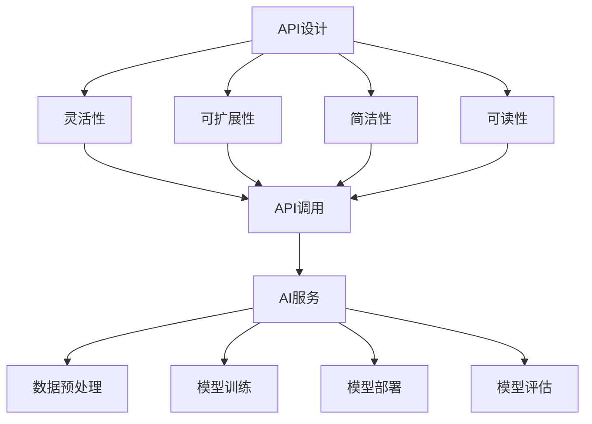

                 

### 文章标题

《API设计原则：构建灵活可扩展的AI服务》

关键词：API设计、AI服务、灵活可扩展性、设计原则、最佳实践

摘要：本文深入探讨了API设计在构建灵活可扩展的AI服务中的关键作用。通过详细分析API设计与AI服务的核心概念及其关系，本文提出了若干API设计原则，包括灵活性、可扩展性、简洁性和可读性。同时，通过实践案例和具体方法，展示了如何将这些原则应用到实际API设计中，确保AI服务的高效和可靠性。此外，本文还讨论了API设计与安全性、测试、持续集成以及未来趋势等领域的结合，提供了全面的API设计最佳实践，为开发高效、可靠的AI服务提供了理论依据和实践指导。### 第一部分：API设计与AI服务的概述

#### 第1章：API设计与AI服务的核心概念

在数字时代，API（应用程序编程接口）设计已成为软件开发的基石。API不仅定义了不同软件组件之间的交互方式，还促进了不同系统之间的数据交换和功能调用。而随着人工智能（AI）技术的迅猛发展，AI服务在各个领域得到了广泛应用，例如智能推荐、自然语言处理和图像识别等。本部分将重点介绍API设计和AI服务的核心概念，以及它们之间的关系。

#### 1.1 API设计的概念与重要性

##### 1.1.1 API的定义

API是一套协议、工具和定义，用于构建软件应用程序中的交互接口。它允许一个应用程序访问另一个应用程序的功能和数据，而不需要了解底层实现的细节。API通常通过函数调用的方式实现，使开发者能够通过编写少量代码来实现复杂的操作。

##### 1.1.2 API设计的原则

成功的API设计应遵循以下原则：
- **简洁性**：API应尽量简单，易于理解和记忆，避免冗余和复杂的操作。
- **一致性**：API的命名和参数应保持一致，以便开发者能够快速掌握使用方法。
- **灵活性**：API应具备足够的灵活性，以便适应未来的变化和扩展。
- **可扩展性**：API应支持增加新功能或修改现有功能，而不影响现有客户端。

##### 1.1.3 API在AI服务中的作用

在AI服务中，API设计扮演了至关重要的角色。首先，API为AI模型提供了与外部系统交互的接口，使模型能够接收输入数据并进行处理。其次，API使得AI服务能够与其他应用程序或服务集成，实现数据的交换和功能的扩展。最后，良好的API设计能够提高AI服务的可维护性和可扩展性，从而降低开发成本。

#### 1.2 AI服务的基本概念

##### 1.2.1 AI服务的定义

AI服务是指利用人工智能技术（如机器学习、深度学习等）提供的软件服务。这些服务可以包括智能推荐、自然语言处理、图像识别、预测分析等。

##### 1.2.2 AI服务的架构

AI服务通常由以下几部分组成：
- **数据预处理**：对输入数据进行分析和清洗，以适应AI模型的要求。
- **模型训练**：利用训练数据对AI模型进行训练，以提高模型的准确性。
- **模型部署**：将训练好的模型部署到生产环境中，以便进行实际应用。
- **模型评估**：对模型进行评估，以确定其性能和适用性。

##### 1.2.3 AI服务的类型

AI服务可以分为以下几类：
- **通用AI服务**：如自然语言处理、图像识别、语音识别等。
- **行业专用AI服务**：如医疗诊断、金融分析、智能制造等。

#### 1.3 API设计与AI服务的关系

##### 1.3.1 API设计在AI服务中的应用

在AI服务中，API设计应用于以下几个方面：
- **数据接入**：API用于接收外部系统的数据，并进行预处理。
- **模型调用**：API用于调用训练好的AI模型，进行预测和分析。
- **服务集成**：API用于与其他应用程序或服务集成，实现数据交换和功能扩展。

##### 1.3.2 AI服务对API设计的要求

为了满足AI服务的需求，API设计应具备以下要求：
- **高性能**：API应能够快速响应大量请求，以满足实时处理的需求。
- **高可用性**：API应具备良好的容错能力，确保服务稳定可靠。
- **高可扩展性**：API应支持横向和纵向的扩展，以适应业务增长。

##### 1.3.3 API设计与AI服务的融合趋势

随着AI技术的发展，API设计与AI服务的融合趋势日益明显。未来，API设计将更加注重以下几个方面：
- **智能化**：API将具备一定的智能能力，能够自动适应和优化服务。
- **标准化**：API将遵循统一的标准和规范，提高互操作性和兼容性。
- **云原生**：API将集成到云原生架构中，实现高效、灵活的部署和管理。

通过以上分析，我们可以看出，API设计在AI服务中具有不可替代的作用。只有遵循良好的API设计原则，才能构建出灵活、可扩展的AI服务，为企业和用户提供高效、可靠的服务体验。### 核心概念与联系

为了更好地理解API设计与AI服务的关系，我们需要深入探讨几个核心概念，并展示它们之间的相互联系。以下是一个简化的Mermaid流程图，用于说明API设计与AI服务的主要组成部分及其关系：



在上述流程图中，我们可以看到：
- **API设计**（A）是整个系统的核心，它决定了API的各种特性，包括灵活性（B）、可扩展性（C）、简洁性（D）和可读性（E）。
- **API调用**（F）是API设计与AI服务（G）之间的桥梁，它将API设计与AI服务的其他组成部分（H[数据预处理]、I[模型训练]、J[模型部署]、K[模型评估]）紧密联系在一起。

接下来，我们将详细解释这些核心概念及其关系：

#### API设计

API设计是创建一个应用程序与另一个应用程序或服务交互的接口。它的主要目标是提供一套清晰、简洁、灵活的接口，使得开发者可以轻松地调用API，实现数据交换和功能调用。

#### 灵活性

灵活性是指API能够适应不同的场景和需求。一个灵活的API应该能够支持多种数据格式（如JSON、XML等）、多种调用方式（如GET、POST等）以及各种参数配置。这样，当业务需求发生变化时，API可以很容易地进行调整，而不需要重新编写大量的代码。

#### 可扩展性

可扩展性是指API能够随着业务的增长而扩展，包括横向扩展（增加更多的服务器）和纵向扩展（增加更多的功能）。一个可扩展的API应该能够轻松地添加新的端点、参数和功能，同时保持与现有系统的兼容性。

#### 简洁性

简洁性是指API设计应尽量减少不必要的复杂性，使得API接口简单、直观、易于使用。简洁的API不仅能够提高开发效率，还能降低维护成本。

#### 可读性

可读性是指API文档和代码应具有良好的可读性，使得开发者能够快速理解和掌握API的使用方法。良好的可读性可以通过清晰的命名规范、详细的注释和良好的文档来实现。

#### AI服务

AI服务是利用人工智能技术提供的一种软件服务，包括数据预处理、模型训练、模型部署和模型评估等步骤。API设计在AI服务中的作用主要体现在以下几个方面：

- **数据预处理**：API用于接收外部数据，并将其格式化为AI模型所需的格式。
- **模型训练**：API用于调用训练好的AI模型，处理输入数据并返回预测结果。
- **模型部署**：API用于将训练好的模型部署到生产环境中，以便进行实际应用。
- **模型评估**：API用于评估模型的性能，以便进行优化和调整。

通过以上分析，我们可以看到，API设计不仅是AI服务的重要组成部分，也是实现AI服务灵活性和可扩展性的关键。良好的API设计能够提高AI服务的效率和可靠性，为企业和用户提供更好的服务体验。### 核心算法原理讲解

在API设计中，核心算法的原理对于理解API如何工作至关重要。以下我们将通过伪代码详细讲解一个简单的API调用流程，以及相关的算法原理。

#### 算法概述

本算法的目标是实现一个简单的RESTful API，用于接收用户输入并返回计算结果。API的具体功能如下：
- 接收用户输入的两个整数。
- 计算这两个整数的和。
- 将计算结果返回给用户。

#### 伪代码

```python
// 定义API端点
@app.route('/add', methods=['GET'])
def add_numbers():
    // 获取用户输入的两个整数
    num1 = request.args.get('num1')
    num2 = request.args.get('num2')

    // 将输入字符串转换为整数
    num1 = int(num1)
    num2 = int(num2)

    // 计算两个整数的和
    sum_result = num1 + num2

    // 将计算结果返回给用户
    return jsonify({'sum': sum_result})
```

#### 算法原理详解

1. **API端点定义**：

   ```python
   @app.route('/add', methods=['GET'])
   def add_numbers():
   ```

   这部分代码定义了一个名为`add_numbers`的函数，该函数通过`app.route`装饰器指定了API的端点为`/add`，并指定了允许的HTTP方法为`GET`。这意味着当用户通过GET请求访问`/add`路径时，会触发`add_numbers`函数的执行。

2. **获取用户输入**：

   ```python
   num1 = request.args.get('num1')
   num2 = request.args.get('num2')
   ```

   这部分代码通过`request.args.get`方法从用户的GET请求中获取名为`num1`和`num2`的参数值。这些参数值通常是用户在URL中传递的字符串，因此需要进一步处理。

3. **输入转换**：

   ```python
   num1 = int(num1)
   num2 = int(num2)
   ```

   这部分代码将获取到的字符串参数值转换为整数。这是因为在计算过程中，我们需要使用整数类型，而不是字符串类型。

4. **计算和**：

   ```python
   sum_result = num1 + num2
   ```

   这部分代码实现了简单的数学运算，将两个整数相加，并将结果存储在变量`sum_result`中。

5. **返回结果**：

   ```python
   return jsonify({'sum': sum_result})
   ```

   这部分代码使用`jsonify`函数将计算结果包装成JSON格式，并将其返回给用户。这样，用户可以通过HTTP响应获取计算结果。

#### 数学模型和公式

在上述伪代码中，没有涉及复杂的数学模型或公式。然而，如果我们考虑更复杂的API，例如用于图像识别的API，那么可能会涉及以下数学模型：

1. **卷积神经网络（CNN）**：

   ```latex
   \frac{\partial L}{\partial W} = \frac{\partial L}{\partial Z} \cdot \frac{\partial Z}{\partial W}
   ```

   其中，\(L\) 是损失函数，\(W\) 是权重矩阵，\(Z\) 是激活函数的输出。这个公式描述了在反向传播过程中，如何计算权重矩阵的梯度。

2. **梯度下降**：

   ```latex
   W_{new} = W_{current} - \alpha \cdot \frac{\partial L}{\partial W}
   ```

   其中，\(\alpha\) 是学习率。这个公式描述了如何更新权重矩阵，以最小化损失函数。

#### 举例说明

假设我们有一个API，用于计算两个整数的和。用户通过以下URL请求API：

```
http://example.com/add?num1=5&num2=3
```

服务器接收到请求后，会执行`add_numbers`函数。函数会从请求中提取参数`num1`和`num2`，并将其转换为整数。接着，计算两个整数的和，并将结果返回给用户。用户会在响应中接收到以下JSON格式的结果：

```json
{
    "sum": 8
}
```

通过这种方式，简单的数学运算被封装在API中，使得开发者可以轻松地通过调用API来实现复杂的计算。

总之，API设计中的核心算法原理通常涉及简单的数据处理和数学运算。通过合理的API设计，这些原理可以被抽象为简单的函数调用，从而实现高效、可靠的服务。### API设计原则详解

#### 2.1 灵活性

灵活性是API设计中的一个关键原则，它允许API在多变的环境下保持适应性。灵活的API能够适应不同类型的数据格式、调用方式以及参数配置，从而提高其可用性和互操作性。

##### 2.1.1 灵活性定义

灵活性（Flexibility）是指API能够适应各种不同的使用场景和需求，使得开发者能够轻松地集成和使用API。一个灵活的API应该具备以下特点：

- **数据格式兼容**：支持多种数据格式，如JSON、XML、CSV等。
- **调用方式多样**：支持GET、POST、PUT、DELETE等多种HTTP方法。
- **参数配置灵活**：允许开发者根据需求添加或修改参数。

##### 2.1.2 灵活性原则

为了设计一个灵活的API，我们需要遵循以下原则：

- **标准化**：遵循通用的API设计规范，如RESTful API设计指南。
- **可扩展**：设计时考虑未来可能的扩展，保持API的模块化和可复用性。
- **自文档化**：提供详细的API文档，使得开发者能够轻松了解API的使用方法。

##### 2.1.3 实现灵活性的方法

以下是实现灵活性的几种方法：

1. **使用JSON格式**：

   JSON格式由于其简洁性和通用性，已经成为API数据交换的首选格式。通过使用JSON，API能够轻松地支持多种数据类型和复杂的数据结构。

2. **提供多种HTTP方法**：

   API应提供多种HTTP方法，以便根据不同的业务场景进行数据操作。例如，使用GET方法获取数据，使用POST方法创建新数据，使用PUT方法更新数据，使用DELETE方法删除数据。

3. **参数配置灵活**：

   设计API时，应考虑如何允许用户根据需求配置参数。例如，可以提供查询参数，允许用户指定过滤条件或排序规则。

4. **版本控制**：

   为了保证API的灵活性，可以采用版本控制策略。每当进行API更改时，都为新版本分配一个新编号，以便用户可以根据自己的需求选择使用哪个版本的API。

#### 2.2 可扩展性

可扩展性是API设计中的另一个重要原则，它使得API能够随着业务的增长而扩展，保持其性能和可靠性。

##### 2.2.1 可扩展性定义

可扩展性（Scalability）是指API能够在不显著降低性能的情况下，适应更高的负载和更复杂的业务需求。一个可扩展的API应该能够支持横向扩展（增加服务器）和纵向扩展（增加功能）。

##### 2.2.2 可扩展性原则

为了设计一个可扩展的API，我们需要遵循以下原则：

- **模块化**：将API功能拆分为独立的模块，以便能够独立扩展。
- **异步处理**：采用异步处理机制，以提高系统的并发能力和响应速度。
- **缓存策略**：合理使用缓存策略，减少重复计算和数据访问。

##### 2.2.3 实现可扩展性的方法

以下是实现可扩展性的几种方法：

1. **微服务架构**：

   通过采用微服务架构，可以将API拆分为多个独立的微服务，每个微服务负责不同的功能。这样，当业务需求发生变化时，可以单独扩展某个微服务，而不影响其他服务。

2. **负载均衡**：

   使用负载均衡器，将请求均匀地分配到多个服务器上，以提高系统的处理能力和可靠性。

3. **数据库分片**：

   通过数据库分片技术，可以将数据库数据分散到多个服务器上，以提高数据的读写性能和扩展性。

4. **自动扩展**：

   使用自动扩展机制，当系统负载达到预设阈值时，自动增加服务器资源，从而提高系统的可扩展性。

#### 2.3 简洁性

简洁性是API设计中的一个关键原则，它使得API易于理解和使用，从而提高开发效率和用户体验。

##### 2.3.1 简洁性定义

简洁性（Simplicity）是指API设计应避免复杂性，使得开发者能够轻松地使用和理解API。一个简洁的API应该具备以下特点：

- **直观的命名**：使用简单、直观的命名，使得开发者能够快速理解API的功能。
- **清晰的文档**：提供详细的API文档，使得开发者能够轻松了解API的使用方法。
- **简化的参数**：减少不必要的参数，使得API调用更加简单。

##### 2.3.2 简洁性原则

为了设计一个简洁的API，我们需要遵循以下原则：

- **最小化功能**：只提供必要的功能，避免过度设计。
- **单一职责**：每个API端点应负责单一功能，避免功能过于复杂。
- **清晰的接口**：提供清晰的接口定义，避免模糊不清的描述。

##### 2.3.3 实现简洁性的方法

以下是实现简洁性的几种方法：

1. **使用标准数据格式**：

   使用通用的数据格式，如JSON，可以简化数据交换和处理，减少开发者的学习成本。

2. **统一API风格**：

   保持API的一致性和统一性，使得开发者能够快速掌握API的使用方法。

3. **提供示例代码**：

   提供详细的示例代码，使得开发者能够快速上手，理解API的使用方式。

4. **自动生成文档**：

   使用工具自动生成API文档，确保文档的准确性和及时性。

#### 2.4 可读性

可读性是API设计中的一个重要原则，它使得API文档和代码易于理解和维护。

##### 2.4.1 可读性定义

可读性（Readability）是指API文档和代码应具有良好的可读性，使得开发者能够轻松地理解和使用API。一个可读的API应该具备以下特点：

- **清晰的命名**：使用有意义的命名，使得开发者能够快速理解变量的用途。
- **详细的注释**：在代码中添加详细的注释，解释代码的功能和实现细节。
- **简洁的代码结构**：保持代码结构的简洁，避免过度嵌套和复杂的逻辑。

##### 2.4.2 可读性原则

为了设计一个可读的API，我们需要遵循以下原则：

- **一致的编码风格**：遵循统一的编码规范，确保代码的一致性和可维护性。
- **清晰的错误信息**：提供清晰的错误信息，帮助开发者快速定位和解决问题。
- **详细的文档**：提供详细的API文档，包括使用示例、参数说明和错误处理。

##### 2.4.3 提高可读性的技巧

以下是提高可读性的几种技巧：

1. **使用描述性命名**：

   使用具有描述性的变量名和函数名，使得代码易于理解和维护。

2. **添加注释**：

   在关键代码段和复杂逻辑中添加注释，解释代码的功能和实现细节。

3. **保持代码简洁**：

   保持代码的简洁和模块化，避免过度复杂的逻辑和冗长的代码。

4. **使用代码模板**：

   使用代码模板和代码生成工具，提高代码的整洁度和一致性。

通过遵循以上API设计原则，我们可以构建出灵活、可扩展、简洁和可读的API，从而提高开发效率和用户体验。### API设计实践案例

在API设计中，理解理论和实践应用同样重要。以下我们将通过三个具体案例来展示如何在实际项目中应用API设计原则，特别是灵活性、可扩展性和简洁性。

#### 案例一：灵活的API设计

**案例背景**：
一个在线书店系统需要设计一个API，用于处理图书的搜索、添加、更新和删除操作。系统需要支持多种数据格式（如JSON、XML），同时要允许开发者根据需求自定义查询参数。

**案例分析**：
为了实现灵活性，API设计采用了RESTful架构，并支持多种数据格式。此外，API提供了灵活的查询参数，允许开发者根据需求自定义搜索条件。

**实现步骤**：

1. **定义API端点**：
   ```python
   @app.route('/books', methods=['GET', 'POST'])
   def books():
       if request.method == 'GET':
           # 处理图书搜索请求
           return search_books()
       elif request.method == 'POST':
           # 处理图书添加请求
           return add_book()
   ```

2. **处理搜索请求**：
   ```python
   def search_books():
       query_params = request.args.to_dict()
       # 根据查询参数进行图书搜索
       books = bookstore.search_books(query_params)
       return jsonify(books)
   ```

3. **处理添加请求**：
   ```python
   def add_book():
       book_data = request.get_json()
       # 添加新图书
       new_book = bookstore.add_book(book_data)
       return jsonify(new_book), 201
   ```

**案例实现**：
通过上述步骤，我们实现了灵活的API设计，能够支持多种数据格式和自定义查询参数。开发者可以根据实际需求轻松集成和扩展API。

#### 案例二：可扩展的API设计

**案例背景**：
一个在线电商平台需要设计一个API，用于处理订单的创建、查询和更新操作。系统需要能够支持高并发访问，并且在未来能够根据业务需求进行扩展。

**案例分析**：
为了实现可扩展性，API设计采用了微服务架构，将订单服务拆分为多个独立的微服务。此外，API采用了负载均衡和数据库分片技术，以提高系统的性能和可扩展性。

**实现步骤**：

1. **定义API端点**：
   ```python
   @app.route('/orders', methods=['POST', 'GET'])
   def orders():
       if request.method == 'POST':
           # 处理订单创建请求
           return create_order()
       elif request.method == 'GET':
           # 处理订单查询请求
           return query_orders()
   ```

2. **处理订单创建请求**：
   ```python
   def create_order():
       order_data = request.get_json()
       # 创建新订单
       order_id = order_service.create_order(order_data)
       return jsonify({'order_id': order_id}), 201
   ```

3. **处理订单查询请求**：
   ```python
   def query_orders():
       query_params = request.args.to_dict()
       # 根据查询参数查询订单
       orders = order_service.query_orders(query_params)
       return jsonify(orders)
   ```

**案例实现**：
通过采用微服务架构和负载均衡技术，我们实现了可扩展的API设计。系统可以根据业务需求进行横向扩展，增加更多服务器，同时保持高性能和高可用性。

#### 案例三：简洁的API设计

**案例背景**：
一个社交媒体平台需要设计一个API，用于处理用户关注、取消关注和获取关注者列表的操作。系统需要保持API的简洁性，以便开发者能够快速上手和使用。

**案例分析**：
为了实现简洁性，API设计采用了直观的命名和清晰的接口定义。此外，API只提供了必要的功能，避免过度设计。

**实现步骤**：

1. **定义API端点**：
   ```python
   @app.route('/users/<int:user_id>/follow', methods=['POST'])
   def follow_user(user_id):
       # 处理用户关注请求
       return follow_user_handler(user_id)

   @app.route('/users/<int:user_id>/unfollow', methods=['POST'])
   def unfollow_user(user_id):
       # 处理用户取消关注请求
       return unfollow_user_handler(user_id)

   @app.route('/users/<int:user_id>/followers', methods=['GET'])
   def get_followers(user_id):
       # 获取用户关注者列表
       return get_followers_handler(user_id)
   ```

2. **处理用户关注请求**：
   ```python
   def follow_user_handler(user_id):
       current_user_id = get_current_user_id()
       follower_service.follow_user(current_user_id, user_id)
       return jsonify({'status': 'success'}), 201
   ```

3. **处理用户取消关注请求**：
   ```python
   def unfollow_user_handler(user_id):
       current_user_id = get_current_user_id()
       follower_service.unfollow_user(current_user_id, user_id)
       return jsonify({'status': 'success'}), 201
   ```

4. **获取用户关注者列表**：
   ```python
   def get_followers_handler(user_id):
       followers = follower_service.get_followers(user_id)
       return jsonify(followers)
   ```

**案例实现**：
通过简化API设计，我们实现了简洁的API。开发者可以快速理解API的功能和调用方法，从而提高开发效率。

总之，通过上述案例，我们可以看到如何在实际项目中应用API设计原则。灵活的API设计允许系统适应不同的使用场景和需求；可扩展的API设计能够支持系统的性能和可靠性；简洁的API设计提高了开发效率和用户体验。### API设计与AI服务的结合

#### 4.1 AI服务的特点与挑战

AI服务具有以下特点：

1. **高度自动化**：AI服务能够自动执行复杂的任务，如图像识别、自然语言处理和预测分析等。
2. **数据驱动**：AI服务依赖于大量数据，通过对数据的分析和学习来实现智能决策。
3. **动态调整**：AI服务能够根据实时数据和反馈进行自我调整，以提高性能和准确性。
4. **跨领域应用**：AI服务可以在多个领域（如金融、医疗、零售等）得到广泛应用。

然而，AI服务也面临着以下挑战：

1. **数据质量**：AI服务的性能高度依赖于数据的质量。如果数据存在噪声或偏差，可能导致模型训练结果不佳。
2. **计算资源**：AI模型通常需要大量的计算资源和存储空间，这对系统的性能和可靠性提出了更高的要求。
3. **解释性**：AI模型的决策过程往往是不透明的，难以解释。这给AI服务的应用带来了伦理和信任方面的挑战。

#### 4.2 API设计在AI服务中的应用

API设计在AI服务中起着至关重要的作用，它为AI模型提供了与外部系统交互的接口，使得AI服务能够与其他应用程序、服务或数据进行无缝集成。以下是API设计在AI服务中的应用：

1. **数据接入**：API用于接收外部数据，并将其格式化为AI模型所需的格式。这包括从数据库、文件系统或其他API中获取数据。
2. **模型调用**：API用于调用训练好的AI模型，对输入数据进行处理和分析，并返回预测结果。这通常涉及多个API端点的组合，如预处理API、训练API和预测API。
3. **服务集成**：API用于与其他应用程序或服务集成，实现数据交换和功能扩展。例如，一个电商平台可以将AI服务集成到其推荐系统中，从而根据用户行为提供个性化的推荐。
4. **模型部署**：API用于将训练好的AI模型部署到生产环境中，以便进行实际应用。这通常涉及到将模型文件上传到服务器、配置模型运行环境等操作。
5. **模型评估**：API用于评估AI模型的性能，以便进行优化和调整。这包括对模型的准确性、召回率、F1分数等指标进行评估。

#### 4.2.1 API设计优化AI服务的策略

为了优化AI服务的性能和可靠性，API设计需要遵循以下策略：

1. **高效数据接入**：设计高效的API，确保数据能够快速接入和预处理。这可以通过优化数据格式、减少数据传输次数和采用异步处理来实现。
2. **弹性扩展**：设计可扩展的API，支持系统的弹性扩展。这可以通过采用微服务架构、负载均衡和数据库分片等技术来实现。
3. **简化模型调用**：设计简洁的API，使得开发者能够轻松调用AI模型。这可以通过提供清晰的接口定义、详细的文档和示例代码来实现。
4. **安全性**：设计安全的API，保护AI服务的数据安全和模型完整性。这可以通过使用身份验证、加密传输和权限控制等技术来实现。
5. **可监控性**：设计可监控的API，确保AI服务的运行状态和性能指标能够被实时监控。这可以通过集成监控系统、日志记录和性能分析工具来实现。

#### 4.2.2 API设计在AI服务中的最佳实践

以下是API设计在AI服务中的最佳实践：

1. **遵循RESTful原则**：采用RESTful API设计原则，保持接口的一致性和易用性。
2. **使用标准化数据格式**：使用通用的数据格式，如JSON，确保数据交换的兼容性和高效性。
3. **提供版本控制**：为API提供版本控制，以便在更新API时不影响现有客户端。
4. **提供自文档化**：提供详细的API文档，包括接口定义、参数说明、错误处理等，方便开发者使用。
5. **遵循设计原则**：遵循灵活性、可扩展性、简洁性和可读性等设计原则，确保API的高效和可靠。
6. **采用异步处理**：对于计算密集型操作，采用异步处理机制，提高系统的响应速度和并发能力。

通过遵循上述策略和最佳实践，我们可以设计出高效、可靠且易于集成的AI服务API，从而提高AI服务的性能和用户体验。### API设计工具与框架

在构建API时，选择合适的工具和框架至关重要。这些工具和框架不仅能够提高开发效率，还能确保API的高性能和可扩展性。以下是几种常见的API设计工具和框架，以及如何选择合适的工具。

#### 5.1 API设计工具概述

##### 5.1.1 常见的API设计工具

1. **Swagger**：Swagger是一个强大的API设计工具，它允许开发者创建、描述、测试和文档化API。Swagger使用OpenAPI规范（也称为Swagger规范），这使得API文档可以自动生成，并支持多种编程语言和框架。

2. **Postman**：Postman是一个流行的API测试和设计工具，它提供了丰富的功能，包括请求构建、测试、调试和文档生成。Postman支持多种数据格式和HTTP方法，并且可以存储和管理API请求。

3. **API Blueprint**：API Blueprint是另一个用于API设计的工具，它使用Markdown语法来描述API。API Blueprint提供了易于理解和编辑的文档，并支持版本控制和协作。

4. **APIMatic**：APIMatic是一个在线API设计和文档工具，它支持自动生成代码和API文档。APIMatic提供了丰富的模板和工具，可以帮助开发者快速构建高质量的API。

##### 5.1.2 选择合适的API设计工具

选择合适的API设计工具取决于以下因素：

1. **团队规模和技能**：如果团队较小，可以选择易于使用和学习的工具，如Postman或Swagger。如果团队较大，可能需要选择功能更全面、支持协作的工具，如APIMatic。

2. **开发语言和框架**：选择支持团队所使用的开发语言和框架的工具。例如，如果团队主要使用Python，可以选择Swagger或Postman。

3. **API复杂性**：对于简单的API，可以使用Postman或Swagger。对于更复杂的API，可能需要选择提供更多功能的工具，如APIMatic。

4. **成本**：考虑工具的成本，包括购买费用、订阅费用等。开源工具通常是一个低成本的选择，但可能需要更多的自定义和配置。

#### 5.2 API框架设计

##### 5.2.1 RESTful API设计

RESTful API设计是一种流行的API设计方法，它遵循REST（表现层状态转换）架构风格。RESTful API设计的关键原则包括：

1. **状态转移**：通过HTTP方法（如GET、POST、PUT、DELETE）来表示状态转移。
2. **无状态**：每个请求都是独立的，不会保留任何会话状态。
3. **统一接口**：使用统一的接口设计，例如使用URL表示资源，使用HTTP方法表示操作。

**RESTful API设计步骤**：

1. **定义资源**：确定API需要处理的资源，并为每个资源创建唯一的URL。
2. **设计端点**：为每个资源设计对应的API端点，并确定其HTTP方法。
3. **设计数据模型**：定义资源的结构，通常使用JSON或XML格式。
4. **设计响应格式**：确定API响应的数据格式，通常使用JSON或XML。
5. **处理错误**：设计错误处理机制，确保API能够清晰、准确地返回错误信息。

##### 5.2.2 GraphQL API设计

GraphQL是一种查询语言，用于API设计。与RESTful API不同，GraphQL允许客户端指定所需数据的结构，从而减少冗余数据传输和提高效率。

**GraphQL API设计优点**：

1. **灵活的数据查询**：客户端可以精确地指定所需的数据，减少数据传输。
2. **减少请求次数**：多个查询可以合并为一个请求，减少网络延迟。
3. **易于集成**：GraphQL可以与现有RESTful API无缝集成。

**GraphQL API设计步骤**：

1. **定义类型**：定义API中的数据类型，包括对象类型、接口类型和枚举类型。
2. **设计查询和突变**：设计查询和突变类型，允许客户端请求数据和执行操作。
3. **定义解析器**：为每个类型定义解析器，处理数据查询和突变。
4. **处理错误**：设计错误处理机制，确保API能够清晰、准确地返回错误信息。

##### 5.2.3 微服务API设计

微服务架构是一种将应用程序拆分为多个独立服务的方法。在微服务架构中，每个服务都有自己的API，用于与其他服务进行通信。

**微服务API设计关键点**：

1. **服务自治**：每个服务都是独立的，有自己的数据库和部署环境。
2. **API标准化**：使用统一的API设计规范，确保服务之间的兼容性。
3. **服务发现**：设计服务发现机制，确保服务能够相互发现和通信。

**微服务API设计步骤**：

1. **定义服务**：确定应用程序需要的服务，并为每个服务设计API。
2. **设计端点**：为每个服务设计对应的API端点，并确定其HTTP方法。
3. **服务通信**：设计服务之间的通信协议，如HTTP、gRPC等。
4. **设计数据模型**：为每个服务定义所需的数据模型。
5. **处理错误**：设计错误处理机制，确保服务能够处理和返回错误。

总之，API设计工具和框架的选择取决于团队需求、项目复杂度和性能要求。通过选择合适的工具和框架，可以确保API的高效、可扩展和易于维护。### API设计与安全性

#### 6.1 API安全性的重要性

在当今数字化时代，API已成为连接不同系统、应用程序和服务的桥梁。随着API的使用越来越广泛，API安全性变得越来越重要。不当的API设计可能导致以下风险：

1. **数据泄露**：恶意攻击者可以通过API获取敏感数据，如用户密码、信用卡信息等。
2. **权限滥用**：未经授权的用户可能利用API执行未授权的操作，如修改数据、删除文件等。
3. **服务拒绝**：攻击者可以通过大量无效请求使API服务瘫痪，导致业务中断。
4. **业务中断**：API的漏洞可能导致业务流程中断，影响用户体验和公司声誉。

因此，确保API的安全性是每个开发团队的责任。良好的API设计不仅需要遵循最佳实践，还需要采用适当的安全措施来保护数据和系统。

#### 6.1.1 API安全的威胁

以下是API安全中常见的威胁：

1. **未授权访问**：攻击者通过猜测或窃取API密钥、令牌等凭证，未经授权访问API。
2. **SQL注入**：攻击者通过在API参数中注入SQL代码，篡改数据库内容或窃取数据。
3. **跨站请求伪造（CSRF）**：攻击者通过欺骗用户执行未经授权的操作，如修改账户信息或转账。
4. **跨站脚本攻击（XSS）**：攻击者在API响应中注入恶意脚本，窃取用户信息或实施钓鱼攻击。
5. **数据泄露**：API未对敏感数据进行加密，导致数据在传输或存储过程中泄露。

#### 6.1.2 API安全的原则

为了确保API的安全性，需要遵循以下原则：

1. **最小权限原则**：API应遵循最小权限原则，只授予必要的权限，避免授权过宽。
2. **身份验证与授权**：使用强身份验证机制（如OAuth 2.0、JSON Web Tokens（JWT）等），确保API请求来自合法用户。
3. **输入验证**：对API请求的输入进行严格的验证，防止SQL注入、XSS等攻击。
4. **数据加密**：对敏感数据进行加密，确保数据在传输和存储过程中安全。
5. **安全通信**：使用HTTPS等安全协议，确保API通信过程中数据不被窃取或篡改。
6. **监控与日志**：实时监控API访问情况，记录访问日志，以便快速发现和应对安全威胁。

#### 6.2 API安全设计

以下是实现API安全设计的具体方法：

1. **使用OAuth 2.0**：

   OAuth 2.0是一种授权框架，允许应用程序获取有限权限的访问令牌，从而访问受保护的资源。使用OAuth 2.0，可以确保API请求来自经过认证的用户或应用程序。

2. **使用JSON Web Tokens（JWT）**：

   JWT是一种基于JSON的数据结构，用于在网络中安全地传输信息。通过使用JWT，可以实现对API请求的身份验证和授权。

3. **输入验证**：

   对API请求的输入进行严格的验证，包括检查参数类型、长度、范围和格式。使用正则表达式或专门的验证库来确保输入符合预期。

4. **使用HTTPS**：

   使用HTTPS（传输层安全协议）来加密API通信，确保数据在传输过程中不会被窃取或篡改。同时，启用HSTS（HTTP严格传输安全）可以防止用户通过非加密方式访问API。

5. **实现CSRF防护**：

   通过验证请求的Referer头或使用CSRF令牌，防止跨站请求伪造攻击。

6. **数据加密**：

   对敏感数据进行加密，如使用AES（高级加密标准）对数据进行加密存储，使用TLS（传输层安全协议）对数据进行加密传输。

7. **日志与监控**：

   记录API访问日志，监控异常访问行为，如频繁的请求、异常的请求模式等。使用入侵检测系统（IDS）和防火墙来检测和阻止恶意访问。

8. **定期更新和测试**：

   定期更新API和相关组件，修补安全漏洞。使用自动化工具进行安全测试，如渗透测试和漏洞扫描，确保API的安全性。

通过遵循这些API安全设计原则和方法，可以显著提高API的安全性，保护系统和数据免受恶意攻击和泄露。### API设计与测试

#### 7.1 API测试的重要性

API测试是确保API质量和性能的关键环节。通过API测试，我们可以验证API的准确性、完整性和可靠性，确保API在多变的开发环境中能够正常运行。以下是API测试的重要性：

1. **验证功能**：API测试可以验证API是否按照预期执行其功能，确保输入和输出数据符合要求。
2. **发现缺陷**：API测试可以帮助我们发现潜在的错误和缺陷，从而及时修复，避免在生产环境中引发问题。
3. **提高质量**：通过持续的API测试，可以提高API的质量，确保其稳定性和可靠性。
4. **提升用户体验**：良好的API测试可以确保API的响应时间短、性能稳定，从而提升用户体验。
5. **合规性**：API测试可以帮助确保API符合行业标准和法规要求，如数据保护法规和安全标准。

#### 7.1.1 API测试的目标

API测试的主要目标包括：

1. **功能测试**：验证API是否按照设计规格执行预期功能，如正确处理请求和返回响应。
2. **性能测试**：评估API在不同负载下的响应时间和吞吐量，确保其性能满足业务需求。
3. **安全性测试**：检查API的安全性，如防止SQL注入、XSS攻击和未授权访问。
4. **兼容性测试**：确保API在不同操作系统、浏览器和设备上能够正常运行。
5. **稳定性测试**：验证API在长时间运行和反复使用下的稳定性，确保不会出现内存泄漏或崩溃。

#### 7.1.2 API测试的种类

以下是常见的API测试种类：

1. **功能测试**：验证API是否能够按照预期处理各种请求，包括正确的输入数据和错误的输入数据。例如，测试GET、POST、PUT和DELETE请求的正确执行。

2. **性能测试**：评估API在不同负载条件下的响应时间、吞吐量和资源消耗。例如，通过并发测试和负载测试，确定API的极限性能。

3. **安全性测试**：检查API的安全性，确保它能够防止常见的网络安全威胁，如SQL注入、XSS攻击、CSRF攻击等。

4. **兼容性测试**：确保API在不同操作系统、浏览器和设备上能够正常运行，不依赖于特定环境。

5. **稳定性测试**：验证API在长时间运行和反复使用下的稳定性，包括对API持续访问和频繁请求的测试。

#### 7.2 API测试实践

##### 7.2.1 API测试工具

以下是几种常用的API测试工具：

1. **Postman**：Postman是一个流行的API测试工具，提供用户界面来构建和发送API请求，并显示响应。它支持多种HTTP方法、参数和认证机制，以及自动化测试和团队协作功能。

2. **JMeter**：JMeter是一个开源的性能测试工具，可以模拟大量的API请求，评估API的性能和稳定性。它支持多种协议和多种负载生成模式，可以生成详细的性能报告。

3. **Selenium**：Selenium是一个自动化测试工具，用于在各种浏览器中自动化Web测试。虽然Selenium主要用于Web应用测试，但它也可以与API测试相结合，通过模拟浏览器与API的交互来验证API行为。

4. **RestAssured**：RestAssured是一个Java库，用于编写API测试。它提供了简单、灵活的API来构建和发送HTTP请求，以及验证响应。RestAssured可以与JUnit、TestNG等测试框架集成，支持自动化测试和持续集成。

##### 7.2.2 API测试案例

以下是一个简单的API测试案例，使用Postman验证一个图书搜索API的功能。

1. **测试目标**：验证图书搜索API是否能够正确处理有效的搜索请求，并返回正确的搜索结果。

2. **测试步骤**：

   a. 打开Postman，创建一个新的请求。

   b. 设置请求的URL，例如：`http://example.com/api/books/search`。

   c. 选择HTTP方法为GET。

   d. 在请求体中添加查询参数，如`q=python`，表示搜索关键词。

   e. 发送请求，并观察响应。

3. **预期结果**：API应返回包含搜索关键词“python”的图书列表，每个图书包含ID、标题、作者等信息。

4. **验证方法**：

   a. 检查响应状态码，应为200（成功）。

   b. 检查响应体，确保返回的图书列表符合预期。

   c. 检查响应时间，确保在合理范围内。

通过上述测试案例，我们可以验证图书搜索API的基本功能。在实际项目中，还可以根据具体需求设计更多复杂的测试用例，包括错误处理、性能测试和安全测试等。

总之，API测试是确保API质量和性能的重要环节。通过使用合适的测试工具和编写详细的测试用例，我们可以及时发现和修复API缺陷，确保API在开发、测试和生产环境中都能正常运行。### API设计与持续集成

持续集成（Continuous Integration，CI）是一种软件开发实践，通过自动化构建和测试来确保代码质量和提高开发效率。在API设计中，持续集成可以帮助开发者及时发现和修复API中的错误，从而确保API的高质量和高性能。以下是API设计与持续集成之间的关系、基本概念和实践方法。

#### 8.1 持续集成与API设计的关系

持续集成与API设计之间存在紧密的联系。API设计直接影响持续集成的效果，以下是一些关键点：

1. **代码质量**：良好的API设计可以提高代码质量，减少bug和错误。持续集成可以自动化测试和验证API，确保代码在每次提交后都保持高质量。
2. **测试覆盖**：API设计决定了测试的范围和覆盖度。通过设计全面的API测试用例，持续集成可以确保API在各种情况下都能正常运行。
3. **部署效率**：良好的API设计可以提高部署效率。通过自动化部署流程，持续集成可以快速将代码更新部署到生产环境中，减少人工干预和错误。
4. **版本控制**：API设计中的版本控制策略（如语义化版本控制）可以帮助持续集成更好地管理代码版本，确保不同版本的API能够兼容和共存。

#### 8.1.1 持续集成的基本概念

持续集成的基本概念包括以下几个方面：

1. **自动化构建**：将代码提交到版本控制系统后，自动化构建工具（如Jenkins、GitLab CI等）会自动编译和打包代码。
2. **测试**：构建完成后，运行一系列自动化测试用例，包括单元测试、集成测试和端到端测试，以确保代码的质量和功能正确性。
3. **反馈**：测试完成后，持续集成系统会生成报告，并将结果反馈给开发人员。如果测试失败，系统会通知开发人员进行修复。
4. **部署**：测试通过后，代码可以自动部署到测试环境或生产环境中，进行进一步测试和上线。

#### 8.1.2 持续集成在API设计中的应用

在API设计中，持续集成可以应用于以下几个方面：

1. **单元测试**：编写单元测试用例，验证API端点是否按照预期执行。例如，测试GET、POST、PUT和DELETE请求的正确性和错误处理。
2. **集成测试**：模拟API与其他系统的交互，验证API在集成环境中的表现。例如，测试API与数据库、缓存或其他外部服务的通信。
3. **性能测试**：在持续集成过程中运行性能测试，评估API在不同负载条件下的响应时间和吞吐量，确保性能满足业务需求。
4. **安全性测试**：对API进行安全性测试，确保其能够防止常见的安全威胁，如SQL注入、XSS攻击和未授权访问。

#### 8.2 持续集成实践

以下是实现持续集成实践的步骤：

1. **选择CI工具**：选择适合项目的持续集成工具，如Jenkins、GitLab CI、Travis CI等。根据团队需求和项目规模，选择功能全面且易于配置的工具。
2. **配置CI流程**：在CI工具中配置构建、测试和部署流程。定义构建脚本、测试脚本和部署脚本，确保代码在每次提交后都能自动执行。
3. **编写测试用例**：编写详细的API测试用例，覆盖各种功能、性能和安全测试。确保测试用例能够全面验证API的功能和质量。
4. **配置代码仓库**：将代码仓库与CI工具集成，确保每次提交或拉取请求时，CI工具都能自动执行构建和测试流程。
5. **监控和反馈**：设置监控工具，实时跟踪构建和测试状态，并将结果反馈给开发人员。确保在测试失败时能够及时通知并采取措施。

以下是一个简单的CI配置示例（使用Jenkins）：

```yaml
# Jenkinsfile
pipeline {
    agent any
    stages {
        stage('Build') {
            steps {
                sh 'mvn clean package'
            }
        }
        stage('Test') {
            steps {
                sh 'mvn test'
            }
        }
        stage('Deploy') {
            steps {
                sh 'mvn deploy'
            }
        }
    }
    post {
        success {
            echo 'Build and deploy successful'
        }
        failure {
            echo 'Build or deploy failed'
        }
    }
}
```

通过上述配置，Jenkins将在每次代码提交时自动执行构建、测试和部署流程，并将结果反馈给开发人员。

总之，持续集成是确保API质量和性能的重要手段。通过合理的API设计和持续集成实践，可以快速发现和修复API中的问题，提高开发效率和系统稳定性。### API设计与未来趋势

随着技术的不断进步，API设计也在不断发展，未来将呈现以下趋势：

#### 9.1 API设计与云计算

云计算已成为企业IT基础设施的重要组成部分。API设计在云计算中的应用也越来越广泛，主要体现在以下几个方面：

1. **云原生API设计**：云原生（Cloud Native）是指利用云计算的优势，实现应用程序的分布式和弹性扩展。云原生API设计强调轻量级、可扩展性和高可用性。例如，使用容器化技术（如Docker和Kubernetes）来部署和管理API服务，提高其灵活性和可扩展性。

2. **无服务器架构**：无服务器（Serverless）架构是一种基于云计算的编程模型，开发人员无需关注底层基础设施的管理。API设计可以采用无服务器架构，例如使用AWS Lambda、Google Cloud Functions等，将API功能部署为无服务器函数，实现按需自动扩展。

3. **API即服务（API as a Service，AaaS）**：API即服务是一种将API作为服务提供的模式，企业可以通过购买API服务来节省开发成本和时间。例如，使用第三方API服务进行地理编码、天气查询等，提高系统的灵活性和扩展性。

#### 9.2 API设计与物联网

物联网（Internet of Things，IoT）是指将各种设备连接到互联网，实现数据交换和智能控制。API设计在物联网中的应用主要体现在以下几个方面：

1. **设备通信**：API设计用于实现设备与云平台之间的通信。通过定义标准的API接口，设备可以上传数据、接收指令，实现智能控制和数据管理。

2. **数据整合**：物联网设备产生大量数据，API设计可以用于整合和处理这些数据。例如，通过API将设备数据上传到云平台，进行实时分析、存储和管理。

3. **智能服务**：API设计可以构建物联网智能服务，如智能安防、智能家居、智能交通等。这些服务可以通过API与其他系统和服务集成，提供个性化的解决方案。

#### 9.3 API设计与人工智能

人工智能（Artificial Intelligence，AI）技术的快速发展，为API设计带来了新的机遇和挑战。以下是API设计在人工智能中的应用趋势：

1. **AI API服务**：越来越多的企业开始提供AI API服务，如自然语言处理、图像识别、语音识别等。开发者可以通过调用这些API，快速实现AI功能，降低开发成本和时间。

2. **个性化API设计**：随着AI技术的进步，API设计可以更加个性化，根据用户行为和需求动态调整API响应。例如，智能推荐系统可以根据用户的历史行为，提供个性化的推荐结果。

3. **自动化API测试**：AI技术可以用于自动化API测试，通过机器学习模型识别常见的API缺陷和漏洞。例如，使用AI模型分析API请求和响应，发现潜在的安全威胁和性能问题。

#### 9.4 API设计与边缘计算

边缘计算（Edge Computing）是一种分布式计算架构，将计算能力扩展到网络边缘，实现实时数据处理和智能决策。API设计在边缘计算中的应用主要体现在以下几个方面：

1. **边缘API服务**：边缘计算可以将API服务部署到网络边缘，降低数据传输延迟，提高响应速度。例如，在智能交通系统中，边缘API服务可以实时处理交通数据，提供实时交通信息和路况预测。

2. **边缘与云的协同**：API设计可以用于实现边缘与云的协同工作，将边缘计算与云计算相结合，实现分布式数据处理和智能分析。例如，在智能工厂中，边缘设备可以实时采集数据，并通过API将数据上传到云平台进行进一步分析。

总之，随着云计算、物联网、人工智能和边缘计算等技术的发展，API设计将在未来发挥越来越重要的作用。通过不断创新和优化API设计，可以构建更加灵活、可扩展和智能的API服务，满足企业和用户的需求。### API设计最佳实践总结

为了确保API设计的高效性和可靠性，以下是一些最佳实践：

#### 1. API设计流程

1. **需求分析**：明确API的功能需求、性能要求、安全需求和用户体验目标。
2. **设计文档**：编写详细的API设计文档，包括端点定义、数据模型、参数说明、响应格式和错误处理。
3. **版本控制**：使用语义化版本控制策略，如Semantic Versioning，确保API变更的可追踪性和兼容性。
4. **测试计划**：制定API测试计划，覆盖功能测试、性能测试、安全测试和兼容性测试。

#### 2. API设计文档

1. **文档自动化**：使用工具（如Swagger、OpenAPI）自动生成和更新API文档，确保文档的准确性和及时性。
2. **文档内容**：包括API端点定义、参数说明、请求示例、响应示例、错误码说明和安全性指南。
3. **更新频率**：定期更新API文档，确保其与实际API保持一致。

#### 3. 最佳实践 tips

1. **简洁性**：保持API接口简洁，避免不必要的复杂性和冗余。
2. **一致性**：遵循统一的命名规范和设计风格，确保API接口的一致性。
3. **灵活性**：支持多种数据格式和调用方式，以便适应不同的使用场景和需求。
4. **可扩展性**：设计可扩展的API，以便未来能够添加新功能或修改现有功能。
5. **安全性**：确保API设计遵循最佳的安全实践，包括身份验证、授权和加密传输。
6. **监控与日志**：实现API监控和日志记录，及时发现和解决潜在问题。

#### 4. 小结

API设计是构建高效、可靠和服务体验的关键环节。通过遵循上述最佳实践，可以确保API设计的高质量和高性能，从而为企业和用户提供卓越的服务。

#### 5. 注意事项

1. **用户需求优先**：始终关注用户需求，确保API设计满足用户的实际使用场景。
2. **版本控制**：合理管理API版本，确保新旧版本之间的兼容性。
3. **文档更新**：及时更新API文档，确保开发者能够快速上手和使用API。

#### 6. 拓展阅读

- **《RESTful API设计指南》**：详细介绍了RESTful API设计原则和实践。
- **《API设计最佳实践》**：提供了关于API设计的一些建议和技巧。
- **《API设计与安全性》**：讨论了API设计中的安全问题和解决方案。

通过不断学习和实践，开发者可以不断提升API设计能力，构建出更加灵活、可扩展和可靠的API服务。### 作者信息

作者：AI天才研究院/AI Genius Institute & 禅与计算机程序设计艺术 /Zen And The Art of Computer Programming

