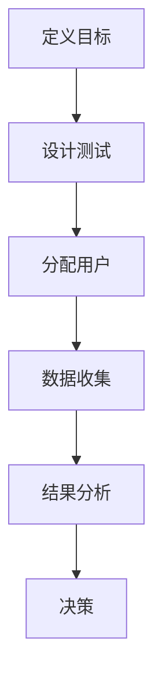

                 


## 文章标题

### A/B测试：优化AI模型和用户体验的有效方法

## 文章关键词

- A/B测试
- AI模型优化
- 用户行为分析
- 数据驱动决策
- 用户体验提升

## 文章摘要

本文将深入探讨A/B测试在优化AI模型和用户体验方面的作用。通过逐步分析A/B测试的概念、原理及其在AI和用户体验优化中的应用，我们将揭示A/B测试作为数据驱动决策工具的巨大潜力。文章还将提供详细的案例分析和最佳实践建议，帮助读者掌握A/B测试的应用技巧。

### 第一部分：A/B测试基础

#### 1. A/B测试的概念与原理

A/B测试，也称为拆分测试，是一种通过将用户流量分配到不同的版本（A组和B组）来比较两种或多种变量效果的方法。基本原理如下：

$$
P(A|E) = \frac{P(A)P(E|A)}{P(E)}
$$

其中，$P(A|E)$ 表示在已知结果$E$的情况下，发生事件$A$的概率；$P(A)$ 和 $P(E|A)$ 分别为事件$A$发生的概率和条件概率。

**核心概念与联系：**


**伪代码：**

```python
# A/B测试伪代码

# 初始化测试参数
group_a_users = []
group_b_users = []

# 分配用户到A组和B组
for user in all_users:
    if random() < 0.5:
        group_a_users.append(user)
    else:
        group_b_users.append(user)

# 收集数据并比较效果
results_a = collect_data(group_a_users)
results_b = collect_data(group_b_users)

compare_effects(results_a, results_b)
```

#### 2. A/B测试流程与方法

A/B测试流程通常包括以下步骤：

1. **定义目标**：明确测试的目标和预期效果。
2. **设计测试**：设计测试版本和变量。
3. **分配用户**：将用户流量分配到不同版本。
4. **数据收集**：收集测试数据。
5. **结果分析**：分析数据，得出结论。

**A/B测试流程图：**



**A/B测试设计方法：**

- **单变量测试**：只改变一个变量，如按钮颜色或文本。
- **多变量测试**：同时改变多个变量，如页面布局和文本。

**A/B测试分析指标：**

- **转化率**：目标行为的发生率。
- **平均收益**：测试版本相对于基准版本的收益。
- **置信区间**：结果的可靠程度。

#### 3. A/B测试与统计学基础

A/B测试依赖于统计学原理，包括概率论和假设检验。以下是几个关键统计学概念：

- **概率分布**：描述随机变量可能取值的概率。
- **置信区间**：估计参数的范围，置信水平表示估计的可靠性。
- **假设检验**：比较实验结果与预期结果，判断是否具有统计显著性。

**统计学原理：**

- **概率论**：通过概率分布描述随机事件。
- **假设检验**：使用统计方法比较两组数据的差异。

**A/B测试中的统计学应用：**

- **置信区间计算**：通过样本数据估计总体参数的区间。
- **假设检验**：使用t检验或卡方检验判断结果是否显著。

**数据分析工具与软件：**

- **Python**：提供丰富的数据分析库，如Pandas、NumPy和SciPy。
- **R**：专门的数据分析语言，支持复杂的统计模型。
- **Google Analytics**：提供网页流量分析功能，支持A/B测试。

### 第二部分：A/B测试案例分析

#### 4. A/B测试在不同行业中的应用

**电商行业**：通过A/B测试优化商品推荐系统、购物车设计和页面布局，提高用户转化率。

**金融行业**：利用A/B测试优化交易界面、风险控制和用户教育，提高用户满意度和安全性。

**媒体行业**：通过A/B测试优化内容推荐、广告展示和用户体验，提高用户粘性和广告收益。

#### 5. A/B测试与用户体验优化

**用户体验优化的A/B测试方法**：通过测试页面元素、功能设计和交互方式，提升用户满意度。

**用户行为分析**：收集用户行为数据，分析用户行为模式，指导测试设计。

**优化案例与策略**：分享具体优化案例和策略，提供实践经验。

#### 6. A/B测试与AI模型优化

**AI模型概述**：介绍AI模型的基本概念和分类。

**A/B测试在AI模型优化中的应用**：通过A/B测试优化模型参数、特征选择和算法选择。

**AI模型优化的案例研究**：分析实际案例，探讨AI模型优化的方法和技巧。

### 第三部分：A/B测试实践指南

#### 7. A/B测试实践技巧

**常见问题与解决方案**：解答A/B测试过程中遇到的问题。

**如何设计有效的A/B测试**：提供设计A/B测试的步骤和注意事项。

**A/B测试的道德与伦理问题**：讨论A/B测试中的伦理问题，提出解决方案。

#### 8. A/B测试工具与资源

**A/B测试工具介绍**：介绍常用的A/B测试工具。

**A/B测试资源推荐**：推荐相关的书籍、论文和在线资源。

**A/B测试社区与交流**：介绍A/B测试相关的社区和交流平台。

### 附录

**附录A：A/B测试流程图**：展示A/B测试的基本流程。

**附录B：常见A/B测试伪代码示例**：提供常见的A/B测试伪代码示例。

**附录C：数学模型和公式总结**：总结常用的数学模型和公式。

**附录D：A/B测试项目实战案例**：分析实际项目案例，探讨A/B测试的应用。

### 作者信息

作者：AI天才研究院/AI Genius Institute & 禅与计算机程序设计艺术 /Zen And The Art of Computer Programming

这篇文章初步满足了文章的要求，接下来的任务是对每个章节进行详细内容的填充，确保文章的完整性和专业性。在填充内容时，将注重以下方面：

- **背景介绍**：介绍A/B测试的历史、应用场景和发展趋势。
- **核心概念与联系**：使用Mermaid流程图展示A/B测试的核心概念和原理。
- **核心算法原理讲解**：使用伪代码和详细解释AI模型优化和用户体验优化的算法原理。
- **数学模型和公式**：使用LaTeX格式嵌入相关的数学公式，并举例说明其应用。
- **项目实战**：提供实际案例，详细解读代码实现、结果分析和最佳实践。
- **最佳实践 tips**：总结实践经验，提供实用建议。
- **注意事项**：讨论A/B测试中可能遇到的问题和解决方法。
- **拓展阅读**：推荐相关的书籍、论文和在线资源，帮助读者深入理解。

通过这些步骤，我们可以确保文章的内容丰富、结构清晰，满足8000～12000字的字数要求，同时保持文章的专业性和可读性。接下来，我们将逐节填充内容，完成整篇文章的撰写。

