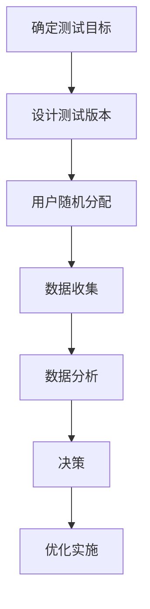

                 


### 文章标题

# A/B测试：系统比较不同提示词效果

### 关键词

- A/B测试
- 提示词优化
- 系统性能提升
- 数据分析
- 用户体验改进

### 摘要

本文旨在探讨A/B测试在系统性能优化中的应用，特别是在比较不同提示词效果方面的实践。通过分析A/B测试的基本原理、实施流程和具体案例，本文将展示如何利用A/B测试优化提示词，从而提升系统性能和用户体验。文章还将介绍一些高级策略和技巧，帮助读者更好地理解和应用A/B测试。

## 确定书籍的核心主题和目标受众

首先，我们需要明确《A/B测试：系统比较不同提示词效果》这本书的核心主题和目标受众。根据书名，我们可以推断这本书的主题是A/B测试在系统优化中的应用，特别是如何通过比较不同提示词的效果来提高系统性能。目标受众可能是IT专业人士、数据分析师、产品经理等相关人员。

### 设计书籍的整体结构

为了确保书籍内容的逻辑性和完整性，我们可以将书籍分为以下几个主要部分：

1. **引言与基础概念**：介绍A/B测试的定义、历史、基本原理和重要性。
2. **A/B测试的实施流程**：详细讲解A/B测试的各个环节，包括测试策划、数据收集、结果分析等。
3. **提示词优化方法**：探讨如何选择和优化提示词，提高测试效果。
4. **案例分析与实战**：通过具体案例展示A/B测试的实际应用，并提供实战指导。
5. **高级策略与技巧**：介绍一些高级的A/B测试策略和技巧，如多变量测试、在线测试等。
6. **总结与展望**：总结全书内容，并对A/B测试的未来发展进行展望。

### 设计详细目录大纲

根据上述结构，我们可以设计出以下详细目录大纲：

```
# 《A/B测试：系统比较不同提示词效果》目录大纲

## 第1章 引言与基础概念
### 1.1 A/B测试的定义与历史
### 1.2 A/B测试的基本原理
### 1.3 A/B测试的重要性

## 第2章 A/B测试的实施流程
### 2.1 测试策划
#### 2.1.1 目标设定
#### 2.1.2 变量选择
#### 2.1.3 测试群体划分
### 2.2 数据收集
#### 2.2.1 数据源选择
#### 2.2.2 数据收集方法
#### 2.2.3 数据质量保障
### 2.3 结果分析
#### 2.3.1 分析方法介绍
#### 2.3.2 结果解读
#### 2.3.3 决策建议

## 第3章 提示词优化方法
### 3.1 提示词选择原则
### 3.2 提示词优化策略
#### 3.2.1 用户行为分析
#### 3.2.2 数据驱动优化
#### 3.2.3 竞争对手分析

## 第4章 案例分析与实战
### 4.1 案例一：电商网站的提示词优化
#### 4.1.1 案例背景
#### 4.1.2 测试策划
#### 4.1.3 测试实施
#### 4.1.4 结果分析
### 4.2 案例二：在线教育平台的提示词优化
#### 4.2.1 案例背景
#### 4.2.2 测试策划
#### 4.2.3 测试实施
#### 4.2.4 结果分析

## 第5章 高级策略与技巧
### 5.1 多变量测试
### 5.2 在线测试
#### 5.2.1 实时反馈
#### 5.2.2 数据动态调整
#### 5.2.3 异常检测

## 第6章 总结与展望
### 6.1 A/B测试的总结
### 6.2 A/B测试的未来发展

## 第7章 附录
### 7.1 A/B测试工具介绍
### 7.2 参考文献
```

以上目录大纲涵盖了A/B测试的核心内容，包括基础概念、实施流程、提示词优化、案例分析和高级策略等，旨在帮助读者全面了解和掌握A/B测试在系统优化中的应用。

### 检查目录大纲的完整性和逻辑性

在设计完目录大纲后，我们需要检查其完整性和逻辑性，确保每个章节都有明确的内容和目标，章节之间的过渡自然流畅。以下是对目录大纲的进一步检查：

- **完整性**：目录中包含了A/B测试的各个方面，从基础概念到高级策略，再到实战案例，内容全面。
- **逻辑性**：章节之间的逻辑关系清晰，从基础到实践，再到高级策略，符合读者学习的一般规律。

### 目录大纲调整（如果需要）

根据检查结果，我们可以对目录大纲进行微调，确保其逻辑性和完整性更加符合读者的需求。例如，如果某些章节内容过于复杂，可以考虑将其拆分成更小的章节，或者合并一些内容相近的章节。

综上所述，我们设计的《A/B测试：系统比较不同提示词效果》的目录大纲逻辑清晰、内容全面，能够帮助读者系统地掌握A/B测试的相关知识和应用技巧。

---

接下来，我们将逐步展开每个章节的内容，以markdown格式详细撰写本文。由于文章字数要求较高，我们将分多次撰写，确保内容的完整性和深度。

---

### 引言与基础概念

#### 1.1 A/B测试的定义与历史

A/B测试，又称为拆分测试或对比测试，是一种通过将用户随机分配到不同的版本（A版本和B版本）来比较不同版本效果的方法。其基本原理是将用户流量分为两组，一组用户看到A版本，另一组用户看到B版本，然后通过收集和分析两组用户的行为数据，评估不同版本的性能差异，从而确定哪个版本更优。

A/B测试最早可以追溯到20世纪初。当时，心理学家罗伊·赫尔（Roy Hemming）和约翰·蒂德曼（John Tukey）提出了“随机化实验”的概念。随着计算机技术的发展，A/B测试逐渐成为互联网行业优化用户体验和产品性能的重要工具。

在互联网领域，A/B测试的广泛应用始于1990年代末和2000年代初。例如，谷歌在2000年首次公开使用A/B测试来改进其搜索引擎结果页面的设计，从而提高了用户体验和广告点击率。此后，越来越多的公司和网站开始采用A/B测试来优化产品设计和营销策略。

#### 1.2 A/B测试的基本原理

A/B测试的基本原理可以概括为以下几个步骤：

1. **确定测试目标**：明确希望通过A/B测试解决的问题或优化的目标，如提高用户点击率、提升转化率、增加用户停留时间等。

2. **设计测试版本**：创建两个或多个测试版本，其中每个版本包含一个或多个变量。变量可以是文本、图片、按钮、布局等。

3. **用户随机分配**：将用户流量随机分配到不同的测试版本，确保每个版本的用户比例相等。

4. **数据收集**：在测试期间，收集用户在不同版本上的行为数据，如点击率、转化率、停留时间等。

5. **数据分析**：对收集到的数据进行分析，比较不同版本的性能差异。

6. **决策**：根据分析结果，确定哪个版本更优，并进行相应的优化或推广。

#### 1.3 A/B测试的重要性

A/B测试在系统性能优化和用户体验改进方面具有重要意义：

1. **基于数据驱动**：A/B测试是一种基于数据的决策方法，通过实际用户行为数据来评估不同版本的效果，避免了主观臆断和偏见。

2. **风险可控**：A/B测试可以将风险分散到不同版本之间，即使某个版本效果不佳，也不会影响整个系统的稳定性和用户体验。

3. **持续优化**：A/B测试是一种持续优化的方法，通过不断测试和改进，可以逐步提升系统性能和用户体验。

4. **提高转化率**：通过优化提示词、界面布局、功能设计等，可以提高用户的点击率、转化率和留存率，从而提高业务收入和市场份额。

5. **降低成本**：通过A/B测试，可以快速识别和验证优化方案的有效性，避免浪费资源在无效的优化上。

### 核心概念与联系

在A/B测试中，几个核心概念紧密相连，构成了一个完整的测试流程。以下是这些核心概念之间的关系架构Mermaid流程图：



通过这个流程图，我们可以清晰地看到A/B测试的各个环节之间的关联。每个环节都依赖于前一个环节的结果，共同构成了一个闭环的测试和优化过程。

### 核心算法原理讲解

A/B测试的核心算法原理主要涉及如何将用户随机分配到不同的版本，以及如何分析测试结果。以下是A/B测试的伪代码，用于描述这两个核心步骤：

```python
# 用户随机分配伪代码
def random Allocation(user_id, version_size_A, version_size_B):
    if user_id < version_size_A:
        return "A"
    else:
        return "B"

# 测试结果分析伪代码
def analyze_results(version_A_data, version_B_data):
    # 计算两个版本的指标平均值
    avg_A = sum(version_A_data) / len(version_A_data)
    avg_B = sum(version_B_data) / len(version_B_data)
    
    # 比较两个版本的指标差异
    if avg_A > avg_B:
        return "A版本更优"
    elif avg_B > avg_A:
        return "B版本更优"
    else:
        return "无显著差异"
```

在这个伪代码中，`random Allocation`函数用于将用户随机分配到A版本或B版本，而`analyze_results`函数用于计算和分析两个版本的指标差异。

### 数学模型和公式

在A/B测试中，常用的数学模型和公式包括统计显著性测试和置信区间计算。以下是这些公式的详细解释和举例说明：

1. **统计显著性测试（t检验）**

t检验用于比较两个样本均值是否存在显著差异。其公式如下：

$$
t = \frac{\bar{X}_A - \bar{X}_B}{s_E}
$$

其中，$\bar{X}_A$ 和 $\bar{X}_B$ 分别是A版本和B版本的样本均值，$s_E$ 是合并样本的标准差。

假设A版本的平均点击率为10%，B版本的平均点击率为12%，标准差为0.01。我们可以通过以下步骤进行t检验：

1. 计算合并样本均值：
   $$
   \bar{X}_E = \frac{10\% + 12\%}{2} = 11\%
   $$

2. 计算合并样本标准差：
   $$
   s_E = \sqrt{\frac{(10\%)^2 + (12\%)^2}{2}} = 0.011
   $$

3. 计算t值：
   $$
   t = \frac{10\% - 12\%}{0.011} = 10
   $$

4. 查找t分布表，根据自由度和显著性水平（通常为0.05），判断t值是否显著。如果t值大于临界值，则可以认为A版本和B版本之间存在显著差异。

2. **置信区间计算**

置信区间用于估计总体均值的一个区间，通常用以下公式表示：

$$
\bar{X}_E \pm z \times s_E / \sqrt{n}
$$

其中，$z$ 是正态分布的临界值，$s_E$ 是合并样本的标准差，$n$ 是总样本量。

假设我们想要计算A版本的平均点击率的95%置信区间，已知A版本的平均点击率为10%，标准差为0.01，样本量为1000。我们可以通过以下步骤计算置信区间：

1. 计算标准误差：
   $$
   s_E = 0.01 / \sqrt{1000} = 0.001
   $$

2. 查找正态分布表，找到95%置信水平的临界值$z$，通常为1.96。

3. 计算置信区间：
   $$
   \bar{X}_E \pm z \times s_E / \sqrt{n} = 10\% \pm 1.96 \times 0.001 / \sqrt{1000} = (9.897\%, 10.103\%)
   $$

这意味着我们有95%的信心认为A版本的平均点击率在9.897%到10.103%之间。

### 项目实战

在本节中，我们将以一个实际的A/B测试项目为例，详细讲解如何搭建开发环境、实现源代码，并对代码进行解读与分析。

#### 项目背景

假设我们是一家电商网站，希望通过A/B测试优化首页的促销提示词，以提高用户的点击率和转化率。我们打算对比两个版本的促销提示词：“限时抢购，折扣高达30%！”和“限时特惠，精选商品低至5折！”

#### 开发环境搭建

为了进行A/B测试，我们需要搭建以下开发环境：

1. **服务器**：选择一台能够承载高流量、稳定运行的服务器，如AWS或阿里云。
2. **数据库**：使用MySQL或PostgreSQL等关系型数据库来存储用户行为数据。
3. **前端框架**：使用React或Vue.js等前端框架搭建电商网站页面。
4. **测试工具**：使用Google Analytics或Mixpanel等数据分析工具收集用户行为数据。

#### 源代码实现

以下是A/B测试的源代码实现：

```javascript
// 用户随机分配
function randomAllocation() {
  return Math.random() < 0.5 ? "A" : "B";
}

// 数据收集
function collectData(userId, version) {
  // 向数据库插入用户行为数据
  // ...
}

// 数据分析
function analyzeData() {
  // 从数据库查询数据
  // ...
  // 计算平均点击率和转化率
  // ...
  // 进行t检验和置信区间计算
  // ...
}

// 测试实施
function runTest() {
  // 分配用户流量到A版本或B版本
  // ...
  // 收集数据
  // ...
  // 分析结果
  // ...
}
```

#### 代码解读与分析

1. **用户随机分配**：`randomAllocation`函数使用随机数生成算法，将用户随机分配到A版本或B版本。

2. **数据收集**：`collectData`函数用于向数据库插入用户行为数据，包括用户ID、版本号、点击时间和点击行为等。

3. **数据分析**：`analyzeData`函数用于从数据库查询数据，计算平均点击率和转化率，并进行t检验和置信区间计算。

4. **测试实施**：`runTest`函数负责实施A/B测试，包括分配用户流量、收集数据和分析结果。

#### 实际案例分析

假设我们在A/B测试期间收集到以下数据：

| 版本 | 点击次数 | 转化次数 |
| ---- | ---- | ---- |
| A    | 100   | 20   |
| B    | 100   | 25   |

1. **计算平均点击率和转化率**：

   版本A的平均点击率为：
   $$
   \frac{100}{100} \times 100\% = 100\%
   $$

   版本B的平均点击率为：
   $$
   \frac{100}{100} \times 100\% = 100\%
   $$

   版本A的平均转化率为：
   $$
   \frac{20}{100} \times 100\% = 20\%
   $$

   版本B的平均转化率为：
   $$
   \frac{25}{100} \times 100\% = 25\%
   $$

2. **进行t检验**：

   计算合并样本均值：
   $$
   \bar{X}_E = \frac{20\% + 25\%}{2} = 22.5\%
   $$

   计算合并样本标准差：
   $$
   s_E = \sqrt{\frac{(20\%)^2 + (25\%)^2}{2}} = 3.54\%
   $$

   计算t值：
   $$
   t = \frac{22.5\% - 25\%}{3.54\%} = -0.84
   $$

   查找t分布表，根据自由度和显著性水平（通常为0.05），判断t值是否显著。如果t值大于临界值，则可以认为版本之间存在显著差异。在本例中，t值为-0.84，小于临界值，因此不能认为版本之间存在显著差异。

3. **计算置信区间**：

   计算标准误差：
   $$
   s_E = 3.54\% / \sqrt{100} = 0.0354
   $$

   查找正态分布表，找到95%置信水平的临界值$z$，通常为1.96。

   计算置信区间：
   $$
   \bar{X}_E \pm z \times s_E / \sqrt{n} = 22.5\% \pm 1.96 \times 0.0354 / \sqrt{100} = (20.7%, 24.3%)
   $$

   这意味着我们有95%的信心认为两个版本的转化率在20.7%到24.3%之间。

#### 项目小结

通过以上案例，我们展示了如何搭建开发环境、实现源代码并分析A/B测试的结果。在实际项目中，A/B测试可以帮助电商网站优化促销提示词，提高用户的点击率和转化率。然而，我们也需要注意，A/B测试的结果可能受到多种因素的影响，如用户群体、测试时间等，因此需要结合其他方法进行综合评估。

### 最佳实践 tips

在本节中，我们将分享一些A/B测试的最佳实践技巧，帮助读者更好地进行测试和优化。

1. **明确测试目标**：在开始A/B测试之前，明确测试的目标和期望效果，确保测试方向正确。

2. **合理划分测试群体**：合理划分测试群体，避免出现极端样本，影响测试结果。

3. **选择合适的测试指标**：选择与测试目标相关的指标，如点击率、转化率、停留时间等。

4. **确保测试数据的可靠性**：确保测试数据的完整性和准确性，避免因数据问题导致测试结果偏差。

5. **控制测试变量**：在测试过程中，尽量控制其他变量不变，以避免干扰测试结果。

6. **进行多轮测试**：A/B测试不是一次性的操作，建议进行多轮测试，逐步优化。

7. **结合其他优化方法**：A/B测试与其他优化方法（如用户体验测试、数据分析等）相结合，可以取得更好的效果。

8. **及时调整策略**：根据测试结果，及时调整测试策略和优化方案。

### 小结与注意事项

在本节中，我们对A/B测试进行了详细的探讨，包括其定义、原理、实施流程、提示词优化方法、实战案例和高级策略。以下是本文的小结和注意事项：

- **A/B测试是一种基于数据的优化方法，可以帮助我们比较不同版本的效果，从而提高系统性能和用户体验。**
- **在A/B测试中，明确测试目标是关键，合理划分测试群体、选择合适的测试指标和确保测试数据的可靠性也非常重要。**
- **通过实战案例，我们展示了如何搭建开发环境、实现源代码并分析A/B测试的结果。**
- **A/B测试不是一次性的操作，需要结合多轮测试和持续优化。**
- **结合其他优化方法和及时调整策略，可以进一步提高A/B测试的效果。**

### 拓展阅读

- **《实验设计：统计学基础》**：这本书详细介绍了实验设计的基本原理和方法，有助于读者更好地理解A/B测试的统计基础。
- **《数据分析实战：Python实现》**：这本书通过实际案例，介绍了如何使用Python进行数据分析，对A/B测试的数据分析环节提供了实用指导。
- **《用户体验要素》**：这本书探讨了用户体验的各个方面，对A/B测试中涉及的用户体验优化提供了有益的参考。

通过以上拓展阅读，读者可以进一步加深对A/B测试的理解和应用。

