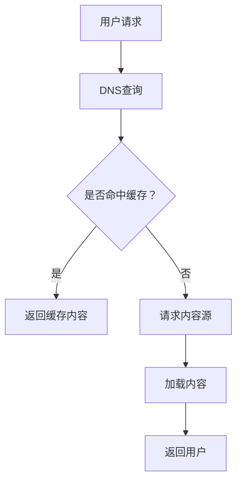

                 

## 文章标题

### CDN加速：优化LLM应用的资源分发

---

关键词：内容分发网络（CDN）、大型语言模型（LLM）、资源分发、性能优化、分布式计算

---

摘要：随着大型语言模型（LLM）应用的不断普及，如何在网络环境中高效地分发这些资源成为了一个关键问题。内容分发网络（CDN）作为一种优化资源分发的重要技术，其在LLM应用中的角色愈发重要。本文将详细介绍CDN的基础原理、工作流程以及如何在LLM应用中进行优化，帮助读者更好地理解和应用CDN技术，以提升LLM应用的性能和用户体验。

---

## 第一部分：CDN基础与原理

### 1.1 CDN概述

#### 1.1.1 CDN的定义与作用

内容分发网络（Content Delivery Network，CDN）是一种分布式网络架构，通过在多个地理位置上部署节点，实现互联网内容的快速分发和传输。CDN的主要作用是加速内容的访问速度，提高用户体验，同时降低网络拥塞和带宽成本。

#### 1.1.2 CDN的发展历史

CDN技术起源于20世纪90年代末，最初由Akamai公司提出并实现。随着互联网的快速发展，CDN技术逐渐成为互联网基础设施的重要组成部分。

#### 1.1.3 CDN的关键技术

CDN的关键技术包括DNS优化、缓存机制、内容分发策略和负载均衡。这些技术共同作用，确保了CDN的高效运行。

### 1.2 CDN工作原理

#### 1.2.1 CDN的基本架构

CDN的基本架构包括三个部分：边缘节点、缓存节点和数据中心。边缘节点位于网络边缘，直接服务于终端用户；缓存节点负责缓存热门内容，降低访问延迟；数据中心是整个CDN的核心，负责内容的管理和调度。

#### 1.2.2 CDN的请求处理流程

当用户发起请求时，CDN通过DNS解析将请求路由到最近的边缘节点；边缘节点检查缓存，若命中则直接返回内容，否则从数据中心获取内容并缓存。

#### 1.2.3 CDN的数据分发机制

CDN采用多路径传输和负载均衡技术，确保数据传输的高效和稳定。同时，通过内容压缩和加密技术，提升数据传输速度和安全性。

### 1.3 CDN与LLM应用的关系

#### 1.3.1 LLM应用的资源需求

大型语言模型（LLM）应用通常需要处理大量的文本数据，对计算资源和网络带宽有较高要求。这使得优化资源分发成为LLM应用面临的重要问题。

#### 1.3.2 CDN在LLM应用中的优势

CDN能够通过分布式架构和智能缓存策略，降低LLM应用的访问延迟，提高数据传输速度，从而提升用户体验。

#### 1.3.3 CDN对LLM应用的挑战

尽管CDN在优化LLM应用资源分发方面具有优势，但同时也面临着数据安全、成本控制和运维管理等挑战。

## 第二部分：LLM应用资源分发优化

### 2.1 资源分发策略

#### 2.1.1 内容分发策略

内容分发策略决定了CDN如何将内容分发给用户。常见的策略包括基于地理位置的就近分发、基于请求频率的热点分发等。

#### 2.1.2 资源负载均衡策略

资源负载均衡策略确保CDN节点能够高效地处理请求，避免单点过载。常用的负载均衡算法包括轮询、最少连接、源IP哈希等。

#### 2.1.3 智能缓存策略

智能缓存策略通过预测用户行为，缓存热门内容，降低访问延迟。常用的缓存策略包括基于时间的缓存、基于访问频率的缓存等。

### 2.2 CDN加速技术

#### 2.2.1 DNS优化

DNS优化通过缩短DNS解析时间，提高CDN服务的响应速度。常见的DNS优化技术包括DNS预解析、DNS缓存等。

#### 2.2.2 资源压缩

资源压缩通过减少数据传输量，降低网络带宽消耗。常见的压缩技术包括HTTP压缩、Gzip压缩等。

#### 2.2.3 缓存机制

缓存机制通过存储已访问内容，减少重复请求，降低服务器负载。常见的缓存技术包括浏览器缓存、CDN缓存等。

### 2.3 LLM应用的优化案例分析

#### 2.3.1 案例一：大型机器学习模型服务加速

本案例介绍了如何通过CDN加速大型机器学习模型服务的分发，提高用户体验。主要策略包括资源压缩、智能缓存和负载均衡。

#### 2.3.2 案例二：实时文本分析服务优化

本案例分析了如何通过CDN优化实时文本分析服务的性能，降低延迟，提高响应速度。主要策略包括DNS优化、内容压缩和分布式缓存。

#### 2.3.3 案例三：分布式训练环境优化

本案例探讨了如何在分布式训练环境中使用CDN优化资源分发，提高训练效率和稳定性。主要策略包括节点规划、负载均衡和智能缓存。

## 第三部分：CDN在实际应用中的部署与维护

### 3.1 CDN部署规划

#### 3.1.1 CDN节点规划

CDN节点规划是确保CDN服务稳定性和高效性的关键。本节介绍了如何根据业务需求和网络环境规划CDN节点。

#### 3.1.2 CDN容量规划

CDN容量规划决定了CDN服务能够承载的最大访问量。本节介绍了如何根据业务需求和流量预测规划CDN容量。

#### 3.1.3 CDN性能优化策略

CDN性能优化策略包括网络优化、缓存优化和负载均衡优化等。本节介绍了如何通过这些策略提高CDN服务的性能。

### 3.2 CDN运维管理

#### 3.2.1 CDN监控与故障处理

CDN监控与故障处理是保障CDN服务稳定运行的重要环节。本节介绍了如何监控CDN服务性能，处理故障和优化运维流程。

#### 3.2.2 CDN安全策略

CDN安全策略包括数据加密、访问控制和安全审计等。本节介绍了如何保障CDN服务的安全性。

#### 3.2.3 CDN成本控制

CDN成本控制是确保CDN服务可持续发展的关键。本节介绍了如何通过成本优化策略降低CDN服务成本。

### 3.3 CDN未来发展趋势

#### 3.3.1 CDN与云计算的结合

随着云计算的兴起，CDN与云计算的结合成为未来发展趋势。本节介绍了如何通过云计算实现CDN服务的弹性扩展和高效管理。

#### 3.3.2 CDN与人工智能的融合

人工智能技术在CDN中的应用将为资源分发和优化带来新的机遇。本节介绍了如何通过人工智能技术提升CDN服务的智能化水平。

#### 3.3.3 CDN在边缘计算中的应用

边缘计算的发展为CDN带来了新的应用场景。本节介绍了如何通过边缘计算实现CDN服务的就近服务和高性能传输。

## 第四部分：附录

### 4.1 CDN相关工具与资源

#### 4.1.1 CDN服务提供商

本节介绍了常用的CDN服务提供商，包括Akamai、Cloudflare和阿里云等。

#### 4.1.2 CDN开源工具

本节介绍了常用的CDN开源工具，如Varnish、Nginx和CDN-Proxy等。

#### 4.1.3 CDN相关标准与规范

本节介绍了CDN相关的国际标准和规范，如HTTP/2、QUIC协议等。

### 4.2 Mermaid流程图与伪代码示例

#### 4.2.1 Mermaid流程图示例



#### 4.2.2 伪代码示例

```python
# 定义函数：资源分发策略
def resource_distribution():
    # 判断用户请求的内容
    content = get_user_request()
    # 检查缓存
    if cache_hit(content):
        # 返回缓存内容
        return get_cached_content(content)
    else:
        # 请求内容源
        content = get_content_from_source()
        # 存入缓存
        cache_content(content)
        # 返回内容
        return content
```

---

作者：AI天才研究院/AI Genius Institute & 禅与计算机程序设计艺术 /Zen And The Art of Computer Programming

---

## 文章小结

本文从CDN的基础原理、资源分发策略、优化技术和实际应用等方面，详细探讨了如何优化LLM应用的资源分发。通过本文的介绍，读者可以了解到CDN在LLM应用中的重要作用，以及如何通过CDN技术提升LLM应用的性能和用户体验。在未来的发展中，随着云计算、人工智能和边缘计算的不断发展，CDN技术将在更多领域发挥重要作用，为互联网应用提供更高效、更可靠的资源分发服务。希望本文能为读者在相关领域的研究和应用提供有益的参考。

