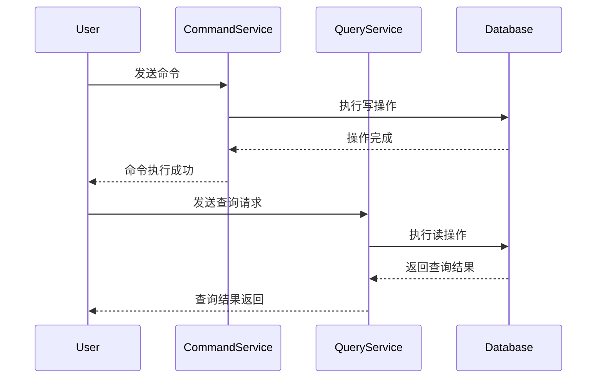

                 


### 文章标题

# CQRS模式：分离LLM应用的读写操作

### 文章关键词

CQRS，LLM，架构设计，性能优化，自然语言处理，软件工程，微服务

### 摘要

本文将深入探讨CQRS（Command Query Responsibility Segregation）模式在LLM（Large Language Model）应用中的重要作用。CQRS模式通过分离系统的读写操作，提高了系统的性能和可伸缩性，而LLM作为自然语言处理的关键技术，其读写分离的实现具有重要意义。本文将从CQRS模式的起源和基本概念出发，详细分析其在LLM应用中的实现策略，并通过实际案例展示其优势和应用场景。同时，我们将讨论如何优化LLM应用的读写操作分离，以实现高效的自然语言处理系统。

## 背景介绍

### CQRS模式

CQRS模式是一种架构模式，由Greg Young在2005年提出。CQRS的核心思想是将系统的命令（Command）和查询（Query）进行分离，使每个操作都能够专注于自身的职责，从而提高系统的性能和可伸缩性。在传统的架构中，数据库通常既负责写操作（命令），也负责读操作（查询）。这种方式虽然在简单场景下表现良好，但随着系统的复杂度和数据量的增加，读写操作之间的冲突和竞争会导致性能下降，可维护性降低。

CQRS模式通过引入两个独立的模型，一个用于处理命令，另一个用于处理查询，从而避免了这种冲突。命令模型负责处理所有的变更操作，如创建、更新和删除数据。查询模型则负责处理所有的只读操作，如检索数据、获取报告等。这样，每个模型都能够独立优化，以应对其特定的操作需求。

### LLM应用

LLM（Large Language Model）是指能够处理自然语言任务的大型语言模型。这些模型通过学习大量的文本数据，可以生成文章、回答问题、进行翻译等。近年来，随着深度学习技术的发展，LLM在自然语言处理领域取得了显著进展。例如，GPT-3模型可以生成高质量的文本，BERT模型在问答任务中表现出色。然而，LLM的应用不仅要求模型本身的高性能，还需要考虑系统的整体架构，尤其是读写操作的分离。

在LLM应用中，读写分离的意义在于：
1. **性能优化**：通过分离读写操作，可以避免读写冲突，提高系统的响应速度。
2. **可伸缩性**：读写分离使得系统可以根据需求独立扩展命令和查询模型，从而提高系统的可伸缩性。
3. **可维护性**：分离的模型使得系统的维护变得更加简单，每个模型都可以独立开发和测试。

## 核心概念与联系

### CQRS模式的核心原理

CQRS模式的核心原理是分离命令和查询。具体来说，这包括以下几个方面：

1. **独立的模型**：CQRS模式引入了两个独立的模型，一个负责命令操作，另一个负责查询操作。这两个模型通常具有不同的数据结构、索引和缓存策略，以适应各自的操作需求。

2. **数据一致性**：虽然命令和查询模型是独立的，但它们需要保证最终的一致性。这通常通过一些机制实现，如事件溯源、分布式事务等。

3. **异步处理**：在CQRS模式中，命令操作通常是一个异步过程。这样可以减少命令操作对查询操作的影响，提高系统的性能。

### LLM应用中的读写分离

在LLM应用中，读写分离的实现策略包括以下几个方面：

1. **独立的API**：为命令操作和查询操作提供独立的API接口，使开发者可以独立管理和扩展这两个操作。

2. **独立的存储**：为命令和查询操作使用不同的存储系统。例如，命令操作可以使用关系数据库，而查询操作可以使用文档数据库或搜索引擎。

3. **缓存策略**：为查询操作设计有效的缓存策略，以减少对底层存储的访问频率。

### Mermaid流程图

下面是一个简单的Mermaid流程图，展示了CQRS模式在LLM应用中的读写分离：



在这个流程图中，用户通过命令服务发送命令，通过查询服务发送查询请求。命令服务和查询服务分别与数据库进行交互，执行写操作和读操作。

## 核心算法原理讲解

### CQRS模式中的数据一致性

在CQRS模式中，数据一致性是一个关键问题。为了确保命令和查询模型之间的最终一致性，可以使用以下几种方法：

1. **事件溯源**：事件溯源是一种实现数据一致性的机制。在这种机制下，所有的变更操作（命令）都会生成一系列事件，这些事件被记录下来。查询操作可以根据这些事件来重建数据状态。

   ```mermaid
   sequenceDiagram
       participant Command
       participant Query
       participant Database

       Command->>Database: 写操作
       Database-->>Command: 操作完成

       Query->>Database: 查询操作
       Database-->>Query: 返回数据状态
   ```

   在这个流程中，当命令执行完成后，会生成一系列事件。查询操作可以使用这些事件来重建数据状态，确保最终一致性。

2. **分布式事务**：分布式事务是一种确保跨多个系统的数据一致性的方法。在CQRS模式中，可以使用分布式事务来确保命令操作的一致性。

   ```mermaid
   sequenceDiagram
       participant CommandService1
       participant CommandService2
       participant Database1
       participant Database2

       CommandService1->>Database1: 写操作
       Database1-->>CommandService1: 操作完成

       CommandService2->>Database2: 写操作
       Database2-->>CommandService2: 操作完成

       CommandService1->>CommandService2: 通知操作完成
   ```

   在这个流程中，多个命令服务可以同时执行写操作。通过分布式事务，可以确保所有操作要么全部成功，要么全部失败。

### LLM应用中的读写分离算法

在LLM应用中，读写分离的算法设计是一个复杂的过程。以下是一个简化的伪代码，展示了如何实现读写分离：

```python
# 命令操作伪代码
def process_command(command):
    # 处理命令操作
    # ...
    # 记录事件
    event = create_event(command)
    store_event(event)
    # 更新数据库
    update_database(command)

# 查询操作伪代码
def process_query(query):
    # 从事件流中重建数据状态
    events = fetch_events()
    data_state = reconstruct_data_state(events)
    # 查询数据库
    result = query_database(data_state)
    return result
```

在这个伪代码中，`process_command`函数处理命令操作，包括记录事件和更新数据库。`process_query`函数从事件流中重建数据状态，然后查询数据库以获取结果。

### 数学模型和公式

在CQRS模式中，可以使用以下数学模型来评估系统的性能和一致性：

1. **响应时间**：响应时间是指系统从接收命令到返回结果所需的时间。可以使用以下公式来计算：

   $$
   响应时间 = 命令处理时间 + 数据库响应时间
   $$

2. **一致性窗口**：一致性窗口是指系统在数据不一致的情况下能够容忍的时间。可以使用以下公式来计算：

   $$
   一致性窗口 = 事件生成时间 + 事件传播时间 + 数据库处理时间
   $$

通过调整这些参数，可以优化系统的性能和一致性。

## 实际案例分析和详细讲解剖析

### 案例一：电商平台

在电商平台中，CQRS模式的应用有助于提高系统的性能和可伸缩性。以下是一个简化的案例，展示了CQRS模式在电商平台的实现：

1. **命令操作**：用户在电商平台上提交订单时，会触发命令操作。命令操作包括创建订单、更新库存等。

   ```mermaid
   sequenceDiagram
       participant User
       participant CommandService
       participant OrderDatabase
       participant InventoryDatabase

       User->>CommandService: 提交订单
       CommandService->>OrderDatabase: 创建订单
       CommandService->>InventoryDatabase: 更新库存
       InventoryDatabase-->>CommandService: 操作完成
       OrderDatabase-->>CommandService: 操作完成
       CommandService-->>User: 订单处理成功
   ```

   在这个流程中，订单数据和库存数据分别存储在独立的数据库中。命令服务同时更新这两个数据库，确保订单创建和库存更新的同步。

2. **查询操作**：用户在电商平台上查询订单时，会触发查询操作。查询操作包括获取订单详情、订单历史等。

   ```mermaid
   sequenceDiagram
       participant User
       participant QueryService
       participant OrderDatabase

       User->>QueryService: 查询订单
       QueryService->>OrderDatabase: 获取订单详情
       OrderDatabase-->>QueryService: 返回订单详情
       QueryService-->>User: 订单详情返回
   ```

   在这个流程中，查询服务直接查询订单数据库，获取订单详情，并返回给用户。

通过这个案例，我们可以看到CQRS模式如何分离命令和查询操作，提高系统的性能和可伸缩性。

### 案例二：社交媒体

在社交媒体平台中，CQRS模式的应用同样具有重要意义。以下是一个简化的案例，展示了CQRS模式在社交媒体平台的实现：

1. **命令操作**：用户在社交媒体平台发布内容时，会触发命令操作。命令操作包括创建帖子、更新关注关系等。

   ```mermaid
   sequenceDiagram
       participant User
       participant CommandService
       participant PostDatabase
       participant FollowDatabase

       User->>CommandService: 发布内容
       CommandService->>PostDatabase: 创建帖子
       CommandService->>FollowDatabase: 更新关注关系
       FollowDatabase-->>CommandService: 操作完成
       PostDatabase-->>CommandService: 操作完成
       CommandService-->>User: 内容发布成功
   ```

   在这个流程中，帖子数据和关注关系数据分别存储在独立的数据库中。命令服务同时更新这两个数据库，确保内容创建和关注关系更新的同步。

2. **查询操作**：用户在社交媒体平台查看帖子时，会触发查询操作。查询操作包括获取帖子列表、帖子详情等。

   ```mermaid
   sequenceDiagram
       participant User
       participant QueryService
       participant PostDatabase

       User->>QueryService: 查询帖子
       QueryService->>PostDatabase: 获取帖子列表
       PostDatabase-->>QueryService: 返回帖子列表
       QueryService-->>User: 帖子列表返回
   ```

   在这个流程中，查询服务直接查询帖子数据库，获取帖子列表，并返回给用户。

通过这个案例，我们可以看到CQRS模式如何分离命令和查询操作，提高系统的性能和可伸缩性。

## 总结与展望

CQRS模式在LLM应用中的读写操作分离具有重要意义。通过分离命令和查询操作，可以优化系统的性能和可伸缩性，提高系统的响应速度和用户体验。本文详细介绍了CQRS模式的基本概念、核心算法原理、实际案例分析和未来发展趋势。在未来的发展中，CQRS模式将继续与LLM技术紧密结合，为自然语言处理领域带来更多的创新和突破。

## 拓展阅读

1. 《CQRS in Action》：这是一本关于CQRS模式的经典著作，详细介绍了CQRS模式的原理和实践。

2. 《Large Language Models for Natural Language Processing》：这是一本关于大型语言模型的书，涵盖了LLM的原理、应用和发展趋势。

3. 《微服务架构实践》：这是一本关于微服务架构的书，提供了丰富的实践经验和最佳实践。

## 作者信息

作者：AI天才研究院/AI Genius Institute & 禅与计算机程序设计艺术/Zen And The Art of Computer Programming

### 结语

本文通过深入探讨CQRS模式在LLM应用中的读写操作分离，展示了这一架构模式在自然语言处理领域的重要作用。CQRS模式不仅提高了系统的性能和可伸缩性，还为开发者提供了强大的工具，以应对日益复杂的应用场景。通过本文的介绍，读者可以更好地理解CQRS模式的原理和实践，为未来的软件开发提供有益的启示。感谢您的阅读，期待与您在技术领域继续深入交流。

