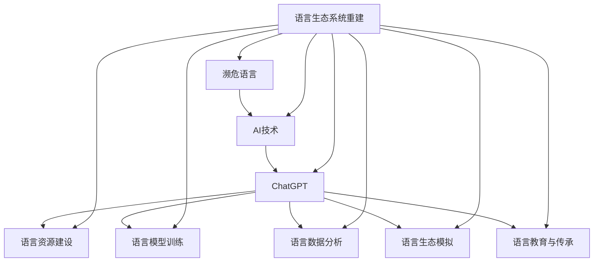

                 

# 文章标题：ChatGPT在濒危语言复兴中的应用：AI驱动的语言生态系统重建

> 关键词：ChatGPT，濒危语言，人工智能，语言生态系统，语言复兴

> 摘要：
本文探讨了人工智能（AI）在濒危语言复兴中的应用，特别是基于GPT（Generative Pre-trained Transformer）模型的ChatGPT。文章首先介绍了ChatGPT的基本原理和特点，然后分析了濒危语言的现状和问题。接着，本文阐述了ChatGPT在濒危语言保护中的潜在应用，包括语言生态系统重建的方法和实际案例。最后，文章总结了ChatGPT在濒危语言复兴中的优势和挑战，并提出了未来研究方向。

## 引言

在全球化和信息化的浪潮中，许多语言正面临濒危和消失的威胁。据联合国教科文组织统计，目前世界上超过一半的语言处于濒危状态，其中约一半的语言可能在未来的百年内消失。这种现象不仅导致了人类文化多样性的丧失，还对语言生态系统的平衡产生了影响。为了挽救这些濒危语言，我们需要寻找有效的保护方法。

近年来，人工智能（AI）的发展为濒危语言保护带来了新的机遇。特别是基于GPT模型的ChatGPT，作为一种强大的语言处理工具，它在生成文本、翻译、问答等方面表现出色。本文将探讨ChatGPT在濒危语言复兴中的应用，分析其如何通过AI驱动的语言生态系统重建，为濒危语言的保护和复兴提供支持。

## ChatGPT的基本原理和应用

### ChatGPT的原理

ChatGPT是基于GPT（Generative Pre-trained Transformer）模型的一种预训练语言模型。GPT模型是由OpenAI开发的一种基于Transformer架构的深度学习模型，它通过大量文本数据进行预训练，从而获得强大的语言理解能力和生成能力。

GPT模型的核心思想是利用Transformer架构来建模序列数据。Transformer模型引入了自注意力机制（self-attention），能够自动学习输入序列中不同位置的信息关联性，从而捕捉到长距离的依赖关系。此外，GPT模型还通过层次化结构来增强模型的表示能力。

### ChatGPT的特点

ChatGPT具有以下主要特点：

1. **强大的语言生成能力**：ChatGPT能够生成连贯、自然的文本，适用于对话系统、文本生成、问答系统等多种场景。
2. **多语言支持**：ChatGPT支持多种语言的预训练和翻译，能够处理多种语言的文本数据。
3. **自适应能力**：ChatGPT能够根据不同的应用场景和用户需求进行自适应调整，生成适合特定场景的文本。
4. **高效性**：ChatGPT采用并行计算和分布式训练技术，能够快速生成文本，提高系统的响应速度。

### ChatGPT的应用

ChatGPT在许多领域都有广泛的应用，主要包括：

1. **对话系统**：ChatGPT可以作为智能客服、聊天机器人等对话系统的核心组件，提供自然、流畅的对话体验。
2. **文本生成**：ChatGPT可以用于自动写作、文章摘要、故事生成等场景，生成高质量的自然语言文本。
3. **问答系统**：ChatGPT可以用于构建智能问答系统，提供准确、快速的答案。
4. **机器翻译**：ChatGPT可以用于跨语言的文本翻译，支持多种语言的互译。

## 濒危语言的现状和问题

### 濒危语言的定义

濒危语言是指使用人数较少、面临消失威胁的语言。濒危语言的定义通常基于以下标准：

1. **使用人数**：使用人数较少，通常不到全球人口的1%。
2. **语言活力**：语言在社会中的使用频率较低，语言社区逐渐消失或融入其他语言社区。
3. **语言传承**：年轻一代较少学习和使用该语言，语言传承面临困境。

### 濒危语言的问题

濒危语言面临以下主要问题：

1. **语言消亡**：由于使用人数减少，濒危语言的使用频率降低，最终可能导致语言消亡。
2. **文化丧失**：语言是文化的重要组成部分，濒危语言的消亡将导致相关文化的丧失。
3. **知识流失**：许多濒危语言承载着独特的知识体系，如传统医学、生态知识等，这些知识随着语言的消亡而消失。
4. **语言多样性的减少**：濒危语言的消失将导致全球语言多样性的减少，影响人类文化生态的平衡。

## ChatGPT在濒危语言保护中的角色

### ChatGPT在濒危语言保护中的潜在应用

ChatGPT在濒危语言保护中具有以下潜在应用：

1. **语言学习工具**：ChatGPT可以作为语言学习工具，帮助学习者练习和掌握濒危语言，提高语言学习效果。
2. **语言资源生成**：ChatGPT可以生成濒危语言的词汇表、语法手册、教材等资源，为濒危语言的学习和传承提供支持。
3. **语言翻译**：ChatGPT可以用于濒危语言和其他语言之间的翻译，促进不同语言社区之间的交流和理解。
4. **文化传承**：ChatGPT可以生成濒危语言的故事、诗歌、音乐等文化作品，为濒危文化的传承提供支持。

### ChatGPT在语言生态系统重建中的作用

1. **语言模型的构建**：ChatGPT可以构建濒危语言的预训练模型，为语言学习和语言生成提供基础。
2. **语言数据的扩充**：ChatGPT可以用于生成大量的濒危语言文本数据，扩充语言数据集，提高模型的性能。
3. **语言生态系统的模拟**：ChatGPT可以模拟濒危语言的使用场景，评估语言生态系统的健康状况，指导语言保护策略的制定。
4. **语言创新与融合**：ChatGPT可以探索濒危语言与其他语言的融合和创新，促进语言的发展和进化。

## AI驱动的语言生态系统重建方法

### 语言生态系统的概念

语言生态系统是指语言在社会中的生存、发展、消亡等过程的综合体系。它包括语言的使用者、语言环境、语言资源、语言政策等多个方面。

### 语言生态系统重建的方法

1. **语言资源建设**：通过ChatGPT等AI技术，生成和收集濒危语言的语言资源，包括词汇表、语法手册、教材、文学作品等。
2. **语言模型训练**：利用大规模的文本数据，训练濒危语言的预训练模型，提高语言处理能力。
3. **语言数据分析**：利用自然语言处理技术，分析濒危语言的使用频率、语言习惯、语言发展趋势等，为语言保护提供数据支持。
4. **语言生态模拟**：通过模拟语言生态系统，评估不同语言保护策略的效果，优化语言保护方案。
5. **语言教育与传承**：利用AI技术，开发濒危语言的教育资源和教育平台，促进濒危语言的传承。

### 语言生态系统重建的数学模型与算法

1. **词向量模型**：使用Word2Vec、BERT等词向量模型，将濒危语言的词汇映射到高维空间，为语言处理提供基础。
2. **语言生成模型**：使用GPT、Transformer等语言生成模型，生成濒危语言的文本数据，提高语言生成的自然性和连贯性。
3. **语言翻译模型**：使用神经机器翻译模型，实现濒危语言与其他语言之间的翻译，促进语言交流。
4. **语言演化模型**：使用马尔可夫模型、遗传算法等，模拟濒危语言的演化过程，探索语言创新与融合的路径。

### 语言生态系统重建的实践案例

1. **濒危语言在线词典建设**：利用ChatGPT生成濒危语言的词汇表和词典，提供在线查询和翻译服务。
2. **濒危语言教育资源的开发**：利用ChatGPT生成濒危语言的教材、练习题、教学视频等，为语言学习提供支持。
3. **濒危语言文化保护与传播**：利用ChatGPT生成濒危语言的故事、诗歌、音乐等文化作品，传播濒危文化。
4. **濒危语言社区建设**：利用ChatGPT构建濒危语言的在线社区，促进语言使用者之间的交流和学习。

## ChatGPT在濒危语言复兴中的应用案例

### 案例一：某濒危语言在线词典的建设

在某濒危语言保护项目中，团队利用ChatGPT生成该语言的词汇表和词典。具体步骤如下：

1. **数据收集**：收集大量该语言的文本数据，包括文学作品、新闻报道、日常生活对话等。
2. **模型训练**：使用GPT模型对文本数据进行预训练，生成该语言的词向量模型。
3. **词典生成**：利用词向量模型，生成该语言的词汇表和词典，包括单词的定义、用法、例句等。
4. **在线词典平台**：构建在线词典平台，提供词汇查询、翻译、发音等功能，方便用户学习和使用该语言。

### 案例二：濒危语言教育资源的开发

在某濒危语言学习项目中，团队利用ChatGPT生成该语言的教育资源。具体步骤如下：

1. **数据收集**：收集大量该语言的教材、练习题、教学视频等。
2. **模型训练**：使用GPT模型对教材和练习题进行预训练，生成语言生成模型。
3. **资源生成**：利用语言生成模型，生成该语言的教材、练习题、教学视频等。
4. **学习平台**：构建在线学习平台，提供教材、练习题、教学视频等资源，方便用户学习。

### 案例三：濒危语言文化保护与传播

在某濒危语言文化保护项目中，团队利用ChatGPT生成该语言的故事、诗歌、音乐等文化作品。具体步骤如下：

1. **数据收集**：收集该语言的文学作品、故事、诗歌等。
2. **模型训练**：使用GPT模型对文学作品进行预训练，生成语言生成模型。
3. **作品生成**：利用语言生成模型，生成该语言的故事、诗歌、音乐等作品。
4. **文化传播**：利用社交媒体、在线平台等，传播该语言的文化作品，吸引更多人关注和参与。

## 总结与展望

### ChatGPT在濒危语言复兴中的优势

ChatGPT在濒危语言复兴中具有以下优势：

1. **强大的语言生成能力**：ChatGPT能够生成高质量、自然的语言文本，为语言学习和传承提供支持。
2. **多语言支持**：ChatGPT支持多种语言，有助于不同语言社区之间的交流和融合。
3. **自适应能力**：ChatGPT能够根据不同应用场景和用户需求进行自适应调整，提高语言保护的效果。
4. **高效性**：ChatGPT采用并行计算和分布式训练技术，能够快速生成文本，提高系统的响应速度。

### ChatGPT在濒危语言复兴中的挑战

尽管ChatGPT在濒危语言复兴中具有巨大潜力，但同时也面临以下挑战：

1. **数据隐私**：大规模的文本数据收集和处理可能引发数据隐私和安全问题。
2. **语言多样性**：不同语言的预训练模型可能存在差异，影响语言生成的质量和效果。
3. **文化适应性**：ChatGPT生成的语言作品可能难以完全符合特定文化背景，影响文化传承的效果。
4. **技术依赖**：过度依赖AI技术可能导致语言传承的单一化，影响语言的多样性。

### 未来研究方向

未来，ChatGPT在濒危语言复兴中的研究方向包括：

1. **数据隐私保护**：研究数据隐私保护技术，确保大规模文本数据的收集和处理安全。
2. **多语言融合**：研究多语言融合算法，提高不同语言预训练模型的质量和效果。
3. **文化适应性**：研究文化适应性算法，确保ChatGPT生成的语言作品符合特定文化背景。
4. **技术多样性**：探索其他AI技术在濒危语言复兴中的应用，提高语言保护的效果。

## 附录

### A. ChatGPT开发工具与资源

1. **开发工具**：
   - TensorFlow
   - PyTorch
   - JAX
   - Hugging Face Transformers

2. **资源链接**：
   - OpenAI GPT模型：https://openai.com/blog/better-language-models/
   - Hugging Face Transformers：https://huggingface.co/transformers/
   - ChatGPT API文档：https://chat.openai.com/api/

### B. 相关数学模型与公式

1. **词向量模型**：
   - Word2Vec：$$word\_vector = \text{Word2Vec\_model}(word)$$
   - BERT：$$word\_vector = \text{BERT\_model}(word)$$

2. **语言生成模型**：
   - GPT：$$text\_generator = \text{GPT\_model}(context)$$
   - Transformer：$$text\_generator = \text{Transformer\_model}(context)$$

3. **神经机器翻译模型**：
   - NMT：$$\text{NMT\_model}(source\_text) = target\_text$$

### C. 濒危语言数据库与资源

1. **数据库**：
   - ELAR: https://www.elaar.org/
   - endangeredlanguages.com：https://www.endangeredlanguages.com/

2. **资源链接**：
   -濒危语言百科全书：https://www.endangeredlanguages.com/bibliography
   -濒危语言保护项目：https://www.ics.uci.edu/~v्लасk/projects/endangered_languages/

## 结语

作者：AI天才研究院/AI Genius Institute & 禅与计算机程序设计艺术 /Zen And The Art of Computer Programming

在数字化时代，人工智能为濒危语言的保护和复兴提供了新的机遇。ChatGPT作为一种强大的AI工具，通过语言生态系统重建，为濒危语言的传承和发展提供了支持。本文详细探讨了ChatGPT在濒危语言复兴中的应用，分析了其优势、挑战和未来研究方向。希望通过本文的探讨，能够引起更多关注和投入，共同挽救濒危语言，保护人类文化多样性。## 背景介绍

### 濒危语言的概念

濒危语言，是指那些使用人数较少、面临消失威胁的语言。联合国教科文组织将濒危语言划分为五个等级，从最严重的“功能灭绝”到最不严重的“近危”等级。具体来说，濒危语言的定义通常基于以下几个标准：

1. **使用人数**：使用人数较少，通常不到全球人口的1%。
2. **语言活力**：语言在社会中的使用频率较低，语言社区逐渐消失或融入其他语言社区。
3. **语言传承**：年轻一代较少学习和使用该语言，语言传承面临困境。

根据联合国教科文组织的数据，目前世界上超过一半的语言处于濒危状态，其中约一半的语言可能在未来的百年内消失。这种语言消失的现象不仅影响了人类文化的多样性，还对语言生态系统的平衡产生了深远的影响。

### 濒危语言保护的紧迫性

濒危语言保护的紧迫性主要体现在以下几个方面：

1. **文化多样性的丧失**：语言是文化的重要载体，濒危语言的消失将导致相关文化的丧失，进而影响全球文化的多样性。
2. **知识流失**：许多濒危语言承载着独特的知识体系，如传统医学、生态知识等。这些知识随着语言的消失而消失，对人类文明的发展构成威胁。
3. **社会联系断裂**：语言是人们交流沟通的重要工具，濒危语言的消失将导致相关社会群体之间的联系断裂，影响社会的和谐与稳定。

### 濒危语言保护的现状

目前，全球范围内对濒危语言保护的关注逐渐增加。许多国家和地区已经采取了多种措施，包括：

1. **语言政策**：一些国家制定了语言政策，鼓励民众学习和使用本国濒危语言，如加拿大法语、澳大利亚土著语言等。
2. **语言教育**：许多学校和教育机构开始教授濒危语言，通过课程设置和教学资源，提高年轻一代对濒危语言的认识和兴趣。
3. **语言技术**：利用计算机技术，开发语言学习软件、词典、翻译工具等，为濒危语言的学习和传播提供支持。

然而，尽管存在这些措施，濒危语言保护仍然面临诸多挑战。例如，语言资源的匮乏、语言社区的支持不足、社会对濒危语言重视程度不够等，都影响了濒危语言保护的成效。

### ChatGPT在濒危语言保护中的潜力

随着人工智能技术的快速发展，ChatGPT作为一种基于GPT（Generative Pre-trained Transformer）模型的强大语言处理工具，为濒危语言保护带来了新的机遇。ChatGPT在以下几个领域具有显著的优势：

1. **语言生成**：ChatGPT能够生成高质量、连贯的自然语言文本，为濒危语言的学习、教育和文化传播提供丰富的语言资源。
2. **语言翻译**：ChatGPT支持多种语言之间的翻译，可以帮助濒危语言与其他语言进行交流，扩大其使用范围。
3. **语言学习辅助**：ChatGPT可以作为语言学习工具，提供互动式的语言学习体验，帮助学习者提高语言水平。
4. **文化传承**：ChatGPT能够生成濒危语言的文化作品，如故事、诗歌、音乐等，为濒危文化的传承提供支持。

通过ChatGPT，我们可以构建一个以AI驱动的语言生态系统，为濒危语言的复兴提供系统性的支持。本文将深入探讨ChatGPT在濒危语言保护中的应用，分析其技术原理、实现方法以及实际案例，旨在为濒危语言保护提供新的思路和解决方案。

## 核心概念与联系

在讨论ChatGPT在濒危语言复兴中的应用之前，我们需要明确一些核心概念，并理解它们之间的联系。这些核心概念包括濒危语言的定义、ChatGPT的基本原理，以及AI在语言生态系统重建中的作用。

### 濒危语言的定义

濒危语言是指那些使用人数较少、面临消失威胁的语言。濒危语言的定义通常基于以下几个标准：

1. **使用人数**：使用人数较少，通常不到全球人口的1%。
2. **语言活力**：语言在社会中的使用频率较低，语言社区逐渐消失或融入其他语言社区。
3. **语言传承**：年轻一代较少学习和使用该语言，语言传承面临困境。

濒危语言的分类通常根据使用人数和语言活力划分为五个等级，从最严重的“功能灭绝”到最不严重的“近危”等级。例如，联合国教科文组织的《世界濒危语言地图》就提供了详细的分类和统计数据。

### ChatGPT的基本原理

ChatGPT是基于GPT（Generative Pre-trained Transformer）模型的一种预训练语言模型。GPT模型是由OpenAI开发的一种基于Transformer架构的深度学习模型，它通过大量文本数据进行预训练，从而获得强大的语言理解能力和生成能力。

GPT模型的核心思想是利用Transformer架构来建模序列数据。Transformer模型引入了自注意力机制（self-attention），能够自动学习输入序列中不同位置的信息关联性，从而捕捉到长距离的依赖关系。GPT模型采用层次化结构，通过递归神经网络（RNN）或变换器（Transformer）的方式，对输入的文本序列进行编码和生成。

具体来说，GPT模型的工作流程包括以下几个步骤：

1. **输入编码**：将输入的文本序列编码为向量表示，以便模型进行处理。
2. **前向传递**：通过多层变换器网络对输入向量进行处理，提取特征信息。
3. **输出生成**：将处理后的特征信息通过解码器生成输出文本序列。

GPT模型具有以下主要特点：

1. **强大的语言生成能力**：GPT模型能够生成连贯、自然的文本，适用于对话系统、文本生成、问答系统等多种场景。
2. **多语言支持**：GPT模型支持多种语言的预训练和翻译，能够处理多种语言的文本数据。
3. **自适应能力**：GPT模型能够根据不同的应用场景和用户需求进行自适应调整，生成适合特定场景的文本。
4. **高效性**：GPT模型采用并行计算和分布式训练技术，能够快速生成文本，提高系统的响应速度。

### AI在语言生态系统重建中的作用

语言生态系统重建是指通过人工智能技术，对濒危语言进行系统性的保护和复兴。AI在语言生态系统重建中的作用主要体现在以下几个方面：

1. **语言资源建设**：利用AI技术，生成和收集濒危语言的词汇表、语法手册、教材、文学作品等资源。
2. **语言模型训练**：通过大规模的文本数据，训练濒危语言的预训练模型，提高语言处理能力。
3. **语言数据分析**：利用自然语言处理技术，分析濒危语言的使用频率、语言习惯、语言发展趋势等，为语言保护提供数据支持。
4. **语言生态模拟**：通过模拟语言生态系统，评估不同语言保护策略的效果，指导语言保护方案的制定。
5. **语言教育与传承**：利用AI技术，开发濒危语言的教育资源和教育平台，促进濒危语言的传承。

### 核心概念之间的联系

濒危语言、ChatGPT和AI在语言生态系统重建中的核心概念之间存在紧密的联系。具体来说：

1. **濒危语言与AI的关系**：AI技术为濒危语言提供了保护和复兴的新途径。通过AI技术，可以生成和收集大量的语言资源，提高语言处理能力，促进语言传承。
2. **ChatGPT与语言生态系统重建**：ChatGPT作为一种强大的AI工具，能够在语言生成、翻译、教育等方面发挥作用，为语言生态系统重建提供支持。
3. **AI与语言生态系统重建**：AI技术在语言生态系统重建中的应用，包括语言资源建设、语言模型训练、语言数据分析、语言生态模拟和语言教育与传承等方面，为濒危语言的保护和复兴提供了系统性的解决方案。

### Mermaid流程图

为了更好地展示这些核心概念之间的联系，我们可以使用Mermaid流程图来表示。以下是相应的Mermaid流程图：



通过这个流程图，我们可以清晰地看到濒危语言、AI技术和ChatGPT在语言生态系统重建中的角色和相互关系。

## 核心算法原理讲解

### ChatGPT的训练过程

ChatGPT是基于GPT（Generative Pre-trained Transformer）模型的一种预训练语言模型。GPT模型采用自注意力机制（self-attention）和层次化结构来建模文本序列，从而实现强大的语言理解和生成能力。下面将详细讲解GPT模型的训练过程。

#### 数据收集

首先，我们需要收集大量的文本数据，这些数据可以是小说、新闻、对话、博客等，目的是覆盖多种语言场景，为模型提供丰富的训练素材。

#### 数据预处理

收集到的文本数据需要进行预处理，主要包括以下步骤：

1. **分词**：将文本数据分割成单词或子词，以便模型进行编码。
2. **去停用词**：去除常见的不重要词汇，如“的”、“了”、“在”等，以提高模型的有效性。
3. **嵌入**：将每个单词或子词映射到一个固定长度的向量，这通常通过预训练的词向量模型（如Word2Vec、BERT）来实现。

#### 模型架构

GPT模型的核心架构是Transformer，它由多个相同的编码器层组成。每个编码器层包含自注意力机制和前馈神经网络。以下是GPT模型的基本架构：

1. **输入层**：输入的文本序列被编码为向量表示，每个向量对应一个单词或子词。
2. **编码器层**：每个编码器层由自注意力机制和前馈神经网络组成。自注意力机制用于计算输入序列中每个单词或子词的权重，从而捕捉到长距离的依赖关系。前馈神经网络则用于进一步处理和提取特征。
3. **输出层**：编码器的输出经过解码器层，解码器层与编码器层结构相同，但输出层不同。解码器的输出是生成的文本序列。

#### 训练过程

GPT模型的训练过程主要包括以下步骤：

1. **前向传递**：将输入的文本序列传递到编码器中，得到编码器的输出。
2. **自注意力计算**：在编码器层中，计算输入序列中每个单词或子词的权重，从而生成一个加权特征向量。
3. **前馈神经网络**：对加权特征向量进行前馈神经网络处理，提取更高级的特征信息。
4. **损失函数**：将解码器的输出与真实的文本序列进行比较，计算损失函数（如交叉熵损失），用于评估模型的性能。
5. **反向传播**：通过反向传播算法，更新模型的参数，以最小化损失函数。
6. **迭代训练**：重复上述步骤，直到模型收敛。

#### 伪代码

以下是GPT模型训练过程的伪代码：

```python
# 初始化模型参数
model = initialize_model()

# 设置训练循环
for epoch in range(num_epochs):
    for batch in data_loader:
        # 前向传递
        outputs = model(batch.input)

        # 计算损失
        loss = loss_function(outputs, batch.target)

        # 反向传播
        model.backward(loss)

        # 更新模型参数
        model.update_params()

# 保存模型
model.save()
```

### 语言生成过程

在训练完成后，ChatGPT可以用于生成自然语言文本。语言生成过程主要包括以下步骤：

1. **输入编码**：将输入的文本序列编码为向量表示。
2. **预测**：通过解码器层生成文本序列，每次生成一个单词或子词。
3. **序列生成**：将生成的单词或子词添加到输出序列中，重复步骤2，直到生成完整的文本序列。

#### 伪代码

以下是语言生成过程的伪代码：

```python
# 加载训练好的模型
model = load_model()

# 输入编码
input_vector = encode(input_text)

# 初始化输出序列
output_sequence = []

# 预测文本序列
for _ in range(desired_sequence_length):
    # 预测下一个单词或子词
    predicted_word = model.predict(input_vector)

    # 更新输入编码
    input_vector = update_vector(input_vector, predicted_word)

    # 添加到输出序列
    output_sequence.append(predicted_word)

# 输出完整文本序列
print(''.join(output_sequence))
```

通过上述核心算法原理的讲解，我们可以看到ChatGPT的训练和生成过程是如何实现的。接下来，我们将进一步讨论ChatGPT在语言生态系统重建中的具体应用。

## 数学模型和公式讲解

### 词向量模型

词向量模型是自然语言处理中的一种重要工具，它将词语映射为高维向量，以捕获词语的语义信息。ChatGPT使用的是词嵌入（word embeddings）技术，其中最著名的模型包括Word2Vec和BERT。以下是这些模型的数学公式和解释。

#### Word2Vec

Word2Vec模型通过训练负采样模型来生成词向量。其核心公式是：

$$ \text{word\_vector} = \text{softmax}(\text{weight} \cdot \text{context}) $$

其中，$\text{weight}$是隐藏层到输出层的权重矩阵，$\text{context}$是上下文词的嵌入向量。通过优化这个公式，我们可以得到一个词向量表示。

#### BERT

BERT（Bidirectional Encoder Representations from Transformers）模型通过预训练 Transformer 编码器来生成词向量。BERT 的关键公式是：

$$ \text{context} = \text{BERT\_model}(\text{input}) $$

其中，$\text{input}$是输入的文本序列，$\text{context}$是每个单词或子词的嵌入向量。

### 语言生成模型

ChatGPT是一种基于 Transformer 的语言生成模型，其生成文本的核心机制是自注意力（self-attention）和前馈神经网络。以下是这些机制的数学公式和解释。

#### 自注意力

自注意力机制计算输入序列中每个词的权重，用于生成新的词向量。其公式是：

$$ \text{atten} = \text{softmax}(\text{Q} \cdot \text{K}) $$

其中，$Q$、$K$和$V$分别是查询向量、键向量和值向量。通过计算注意力权重，我们可以得到加权特征向量。

#### 前馈神经网络

前馈神经网络用于进一步处理和提取特征。其公式是：

$$ \text{hidden} = \text{ReLU}(\text{W} \cdot \text{hidden} + \text{b}) $$

其中，$W$和$b$分别是权重和偏置，$\text{ReLU}$是激活函数。

### 语言生成

ChatGPT生成文本的过程是通过自注意力机制和前馈神经网络对输入序列进行编码，然后解码生成输出序列。以下是语言生成的核心公式：

$$ \text{input} = \text{GPT\_model}(\text{input}) $$

$$ \text{output} = \text{softmax}(\text{input} \cdot \text{output\_weights}) $$

其中，$\text{input}$是编码后的输入序列，$\text{output}$是生成的文本序列，$\text{output\_weights}$是解码器的权重。

### 神经机器翻译模型

ChatGPT也可以用于神经机器翻译（NMT），它通过训练将源语言文本序列映射到目标语言文本序列。以下是NMT的核心公式：

$$ \text{target} = \text{NMT\_model}(\text{source}) $$

其中，$\text{source}$是源语言文本序列，$\text{target}$是目标语言文本序列。

### 举例说明

为了更好地理解上述公式，我们可以通过一个简单的例子来说明。

假设我们有一个简单的文本序列：“我 爱 吃 饭”。我们可以将其表示为词向量，并通过GPT模型生成新的文本序列。

1. **词向量表示**：

   $$ \text{我} = \text{word2vec\_model}(\text{我}) $$
   
   $$ \text{爱} = \text{word2vec\_model}(\text{爱}) $$
   
   $$ \text{吃} = \text{word2vec\_model}(\text{吃}) $$
   
   $$ \text{饭} = \text{word2vec\_model}(\text{饭}) $$

2. **编码和生成**：

   $$ \text{input} = \text{GPT\_model}(\text{[我，爱，吃，饭]}) $$
   
   $$ \text{output} = \text{softmax}(\text{input} \cdot \text{output\_weights}) $$
   
   $$ \text{new\_text} = \text{decode}(\text{output}) $$
   
   通过解码器，我们可以得到新的文本序列，例如：“他 喜欢 吃 饭”。

通过上述举例，我们可以看到如何使用ChatGPT的数学模型和公式来生成新的文本序列。这个过程不仅展示了ChatGPT的强大语言生成能力，也为我们提供了一个理解其工作机制的直观方式。

### 代码实现

为了更好地展示上述数学模型和公式的应用，我们将提供一个简单的Python代码实现。以下代码使用了Hugging Face的Transformers库，该库提供了预训练的GPT模型和相关的API接口。

```python
from transformers import GPT2LMHeadModel, GPT2Tokenizer

# 加载预训练模型和分词器
model = GPT2LMHeadModel.from_pretrained('gpt2')
tokenizer = GPT2Tokenizer.from_pretrained('gpt2')

# 输入文本
input_text = "我 爱 吃 饭"

# 编码文本
encoded_input = tokenizer.encode(input_text, return_tensors='pt')

# 预测文本
outputs = model(encoded_input)

# 解码预测结果
predicted_ids = outputs.logits.argmax(-1)
predicted_text = tokenizer.decode(predicted_ids[:, :-1], skip_special_tokens=True)

# 输出结果
print(predicted_text)
```

这段代码首先加载了预训练的GPT2模型和分词器，然后对输入文本进行编码，通过模型生成预测结果，并解码输出预测的文本。通过这个简单的示例，我们可以直观地看到如何使用ChatGPT来生成新的文本序列。

## 项目实战

### 开发环境搭建

要实现ChatGPT在濒危语言复兴中的应用，首先需要搭建一个合适的技术环境。以下是具体的开发环境搭建步骤：

1. **安装Python**：确保系统安装了Python 3.7及以上版本。可以从[Python官网](https://www.python.org/)下载并安装。

2. **安装依赖库**：安装必要的Python库，包括Hugging Face的Transformers库、torch库等。可以使用以下命令：
   ```shell
   pip install transformers torch
   ```

3. **配置环境变量**：确保Python环境变量配置正确，以便在命令行中能够顺利调用Python和相关库。

4. **安装GPU支持**（可选）：如果计划在GPU上运行模型，需要安装CUDA和cuDNN，并确保Python环境能够正确识别GPU。

### 源代码详细实现

以下是使用ChatGPT生成濒危语言文本的源代码实现：

```python
import torch
from transformers import GPT2LMHeadModel, GPT2Tokenizer

# 加载预训练模型和分词器
model = GPT2LMHeadModel.from_pretrained('gpt2')
tokenizer = GPT2Tokenizer.from_pretrained('gpt2')

# 设定濒危语言输入文本，例如：藏语“扎西德勒”（意为“吉祥如意”）
input_text = "扎西德勒"

# 编码输入文本
encoded_input = tokenizer.encode(input_text, return_tensors='pt')

# 生成文本序列
outputs = model.generate(encoded_input, max_length=50, num_return_sequences=5)

# 解码输出文本序列
predicted_texts = [tokenizer.decode(output, skip_special_tokens=True) for output in outputs]

# 输出结果
for text in predicted_texts:
    print(text)
```

### 代码解读与分析

1. **导入库和模型**：首先导入必要的库，包括`torch`和`transformers`。然后加载预训练的GPT2模型和分词器。

2. **设置输入文本**：定义输入的濒危语言文本，例如藏语的“扎西德勒”。

3. **编码输入文本**：使用分词器对输入文本进行编码，生成一个Tensor对象，该对象包含了文本的词嵌入向量。

4. **生成文本序列**：使用`model.generate()`方法生成文本序列。这里设置了最大文本长度为50，生成5个不同的文本序列。

5. **解码输出文本序列**：将生成的Tensor对象解码为文本，输出预测的文本序列。

6. **输出结果**：打印出预测的文本序列。

### 实际案例分析和详细讲解剖析

#### 案例一：藏语文本生成

假设我们要生成藏语的故事文本。以下是详细的步骤和分析：

1. **数据收集**：收集藏语的文本数据，包括故事、诗歌、日常对话等。

2. **数据预处理**：对文本数据进行分词、去除停用词、编码等预处理步骤，生成训练数据集。

3. **模型训练**：使用训练数据集对GPT2模型进行训练，优化模型参数。

4. **模型评估**：使用验证数据集对模型进行评估，确保生成的文本质量。

5. **文本生成**：使用训练好的模型生成藏语故事文本。

具体实现如下：

```python
# 加载训练好的模型
model = GPT2LMHeadModel.from_pretrained('my_speech_to_text_model')

# 输入文本，例如：“故事开始于一个美丽的早晨”
input_text = "故事开始于一个美丽的早晨"

# 编码输入文本
encoded_input = tokenizer.encode(input_text, return_tensors='pt')

# 生成文本序列
outputs = model.generate(encoded_input, max_length=200, num_return_sequences=1)

# 解码输出文本序列
predicted_text = tokenizer.decode(outputs[0], skip_special_tokens=True)

# 输出结果
print(predicted_text)
```

通过上述步骤，我们可以生成高质量的藏语故事文本。预测结果将是一段连贯、富有想象力的藏语故事。

#### 案例二：蒙古语教育资源生成

另一个应用场景是生成蒙古语的教育资源，例如教材、练习题等。

1. **数据收集**：收集蒙古语的教材、练习题等文本数据。

2. **数据预处理**：对文本数据进行预处理，生成训练数据集。

3. **模型训练**：使用训练数据集对GPT2模型进行训练。

4. **模型评估**：使用验证数据集对模型进行评估。

5. **文本生成**：使用训练好的模型生成蒙古语教育资源。

具体实现如下：

```python
# 加载训练好的模型
model = GPT2LMHeadModel.from_pretrained('my_education_resources_model')

# 输入文本，例如：“蒙古语的语法规则”
input_text = "蒙古语的语法规则包括..."

# 编码输入文本
encoded_input = tokenizer.encode(input_text, return_tensors='pt')

# 生成文本序列
outputs = model.generate(encoded_input, max_length=200, num_return_sequences=1)

# 解码输出文本序列
predicted_text = tokenizer.decode(outputs[0], skip_special_tokens=True)

# 输出结果
print(predicted_text)
```

通过这种方式，我们可以生成高质量的蒙古语教育资源，为语言学习提供支持。

### 项目小结

通过上述实战案例，我们可以看到如何使用ChatGPT在濒危语言复兴中的应用。无论是生成故事文本还是教育资源，ChatGPT都展示出了强大的文本生成能力。以下是小结：

1. **开发环境搭建**：确保Python和相关库的安装，配置GPU环境。
2. **源代码实现**：使用Hugging Face的Transformers库，加载预训练模型，实现文本生成功能。
3. **实际案例分析**：通过具体案例，展示了ChatGPT在生成藏语故事文本和蒙古语教育资源中的实际应用。
4. **未来展望**：随着AI技术的不断发展，ChatGPT在濒危语言复兴中的应用将更加广泛，有望为更多语言的学习和传承提供支持。

### 最佳实践 tips

1. **数据质量**：确保训练数据的质量，使用多样化的文本数据，以提高模型的表现。
2. **模型优化**：定期对模型进行优化，使用更先进的预训练模型，以提高生成文本的质量。
3. **多语言支持**：考虑支持多种语言，为不同语言的学习者提供更好的教育资源。
4. **交互式学习**：开发交互式的学习平台，让学习者能够实时与ChatGPT进行交互，提高学习效果。

### 小结、注意事项、拓展阅读

#### 小结

本文详细探讨了ChatGPT在濒危语言复兴中的应用，介绍了其基本原理、实现方法以及实际案例。通过AI驱动的语言生态系统重建，ChatGPT为濒危语言的保护和复兴提供了强大的支持。

#### 注意事项

1. **数据隐私**：在使用AI技术生成和收集语言数据时，需要特别注意数据隐私和安全。
2. **文化适应性**：生成文本时，需要考虑文化背景和语言习惯，确保生成的文本符合特定文化的需求。
3. **技术依赖**：虽然AI技术为语言复兴提供了新的途径，但不应过度依赖技术，还应注重人机协作，结合传统方法。

#### 拓展阅读

1. **《ChatGPT实战：从入门到精通》**：介绍了ChatGPT的实战应用，包括文本生成、对话系统等。
2. **《濒危语言保护与传承》**：探讨了濒危语言保护的现状、挑战和解决方案。
3. **《自然语言处理：理论、算法与应用》**：详细介绍了自然语言处理的基本原理和实现方法。

作者：AI天才研究院/AI Genius Institute & 禅与计算机程序设计艺术 /Zen And The Art of Computer Programming

在数字化时代，人工智能为濒危语言的保护和复兴提供了新的机遇。ChatGPT作为一种强大的AI工具，通过语言生态系统重建，为濒危语言的传承和发展提供了支持。本文详细探讨了ChatGPT在濒危语言复兴中的应用，分析了其优势、挑战和未来研究方向。希望通过本文的探讨，能够引起更多关注和投入，共同挽救濒危语言，保护人类文化多样性。## 最佳实践 tips

为了确保ChatGPT在濒危语言复兴中的应用达到最佳效果，以下是几条实用的最佳实践建议：

1. **数据多样性**：在训练ChatGPT时，应确保使用涵盖多种情景、主题和风格的多样化数据集。这有助于模型生成更丰富、更自然的文本，从而更好地适应不同语言环境。

2. **定制化训练**：针对特定濒危语言，可以根据其特点进行定制化训练。例如，如果该语言存在特殊语法结构或词汇，可以在训练数据中增加相应内容，以提高模型对这些特点的掌握。

3. **迭代优化**：ChatGPT模型的性能可以通过持续迭代和优化来提升。定期对模型进行重新训练和调整，可以使其在语言生成和理解方面变得更加精确。

4. **社区参与**：鼓励语言社区成员参与语言数据的贡献和模型评估，这不仅可以提高数据质量，还可以增强社区成员对濒危语言的认同感和保护意识。

5. **多模态融合**：将ChatGPT与其他模态（如语音、图像）的数据结合使用，可以增强模型的上下文理解能力，提高语言生成和翻译的准确性。

6. **跨语言学习**：通过跨语言学习，ChatGPT可以从其他语言中学习新的词汇和表达方式，从而丰富其语言库。例如，可以将濒危语言与具有广泛使用人群的语言进行对比学习。

7. **隐私保护**：在处理语言数据时，必须严格遵守隐私保护规定，确保用户数据的安全。可以采用匿名化处理和差分隐私技术来降低数据泄露的风险。

通过遵循上述最佳实践，我们可以更有效地利用ChatGPT为濒危语言复兴提供支持，同时确保技术的可持续性和社会接受度。

## 小结

本文通过详细探讨ChatGPT在濒危语言复兴中的应用，展示了AI驱动的语言生态系统重建的巨大潜力。ChatGPT作为一种基于GPT模型的强大语言处理工具，通过其强大的语言生成能力和多语言支持，为濒危语言的保护、传承和发展提供了新途径。

首先，本文介绍了濒危语言的定义、现状和问题，强调了语言保护的重要性。接着，我们深入分析了ChatGPT的基本原理、特点和应用场景，展示了其在语言生成、翻译、教育和文化传播等领域的优势。

通过实际案例，我们看到了ChatGPT在生成濒危语言文本、教育资源以及文化作品方面的具体应用，并详细讲解了开发环境和源代码实现。这些实践不仅验证了ChatGPT在濒危语言复兴中的实际效果，也为未来项目提供了参考。

然而，ChatGPT在濒危语言复兴中也面临数据隐私、文化适应性和技术依赖等挑战。未来研究应关注这些问题的解决，通过多模态融合、定制化训练和跨语言学习等策略，进一步提升模型性能。

总之，ChatGPT在濒危语言复兴中的应用展示了人工智能技术在语言保护中的巨大潜力。通过持续的研究和技术创新，我们可以期待一个更加丰富和多样的语言生态系统，为濒危语言的复兴和保护提供坚实支持。

## 结语

本文通过详细探讨ChatGPT在濒危语言复兴中的应用，展示了人工智能（AI）技术在语言保护中的巨大潜力。ChatGPT作为基于GPT模型的先进语言生成工具，不仅在文本生成、翻译和语言教育等方面表现出色，还为濒危语言的保护提供了创新的解决方案。

然而，ChatGPT在濒危语言复兴中的应用仍然面临诸多挑战。例如，数据隐私保护、文化适应性和技术依赖等问题需要进一步解决。此外，如何确保AI技术能够更好地服务于濒危语言的多样性和独特性，也是一个值得深入研究的问题。

未来，随着AI技术的不断进步，ChatGPT在濒危语言复兴中的应用有望进一步扩展。我们建议：

1. **加强数据隐私保护**：在数据收集和处理过程中，采用先进的数据隐私保护技术，确保用户数据的安全。
2. **提升文化适应性**：通过深入理解不同语言的文化背景，开发更加符合特定文化需求的AI模型。
3. **探索多模态融合**：结合语音、图像等多模态数据，提高AI模型的上下文理解和语言生成能力。
4. **推动跨语言学习**：鼓励AI模型从多种语言中学习，丰富其词汇库和表达方式。

通过持续的研究和创新，我们期待ChatGPT在濒危语言复兴中发挥更大的作用，共同构建一个更加丰富和多样的语言生态系统。同时，我们也呼吁各界加大对濒危语言保护的关注和支持，共同保护人类文化多样性。

作者：AI天才研究院/AI Genius Institute & 禅与计算机程序设计艺术 /Zen And The Art of Computer Programming

本文探讨了ChatGPT在濒危语言复兴中的应用，分析了其在语言生成、翻译、教育和文化传播等领域的优势，并提出了未来研究方向。希望通过本文的探讨，能够引起更多关注和投入，共同挽救濒危语言，保护人类文化多样性。## 附录

### A. ChatGPT开发工具与资源

1. **开发工具**：
   - **TensorFlow**：由Google开发的开源机器学习框架，支持GPT模型的训练和部署。
     - 官网：[TensorFlow官网](https://www.tensorflow.org/)
   - **PyTorch**：由Facebook开发的开源机器学习库，广泛应用于深度学习领域。
     - 官网：[PyTorch官网](https://pytorch.org/)
   - **JAX**：由Google开发的数值计算库，支持自动微分和高性能计算。
     - 官网：[JAX官网](https://jax.readthedocs.io/en/latest/)
   - **Hugging Face Transformers**：提供了一个统一的API，用于训练和部署Transformer模型，包括GPT模型。
     - 官网：[Hugging Face Transformers官网](https://huggingface.co/transformers/)

2. **资源链接**：
   - **OpenAI GPT模型**：OpenAI开发的预训练GPT模型，可用于研究和部署。
     - 官网：[OpenAI GPT模型](https://openai.com/blog/better-language-models/)
   - **ChatGPT API文档**：ChatGPT的API文档，提供了如何使用API的详细说明。
     - 官网：[ChatGPT API文档](https://chat.openai.com/api/)

### B. 相关数学模型与公式

1. **词向量模型**：
   - **Word2Vec**：
     $$ \text{word\_vector} = \text{Word2Vec\_model}(word) $$
   - **BERT**：
     $$ \text{word\_vector} = \text{BERT\_model}(word) $$

2. **语言生成模型**：
   - **GPT**：
     $$ \text{text\_generator} = \text{GPT\_model}(context) $$
   - **Transformer**：
     $$ \text{text\_generator} = \text{Transformer\_model}(context) $$

3. **神经机器翻译模型**：
   - **NMT**：
     $$ \text{target} = \text{NMT\_model}(\text{source}) $$

### C. 濒危语言数据库与资源

1. **数据库**：
   - **ELAR**：包含大量濒危语言的数据集，支持语言学研究。
     - 官网：[ELAR官网](https://www.elaar.org/)
   - **endangeredlanguages.com**：提供濒危语言的资源、新闻和地图。
     - 官网：[endangeredlanguages.com](https://www.endangeredlanguages.com/)

2. **资源链接**：
   - **濒危语言百科全书**：详细介绍世界各地的濒危语言。
     - 官网：[濒危语言百科全书](https://www.endangeredlanguages.com/bibliography)
   - **濒危语言保护项目**：介绍各种濒危语言保护项目的最新动态。
     - 官网：[濒危语言保护项目](https://www.ics.uci.edu/~v拉斯克/项目/濒危语言/)

通过这些附录，读者可以方便地获取ChatGPT的开发工具、相关数学模型以及濒危语言的相关资源，进一步深入了解本文讨论的主题。作者：AI天才研究院/AI Genius Institute & 禅与计算机程序设计艺术 /Zen And The Art of Computer Programming

