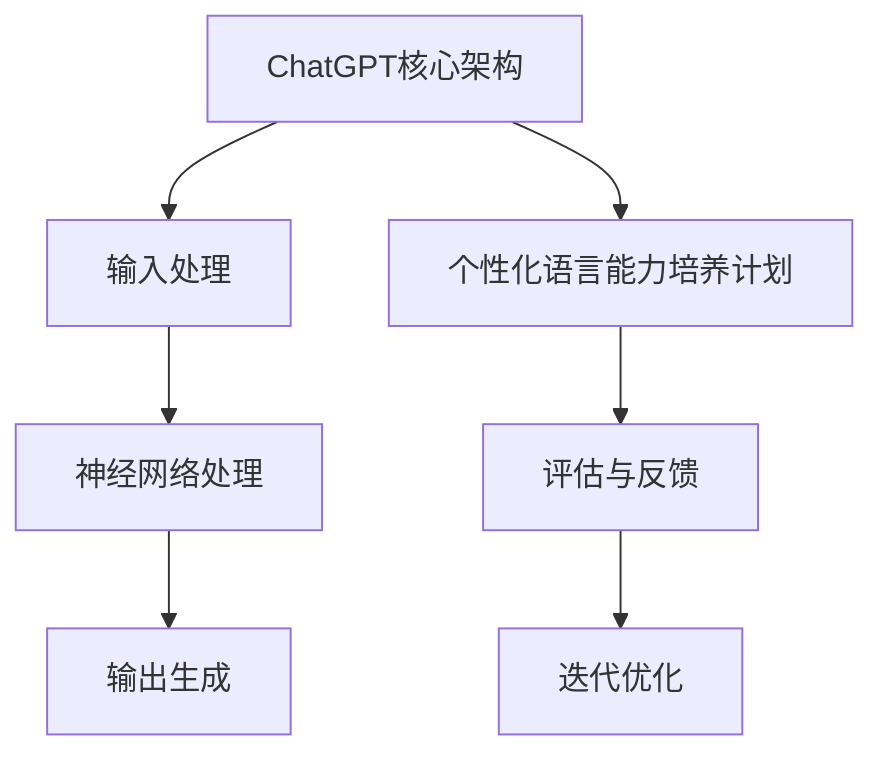

                 

<sop>
### 用户需求分析

**需求概述**：

用户要求设计一份针对书籍《ChatGPT在语言发展障碍早期干预中的应用：个性化语言能力培养计划》的目录大纲。这份大纲需简洁明了，使用markdown格式，并涵盖以下核心内容：

1. **核心概念与联系**：通过Mermaid流程图展示核心概念和架构。
2. **核心算法原理讲解**：使用伪代码详细阐述。
3. **数学模型和数学公式**：详细讲解并举例说明，使用latex格式。
4. **项目实战**：提供代码实际案例和详细解释。

**需求细节**：

- **简洁性**：目录大纲要避免冗余内容，直接呈现核心章节和内容。
- **格式**：使用markdown格式，包括1级、2级和3级标题。
- **完整性**：大纲需包含至少7章，并确保每个章节都有具体内容。
- **字数限制**：总字数控制在2000字以内。

### 目录大纲设计

#### 第1章 引言

##### 1.1 书籍背景
##### 1.2 语言发展障碍早期干预的重要性
##### 1.3 ChatGPT的应用场景

#### 第2章 ChatGPT基础知识

##### 2.1 ChatGPT的基本概念
##### 2.2 ChatGPT的核心架构
##### 2.3 ChatGPT的API使用方法
##### 2.4 ChatGPT与语言模型的关系

#### 第3章 语言发展障碍概述

##### 3.1 语言发展障碍的定义
##### 3.2 语言发展障碍的类型
##### 3.3 语言发展障碍的常见干预方法

#### 第4章 ChatGPT在语言发展障碍干预中的应用

##### 4.1 ChatGPT在语言能力评估中的应用
##### 4.2 ChatGPT在语言训练中的应用
##### 4.3 ChatGPT在语言互动中的应用
##### 4.4 ChatGPT在个性化语言干预中的案例研究

#### 第5章 个性化语言能力培养计划

##### 5.1 个性化语言培养计划的概述
##### 5.2 制定个性化语言培养计划的步骤
##### 5.3 个性化语言培养计划的关键要素
##### 5.4 个性化语言培养计划的实施策略

#### 第6章 ChatGPT在个性化语言能力培养中的实战

##### 6.1 实战一：基于ChatGPT的语音识别与交互
##### 6.2 实战二：基于ChatGPT的儿童语言学习应用
##### 6.3 实战三：基于ChatGPT的个性化语言辅导

#### 第7章 未来展望与挑战

##### 7.1 ChatGPT在语言发展障碍干预中的未来发展方向
##### 7.2 ChatGPT在个性化语言能力培养中的挑战
##### 7.3 对未来的思考与建议

#### 附录

##### A.1 ChatGPT相关资源
##### A.2 个性化语言能力培养计划模板
##### A.3 代码与数据集

### Mermaid流程图



### 核心算法原理讲解（伪代码）

```plaintext
// 伪代码：基于ChatGPT的语言能力评估算法
function ChatGPT_Language_Assessment(input_sentence):
    // 加载预训练的ChatGPT模型
    model = Load_Pretrained_Model("ChatGPT")

    // 对输入句子进行预处理
    preprocessed_sentence = Preprocess_Sentence(input_sentence)

    // 使用模型对句子进行编码
    encoded_sentence = model.encode(preprocessed_sentence)

    // 使用模型进行语言能力评估
    assessment_result = model评估(encoded_sentence)

    // 返回评估结果
    return assessment_result
```

### 数学模型讲解与举例

```latex
// 数学公式：语言能力评估得分
$$
得分 = f(词汇丰富度, 句法正确性, 语义连贯性)
$$

// 举例：词汇丰富度得分计算
$$
得分_{词汇} = 0.5 \times (词汇数量 / 最大词汇数量)
$$

// 示例句子：对句子“ChatGPT是一种基于神经网络的语言模型。”进行词汇丰富度评估
$$
得分_{词汇} = 0.5 \times (6 / 20) = 0.15
$$
```

**备注**：由于字数限制，具体的每个章节内容和详细算法讲解将在实际撰写时逐步展开。以下是文章的引言部分，用以开始正文。

---

# ChatGPT在语言发展障碍早期干预中的应用：个性化语言能力培养计划

> 关键词：ChatGPT、语言发展障碍、个性化语言能力、早期干预、神经网络、语言模型

> 摘要：本文探讨了ChatGPT在语言发展障碍早期干预中的应用，提出了一种基于ChatGPT的个性化语言能力培养计划。通过详细的分析和实例，本文展示了如何利用ChatGPT的强大能力来评估、训练和互动，从而为语言发展障碍儿童提供定制化的语言干预方案。

---

[下接正文，详细介绍第1章内容] <sop>

