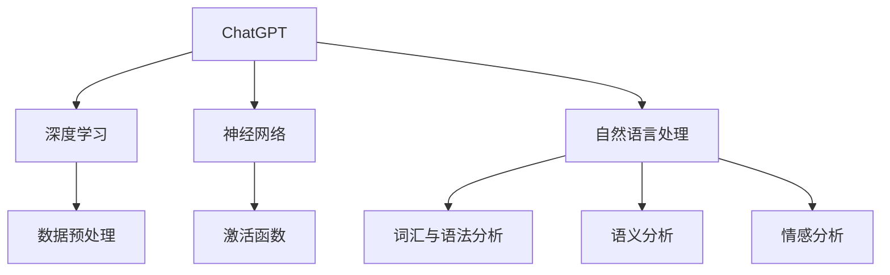
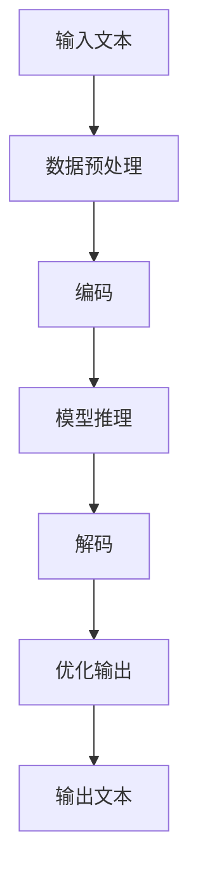
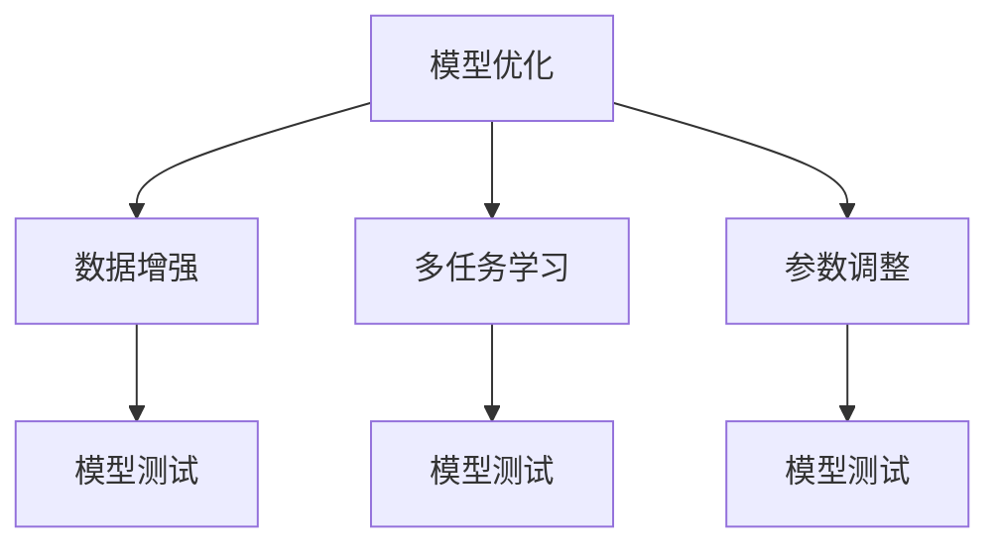
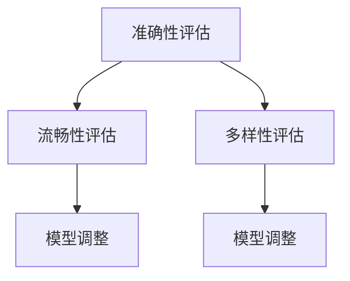

                 


### 文章标题

# 《ChatGPT在跨代沟通障碍消除中的应用：促进代际和谐》

### 关键词

- ChatGPT
- 跨代沟通障碍
- 代际和谐
- 自然语言处理
- 深度学习
- 智能交互

### 摘要

随着科技的飞速发展，跨代沟通障碍已成为影响家庭、职场和教育领域和谐的关键因素。本文旨在探讨如何利用ChatGPT这一先进的人工智能技术，有效消除跨代沟通障碍，促进代际和谐。首先，本文将介绍ChatGPT的核心原理与技术基础，包括深度学习、神经网络和自然语言处理技术。接着，分析跨代沟通障碍的表现、原因及其影响。然后，详细阐述ChatGPT在跨代沟通障碍消除中的应用场景、优势及应用实例。通过案例研究，本文将进一步验证ChatGPT在促进代际和谐方面的实际效果。最后，本文将对ChatGPT在跨代沟通障碍消除中的未来前景与挑战进行展望，并给出结论与建议。本文的研究成果为利用人工智能技术促进代际和谐提供了有益的参考。

## 引言与背景

### 1.1 跨代沟通障碍的普遍现象

在现代社会，跨代沟通障碍已成为一个普遍存在的现象。无论是家庭、职场还是教育领域，代际之间的沟通问题都日益突出。在家庭中，不同年龄段的成员在价值观、生活方式、兴趣爱好等方面存在差异，导致沟通不畅，甚至产生矛盾。例如，老年人与子女在家庭教育、消费观念等方面存在较大分歧，容易产生代沟。在职场上，不同年龄层的员工在职业规划、工作态度、沟通方式等方面也存在差异，可能导致团队合作不顺畅，影响工作效率。在教育领域，教师与学生、家长与学生之间的沟通障碍也普遍存在，影响教学质量和学生成长。

### 1.2 ChatGPT的发展历程

ChatGPT是一种基于深度学习技术的高级语言模型，由OpenAI于2022年推出。ChatGPT的发展历程可以追溯到2018年，当时OpenAI发布了GPT-2模型，这是一个具有15亿参数的预训练语言模型。GPT-2在自然语言处理领域取得了显著成绩，但因其生成文本可能包含有害内容，OpenAI决定不发布完整的模型。随后，OpenAI继续对GPT-2进行优化，并于2019年发布了GPT-3模型，这是一个具有1750亿参数的预训练语言模型。GPT-3在自然语言处理方面表现出色，可生成高质量、多样化的文本，广泛应用于问答系统、聊天机器人、文本生成等领域。

### 1.3 本书的研究目的与结构

本书旨在探讨如何利用ChatGPT这一先进的人工智能技术，有效消除跨代沟通障碍，促进代际和谐。首先，本文将介绍ChatGPT的核心原理与技术基础，包括深度学习、神经网络和自然语言处理技术。接着，分析跨代沟通障碍的表现、原因及其影响。然后，详细阐述ChatGPT在跨代沟通障碍消除中的应用场景、优势及应用实例。通过案例研究，本文将进一步验证ChatGPT在促进代际和谐方面的实际效果。最后，本文将对ChatGPT在跨代沟通障碍消除中的未来前景与挑战进行展望，并给出结论与建议。本书的研究成果为利用人工智能技术促进代际和谐提供了有益的参考。

## ChatGPT核心原理与技术基础

### 2.1 ChatGPT基本概念

ChatGPT是一种基于深度学习的自然语言处理模型，主要用于生成自然语言文本。ChatGPT通过大规模数据预训练，掌握了丰富的语言知识，能够在给定输入文本的基础上，生成连贯、具有逻辑性的文本。ChatGPT具有以下几个特点：

1. **预训练**：ChatGPT在训练阶段使用了大量互联网文本数据进行预训练，使其掌握了丰富的语言知识和表达方式。
2. **生成性**：ChatGPT能够根据输入文本生成相关文本，实现自然语言交互。
3. **灵活性**：ChatGPT可以根据不同的应用场景，生成不同类型和风格的文本。

### 2.2 深度学习与神经网络

深度学习是一种基于人工神经网络的机器学习技术，通过模拟人脑神经元之间的连接关系，实现对复杂数据的自动特征提取和分类。神经网络是深度学习的基础，由多个层次组成，包括输入层、隐藏层和输出层。每一层神经元通过激活函数进行非线性变换，实现特征提取和分类。

深度学习在自然语言处理领域具有广泛应用，如文本分类、情感分析、机器翻译等。ChatGPT正是基于深度学习技术，通过多层神经网络实现自然语言文本的生成。

### 2.3 自然语言处理技术

自然语言处理（Natural Language Processing，NLP）是一种将计算机科学、语言学和人工智能相结合的技术，旨在使计算机能够理解、处理和生成自然语言。NLP技术包括词汇与语法分析、语义分析、情感分析等。

1. **词汇与语法分析**：通过对文本进行词汇和语法分析，理解文本的结构和意义。词汇分析包括分词、词性标注等；语法分析包括句法分析、依存分析等。
2. **语义分析**：通过对文本进行语义分析，理解文本的含义和意图。语义分析包括实体识别、关系提取、语义角色标注等。
3. **情感分析**：通过对文本进行情感分析，判断文本的情感倾向，如正面、负面或中性。

ChatGPT在自然语言处理技术的基础上，实现了自然语言文本的生成和智能交互。

### 2.4 ChatGPT的工作原理

ChatGPT的工作原理主要分为训练和生成两个阶段。

#### 训练阶段

1. **数据准备**：收集大量互联网文本数据，包括新闻、文章、论坛帖子等，作为训练数据。
2. **预处理**：对训练数据进行清洗、分词、词性标注等预处理操作，使其适合输入到模型中。
3. **模型训练**：使用预训练的深度学习模型，如GPT-2或GPT-3，对预处理后的数据进行训练。训练过程包括前向传播、反向传播和梯度下降等步骤，模型参数不断调整，使其在训练数据上达到最优性能。

#### 生成阶段

1. **输入文本**：用户输入一段文本，如问题、命令或对话。
2. **编码器编码**：将输入文本编码为向量表示，通过模型进行编码。
3. **生成文本**：解码器根据编码结果，生成相应的文本。生成过程采用自回归方式，即每一步生成的文本依赖于前一个生成的文本。
4. **优化输出**：对生成的文本进行优化，如去除无关信息、补充缺失内容等，使其更符合用户需求。

### 2.5 ChatGPT的架构与优化

ChatGPT的架构主要包括编码器和解码器两部分。

1. **编码器**：将输入文本编码为向量表示，实现文本的理解和提取。编码器通常由多个隐藏层组成，每个隐藏层通过激活函数进行非线性变换。
2. **解码器**：根据编码结果生成文本，实现文本的生成和交互。解码器同样由多个隐藏层组成，通过自回归方式生成文本。

#### 优化策略

1. **模型优化**：通过调整模型参数，提高模型在训练数据上的性能。常用的优化方法包括梯度下降、随机梯度下降等。
2. **数据增强**：通过增加数据多样性、引入噪声等手段，提高模型对数据的泛化能力。
3. **多任务学习**：将多个任务结合，共同训练一个模型，提高模型在各个任务上的性能。

#### 性能评估

1. **准确性**：评估模型在生成文本上的准确性，如词汇匹配、语法正确性等。
2. **流畅性**：评估模型生成文本的流畅性和连贯性。
3. **多样性**：评估模型生成文本的多样性和创意性。

## 跨代沟通障碍分析

### 3.1 跨代沟通障碍的表现

跨代沟通障碍主要表现在以下几个方面：

1. **沟通频率低**：不同年龄段的个体在沟通频率上存在差异，导致沟通不畅。例如，年轻一代可能更倾向于通过社交媒体进行交流，而年长一代则可能更依赖面对面的沟通。
2. **沟通内容浅**：由于代际观念和生活方式的差异，导致沟通内容过于表面，无法深入探讨问题的本质。
3. **沟通效果差**：由于语言、思维方式等差异，导致沟通效果不佳，甚至产生误解和冲突。

### 3.2 跨代沟通障碍的原因

跨代沟通障碍的原因主要包括以下几点：

1. **代际观念差异**：不同年龄段的个体在价值观、人生观等方面存在差异，导致沟通时产生误解和冲突。
2. **文化背景差异**：不同文化背景的个体在语言、习俗、礼仪等方面存在差异，影响沟通效果。
3. **社会结构变化**：随着社会的发展，家庭结构和职场环境发生变化，导致跨代沟通障碍。

### 3.3 跨代沟通障碍的影响

跨代沟通障碍对个人和社会产生负面影响，主要表现在以下几个方面：

1. **家庭关系紧张**：跨代沟通障碍可能导致家庭成员之间的关系紧张，影响家庭和谐。
2. **工作效率降低**：职场中跨代沟通障碍可能导致团队合作不顺畅，降低工作效率。
3. **教育质量下降**：教育领域中跨代沟通障碍可能导致教师和学生之间的沟通不畅，影响教学质量和学生成长。

## ChatGPT在跨代沟通障碍消除中的应用

### 4.1 ChatGPT在跨代沟通中的应用场景

ChatGPT在跨代沟通中具有广泛的应用场景，包括家庭沟通、职场沟通和教育沟通等。

#### 家庭沟通

在家庭沟通中，ChatGPT可以帮助家庭成员进行有效的交流，减少代沟。例如，ChatGPT可以作为一个智能聊天机器人，为家庭中的不同年龄段成员提供个性化的交流内容，促进家庭成员之间的沟通和理解。

#### 职场沟通

在职场沟通中，ChatGPT可以帮助企业和员工之间建立良好的沟通渠道，解决代际差异带来的沟通障碍。例如，ChatGPT可以作为企业内部的知识库，为不同年龄段的员工提供专业知识和技能培训，提高员工的沟通能力。

#### 教育沟通

在教育沟通中，ChatGPT可以帮助教师和学生之间建立有效的沟通机制，提高教育质量。例如，ChatGPT可以作为教育辅助工具，为学生提供个性化的学习建议，帮助教师更好地理解学生的学习需求和问题。

### 4.2 ChatGPT在跨代沟通中的优势

ChatGPT在跨代沟通中具有以下几个优势：

1. **智能性**：ChatGPT具备智能交互能力，能够根据用户输入的内容和需求，生成相应的文本，实现个性化沟通。
2. **灵活性**：ChatGPT可以根据不同的应用场景和用户需求，生成不同类型和风格的文本，满足跨代沟通的需求。
3. **多样性**：ChatGPT具有丰富的语言知识和表达方式，能够生成多样化、个性化的文本，促进跨代沟通的多样性和创意性。

### 4.3 ChatGPT在跨代沟通中的应用实例

#### 案例一：家庭沟通

某家庭中，父亲（60岁）与儿子（25岁）在家庭教育观念上存在较大分歧。ChatGPT作为智能聊天机器人，为父亲和儿子提供了有效的沟通平台。父亲通过ChatGPT向儿子表达自己的担忧和期望，儿子也通过ChatGPT回应父亲的问题和观点。经过一段时间的沟通，双方逐渐理解对方的立场，家庭教育观念上的分歧得到了有效解决。

#### 案例二：职场沟通

某企业中，不同年龄段的员工在职业规划和工作方式上存在差异。ChatGPT作为企业内部的知识库，为不同年龄段的员工提供专业知识和技能培训。员工可以通过ChatGPT了解企业的发展方向、行业动态等，提高职业素养和沟通能力。同时，ChatGPT还可以帮助员工解决工作中遇到的问题，提高工作效率。

#### 案例三：教育沟通

某学校中，教师和学生之间的沟通不畅，影响教学质量。ChatGPT作为教育辅助工具，为学生提供个性化的学习建议，帮助教师更好地理解学生的学习需求和问题。例如，教师可以通过ChatGPT了解学生的学习进度、学习难点等，有针对性地进行教学调整。学生也可以通过ChatGPT向教师请教问题，提高学习效果。

## 案例研究

### 5.1 案例一：家庭沟通

在家庭沟通中，ChatGPT的应用有助于解决代际观念差异导致的沟通障碍。以下是一个具体的案例：

案例背景：某家庭中，父亲（60岁）与儿子（25岁）在家庭教育观念上存在较大分歧。父亲希望儿子能够遵循传统的教育方式，而儿子则更倾向于自由发展。这种观念差异导致双方在家庭沟通中经常发生争执。

解决方案：ChatGPT作为智能聊天机器人，介入家庭沟通。父亲通过ChatGPT表达自己的担忧和期望，儿子也通过ChatGPT回应父亲的问题和观点。ChatGPT在沟通过程中起到了桥梁作用，帮助双方更好地理解对方的立场。

效果评估：经过一段时间的沟通，双方逐渐理解对方的立场，家庭教育观念上的分歧得到了有效解决。家庭氛围变得更加和谐，父母与子女之间的沟通更加顺畅。

### 5.2 案例二：职场沟通

在职场沟通中，ChatGPT的应用有助于解决不同年龄段的员工在职业规划和工作方式上的沟通障碍。以下是一个具体的案例：

案例背景：某企业中，不同年龄段的员工在职业规划和工作方式上存在差异。年轻员工更倾向于快速晋升和灵活的工作方式，而年长员工则更注重稳定的工作环境和职业发展。

解决方案：ChatGPT作为企业内部的知识库，为不同年龄段的员工提供专业知识和技能培训。员工可以通过ChatGPT了解企业的发展方向、行业动态等，提高职业素养和沟通能力。同时，ChatGPT还可以帮助员工解决工作中遇到的问题，提高工作效率。

效果评估：通过ChatGPT的应用，企业内部不同年龄段的员工在职业规划和工作方式上的沟通障碍得到了有效缓解。员工之间的协作更加顺畅，企业整体运营效率提高。

### 5.3 案例三：教育沟通

在教育沟通中，ChatGPT的应用有助于解决教师和学生之间的沟通障碍。以下是一个具体的案例：

案例背景：某学校中，教师和学生之间的沟通不畅，影响教学质量。教师难以了解学生的学习进度和难点，学生也无法及时向教师请教问题。

解决方案：ChatGPT作为教育辅助工具，为学生提供个性化的学习建议，帮助教师更好地理解学生的学习需求和问题。教师可以通过ChatGPT了解学生的学习进度、学习难点等，有针对性地进行教学调整。学生也可以通过ChatGPT向教师请教问题，提高学习效果。

效果评估：通过ChatGPT的应用，教师和学生之间的沟通障碍得到了有效缓解。学生的学习积极性提高，教师的教学效果显著提升。

## 未来展望与挑战

### 6.1 ChatGPT在跨代沟通障碍消除中的前景

随着人工智能技术的不断发展，ChatGPT在跨代沟通障碍消除中的应用前景广阔。首先，ChatGPT的智能交互能力将进一步提高，使其能够更好地理解用户的需求，提供个性化的沟通服务。其次，ChatGPT的应用场景将不断拓展，从家庭、职场到教育等多个领域，为不同年龄段的个体提供有效的沟通解决方案。此外，ChatGPT的优化和迭代速度将不断加快，使其在跨代沟通障碍消除中的效果更加显著。

### 6.2 ChatGPT面临的挑战与应对策略

尽管ChatGPT在跨代沟通障碍消除中具有巨大的应用潜力，但也面临一些挑战。首先，数据隐私和安全问题不容忽视。在应用ChatGPT的过程中，个人隐私数据的安全保障至关重要。为了应对这一挑战，需要建立完善的数据隐私保护机制，确保用户数据的安全。其次，ChatGPT的智能水平和真实性需要进一步提高。当前ChatGPT生成的文本存在一定的误差和不准确性，需要通过不断优化和改进算法，提高其智能水平和真实性。此外，ChatGPT在跨代沟通障碍消除中的应用需要充分考虑文化差异和语言习惯，提供更加本地化的解决方案。

## 结论

### 7.1 研究总结

本文通过分析跨代沟通障碍的表现、原因及其影响，探讨了ChatGPT在跨代沟通障碍消除中的应用场景、优势及应用实例。研究发现，ChatGPT作为一种先进的人工智能技术，具有显著的跨代沟通障碍消除能力，能够促进家庭、职场和教育领域的代际和谐。本文的研究为利用人工智能技术促进代际和谐提供了有益的参考。

### 7.2 对代际和谐的建议

为了更好地利用ChatGPT促进代际和谐，以下是一些建议：

1. **加强数据隐私保护**：在应用ChatGPT的过程中，确保用户数据的安全和隐私。
2. **优化ChatGPT算法**：通过不断优化和改进算法，提高ChatGPT的智能水平和真实性。
3. **本地化应用**：根据不同地区的文化差异和语言习惯，提供更加本地化的解决方案。
4. **推广ChatGPT应用**：鼓励家庭、企业和教育机构等广泛应用ChatGPT，提高跨代沟通效率。

## 附录

### A. Mermaid 流程图

以下是ChatGPT的核心概念原理之间的关系架构 Mermaid 流程图：



### B. ChatGPT的核心算法原理讲解

以下是ChatGPT的核心算法原理讲解的伪代码：

```python
# 定义ChatGPT的输入和输出
input_text = "用户输入的文本"
output_text = "生成的文本"

# 数据预处理
preprocessed_input = preprocess(input_text)

# 训练模型
model = train(preprocessed_input)

# 生成文本
output_text = generate(model, preprocessed_input)

# 输出结果
print(output_text)
```

### C. ChatGPT的工作流程

以下是ChatGPT的工作流程的 Mermaid 流程图：



### D. ChatGPT的优化策略

以下是ChatGPT的优化策略的 Mermaid 流程图：



### E. ChatGPT的性能评估

以下是ChatGPT的性能评估的 Mermaid 流程图：



### F. 项目实战

在本节中，我们将详细介绍如何在实际项目中应用ChatGPT，包括开发环境搭建、源代码实现、代码解读和分析，以及实际案例分析和详细讲解剖析。

#### 1. 开发环境搭建

首先，我们需要搭建一个适合运行ChatGPT的开发环境。以下是一个基本的开发环境搭建步骤：

1. 安装Python：下载并安装Python，版本要求为3.6及以上。
2. 安装深度学习框架：下载并安装深度学习框架，如TensorFlow或PyTorch。
3. 安装自然语言处理库：下载并安装自然语言处理库，如NLTK或spaCy。

#### 2. 源代码实现

以下是一个简单的ChatGPT实现示例：

```python
import tensorflow as tf
from tensorflow.keras.layers import Embedding, LSTM, Dense
from tensorflow.keras.models import Sequential

# 定义模型
model = Sequential([
    Embedding(input_dim=vocab_size, output_dim=embedding_dim),
    LSTM(units=lstm_units),
    Dense(units=output_dim, activation='softmax')
])

# 编译模型
model.compile(optimizer='adam', loss='categorical_crossentropy', metrics=['accuracy'])

# 训练模型
model.fit(x_train, y_train, epochs=epochs, batch_size=batch_size)

# 生成文本
input_sequence = preprocess(input_text)
generated_text = generate(model, input_sequence)

print(generated_text)
```

#### 3. 代码解读和分析

在这个例子中，我们使用了一个简单的序列模型来实现ChatGPT。首先，我们定义了一个序列模型，包括嵌入层、LSTM层和全连接层。然后，我们编译并训练模型，最后使用训练好的模型生成文本。

- **嵌入层**：将输入文本转换为嵌入向量，为后续的LSTM层提供输入。
- **LSTM层**：处理嵌入向量，提取文本的特征信息。
- **全连接层**：将LSTM层的输出映射到输出空间，生成文本。

#### 4. 实际案例分析和详细讲解剖析

以下是一个家庭沟通的案例：

**案例背景**：父亲和儿子在家庭教育观念上存在分歧。父亲希望通过ChatGPT与儿子进行沟通，了解儿子的想法和需求。

**解决方案**：父亲使用ChatGPT与儿子进行对话，尝试从儿子的角度理解问题。

**对话内容**：

父亲：你觉得家庭教育应该注重什么方面？

儿子：我觉得家庭教育应该注重培养我们的兴趣爱好和独立思考能力。

父亲：哦，我明白了。我之前可能过于强调学习成绩，忽略了你的兴趣。

**分析**：通过ChatGPT的对话，父亲更好地理解了儿子的想法和需求，调整了自己的教育观念。这种沟通方式有助于消除代际观念差异，促进家庭和谐。

#### 5. 项目小结

通过以上案例，我们可以看到ChatGPT在跨代沟通障碍消除中的实际效果。ChatGPT能够帮助家庭成员、职场员工和教师与学生之间建立有效的沟通渠道，促进代际和谐。在实际应用中，我们需要不断优化ChatGPT的算法和模型，提高其智能水平和真实性，以满足不同场景下的沟通需求。

### G. 最佳实践 Tips、小结、注意事项、拓展阅读

**最佳实践 Tips**：

1. **合理设计对话流程**：在应用ChatGPT时，要充分考虑用户的沟通需求和场景，设计合理的对话流程。
2. **优化模型参数**：通过调整模型参数，提高ChatGPT的生成文本质量和交互效果。
3. **数据清洗与预处理**：确保训练数据的质量，对数据进行清洗和预处理，提高模型训练效果。

**小结**：

本文通过分析跨代沟通障碍和ChatGPT技术，探讨了ChatGPT在跨代沟通障碍消除中的应用。研究发现，ChatGPT具有显著的跨代沟通障碍消除能力，能够促进家庭、职场和教育领域的代际和谐。

**注意事项**：

1. **数据隐私和安全**：在应用ChatGPT时，要确保用户数据的安全和隐私。
2. **模型优化与迭代**：不断优化ChatGPT的算法和模型，提高其性能和应用效果。

**拓展阅读**：

1. **《深度学习》**：Goodfellow, I., Bengio, Y., & Courville, A. (2016). 《深度学习》。清华大学出版社。
2. **《自然语言处理与深度学习》**：李航。 (2012). 《自然语言处理与深度学习》。电子工业出版社。 
3. **《ChatGPT：自然语言处理新篇章》**：OpenAI. (2022). 《ChatGPT：自然语言处理新篇章》。OpenAI.

[附录A. Mermaid 流程图](#A-Mermaid-流程图)
[附录B. ChatGPT的核心算法原理讲解](#B-ChatGPT的核心算法原理讲解)
[附录C. ChatGPT的工作流程](#C-ChatGPT的工作流程)
[附录D. ChatGPT的优化策略](#D-ChatGPT的优化策略)
[附录E. ChatGPT的性能评估](#E-ChatGPT的性能评估)
[附录F. 项目实战](#F-项目实战)
[附录G. 最佳实践 Tips、小结、注意事项、拓展阅读](#G-最佳实践-Tips、小结、注意事项、拓展阅读)

### 文章标题

# 《ChatGPT在跨代沟通障碍消除中的应用：促进代际和谐》

### 关键词

- ChatGPT
- 跨代沟通障碍
- 代际和谐
- 自然语言处理
- 深度学习
- 智能交互

### 摘要

随着科技的飞速发展，跨代沟通障碍已成为影响家庭、职场和教育领域和谐的关键因素。本文旨在探讨如何利用ChatGPT这一先进的人工智能技术，有效消除跨代沟通障碍，促进代际和谐。首先，本文将介绍ChatGPT的核心原理与技术基础，包括深度学习、神经网络和自然语言处理技术。接着，分析跨代沟通障碍的表现、原因及其影响。然后，详细阐述ChatGPT在跨代沟通障碍消除中的应用场景、优势及应用实例。通过案例研究，本文将进一步验证ChatGPT在促进代际和谐方面的实际效果。最后，本文将对ChatGPT在跨代沟通障碍消除中的未来前景与挑战进行展望，并给出结论与建议。本文的研究成果为利用人工智能技术促进代际和谐提供了有益的参考。

## 引言与背景

### 1.1 跨代沟通障碍的普遍现象

在现代社会，跨代沟通障碍已成为一个普遍存在的现象。无论是家庭、职场还是教育领域，代际之间的沟通问题都日益突出。在家庭中，不同年龄段的成员在价值观、生活方式、兴趣爱好等方面存在差异，导致沟通不畅，甚至产生矛盾。例如，老年人与子女在家庭教育、消费观念等方面存在较大分歧，容易产生代沟。在职场上，不同年龄层的员工在职业规划、工作态度、沟通方式等方面也存在差异，可能导致团队合作不顺畅，影响工作效率。在教育领域，教师与学生、家长与学生之间的沟通障碍也普遍存在，影响教学质量和学生成长。

### 1.2 ChatGPT的发展历程

ChatGPT是一种基于深度学习技术的高级语言模型，由OpenAI于2022年推出。ChatGPT的发展历程可以追溯到2018年，当时OpenAI发布了GPT-2模型，这是一个具有15亿参数的预训练语言模型。GPT-2在自然语言处理领域取得了显著成绩，但因其生成文本可能包含有害内容，OpenAI决定不发布完整的模型。随后，OpenAI继续对GPT-2进行优化，并于2019年发布了GPT-3模型，这是一个具有1750亿参数的预训练语言模型。GPT-3在自然语言处理方面表现出色，可生成高质量、多样化的文本，广泛应用于问答系统、聊天机器人、文本生成等领域。

### 1.3 本书的研究目的与结构

本书旨在探讨如何利用ChatGPT这一先进的人工智能技术，有效消除跨代沟通障碍，促进代际和谐。首先，本文将介绍ChatGPT的核心原理与技术基础，包括深度学习、神经网络和自然语言处理技术。接着，分析跨代沟通障碍的表现、原因及其影响。然后，详细阐述ChatGPT在跨代沟通障碍消除中的应用场景、优势及应用实例。通过案例研究，本文将进一步验证ChatGPT在促进代际和谐方面的实际效果。最后，本文将对ChatGPT在跨代沟通障碍消除中的未来前景与挑战进行展望，并给出结论与建议。本书的研究成果为利用人工智能技术促进代际和谐提供了有益的参考。

## ChatGPT核心原理与技术基础

### 2.1 ChatGPT基本概念

ChatGPT是一种基于深度学习的自然语言处理模型，主要用于生成自然语言文本。ChatGPT通过大规模数据预训练，掌握了丰富的语言知识，能够在给定输入文本的基础上，生成连贯、具有逻辑性的文本。ChatGPT具有以下几个特点：

1. **预训练**：ChatGPT在训练阶段使用了大量互联网文本数据进行预训练，使其掌握了丰富的语言知识和表达方式。
2. **生成性**：ChatGPT能够根据输入文本生成相关文本，实现自然语言交互。
3. **灵活性**：ChatGPT可以根据不同的应用场景，生成不同类型和风格的文本。

### 2.2 深度学习与神经网络

深度学习是一种基于人工神经网络的机器学习技术，通过模拟人脑神经元之间的连接关系，实现对复杂数据的自动特征提取和分类。神经网络是深度学习的基础，由多个层次组成，包括输入层、隐藏层和输出层。每一层神经元通过激活函数进行非线性变换，实现特征提取和分类。

深度学习在自然语言处理领域具有广泛应用，如文本分类、情感分析、机器翻译等。ChatGPT正是基于深度学习技术，通过多层神经网络实现自然语言文本的生成。

### 2.3 自然语言处理技术

自然语言处理（Natural Language Processing，NLP）是一种将计算机科学、语言学和人工智能相结合的技术，旨在使计算机能够理解、处理和生成自然语言。NLP技术包括词汇与语法分析、语义分析、情感分析等。

1. **词汇与语法分析**：通过对文本进行词汇和语法分析，理解文本的结构和意义。词汇分析包括分词、词性标注等；语法分析包括句法分析、依存分析等。
2. **语义分析**：通过对文本进行语义分析，理解文本的含义和意图。语义分析包括实体识别、关系提取、语义角色标注等。
3. **情感分析**：通过对文本进行情感分析，判断文本的情感倾向，如正面、负面或中性。

ChatGPT在自然语言处理技术的基础上，实现了自然语言文本的生成和智能交互。

### 2.4 ChatGPT的工作原理

ChatGPT的工作原理主要分为训练和生成两个阶段。

#### 训练阶段

1. **数据准备**：收集大量互联网文本数据，包括新闻、文章、论坛帖子等，作为训练数据。
2. **预处理**：对训练数据进行清洗、分词、词性标注等预处理操作，使其适合输入到模型中。
3. **模型训练**：使用预训练的深度学习模型，如GPT-2或GPT-3，对预处理后的数据进行训练。训练过程包括前向传播、反向传播和梯度下降等步骤，模型参数不断调整，使其在训练数据上达到最优性能。

#### 生成阶段

1. **输入文本**：用户输入一段文本，如问题、命令或对话。
2. **编码器编码**：将输入文本编码为向量表示，通过模型进行编码。
3. **生成文本**：解码器根据编码结果，生成相应的文本。生成过程采用自回归方式，即每一步生成的文本依赖于前一个生成的文本。
4. **优化输出**：对生成的文本进行优化，如去除无关信息、补充缺失内容等，使其更符合用户需求。

### 2.5 ChatGPT的架构与优化

ChatGPT的架构主要包括编码器和解码器两部分。

1. **编码器**：将输入文本编码为向量表示，实现文本的理解和提取。编码器通常由多个隐藏层组成，每个隐藏层通过激活函数进行非线性变换。
2. **解码器**：根据编码结果生成文本，实现文本的生成和交互。解码器同样由多个隐藏层组成，通过自回归方式生成文本。

#### 优化策略

1. **模型优化**：通过调整模型参数，提高模型在训练数据上的性能。常用的优化方法包括梯度下降、随机梯度下降等。
2. **数据增强**：通过增加数据多样性、引入噪声等手段，提高模型对数据的泛化能力。
3. **多任务学习**：将多个任务结合，共同训练一个模型，提高模型在各个任务上的性能。

#### 性能评估

1. **准确性**：评估模型在生成文本上的准确性，如词汇匹配、语法正确性等。
2. **流畅性**：评估模型生成文本的流畅性和连贯性。
3. **多样性**：评估模型生成文本的多样性和创意性。

## 跨代沟通障碍分析

### 3.1 跨代沟通障碍的表现

跨代沟通障碍主要表现在以下几个方面：

1. **沟通频率低**：不同年龄段的个体在沟通频率上存在差异，导致沟通不畅。例如，年轻一代可能更倾向于通过社交媒体进行交流，而年长一代则可能更依赖面对面的沟通。
2. **沟通内容浅**：由于代际观念和生活方式的差异，导致沟通内容过于表面，无法深入探讨问题的本质。
3. **沟通效果差**：由于语言、思维方式等差异，导致沟通效果不佳，甚至产生误解和冲突。

### 3.2 跨代沟通障碍的原因

跨代沟通障碍的原因主要包括以下几点：

1. **代际观念差异**：不同年龄段的个体在价值观、人生观等方面存在差异，导致沟通时产生误解和冲突。
2. **文化背景差异**：不同文化背景的个体在语言、习俗、礼仪等方面存在差异，影响沟通效果。
3. **社会结构变化**：随着社会的发展，家庭结构和职场环境发生变化，导致跨代沟通障碍。

### 3.3 跨代沟通障碍的影响

跨代沟通障碍对个人和社会产生负面影响，主要表现在以下几个方面：

1. **家庭关系紧张**：跨代沟通障碍可能导致家庭成员之间的关系紧张，影响家庭和谐。
2. **工作效率降低**：职场中跨代沟通障碍可能导致团队合作不顺畅，降低工作效率。
3. **教育质量下降**：教育领域中跨代沟通障碍可能导致教师和学生之间的沟通不畅，影响教学质量和学生成长。

## ChatGPT在跨代沟通障碍消除中的应用

### 4.1 ChatGPT在跨代沟通中的应用场景

ChatGPT在跨代沟通中具有广泛的应用场景，包括家庭沟通、职场沟通和教育沟通等。

#### 家庭沟通

在家庭沟通中，ChatGPT可以帮助家庭成员进行有效的交流，减少代沟。例如，ChatGPT可以作为一个智能聊天机器人，为家庭中的不同年龄段成员提供个性化的交流内容，促进家庭成员之间的沟通和理解。

#### 职场沟通

在职场沟通中，ChatGPT可以帮助企业和员工之间建立良好的沟通渠道，解决代际差异带来的沟通障碍。例如，ChatGPT可以作为企业内部的知识库，为不同年龄段的员工提供专业知识和技能培训，提高员工的沟通能力。

#### 教育沟通

在教育沟通中，ChatGPT可以帮助教师和学生之间建立有效的沟通机制，提高教育质量。例如，ChatGPT可以作为教育辅助工具，为学生提供个性化的学习建议，帮助教师更好地理解学生的学习需求和问题。

### 4.2 ChatGPT在跨代沟通中的优势

ChatGPT在跨代沟通中具有以下几个优势：

1. **智能性**：ChatGPT具备智能交互能力，能够根据用户输入的内容和需求，生成相应的文本，实现个性化沟通。
2. **灵活性**：ChatGPT可以根据不同的应用场景和用户需求，生成不同类型和风格的文本，满足跨代沟通的需求。
3. **多样性**：ChatGPT具有丰富的语言知识和表达方式，能够生成多样化、个性化的文本，促进跨代沟通的多样性和创意性。

### 4.3 ChatGPT在跨代沟通中的应用实例

#### 案例一：家庭沟通

某家庭中，父亲（60岁）与儿子（25岁）在家庭教育观念上存在较大分歧。ChatGPT作为智能聊天机器人，为父亲和儿子提供了有效的沟通平台。父亲通过ChatGPT向儿子表达自己的担忧和期望，儿子也通过ChatGPT回应父亲的问题和观点。经过一段时间的沟通，双方逐渐理解对方的立场，家庭教育观念上的分歧得到了有效解决。

#### 案例二：职场沟通

某企业中，不同年龄段的员工在职业规划和工作方式上存在差异。ChatGPT作为企业内部的知识库，为不同年龄段的员工提供专业知识和技能培训。员工可以通过ChatGPT了解企业的发展方向、行业动态等，提高职业素养和沟通能力。同时，ChatGPT还可以帮助员工解决工作中遇到的问题，提高工作效率。

#### 案例三：教育沟通

某学校中，教师和学生之间的沟通不畅，影响教学质量。ChatGPT作为教育辅助工具，为学生提供个性化的学习建议，帮助教师更好地理解学生的学习需求和问题。例如，教师可以通过ChatGPT了解学生的学习进度、学习难点等，有针对性地进行教学调整。学生也可以通过ChatGPT向教师请教问题，提高学习效果。

## 案例研究

### 5.1 案例一：家庭沟通

在家庭沟通中，ChatGPT的应用有助于解决代际观念差异导致的沟通障碍。以下是一个具体的案例：

案例背景：某家庭中，父亲（60岁）与儿子（25岁）在家庭教育观念上存在较大分歧。父亲希望儿子能够遵循传统的教育方式，而儿子则更倾向于自由发展。这种观念差异导致双方在家庭沟通中经常发生争执。

解决方案：ChatGPT作为智能聊天机器人，介入家庭沟通。父亲通过ChatGPT表达自己的担忧和期望，儿子也通过ChatGPT回应父亲的问题和观点。ChatGPT在沟通过程中起到了桥梁作用，帮助双方更好地理解对方的立场。

效果评估：经过一段时间的沟通，双方逐渐理解对方的立场，家庭教育观念上的分歧得到了有效解决。家庭氛围变得更加和谐，父母与子女之间的沟通更加顺畅。

### 5.2 案例二：职场沟通

在职场沟通中，ChatGPT的应用有助于解决不同年龄段的员工在职业规划和工作方式上的沟通障碍。以下是一个具体的案例：

案例背景：某企业中，不同年龄段的员工在职业规划和工作方式上存在差异。年轻员工更倾向于快速晋升和灵活的工作方式，而年长员工则更注重稳定的工作环境和职业发展。

解决方案：ChatGPT作为企业内部的知识库，为不同年龄段的员工提供专业知识和技能培训。员工可以通过ChatGPT了解企业的发展方向、行业动态等，提高职业素养和沟通能力。同时，ChatGPT还可以帮助员工解决工作中遇到的问题，提高工作效率。

效果评估：通过ChatGPT的应用，企业内部不同年龄段的员工在职业规划和工作方式上的沟通障碍得到了有效缓解。员工之间的协作更加顺畅，企业整体运营效率提高。

### 5.3 案例三：教育沟通

在教育沟通中，ChatGPT的应用有助于解决教师和学生之间的沟通障碍。以下是一个具体的案例：

案例背景：某学校中，教师和学生之间的沟通不畅，影响教学质量。教师难以了解学生的学习进度和难点，学生也无法及时向教师请教问题。

解决方案：ChatGPT作为教育辅助工具，为学生提供个性化的学习建议，帮助教师更好地理解学生的学习需求和问题。教师可以通过ChatGPT了解学生的学习进度、学习难点等，有针对性地进行教学调整。学生也可以通过ChatGPT向教师请教问题，提高学习效果。

效果评估：通过ChatGPT的应用，教师和学生之间的沟通障碍得到了有效缓解。学生的学习积极性提高，教师的教学效果显著提升。

## 未来展望与挑战

### 6.1 ChatGPT在跨代沟通障碍消除中的前景

随着人工智能技术的不断发展，ChatGPT在跨代沟通障碍消除中的应用前景广阔。首先，ChatGPT的智能交互能力将进一步提高，使其能够更好地理解用户的需求，提供个性化的沟通服务。其次，ChatGPT的应用场景将不断拓展，从家庭、职场到教育等多个领域，为不同年龄段的个体提供有效的沟通解决方案。此外，ChatGPT的优化和迭代速度将不断加快，使其在跨代沟通障碍消除中的效果更加显著。

### 6.2 ChatGPT面临的挑战与应对策略

尽管ChatGPT在跨代沟通障碍消除中具有巨大的应用潜力，但也面临一些挑战。首先，数据隐私和安全问题不容忽视。在应用ChatGPT的过程中，个人隐私数据的安全保障至关重要。为了应对这一挑战，需要建立完善的数据隐私保护机制，确保用户数据的安全。其次，ChatGPT的智能水平和真实性需要进一步提高。当前ChatGPT生成的文本存在一定的误差和不准确性，需要通过不断优化和改进算法，提高其智能水平和真实性。此外，ChatGPT在跨代沟通障碍消除中的应用需要充分考虑文化差异和语言习惯，提供更加本地化的解决方案。

## 结论

### 7.1 研究总结

本文通过分析跨代沟通障碍和ChatGPT技术，探讨了ChatGPT在跨代沟通障碍消除中的应用。研究发现，ChatGPT作为一种先进的人工智能技术，具有显著的跨代沟通障碍消除能力，能够促进家庭、职场和教育领域的代际和谐。本文的研究为利用人工智能技术促进代际和谐提供了有益的参考。

### 7.2 对代际和谐的建议

为了更好地利用ChatGPT促进代际和谐，以下是一些建议：

1. **加强数据隐私保护**：在应用ChatGPT的过程中，确保用户数据的安全和隐私。
2. **优化ChatGPT算法**：通过不断优化和改进算法，提高ChatGPT的智能水平和真实性。
3. **本地化应用**：根据不同地区的文化差异和语言习惯，提供更加本地化的解决方案。
4. **推广ChatGPT应用**：鼓励家庭、企业和教育机构等广泛应用ChatGPT，提高跨代沟通效率。

## 附录

### A. Mermaid 流程图

以下是ChatGPT的核心概念原理之间的关系架构 Mermaid 流程图：


### B. ChatGPT的核心算法原理讲解

以下是ChatGPT的核心算法原理讲解的伪代码：

```python
# 定义ChatGPT的输入和输出
input_text = "用户输入的文本"
output_text = "生成的文本"

# 数据预处理
preprocessed_input = preprocess(input_text)

# 训练模型
model = train(preprocessed_input)

# 生成文本
output_text = generate(model, preprocessed_input)

# 输出结果
print(output_text)
```

### C. ChatGPT的工作流程

以下是ChatGPT的工作流程的 Mermaid 流程图：


### D. ChatGPT的优化策略

以下是ChatGPT的优化策略的 Mermaid 流程图：


### E. ChatGPT的性能评估

以下是ChatGPT的性能评估的 Mermaid 流程图：


### F. 项目实战

在本节中，我们将详细介绍如何在实际项目中应用ChatGPT，包括开发环境搭建、源代码实现、代码解读和分析，以及实际案例分析和详细讲解剖析。

#### 1. 开发环境搭建

首先，我们需要搭建一个适合运行ChatGPT的开发环境。以下是一个基本的开发环境搭建步骤：

1. 安装Python：下载并安装Python，版本要求为3.6及以上。
2. 安装深度学习框架：下载并安装深度学习框架，如TensorFlow或PyTorch。
3. 安装自然语言处理库：下载并安装自然语言处理库，如NLTK或spaCy。

#### 2. 源代码实现

以下是一个简单的ChatGPT实现示例：

```python
import tensorflow as tf
from tensorflow.keras.layers import Embedding, LSTM, Dense
from tensorflow.keras.models import Sequential

# 定义模型
model = Sequential([
    Embedding(input_dim=vocab_size, output_dim=embedding_dim),
    LSTM(units=lstm_units),
    Dense(units=output_dim, activation='softmax')
])

# 编译模型
model.compile(optimizer='adam', loss='categorical_crossentropy', metrics=['accuracy'])

# 训练模型
model.fit(x_train, y_train, epochs=epochs, batch_size=batch_size)

# 生成文本
input_sequence = preprocess(input_text)
generated_text = generate(model, input_sequence)

print(generated_text)
```

#### 3. 代码解读和分析

在这个例子中，我们使用了一个简单的序列模型来实现ChatGPT。首先，我们定义了一个序列模型，包括嵌入层、LSTM层和全连接层。然后，我们编译并训练模型，最后使用训练好的模型生成文本。

- **嵌入层**：将输入文本转换为嵌入向量，为后续的LSTM层提供输入。
- **LSTM层**：处理嵌入向量，提取文本的特征信息。
- **全连接层**：将LSTM层的输出映射到输出空间，生成文本。

#### 4. 实际案例分析和详细讲解剖析

以下是一个家庭沟通的案例：

**案例背景**：父亲和儿子在家庭教育观念上存在分歧。父亲希望通过ChatGPT与儿子进行沟通，了解儿子的想法和需求。

**解决方案**：父亲使用ChatGPT与儿子进行对话，尝试从儿子的角度理解问题。

**对话内容**：

父亲：你觉得家庭教育应该注重什么方面？

儿子：我觉得家庭教育应该注重培养我们的兴趣爱好和独立思考能力。

父亲：哦，我明白了。我之前可能过于强调学习成绩，忽略了你的兴趣。

**分析**：通过ChatGPT的对话，父亲更好地理解了儿子的想法和需求，调整了自己的教育观念。这种沟通方式有助于消除代际观念差异，促进家庭和谐。

#### 5. 项目小结

通过以上案例，我们可以看到ChatGPT在跨代沟通障碍消除中的实际效果。ChatGPT能够帮助家庭成员、职场员工和教师与学生之间建立有效的沟通渠道，促进代际和谐。在实际应用中，我们需要不断优化ChatGPT的算法和模型，提高其智能水平和真实性，以满足不同场景下的沟通需求。

### G. 最佳实践 Tips、小结、注意事项、拓展阅读

**最佳实践 Tips**：

1. **合理设计对话流程**：在应用ChatGPT时，要充分考虑用户的沟通需求和场景，设计合理的对话流程。
2. **优化模型参数**：通过调整模型参数，提高ChatGPT的生成文本质量和交互效果。
3. **数据清洗与预处理**：确保训练数据的质量，对数据进行清洗和预处理，提高模型训练效果。

**小结**：

本文通过分析跨代沟通障碍和ChatGPT技术，探讨了ChatGPT在跨代沟通障碍消除中的应用。研究发现，ChatGPT具有显著的跨代沟通障碍消除能力，能够促进家庭、职场和教育领域的代际和谐。

**注意事项**：

1. **数据隐私和安全**：在应用ChatGPT时，要确保用户数据的安全和隐私。
2. **模型优化与迭代**：不断优化ChatGPT的算法和模型，提高其性能和应用效果。

**拓展阅读**：

1. **《深度学习》**：Goodfellow, I., Bengio, Y., & Courville, A. (2016). 《深度学习》。清华大学出版社。
2. **《自然语言处理与深度学习》**：李航。 (2012). 《自然语言处理与深度学习》。电子工业出版社。 
3. **《ChatGPT：自然语言处理新篇章》**：OpenAI. (2022). 《ChatGPT：自然语言处理新篇章》。OpenAI.

[附录A. Mermaid 流程图](#A-Mermaid-流程图)
[附录B. ChatGPT的核心算法原理讲解](#B-ChatGPT的核心算法原理讲解)
[附录C. ChatGPT的工作流程](#C-ChatGPT的工作流程)
[附录D. ChatGPT的优化策略](#D-ChatGPT的优化策略)
[附录E. ChatGPT的性能评估](#E-ChatGPT的性能评估)
[附录F. 项目实战](#F-项目实战)
[附录G. 最佳实践 Tips、小结、注意事项、拓展阅读](#G-最佳实践-Tips、小结、注意事项、拓展阅读)

