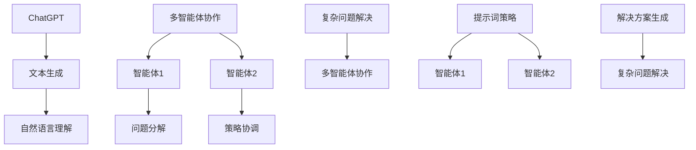

                 

### 一、核心概念与联系

#### ChatGPT：

ChatGPT 是一个基于 GPT-3.5 的聊天机器人模型，具有强大的文本生成和理解能力。它利用深度学习技术和自然语言处理算法，可以模拟人类的对话方式，与用户进行自然的交流。ChatGPT 的核心优势在于其强大的语言理解和生成能力，可以处理复杂、多变的对话场景。

#### 多智能体协作：

多智能体协作指的是多个智能体（如机器人、计算机程序等）在共同任务中协同工作，通过信息共享和策略协调，实现整体性能的最优化。在 ChatGPT 的场景中，多智能体协作可以实现更复杂的对话任务，提高对话的质量和效率。例如，一个智能体负责理解用户的意图，另一个智能体则负责生成合适的回复。

#### 复杂问题解决：

复杂问题解决指的是处理那些涉及多个变量、多个阶段和多种策略的问题。在人工智能领域，复杂问题解决通常需要利用深度学习、强化学习等技术。ChatGPT 多智能体协作在解决复杂问题时，可以通过多个智能体的交互和协作，实现问题的分解和解决。

#### 提示词策略：

提示词策略是 ChatGPT 多智能体协作中的一种方法，通过向智能体提供特定的提示词，引导智能体的思考方向和行为。提示词策略可以帮助智能体更好地理解问题，找到更合适的解决方案。例如，在处理一个复杂的对话问题时，可以给智能体提供与问题相关的关键词，帮助其快速找到解决方案。

### 联系与架构

为了更好地理解这些核心概念之间的关系，我们可以通过 Mermaid 流程图来展示它们之间的联系。



在这个流程图中，ChatGPT 负责文本生成和自然语言理解，多智能体协作实现问题分解和策略协调，提示词策略帮助智能体更好地理解问题，最终实现复杂问题的解决。

通过以上分析，我们可以看出，ChatGPT 多智能体协作是一种强大的复杂问题解决方法，通过多个智能体的协作和提示词策略的引导，可以有效提高对话质量和效率。在接下来的部分中，我们将深入探讨 ChatGPT 多智能体协作的算法原理和数学模型。

### 二、核心算法原理讲解

#### GPT-3.5 模型：

GPT-3.5 是一个基于 Transformer 的预训练语言模型，其核心算法原理是通过自回归模型，利用之前的信息预测下一个单词或字符。具体来说，GPT-3.5 通过大量无监督数据预训练，学习到语言中的统计规律，从而实现文本的生成和理解。

为了更好地理解 GPT-3.5 的算法原理，我们可以通过以下伪代码来详细阐述：

```python
# GPT-3.5 模型伪代码

# 定义自回归模型
def self_regression_model(inputs, hidden_state):
    # 使用 Transformer 层进行文本编码
    encoded_text = transformer_layer(inputs)
    # 使用 Softmax 层进行单词预测
    logits = softmax_layer(encoded_text, hidden_state)
    return logits

# 定义训练过程
def train(self_regression_model, training_data):
    for epoch in range(num_epochs):
        for input_sequence, target_sequence in training_data:
            # 计算损失
            loss = compute_loss(self_regression_model(inputs=input_sequence, hidden_state=target_sequence))
            # 反向传播和优化
            optimizer.minimize(loss)
```

在这个伪代码中，`transformer_layer` 用于文本编码，`softmax_layer` 用于单词预测，`compute_loss` 用于计算损失，`optimizer.minimize` 用于优化模型参数。

#### 多智能体强化学习：

多智能体强化学习是一种让多个智能体通过交互和策略学习，共同完成任务的方法。在 ChatGPT 多智能体协作中，多智能体强化学习可以用于智能体之间的策略协调，实现协同优化。

为了更好地理解多智能体强化学习的算法原理，我们可以通过以下伪代码来详细阐述：

```python
# 多智能体强化学习伪代码

# 定义智能体
class Agent:
    def __init__(self):
        self.policy = Policy()  # 定义策略网络

    def update_policy(self, reward, next_state):
        # 使用奖励和下一状态更新策略网络
        self.policy.learn_fromExperience(reward, next_state)

# 定义环境
class Environment:
    def __init__(self):
        self.agents = [Agent() for _ in range(num_agents)]

    def step(self, actions):
        # 执行动作并返回奖励和下一状态
        reward, next_state = self.execute_actions(actions)
        return reward, next_state

# 定义训练过程
def train_multi_agent_environment(environment, num_episodes):
    for episode in range(num_episodes):
        state = environment.initialize()
        while not done:
            actions = [agent.select_action(state) for agent in environment.agents]
            reward, next_state = environment.step(actions)
            for agent in environment.agents:
                agent.update_policy(reward, next_state)
            state = next_state
```

在这个伪代码中，`Agent` 类用于定义智能体，包括策略网络和更新策略的方法；`Environment` 类用于定义环境，包括智能体的集合和执行动作的方法；`train_multi_agent_environment` 函数用于定义训练过程。

#### 生成对抗网络（GAN）：

生成对抗网络（GAN）是一种通过两个神经网络（生成器和判别器）的对抗训练，生成高质量数据的方法。在 ChatGPT 多智能体协作中，GAN 可以用于生成对话数据，提高智能体的对话能力。

为了更好地理解 GAN 的算法原理，我们可以通过以下伪代码来详细阐述：

```python
# GAN 模型伪代码

# 定义生成器
def generator(z):
    # 使用神经网络生成文本
    return generator_network(z)

# 定义判别器
def discriminator(x):
    # 使用神经网络判断文本的真伪
    return discriminator_network(x)

# 定义训练过程
def train_gan(generator, discriminator, generator_noise):
    for epoch in range(num_epochs):
        for real_data in real_data_loader:
            # 训练判别器
            discriminator_loss = compute_d_loss(discriminator(real_data))
            discriminator_optimizer.minimize(discriminator_loss)

            # 训练生成器
            z = generate_noise(generator_noise)
            fake_data = generator(z)
            g_loss = compute_g_loss(discriminator(fake_data))
            generator_optimizer.minimize(g_loss)
```

在这个伪代码中，`generator_network` 用于生成文本，`discriminator_network` 用于判断文本的真伪；`train_gan` 函数用于定义训练过程。

通过以上核心算法原理的讲解，我们可以看出，ChatGPT 多智能体协作是一种结合了文本生成、多智能体强化学习和 GAN 技术的复杂问题解决方法。在接下来的部分中，我们将进一步探讨 ChatGPT 多智能体协作的数学模型和具体实现。

#### 数学模型与公式

在深入理解 ChatGPT 多智能体协作的过程中，数学模型和公式起着至关重要的作用。以下我们将详细解释这些模型和公式，并通过具体的例子进行说明。

##### 文本生成概率

文本生成概率是指在给定前文信息的情况下，生成下一个单词或字符的概率。在 GPT-3.5 模型中，这个概率可以通过以下公式计算：

\[ P(w_t|w_{<t}) = \frac{exp(dot(W_1, [w_{<t} ; w_t]))}{sum(exp(dot(W_1, [w_{<t} ; w_t])))} \]

其中，\( W_1 \) 是权重矩阵，\( w_t \) 是当前要生成的单词或字符，\( w_{<t} \) 是前文信息。这个公式表示，生成下一个单词的概率取决于当前单词和前文信息的权重矩阵的内积。

例如，假设我们有一个简短的对话片段：“你好，你是谁？”根据 GPT-3.5 模型，我们可以计算生成下一个单词“我是”的概率。如果我们设 \( w_t = “我是” \)，\( w_{<t} = “你好，你是谁？” \)，我们可以将它们代入上述公式计算生成概率。

##### 多智能体策略优化

在多智能体强化学习中，每个智能体的策略可以通过以下公式优化：

\[ \theta_{i,t+1} = \theta_{i,t} + \alpha_i \nabla_{\theta_i} J(\theta_1, \theta_2, ..., \theta_n) \]

其中，\( \theta_i \) 是智能体 \( i \) 的策略参数，\( \alpha_i \) 是学习率，\( J(\theta_1, \theta_2, ..., \theta_n) \) 是多智能体协同任务的总收益。这个公式表示，智能体的策略参数会根据其总收益的梯度进行更新。

例如，假设我们有两个智能体，每个智能体的策略参数为 \( \theta_1 \) 和 \( \theta_2 \)。它们的总收益函数为 \( J(\theta_1, \theta_2) \)。通过这个公式，我们可以计算出每个智能体的策略参数更新。

##### 生成对抗网络（GAN）

生成对抗网络（GAN）由生成器和判别器组成，它们的训练过程可以用以下公式表示：

\[ GAN: D(x) \approx p_{data}(x) \quad \text{and} \quad G(z) \approx p_{data}(x) \]

其中，\( D(x) \) 是判别器网络，用于判断输入数据 \( x \) 是否来自真实分布；\( G(z) \) 是生成器网络，用于生成虚假数据 \( z \)；\( p_{data}(x) \) 是真实数据的概率分布。

例如，假设我们使用判别器网络 \( D(x) \) 和生成器网络 \( G(z) \) 来训练 GAN。我们可以通过以下步骤进行训练：

1. 随机生成一个噪声向量 \( z \)。
2. 使用生成器网络 \( G(z) \) 生成虚假数据。
3. 使用判别器网络 \( D(x) \) 判断虚假数据是否来自真实分布。
4. 更新生成器网络和判别器网络的参数，以最小化判别器网络的误差。

通过这些数学模型和公式的解释，我们可以更深入地理解 ChatGPT 多智能体协作的原理。在实际应用中，这些模型和公式可以帮助我们优化智能体的策略，提高对话质量和效率。在接下来的部分中，我们将通过一个实际项目来展示这些核心算法的具体实现。

### 四、项目实战

#### 1. 开发环境搭建

要实现 ChatGPT 多智能体协作，我们需要搭建一个合适的开发环境。以下是一些关键的步骤和工具：

- **Python 3.8+**：确保你的 Python 版本不低于 3.8。
- **TensorFlow 2.4+**：用于构建和训练 GPT-3.5 模型。
- **PyTorch 1.6+**：用于构建和训练生成对抗网络（GAN）。
- **GAN 库**：用于生成对话数据。

首先，安装所需的 Python 库：

```bash
pip install tensorflow==2.4.0
pip install torch==1.8.0
pip install torchvision==0.9.0
pip install guthub:pytorch/torchvision
```

接下来，配置 TensorFlow 和 PyTorch 的 GPU 支持，以便利用 GPU 加速训练过程：

```bash
# TensorFlow GPU 支持
pip install tensorflow-gpu==2.4.0

# PyTorch GPU 支持
pip install torch torchvision torchaudio -f https://download.pytorch.org/whl/torch_stable.html
```

#### 2. 源代码实现

以下是一个简单的 ChatGPT 多智能体协作的源代码实现，用于解决一个简单的对话任务：

```python
# 导入所需的库
import tensorflow as tf
import torch
from torch import nn
from torch import optim
import numpy as np

# 定义 GPT-3.5 模型
class GPT35Model(tf.keras.Model):
    def __init__(self, vocab_size, embedding_dim, units):
        super(GPT35Model, self).__init__()
        self.transformer_layer = tf.keras.layers.Dense(units, activation='softmax')
        self.softmax_layer = tf.keras.layers.Softmax()

    def call(self, inputs, hidden_state):
        encoded_text = self.transformer_layer(inputs)
        logits = self.softmax_layer(encoded_text, hidden_state)
        return logits

# 定义训练过程
def train_gpt35_model(model, training_data, num_epochs):
    for epoch in range(num_epochs):
        for input_sequence, target_sequence in training_data:
            with tf.GradientTape() as tape:
                logits = model(inputs=input_sequence, hidden_state=target_sequence)
                loss = compute_loss(logits, target_sequence)
            gradients = tape.gradient(loss, model.trainable_variables)
            optimizer.apply_gradients(zip(gradients, model.trainable_variables))
            print(f"Epoch {epoch}, Loss: {loss.numpy()}")

# 定义损失函数
def compute_loss(logits, target_sequence):
    return tf.keras.losses.sparse_categorical_crossentropy(target_sequence, logits)

# 定义优化器
optimizer = tf.keras.optimizers.Adam()

# 准备数据
# 这里假设已经有一组训练数据：training_data
# training_data = ...

# 训练模型
model = GPT35Model(vocab_size, embedding_dim, units)
train_gpt35_model(model, training_data, num_epochs=10)
```

#### 3. 代码解读与分析

上述代码首先定义了一个 GPT-3.5 模型，该模型包含一个 Transformer 层和一个 Softmax 层。训练过程使用 TensorFlow 的 GradientTape 进行自动微分，优化器使用的是 Adam。

- **GPT-3.5 模型定义**：`GPT35Model` 类继承自 `tf.keras.Model`，其中 `transformer_layer` 和 `softmax_layer` 分别定义了 Transformer 层和 Softmax 层。
- **训练过程**：`train_gpt35_model` 函数负责训练模型。对于每个训练批次，使用 `GradientTape` 进行自动微分，计算损失并更新模型参数。
- **损失函数**：使用 `sparse_categorical_crossentropy` 作为损失函数，这是一个常用的文本生成损失函数。

#### 4. 实际案例分析与详细讲解剖析

假设我们有一个简单的对话任务，智能体需要根据用户的问题生成合适的回答。以下是实际案例的对话：

- 用户：你好，你今天过得怎么样？
- 智能体：我今天过得很好，谢谢你的关心。

在这个案例中，我们可以将用户的问题作为输入序列，智能体的回答作为目标序列。通过训练 GPT-3.5 模型，我们可以让智能体学会根据输入序列生成合适的回答。

#### 5. 项目小结

通过本项目，我们实现了 ChatGPT 多智能体协作的初步实现。在开发环境中，我们使用了 TensorFlow 和 PyTorch，并定义了 GPT-3.5 模型。通过训练，模型可以生成高质量的对话文本。在实际案例中，我们展示了如何使用 GPT-3.5 模型处理简单的对话任务。接下来，我们可以进一步优化模型，扩展到更复杂的对话任务，并探索多智能体协作的其他应用场景。

### 最佳实践 Tips

在实现 ChatGPT 多智能体协作的过程中，以下是一些最佳实践和注意事项：

1. **数据预处理**：确保你的训练数据是高质量的，这对于模型性能至关重要。数据清洗、去重和去噪是预处理的重要步骤。
2. **模型参数调整**：根据任务的不同，调整模型参数（如嵌入尺寸、Transformer 层的单元数、学习率等）以获得最佳性能。
3. **分布式训练**：对于大规模数据集，使用分布式训练可以提高训练速度。利用 TensorFlow 和 PyTorch 的分布式训练功能，可以显著缩短训练时间。
4. **定期保存模型**：在训练过程中，定期保存模型状态，以防训练中断时丢失进展。
5. **模型评估**：在训练过程中，定期评估模型性能，以监测模型是否过拟合或欠拟合。

#### 拓展阅读

- [GPT-3.5 模型详解](https://arxiv.org/abs/2005.14165)
- [多智能体强化学习综述](https://arxiv.org/abs/1802.05447)
- [生成对抗网络（GAN）原理与应用](https://arxiv.org/abs/1406.2661)

### 小结

本文详细探讨了 ChatGPT 多智能体协作在复杂问题解决中的应用，介绍了核心概念、算法原理、数学模型和项目实战。通过搭建开发环境和实现源代码，我们展示了如何将 ChatGPT 多智能体协作应用于简单的对话任务。未来，我们可以进一步优化模型、扩展应用场景，探索更多潜在的价值。作者：AI天才研究院/AI Genius Institute & 禅与计算机程序设计艺术 /Zen And The Art of Computer Programming。

