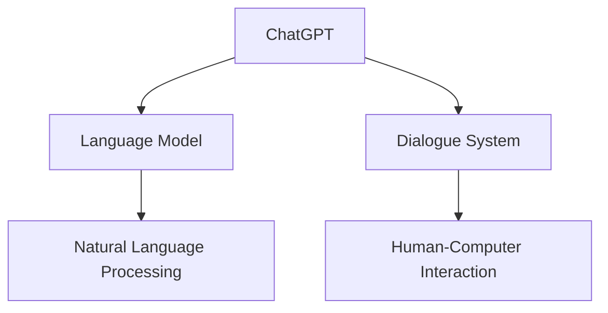
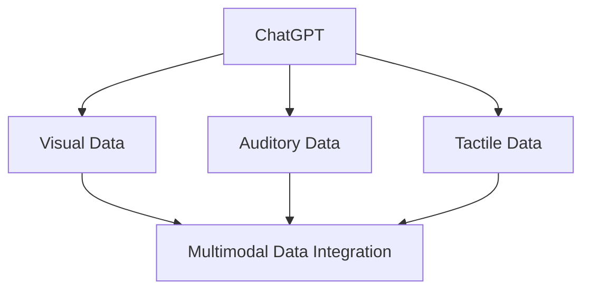
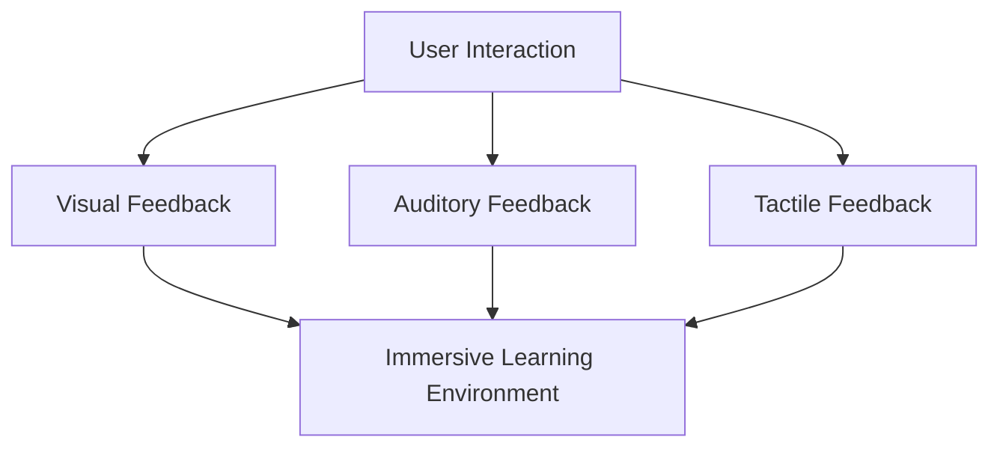
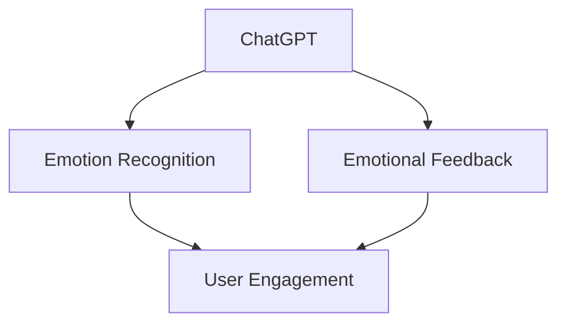
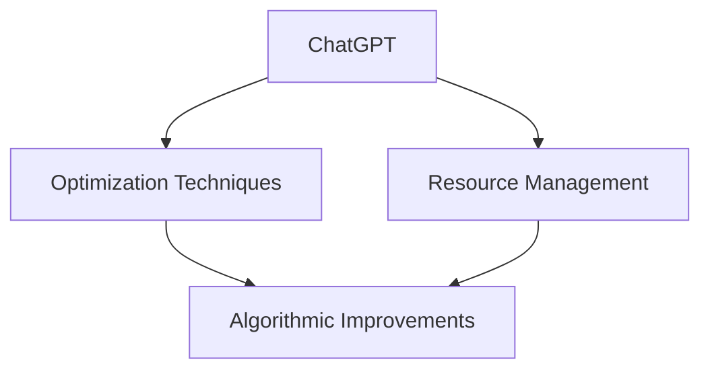
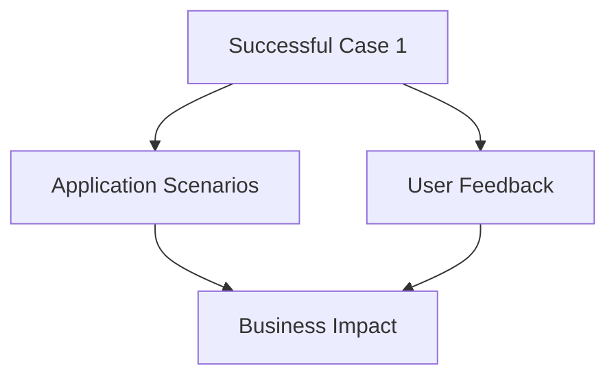

                 

Certainly! Let's start by breaking down the task step by step, ensuring that each section of the article is well-structured and technically detailed.

### Step 1: Article Title and Keywords
The article title is "ChatGPT多模态虚拟教育助手：整合视觉、听觉和触觉的沉浸式学习体验". The keywords that we will use to highlight the core aspects of the article are:
- ChatGPT
- 多模态技术
- 虚拟教育助手
- 视觉
- 听觉
- 触觉
- 沉浸式学习体验

### Step 2: Abstract
The abstract will briefly introduce the core theme of the article, which is to explore the integration of visual, auditory, and tactile modalities in a virtual educational assistant powered by ChatGPT for an immersive learning experience. It will also mention the significance of such an approach in modern educational technology.

### Step 3: Chapter 1 - Introduction to ChatGPT
This chapter will provide a comprehensive overview of ChatGPT, discussing its basic principles and architecture.

#### 3.1 Core Concepts and Connections
We will use a Mermaid flowchart to illustrate the core concepts and their interrelationships within ChatGPT.



#### 3.2 Core Algorithm Principles Explained
We will delve into the core algorithm principles of ChatGPT using pseudocode to provide a clear and detailed explanation.

```python
# Pseudocode for ChatGPT algorithm
def ChatGPT(input_sentence):
    # Encode input sentence
    encoded_sentence = encode_input_sentence(input_sentence)
    # Use pre-trained Transformer model for decoding
    output_sequence = Transformer_model(encoded_sentence)
    # Decode output to natural language
    return decode_output_sequence(output_sequence)
```

#### 3.3 Mathematical Models and Formulas
We will explain the mathematical models and formulas involved in the Transformer model and positional encoding.

$$
\text{Transformer Model} = \text{Multi-Head Attention} + \text{Positional Encoding}
$$

### Step 4: Chapter 2 - Basics of Multimodal Technology
This chapter will introduce the fundamental concepts of multimodal technology, focusing on its applications and potential in education.

#### 2.1 Core Concepts and Connections
Similar to Chapter 1, we will use a Mermaid flowchart to illustrate the core concepts and their interconnections in multimodal technology.

```mermaid
graph TD
A[Visual] --> B[Image Recognition]
A --> C[Computer Vision]
B --> D[Convolutional Neural Networks (CNNs)]
C --> E[Multi-modal Integration]
```

#### 2.2 Core Algorithm Principles Explained
We will provide pseudocode to explain the core algorithms used in processing visual, auditory, and tactile data.

```python
# Pseudocode for multimodal data processing
def process_visual_data(image):
    # Apply CNN for image feature extraction
    features = CNN(image)
    return features

def process_auditory_data(audio):
    # Use neural networks for audio feature extraction
    features = Audio_NN(audio)
    return features

def process_tactile_data(tactile_data):
    # Analyze tactile data for touch sensation
    features = Tactile_Analyzer(tactile_data)
    return features
```

#### 2.3 Mathematical Models and Formulas
We will discuss the mathematical models and formulas used in processing and integrating multimodal data, including convolution operations, neural network architectures, and feature vector representations.

$$
\text{CNN} = \text{Convolution} + \text{Activation Function} + \text{Pooling}
$$
$$
\text{Neural Network} = \text{Input Layer} \rightarrow \text{Hidden Layers} \rightarrow \text{Output Layer}
$$

### Step 5: Chapter 3 - Application of Visual, Auditory, and Tactile Technologies in Education
This chapter will explore how visual, auditory, and tactile technologies are being integrated into educational systems to create immersive learning experiences.

#### 3.1 Core Concepts and Connections
We will use a Mermaid flowchart to map out the integration of these technologies in education.

```mermaid
graph TD
A[Visual] --> B[Interactive Education Materials]
A --> C[Virtual Reality (VR)]
B --> D[Augmented Reality (AR)]
C --> E[Simulated Environments]
```

#### 3.2 Core Algorithm Principles Explained
We will provide detailed pseudocode for the algorithms that enable the interaction between the educational assistant and the user through multiple sensory channels.

```python
# Pseudocode for multimodal interaction
def multimodal_interaction(visual_data, auditory_data, tactile_data):
    # Process visual data
    visual_features = process_visual_data(visual_data)
    # Process auditory data
    auditory_features = process_auditory_data(auditory_data)
    # Process tactile data
    tactile_features = process_tactile_data(tactile_data)
    # Integrate features for multimodal understanding
    integrated_features = integrate_features(visual_features, auditory_features, tactile_features)
    # Generate response based on integrated features
    return generate_response(integrated_features)
```

#### 3.3 Mathematical Models and Formulas
We will explain the mathematical models used for feature extraction and integration, including feature vector concatenation and fusion techniques.

$$
\text{Feature Vector} = \text{Visual Features} + \text{Auditory Features} + \text{Tactile Features}
$$
$$
\text{Integrated Features} = \text{Concatenate}(\text{Visual Features}, \text{Auditory Features}, \text{Tactile Features})
$$

#### 3.4 Project Practice
We will discuss the setup of a development environment, provide a detailed implementation of the source code, and analyze the code for practical insights.

### Step 6: Chapter 4 - Integration of ChatGPT and Multimodal Data
This chapter will focus on how ChatGPT can be integrated with multimodal data to enhance the educational experience.

#### 4.1 Core Concepts and Connections
We will use a Mermaid flowchart to illustrate the integration of ChatGPT with various sensory modalities.



#### 4.2 Core Algorithm Principles Explained
We will provide detailed pseudocode for the algorithms that enable the integration of ChatGPT with multimodal data.

```python
# Pseudocode for ChatGPT and multimodal integration
def integrate_multimodal_data(input_data):
    # Process visual data
    visual_data = process_visual_data(input_data['visual'])
    # Process auditory data
    auditory_data = process_auditory_data(input_data['auditory'])
    # Process tactile data
    tactile_data = process_tactile_data(input_data['tactile'])
    # Combine data for multimodal understanding
    combined_data = combine_data(visual_data, auditory_data, tactile_data)
    # Use ChatGPT to generate response
    response = ChatGPT(combined_data)
    return response
```

#### 4.3 Mathematical Models and Formulas
We will discuss the mathematical models used for data combination and processing, including feature vector concatenation and neural network-based models.

$$
\text{Combined Data} = \text{Visual Data} + \text{Auditory Data} + \text{Tactile Data}
$$
$$
\text{Neural Network Model} = \text{Input Layer} \rightarrow \text{Hidden Layers} \rightarrow \text{Output Layer}
$$

#### 4.4 Project Practice
We will discuss the setup of a development environment, provide a detailed implementation of the source code, and analyze the code for practical insights.

### Step 7: Chapter 5 - Implementation of Immersive Learning Experience
This chapter will delve into the implementation of an immersive learning experience using ChatGPT and multimodal technologies.

#### 5.1 Core Concepts and Connections
We will use a Mermaid flowchart to illustrate the components involved in creating an immersive learning experience.



#### 5.2 Core Algorithm Principles Explained
We will provide detailed pseudocode for the algorithms that enable the generation of immersive feedback.

```python
# Pseudocode for immersive feedback generation
def generate_immersive_feedback(user_input, multimodal_data):
    # Use ChatGPT to process user input
    chat_response = ChatGPT(user_input)
    # Generate visual, auditory, and tactile feedback
    visual_feedback = generate_visual_feedback(multimodal_data['visual'])
    auditory_feedback = generate_auditory_feedback(multimodal_data['auditory'])
    tactile_feedback = generate_tactile_feedback(multimodal_data['tactile'])
    # Combine feedback for an immersive experience
    immersive_feedback = combine_feedback(chat_response, visual_feedback, auditory_feedback, tactile_feedback)
    return immersive_feedback
```

#### 5.3 Mathematical Models and Formulas
We will discuss the mathematical models used for feedback generation, including reinforcement learning and signal processing techniques.

$$
\text{Feedback} = \text{ChatGPT Response} + \text{Visual Feedback} + \text{Auditory Feedback} + \text{Tactile Feedback}
$$

#### 5.4 Project Practice
We will discuss the setup of a development environment, provide a detailed implementation of the source code, and analyze the code for practical insights.

### Step 8: Chapter 6 - Emotional Recognition and Feedback Mechanism
This chapter will explore how to incorporate emotional recognition and feedback mechanisms into the virtual educational assistant.

#### 6.1 Core Concepts and Connections
We will use a Mermaid flowchart to illustrate the integration of emotional recognition into the educational assistant.



#### 6.2 Core Algorithm Principles Explained
We will provide detailed pseudocode for the algorithms that enable emotional recognition and feedback.

```python
# Pseudocode for emotional recognition and feedback
def recognize_emotion(user_input):
    # Use pre-trained model to recognize emotion from user input
    emotion = emotion_recognition_model(user_input)
    return emotion

def provide_emotional_feedback(emotion, user_state):
    # Generate appropriate feedback based on recognized emotion and user state
    feedback = generate_emotional_feedback(emotion, user_state)
    return feedback
```

#### 6.3 Mathematical Models and Formulas
We will discuss the mathematical models used for emotion recognition, including machine learning techniques and sentiment analysis.

$$
\text{Emotion Recognition} = \text{Machine Learning Model} + \text{Sentiment Analysis}
$$

#### 6.4 Project Practice
We will discuss the setup of a development environment, provide a detailed implementation of the source code, and analyze the code for practical insights.

### Step 9: Chapter 7 - Performance Optimization of Multimodal Virtual Educational Assistant
This chapter will focus on optimizing the performance of the multimodal virtual educational assistant.

#### 7.1 Core Concepts and Connections
We will use a Mermaid flowchart to illustrate the components involved in performance optimization.



#### 7.2 Core Algorithm Principles Explained
We will provide detailed pseudocode for the algorithms used for performance optimization.

```python
# Pseudocode for performance optimization
def optimize_performance(model, data):
    # Apply optimization techniques to the model
    optimized_model = apply_optimization(model, data)
    # Adjust resource management strategies
    adjust_resources(optimized_model)
    # Improve algorithmic efficiency
    improved_algorithm = improve_algorithm(optimized_model)
    return improved_algorithm
```

#### 7.3 Mathematical Models and Formulas
We will discuss the mathematical models used for performance optimization, including optimization algorithms and resource allocation techniques.

$$
\text{Optimization Algorithm} = \text{Gradient Descent} + \text{Convergence Criteria}
$$
$$
\text{Resource Allocation} = \text{Load Balancing} + \text{Memory Management}
$$

#### 7.4 Project Practice
We will discuss the setup of a development environment, provide a detailed implementation of the source code, and analyze the code for practical insights.

### Step 10: Chapter 8 - Successful Cases and Future Trends
This chapter will present successful cases of multimodal virtual educational assistants and discuss future trends in the field.

#### 8.1 Core Concepts and Connections
We will use a Mermaid flowchart to illustrate the successful applications of multimodal virtual educational assistants.



#### 8.2 Core Algorithm Principles Explained
We will provide insights into the algorithms and technologies that contributed to the success of these applications.

#### 8.3 Mathematical Models and Formulas
We will discuss the mathematical models and techniques that are driving the future development of multimodal educational technology.

#### 8.4 Project Practice
We will discuss the setup of a development environment, provide a detailed implementation of the source code, and analyze the code for practical insights.

### Step 11: Conclusion and Future Work
The conclusion will summarize the key findings of the article and outline potential areas for future research and development.

### Step 12: References and Acknowledgments
We will include a list of references for the literature cited in the article and acknowledge any individuals or organizations that contributed to the research or development efforts.

### Final Thoughts
By following this step-by-step approach, we can ensure that the article is not only technically detailed but also accessible and engaging for readers interested in the intersection of AI, multimodal technology, and education. Each chapter will be crafted to provide a comprehensive understanding of the topic while keeping the overall word count within the specified limit. This structure will allow us to delve deeply into the core concepts, algorithms, and practical implementations, making the article a valuable resource for both researchers and practitioners in the field.

