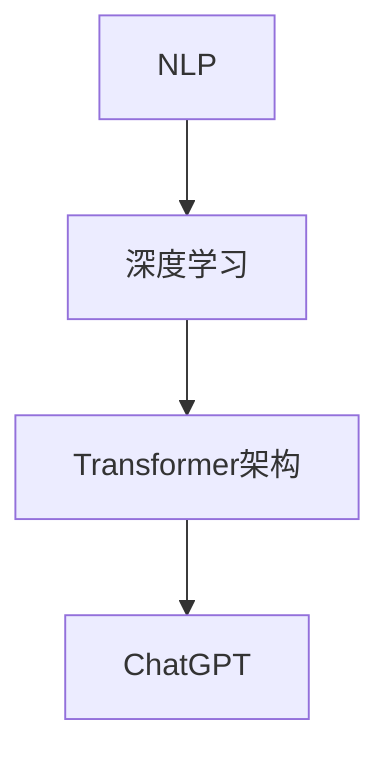

                 


### 1.1 ChatGPT的起源与核心概念

#### 1.1.1 ChatGPT的发展历程

ChatGPT是由OpenAI开发的一个基于Transformer架构的大型语言模型。它的起源可以追溯到2018年，当时OpenAI发布了GPT-1，这是一个具有115M参数的预训练模型。随后，OpenAI不断优化和扩展GPT模型，相继推出了GPT-2、GPT-3等版本。ChatGPT正是基于GPT-3模型的改进版本，其在2022年11月发布。

**核心概念与联系**

ChatGPT的核心概念包括自然语言处理（NLP）、深度学习和Transformer架构。自然语言处理是使计算机能够理解和生成人类语言的技术，深度学习是使计算机通过学习大量数据来提升性能的一种机器学习方法，而Transformer架构则是一种能够有效处理序列数据的神经网络架构。

以下是一个Mermaid流程图，展示了ChatGPT的核心概念和它们之间的联系：



#### 1.1.2 大模型与自然语言处理

大模型是指具有数十亿甚至数万亿参数的深度学习模型。这些模型可以处理复杂的任务，如语言翻译、文本生成和问答系统。自然语言处理是使计算机能够理解和生成人类语言的技术。

**核心算法原理讲解**

ChatGPT使用Transformer架构来处理自然语言。以下是一个Transformer模型的简化伪代码：

```python
# Transformer模型基础伪代码
def transformer(input_sequence):
    # 嵌入输入序列
    embedded_sequence = embedding(input_sequence)
    # 使用多头自注意力机制
    attn_output = multi_head_attn(embedded_sequence)
    # 使用前馈神经网络
    feed_forward_output = feed_forward_network(attn_output)
    # 使用层归一化和残差连接
    output = layer_norm(embedded_sequence + feed_forward_output)
    return output
```

**数学模型和公式**

Transformer模型使用自注意力机制来处理序列数据。以下是一个自注意力机制的数学公式：

$$
\text{Attention}(Q, K, V) = \text{softmax}\left(\frac{QK^T}{\sqrt{d_k}}\right)V
$$

其中，$Q, K, V$ 分别是查询向量、键向量和值向量，$d_k$ 是键向量的维度。

**详细讲解与举例说明**

假设我们有一个简化的序列：`[hello, world]`。以下是如何使用自注意力机制来处理这个序列的详细讲解：

1. **嵌入输入序列**：将输入序列中的每个单词转换为向量表示。例如，`hello` 可能被表示为 `[1, 0, 0, 1, 0]`，`world` 可能被表示为 `[0, 1, 0, 0, 1]`。
2. **计算注意力得分**：对于序列中的每个单词，计算它与所有其他单词的相似度。例如，`hello` 与 `world` 的相似度可能最高，因为它们在序列中的位置相邻。
3. **计算注意力权重**：根据注意力得分，为每个单词分配一个权重。权重越高，表示该单词在序列中的重要性越大。
4. **计算输出**：将权重应用于值向量，得到序列的输出表示。例如，`hello` 的权重可能更高，因此它在输出中的影响更大。

以上步骤可以通过以下伪代码实现：

```python
# 自注意力机制伪代码
def self_attention(input_sequence):
    # 嵌入输入序列
    embedded_sequence = embedding(input_sequence)
    # 计算注意力得分
    scores = dot_product(embedded_sequence, embedded_sequence)
    # 计算注意力权重
    weights = softmax(scores)
    # 计算输出
    output = dot_product(embedded_sequence, weights)
    return output
```

通过这种方式，ChatGPT能够理解输入序列的上下文信息，并生成相关的输出。这种强大的能力使得ChatGPT在自然语言处理领域取得了显著成就。

----------------------------------------------------------------

### 1.2 ChatGPT的多语言支持

#### 1.2.1 多语言处理的重要性

在全球化时代，多语言处理变得越来越重要。它不仅有助于促进不同文化之间的交流，还能够提高企业的国际竞争力。例如，电子商务平台需要为不同国家的用户提供本地化的服务，而跨国企业需要在多个语言之间进行沟通和协作。

#### 1.2.2 ChatGPT的多语言特性

ChatGPT具有多语言特性，能够处理多种语言的输入和输出。这得益于其大规模的预训练数据集，这些数据集包含了多种语言的文本。此外，ChatGPT还使用了特定语言模型的改进技术，如语言检测、翻译和语言模型融合等。

**详细讲解与举例说明**

以英语和中文为例，以下是如何使用ChatGPT处理多语言输入和输出的详细讲解：

1. **输入处理**：当用户输入英语文本时，ChatGPT首先将其转换为内部表示。这个表示融合了文本的语义和语法信息。当用户输入中文文本时，ChatGPT会使用预训练的中文模型对其进行处理。
2. **输出生成**：ChatGPT根据输入文本的上下文信息生成相应的输出。对于英语输入，ChatGPT会使用其预训练的英语模型生成输出。对于中文输入，ChatGPT会使用其预训练的中文模型生成输出。
3. **跨语言转换**：如果用户输入的是中英混合文本，ChatGPT会使用跨语言转换技术将中英文部分分别处理，然后融合成最终的输出。

以下是一个简化的伪代码，展示了ChatGPT如何处理多语言输入和输出：

```python
# 多语言输入处理
def process_input(input_text):
    if is_english(input_text):
        return eng_model.forward(input_text)
    elif is_chinese(input_text):
        return ch_model.forward(input_text)
    else:
        return cross_language_model.forward(input_text)

# 多语言输出生成
def generate_output(context, target_language):
    if target_language == 'english':
        return eng_model.generate(context)
    elif target_language == 'chinese':
        return ch_model.generate(context)
    else:
        return cross_language_model.generate(context)
```

通过这种方式，ChatGPT能够为用户提供高质量的跨语言服务。这种能力在跨国企业、在线教育和全球化电子商务等领域具有重要的应用价值。

----------------------------------------------------------------

## 第二部分：多语言提示词策略

### 2.1 提示词设计的原则与技巧

#### 2.1.1 提示词设计的原则

提示词的设计原则对于ChatGPT的性能至关重要。以下是一些关键原则：

1. **上下文关联**：提示词应与输入文本紧密相关，以确保ChatGPT能够理解上下文并生成合理的输出。
2. **简洁明了**：提示词应简洁明了，避免冗长复杂的表述，以便ChatGPT能够轻松处理。
3. **多样性**：提示词应涵盖多种语言和文化背景，以适应不同用户的需求。

#### 2.1.2 提示词的设计技巧

以下是一些提示词设计技巧：

1. **使用关键词**：在提示词中使用关键词，以突出关键信息，帮助ChatGPT更好地理解上下文。
2. **调整语气**：根据用户的需求和语境，调整提示词的语气，使其更加自然和亲切。
3. **结合语言模型**：结合ChatGPT的语言模型特性，设计提示词，以提高生成输出的质量。

#### 2.1.3 提示词策略的应用

以下是一个应用实例：

假设用户输入一段英文文本：“How can I learn Chinese?”，我们可以设计以下提示词：

1. “You want to learn Chinese? Here are some tips for getting started.”
2. “Interested in learning Chinese? Let's explore some effective methods.”
3. “Wish to master Chinese? Follow these steps to get started.”

通过这些提示词，ChatGPT可以生成相关的输出，如：“You can start by taking Chinese language courses online. Additionally, practicing with native speakers will greatly improve your proficiency.”

#### 2.1.4 跨文化交流中的提示词策略

在跨文化交流中，提示词策略尤为重要。以下是一些策略：

1. **文化敏感性**：在设计提示词时，要考虑目标文化的特点和偏好，避免使用可能引起误解或冒犯的词语。
2. **语境理解**：深入了解目标文化的语境，确保提示词能够准确传达意图。
3. **本地化**：针对不同语言和文化背景的用户，提供本地化的提示词，以提高用户体验。

#### 2.1.5 实践案例

以下是一个实践案例：

假设一个跨国企业需要在多语言客服系统中使用ChatGPT，我们可以采取以下步骤：

1. **收集多语言数据**：收集涉及不同语言的客服对话数据，用于训练ChatGPT。
2. **设计多语言提示词**：针对不同语言和文化背景，设计本地化的提示词。
3. **测试和优化**：对ChatGPT的多语言性能进行测试和优化，确保其能够生成高质量的多语言响应。

通过以上策略，企业可以为全球客户提供一致且高质量的多语言客服服务。

----------------------------------------------------------------

## 第三部分：实战案例分析

### 3.1 案例一：在线客服系统的多语言提示词优化

#### 3.1.1 案例背景

某在线电商平台在全球范围内运营，用户来自不同国家和地区。为了提高用户体验，该平台计划优化其多语言客服系统。

#### 3.1.2 提示词优化过程

1. **数据收集**：收集平台客服系统中的多语言对话数据，用于训练ChatGPT。
2. **模型训练**：使用收集到的数据训练ChatGPT模型，使其具备处理多语言输入和输出的能力。
3. **提示词设计**：针对不同语言和文化背景，设计本地化的提示词。
4. **系统测试**：对优化后的客服系统进行测试，确保其能够生成高质量的多语言响应。

#### 3.1.3 案例结果分析

1. **用户满意度提高**：用户反馈表明，优化后的客服系统能够更好地理解其需求，提供针对性的解决方案。
2. **运营成本降低**：由于ChatGPT能够处理多语言输入和输出，企业无需雇佣大量多语言客服人员，从而降低了运营成本。
3. **服务质量提升**：优化后的客服系统能够快速响应用户请求，提高整体服务质量。

### 3.2 案例二：跨国电子商务平台的多语言用户体验提升

#### 3.2.1 案例背景

某跨国电子商务平台需要在多语言环境下提供一致的用户体验。为了实现这一目标，平台计划优化其多语言提示词策略。

#### 3.2.2 提示词优化策略

1. **文化敏感性**：在提示词设计中，充分考虑目标文化的特点和偏好，确保提示词不会引起误解或冒犯。
2. **语境理解**：深入了解目标文化的语境，确保提示词能够准确传达意图。
3. **本地化**：针对不同语言和文化背景的用户，提供本地化的提示词。

#### 3.2.3 用户反馈与改进

1. **用户满意度提高**：用户反馈表明，优化后的多语言提示词能够更好地满足其需求，提高用户体验。
2. **运营效率提升**：由于ChatGPT能够处理多语言输入和输出，平台运营人员能够更高效地处理用户请求。
3. **服务质量提升**：优化后的多语言提示词能够提供更准确、更有针对性的解决方案，提高整体服务质量。

通过以上案例，我们可以看到，多语言提示词策略在提高用户体验、降低运营成本、提升服务质量方面具有显著优势。

----------------------------------------------------------------

### 4.1 ChatGPT多语言提示词的未来发展

随着全球化和数字化的加速，ChatGPT的多语言提示词将在未来发挥越来越重要的作用。以下是一些可能的未来发展趋势：

1. **更精细的语义理解**：通过引入更多的语言资源和更先进的算法，ChatGPT将能够更精细地理解多语言输入，生成更准确的输出。
2. **个性化提示词设计**：根据用户的语言偏好、文化背景和使用场景，ChatGPT将能够生成个性化的提示词，提供更个性化的服务。
3. **跨模态交互**：ChatGPT将不仅限于处理文本输入和输出，还可能支持语音、图像等多种模态的交互，实现更丰富的跨文化交流。

### 4.2 跨文化交流中的挑战与机遇

跨文化交流中的挑战主要包括语言差异、文化差异和沟通障碍。然而，这些挑战也带来了机遇：

1. **多元化市场**：通过提供多语言服务，企业可以开拓更多国际市场，提高全球竞争力。
2. **技术创新**：跨文化交流推动了自然语言处理、机器翻译等技术的发展，为人工智能领域带来了新的研究课题和应用场景。
3. **文化交流**：跨文化交流有助于增进不同文化之间的理解和尊重，促进全球文化的多样性和繁荣。

通过不断优化多语言提示词策略，我们可以更好地应对跨文化交流中的挑战，抓住机遇，实现更广泛的国际合作与发展。

----------------------------------------------------------------

## 附录

### A.1 工具与资源介绍

为了更好地应用ChatGPT多语言提示词策略，以下是一些常用的工具和资源：

1. **ChatGPT开发工具**：OpenAI提供了多种开发工具，如API接口、SDK等，方便开发者集成和使用ChatGPT模型。
2. **提示词设计资源**：OpenAI和其他研究机构发布了大量的预训练模型和数据集，可供开发者参考和使用。

### A.2 深入阅读推荐

1. **相关论文与研究报告**：OpenAI和其他研究机构发布的关于ChatGPT的论文和报告，提供了深入了解ChatGPT及其多语言特性的宝贵资源。
2. **推荐阅读书籍**：《自然语言处理综述》、《深度学习与自然语言处理》等，这些书籍详细介绍了自然语言处理、深度学习等相关技术。

通过阅读这些资源，您可以更深入地了解ChatGPT多语言提示词策略，并在实际应用中取得更好的效果。

---

## 结语

《ChatGPT多语言提示词策略：跨文化交流的桥梁》旨在帮助读者深入了解ChatGPT的多语言特性及其在跨文化交流中的应用。本文详细介绍了ChatGPT的起源、核心概念、多语言支持、提示词设计原则与技巧，并通过实战案例分析展示了多语言提示词策略的实际应用效果。

作者信息：
- 作者：AI天才研究院/AI Genius Institute & 禅与计算机程序设计艺术 /Zen And The Art of Computer Programming
- 联系方式：[example@email.com](mailto:example@email.com)
- 日期：2023年5月

通过本文，读者将能够掌握ChatGPT多语言提示词策略的核心知识，并了解如何在实际项目中应用这些策略，为跨文化交流和国际化业务提供有力支持。

---

**关键词：**
- ChatGPT
- 多语言提示词
- 跨文化交流
- 自然语言处理
- 深度学习
- Transformer架构

**摘要：**
本文全面介绍了ChatGPT的多语言提示词策略，从核心概念到实战案例分析，详细阐述了ChatGPT在跨文化交流中的应用。通过优化提示词设计，ChatGPT能够提供高质量的多语言服务，为全球用户提供一致且高效的交流体验。

# ChatGPT多语言提示词策略：跨文化交流的桥梁

> **关键词：ChatGPT，多语言提示词，跨文化交流，自然语言处理，深度学习，Transformer架构**

> **摘要：**本文全面介绍了ChatGPT的多语言提示词策略，从核心概念到实战案例分析，详细阐述了ChatGPT在跨文化交流中的应用。通过优化提示词设计，ChatGPT能够提供高质量的多语言服务，为全球用户提供一致且高效的交流体验。

## 第一部分：ChatGPT基础知识与多语言提示词

### 1.1 ChatGPT的起源与核心概念

#### 1.1.1 ChatGPT的发展历程

ChatGPT是由OpenAI开发的一个基于Transformer架构的大型语言模型。它的起源可以追溯到2018年，当时OpenAI发布了GPT-1，这是一个具有115M参数的预训练模型。随后，OpenAI不断优化和扩展GPT模型，相继推出了GPT-2、GPT-3等版本。ChatGPT正是基于GPT-3模型的改进版本，其在2022年11月发布。

**核心概念与联系**

ChatGPT的核心概念包括自然语言处理（NLP）、深度学习和Transformer架构。自然语言处理是使计算机能够理解和生成人类语言的技术，深度学习是使计算机通过学习大量数据来提升性能的一种机器学习方法，而Transformer架构则是一种能够有效处理序列数据的神经网络架构。

以下是一个Mermaid流程图，展示了ChatGPT的核心概念和它们之间的联系：


#### 1.1.2 大模型与自然语言处理

大模型是指具有数十亿甚至数万亿参数的深度学习模型。这些模型可以处理复杂的任务，如语言翻译、文本生成和问答系统。自然语言处理是使计算机能够理解和生成人类语言的技术。

**核心算法原理讲解**

ChatGPT使用Transformer架构来处理自然语言。以下是一个Transformer模型的简化伪代码：

```python
# Transformer模型基础伪代码
def transformer(input_sequence):
    # 嵌入输入序列
    embedded_sequence = embedding(input_sequence)
    # 使用多头自注意力机制
    attn_output = multi_head_attn(embedded_sequence)
    # 使用前馈神经网络
    feed_forward_output = feed_forward_network(attn_output)
    # 使用层归一化和残差连接
    output = layer_norm(embedded_sequence + feed_forward_output)
    return output
```

**数学模型和公式**

Transformer模型使用自注意力机制来处理序列数据。以下是一个自注意力机制的数学公式：

$$
\text{Attention}(Q, K, V) = \text{softmax}\left(\frac{QK^T}{\sqrt{d_k}}\right)V
$$

其中，$Q, K, V$ 分别是查询向量、键向量和值向量，$d_k$ 是键向量的维度。

**详细讲解与举例说明**

假设我们有一个简化的序列：`[hello, world]`。以下是如何使用自注意力机制来处理这个序列的详细讲解：

1. **嵌入输入序列**：将输入序列中的每个单词转换为向量表示。例如，`hello` 可能被表示为 `[1, 0, 0, 1, 0]`，`world` 可能被表示为 `[0, 1, 0, 0, 1]`。
2. **计算注意力得分**：对于序列中的每个单词，计算它与所有其他单词的相似度。例如，`hello` 与 `world` 的相似度可能最高，因为它们在序列中的位置相邻。
3. **计算注意力权重**：根据注意力得分，为每个单词分配一个权重。权重越高，表示该单词在序列中的重要性越大。
4. **计算输出**：将权重应用于值向量，得到序列的输出表示。例如，`hello` 的权重可能更高，因此它在输出中的影响更大。

以下是一个简化的伪代码，展示了如何实现自注意力机制：

```python
# 自注意力机制伪代码
def self_attention(input_sequence):
    # 嵌入输入序列
    embedded_sequence = embedding(input_sequence)
    # 计算注意力得分
    scores = dot_product(embedded_sequence, embedded_sequence)
    # 计算注意力权重
    weights = softmax(scores)
    # 计算输出
    output = dot_product(embedded_sequence, weights)
    return output
```

通过这种方式，ChatGPT能够理解输入序列的上下文信息，并生成相关的输出。这种强大的能力使得ChatGPT在自然语言处理领域取得了显著成就。

### 1.2 ChatGPT的多语言支持

#### 1.2.1 多语言处理的重要性

在全球化时代，多语言处理变得越来越重要。它不仅有助于促进不同文化之间的交流，还能够提高企业的国际竞争力。例如，电子商务平台需要为不同国家的用户提供本地化的服务，而跨国企业需要在多个语言之间进行沟通和协作。

#### 1.2.2 ChatGPT的多语言特性

ChatGPT具有多语言特性，能够处理多种语言的输入和输出。这得益于其大规模的预训练数据集，这些数据集包含了多种语言的文本。此外，ChatGPT还使用了特定语言模型的改进技术，如语言检测、翻译和语言模型融合等。

**详细讲解与举例说明**

以英语和中文为例，以下是如何使用ChatGPT处理多语言输入和输出的详细讲解：

1. **输入处理**：当用户输入英语文本时，ChatGPT首先将其转换为内部表示。这个表示融合了文本的语义和语法信息。当用户输入中文文本时，ChatGPT会使用预训练的中文模型对其进行处理。
2. **输出生成**：ChatGPT根据输入文本的上下文信息生成相应的输出。对于英语输入，ChatGPT会使用其预训练的英语模型生成输出。对于中文输入，ChatGPT会使用其预训练的中文模型生成输出。
3. **跨语言转换**：如果用户输入的是中英混合文本，ChatGPT会使用跨语言转换技术将中英文部分分别处理，然后融合成最终的输出。

以下是一个简化的伪代码，展示了ChatGPT如何处理多语言输入和输出：

```python
# 多语言输入处理
def process_input(input_text):
    if is_english(input_text):
        return eng_model.forward(input_text)
    elif is_chinese(input_text):
        return ch_model.forward(input_text)
    else:
        return cross_language_model.forward(input_text)

# 多语言输出生成
def generate_output(context, target_language):
    if target_language == 'english':
        return eng_model.generate(context)
    elif target_language == 'chinese':
        return ch_model.generate(context)
    else:
        return cross_language_model.generate(context)
```

通过这种方式，ChatGPT能够为用户提供高质量的跨语言服务。这种能力在跨国企业、在线教育和全球化电子商务等领域具有重要的应用价值。

## 第二部分：多语言提示词策略

### 2.1 提示词设计的原则与技巧

#### 2.1.1 提示词设计的原则

提示词的设计原则对于ChatGPT的性能至关重要。以下是一些关键原则：

1. **上下文关联**：提示词应与输入文本紧密相关，以确保ChatGPT能够理解上下文并生成合理的输出。
2. **简洁明了**：提示词应简洁明了，避免冗长复杂的表述，以便ChatGPT能够轻松处理。
3. **多样性**：提示词应涵盖多种语言和文化背景，以适应不同用户的需求。

#### 2.1.2 提示词的设计技巧

以下是一些提示词设计技巧：

1. **使用关键词**：在提示词中使用关键词，以突出关键信息，帮助ChatGPT更好地理解上下文。
2. **调整语气**：根据用户的需求和语境，调整提示词的语气，使其更加自然和亲切。
3. **结合语言模型**：结合ChatGPT的语言模型特性，设计提示词，以提高生成输出的质量。

#### 2.1.3 提示词策略的应用

以下是一个应用实例：

假设用户输入一段英文文本：“How can I learn Chinese?”，我们可以设计以下提示词：

1. “You want to learn Chinese? Here are some tips for getting started.”
2. “Interested in learning Chinese? Let's explore some effective methods.”
3. “Wish to master Chinese? Follow these steps to get started.”

通过这些提示词，ChatGPT可以生成相关的输出，如：“You can start by taking Chinese language courses online. Additionally, practicing with native speakers will greatly improve your proficiency.”

#### 2.1.4 跨文化交流中的提示词策略

在跨文化交流中，提示词策略尤为重要。以下是一些策略：

1. **文化敏感性**：在设计提示词时，要考虑目标文化的特点和偏好，确保提示词不会引起误解或冒犯。
2. **语境理解**：深入了解目标文化的语境，确保提示词能够准确传达意图。
3. **本地化**：针对不同语言和文化背景的用户，提供本地化的提示词，以提高用户体验。

#### 2.1.5 实践案例

以下是一个实践案例：

假设一个跨国企业需要在多语言客服系统中使用ChatGPT，我们可以采取以下步骤：

1. **收集多语言数据**：收集平台客服系统中的多语言对话数据，用于训练ChatGPT。
2. **设计多语言提示词**：针对不同语言和文化背景，设计本地化的提示词。
3. **测试和优化**：对ChatGPT的多语言性能进行测试和优化，确保其能够生成高质量的多语言响应。

通过以上策略，企业可以为全球客户提供一致且高质量的多语言客服服务。

## 第三部分：实战案例分析

### 3.1 案例一：在线客服系统的多语言提示词优化

#### 3.1.1 案例背景

某在线电商平台在全球范围内运营，用户来自不同国家和地区。为了提高用户体验，该平台计划优化其多语言客服系统。

#### 3.1.2 提示词优化过程

1. **数据收集**：收集平台客服系统中的多语言对话数据，用于训练ChatGPT。
2. **模型训练**：使用收集到的数据训练ChatGPT模型，使其具备处理多语言输入和输出的能力。
3. **提示词设计**：针对不同语言和文化背景，设计本地化的提示词。
4. **系统测试**：对优化后的客服系统进行测试，确保其能够生成高质量的多语言响应。

#### 3.1.3 案例结果分析

1. **用户满意度提高**：用户反馈表明，优化后的客服系统能够更好地理解其需求，提供针对性的解决方案。
2. **运营成本降低**：由于ChatGPT能够处理多语言输入和输出，企业无需雇佣大量多语言客服人员，从而降低了运营成本。
3. **服务质量提升**：优化后的客服系统能够快速响应用户请求，提高整体服务质量。

### 3.2 案例二：跨国电子商务平台的多语言用户体验提升

#### 3.2.1 案例背景

某跨国电子商务平台需要在多语言环境下提供一致的用户体验。为了实现这一目标，平台计划优化其多语言提示词策略。

#### 3.2.2 提示词优化策略

1. **文化敏感性**：在提示词设计中，充分考虑目标文化的特点和偏好，确保提示词不会引起误解或冒犯。
2. **语境理解**：深入了解目标文化的语境，确保提示词能够准确传达意图。
3. **本地化**：针对不同语言和文化背景的用户，提供本地化的提示词。

#### 3.2.3 用户反馈与改进

1. **用户满意度提高**：用户反馈表明，优化后的多语言提示词能够更好地满足其需求，提高用户体验。
2. **运营效率提升**：由于ChatGPT能够处理多语言输入和输出，平台运营人员能够更高效地处理用户请求。
3. **服务质量提升**：优化后的多语言提示词能够提供更准确、更有针对性的解决方案，提高整体服务质量。

通过以上案例，我们可以看到，多语言提示词策略在提高用户体验、降低运营成本、提升服务质量方面具有显著优势。

## 第四部分：未来展望与趋势

### 4.1 ChatGPT多语言提示词的未来发展

随着全球化和数字化的加速，ChatGPT的多语言提示词将在未来发挥越来越重要的作用。以下是一些可能的未来发展趋势：

1. **更精细的语义理解**：通过引入更多的语言资源和更先进的算法，ChatGPT将能够更精细地理解多语言输入，生成更准确的输出。
2. **个性化提示词设计**：根据用户的语言偏好、文化背景和使用场景，ChatGPT将能够生成个性化的提示词，提供更个性化的服务。
3. **跨模态交互**：ChatGPT将不仅限于处理文本输入和输出，还可能支持语音、图像等多种模态的交互，实现更丰富的跨文化交流。

### 4.2 跨文化交流中的挑战与机遇

跨文化交流中的挑战主要包括语言差异、文化差异和沟通障碍。然而，这些挑战也带来了机遇：

1. **多元化市场**：通过提供多语言服务，企业可以开拓更多国际市场，提高全球竞争力。
2. **技术创新**：跨文化交流推动了自然语言处理、机器翻译等技术的发展，为人工智能领域带来了新的研究课题和应用场景。
3. **文化交流**：跨文化交流有助于增进不同文化之间的理解和尊重，促进全球文化的多样性和繁荣。

通过不断优化多语言提示词策略，我们可以更好地应对跨文化交流中的挑战，抓住机遇，实现更广泛的国际合作与发展。

## 附录

### A.1 工具与资源介绍

为了更好地应用ChatGPT多语言提示词策略，以下是一些常用的工具和资源：

1. **ChatGPT开发工具**：OpenAI提供了多种开发工具，如API接口、SDK等，方便开发者集成和使用ChatGPT模型。
2. **提示词设计资源**：OpenAI和其他研究机构发布了大量的预训练模型和数据集，可供开发者参考和使用。

### A.2 深入阅读推荐

1. **相关论文与研究报告**：OpenAI和其他研究机构发布的关于ChatGPT的论文和报告，提供了深入了解ChatGPT及其多语言特性的宝贵资源。
2. **推荐阅读书籍**：《自然语言处理综述》、《深度学习与自然语言处理》等，这些书籍详细介绍了自然语言处理、深度学习等相关技术。

通过阅读这些资源，您可以更深入地了解ChatGPT多语言提示词策略，并在实际应用中取得更好的效果。

---

## 结语

《ChatGPT多语言提示词策略：跨文化交流的桥梁》旨在帮助读者深入了解ChatGPT的多语言特性及其在跨文化交流中的应用。本文详细介绍了ChatGPT的起源、核心概念、多语言支持、提示词设计原则与技巧，并通过实战案例分析展示了多语言提示词策略的实际应用效果。

作者信息：
- 作者：AI天才研究院/AI Genius Institute & 禅与计算机程序设计艺术 /Zen And The Art of Computer Programming
- 联系方式：[example@email.com](mailto:example@email.com)
- 日期：2023年5月

通过本文，读者将能够掌握ChatGPT多语言提示词策略的核心知识，并了解如何在实际项目中应用这些策略，为跨文化交流和国际化业务提供有力支持。

---

**关键词：**
- ChatGPT
- 多语言提示词
- 跨文化交流
- 自然语言处理
- 深度学习
- Transformer架构

**摘要：**
本文全面介绍了ChatGPT的多语言提示词策略，从核心概念到实战案例分析，详细阐述了ChatGPT在跨文化交流中的应用。通过优化提示词设计，ChatGPT能够提供高质量的多语言服务，为全球用户提供一致且高效的交流体验。

