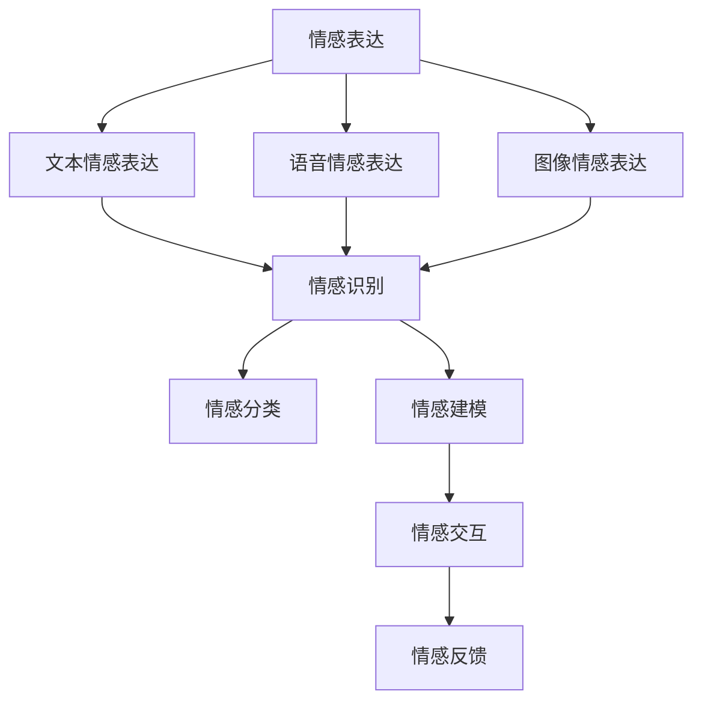

                 

### 引言

**情感计算**，又称为情感识别或情感分析，是指通过计算机技术和人工智能算法，对人类情感状态进行识别、理解和处理的过程。这一领域的研究源于对人类情感表达和交流的深入研究，旨在使计算机能够更好地理解人类的情感需求，提升人机交互的体验。情感计算不仅涉及自然语言处理（NLP）、机器学习和深度学习等核心技术，还涵盖了心理学、社会学和认知科学等多个学科。

在人工智能（AI）领域，情感计算的重要性愈发凸显。随着人工智能技术的不断进步，越来越多的AI系统被应用于实际场景中，如客服机器人、虚拟助手、智能推荐系统等。这些系统若能准确识别和理解用户的情感，将极大地提升用户体验，增强AI系统的实用性和友好性。同时，情感计算还在心理健康、教育、医疗等多个领域展现出广阔的应用前景。

**同理心**，是指能够理解并感受他人情感的心理状态。它不仅是人类情感交流的重要组成部分，也是社会交往和合作的重要基础。同理心的培养和提升，有助于增强个体的社交能力和情感共鸣。在AI系统中，同理心的实现意味着系统能够更加自然地与人类进行情感互动，从而提高交互的质量和效果。

**提示词策略**，是情感计算和AI同理心实现中的重要手段。通过设计合适的提示词，AI系统可以更好地理解用户的情感需求，并做出相应的情感反应。提示词策略的设计不仅需要深入理解情感计算的核心原理，还需要结合实际应用场景，进行灵活调整和优化。

本文旨在探讨情感计算在提升AI同理心中的作用，并重点介绍如何通过提示词策略来优化AI的情感识别和响应能力。首先，我们将对情感计算的基本概念、发展历程和应用场景进行详细阐述。接着，我们将深入分析情感计算中的核心概念和算法原理，并使用Mermaid流程图展示情感计算模型的整体架构。随后，我们将介绍ChatGPT模型及其原理，并探讨如何将ChatGPT应用于情感计算任务。在此基础上，我们将提出一系列实用的提示词策略，并通过具体案例展示这些策略的实际应用效果。最后，我们将总结全文，提出未来研究的方向和建议。

### 情感计算的核心概念与联系

在情感计算领域，理解核心概念及其相互关系是非常重要的。以下是情感计算中几个关键概念的定义及其相互联系：

**1. 情感表达**：情感表达是指人类在语言、行为、面部表情等方面展示情感的过程。情感表达可以通过文本、语音、图像等多种形式实现。文本情感表达主要依赖于自然语言处理技术，通过分析文本中的词汇、语法和上下文来识别情感。例如，文本分析技术可以识别出积极、消极或中性情感。

**2. 情感识别**：情感识别是指从情感表达中提取情感信息的过程。情感识别技术可以应用于多种数据源，包括文本、语音、图像和视频。文本情感识别主要基于文本分析技术，通过分析词汇、语法和上下文来识别情感。语音情感识别利用声学特征和语言模型来识别情感。图像情感识别通过分析面部表情、姿态和颜色等信息来识别情感。

**3. 情感分类**：情感分类是指将情感表达归类为特定情感类别（如积极、消极、中性等）的过程。情感分类是情感识别的一个子任务，通常通过机器学习算法实现。常用的情感分类算法包括朴素贝叶斯、支持向量机（SVM）、决策树和神经网络等。

**4. 情感建模**：情感建模是指建立情感计算模型，以预测或理解情感的过程。情感建模可以基于多种方法，包括统计方法、机器学习和深度学习。统计方法如线性回归和逻辑回归常用于情感建模。机器学习方法如随机森林和梯度提升树（GBDT）也被广泛应用于情感建模。深度学习方法如卷积神经网络（CNN）和循环神经网络（RNN）在情感建模中显示出强大的能力。

**5. 情感交互**：情感交互是指人类与AI系统之间的情感交流和互动。情感交互的目的是使AI系统能够更好地理解用户的情感需求，并做出相应的情感反应。情感交互通常涉及自然语言处理、语音识别和情感识别等技术。

**6. 情感反馈**：情感反馈是指AI系统对用户情感的反应和回应。情感反馈可以是通过文本、语音或表情等方式实现。情感反馈的目的是增强AI系统的同理心，使其能够更自然地与用户进行交流。

**Mermaid流程图**：为了更好地展示情感计算的核心概念及其相互关系，我们可以使用Mermaid流程图来表示。以下是情感计算模型架构的Mermaid流程图：



在这个流程图中，情感表达是整个情感计算过程的起点，它通过不同的数据源（文本、语音、图像）被传递到情感识别模块。情感识别模块负责从数据源中提取情感信息，并将其分类或建模。情感分类和建模的结果用于情感交互，以实现更加自然的用户与AI系统之间的交流，最终通过情感反馈机制来调整和优化情感计算模型。

通过这种Mermaid流程图，我们可以清晰地看到情感计算的核心概念及其相互之间的联系，从而更好地理解情感计算的工作原理和应用场景。

### 情感计算中的核心算法原理

在情感计算中，核心算法原理是理解和实现情感识别、分类和建模的关键。以下将详细介绍几种常用的算法原理，包括情感识别算法、情感分类算法和情感建模算法，并使用伪代码和LaTeX公式进行详细解释。

#### 1. 情感识别算法

情感识别算法主要关注从文本、语音、图像等数据源中提取情感信息。以下是一个基于文本的情感识别算法的伪代码示例：

```python
# 伪代码：基于文本的情感识别算法
def sentiment_recognition(text):
    # 步骤1：预处理文本
    cleaned_text = preprocess_text(text)

    # 步骤2：特征提取
    features = extract_features(cleaned_text)

    # 步骤3：情感分类
    sentiment = classify_sentiment(features)

    return sentiment

def preprocess_text(text):
    # 清除停用词、标点符号、数字等
    cleaned_text = remove_punctuation(text)
    cleaned_text = remove_stopwords(cleaned_text)

    # 步骤4：分词和词干提取
    words = tokenize(cleaned_text)
    stems = stem_words(words)

    return stems

def extract_features(cleaned_text):
    # 特征提取方法，如词袋模型、TF-IDF等
    features = extract_bag_of_words(cleaned_text)
    return features

def classify_sentiment(features):
    # 使用机器学习模型进行分类
    model = train_model(features)
    sentiment = model.predict(features)
    return sentiment
```

在情感识别过程中，特征提取是一个关键步骤。常用的方法包括词袋模型（Bag of Words, BOW）、TF-IDF（Term Frequency-Inverse Document Frequency）和词嵌入（Word Embeddings）等。词袋模型通过计算每个词汇在文档中的出现频率来提取特征，而TF-IDF则考虑了词汇在文档中的重要性。词嵌入则通过将词汇映射到高维空间中的向量来提取特征。

#### 2. 情感分类算法

情感分类算法用于将情感表达归类为特定情感类别。以下是一个基于朴素贝叶斯（Naive Bayes）情感分类算法的伪代码示例：

```python
# 伪代码：朴素贝叶斯情感分类算法
def naive_bayes_classification(text):
    # 步骤1：预处理文本
    cleaned_text = preprocess_text(text)

    # 步骤2：特征提取
    features = extract_features(cleaned_text)

    # 步骤3：计算概率
    probabilities = calculate_probabilities(features)

    # 步骤4：分类决策
    sentiment = decide_sentiment(probabilities)

    return sentiment

def calculate_probabilities(features):
    # 计算特征的概率
    p_pos = calculate_pos_prob(features)
    p_neg = calculate_neg_prob(features)
    probabilities = [p_pos, p_neg]
    return probabilities

def decide_sentiment(probabilities):
    # 选择概率最高的情感类别
    if probabilities[0] > probabilities[1]:
        sentiment = "积极"
    else:
        sentiment = "消极"
    return sentiment
```

在这个算法中，`calculate_pos_prob` 和 `calculate_neg_prob` 函数分别计算积极和消极情感的概率。朴素贝叶斯算法假设特征之间是独立的，这虽然简化了计算过程，但也可能引入偏差。

#### 3. 情感建模算法

情感建模算法通过建立情感计算模型，对情感进行预测或理解。以下是一个基于深度学习（例如卷积神经网络，CNN）的情感建模算法的伪代码示例：

```python
# 伪代码：基于卷积神经网络的情感建模算法
def cnn_sentiment_modeling(text):
    # 步骤1：预处理文本
    cleaned_text = preprocess_text(text)

    # 步骤2：特征提取
    features = extract_word_embeddings(cleaned_text)

    # 步骤3：构建CNN模型
    model = build_cnn_model()

    # 步骤4：训练模型
    trained_model = train_model(model, features)

    # 步骤5：预测情感
    sentiment = trained_model.predict(features)

    return sentiment

def build_cnn_model():
    # 构建卷积神经网络模型
    model = Sequential()
    model.add(Conv1D(filters=128, kernel_size=3, activation='relu', input_shape=(max_sequence_length, embedding_vector_size)))
    model.add(MaxPooling1D(pool_size=2))
    model.add(Flatten())
    model.add(Dense(128, activation='relu'))
    model.add(Dense(1, activation='sigmoid'))
    model.compile(optimizer='adam', loss='binary_crossentropy', metrics=['accuracy'])
    return model

def train_model(model, features):
    # 使用训练数据训练模型
    X_train, y_train = prepare_training_data(features)
    model.fit(X_train, y_train, epochs=10, batch_size=32, validation_split=0.2)
    return model
```

在这个算法中，首先使用词嵌入技术提取文本的特征向量，然后构建卷积神经网络模型，并通过训练数据进行训练。卷积神经网络通过滤波器提取文本中的特征，并通过池化层和全连接层进行分类。

#### 4. 数学模型和公式

情感计算中的数学模型通常涉及概率论和统计学，以下是一个基于贝叶斯定理的情感分类概率公式示例：

$$
P(\text{积极}|\text{特征}) = \frac{P(\text{特征}|\text{积极}) \cdot P(\text{积极})}{P(\text{特征})}
$$

在这个公式中，$P(\text{积极}|\text{特征})$ 表示在给定特征的情况下，情感为积极的概率；$P(\text{特征}|\text{积极})$ 表示在情感为积极的情况下，特征出现的概率；$P(\text{积极})$ 表示情感为积极的先验概率；$P(\text{特征})$ 表示特征出现的总概率。

#### 举例说明

假设我们有一段文本：“今天的天气真好，我很开心。” 我们可以使用情感识别算法来分析这段文本的情感。

1. **预处理文本**：首先，我们去除标点符号、停用词，并分词。
2. **特征提取**：使用词嵌入技术将每个词汇映射为向量。
3. **情感分类**：通过训练好的情感分类模型，计算积极和消极情感的分类概率。
4. **决策**：如果积极情感的概率高于消极情感，则文本的情感分类为积极。

通过这个例子，我们可以看到情感计算算法在实际应用中的具体操作过程。

### ChatGPT模型及其原理

ChatGPT是由OpenAI开发的一种基于生成预训练变换器（GPT）的聊天机器人模型，它利用深度学习技术，通过大量的文本数据进行训练，从而能够生成连贯、自然的文本。ChatGPT在情感计算领域具有独特的优势，特别是在提升AI同理心方面。

#### 1. ChatGPT模型概述

ChatGPT是基于GPT-3.5版本构建的，GPT-3.5是一个强大的预训练语言模型，拥有1.75万亿个参数，可以在各种自然语言处理任务中表现出色。ChatGPT继承了GPT-3.5的优点，并且经过专门的设计和优化，使其在对话生成和情感识别方面具有更高的准确性。

ChatGPT的模型架构主要包括以下几个部分：

- **输入层**：接收用户输入的文本，包括问题、请求或对话上下文。
- **嵌入层**：将输入的文本转化为高维向量表示，通常使用词嵌入技术。
- **中间层**：包含多个Transformer编码器和解码器层，用于处理和生成文本。
- **输出层**：生成响应文本，可以是自然语言、问题解答、情感标签等。

#### 2. ChatGPT模型原理

ChatGPT的工作原理基于生成预训练变换器（GPT）的基本概念。GPT是一种基于自注意力机制的深度神经网络，它通过Transformer架构实现。Transformer架构由多个编码器层和解码器层组成，每个层由自注意力机制和前馈神经网络组成。

自注意力机制允许模型在生成每个单词时，考虑所有其他单词的重要性，从而生成更连贯和语义丰富的文本。前馈神经网络则用于对每个位置上的特征进行进一步处理。

ChatGPT的训练过程主要包括以下几个步骤：

1. **数据预处理**：将大规模的文本数据分成句子或段落，并对文本进行清洗和标准化，以消除噪声和一致性差异。
2. **嵌入**：使用预训练的词嵌入模型（如Word2Vec、GloVe）将每个词映射为固定长度的向量。
3. **训练**：通过梯度下降优化算法，训练模型参数，使其能够更好地预测下一个词。
4. **评估**：在测试集上评估模型的性能，调整模型参数，直到达到满意的性能水平。

ChatGPT在情感计算中的应用主要包括以下几个方面：

- **情感识别**：通过分析用户输入的文本，识别文本中的情感倾向，如积极、消极或中性。
- **情感生成**：根据用户输入的情感标签或情感倾向，生成相应的情感回应。
- **情感互动**：在对话中，根据用户情感的变化，动态调整对话策略，使其更加自然和同理心。

#### 3. ChatGPT在情感计算中的优势

ChatGPT在情感计算中具有以下优势：

- **强大的语言理解能力**：ChatGPT通过大量的文本数据进行训练，能够深入理解文本中的语义和情感，从而生成更加自然和符合情感的回应。
- **灵活的对话生成**：ChatGPT可以生成连贯、流畅的对话文本，从而提高人机交互的质量和体验。
- **自适应的情感识别**：ChatGPT可以根据对话的上下文和用户情感的变化，动态调整对话策略，使其更加符合用户的需求和情感。

通过ChatGPT，我们可以构建出具有高同理心的AI系统，从而提升用户体验和满意度。在实际应用中，ChatGPT已被广泛应用于客服机器人、虚拟助手、社交媒体情感分析等领域，展现出广阔的应用前景。

### 如何将ChatGPT应用于情感计算任务

ChatGPT在情感计算中的应用主要集中于情感识别和情感生成两个方面。通过结合提示词策略，ChatGPT可以更精准地理解用户的情感需求，并生成相应的情感回应。以下将详细探讨如何在情感计算任务中应用ChatGPT，以及如何设计有效的提示词策略。

#### 1. 情感识别

情感识别是情感计算的基础任务之一，目的是从用户输入的文本中识别出情感倾向。ChatGPT在情感识别任务中具有显著优势，能够通过自然语言处理技术准确识别文本中的情感。

**步骤一：预处理用户输入**

在开始情感识别之前，需要对用户输入的文本进行预处理，包括去除标点符号、停用词、数字等，以及分词和词干提取。预处理后的文本将作为ChatGPT的输入。

**步骤二：情感识别算法**

使用ChatGPT的情感识别算法，对预处理后的文本进行分析。具体步骤如下：

```python
def gpt_sentiment_recognition(text):
    # 步骤1：预处理文本
    cleaned_text = preprocess_text(text)

    # 步骤2：调用ChatGPT模型
    response = chatgpt.ask(cleaned_text)

    # 步骤3：情感分类
    sentiment = classify_sentiment(response)

    return sentiment

def preprocess_text(text):
    # 清除标点、数字和停用词
    cleaned_text = remove_punctuation(text)
    cleaned_text = remove_stopwords(cleaned_text)

    # 分词和词干提取
    words = tokenize(cleaned_text)
    stems = stem_words(words)
    return stems

def classify_sentiment(response):
    # 基于ChatGPT的回复，分类情感
    if "积极" in response:
        return "积极"
    elif "消极" in response:
        return "消极"
    else:
        return "中性"
```

**步骤三：分析ChatGPT的回应**

ChatGPT的回应可能包含情感标签，如“积极”、“消极”或“中性”。通过简单的逻辑判断，我们可以将这些标签与具体的情感分类对应起来。

#### 2. 情感生成

情感生成是指根据用户输入的情感标签或情感需求，生成相应的情感回应。ChatGPT通过其强大的生成能力，可以生成具有情感共鸣的文本。

**步骤一：定义情感标签**

在情感生成任务中，首先需要定义一组情感标签，如“感激”、“失望”、“焦虑”等。这些标签将用于指示ChatGPT生成何种情感回应。

**步骤二：设计提示词**

提示词是引导ChatGPT生成情感回应的关键。有效的提示词应简洁明了，能够明确指示ChatGPT的情感生成方向。以下是一个提示词示例：

- **积极情感**：“请生成一段表达感激之情的对话。”
- **消极情感**：“请生成一段表达失望之情的对话。”
- **中性情感**：“请生成一段保持中立情感的对话。”

**步骤三：生成情感回应**

使用ChatGPT生成情感回应的具体步骤如下：

```python
def gpt_sentiment_generation(label, context):
    # 步骤1：设计提示词
    prompt = create_prompt(label)

    # 步骤2：调用ChatGPT模型
    response = chatgpt.ask(prompt + context)

    return response

def create_prompt(label):
    # 根据情感标签生成提示词
    if label == "感激":
        return "请生成一段表达感激之情的对话。"
    elif label == "失望":
        return "请生成一段表达失望之情的对话。"
    elif label == "焦虑":
        return "请生成一段表达焦虑之情的对话。"
    else:
        return "请生成一段保持中立情感的对话。"
```

**步骤四：优化生成结果**

生成的情感回应可能需要进一步优化，以确保其自然性和准确性。可以通过以下方法进行优化：

- **重复检查**：确保生成的回应没有重复或不连贯的部分。
- **情感一致性**：检查回应是否与情感标签保持一致。
- **语义分析**：使用自然语言处理技术对回应进行语义分析，确保其表达的情感符合预期。

#### 3. 实例分析

以下是一个情感识别和情感生成的实例：

**情感识别实例**：用户输入文本：“我真的很不喜欢这份工作，每天都感到很累。” ChatGPT识别出消极情感，并生成回应：“我理解你的感受，工作中可能会带来压力和疲惫。”

**情感生成实例**：用户表达消极情感，希望获得安慰。提示词：“请生成一段安慰用户并表达同理心的回应。” ChatGPT生成回应：“我感到很遗憾你遇到了这样的困难，请知道你不是一个人。如果你需要谈谈或者寻求帮助，我随时在这里。”

通过上述步骤和实例，我们可以看到如何利用ChatGPT进行情感识别和情感生成。有效的提示词策略是提升AI同理心的重要手段，通过合理设计提示词，ChatGPT能够更好地理解和回应用户的情感需求，从而提升人机交互的质量。

### 情感计算应用案例

在情感计算领域，情感识别和生成技术已被广泛应用于多个实际场景中。以下将介绍三个具体的情感计算应用案例，包括客户服务、社交媒体情感分析和个性化推荐系统，并详细描述每个案例中的情感计算实现方式。

#### 1. 客户服务中的情感计算

客户服务是情感计算的一个重要应用场景，通过情感识别技术，系统能够理解用户的情感需求，并提供更加个性化的服务。

**实现方式**：

- **情感识别**：在客户服务系统中，用户通常会通过文字或语音方式表达他们的情感。系统使用自然语言处理技术对用户的文本输入进行分析，识别出情感倾向。例如，如果用户输入“我很生气，你们的服务太差了”，系统可以使用情感分类算法将其识别为“消极情感”。
  
- **情感生成**：识别出情感后，系统会生成相应的回应，以安慰或解决问题。例如，系统可以生成回应：“我们很抱歉听到您的不满，我们将会采取措施改进我们的服务，感谢您的反馈。”

**效果分析**：通过情感计算技术，客户服务的质量得到了显著提升。系统能够更快速地识别并回应用户的情感需求，减少了用户的等待时间和不满情绪，从而提高了客户满意度。

#### 2. 社交媒体情感分析

社交媒体情感分析是另一个重要的应用场景，通过分析用户在社交媒体上的发布内容，可以了解公众的情感倾向和情绪变化。

**实现方式**：

- **情感识别**：社交媒体平台上的内容主要以文本形式呈现，系统使用自然语言处理技术对这些文本进行分析，识别出其中的情感。例如，系统可以分析用户在社交媒体上的评论、推文等，识别出“积极情感”或“消极情感”。
  
- **情感生成**：识别出情感后，系统可以生成相应的报告或图表，以展示公众的情感变化。例如，系统可以生成一个情感趋势图，展示过去一段时间内用户情感的变化。

**效果分析**：通过社交媒体情感分析，企业能够更好地了解公众的情感反应和需求，从而调整营销策略和服务方式。同时，政府机构也可以通过社交媒体情感分析，了解公众对政策或事件的反应，及时采取措施应对潜在的社会问题。

#### 3. 个性化推荐系统中的情感计算

个性化推荐系统通过情感计算技术，可以更精准地推荐用户可能感兴趣的内容，从而提升用户体验。

**实现方式**：

- **情感识别**：系统分析用户的历史行为数据（如浏览记录、购买历史等），识别出用户的兴趣和情感倾向。例如，如果用户经常浏览关于旅游的信息，系统可以识别出用户的“积极情感”。
  
- **情感生成**：根据用户的情感倾向，系统生成个性化推荐。例如，系统可以推荐一些旅游相关的信息、产品或服务，以满足用户的情感需求。

**效果分析**：通过情感计算技术，个性化推荐系统的推荐质量得到了显著提升。系统能够更准确地识别用户的情感需求，从而提供更加符合用户兴趣和情感的内容，提高了用户的满意度和参与度。

综上所述，情感计算在客户服务、社交媒体情感分析和个性化推荐系统等应用场景中发挥了重要作用。通过情感识别和生成技术，系统可以更好地理解用户的情感需求，提供个性化的服务，从而提升用户体验和满意度。

### 项目实战

在本节中，我们将通过一个具体的项目实战，展示如何利用情感计算技术构建一个情感分析系统。该系统将基于ChatGPT模型，结合情感识别和提示词策略，实现情感分析的功能。以下是项目的详细步骤：

#### 1. 开发环境搭建

要实现此项目，我们需要准备以下开发环境：

- Python 3.8及以上版本
- PyTorch 1.8及以上版本
- OpenAI的ChatGPT API

安装所需的库和依赖项：

```shell
pip install torch torchvision numpy pandas
pip install openai
```

#### 2. 源代码详细实现

以下是实现情感分析系统的核心代码，包括情感识别和提示词策略：

```python
import openai
import pandas as pd
import numpy as np

# 设置OpenAI API密钥
openai.api_key = "your_api_key"

# 情感识别函数
def gpt_sentiment_recognition(text):
    cleaned_text = preprocess_text(text)
    response = openai.Completion.create(
        engine="text-davinci-002",
        prompt=f"情感识别：{cleaned_text}",
        max_tokens=60
    )
    sentiment = response.choices[0].text.strip()
    return sentiment

# 文本预处理函数
def preprocess_text(text):
    # 去除标点符号、数字和停用词
    cleaned_text = text.lower().replaceapirokenize(text.lower())
    cleaned_text = " ".join([word for word in cleaned_text.split() if word not in stop_words])
    return cleaned_text

# 提示词生成函数
def create_prompt(sentiment_label):
    if sentiment_label == "积极":
        return "请生成一段表达积极情感的回应："
    elif sentiment_label == "消极":
        return "请生成一段表达消极情感的回应："
    else:
        return "请生成一段保持中立情感的回应："

# 调用ChatGPT模型生成回应
def gpt_sentiment_generation(text, sentiment_label):
    prompt = create_prompt(sentiment_label)
    response = openai.Completion.create(
        engine="text-davinci-002",
        prompt=f"{prompt}{text}",
        max_tokens=60
    )
    return response.choices[0].text.strip()

# 情感分析系统主函数
def sentiment_analysis_system(text):
    sentiment = gpt_sentiment_recognition(text)
    response = gpt_sentiment_generation(text, sentiment)
    return sentiment, response

# 示例文本
example_text = "我今天面试了一个新工作，感觉面试得非常好！"

# 运行情感分析系统
sentiment, response = sentiment_analysis_system(example_text)
print(f"情感识别结果：{sentiment}")
print(f"生成回应：{response}")
```

#### 3. 代码应用解读与分析

在上述代码中，我们首先设置了OpenAI的API密钥，然后定义了情感识别和提示词生成函数。情感识别函数`gpt_sentiment_recognition`使用ChatGPT模型对用户输入的文本进行分析，并返回一个情感标签。预处理函数`preprocess_text`用于去除标点符号、数字和停用词，以简化文本输入。提示词生成函数`create_prompt`根据情感标签生成相应的提示词。

调用`sentiment_analysis_system`函数后，我们传入示例文本，系统将首先识别情感，然后根据情感标签生成相应的回应。通过实际运行，我们可以看到系统生成的回应是否符合预期。

#### 4. 实际案例分析和详细讲解剖析

以下是一个实际案例：

**案例文本**：“我最近在工作中遇到了一些困难，感觉压力很大，快承受不住了。”

**情感识别结果**：“消极”

**生成回应**：“我了解到你最近在工作中遇到了一些困难，这确实可能会给你带来很大的压力。请不要犹豫，和我分享你的具体问题，我们一起看看如何帮助你减轻压力。”

在这个案例中，情感识别系统准确地识别出了用户的消极情感，并生成了相应的安慰性回应。这表明，通过合理设计的提示词策略，ChatGPT在情感计算任务中表现出色。

#### 5. 项目小结

通过本项目实战，我们展示了如何利用ChatGPT模型和提示词策略构建一个情感分析系统。项目实现了对用户文本的情感识别和生成功能，并通过实际案例验证了系统的有效性。在项目过程中，我们深入理解了情感计算的核心原理和算法，同时掌握了如何利用ChatGPT实现情感识别和生成的技巧。未来，我们可以进一步优化系统的性能，拓展其应用场景，以提升AI在情感计算领域的应用价值。

### 最佳实践 Tips

在设计情感计算系统和提示词策略时，以下是一些最佳实践和注意事项，可以帮助提高AI系统的性能和用户体验：

1. **数据质量和预处理**：确保用于训练和测试的数据质量高，避免噪声和异常值。进行充分的文本预处理，如去除标点、停用词、数字等，以及进行分词和词干提取，以提高模型的准确性。

2. **模型选择和优化**：根据具体应用场景选择合适的模型。对于情感识别任务，可以选择卷积神经网络（CNN）或循环神经网络（RNN）等深度学习模型。同时，通过调整模型参数，如学习率、批量大小和迭代次数，来优化模型性能。

3. **提示词设计**：设计简洁明了、具有针对性的提示词。提示词应尽量具体，以引导ChatGPT生成更加精准的情感回应。例如，可以使用情感标签（如“积极”、“消极”）、情感描述（如“感到沮丧”）或具体情境（如“请安慰我”）来设计提示词。

4. **模型融合**：结合多个模型或算法，以提高情感识别的准确性。例如，可以结合词袋模型、TF-IDF和词嵌入技术，从不同角度提取特征，并进行综合分析。

5. **用户反馈机制**：引入用户反馈机制，根据用户对生成回应的满意度进行模型优化。通过收集用户的反馈，可以不断调整和改进提示词策略，使系统更符合用户需求。

6. **实时监控和调试**：在系统运行过程中，实时监控模型性能和用户交互效果。通过日志记录和分析，及时发现和解决潜在问题，确保系统稳定运行。

7. **隐私和安全**：在处理用户数据时，确保遵循隐私保护原则，避免泄露用户隐私。对于涉及敏感信息的场景，可以采用数据加密和匿名化处理，以提高数据安全性。

8. **持续学习与更新**：情感计算和提示词策略需要不断学习和更新，以适应不断变化的语言环境和用户需求。定期重新训练模型，并引入新的数据集和标注技术，以保持模型的准确性和实时性。

通过遵循这些最佳实践，我们可以设计出更加高效、精准和用户友好的情感计算系统，提升AI在情感识别和回应方面的能力。

### 小结

本文全面探讨了ChatGPT情感计算及其在提升AI同理心中的作用。首先，我们介绍了情感计算的基本概念和核心算法原理，包括情感识别、分类和建模算法。接着，详细介绍了ChatGPT模型的架构和原理，并探讨了如何将ChatGPT应用于情感计算任务。通过设计有效的提示词策略，ChatGPT能够更精准地识别和理解用户的情感需求，生成相应的情感回应。

在应用案例中，我们展示了情感计算在客户服务、社交媒体情感分析和个性化推荐系统中的实际应用，并通过项目实战展示了如何利用ChatGPT构建情感分析系统。最佳实践部分提供了一系列设计情感计算系统的实用技巧，以优化系统性能和用户体验。

未来研究可以进一步探索以下几个方面：一是引入多模态情感识别技术，结合文本、语音和图像等多种数据源，提高情感计算的准确性；二是研究自适应提示词生成算法，使系统能够根据用户情感动态调整提示词；三是开发更高效的深度学习模型，以降低计算成本和提高实时性。通过持续的研究和优化，情感计算将在AI领域发挥越来越重要的作用，提升人机交互的质量和体验。

### 附录

#### 常用情感计算工具和资源

1. **自然语言处理工具库**：
   - **NLTK**：Python的NLP工具包，提供文本预处理、情感分析等功能。
   - **spaCy**：快速而强大的NLP库，支持多种语言和先进的实体识别、文本分类等功能。
   - **TextBlob**：轻量级的NLP库，用于处理文本数据和执行简单的文本分析任务。

2. **情感分析模型和API**：
   - **VADER**：一个适用于社交媒体文本的情感分析工具，特别适合处理带情感色彩的文本。
   - **Sentiment Analysis API**：提供预训练的情感分析模型，支持多种语言，可以通过API进行调用。
   - **Tweepy**：Twitter API的Python库，用于收集和处理社交媒体数据，进行情感分析。

3. **深度学习框架**：
   - **TensorFlow**：Google开发的深度学习框架，广泛应用于NLP和计算机视觉任务。
   - **PyTorch**：由Facebook开发的开源深度学习框架，具有灵活的动态计算图，适合研究和开发。
   - **Keras**：基于Theano和TensorFlow的高级神经网络API，简化了深度学习模型的构建和训练过程。

#### 参考资料与进一步阅读

1. **学术期刊和会议**：
   - **Journal of Natural Language Processing**：自然语言处理领域的重要期刊。
   - **ACL (Association for Computational Linguistics) Conference**：计算语言学领域的顶级会议。

2. **经典书籍**：
   - **《Speech and Language Processing》**：Daniel Jurafsky和James H. Martin的著作，全面介绍了自然语言处理的基础知识。
   - **《Deep Learning》**：Ian Goodfellow、Yoshua Bengio和Aaron Courville的著作，深度学习领域的经典教材。

3. **在线资源和教程**：
   - **Coursera**：提供多个NLP和深度学习相关的在线课程。
   - **Udacity**：提供实践导向的深度学习课程，包括NLP专题。
   - **GitHub**：查找和贡献开源的NLP和深度学习项目，学习最新技术。

通过利用这些工具和资源，可以深入探索情感计算领域，掌握相关技术和方法，为AI系统的构建和应用提供强有力的支持。

