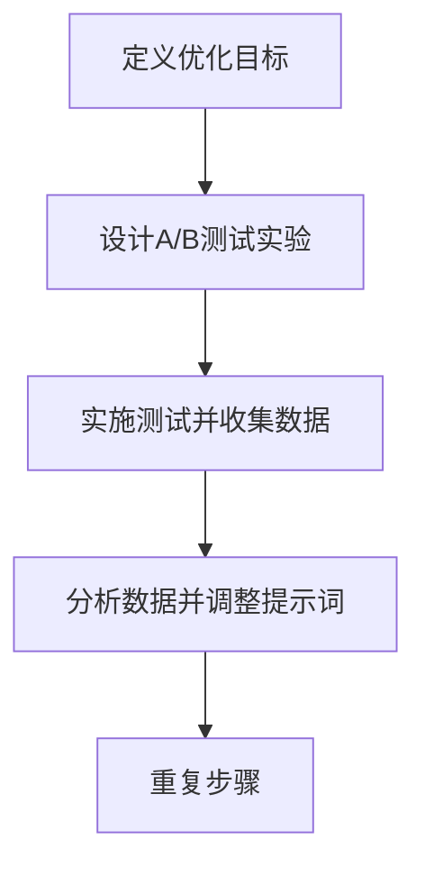
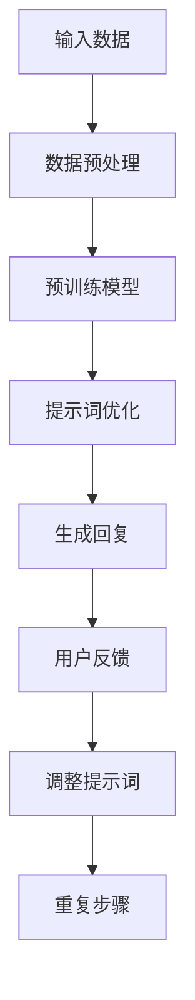

                 

## 文章标题

### ChatGPT提示词优化：A/B测试方法论

> 关键词：ChatGPT，提示词优化，A/B测试，方法论，人工智能，AI，算法，用户体验，服务质量

> 摘要：本文将深入探讨ChatGPT提示词优化的策略，以及如何利用A/B测试方法论来验证和改进提示词效果，从而提升AI服务的质量和用户体验。

---

**文章标题：ChatGPT提示词优化：A/B测试方法论**

**关键词：ChatGPT，提示词优化，A/B测试，方法论，人工智能，AI，算法，用户体验，服务质量**

**摘要：本文将深入探讨ChatGPT提示词优化的策略，以及如何利用A/B测试方法论来验证和改进提示词效果，从而提升AI服务的质量和用户体验。**

---

### 引言

#### 背景介绍

ChatGPT是由OpenAI开发的一种基于Transformer架构的预训练语言模型。它通过学习大量的文本数据，能够生成流畅、有逻辑的文本回复，广泛应用于自然语言处理、对话系统、文本生成等多个领域。然而，ChatGPT的输出效果在很大程度上取决于输入的提示词。因此，如何优化提示词，使其能够更有效地驱动模型生成高质量的回复，成为了一个重要的研究方向。

#### 核心概念与联系

为了实现提示词优化，我们需要理解以下几个核心概念：

1. **提示词**：输入给模型的文本，用于引导模型生成输出。
2. **A/B测试**：一种实验设计方法，通过比较两个或多个版本的差异，来确定哪个版本在特定目标上表现更好。
3. **方法论**：系统化的方法和步骤，用于解决问题或达到特定目标。

结合这些概念，我们可以构建一个框架，用于优化ChatGPT的提示词。该框架包括以下步骤：

1. **定义优化目标**：明确我们希望通过优化提示词实现的具体目标，例如提高回复的准确性、流畅性或情感表达。
2. **设计A/B测试实验**：根据优化目标，设计能够有效衡量提示词效果的A/B测试实验。
3. **实施测试并收集数据**：在实际环境中运行测试，收集用户反馈和性能数据。
4. **分析数据并调整提示词**：根据测试结果，分析提示词的效果，并进行相应的调整。

#### Mermaid流程图

以下是一个简化的Mermaid流程图，展示了ChatGPT提示词优化的A/B测试方法论：



### ChatGPT提示词优化技术

#### 提示词的格式和结构

提示词的格式和结构对于驱动模型生成高质量的回复至关重要。以下是一些关键原则：

1. **明确性和具体性**：提示词应该清晰地传达用户意图，避免模糊和泛泛而谈。
2. **结构化**：提示词应该具备一定的结构，例如问题、回答、讨论等，以引导模型生成符合预期的输出。
3. **多样性**：使用多样化的提示词，以避免模型陷入重复生成固定模式的陷阱。

#### 提示词的语言特性

提示词的语言特性也会影响模型生成输出的质量。以下是一些关键点：

1. **词汇丰富度**：使用丰富多样的词汇，以提高输出的流畅性和自然度。
2. **语法正确性**：确保提示词的语法正确，以避免模型生成错误的语法结构。
3. **情感和语气**：根据应用场景，选择合适的情感和语气，以增强用户的体验。

#### 提示词的调整策略

在优化ChatGPT提示词时，以下策略可以帮助我们更有效地调整和改进提示词：

1. **数据预处理**：对输入数据进行预处理，例如去除无关信息、进行分词和词性标注等。
2. **反馈机制**：建立反馈机制，收集用户对输出的反馈，并根据反馈进行提示词的调整。
3. **自动化调整**：利用自然语言处理技术，自动化地调整提示词，以提高效率。

#### 提示词的有效性评估

为了评估提示词的有效性，我们可以采用以下方法：

1. **用户反馈**：收集用户对输出的满意度、准确性、流畅性等方面的反馈。
2. **自动化评估**：使用自动化工具，例如BLEU、ROUGE等指标，评估输出与期望输出之间的相似度。
3. **实验对比**：设计A/B测试实验，比较不同提示词的效果，确定最优选择。

### A/B测试方法论

#### A/B测试的概念

A/B测试，也称为拆分测试，是一种通过将用户流量分配到两个或多个版本的实验设计方法，以确定哪个版本在特定目标上表现更好的测试。以下是A/B测试的关键组成部分：

1. **版本A和版本B**：两个或多个实验版本，通常一个为控制组，一个为实验组。
2. **目标**：我们希望通过实验评估的特定目标，例如提高用户点击率、降低跳出率等。
3. **流量分配**：将用户流量分配到不同版本，通常采用随机分配或比例分配的方式。
4. **数据分析**：收集实验数据，并进行统计分析，以确定哪个版本在目标上表现更好。

#### A/B测试的设计原则

为了确保A/B测试的有效性，以下原则应被遵循：

1. **单一变量**：每个实验应仅改变一个变量，以明确评估该变量的影响。
2. **随机分配**：确保用户流量随机分配到不同版本，以减少偏差。
3. **足够样本量**：确保收集到足够的数据，以获得可靠的结论。
4. **评估时间**：确保有足够的时间收集数据，以充分反映实验效果。

#### A/B测试的执行流程

A/B测试的执行流程包括以下步骤：

1. **定义实验目标**：明确我们希望通过实验评估的具体目标。
2. **设计实验方案**：确定实验版本、流量分配策略、评估指标等。
3. **实施测试**：在实际环境中运行测试，并监控实验过程。
4. **数据分析**：收集实验数据，并进行统计分析，以确定实验效果。
5. **结论与决策**：根据实验结果，做出相应的决策，例如推广最优版本。

### ChatGPT提示词优化与A/B测试的结合

通过结合ChatGPT提示词优化和A/B测试方法论，我们可以更有效地提升AI服务的质量和用户体验。以下是一个典型的结合过程：

1. **定义优化目标**：明确我们希望通过优化提示词实现的具体目标，例如提高回复的准确性、流畅性或情感表达。
2. **设计A/B测试实验**：根据优化目标，设计能够有效衡量提示词效果的A/B测试实验。例如，比较不同格式的提示词对回复质量的影响。
3. **实施测试并收集数据**：在实际环境中运行测试，并收集用户反馈和性能数据。
4. **分析数据并调整提示词**：根据测试结果，分析提示词的效果，并进行相应的调整。例如，如果实验结果显示某种格式的提示词效果更好，我们就可以将这种格式推广到更多场景。
5. **重复步骤**：不断重复上述步骤，以持续优化提示词，并提升AI服务的质量。

### 案例研究

#### 案例一：提高客户服务质量

在一个在线客服系统中，我们希望通过优化ChatGPT的提示词来提高客户服务质量。具体步骤如下：

1. **定义优化目标**：提高客户满意度和问题解决率。
2. **设计A/B测试实验**：比较不同情感和语气的提示词对用户满意度的影响。
3. **实施测试并收集数据**：在实际环境中运行测试，并收集用户反馈和性能数据。
4. **分析数据并调整提示词**：根据测试结果，调整提示词，使其更符合用户需求。
5. **重复步骤**：不断优化提示词，以提高客户满意度。

#### 案例二：改善用户互动体验

在一个聊天机器人应用中，我们希望通过优化提示词来改善用户互动体验。具体步骤如下：

1. **定义优化目标**：提高用户点击率和互动积极性。
2. **设计A/B测试实验**：比较不同结构的提示词对用户点击率和互动行为的影响。
3. **实施测试并收集数据**：在实际环境中运行测试，并收集用户反馈和性能数据。
4. **分析数据并调整提示词**：根据测试结果，调整提示词，使其更具吸引力。
5. **重复步骤**：不断优化提示词，以提高用户互动体验。

### 实践指导

为了更好地应用ChatGPT提示词优化和A/B测试方法论，以下是一些实践指导：

1. **建立实验框架**：明确实验的目标、版本、流量分配策略和评估指标。
2. **收集数据**：确保收集到足够的数据，以获得可靠的结论。
3. **分析数据**：使用统计分析方法，对实验结果进行深入分析。
4. **调整策略**：根据实验结果，调整提示词和实验设计，以实现优化目标。
5. **持续迭代**：不断重复实验和优化过程，以持续提升AI服务的质量。

### 总结与展望

通过本文的讨论，我们可以看到，ChatGPT提示词优化和A/B测试方法论是提升AI服务质量的有效手段。通过优化提示词，我们可以更好地驱动模型生成高质量的回复；通过A/B测试，我们可以验证和改进提示词效果，以实现持续优化。未来，随着AI技术的不断发展，ChatGPT提示词优化和A/B测试方法论将在更多场景中得到应用，为用户提供更好的服务体验。

### 附录

**附录A：ChatGPT核心架构Mermaid流程图**



**附录B：ChatGPT提示词优化伪代码**

```python
# 初始化模型和参数
model = load_pretrained_model()
params = initialize_parameters()

# 收集用户数据
user_data = collect_user_data()

# 预处理数据
preprocessed_data = preprocess_data(user_data)

# 生成回复
response = generate_response(model, preprocessed_data, params)

# 收集用户反馈
user_feedback = collect_user_feedback(response)

# 调整提示词
adjusted_params = adjust_parameters(params, user_feedback)

# 重复步骤
repeat_steps(model, adjusted_params)
```

### 附录C：相关数学公式及解释

$$
\text{BLEU} = \frac{1}{N} \sum_{i=1}^{N} \frac{L(C, R)}{L(R)}
$$

BLEU（双语评估指标）用于评估文本生成的质量，其中$C$为模型生成的文本，$R$为期望文本，$N$为参考文本的数量。

$$
\text{ROUGE} = \frac{\sum_{i=1}^{N} \frac{L(C, R_i)}{L(R_i)}}{N}
$$

ROUGE（递增式评估指标）用于评估文本生成的质量，其中$C$为模型生成的文本，$R_i$为第$i$个参考文本，$N$为参考文本的数量。

### 附录D：实际代码实例与解读

```python
# 导入必要的库
import tensorflow as tf
from tensorflow.keras.models import Model
from tensorflow.keras.layers import Input, Embedding, LSTM, Dense

# 定义模型架构
input_seq = Input(shape=(None,))
x = Embedding(input_dim=vocabulary_size, output_dim=embedding_size)(input_seq)
x = LSTM(units=lstm_units)(x)
output = Dense(units=1, activation='sigmoid')(x)

# 编译模型
model = Model(inputs=input_seq, outputs=output)
model.compile(optimizer='adam', loss='binary_crossentropy', metrics=['accuracy'])

# 训练模型
model.fit(x_train, y_train, epochs=10, batch_size=32, validation_data=(x_val, y_val))

# 生成回复
preprocessed_text = preprocess_text(user_input)
predicted_response = model.predict(preprocessed_text)

# 解读代码
# 1. 输入序列：输入序列是用户输入的文本，需要经过预处理，例如分词、去停用词等。
# 2. 模型架构：我们使用了一个嵌入层和一个LSTM层，最后输出一个概率值，表示文本是否为垃圾邮件。
# 3. 训练模型：使用训练数据进行模型训练，并在验证数据上进行评估。
# 4. 生成回复：使用训练好的模型对预处理后的用户输入进行预测，输出回复的概率。
```

### 最佳实践 Tips、小结、注意事项、拓展阅读

**最佳实践 Tips：**

1. **明确优化目标**：在开始优化前，明确我们希望通过优化实现的具体目标，以确保测试的有效性。
2. **多样化提示词**：使用多样化的提示词，以避免模型生成固定模式的回复。
3. **数据预处理**：对输入数据进行预处理，以提高模型生成高质量回复的能力。
4. **持续迭代**：不断重复测试和优化过程，以持续提升AI服务的质量。

**小结：**

本文介绍了ChatGPT提示词优化和A/B测试方法论，并展示了如何将两者结合起来，以提升AI服务的质量和用户体验。通过优化提示词和A/B测试，我们可以更有效地驱动模型生成高质量的回复，并持续改进AI服务。

**注意事项：**

1. **确保实验设计的科学性**：在进行A/B测试时，确保实验设计科学，以获得可靠的结论。
2. **注意数据隐私**：在收集用户数据时，注意保护用户隐私，遵守相关法律法规。

**拓展阅读：**

1. **《ChatGPT技术解析》**：深入了解ChatGPT的技术原理和应用场景。
2. **《A/B测试实战》**：学习如何设计和实施有效的A/B测试。
3. **《人工智能对话系统设计》**：探索人工智能对话系统的设计原则和实践。```

