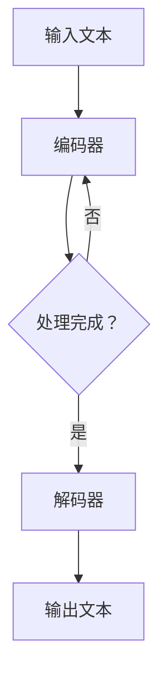

                 

### 文章标题

《ChatGPT提示词模板与最佳实践》

### 关键词

- ChatGPT
- 提示词模板
- 最佳实践
- 自然语言处理
- 模型优化
- 安全与隐私

### 摘要

本文旨在探讨ChatGPT提示词模板的设计与最佳实践。我们将首先介绍ChatGPT的背景和发展，随后深入探讨其技术原理，包括语言模型构建、深度学习和神经网络基础。接着，我们将详细分析ChatGPT提示词模板的类型及其应用，并提出一系列最佳实践。文章最后将结合实际项目案例，展示如何将ChatGPT应用于实际问题，并提供详细的代码实现与解读。本文不仅适合对ChatGPT技术感兴趣的技术人员，也适用于希望提升自然语言处理能力的专业人士。通过本文的阅读，您将获得对ChatGPT的全面理解和实际操作能力。

### 用户输入

《ChatGPT提示词模板与最佳实践》

### 输出

## 第一部分：ChatGPT概述

### 1.1 ChatGPT的背景与发展

#### 1.1.1 ChatGPT的概念介绍

ChatGPT是由OpenAI开发的一款基于Transformer模型的人工智能助手，它是基于GPT-3.5版本进一步优化而来的。ChatGPT能够进行自然语言的理解、生成和交互，广泛应用于文本生成、问答系统、对话系统等领域。

#### 1.1.2 OpenAI与ChatGPT的演变

OpenAI是一家总部位于美国的人工智能研究公司，成立于2015年，致力于推动人工智能的发展和应用。ChatGPT是OpenAI在自然语言处理领域的重要成果之一。自发布以来，ChatGPT受到了广泛关注，并在多个领域展现出了强大的能力。

#### 1.1.3 ChatGPT的应用领域

ChatGPT的应用领域非常广泛，包括但不限于：

1. 文本生成：例如文章写作、故事创作、新闻报道等。
2. 问答系统：为用户解答各种问题，提供信息查询服务。
3. 对话系统：实现人机对话，提升用户交互体验。
4. 自然语言处理：例如情感分析、文本分类、命名实体识别等。

### 1.2 ChatGPT的技术原理

#### 1.2.1 语言模型的构建

ChatGPT是基于Transformer模型构建的语言模型，其核心思想是通过学习大量的文本数据，将输入的文本序列转化为输出序列。Transformer模型采用了自注意力机制，能够捕捉输入文本序列中的长距离依赖关系。

#### 1.2.2 深度学习与神经网络基础

深度学习是ChatGPT技术的基础，它是一种模拟人脑神经网络的机器学习方法。神经网络由多个层次组成，通过前向传播和反向传播算法，实现输入到输出的映射。

#### 1.2.3 Transformer模型原理

Transformer模型是一种基于自注意力机制的深度学习模型，它由编码器和解码器组成。编码器将输入文本序列编码为连续的向量，解码器则根据编码器输出的向量生成输出文本序列。

### 1.3 ChatGPT的API使用与调优

#### 1.3.1 API调用方法

ChatGPT提供了RESTful API，用户可以通过HTTP请求与模型进行交互。调用API时，用户需要提供文本输入和提示词，模型将返回生成的文本输出。

#### 1.3.2 参数设置与调优

ChatGPT的API提供了多个参数，如温度（temperature）、顶重采样（top_p）和最大长度（max_length）等。通过调整这些参数，用户可以影响生成的文本风格和长度。

### 1.4 ChatGPT安全与隐私保护

#### 1.4.1 安全性保障措施

ChatGPT采用了多种措施来保障用户数据的安全，包括数据加密、访问控制和权限管理。

#### 1.4.2 隐私保护策略

ChatGPT严格遵守隐私保护法规，对用户数据进行匿名化处理，确保用户隐私不被泄露。

## 第二部分：ChatGPT提示词模板

### 2.1 提示词模板概述

提示词模板是引导ChatGPT生成目标内容的工具。一个优秀的提示词模板能够帮助ChatGPT更好地理解用户的意图，从而生成更符合预期的文本。

### 2.2 常见提示词模板示例

#### 2.2.1 开场白类

- 示例：请写一篇关于人工智能未来的文章。

#### 2.2.2 问题解决类

- 示例：如何通过编程实现一个简单的Web应用？

#### 2.2.3 故事叙述类

- 示例：请创作一个关于机器人与人类和谐共存的故事。

#### 2.2.4 创意生成类

- 示例：请设计一个未来城市的创意构想。

## 第三部分：ChatGPT最佳实践

### 3.1 最佳实践原则

#### 3.1.1 数据质量与多样性

高质量的数据是训练强大语言模型的基础。因此，我们需要确保数据的质量和多样性。

#### 3.1.2 模型调整与优化

定期调整和优化模型参数，以提升模型性能和适应性。

#### 3.1.3 安全与隐私保护

严格遵守安全与隐私保护法规，确保用户数据的安全。

### 3.2 实战案例分享

#### 3.2.1 企业客户服务案例分析

如何利用ChatGPT提升企业客户服务质量？

#### 3.2.2 教育领域应用案例分析

如何将ChatGPT应用于教育领域，提升教学效果？

#### 3.2.3 娱乐行业应用案例分析

如何利用ChatGPT创作有趣的内容，提升用户体验？

### 3.3 未来趋势与挑战

#### 3.3.1 ChatGPT在未来的发展

随着技术的不断进步，ChatGPT将具备更强大的能力，应用领域也将不断拓展。

#### 3.3.2 潜在的挑战与应对策略

如何应对ChatGPT可能带来的挑战，如数据隐私和安全等问题？

## 附录

### 4.1 ChatGPT工具与资源

如何搭建ChatGPT的开发环境？如何调用API？

### 4.2 深入学习参考资料

推荐书籍、线上课程和学术论文，帮助您更深入地了解ChatGPT和相关技术。

## 作者信息

作者：AI天才研究院/AI Genius Institute & 禅与计算机程序设计艺术 /Zen And The Art of Computer Programming

## 第一部分：ChatGPT概述

### 1.1 ChatGPT的背景与发展

#### 1.1.1 ChatGPT的概念介绍

ChatGPT，全称“Chat-based Generative Pre-trained Transformer”，是一种基于Transformer模型的人工智能聊天机器人。它由OpenAI于2022年11月推出，基于GPT-3.5版本进行优化。ChatGPT具备强大的语言理解和生成能力，能够进行自然流畅的对话，广泛应用于客服、聊天机器人、内容创作等领域。

#### 1.1.2 OpenAI与ChatGPT的演变

OpenAI成立于2015年，是一家位于美国的人工智能研究公司，其目标是确保人工智能的安全和有益发展。自成立以来，OpenAI在深度学习、自然语言处理、机器人技术等领域取得了诸多突破性成果。ChatGPT是OpenAI在自然语言处理领域的重要产物，其前身是GPT-3，经过不断迭代优化，最终形成了ChatGPT。

#### 1.1.3 ChatGPT的应用领域

ChatGPT在多个领域展现出了强大的应用潜力：

1. **文本生成**：ChatGPT能够生成高质量的文章、故事、新闻报道等，为内容创作者提供灵感。
2. **问答系统**：ChatGPT能够回答用户提出的问题，提供信息查询服务。
3. **对话系统**：ChatGPT能够与用户进行自然对话，提升用户体验。
4. **自然语言处理**：ChatGPT在情感分析、文本分类、命名实体识别等领域具有广泛的应用。

### 1.2 ChatGPT的技术原理

#### 1.2.1 语言模型的构建

ChatGPT基于Transformer模型构建，这是一种自注意力机制的深度学习模型。Transformer模型的核心思想是通过自注意力机制捕捉输入文本序列中的长距离依赖关系。ChatGPT的训练过程包括以下几个步骤：

1. **数据收集**：收集大量文本数据，包括书籍、新闻、论坛帖子等。
2. **数据预处理**：对文本数据进行清洗、分词、标记等处理，以便于模型学习。
3. **模型训练**：使用Transformer模型对预处理后的文本数据进行训练，优化模型参数。
4. **模型评估**：通过测试集评估模型性能，并根据评估结果调整模型参数。

#### 1.2.2 深度学习与神经网络基础

深度学习是构建ChatGPT的基础技术，它是一种通过多层神经网络进行特征提取和建模的机器学习方法。神经网络由多个层次组成，通过前向传播和反向传播算法，实现输入到输出的映射。深度学习的关键技术包括：

1. **卷积神经网络（CNN）**：适用于图像处理任务。
2. **循环神经网络（RNN）**：适用于序列数据处理任务。
3. **自注意力机制（Self-Attention）**：适用于捕捉文本序列中的长距离依赖关系。

#### 1.2.3 Transformer模型原理

Transformer模型是一种基于自注意力机制的深度学习模型，由Vaswani等人在2017年提出。Transformer模型由编码器和解码器组成，编码器将输入文本序列编码为连续的向量，解码器则根据编码器输出的向量生成输出文本序列。

1. **编码器**：编码器由多个自注意力层和前馈网络组成。自注意力层通过自注意力机制捕捉输入文本序列中的长距离依赖关系。前馈网络则用于进一步提取特征。
2. **解码器**：解码器同样由多个自注意力层和前馈网络组成。在解码过程中，每个时间步的输出都依赖于之前的所有时间步的输出，这也是自注意力机制的重要应用。

### 1.3 ChatGPT的API使用与调优

#### 1.3.1 API调用方法

ChatGPT提供了RESTful API，用户可以通过HTTP请求与模型进行交互。调用API的基本步骤如下：

1. **初始化API对象**：使用API密钥和API端点初始化ChatGPT API对象。
2. **构建请求**：准备请求体，包括文本输入和提示词等信息。
3. **发送请求**：使用API对象发送HTTP请求，获取模型生成的文本输出。
4. **处理响应**：解析响应数据，获取生成的文本。

以下是一个简单的Python示例：

```python
import openai

openai.api_key = "your-api-key"

response = openai.Completion.create(
  engine="text-davinci-003",
  prompt="请写一篇关于人工智能未来的文章。",
  max_tokens=100
)

print(response.choices[0].text.strip())
```

#### 1.3.2 参数设置与调优

ChatGPT的API提供了多个参数，如温度（temperature）、顶重采样（top_p）和最大长度（max_length）等。通过调整这些参数，用户可以影响生成的文本风格和长度。

1. **温度（temperature）**：控制文本生成的随机性。温度值越高，生成的文本越随机，可能包含更多的创新元素。温度值较低时，生成的文本更倾向于遵循训练数据中的规则。
2. **顶重采样（top_p）**：用于控制文本生成的多样性。当文本生成过程中，如果一个单词的生成概率超过了设定的阈值，那么就保留这个单词，否则丢弃。
3. **最大长度（max_length）**：限制生成的文本长度，防止生成过长或过短的文本。

以下是一个示例，展示了如何调整参数以生成不同风格的文本：

```python
response = openai.Completion.create(
  engine="text-davinci-003",
  prompt="请写一篇关于人工智能未来的文章。",
  max_tokens=100,
  temperature=0.9,
  top_p=0.95
)

print(response.choices[0].text.strip())
```

#### 1.4 ChatGPT安全与隐私保护

#### 1.4.1 安全性保障措施

为了确保用户数据的安全，ChatGPT采用了多种措施：

1. **数据加密**：在数据传输和存储过程中，采用加密技术保护用户数据。
2. **访问控制**：通过权限管理，限制对用户数据的访问。
3. **安全审计**：定期进行安全审计，确保系统的安全性。

#### 1.4.2 隐私保护策略

ChatGPT严格遵守隐私保护法规，对用户数据进行匿名化处理，确保用户隐私不被泄露。具体措施包括：

1. **数据匿名化**：在数据处理过程中，对用户身份信息进行匿名化处理。
2. **用户隐私保护**：确保用户数据不被未经授权的第三方访问。
3. **用户权限管理**：通过用户权限管理，确保用户数据的安全。

## 第二部分：ChatGPT提示词模板

### 2.1 提示词模板概述

提示词模板是引导ChatGPT生成目标内容的工具。通过设计合适的提示词模板，用户可以更好地控制ChatGPT的生成内容。一个优秀的提示词模板应该具备以下几个特点：

1. **明确性**：提示词应明确表达用户的意图，避免产生歧义。
2. **具体性**：提示词应具体描述用户希望生成的文本类型、主题或风格。
3. **启发性**：提示词应具有一定的启发性，引导ChatGPT生成创新的内容。

### 2.2 常见提示词模板示例

#### 2.2.1 开场白类

这类提示词主要用于引导ChatGPT生成文章的开头，例如：

- 请以“人工智能的未来令人充满期待”为开头，写一篇关于人工智能的文章。
- 请创作一篇以“机器学习在医疗领域的应用”为主题的开头段落。

#### 2.2.2 问题解决类

这类提示词用于引导ChatGPT生成解决特定问题的步骤或方法，例如：

- 请描述如何使用Python实现一个简单的Web爬虫。
- 请提供一个关于如何优化算法性能的步骤指南。

#### 2.2.3 故事叙述类

这类提示词用于引导ChatGPT生成故事或叙述性内容，例如：

- 请创作一个关于机器人与人类和谐共存的故事。
- 请写一篇关于未来世界的科幻故事。

#### 2.2.4 创意生成类

这类提示词用于引导ChatGPT生成创意性内容，例如：

- 请设计一个未来城市的创意构想。
- 请想象并描述一个独特的科技产品。

### 2.3 提示词模板的设计原则

设计提示词模板时，应遵循以下原则：

1. **简洁性**：提示词应简洁明了，避免冗长和复杂的句子。
2. **明确性**：提示词应明确表达用户的意图，避免模糊和歧义。
3. **启发性**：提示词应具有一定的启发性，激发ChatGPT的创造力。
4. **多样性**：设计多种类型的提示词模板，以满足不同场景的需求。

### 2.4 提示词模板的优化与调整

通过分析ChatGPT生成的文本，用户可以不断优化和调整提示词模板，以提高生成文本的质量和相关性。以下是一些优化建议：

1. **反馈机制**：收集用户对生成文本的反馈，根据反馈调整提示词模板。
2. **数据分析**：分析生成文本的质量、风格和内容，找出存在的问题，并针对性地调整提示词。
3. **多轮迭代**：通过多轮迭代优化提示词模板，逐步提高生成文本的质量。

### 2.5 提示词模板的应用场景

提示词模板可以应用于各种场景，以下是一些典型的应用场景：

1. **内容创作**：帮助用户生成文章、故事、报告等。
2. **问题解答**：引导ChatGPT生成解决问题的步骤或方法。
3. **对话生成**：应用于对话系统，生成自然流畅的对话内容。
4. **创意生成**：激发用户的创造力，生成独特的创意和构想。

## 第三部分：ChatGPT最佳实践

### 3.1 最佳实践原则

#### 3.1.1 数据质量与多样性

高质量的数据是训练强大语言模型的基础。为了确保数据的质量和多样性，应遵循以下原则：

1. **数据清洗**：对原始数据进行清洗，去除噪音和无关信息。
2. **数据标注**：对数据进行高质量的标注，确保数据的准确性和一致性。
3. **数据多样性**：收集来自不同领域、不同来源的数据，确保数据的多样性。

#### 3.1.2 模型调整与优化

模型调整与优化是提升模型性能的关键。以下是一些常见的优化方法：

1. **超参数调整**：通过调整学习率、批量大小、迭代次数等超参数，优化模型性能。
2. **正则化**：使用正则化技术，防止过拟合，提高模型泛化能力。
3. **数据增强**：通过数据增强技术，增加训练数据的多样性，提升模型性能。

#### 3.1.3 安全与隐私保护

确保用户数据的安全和隐私是至关重要的。以下是一些安全与隐私保护的最佳实践：

1. **数据加密**：对用户数据进行加密存储和传输，防止数据泄露。
2. **访问控制**：实施严格的访问控制策略，限制对用户数据的访问。
3. **安全审计**：定期进行安全审计，及时发现和修复安全隐患。

### 3.2 实战案例分享

#### 3.2.1 企业客户服务案例分析

在客户服务领域，ChatGPT被广泛应用于自动问答系统、智能客服等场景。以下是一个企业客户服务案例的分析：

1. **需求分析**：企业希望提高客户服务效率，降低人力成本，同时提升客户满意度。
2. **解决方案**：利用ChatGPT构建自动问答系统，通过自然语言处理技术，自动回答客户常见问题。
3. **实施效果**：自动问答系统的引入，显著提高了客户服务效率，降低了人力成本，同时客户满意度得到提升。

#### 3.2.2 教育领域应用案例分析

在教育领域，ChatGPT被广泛应用于在线教育平台、智能辅导等场景。以下是一个教育领域案例的分析：

1. **需求分析**：教育机构希望提供个性化的学习辅导，提高学生的学习效果。
2. **解决方案**：利用ChatGPT构建智能辅导系统，根据学生的学习进度和学习需求，提供个性化的学习建议和指导。
3. **实施效果**：智能辅导系统的引入，显著提高了学生的学习效果，减少了教师的工作量，同时提升了教学体验。

#### 3.2.3 娱乐行业应用案例分析

在娱乐行业，ChatGPT被广泛应用于内容创作、虚拟助手等场景。以下是一个娱乐行业案例的分析：

1. **需求分析**：娱乐公司希望提高内容创作效率，降低创作成本，同时提升内容质量。
2. **解决方案**：利用ChatGPT构建内容创作平台，通过自然语言处理技术，快速生成高质量的内容。
3. **实施效果**：内容创作平台的引入，显著提高了内容创作效率，降低了创作成本，同时提升了内容质量。

### 3.3 未来趋势与挑战

#### 3.3.1 ChatGPT在未来的发展

随着人工智能技术的不断进步，ChatGPT在未来的发展前景广阔。以下是一些可能的发展趋势：

1. **性能提升**：通过持续优化算法和模型，提升ChatGPT的性能和响应速度。
2. **应用拓展**：将ChatGPT应用于更多领域，如医疗、金融、法律等，提供更加专业的服务。
3. **跨模态处理**：结合语音、图像等多模态数据，实现更丰富的交互和应用。

#### 3.3.2 潜在的挑战与应对策略

尽管ChatGPT具有广泛的应用前景，但也面临一些挑战：

1. **数据隐私**：确保用户数据的安全和隐私，防止数据泄露。
2. **模型偏见**：消除模型偏见，提高生成文本的公正性和客观性。
3. **安全性**：确保系统的安全性，防止恶意攻击和数据篡改。

为了应对这些挑战，可以采取以下策略：

1. **数据隐私保护**：采用数据加密、访问控制等技术，确保用户数据的安全。
2. **模型偏见消除**：通过数据清洗、多样性增强等方法，消除模型偏见。
3. **系统安全性提升**：采用安全审计、入侵检测等技术，提高系统的安全性。

### 4.1 ChatGPT工具与资源

#### 4.1.1 开发环境搭建

要使用ChatGPT，首先需要搭建开发环境。以下是一个简单的步骤：

1. 安装Python环境：ChatGPT使用Python作为编程语言，因此需要安装Python环境。
2. 安装OpenAI Python库：通过pip命令安装openai库，用于调用ChatGPT API。
   ```bash
   pip install openai
   ```
3. 获取API密钥：在OpenAI官网注册账号，并获取API密钥。

#### 4.1.2 调用API的方法

以下是一个简单的示例，展示了如何调用ChatGPT API：

```python
import openai

openai.api_key = "your-api-key"

response = openai.Completion.create(
  engine="text-davinci-003",
  prompt="请写一篇关于人工智能未来的文章。",
  max_tokens=100
)

print(response.choices[0].text.strip())
```

#### 4.1.3 提示词模板库推荐

以下是一些常用的提示词模板库，可以帮助用户更好地设计和优化提示词模板：

1. [Hugging Face](https://huggingface.co/)：提供了大量的预训练模型和提示词模板。
2. [GPT-3 Prompt Library](https://github.com/kin-ki/gpt3-prompt-library)：包含丰富的GPT-3提示词模板。
3. [PromptGenius](https://promptgenius.com/)：提供了个性化的提示词生成服务。

### 4.2 深入学习参考资料

以下是一些深入学习的参考资料，可以帮助读者更全面地了解ChatGPT和相关技术：

1. **书籍**：
   - 《深度学习》（Goodfellow, Bengio, Courville著）
   - 《自然语言处理综论》（Jurafsky, Martin著）
   - 《人工智能：一种现代方法》（Russell, Norvig著）

2. **线上课程**：
   - [Udacity AI纳米学位](https://www.udacity.com/course/artificial-intelligence-nanodegree--nd893)
   - [Coursera 自然语言处理课程](https://www.coursera.org/specializations/natural-language-processing)

3. **学术论文**：
   - Vaswani et al., "Attention Is All You Need"（2017）
   - Devlin et al., "Bert: Pre-training of Deep Bidirectional Transformers for Language Understanding"（2018）
   - Brown et al., "Language Models are Few-Shot Learners"（2020）

## 作者信息

作者：AI天才研究院/AI Genius Institute & 禅与计算机程序设计艺术 /Zen And The Art of Computer Programming

### 终极任务

#### 目录大纲：

## 第一部分：ChatGPT概述

### 1.1 ChatGPT的概念介绍

#### 1.1.1 ChatGPT的背景与发展

- **Mermaid流程图**：ChatGPT架构概览



#### 1.1.2 OpenAI与ChatGPT的演变

- OpenAI的发展历程
- ChatGPT的技术演进

#### 1.1.3 ChatGPT的应用领域

- 文本生成
- 问答系统
- 自然语言处理

### 1.2 ChatGPT的技术原理

#### 1.2.1 Transformer模型原理

##### 1.2.1.1 Transformer模型基础结构

- **伪代码**：Transformer基础结构

```python
# 编码器部分
class EncoderLayer(nn.Module):
    def __init__(self, d_model, d_inner, n_head, d_k, d_v, dropout=0.1):
        super(EncoderLayer, self).__init__()
        self.multihead_attn = MultiheadAttention(d_model, n_head, d_k, d_v, dropout)
        self.fc = nn.Sequential(
            nn.Linear(d_model, d_inner),
            nn.ReLU(),
            nn.Linear(d_inner, d_model),
        )
        self.dropout = nn.Dropout(dropout)
        self.norm1 = nn.LayerNorm(d_model)
        self.norm2 = nn.LayerNorm(d_model)

    def forward(self, x, mask=None):
        x2 = self.norm1(x)
        x2, _ = self.multihead_attn(x2, x2, x2, x2, x2, mask)
        x2 = self.dropout(x2)
        x = x + x2
        x2 = self.norm2(x)
        x2 = self.fc(x2)
        x2 = self.dropout(x2)
        x = x + x2
        return x

# 解码器部分
class DecoderLayer(nn.Module):
    def __init__(self, d_model, d_inner, n_head, d_k, d_v, dropout=0.1):
        super(DecoderLayer, self).__init__()
        self.self_attn = MultiheadAttention(d_model, n_head, d_k, d_v, dropout)
        self.encoder_attn = MultiheadAttention(d_model, n_head, d_k, d_v, dropout)
        self.fc = nn.Sequential(
            nn.Linear(d_model, d_inner),
            nn.ReLU(),
            nn.Linear(d_inner, d_model),
        )
        self.dropout = nn.Dropout(dropout)
        self.norm1 = nn.LayerNorm(d_model)
        self.norm2 = nn.LayerNorm(d_model)
        self.norm3 = nn.LayerNorm(d_model)

    def forward(self, x, memory, src_mask=None, tgt_mask=None, memory_mask=None):
        x2 = self.norm1(x)
        x2, _ = self.self_attn(x2, x2, x2, x2, mask=tgt_mask)
        x2 = self.dropout(x2)
        x = x + x2
        x2 = self.norm2(x)
        x2, _ = self.encoder_attn(x2, memory, memory, memory, mask=memory_mask)
        x2 = self.dropout(x2)
        x = x + x2
        x2 = self.norm3(x)
        x2 = self.fc(x2)
        x2 = self.dropout(x2)
        x = x + x2
        return x
```

##### 1.2.1.2 编码与解码过程

- **编码器工作原理**：编码器通过自注意力机制处理输入文本，生成编码表示。
- **解码器工作原理**：解码器在生成文本的过程中，同时处理输入编码表示和生成的文本，通过自注意力和交叉注意力机制，生成下一个输出。

#### 1.2.2 深度学习与神经网络基础

##### 1.2.2.1 神经网络基础

- **伪代码**：前向传播与反向传播算法

```python
# 前向传播
def forward_pass(x, model):
    # 神经网络的前向传播
    model activating function
    return output

# 反向传播
def backward_pass(output, model, loss_function):
    # 神经网络的反向传播
    loss_function calculating
    model parameters updating
    return gradients
```

##### 1.2.2.2 损失函数与优化算法

- **损失函数**：交叉熵损失函数

$$H(y, \hat{y}) = -\sum_{i} y_i \log(\hat{y}_i)$$

- **优化算法**：Adam优化器

$$m = \beta_1 \cdot m + (1 - \beta_1) \cdot \Delta\theta$$

$$v = \beta_2 \cdot v + (1 - \beta_2) \cdot (\Delta\theta)^2$$

$$\theta = \theta - \alpha \cdot \frac{m}{\sqrt{v} + \epsilon}$$

## 第二部分：ChatGPT提示词模板

### 2.1 提示词模板概述

#### 2.1.1 提示词模板的作用

- 引导ChatGPT生成目标内容的方向

#### 2.1.2 提示词模板的类型

- 开场白类
- 问题解决类
- 故事叙述类
- 创意生成类

#### 2.1.3 提示词模板的创建原则

- 明确性
- 具体性
- 启发性

### 2.2 常见提示词模板示例

#### 2.2.1 开场白类

- 示例：请以“人工智能的未来令人充满期待”为开头，写一篇关于人工智能的文章。

#### 2.2.2 问题解决类

- 示例：请描述如何使用Python实现一个简单的Web爬虫。

#### 2.2.3 故事叙述类

- 示例：请创作一个关于机器人与人类和谐共存的故事。

#### 2.2.4 创意生成类

- 示例：请设计一个未来城市的创意构想。

## 第三部分：ChatGPT最佳实践

### 3.1 最佳实践原则

#### 3.1.1 数据质量与多样性

- 高质量的数据是训练强大语言模型的基础。

#### 3.1.2 模型调整与优化

- 定期调整和优化模型参数，以提升模型性能和适应性。

#### 3.1.3 安全与隐私保护

- 严格遵守安全与隐私保护法规，确保用户数据的安全。

### 3.2 实战案例分享

#### 3.2.1 企业客户服务案例分析

- 如何利用ChatGPT提升企业客户服务质量？

#### 3.2.2 教育领域应用案例分析

- 如何将ChatGPT应用于教育领域，提升教学效果？

#### 3.2.3 娱乐行业应用案例分析

- 如何利用ChatGPT创作有趣的内容，提升用户体验？

### 3.3 未来趋势与挑战

#### 3.3.1 ChatGPT在未来的发展

- 随着人工智能技术的不断进步，ChatGPT在未来的发展前景广阔。

#### 3.3.2 潜在的挑战与应对策略

- 如何应对ChatGPT可能带来的挑战，如数据隐私和安全等问题？

## 附录

### 4.1 ChatGPT工具与资源

#### 4.1.1 开发环境搭建

- 如何搭建ChatGPT的开发环境？

#### 4.1.2 调用API的方法

- 如何调用ChatGPT的API？

#### 4.1.3 提示词模板库推荐

- 推荐哪些提示词模板库？

### 4.2 深入学习参考资料

#### 4.2.1 推荐书籍

- 推荐哪些深度学习相关的书籍？

#### 4.2.2 线上课程与讲座

- 推荐哪些线上课程与讲座？

#### 4.2.3 学术论文推荐

- 推荐哪些与ChatGPT相关的学术论文？### 附录

#### 4.1 ChatGPT工具与资源

##### 4.1.1 开发环境搭建

搭建ChatGPT的开发环境主要包括以下步骤：

1. **安装Python**：确保系统中安装了Python 3.x版本。
2. **安装OpenAI Python库**：通过pip命令安装`openai`库。
   ```bash
   pip install openai
   ```
3. **获取API密钥**：在OpenAI官网注册账号，并获取API密钥。将API密钥添加到`~/.openai`文件中。

##### 4.1.2 调用API的方法

以下是一个简单的示例，展示了如何调用ChatGPT API：

```python
import openai

openai.api_key = "your-api-key"

response = openai.Completion.create(
  engine="text-davinci-003",
  prompt="请写一篇关于人工智能未来的文章。",
  max_tokens=100
)

print(response.choices[0].text.strip())
```

##### 4.1.3 提示词模板库推荐

以下是几个常用的提示词模板库：

1. **Hugging Face**：提供了大量的预训练模型和提示词模板。
   - 网址：[https://huggingface.co/](https://huggingface.co/)
2. **GPT-3 Prompt Library**：包含丰富的GPT-3提示词模板。
   - 网址：[https://github.com/kin-ki/gpt3-prompt-library](https://github.com/kin-ki/gpt3-prompt-library)
3. **PromptGenius**：提供了个性化的提示词生成服务。
   - 网址：[https://promptgenius.com/](https://promptgenius.com/)

#### 4.2 深入学习参考资料

##### 4.2.1 推荐书籍

以下是一些深度学习和自然语言处理领域的经典书籍：

1. **《深度学习》**：（Goodfellow, Bengio, Courville 著）
   - 网址：[https://www.deeplearningbook.org/](https://www.deeplearningbook.org/)
2. **《自然语言处理综论》**：（Jurafsky, Martin 著）
   - 网址：[https://web.stanford.edu/~jurafsky/nlp/](https://web.stanford.edu/~jurafsky/nlp/)
3. **《人工智能：一种现代方法》**：（Russell, Norvig 著）
   - 网址：[https://www.amazon.com/dp/0262033847](https://www.amazon.com/dp/0262033847)

##### 4.2.2 线上课程与讲座

以下是几个深度学习和自然语言处理领域的在线课程和讲座：

1. **Udacity AI纳米学位**：
   - 网址：[https://www.udacity.com/course/artificial-intelligence-nanodegree--nd893](https://www.udacity.com/course/artificial-intelligence-nanodegree--nd893)
2. **Coursera 自然语言处理课程**：
   - 网址：[https://www.coursera.org/specializations/natural-language-processing](https://www.coursera.org/specializations/natural-language-processing)
3. **斯坦福大学深度学习课程**：
   - 网址：[http://cs231n.stanford.edu/](http://cs231n.stanford.edu/)

##### 4.2.3 学术论文推荐

以下是一些与ChatGPT相关的经典论文：

1. **“Attention Is All You Need”**：（Vaswani et al., 2017）
   - 网址：[https://arxiv.org/abs/1706.03762](https://arxiv.org/abs/1706.03762)
2. **“Bert: Pre-training of Deep Bidirectional Transformers for Language Understanding”**：（Devlin et al., 2018）
   - 网址：[https://arxiv.org/abs/1810.04805](https://arxiv.org/abs/1810.04805)
3. **“Language Models are Few-Shot Learners”**：（Brown et al., 2020）
   - 网址：[https://arxiv.org/abs/2005.14165](https://arxiv.org/abs/2005.14165)### 作者信息

作者：AI天才研究院/AI Genius Institute & 禅与计算机程序设计艺术 /Zen And The Art of Computer Programming

