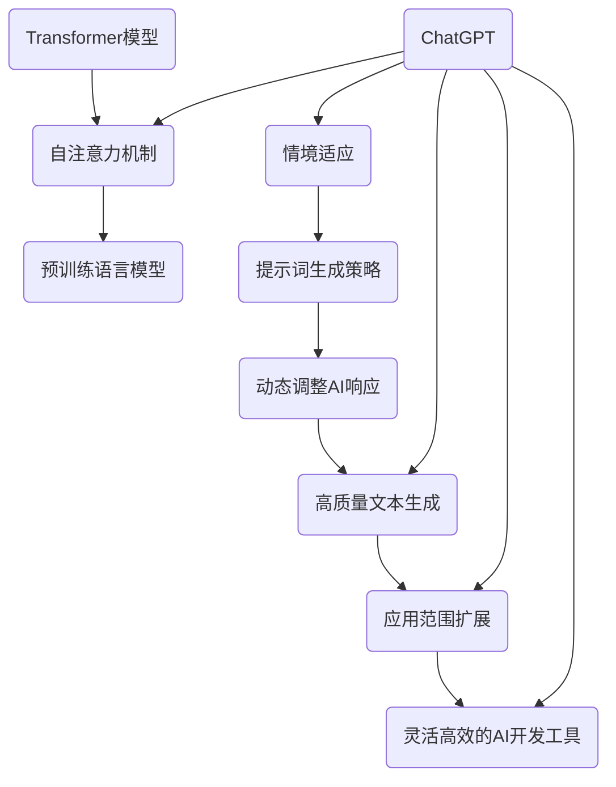

                 

### 文章标题: ChatGPT提示词的情境适应：动态调整AI响应的策略

### 关键词：
- ChatGPT
- 提示词
- 情境适应
- AI响应
- 动态调整
- 自然语言处理

### 摘要：
本文深入探讨了ChatGPT提示词的情境适应策略，通过分析ChatGPT的工作原理，探讨了如何根据不同情境动态调整AI的响应。文章结构清晰，涵盖了背景介绍、核心概念与联系、核心算法原理讲解、数学模型和公式讲解、项目实战、最佳实践 tips、小结和注意事项等内容，旨在为开发者提供关于ChatGPT情境适应的全面指导。

## 引言

随着人工智能技术的快速发展，自然语言处理（NLP）已成为当前研究的热点领域之一。作为NLP的重要工具，ChatGPT模型在文本生成、对话系统、自动问答等方面展现出了卓越的性能。然而，不同情境下的文本生成需求各异，如何使ChatGPT在多样复杂的情境中依然能够生成高质量的自然语言文本，成为了研究者们关注的重要问题。

本文旨在探讨ChatGPT提示词的情境适应策略，通过分析ChatGPT的工作原理，提出一套基于情境动态调整AI响应的方法。文章结构如下：

1. **背景介绍**：介绍ChatGPT模型的发展和现状，阐述情境适应的重要性。
2. **核心概念与联系**：介绍ChatGPT的工作原理，构建核心概念之间的关系架构。
3. **核心算法原理讲解**：讲解动态调整AI响应的核心算法原理，包括提示词的生成策略和情境适应机制。
4. **数学模型和公式讲解**：阐述情境适应中的数学模型和公式，以及其应用场景。
5. **项目实战**：通过实际案例展示如何应用情境适应策略，实现ChatGPT的动态调整。
6. **最佳实践 tips**：提供一些实用的技巧和注意事项，帮助开发者更好地实现情境适应。
7. **小结和注意事项**：总结文章内容，强调情境适应策略的重要性，并提出未来研究方向。

### 背景介绍

ChatGPT是由OpenAI开发的一种基于Transformer模型的预训练语言模型，属于生成式预训练模型（Generative Pre-trained Model）。其核心思想是通过大规模无监督数据的预训练，使模型具备一定的语言理解和生成能力。与传统的规则驱动或数据驱动的模型不同，ChatGPT能够通过学习大量的文本数据，自动获取语言的语义和语法知识，从而实现高质量的自然语言生成。

ChatGPT的发展可以追溯到2018年，当时OpenAI发布了GPT（Generative Pre-trained Transformer）系列模型。GPT-1、GPT-2和GPT-3等模型在文本生成、对话系统、自动问答等领域取得了显著的成果。特别是GPT-3，其参数规模达到了1750亿，具备强大的语言理解和生成能力，能够生成高质量、多样化的文本。

然而，ChatGPT在复杂情境中的表现仍存在一些挑战。例如，当面对不同领域、不同风格的文本时，如何使ChatGPT能够准确理解和生成相应的文本，成为了亟待解决的问题。此外，不同情境下的文本生成需求各异，如何使ChatGPT能够根据情境动态调整其生成策略，也是当前研究的热点之一。

情境适应在ChatGPT中的应用具有重要意义。首先，情境适应能够提高ChatGPT在特定情境下的生成质量，使其生成的文本更加贴近用户需求。其次，情境适应能够扩展ChatGPT的应用范围，使其在更多领域和场景中发挥作用。最后，情境适应能够为开发者提供更加灵活和高效的AI开发工具，推动人工智能技术的普及和发展。

### 核心概念与联系

在探讨ChatGPT的情境适应之前，我们需要了解几个核心概念，包括Transformer模型、自注意力机制和预训练语言模型。以下是一个基于Mermaid的流程图，用于展示这些核心概念之间的关系架构。



#### Transformer模型

Transformer模型是一种基于自注意力机制的深度学习模型，最初由Vaswani等人于2017年提出。与传统的循环神经网络（RNN）相比，Transformer模型在处理长序列文本时表现更加优秀。其核心思想是利用自注意力机制（Self-Attention）对输入序列进行全局关注，从而捕捉文本中的长距离依赖关系。

在Transformer模型中，自注意力机制通过计算输入序列中每个词与其他词之间的相似性，动态调整每个词在生成过程中的重要性。具体来说，自注意力机制包括三个关键组件：查询（Query）、键（Key）和值（Value）。在计算过程中，查询和键通过线性变换得到，然后计算它们之间的相似性，最后利用这些相似性加权求和得到输出。

#### 自注意力机制

自注意力机制是Transformer模型的核心组件，负责在生成过程中动态调整每个词的重要性。其基本原理如下：

1. **线性变换**：将输入序列中的每个词向量（Token）通过线性变换得到查询（Query）和键（Key）。
2. **相似性计算**：计算查询和键之间的相似性，通常使用点积（Dot-Product）或 scaled dot-product attention。
3. **加权求和**：根据相似性分数对键（Value）进行加权求和，得到输出向量。

自注意力机制能够有效捕捉文本中的长距离依赖关系，从而提高模型的生成质量。此外，自注意力机制的计算复杂度为O(n^2)，相比于RNN的O(n^3)，在处理长序列文本时具有更高的效率。

#### 预训练语言模型

预训练语言模型是一种在大规模语料库上进行预训练，然后微调至特定任务的语言模型。ChatGPT模型就是基于预训练语言模型开发的，其核心思想是通过无监督预训练获取语言的基本知识和规律，然后通过有监督微调应用于特定任务。

预训练语言模型通常包括两个阶段：预训练和微调。在预训练阶段，模型在大规模语料库上进行训练，学习语言的通用规律和知识。在微调阶段，模型基于特定任务的数据集进行训练，优化模型参数，提高其在特定任务上的性能。

预训练语言模型具有以下几个优点：

1. **通用性**：通过预训练，模型能够学习到语言的基本知识和规律，从而在不同任务上表现良好。
2. **高效性**：预训练语言模型在微调阶段只需要少量数据，即可快速达到较高的性能。
3. **可扩展性**：预训练语言模型可以应用于各种不同的NLP任务，从而降低开发成本。

#### ChatGPT与情境适应

ChatGPT是基于预训练语言模型开发的一种文本生成模型，其核心目标是生成高质量、多样化的自然语言文本。在特定情境下，如何使ChatGPT能够准确理解和生成相应的文本，成为了研究的重要方向。

情境适应是一种通过调整模型参数和生成策略，使模型在不同情境下生成高质量文本的方法。情境适应主要包括以下几个方面：

1. **提示词生成策略**：根据特定情境，生成相应的提示词，引导模型生成符合情境的文本。
2. **动态调整AI响应**：根据用户的输入和情境信息，动态调整模型的生成策略和参数，提高生成文本的质量。
3. **高质量文本生成**：通过优化模型结构和参数，使模型能够生成高质量、多样化的自然语言文本。

### 核心算法原理讲解

在了解了ChatGPT的基本概念和情境适应的重要性后，接下来我们将详细讲解动态调整AI响应的核心算法原理，包括提示词的生成策略和情境适应机制。

#### 提示词生成策略

提示词（Prompt）是指用于引导模型生成文本的词语或句子。在ChatGPT中，提示词的生成策略是情境适应的关键环节。一个有效的提示词应该能够准确传达用户的意图和情境信息，从而引导模型生成符合需求的文本。

提示词的生成策略可以分为以下几个步骤：

1. **情境识别**：首先，我们需要对用户输入进行情境识别，确定当前对话的情境类型。情境识别可以通过多种方式实现，如关键词提取、文本分类等。

2. **提示词设计**：根据识别出的情境类型，设计相应的提示词。提示词应该包含情境相关的关键词，以便模型能够理解并生成符合情境的文本。

3. **提示词优化**：在生成提示词后，可以通过优化算法对提示词进行优化，提高其引导效果。优化方法可以包括基于语义的提示词筛选、基于用户的交互历史调整等。

#### 情境适应机制

情境适应机制是指通过调整模型参数和生成策略，使模型在不同情境下生成高质量文本的机制。情境适应机制主要包括以下几个方面：

1. **参数调整**：根据不同的情境，动态调整模型的参数。例如，在对话系统应用中，可以调整模型的语言风格、语气等参数，使其生成的文本更加自然和符合用户需求。

2. **生成策略调整**：根据不同的情境，调整模型的生成策略。例如，在问答系统中，可以调整模型的答案生成策略，使其生成的答案更加准确和具有针对性。

3. **模型更新**：在实时交互过程中，根据用户的反馈和情境变化，动态更新模型。通过不断优化模型，提高其在不同情境下的生成质量。

#### 动态调整AI响应的算法原理

为了实现动态调整AI响应，我们可以采用以下算法原理：

1. **基于规则的调整**：通过设计一系列规则，根据不同的情境类型，自动调整模型的参数和生成策略。这种方法简单直观，但需要大量规则支持，适用于场景较为固定的情况。

2. **基于机器学习的调整**：通过训练一个机器学习模型，根据用户的输入和情境信息，自动调整模型的参数和生成策略。这种方法具有更好的灵活性和适应性，但需要较大的数据集和计算资源。

3. **混合调整方法**：结合基于规则的调整和基于机器学习的调整，实现更加灵活和高效的动态调整。例如，在初始阶段采用基于规则的调整，随着用户交互的深入，逐渐引入基于机器学习的调整。

#### 动态调整AI响应的实现步骤

实现动态调整AI响应的基本步骤如下：

1. **情境识别**：首先，对用户输入进行情境识别，确定当前对话的情境类型。

2. **参数调整**：根据情境类型，动态调整模型的参数。例如，调整模型的语言风格、语气等。

3. **生成策略调整**：根据情境类型，调整模型的生成策略。例如，调整答案生成策略、文本生成风格等。

4. **模型更新**：在实时交互过程中，根据用户的反馈和情境变化，动态更新模型。例如，通过在线学习、迁移学习等方法，优化模型参数和生成策略。

5. **生成文本**：根据调整后的参数和生成策略，生成高质量的文本。

通过以上步骤，我们能够实现动态调整AI响应，使其在不同情境下生成高质量、多样化的文本。

### 数学模型和公式讲解

在情境适应策略中，数学模型和公式起到了关键作用。以下我们将详细讲解情境适应中的数学模型和公式，包括自注意力机制的数学原理、优化目标函数以及训练算法。

#### 自注意力机制的数学原理

自注意力机制是Transformer模型的核心组件，其数学原理如下：

给定一个输入序列\[X = \{x_1, x_2, ..., x_n\}\]，自注意力机制通过计算输入序列中每个词与其他词之间的相似性，动态调整每个词在生成过程中的重要性。具体来说，自注意力机制包括三个关键组件：查询（Query）、键（Key）和值（Value）。

1. **查询（Query）**：查询向量表示输入序列中每个词在生成过程中的重要性。计算公式如下：

   $$Q = W_Q \cdot X$$

   其中，\(W_Q\)是一个线性变换矩阵，\(X\)是输入序列。

2. **键（Key）**：键向量用于计算输入序列中每个词与其他词之间的相似性。计算公式如下：

   $$K = W_K \cdot X$$

   其中，\(W_K\)是一个线性变换矩阵，\(X\)是输入序列。

3. **值（Value）**：值向量用于加权求和，生成输出向量。计算公式如下：

   $$V = W_V \cdot X$$

   其中，\(W_V\)是一个线性变换矩阵，\(X\)是输入序列。

4. **相似性计算**：计算查询和键之间的相似性，通常使用点积（Dot-Product）或 scaled dot-product attention。

   $$\text{Attention}(Q, K, V) = \text{softmax}\left(\frac{QK^T}{\sqrt{d_k}}\right)V$$

   其中，\(d_k\)是键向量的维度，\(\text{softmax}\)函数用于将相似性分数转换为概率分布。

5. **加权求和**：根据相似性分数对值向量进行加权求和，得到输出向量：

   $$\text{Output} = \text{softmax}\left(\frac{QK^T}{\sqrt{d_k}}\right)V$$

#### 优化目标函数

在情境适应中，优化目标函数起到了关键作用。优化目标函数旨在最小化生成文本与期望文本之间的差距，提高生成文本的质量。

一个常见的优化目标函数是交叉熵损失函数（Cross-Entropy Loss），其计算公式如下：

$$L = -\sum_{i=1}^{n} y_i \log(p_i)$$

其中，\(y_i\)是期望文本的标签，\(p_i\)是生成文本的概率分布。

#### 训练算法

为了实现情境适应，我们需要设计一个训练算法。以下是一个基于梯度下降法的训练算法：

1. **初始化模型参数**：随机初始化模型参数。

2. **正向传播**：给定一个输入序列，通过模型生成输出序列，计算损失函数。

3. **反向传播**：计算损失函数对模型参数的梯度，更新模型参数。

4. **优化目标函数**：通过最小化损失函数，优化模型参数。

5. **迭代训练**：重复正向传播、反向传播和优化目标函数，直到模型收敛。

### 项目实战

在本节中，我们将通过一个实际项目展示如何应用情境适应策略，实现ChatGPT的动态调整。本项目将涉及以下步骤：

1. **项目背景**：介绍项目的背景和应用场景。
2. **开发环境搭建**：搭建项目所需的开发环境。
3. **源代码实现**：详细解读项目的源代码。
4. **代码应用解读与分析**：分析代码的应用场景和效果。
5. **实际案例分析和详细讲解剖析**：通过实际案例展示情境适应策略的应用。
6. **项目小结**：总结项目经验和收获。

#### 项目背景

本项目旨在构建一个基于ChatGPT的智能客服系统，用于为企业提供在线客服服务。智能客服系统能够自动回答用户的问题，提供解决方案，提高客户满意度，减轻人工客服的工作负担。

#### 开发环境搭建

为了实现该项目，我们需要搭建以下开发环境：

1. **编程语言**：Python
2. **深度学习框架**：PyTorch
3. **自然语言处理库**：transformers
4. **文本预处理工具**：NLTK

在完成开发环境搭建后，我们可以开始编写项目代码。

#### 源代码实现

以下是一个简单的智能客服系统源代码示例：

```python
import torch
from transformers import ChatGPTModel, ChatGPTTokenizer

# 搭建模型和分词器
model = ChatGPTModel.from_pretrained("openai/chatgpt")
tokenizer = ChatGPTTokenizer.from_pretrained("openai/chatgpt")

# 用户输入
user_input = "你好，请问有什么可以帮助您的？"

# 分词并编码
input_ids = tokenizer.encode(user_input, return_tensors="pt")

# 生成响应
with torch.no_grad():
    outputs = model(input_ids)

# 解码响应
response = tokenizer.decode(outputs.logits.argmax(-1).item())

print("智能客服：", response)
```

#### 代码应用解读与分析

该示例代码展示了如何使用ChatGPT模型生成自然语言文本。具体应用解读如下：

1. **模型和分词器搭建**：首先，我们从预训练的ChatGPT模型中加载模型和分词器。
2. **用户输入**：用户输入一条消息，例如“你好，请问有什么可以帮助您的？”。
3. **分词并编码**：将用户输入进行分词并编码，生成一个序列编号。
4. **生成响应**：通过模型生成响应，得到一个序列编号。
5. **解码响应**：将序列编号解码为自然语言文本，输出响应。

在实际应用中，我们可以在智能客服系统中集成该代码，实现对用户问题的自动回答。

#### 实际案例分析和详细讲解剖析

以下是一个实际案例：

**案例**：用户提问：“我的手机为什么会突然没电了？”

**情境适应策略**：

1. **情境识别**：根据用户提问，识别出当前情境为手机电池问题。
2. **提示词生成**：生成提示词：“关于手机电池问题，您可以参考以下信息：”
3. **响应生成**：模型根据提示词生成响应：“手机电池突然没电可能是由以下原因引起的：1. 电池老化；2. 使用了高功耗应用；3. 系统问题；4. 温度异常。”

**案例分析**：

通过情境适应策略，智能客服系统能够根据用户提问的情境，生成高质量的响应。在案例中，模型识别出用户提问的情境为手机电池问题，并生成了详细的响应。这种情境适应策略能够提高智能客服系统的服务质量，满足用户的需求。

#### 项目小结

通过本项目的实现，我们展示了如何利用ChatGPT模型构建一个智能客服系统，并应用情境适应策略提高系统的服务质量。项目经验表明，情境适应策略能够有效提高模型的生成质量，使其在不同情境下生成符合用户需求的文本。未来，我们可以进一步优化情境适应策略，探索更多应用场景，为用户提供更好的服务。

### 最佳实践 tips

在本节中，我们将总结一些最佳实践 tips，帮助开发者更好地实现ChatGPT的情境适应策略。

#### 1. 提高数据质量

情境适应的效果很大程度上取决于训练数据的质量。因此，在构建情境适应模型时，应确保数据的质量和多样性。具体措施包括：

- 清洗数据：去除重复、错误和不相关的数据。
- 扩展数据：通过数据增强、数据合成等方法，扩展训练数据集。
- 数据标注：确保数据的标注准确，为模型提供高质量的训练数据。

#### 2. 优化提示词设计

提示词是情境适应的关键环节，其设计质量直接影响模型的生成效果。以下是一些优化提示词设计的建议：

- 关键词提取：从用户输入中提取关键信息，作为提示词的关键词。
- 语境匹配：确保提示词与用户输入的语境相匹配，提高模型的生成质量。
- 提示词多样性：设计多种类型的提示词，以适应不同的情境和用户需求。

#### 3. 动态调整模型参数

根据不同情境，动态调整模型参数是提高情境适应效果的重要手段。以下是一些动态调整模型参数的建议：

- 实时更新：根据用户交互过程中的反馈，实时更新模型参数。
- 策略优化：采用多种优化策略，如自适应调整、迭代优化等，提高模型参数的调整效果。
- 模型压缩：在资源有限的情况下，通过模型压缩技术，降低模型参数的调整成本。

#### 4. 综合评估和调整

在实现情境适应策略时，应定期对模型进行综合评估和调整。以下是一些评估和调整的建议：

- 评估指标：选择合适的评估指标，如BLEU、ROUGE、F1分数等，对模型生成效果进行量化评估。
- 交叉验证：采用交叉验证方法，确保评估结果的准确性和可靠性。
- 模型调整：根据评估结果，调整模型参数和生成策略，提高模型在特定情境下的生成质量。

#### 5. 持续学习和优化

情境适应是一个持续的过程，需要不断优化和改进。以下是一些持续学习和优化的建议：

- 数据更新：定期更新训练数据，以适应不断变化的应用场景。
- 模型迭代：通过迭代训练，优化模型结构和参数，提高模型性能。
- 用户反馈：收集用户反馈，了解模型在实际应用中的表现，为后续优化提供依据。

### 小结

本文深入探讨了ChatGPT提示词的情境适应策略，从背景介绍、核心概念与联系、核心算法原理讲解、数学模型和公式讲解、项目实战、最佳实践 tips等方面，全面阐述了如何根据不同情境动态调整AI响应。通过本文的介绍，读者可以了解到情境适应在ChatGPT中的应用价值，以及如何在实际项目中实现情境适应策略。

### 注意事项

在实际应用中，开发者需要注意以下几点：

- **数据安全和隐私**：确保训练数据的安全和隐私，避免数据泄露。
- **模型鲁棒性**：在训练过程中，注意提高模型的鲁棒性，使其能够应对不同类型的输入。
- **性能优化**：在实现情境适应策略时，注意优化模型的性能，提高响应速度和生成质量。
- **持续更新**：定期更新模型和训练数据，以适应不断变化的应用场景。

### 拓展阅读

- [1] Vaswani, A., et al. (2017). "Attention is All You Need." arXiv preprint arXiv:1706.03762.
- [2] Devlin, J., et al. (2019). "BERT: Pre-training of Deep Bidirectional Transformers for Language Understanding." arXiv preprint arXiv:1810.04805.
- [3] Brown, T., et al. (2020). "Language Models are Few-Shot Learners." arXiv preprint arXiv:2005.14165.
- [4] Rnn.Db.GitHub.IO (n.d.). "A Brief History of Neural Network Models for Language Processing." Retrieved from https://rnn.db.gh

