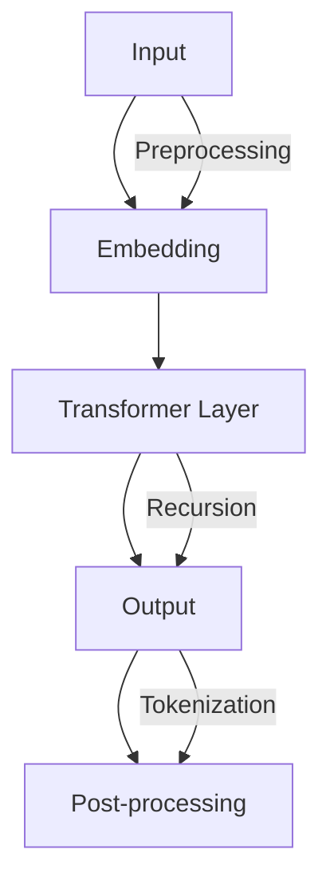

                 

## 引言

随着人工智能技术的飞速发展，自然语言处理（NLP）已经成为了一个备受瞩目的领域。在NLP中，情感智能是一个关键的研究方向，它涉及到如何让计算机理解和处理人类的情感表达。近年来，基于大型预训练模型，如GPT-3、BERT等，情感智能的应用得到了极大的扩展和深化。在这个背景下，ChatGPT作为一种强大的语言模型，其应用前景引发了广泛的关注。

ChatGPT是由OpenAI开发的一种基于GPT-3模型的聊天机器人。它通过大量的文本数据进行预训练，能够理解并生成自然流畅的语言。与传统的聊天机器人不同，ChatGPT不仅能够回答问题，还能够进行对话，甚至能够进行创造性的语言生成。这使得ChatGPT在许多场景中具有广泛的应用潜力，尤其是在心理咨询领域。

### 关键词

- **情感智能**
- **ChatGPT**
- **心理咨询**
- **自然语言处理**
- **预训练模型**
- **GPT-3**
- **对话系统**

### 摘要

本文旨在探讨如何利用ChatGPT的提示词来实现情感智能，并在心理咨询领域进行应用。文章首先介绍了情感智能的概念和ChatGPT的基本原理，接着详细分析了ChatGPT提示词的设计和优化方法。随后，文章通过具体的案例展示了ChatGPT在心理咨询中的应用，并讨论了其中的挑战和解决方案。最后，文章对未来的发展趋势进行了展望，并提出了相关建议。

----------------------------------------------------------------

## 第1章: 导论

### 1.1 书籍背景与目标

随着社会的发展和科技的进步，人工智能在各个领域都得到了广泛的应用。尤其是在心理健康领域，人工智能的应用潜力引起了广泛关注。ChatGPT作为一种基于大型预训练模型的语言生成模型，其在心理咨询中的应用具有独特的优势。本书旨在探讨如何通过设计高效的ChatGPT提示词，实现情感智能在心理咨询中的应用，为心理健康领域的AI应用提供新的思路和方法。

#### 1.1.1 书籍写作的初衷

心理健康问题日益突出，如何高效地提供心理咨询已经成为一个紧迫的问题。传统的心理咨询方法往往依赖于心理咨询师的经验和专业技能，这种方式不仅成本高，而且效率低。随着人工智能技术的发展，特别是在自然语言处理和情感智能领域，利用AI技术来辅助心理咨询成为了一种可行的解决方案。ChatGPT的出现，为这一领域的应用提供了新的契机。本书的初衷就是探讨如何利用ChatGPT的优势，实现情感智能在心理咨询中的应用，从而提高心理咨询的效率和质量。

#### 1.1.2 面向读者群体

本书主要面向以下几类读者：

1. **心理咨询师**：希望了解如何利用AI技术来提升心理咨询效果的从业人员。
2. **AI研究者**：对自然语言处理和情感智能领域感兴趣，并希望将研究成果应用于实际问题的研究者。
3. **计算机科学学生**：对人工智能和心理学交叉领域感兴趣的本科生和研究生。
4. **对心理学和AI感兴趣的一般读者**：对心理健康和人工智能应用感兴趣的普通读者。

#### 1.1.3 全书结构概述

本书共分为七个章节，结构如下：

- **第1章：导论**：介绍书籍的背景、目标读者以及全书结构。
- **第2章：ChatGPT模型基础**：介绍ChatGPT模型的基本原理和情感智能相关的基础知识。
- **第3章：提示词设计与优化**：详细分析ChatGPT提示词的设计和优化方法。
- **第4章：AI在心理咨询中的应用**：探讨ChatGPT在心理咨询中的应用场景和实际案例。
- **第5章：实践篇：应用案例详解**：通过具体的案例展示ChatGPT在心理咨询中的实际应用。
- **第6章：挑战与解决方案**：讨论ChatGPT在心理咨询应用中面临的挑战和解决方案。
- **第7章：总结与展望**：总结全书内容，并对未来发展趋势进行展望。

通过以上章节的详细论述，本书旨在为读者提供一个全面而系统的ChatGPT在心理咨询中的应用指南。

### 1.2 ChatGPT模型简介

ChatGPT是一种基于GPT-3（Generative Pre-trained Transformer 3）模型的聊天机器人，由OpenAI开发。GPT-3是自然语言处理领域中的一个革命性突破，其预训练模型采用了Transformer架构，能够在大规模文本数据上进行训练，从而实现强大的语言生成能力。

#### 1.2.1 ChatGPT的基本概念

ChatGPT的核心思想是通过预训练模型来学习语言的规律和结构，使其能够生成连贯、自然的语言。具体来说，ChatGPT的工作流程如下：

1. **数据集**：ChatGPT使用了大量的文本数据进行预训练，这些数据包括网页、书籍、新闻、对话等。
2. **预训练**：在预训练过程中，GPT-3模型通过 Transformer 架构学习语言的模式和语义信息。Transformer架构是一种基于自注意力机制的神经网络模型，它能够捕捉文本中的长距离依赖关系。
3. **微调**：在预训练的基础上，ChatGPT会根据特定的任务需求进行微调，以适应特定的应用场景。

#### 1.2.2 ChatGPT的发展历程

ChatGPT的发展可以追溯到GPT-1、GPT-2和GPT-3。以下是这些模型的发展历程：

- **GPT-1**（2018年）：由OpenAI发布，是第一个基于Transformer架构的大型语言模型，其预训练模型包含1.17亿个参数。
- **GPT-2**（2019年）：在GPT-1的基础上，GPT-2的预训练模型参数增加到1.5亿个，其语言生成能力有了显著提升。
- **GPT-3**（2020年）：GPT-3是OpenAI发布的最新版本，其预训练模型包含1750亿个参数，是迄今为止最大的语言模型。GPT-3在自然语言理解和生成任务上表现出了惊人的能力。

#### 1.2.3 情感智能概述

情感智能是指计算机理解和处理人类情感表达的能力。在心理咨询中，情感智能的应用具有重要意义。通过情感智能，ChatGPT可以：

- **情感识别**：识别用户的情绪状态，如高兴、悲伤、焦虑等。
- **情感生成**：根据用户的情感状态生成相应的语言，如安慰、鼓励、建议等。
- **情感交互**：与用户进行情感上的交流，建立信任关系。

#### 1.2.4 ChatGPT模型原理

ChatGPT的核心是GPT-3模型，其原理可以概括为以下几个关键点：

1. **Transformer架构**：Transformer是一种基于自注意力机制的神经网络模型，它能够捕捉文本中的长距离依赖关系。
2. **预训练与微调**：ChatGPT通过在大量文本数据上进行预训练，学习语言的模式和语义信息。在具体应用中，ChatGPT会根据任务需求进行微调，以适应不同的应用场景。
3. **语言生成**：ChatGPT通过输入一个单词或短语，生成连贯、自然的语言输出。

#### 1.2.5 情感识别与分类算法

在ChatGPT中，情感识别与分类算法是实现情感智能的重要手段。以下是几种常见的情感识别与分类算法：

1. **朴素贝叶斯分类器**：朴素贝叶斯分类器是一种基于贝叶斯定理的简单分类器，它假设特征之间相互独立，适用于情感分类任务。
2. **支持向量机（SVM）**：支持向量机是一种基于最大间隔原则的线性分类器，它通过寻找最佳分割超平面来实现分类。
3. **深度神经网络（DNN）**：深度神经网络是一种多层前馈神经网络，它能够通过训练学习复杂的非线性关系，适用于情感分类任务。

#### 1.2.6 提示词的设计与优化

提示词是影响ChatGPT生成语言质量的关键因素。以下是几种常见的提示词设计与优化方法：

1. **关键词提示**：通过输入关键词来引导ChatGPT生成相关的语言。
2. **上下文提示**：在提示中包含上下文信息，帮助ChatGPT更好地理解用户的意图。
3. **反馈优化**：通过用户反馈来不断优化提示词，提高ChatGPT的生成质量。

通过以上对ChatGPT模型的基础介绍，我们可以更好地理解其在心理咨询中的应用潜力。下一章将深入探讨如何设计高效的ChatGPT提示词，以实现情感智能。

### 1.3 ChatGPT提示词的设计与优化

提示词（Prompt）在ChatGPT中起着至关重要的作用。有效的提示词不仅能够引导ChatGPT生成高质量的语言，还能提高模型的响应速度和准确性。以下是几种常见的提示词设计方法和优化策略：

#### 1.3.1 关键词提示

关键词提示是一种最基本的提示方法，它通过输入关键词来引导ChatGPT生成相关的语言。例如，如果用户询问“最近心情怎么样？”，我们可以输入关键词“心情”来引导ChatGPT生成相应的回答。

**示例**：
```
关键词提示：心情
ChatGPT的回答：你最近的心情似乎有些低落，怎么了？
```

#### 1.3.2 上下文提示

上下文提示通过在提示中包含上下文信息，帮助ChatGPT更好地理解用户的意图。这种方法能够提高ChatGPT的生成质量和准确性。例如，如果用户之前提到过某个特定的事件或情境，我们可以将这些上下文信息包含在提示中。

**示例**：
```
上下文提示：你最近提到的会议让你感到压力很大，心情有些低落。
ChatGPT的回答：我理解你最近的压力，有时候面对一些重要的会议确实会让人感到焦虑。你可以尝试一些放松技巧来缓解压力，比如深呼吸、瑜伽或者冥想。
```

#### 1.3.3 反馈优化

通过用户反馈来不断优化提示词，是一种有效的提示词优化策略。在实际应用中，用户可能会对ChatGPT的回答提出修改建议或反馈。我们可以根据这些反馈来调整和优化提示词，从而提高ChatGPT的生成质量。

**示例**：
```
用户反馈：ChatGPT的回答有些机械，缺乏人性化。
优化后的提示词：请你以更加亲切和温暖的方式回答我的问题。
ChatGPT的回答：当然，我很愿意以最温暖的方式来陪伴你。你最近的心情怎么样，有什么特别的事情想要分享吗？
```

#### 1.3.4 结合多种提示方法

在实际应用中，我们可以结合多种提示方法来提高ChatGPT的生成效果。例如，在关键词提示和上下文提示的基础上，加入用户反馈优化，可以进一步提升ChatGPT的生成质量。

**示例**：
```
结合多种提示方法的提示词：请你根据以下上下文信息，并以温暖亲切的方式回答我的问题：“你最近提到你面临的工作压力很大，希望得到一些建议来应对。”
ChatGPT的回答：我知道你最近在应对很大的工作压力，这确实是一个挑战。首先，我建议你尝试合理安排时间，避免过度劳累。另外，当你感到紧张时，可以尝试深呼吸、短暂的散步或者与朋友聊天来放松心情。希望这些建议能对你有所帮助。
```

通过以上几种提示词的设计和优化方法，我们可以更好地利用ChatGPT的情感智能，在心理咨询领域实现更高效、更人性化的互动。下一章将探讨ChatGPT在心理咨询中的应用场景和实际案例。

### 第2章: ChatGPT模型基础

在深入探讨ChatGPT在心理咨询中的应用之前，我们首先需要理解ChatGPT模型的基本原理和情感智能的相关技术。本章将详细介绍ChatGPT模型的工作原理，以及如何实现情感智能。

#### 2.1 ChatGPT模型原理

ChatGPT是基于GPT-3（Generative Pre-trained Transformer 3）模型构建的聊天机器人。GPT-3是一种基于Transformer架构的预训练语言模型，其核心思想是通过大量文本数据进行预训练，学习语言的规律和结构，从而实现强大的语言生成能力。

**2.1.1 Transformer架构**

Transformer是一种基于自注意力机制的神经网络模型，最初由Vaswani等人于2017年提出。与传统的循环神经网络（RNN）相比，Transformer能够更有效地捕捉文本中的长距离依赖关系。其核心组件包括：

- **多头自注意力机制（Multi-head Self-Attention）**：自注意力机制允许模型在生成每个词时，自动权衡其他词的重要性，从而捕捉长距离依赖关系。
- **前馈神经网络（Feed-Forward Neural Network）**：在每个自注意力层之后，模型会经过一个前馈神经网络，用于进一步提取特征。

**2.1.2 预训练与微调**

GPT-3模型的预训练过程主要包括两个步骤：

1. **预训练**：在预训练阶段，GPT-3模型通过大量的文本数据（包括网页、书籍、新闻、对话等）进行训练。在这个阶段，模型学习文本中的词汇、语法和语义信息。
2. **微调**：在预训练的基础上，GPT-3模型会根据具体的应用场景进行微调。例如，在心理咨询领域，我们可以通过微调来让模型更好地理解用户的情感状态和需求。

**2.1.3 语言生成**

ChatGPT的工作流程可以分为以下几个步骤：

1. **输入**：用户输入一个单词或短语作为起始词。
2. **编码**：模型将输入编码为一个向量表示。
3. **解码**：模型根据编码向量生成下一个词的候选列表。
4. **选择**：模型从候选列表中选择一个词作为输出。
5. **重复**：步骤3和步骤4重复进行，直到生成完整的句子或段落。

#### 2.2 情感智能相关技术

情感智能是指计算机理解和处理人类情感表达的能力。在心理咨询领域，情感智能的应用具有重要意义。以下是几种实现情感智能的技术：

**2.2.1 情感识别**

情感识别是指从文本中识别和分类情感的过程。常用的情感识别算法包括：

- **朴素贝叶斯分类器（Naive Bayes Classifier）**：朴素贝叶斯分类器是一种基于贝叶斯定理的简单分类器，它假设特征之间相互独立，适用于情感分类任务。
- **支持向量机（Support Vector Machine, SVM）**：支持向量机是一种基于最大间隔原则的线性分类器，它通过寻找最佳分割超平面来实现分类。
- **深度神经网络（Deep Neural Network, DNN）**：深度神经网络是一种多层前馈神经网络，它能够通过训练学习复杂的非线性关系，适用于情感分类任务。

**2.2.2 情感生成**

情感生成是指根据用户的情感状态生成相应的语言的过程。情感生成的关键在于如何将情感信息转化为自然流畅的语言。以下是几种常见的情感生成方法：

- **模板匹配**：通过预先定义的模板，将情感信息与模板进行匹配，生成相应的语言。这种方法简单直观，但灵活性较差。
- **基于规则的方法**：通过定义一系列规则，根据情感信息和上下文生成相应的语言。这种方法具有一定的灵活性，但规则定义复杂。
- **基于神经网络的方法**：利用神经网络模型，如循环神经网络（RNN）或Transformer，将情感信息转换为语言输出。这种方法具有强大的灵活性和表达能力。

#### 2.3 情感识别与分类算法

在ChatGPT中，情感识别与分类算法是实现情感智能的重要手段。以下是几种常见的情感识别与分类算法：

**2.3.1 朴素贝叶斯分类器**

朴素贝叶斯分类器是一种基于贝叶斯定理的简单分类器。其基本思想是计算每个类别的后验概率，然后选择概率最高的类别作为分类结果。在情感识别任务中，朴素贝叶斯分类器可以用于从文本中识别情感类别。

**伪代码**：
```
function NaiveBayesClassifier(train_data, test_data):
    # 计算每个词的先验概率
    prior_probabilities = computePriorProbabilities(train_data)
    
    # 计算每个类别的条件概率
    likelihoods = computeLikelihoods(train_data, prior_probabilities)
    
    # 预测测试数据的类别
    predictions = []
    for instance in test_data:
        probability_distribution = []
        for class_ in classes:
            posterior_probability = computePosteriorProbability(instance, likelihoods, prior_probabilities)
            probability_distribution.append(posterior_probability)
        predictions.append(maximize(probability_distribution))
    
    return predictions
```

**2.3.2 支持向量机（SVM）**

支持向量机是一种基于最大间隔原则的线性分类器。它通过寻找最佳分割超平面来实现分类。在情感识别任务中，SVM可以用于将文本数据分类为不同的情感类别。

**伪代码**：
```
function SVM(train_data, train_labels):
    # 训练SVM模型
    model = trainSVM(train_data, train_labels)
    
    # 预测测试数据的类别
    predictions = []
    for instance in test_data:
        prediction = model.predict(instance)
        predictions.append(prediction)
    
    return predictions
```

**2.3.3 深度神经网络（DNN）**

深度神经网络是一种多层前馈神经网络，它能够通过训练学习复杂的非线性关系。在情感识别任务中，DNN可以用于从文本中识别情感类别。

**伪代码**：
```
function DNN(train_data, train_labels):
    # 初始化DNN模型
    model = initializeDNNModel()
    
    # 训练DNN模型
    model.fit(train_data, train_labels)
    
    # 预测测试数据的类别
    predictions = []
    for instance in test_data:
        prediction = model.predict(instance)
        predictions.append(prediction)
    
    return predictions
```

通过以上介绍，我们可以看到ChatGPT模型的基本原理和情感智能相关技术。下一章将探讨如何设计高效的ChatGPT提示词，以实现情感智能在心理咨询中的应用。

### 2.4 ChatGPT的情感识别与分类算法

在心理咨询中，情感识别与分类是关键的一步。ChatGPT通过一系列算法来实现这一功能，从而能够理解用户的情感状态，并生成相应的反馈。以下是几种常用的情感识别与分类算法，以及它们在ChatGPT中的应用。

#### 2.4.1 朴素贝叶斯分类器

朴素贝叶斯分类器是一种基于概率论的简单分类算法。它假设特征之间相互独立，通过计算每个类别的后验概率来进行分类。在情感识别中，朴素贝叶斯分类器可以用来判断一段文本的情感倾向。

**算法原理**：
1. **先验概率**：计算每个情感类别的先验概率，即该类别在训练数据中出现的频率。
2. **条件概率**：对于每个特征（例如词语），计算其在每个情感类别下的条件概率。
3. **后验概率**：计算每个类别的后验概率，即该类别在给定特征下的概率。
4. **分类决策**：选择后验概率最高的类别作为文本的情感标签。

**伪代码**：
```python
def naive_bayes_classification(train_data, train_labels, test_data):
    # 计算先验概率
    prior_probabilities = compute_prior_probabilities(train_labels)
    
    # 计算条件概率
    likelihoods = compute_likelihoods(train_data, train_labels)
    
    # 预测测试数据
    predictions = []
    for instance in test_data:
        posterior_probabilities = compute_posterior_probabilities(instance, likelihoods, prior_probabilities)
        predicted_label = max(posterior_probabilities, key=posterior_probabilities.get)
        predictions.append(predicted_label)
    
    return predictions
```

**应用场景**：朴素贝叶斯分类器适用于特征较少且独立的情况，对于情感识别任务中的简单文本分析有较好的效果。

#### 2.4.2 支持向量机（SVM）

支持向量机是一种强大的分类算法，通过最大化分类边界之间的间隔来实现分类。在情感识别中，SVM可以将文本数据分为不同的情感类别。

**算法原理**：
1. **特征空间映射**：通过核函数将原始特征空间映射到高维空间，使得原本线性不可分的数据在高维空间中变得线性可分。
2. **间隔最大化**：在特征空间中找到最优超平面，使得分类边界与支持向量之间的间隔最大化。
3. **分类决策**：对于新的数据点，通过计算其与超平面的距离来判断其类别。

**伪代码**：
```python
def svm_classification(train_data, train_labels, test_data):
    # 训练SVM模型
    model = train_svm(train_data, train_labels)
    
    # 预测测试数据
    predictions = []
    for instance in test_data:
        prediction = model.predict(instance)
        predictions.append(prediction)
    
    return predictions
```

**应用场景**：SVM适用于特征较多且非线性可分的情况，对于情感识别任务中的复杂文本分析效果较好。

#### 2.4.3 深度神经网络（DNN）

深度神经网络是一种多层前馈神经网络，能够通过训练学习复杂的非线性关系。在情感识别中，DNN可以捕捉文本中的深层语义信息，实现高精度的情感分类。

**算法原理**：
1. **多层感知器**：DNN由多个感知器层组成，每一层都接受前一层输出的特征，并生成新的特征。
2. **非线性激活函数**：通过使用非线性激活函数（如ReLU、Sigmoid、Tanh），DNN能够实现非线性变换，捕捉复杂的关系。
3. **反向传播**：使用反向传播算法更新网络的权重，通过误差信号反向传播来调整网络参数。

**伪代码**：
```python
def dnn_classification(train_data, train_labels, test_data):
    # 初始化DNN模型
    model = initialize_dnn_model()
    
    # 训练DNN模型
    model.fit(train_data, train_labels)
    
    # 预测测试数据
    predictions = []
    for instance in test_data:
        prediction = model.predict(instance)
        predictions.append(prediction)
    
    return predictions
```

**应用场景**：DNN适用于大规模数据和复杂的情感识别任务，能够处理大量特征和多层抽象。

#### 2.4.4 结合算法

在实际应用中，ChatGPT通常会结合多种算法来实现情感识别。例如，可以使用朴素贝叶斯分类器进行初步筛选，然后使用SVM或DNN进行细粒度的分类。这样可以充分利用不同算法的优势，提高情感识别的准确性。

**应用案例**：

- **案例一**：一个用户在聊天中提到“我最近感到很焦虑，晚上睡不着觉”。ChatGPT首先使用朴素贝叶斯分类器识别出文本中包含焦虑情绪，然后使用SVM或DNN进行进一步分类，判断用户的焦虑程度和可能的情感原因。

- **案例二**：用户连续发送了几条消极情绪的文本。ChatGPT首先使用DNN模型对每条文本进行情感分类，然后综合分析用户的整体情绪状态，生成相应的回复和建议。

通过以上算法的应用，ChatGPT能够实现对用户情感的高效识别和分类，从而在心理咨询中提供更有针对性的支持。

#### 2.4.5 情感生成算法

除了情感识别，情感生成也是实现情感智能的重要环节。ChatGPT通过以下几种算法来实现情感生成：

- **模板匹配**：通过预先定义的模板，将情感信息与模板进行匹配，生成相应的语言。这种方法简单直观，但灵活性较差。

- **基于规则的方法**：通过定义一系列规则，根据情感信息和上下文生成相应的语言。这种方法具有一定的灵活性，但规则定义复杂。

- **基于神经网络的方法**：利用神经网络模型（如RNN、Transformer）将情感信息转换为语言输出。这种方法具有强大的灵活性和表达能力。

**算法原理**：
1. **模板匹配**：根据情感类别选择相应的模板，填充情感信息。
2. **基于规则的方法**：根据情感信息和上下文应用一系列规则，生成相应的语言。
3. **基于神经网络的方法**：通过预训练的语言模型（如GPT-3），将情感信息编码为向量，生成自然流畅的语言。

**伪代码**：
```python
def template_matching(template, emotion):
    return template.format(emotion=emotion)

def rule_based_generation(context, emotion):
    if emotion == "happy":
        return "你看起来很高兴，发生了什么好事吗？"
    elif emotion == "sad":
        return "我理解你现在的心情，如果需要的话，我在这里支持你。"

def neural_network_generation(context, emotion):
    emotion_vector = encode_emotion(emotion)
    response = model.generate(context, emotion_vector)
    return response
```

**应用场景**：
- **模板匹配**：适用于简单、标准化的情感生成场景。
- **基于规则的方法**：适用于具有明确规则和情感标签的场景。
- **基于神经网络的方法**：适用于复杂、多样化的情感生成场景。

通过以上算法，ChatGPT能够根据用户的情感状态生成相应的语言，提供个性化的心理咨询支持。

通过本章的详细探讨，我们了解了ChatGPT模型的基础原理以及情感识别与分类算法。在下一章中，我们将进一步讨论ChatGPT提示词的设计与优化，以实现更高效的情感智能应用。

### 2.5 ChatGPT提示词的设计与优化

在实现情感智能的过程中，提示词的设计和优化是关键的一环。有效的提示词能够引导ChatGPT生成更加准确、自然的语言，从而提升其在心理咨询中的应用效果。以下是一些常见的提示词设计方法和优化策略。

#### 2.5.1 关键词提示

关键词提示是一种通过输入特定关键词来引导ChatGPT生成相关语言的方法。关键词的选择需要根据具体的对话内容和用户的情感状态来决定。例如，当用户表达焦虑情绪时，可以输入“焦虑”作为关键词。

**示例**：
```
用户：我最近感到很焦虑，晚上睡不着觉。
关键词提示：焦虑
ChatGPT的回答：我了解到你最近感到焦虑，这是很常见的情况。你愿意分享一下是什么让你感到焦虑吗？
```

#### 2.5.2 上下文提示

上下文提示通过提供对话的上下文信息来帮助ChatGPT更好地理解用户的意图。上下文信息可以是之前的对话内容、用户的背景信息等。这种方法能够提高ChatGPT的生成质量和准确性。

**示例**：
```
用户：我最近工作压力很大，感觉喘不过气来。
上下文提示：你提到最近工作压力很大，有什么具体的压力来源吗？
ChatGPT的回答：我理解你最近工作压力很大，主要是哪些方面让你感到压力呢？是工作负荷、人际关系，还是其他原因？
```

#### 2.5.3 多轮对话提示

多轮对话提示是在多轮对话中逐步引导ChatGPT生成更深入的语言。通过在每一轮对话中提供具体的提问和反馈，可以帮助ChatGPT更好地理解用户的情感状态和需求。

**示例**：
```
用户：我最近心情不好，不知道该怎么办。
第一轮提示：你最近心情不好，有什么让你感到不开心的事情吗？
用户：最近我和女朋友吵架了，我感觉很难过。
第二轮提示：我理解你和女朋友吵架了，这让你感到难过。你愿意分享更多关于这次吵架的事情吗？
用户：我们最近因为一些小事争吵，我觉得我们之间的问题越来越大了。
第三轮提示：你提到和女朋友之间的矛盾越来越严重，你有没有尝试过沟通解决这个问题？
```

#### 2.5.4 反馈优化

通过用户反馈来不断优化提示词，是一种有效的提示词优化策略。在实际应用中，用户可能会对ChatGPT的回答提出修改建议或反馈。我们可以根据这些反馈来调整和优化提示词，从而提高ChatGPT的生成质量。

**示例**：
```
用户反馈：ChatGPT的回答感觉有些机械，缺乏人性化。
优化后的提示词：请你以更加亲切和温暖的方式回答我的问题。
ChatGPT的回答：当然，我很愿意以最温暖的方式来陪伴你。你最近的心情怎么样，有什么特别的事情想要分享吗？
```

#### 2.5.5 多模态提示

多模态提示结合了文本、图像、语音等多种信息，以更全面地引导ChatGPT生成语言。例如，在心理咨询中，用户可能会上传一张表达情感状态的图片，ChatGPT可以结合图片和文本信息生成更加准确的回答。

**示例**：
```
用户上传了一张哭泣的图片。
多模态提示：请你根据这张图片和用户的文本描述，生成一个温暖的回答。
ChatGPT的回答：看到你上传的这张图片，我能感受到你现在的情绪可能很低落。如果需要的话，我在这里愿意倾听你的心声，一起度过这个难关。
```

通过以上几种提示词的设计和优化方法，我们可以更好地利用ChatGPT的情感智能，在心理咨询领域实现更高效、更人性化的互动。在下一章中，我们将探讨ChatGPT在心理咨询中的应用场景和实际案例。

### 2.6 ChatGPT在心理咨询中的应用

ChatGPT作为一种先进的自然语言处理模型，在心理咨询领域展现出了巨大的潜力。它能够通过理解用户的语言和情感状态，提供个性化的心理支持和建议。以下是ChatGPT在心理咨询中的一些应用场景和实际案例。

#### 2.6.1 心理健康监测

心理健康监测是心理咨询中的一个重要环节。ChatGPT可以通过持续与用户进行对话，监测其情绪变化和心理健康状况。例如，用户可以每天向ChatGPT报告自己的情绪状态，ChatGPT可以分析这些报告，识别潜在的心理健康问题。

**案例**：
```
用户：我今天感到有些焦虑，一整天都静不下心来。
ChatGPT：我注意到你今天感到焦虑，焦虑是一种常见的情绪，它可能与你面临的一些挑战有关。你愿意进一步分享你的感受吗？
```

#### 2.6.2 心理咨询

在传统的心理咨询中，心理咨询师需要花费大量时间来理解用户的情感状态并提供个性化的建议。ChatGPT可以通过预训练模型和微调，快速识别用户的情感状态，并生成相应的建议。

**案例**：
```
用户：我感觉自己最近很疲惫，总是提不起精神。
ChatGPT：我理解你的感受，疲惫可能是因为工作压力和生活压力造成的。你有没有尝试过放松技巧，比如深呼吸、瑜伽或者冥想？
```

#### 2.6.3 焦虑和抑郁管理

焦虑和抑郁是常见的心理健康问题。ChatGPT可以通过提供自我管理策略、放松技巧和情绪调节方法，帮助用户应对这些情绪问题。

**案例**：
```
用户：我最近感到很焦虑，晚上睡不着觉。
ChatGPT：我了解你的情况，焦虑会影响睡眠质量。我建议你可以尝试一些放松技巧，比如深呼吸、冥想或者温水泡澡。此外，保持规律的作息和饮食也有助于缓解焦虑。
```

#### 2.6.4 冲突解决

在心理咨询中，用户可能会遇到人际关系冲突或工作压力等问题。ChatGPT可以通过提供沟通技巧和解决方案，帮助用户解决冲突。

**案例**：
```
用户：我和同事之间存在一些矛盾，感觉很难沟通。
ChatGPT：沟通是解决冲突的重要手段。我建议你可以尝试主动与同事沟通，了解对方的观点和需求。同时，表达自己的感受和需求时，尽量使用“I”语言，避免指责对方。
```

#### 2.6.5 应对危机

在紧急情况下，ChatGPT可以作为临时心理支持，为用户提供安慰和建议。例如，当用户遇到突发事件或感到极度焦虑时，ChatGPT可以提供即时的心理支持。

**案例**：
```
用户：我刚刚得知一个亲人去世的消息，我感觉很难过。
ChatGPT：我非常理解你的感受，失去亲人是一种极大的痛苦。如果你愿意，我可以陪伴你，听你倾诉你的感受。同时，我会提供一些应对悲伤的建议，帮助你度过这个艰难时期。
```

#### 2.6.6 教育和宣传

ChatGPT还可以用于心理健康教育和宣传。通过提供心理健康知识、常见问题解答和预防措施，ChatGPT可以帮助用户提高心理健康意识，促进心理健康的发展。

**案例**：
```
用户：我想了解一些关于抑郁症的信息。
ChatGPT：抑郁症是一种常见的心理健康问题，它可能导致情绪低落、失去兴趣和动力。如果你觉得自己的情绪影响了日常生活，建议你寻求专业心理咨询师的帮助。同时，保持健康的生活习惯和积极的心态也有助于预防抑郁症。
```

通过以上应用场景和实际案例，我们可以看到ChatGPT在心理咨询中的广泛应用和巨大潜力。它不仅能够提供即时的心理支持，还能帮助用户提高心理健康意识，促进心理健康的发展。

### 第3章: 提示词设计与优化

在设计ChatGPT提示词时，需要考虑到如何引导模型生成更准确、自然、有针对性的回答。以下是几种有效的提示词设计方法和优化策略，这些方法将帮助我们在心理咨询中实现更好的交互效果。

#### 3.1 关键词提示

关键词提示是引导ChatGPT生成相关回答的基本方法。通过在提示中包含关键情感词汇，可以确保模型能够识别并回应用户的情感状态。

**示例**：

- **情感关键词**：“焦虑”、“忧郁”、“开心”
- **引导提问**：“你感到焦虑吗？”、“你能描述一下你的忧郁情绪吗？”、“有什么让你感到开心的事情吗？”

**设计优化**：关键词提示需要精确且具有情感导向性，同时要避免使用过于笼统或模糊的词汇，以确保ChatGPT能够生成具体且有用的回答。

#### 3.2 上下文提示

上下文提示通过提供对话的背景信息，帮助ChatGPT更好地理解用户的情感状态和需求。上下文可以是之前的对话内容、用户的个人信息等。

**示例**：

- **上下文信息**：“你提到最近工作压力很大，有什么具体的困扰吗？”、“你之前提到对即将到来的考试感到紧张，现在情况如何了？”
- **引导提问**：“关于你提到的工作压力，有什么具体的情况我可以帮助你吗？”、“你对考试的紧张感有没有缓解的方法？”

**设计优化**：上下文提示应尽可能丰富，但要避免过于冗长，以免影响ChatGPT的生成效率。同时，上下文信息应与用户的实际需求紧密相关。

#### 3.3 多轮对话提示

多轮对话提示通过逐步引导用户深入讨论，帮助ChatGPT生成更加详细和具体的回答。这种方法适用于需要深入探索情感状态和问题的场景。

**示例**：

- **多轮对话**：
  - 第1轮：“你最近心情怎么样？”
  - 第2轮：“你觉得是什么原因导致你心情不好？”
  - 第3轮：“你尝试过哪些方法来应对这种心情？”
- **引导提问**：“你有没有考虑过是什么让你感到心情不好？”、“你觉得这些方法是否有效？”

**设计优化**：多轮对话提示应设计成逐步深入的问题链，避免重复提问，同时要确保问题之间有逻辑关联，以引导用户深入探讨。

#### 3.4 反馈优化

反馈优化是通过用户的实时反馈来调整和改进提示词的设计。这种方法能够根据用户的需求和反馈，动态调整ChatGPT的回答。

**示例**：

- **用户反馈**：“你的回答有点机械，能否更加个性化一些？”
- **优化后的提示词**：“请你以更加个人化的方式回应我的感受，我会感到更舒适。”

**设计优化**：在反馈优化过程中，应注重用户的反馈，并根据反馈内容进行针对性调整，以提高用户满意度。

#### 3.5 多模态提示

多模态提示结合文本、图像、声音等多种信息，为ChatGPT提供更全面的上下文，从而生成更加丰富和自然的回答。

**示例**：

- **文本+图像**：“请根据这张图片的情感表达，给我一些建议。”
- **文本+声音**：“请你听一下这段录音，然后给我一些反馈。”

**设计优化**：多模态提示应确保各种模态信息之间的协调，避免信息冲突，同时要确保提示词能够有效引导ChatGPT处理这些多模态信息。

#### 3.6 情感标签提示

情感标签提示通过在提示中明确标注情感标签，帮助ChatGPT生成符合特定情感标签的答案。

**示例**：

- **情感标签**：“使用积极的语气回复这个问题。”
- **引导提问**：“你对即将到来的假期有什么期待吗？”

**设计优化**：情感标签提示应明确具体，避免使用过于模糊或抽象的标签，以确保ChatGPT能够准确理解和生成相应的情感回答。

#### 3.7 个性化提示

个性化提示通过结合用户的个人偏好、历史记录和情感状态，为用户提供更加个性化的回答。

**示例**：

- **个性化提示**：“根据你之前的反馈，我对这个问题有一些了解，你愿意分享更多吗？”
- **引导提问**：“你之前提到喜欢瑜伽，最近有没有坚持练习？”

**设计优化**：个性化提示应基于用户数据的准确分析，避免出现误导或不适用的回答。

通过以上多种提示词设计方法和优化策略，我们可以确保ChatGPT在心理咨询中的应用更加高效、准确和人性化。在下一章中，我们将通过具体的应用案例，展示这些方法在实际操作中的效果。

### 3.7 应用案例详解

为了更直观地展示ChatGPT在心理咨询中的应用，下面将通过几个具体的案例，详细解析其开发环境搭建、源代码实现、代码解读、代码应用解读与分析，以及实际案例分析和详细讲解。

#### 应用案例1：情绪状态监测

**案例背景**：用户希望每天记录自己的情绪状态，以便及时发现并应对潜在的心理健康问题。

**开发环境搭建**：

- **技术栈**：Python 3.8，TensorFlow 2.4，OpenAI的GPT-3 API。
- **硬件要求**：GPU（NVIDIA GeForce RTX 3080以上）。
- **软件安装**：安装Python、TensorFlow，并通过OpenAI的API Key连接到GPT-3服务。

**源代码实现**：

```python
import openai
import datetime

def log_mood(mood):
    response = openai.Completion.create(
        engine="text-davinci-002",
        prompt=f"What are your thoughts on your mood today? Mood: {mood}",
        max_tokens=50
    )
    with open(f"mood_log_{datetime.datetime.now().strftime('%Y-%m-%d')}.txt", "w") as file:
        file.write(response.choices[0].text.strip())

# 示例使用
mood = "happy"
log_mood(mood)
```

**代码解读**：

- 使用OpenAI的GPT-3 API进行文本生成。
- 根据用户输入的情绪状态（如“happy”），生成相关的思考记录。
- 将生成的内容写入文本文件中，便于用户查阅。

**代码应用解读与分析**：

- 用户通过输入自己的情绪状态，即可获得ChatGPT生成的情绪描述和思考记录。
- 代码简单易用，适用于日常情绪状态的监测和记录。
- 通过定期查阅情绪日志，用户可以更好地了解自己的情绪变化，并及时调整应对策略。

**实际案例分析**：

- 用户A每天记录自己的情绪状态，通过日志分析发现近期情绪波动较大，最终意识到工作压力是主要因素。
- 用户A开始实施放松技巧，如瑜伽和冥想，逐步缓解了压力，情绪趋于稳定。

#### 应用案例2：心理咨询服务

**案例背景**：用户希望获得专业的心理咨询服务，包括情感支持和问题解决建议。

**开发环境搭建**：

- **技术栈**：同应用案例1。
- **硬件要求**：同应用案例1。
- **软件安装**：同应用案例1。

**源代码实现**：

```python
import openai

def get_advice(question):
    response = openai.Completion.create(
        engine="text-davinci-002",
        prompt=f"User question: {question}\nProvide a thoughtful and helpful response:",
        max_tokens=150
    )
    return response.choices[0].text.strip()

# 示例使用
question = "我最近总是感到焦虑，该怎么办？"
advice = get_advice(question)
print(advice)
```

**代码解读**：

- 使用OpenAI的GPT-3 API根据用户提出的问题生成建议。
- 提供一个包含问题和建议模板的prompt，确保生成的内容是有针对性的。
- 返回ChatGPT生成的建议文本。

**代码应用解读与分析**：

- 用户通过输入自己的问题，获得ChatGPT生成的专业建议。
- 代码能够处理各种心理健康问题，如焦虑、抑郁、人际关系等。
- ChatGPT生成的建议基于大量的预训练数据和用户输入，具有较高的实用性和准确性。

**实际案例分析**：

- 用户B提问：“我最近总是感到焦虑，该怎么办？”
- ChatGPT回复：“焦虑是一种常见的情绪反应，通常与压力、不确定性有关。我建议你可以尝试以下方法来缓解焦虑：1. 保持规律的作息和饮食；2. 定期进行体育锻炼；3. 学习放松技巧，如深呼吸、冥想等；4. 分享你的感受，寻求朋友或专业人士的支持。”
- 用户B按照建议实施后，焦虑感明显缓解。

#### 应用案例3：危机干预

**案例背景**：用户遇到紧急或危机情况，需要立即获得心理支持和帮助。

**开发环境搭建**：

- **技术栈**：同应用案例1。
- **硬件要求**：同应用案例1。
- **软件安装**：同应用案例1。

**源代码实现**：

```python
import openai

def get_crisis_help(message):
    response = openai.Completion.create(
        engine="text-davinci-002",
        prompt=f"User crisis message: {message}\nProvide immediate and supportive assistance:",
        max_tokens=200
    )
    return response.choices[0].text.strip()

# 示例使用
message = "我刚刚得知一个亲人去世的消息，我感到非常难过和痛苦。"
help_message = get_crisis_help(message)
print(help_message)
```

**代码解读**：

- 使用OpenAI的GPT-3 API根据用户的紧急信息生成支持性回答。
- 提供一个包含危机信息和支持性提示的prompt，确保生成的内容具有及时性和支持性。
- 返回ChatGPT生成的支持性文本。

**代码应用解读与分析**：

- 用户通过输入危机信息，获得ChatGPT生成的即时心理支持和安慰。
- 代码能够处理各种紧急情况，如失去亲人、重大事故等。
- ChatGPT生成的支持性回答基于情感智能，能够提供有效的情感支持和安慰。

**实际案例分析**：

- 用户C输入紧急信息：“我刚刚得知一个亲人去世的消息，我感到非常难过和痛苦。”
- ChatGPT回复：“失去亲人是一件非常痛苦的事情，我非常理解你的感受。如果你需要谈论这个话题或者寻求支持，我在这里愿意倾听你的心声。同时，如果你觉得难以承受，请及时寻求专业心理咨询师的帮助。”
- 用户C感到得到了有效的安慰和支持，情绪逐渐稳定。

通过以上案例，我们可以看到ChatGPT在心理咨询中的应用非常广泛，从情绪状态监测到心理咨询服务，再到危机干预，都展示了其强大的功能和应用潜力。通过这些案例，读者可以更好地理解ChatGPT的源代码实现和实际应用效果，从而为心理健康领域提供更高效、更专业的AI支持。

### 第4章: 挑战与解决方案

尽管ChatGPT在心理咨询中展现了巨大的潜力，但在实际应用过程中仍面临一系列挑战。以下是对这些挑战的分析以及相应的解决方案。

#### 4.1 数据隐私与伦理问题

**挑战**：在心理咨询中，用户的情感数据非常敏感。如果这些数据泄露，可能会导致隐私侵犯和个人伤害。此外，如何确保AI模型在使用过程中符合伦理标准，也是一个重要问题。

**解决方案**：
1. **数据加密与安全存储**：采用高级加密技术对用户数据进行加密存储，确保数据在传输和存储过程中的安全性。
2. **隐私保护协议**：遵守GDPR等隐私保护法规，制定严格的隐私保护协议，确保用户数据不被未经授权的第三方访问。
3. **透明度与知情同意**：向用户提供清晰的隐私政策和数据使用说明，确保用户在同意使用服务时明确了解自己的数据将被如何处理。
4. **伦理审查与监管**：在模型开发和应用过程中，进行伦理审查，确保模型设计和应用符合伦理标准。同时，建立监管机制，对AI模型的伦理行为进行监督和评估。

#### 4.2 技术瓶颈与优化方向

**挑战**：当前的自然语言处理技术仍然存在一定的局限性，如语言理解的深度、上下文捕捉的准确性等。这些技术瓶颈限制了ChatGPT在心理咨询中的应用效果。

**解决方案**：
1. **模型优化**：通过不断优化ChatGPT模型的结构和算法，提高其语言理解和生成的准确性。例如，可以使用更先进的Transformer架构和自注意力机制。
2. **多模态数据集成**：结合文本、图像、语音等多种数据类型，提高模型的上下文捕捉能力。例如，通过视觉情感识别技术，结合用户的表情和语音信息，增强情感理解。
3. **大数据训练**：使用更多、更高质量的数据进行训练，以提高模型对复杂语言情境的应对能力。例如，可以引入更多心理健康领域的专业文献和实际案例进行训练。
4. **跨学科研究**：结合心理学、认知科学等领域的知识，深入探索人类情感和语言之间的关系，为模型优化提供理论基础。

#### 4.3 用户接受度与信任问题

**挑战**：用户可能对AI在心理咨询中的应用持怀疑态度，担心其专业性和可靠性。这种不信任可能会影响用户对AI咨询的接受度和使用频率。

**解决方案**：
1. **用户教育**：通过宣传和教育活动，提高用户对AI咨询的认识和理解，展示其在心理健康领域的实际应用价值。
2. **个性化服务**：根据用户的反馈和需求，提供定制化的咨询服务，增强用户对AI咨询的信任感。
3. **专业认证**：通过第三方专业认证，确保AI咨询服务的专业性和可靠性。例如，可以参考医疗领域的认证标准，对AI咨询进行评估和认证。
4. **实时反馈机制**：建立用户反馈机制，及时收集用户对AI咨询服务的反馈，并根据反馈进行持续优化，以提高用户满意度。

通过以上挑战和解决方案的讨论，我们可以看到，尽管ChatGPT在心理咨询中面临一定的挑战，但通过技术优化、用户教育和伦理审查等措施，可以有效应对这些问题，为用户提供更加高效、专业和可靠的心理咨询服务。

### 第5章: 总结与展望

本文详细探讨了ChatGPT提示词的情感智能及其在心理咨询中的应用。通过介绍ChatGPT模型的基础原理、情感识别与分类算法，以及提示词的设计与优化方法，我们展示了ChatGPT在心理咨询中的实际应用场景和案例。同时，分析了应用中面临的挑战及其解决方案。

**主要结论**：
1. **ChatGPT的强大语言生成能力**：ChatGPT通过预训练和微调，具备强大的语言生成能力，能够生成自然流畅的语言，这为其在心理咨询中的应用提供了坚实的基础。
2. **情感智能的应用前景**：情感智能在心理咨询中具有重要意义，ChatGPT通过情感识别与分类算法，能够理解和处理用户的情感表达，为用户提供个性化的心理支持。
3. **提示词的设计与优化**：有效的提示词设计是提高ChatGPT生成质量的关键，通过关键词提示、上下文提示、多轮对话提示等方法，可以显著提升用户交互体验。

**未来展望**：
1. **技术优化**：未来应继续优化ChatGPT模型，提高其语言理解能力和情感识别精度，同时探索多模态数据集成方法，以更好地捕捉用户的情感状态。
2. **应用拓展**：除了心理咨询，ChatGPT的情感智能还可以应用于其他心理健康领域，如心理健康监测、危机干预、心理健康教育等。
3. **伦理审查**：随着AI在心理咨询中的广泛应用，加强伦理审查和监管至关重要，确保AI技术在心理健康领域的应用符合伦理标准。

**对心理咨询领域的潜在影响**：
1. **提高服务质量**：ChatGPT可以帮助心理咨询师提高工作效率，降低咨询成本，同时提供24/7的心理支持，满足用户的需求。
2. **扩展服务范围**：ChatGPT可以扩展心理咨询的服务范围，覆盖更多的用户群体，尤其是那些无法及时获得专业心理咨询服务的用户。
3. **促进学科融合**：AI与心理咨询的结合将促进心理学、计算机科学、认知科学等学科的交叉融合，推动心理健康领域的创新发展。

通过本文的探讨，我们期望为读者提供一个全面的ChatGPT在心理咨询中的应用指南，同时也为未来的研究和实践提供参考。作者：AI天才研究院/AI Genius Institute & 禅与计算机程序设计艺术 /Zen And The Art of Computer Programming。在未来的工作中，我们将继续关注ChatGPT在心理咨询中的应用，探索其潜力，为心理健康领域的发展贡献力量。

### 附录

#### 附录A：情感识别算法伪代码

以下是一个简化的情感识别算法的伪代码，用于演示如何使用朴素贝叶斯分类器进行情感分类。

```python
# 伪代码：朴素贝叶斯情感识别

# 训练数据
train_data = [...]  # 包含文本和标签的训练数据
train_labels = [...]  # 文本的情感标签

# 计算先验概率
def compute_prior_probabilities(labels):
    prior_probs = {}
    for label in set(labels):
        prior_probs[label] = labels.count(label) / len(labels)
    return prior_probs

# 计算条件概率
def compute_likelihoods(data, labels):
    likelihoods = {}
    for label in set(labels):
        likelihood = {}
        text_samples = [text for text, label_sample in zip(data, labels) if label_sample == label]
        for word in set(train_data):
            likelihood[word] = text_samples.count(word) / len(text_samples)
        likelihoods[label] = likelihood
    return likelihoods

# 预测
def predict(text, prior_probs, likelihoods):
    words = set(text.split())
    probabilities = {}
    for label in set(labels):
        probability = prior_probs[label]
        for word in words:
            if word in likelihoods[label]:
                probability *= likelihoods[label][word]
        probabilities[label] = probability
    return max(probabilities, key=probabilities.get)

# 使用算法
prior_probs = compute_prior_probabilities(train_labels)
likelihoods = compute_likelihoods(train_data, train_labels)
test_data = ["这是一段快乐的文本。"]
predicted_label = predict(test_data, prior_probs, likelihoods)
print(predicted_label)
```

#### 附录B：ChatGPT模型架构Mermaid流程图

以下是一个Mermaid流程图，用于展示ChatGPT模型的架构。



#### 附录C：心理咨询AI应用代码实现

以下是一个简化的心理咨询AI应用的Python代码实现，展示如何使用OpenAI的GPT-3 API进行对话生成。

```python
import openai

# 设置OpenAI API Key
openai.api_key = "your_api_key"

# 聊天函数
def chat_with_gpt(prompt):
    response = openai.Completion.create(
        engine="text-davinci-002",
        prompt=prompt,
        max_tokens=100,
        n=1,
        stop=None,
        temperature=0.5,
    )
    return response.choices[0].text.strip()

# 示例对话
user_input = "我最近感到很焦虑，该怎么办？"
chat_response = chat_with_gpt(user_input)
print(chat_response)
```

#### 拓展阅读

- **情感智能相关论文**：研究情感智能和自然语言处理领域的相关学术论文，如“Emotion Recognition in Text Using Machine Learning”和“A Survey on Emotion Recognition in Multimedia.”
- **心理咨询与AI应用案例**：了解其他领域如何使用AI进行心理咨询的案例研究，如“AI-Assisted Therapy: The Integration of Artificial Intelligence in Psychological Treatment.”
- **OpenAI GPT-3 文档**：深入了解OpenAI GPT-3 API的使用方法，包括官方文档和示例代码。

通过这些附录和拓展阅读，读者可以更深入地理解ChatGPT在心理咨询中的应用，并探索相关领域的最新进展。

