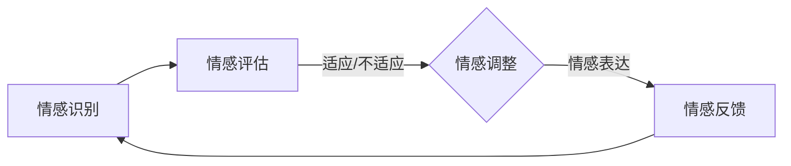

                 

### 1.1. AI在心理健康管理中的应用背景

心理健康问题在全球范围内愈发严重，尤其是随着现代社会生活节奏的加快和压力的增大，心理健康问题已经成为了影响人们生活质量的重要因素。根据世界卫生组织（WHO）的数据，全球约有三分之一的人口在一生中某个阶段会遭受心理健康问题的困扰，其中包括抑郁症、焦虑症、压力过大等。面对如此庞大的心理健康问题群体，传统的心理健康服务已经显得捉襟见肘。

首先，让我们来看一下心理健康问题的现状与挑战。心理健康问题的症状多样，包括情绪低落、焦虑、失眠、自卑感等。这些问题不仅严重影响了患者的生活质量，也给家庭和社会带来了沉重的负担。传统的心理健康服务主要依赖于心理医生和心理咨询师，但这样的服务存在以下不足：

- **服务供给不足**：心理医生和心理咨询师的供给相对有限，尤其是在偏远和经济落后的地区，心理健康服务的覆盖率非常低。
- **成本高昂**：心理咨询和治疗的费用通常较高，对于经济条件较差的患者来说，难以承受这样的费用。
- **服务效率低**：传统的心理健康服务往往需要长时间的面对面交流，服务效率较低，难以满足大量患者的需求。

与此同时，人工智能（AI）技术的快速发展为心理健康管理带来了新的机遇。AI技术在数据采集、数据分析、智能诊断和个性化治疗等方面具有显著优势，可以有效地解决传统心理健康服务的不足。具体来说，AI在心理健康领域的优势主要体现在以下几个方面：

- **数据处理能力**：AI能够快速处理和分析大量的心理健康数据，从而帮助医生和咨询师更好地了解患者的病情。
- **个性化治疗方案**：通过分析患者的数据，AI可以提供个性化的心理健康治疗方案，提高治疗的效果。
- **无时无刻的实时支持**：AI系统可以24小时在线，为患者提供实时支持和咨询服务，满足患者随时随地的需求。

ChatGPT作为一种基于人工智能的语言生成模型，具有强大的情感识别和理解能力，可以与患者进行自然语言交互，提供情感支持和心理健康管理服务。因此，将ChatGPT应用于心理健康管理具有重要的研究价值和实际应用潜力。

总之，AI在心理健康管理中的应用背景主要源于现代社会心理健康问题的日益严重和传统心理健康服务的不足。AI技术的加入，不仅能够提高心理健康服务的效率和质量，还能够为患者提供更加个性化和持续性的心理健康支持。接下来的章节中，我们将进一步探讨ChatGPT的基本原理与架构，以及其在心理健康管理中的应用。

---

#### 1.2. ChatGPT的基本原理与架构

ChatGPT是一种基于人工智能的语言生成模型，其核心思想是通过训练大量的文本数据，使其能够理解和生成自然语言。本节将详细讲解ChatGPT的基本原理与架构，帮助读者更好地理解这个模型的工作方式。

##### 1.2.1 ChatGPT的生成模型

ChatGPT采用的是Transformer模型，这是一种基于自注意力机制的深度神经网络模型。Transformer模型由编码器（Encoder）和解码器（Decoder）两部分组成，分别负责处理输入文本和生成输出文本。

- **编码器（Encoder）**：编码器的任务是处理输入的文本序列，将其转换为固定长度的编码表示。编码器内部由多个编码层（Encoder Layer）组成，每层包含多个自注意力模块（Self-Attention Mechanism）和前馈神经网络（Feedforward Neural Network）。

  自注意力模块的核心思想是，每个词的表示不仅依赖于自身的特征，还依赖于文本中其他词的特征。通过计算自注意力权重，编码器能够自动学习到文本中不同词之间的关系，从而生成更加丰富的编码表示。

  前馈神经网络则用于对编码器中间层进行进一步的非线性变换，增强模型的表示能力。

- **解码器（Decoder）**：解码器的任务是生成输出文本序列。解码器同样由多个解码层（Decoder Layer）组成，每层包含多个自注意力模块（Self-Attention Mechanism）和编码器-解码器注意力模块（Encoder-Decoder Attention Mechanism）。

  自注意力模块用于计算解码器中当前词与之前生成的词之间的依赖关系，编码器-解码器注意力模块则用于计算解码器中当前词与编码器生成的编码表示之间的依赖关系。

  通过这种方式，解码器能够逐步生成输出文本序列，每一步都依赖于之前的生成结果，从而生成连贯、自然的文本。

##### 1.2.2 ChatGPT的训练与优化

ChatGPT的训练过程主要包括数据预处理、模型训练和优化三个阶段。

- **数据预处理**：ChatGPT的训练数据通常来自于互联网上的大量文本，包括书籍、新闻、社交媒体帖子等。在预处理阶段，需要对文本进行清洗、分词、去停用词等操作，以便于模型更好地理解和处理文本。

- **模型训练**：在训练过程中，模型会通过反向传播算法（Backpropagation Algorithm）不断调整参数，以最小化损失函数（Loss Function）。常用的损失函数包括交叉熵损失（Cross-Entropy Loss）和均方误差损失（Mean Squared Error Loss）。

  在训练过程中，模型会首先预测输出文本的下一个词，然后与实际输出词进行比较，计算预测误差。通过反向传播算法，模型能够更新参数，使得预测结果逐步逼近实际输出。

- **优化算法**：为了提高模型的训练效率和收敛速度，通常会采用一些优化算法，如Adam优化器（Adam Optimizer）。Adam优化器结合了Adagrad和RMSProp算法的优点，能够自适应地调整学习率，从而提高模型的收敛速度。

##### 1.2.3 ChatGPT的情感识别与理解

ChatGPT的情感识别与理解能力是其应用于心理健康管理的关键。ChatGPT通过以下几种方式实现情感识别与理解：

- **情感词嵌入（Sentiment Word Embedding）**：ChatGPT将文本中的每个词映射到一个高维向量空间中，其中情感词（如“快乐”、“悲伤”、“愤怒”）会被映射到特定的区域。通过计算文本中情感词的向量表示，可以初步判断文本的情感倾向。

- **情感分类（Sentiment Classification）**：ChatGPT可以通过训练一个分类模型（如朴素贝叶斯分类器、支持向量机等），将文本分类为正面、负面或中性情感。分类模型通过学习文本中的特征，能够识别出情感词和情感短语，从而实现情感分类。

- **情感理解（Sentiment Understanding）**：ChatGPT通过上下文理解情感词和情感短语的含义。例如，在句子“我今天很开心”中，“开心”一词的情感含义取决于整个句子的上下文。ChatGPT能够理解这种上下文关系，从而准确地识别和理解情感。

综上所述，ChatGPT的基本原理与架构使其能够生成自然、连贯的文本，并通过情感识别与理解能力，应用于心理健康管理。在接下来的章节中，我们将进一步探讨ChatGPT中的提示词设计原则及其在情感调节中的应用。

---

#### 1.3. 提示词在ChatGPT中的应用

提示词（Prompt）是ChatGPT模型中的一个重要概念，它用于引导模型的生成过程，使其生成符合预期结果的文本。本节将详细讨论提示词的作用、分类、设计原则以及其在情感调节中的应用。

##### 1.3.1 提示词的作用与分类

提示词在ChatGPT中的作用主要体现在以下几个方面：

- **引导生成方向**：通过给出提示词，用户可以明确告诉模型需要生成的内容类型，例如问题、回答、对话等。
- **增强生成质量**：合适的提示词可以引导模型生成更高质量、更符合实际需求的文本。
- **提高生成效率**：提示词可以帮助模型快速定位生成内容，从而提高生成效率。

根据用途的不同，提示词可以分为以下几类：

- **通用提示词**：这类提示词适用于各种场景，如“请回答以下问题：”、“你能告诉我关于XX的信息吗？”等。
- **情感引导提示词**：这类提示词用于引导模型生成具有特定情感的文本，如“用快乐的语气回答这个问题：”、“描述一下你感到悲伤的时候。”
- **情景设定提示词**：这类提示词用于设定一个具体的情境，引导模型在这个情境下生成文本，如“假设你是一名心理医生，回答以下问题：”、“想象一下你在一个美丽的海滩上。”
- **领域特定提示词**：这类提示词用于特定领域，如“请用法律术语回答以下问题：”、“请用医学专业术语解释一下。”
  
##### 1.3.2 提示词的设计原则

为了使提示词能够有效地引导ChatGPT生成符合预期结果的文本，设计提示词时需要遵循以下原则：

- **清晰性**：提示词需要清晰明确，避免歧义，确保模型能够准确理解用户的意图。
- **创造性**：提示词应具有创造性，能够激发模型生成新颖、有创意的文本。
- **适用性**：提示词应具有广泛的适用性，能够在不同场景下有效引导模型生成文本。
- **情感导向**：对于情感调节类应用，提示词需要具有情感导向性，能够引导模型生成具有特定情感的文本。

##### 1.3.3 提示词在情感调节中的应用

在心理健康管理中，情感调节是一个关键任务。ChatGPT的提示词设计在情感调节中具有重要作用。以下是一个情感调节的实例：

- **情境设定**：“假设你正在与一名焦虑症患者进行对话，你需要帮助他们缓解焦虑情绪。”
- **情感引导**：“请用平静、温柔的语气回答以下问题：你最近有什么事情让你感到焦虑吗？”
- **具体问题**：“你能具体描述一下你感到焦虑的时候你的身体感受吗？”

通过这样的提示词组合，ChatGPT可以生成一系列指导患者缓解焦虑情绪的对话文本，帮助患者更好地理解自己的情绪，并提供情感支持。

总之，提示词在ChatGPT中的应用对于情感调节具有重要意义。合理设计提示词，不仅可以提高模型生成文本的质量，还可以有效实现情感调节，为心理健康管理提供有力支持。在下一节中，我们将进一步探讨ChatGPT的情感调节机制及其算法原理。

---

### 2.1. 情感调节的核心概念与理论

在探讨ChatGPT的情感调节机制之前，我们需要了解情感调节的一些核心概念与理论。情感调节是指个体对自身情感状态进行监控、评估和调整的过程，目的是达到心理上的平衡和适应。情感调节不仅是心理学研究的重要领域，也是人工智能在心理健康管理中必须解决的问题。

首先，定义情感调节的概念。情感调节可以被视为一个多维度的过程，涉及情感识别、评估、表达和调整。具体来说，情感调节包括以下几个核心步骤：

- **情感识别（Emotion Recognition）**：个体识别当前的情感状态，包括情感的类型和强度。
- **情感评估（Emotion Evaluation）**：个体对识别出的情感状态进行评估，判断其是否适应当前的环境或目标。
- **情感表达（Emotion Expression）**：个体通过行为、语言或生理反应来表达情感状态。
- **情感调整（Emotion Adjustment）**：个体通过认知或行为策略调整情感状态，以达到心理上的适应。

情感调节的心理学理论为我们理解情感调节的过程提供了框架。以下是一些主要的心理学理论：

- **情绪调节理论（Emotion Regulation Theory）**：该理论认为，情绪调节是一个主动的过程，个体通过认知和行为策略来影响和调整自己的情绪状态。情绪调节策略包括认知重评（Cognitive Reappraisal）和行为表达调节（Behavioral Expressive Regulation）等。
- **情绪分化理论（Emotion Differentiation Theory）**：该理论强调个体能够区分和识别复杂的情感状态，并对其进行有效调节。情感分化能力被认为是心理健康和适应能力的重要指标。
- **情感表达理论（Emotion Expression Theory）**：该理论关注情感表达的影响，认为情感表达对个体的心理和社会健康具有重要意义。情感表达可以是正向的，如分享喜悦，也可以是负向的，如抱怨和愤怒。

在人工智能领域，情感调节的实现依赖于机器学习和自然语言处理技术。ChatGPT的情感调节机制是通过训练模型识别和理解情感，然后利用这些理解生成具有特定情感的文本。

为了更好地理解情感调节的核心概念和理论，我们可以借助一个Mermaid流程图来展示情感调节的流程和各步骤之间的关系：



- **情感识别**：模型通过分析文本内容和上下文，识别情感类型和强度。
- **情感评估**：模型评估识别出的情感是否适应当前情境，做出适应或不适应的判断。
- **情感调整**：根据评估结果，模型调整情感状态，选择合适的情感表达方式。
- **情感表达**：模型生成具有特定情感的文本，表达调整后的情感状态。
- **情感反馈**：用户对生成的文本进行反馈，用于进一步优化模型。

通过这个流程图，我们可以清晰地看到情感调节的过程和各步骤之间的相互关系。

接下来，我们将进一步探讨ChatGPT的情感调节算法，了解其具体实现方法和步骤。

---

#### 2.2. ChatGPT的情感调节算法

ChatGPT的情感调节算法是模型实现情感调节功能的核心。本节将详细描述情感调节算法的基本框架、流程和评估方法，以便读者深入理解ChatGPT在情感调节中的工作机制。

##### 2.2.1 情感调节算法的基本框架

ChatGPT的情感调节算法可以分为以下几个主要模块：

1. **情感识别模块**：该模块负责从输入文本中识别情感。它通过分析文本中的情感词、情感短语和上下文，判断文本的情感类型和强度。情感识别模块通常利用预训练的词嵌入模型（如Word2Vec、GloVe）和情感分类模型（如朴素贝叶斯、支持向量机）。

2. **情感评估模块**：该模块负责评估识别出的情感是否适应当前情境。情感评估基于心理学理论，如情绪调节理论，通过分析用户的当前状态、情境特征和历史数据，判断情感是否需要调整。

3. **情感调节模块**：该模块根据情感评估的结果，选择合适的情感调节策略进行调整。情感调节策略包括认知重评（Cognitive Reappraisal）、行为表达调节（Behavioral Expressive Regulation）等。调节模块通过学习大量的情感调节实例，建立调节策略库，并选择最优策略进行调整。

4. **情感表达模块**：该模块负责将调节后的情感状态转换为文本表达。情感表达模块利用ChatGPT的生成模型，生成具有特定情感的文本。生成模型通过自注意力机制和编码器-解码器结构，生成连贯、自然的文本。

5. **反馈循环模块**：该模块收集用户对生成的文本的反馈，用于进一步优化模型。反馈循环模块通过用户交互、情感评估和调节策略的迭代，不断改进情感调节效果。

##### 2.2.2 情感调节算法的流程

ChatGPT的情感调节算法的流程可以分为以下几个步骤：

1. **输入文本处理**：首先，将用户输入的文本进行预处理，包括分词、去除停用词、词性标注等，以便于情感识别模块的分析。

2. **情感识别**：情感识别模块分析预处理后的文本，识别出情感类型和强度。这一步通常利用情感分类模型，将文本分类为正面、负面或中性情感。

3. **情感评估**：情感评估模块根据识别出的情感类型和强度，评估情感是否适应当前情境。评估过程依赖于心理学理论，通过分析用户的当前状态、情境特征和历史数据。

4. **情感调节**：根据情感评估的结果，情感调节模块选择合适的情感调节策略进行调整。调节策略的选择基于调节策略库，并考虑情感强度、情境特征和用户需求。

5. **情感表达**：情感表达模块利用ChatGPT的生成模型，根据调节后的情感状态生成文本。生成模型通过自注意力机制和编码器-解码器结构，生成连贯、自然的文本。

6. **反馈循环**：将生成的文本呈现给用户，并收集用户反馈。反馈循环模块根据用户反馈，进一步优化情感调节效果。优化过程包括调整情感识别、评估、调节和表达模块，以提高模型的准确性和用户满意度。

以下是一个简化的情感调节算法流程图：


##### 2.2.3 情感调节算法的评估方法

评估ChatGPT的情感调节算法效果需要从多个角度进行，包括情感识别的准确性、情感调节的适应性和文本生成的自然性。以下是一些常用的评估方法：

1. **情感分类准确率**：通过比较模型预测的情感类别与实际情感类别，计算分类准确率。准确率越高，表明模型在情感识别方面的性能越好。

2. **情感强度匹配度**：通过比较模型预测的情感强度与实际情感强度，计算匹配度。匹配度越高，表明模型在情感识别和表达方面越准确。

3. **文本自然性评估**：邀请人类评估者对生成的文本进行评估，判断文本的自然性和连贯性。自然性评估通常采用主观评分，评估者根据文本的流畅度、逻辑性和情感表达进行评分。

4. **用户满意度评估**：通过用户问卷调查或用户互动反馈，收集用户对生成的文本的满意度。满意度越高，表明模型在情感调节中的应用效果越好。

5. **实验对比评估**：与传统的情感调节方法进行对比实验，评估ChatGPT的情感调节算法在性能和实用性方面的优势。

综上所述，ChatGPT的情感调节算法通过情感识别、评估、调节和表达模块，实现情感调节功能。评估方法包括情感分类准确率、情感强度匹配度、文本自然性评估、用户满意度评估和实验对比评估等，以全面衡量算法的性能和效果。在下一节中，我们将进一步探讨ChatGPT的情感调节策略。

---

### 2.3. ChatGPT的情感调节策略

在情感调节过程中，策略的选择至关重要，它决定了情感调节的效果和用户体验。ChatGPT的情感调节策略主要包括情感导向策略和具体实施步骤。下面将详细讨论这些策略及其设计原则。

#### 2.3.1 情感导向策略

情感导向策略是ChatGPT情感调节的核心，其目标是根据用户的情感需求，生成具有特定情感色彩的文本。情感导向策略可以分为以下几类：

1. **积极情感导向策略**：当用户需要提升情绪时，采用积极情感导向策略，生成积极、愉快的文本。例如，在用户表达焦虑或沮丧情绪时，ChatGPT可以生成以下文本：“你的情绪正在好转，这是一个积极的迹象。”

2. **消极情感导向策略**：当用户需要降低情绪时，采用消极情感导向策略，生成具有安慰、缓解作用的文本。例如，在用户表达极度焦虑时，ChatGPT可以生成：“我知道你现在很难过，但是你会好起来的，让我们一起面对。”

3. **中性情感导向策略**：当用户需要保持情绪稳定时，采用中性情感导向策略，生成中立、平衡的文本。例如，在用户询问健康问题时，ChatGPT可以生成：“保持良好的生活习惯对身体健康非常重要。”

4. **情境适应情感导向策略**：根据用户当前的情感状态和情境，灵活调整情感导向策略。例如，在用户表达愤怒时，ChatGPT可以生成：“理解你的愤怒，但是我们可以找到更好的解决方法。”

#### 2.3.2 情感调节策略的设计原则

为了确保情感调节策略的有效性和适用性，设计时需要遵循以下原则：

1. **个性化原则**：情感调节策略应充分考虑用户的个性化需求，根据用户的情感状态和偏好进行调整。例如，对于情绪低落的患者，ChatGPT可以提供个性化的鼓励和建议。

2. **适应性原则**：情感调节策略应具备良好的适应性，能够根据不同的情境和用户需求进行调整。例如，当用户处于不同的时间和地点时，情感调节策略应能够适应这些变化。

3. **情感一致性原则**：情感调节策略应确保生成的文本在情感上保持一致性，避免出现情感冲突。例如，当用户表达负面情绪时，ChatGPT应避免生成过于乐观的文本。

4. **可理解性原则**：情感调节策略应确保生成的文本易于理解，避免使用复杂的术语和难以理解的表述。例如，对于普通用户，ChatGPT应使用简单明了的语言进行交流。

5. **情感深度原则**：情感调节策略应考虑情感的深度和复杂性，生成能够深入触及用户情感状态的文本。例如，当用户表达痛苦时，ChatGPT可以生成：“我能感受到你的痛苦，这是很正常的。”

#### 2.3.3 情感调节策略的案例研究

为了更好地理解情感调节策略的设计和应用，以下是一个情感调节策略的案例研究：

**案例背景**：一名用户在ChatGPT中表达了自己的焦虑情绪，称近期工作压力巨大，感到非常焦虑。

**情感导向策略**：ChatGPT采用积极情感导向策略，旨在帮助用户缓解焦虑情绪。

**具体实施步骤**：

1. **情感识别**：ChatGPT识别出用户的情感状态为焦虑。

2. **情感评估**：ChatGPT评估用户的情感状态，认为需要积极引导以缓解焦虑。

3. **情感调节**：ChatGPT选择以下调节策略：
   - 提供放松技巧，如深呼吸和渐进性肌肉放松；
   - 鼓励用户表达情感，分享自己的压力来源；
   - 提供积极的反馈，强调用户应对压力的能力。

4. **情感表达**：ChatGPT生成以下文本：“我理解你的焦虑，这很常见。首先，试试深呼吸来放松。另外，你可以尝试写下来你的担忧，这样可以帮助你更好地应对。记住，你有能力克服这些困难。”

5. **反馈循环**：ChatGPT等待用户的反馈，并根据反馈调整情感调节策略。

通过这个案例，我们可以看到情感调节策略在实际应用中的设计和实施过程。ChatGPT根据用户的具体情感状态和需求，灵活调整情感调节策略，生成具有安慰和鼓励作用的文本，帮助用户缓解焦虑情绪。

总之，ChatGPT的情感调节策略通过情感导向和具体实施步骤，旨在为用户提供有效的情感支持和管理。在下一节中，我们将探讨AI辅助心理健康管理的实际应用场景。

---

### 3.1. AI辅助心理健康管理应用场景

人工智能（AI）在心理健康管理中的应用场景广泛，涵盖了心理咨询服务、心理健康监测和心理健康教育等多个方面。以下将详细介绍这些应用场景，并探讨其工作原理和具体实现方法。

#### 3.1.1 心理健康咨询

AI辅助心理健康咨询是AI在心理健康管理中最早且最广泛的应用之一。ChatGPT在这一场景中发挥着重要作用，通过自然语言交互，为用户提供情感支持和心理咨询服务。

- **工作原理**：ChatGPT利用其情感识别和理解能力，与用户进行对话，识别用户的心理健康问题，提供适当的建议和安慰。ChatGPT可以通过处理用户的输入文本，分析情感状态，并根据预设的情感调节策略生成相应的回复。

- **具体实现方法**：
  1. **情感识别**：ChatGPT首先分析用户的输入文本，识别情感类型和强度，如焦虑、沮丧、愤怒等。
  2. **情感评估**：根据情感识别结果，ChatGPT评估用户当前的情感状态，判断是否需要进一步的情感调节。
  3. **情感调节**：ChatGPT选择合适的情感调节策略，如积极引导、安慰和支持等，生成相应的文本回复。
  4. **情感表达**：ChatGPT将调节后的情感状态通过文本形式表达给用户，提供个性化的心理支持。

- **案例研究**：例如，一名用户在ChatGPT中表达自己的焦虑情绪，ChatGPT会识别出这一情感状态，并通过一系列鼓励和支持性的回复，如“我理解你的焦虑，深呼吸，我们会一起度过这个难关。”来帮助用户缓解焦虑。

#### 3.1.2 心理健康监测

AI辅助心理健康监测旨在通过实时收集和分析用户的数据，监测其心理健康状态，及时发现潜在的心理健康问题。

- **工作原理**：AI系统利用传感器、移动设备和社交媒体等渠道收集用户的数据，如情绪状态、行为模式、生理信号等。通过机器学习和数据分析技术，AI系统能够识别出异常行为模式，预测心理健康问题，并提供预警。

- **具体实现方法**：
  1. **数据收集**：AI系统通过传感器（如心率监测器、睡眠追踪器）和移动设备（如智能手机、可穿戴设备）收集用户的数据。
  2. **数据分析**：通过机器学习和深度学习算法，AI系统分析用户的数据，识别出潜在的心理健康问题。
  3. **预警机制**：当AI系统检测到异常行为模式或心理健康问题时，会触发预警机制，通知用户和心理健康专家。
  4. **反馈循环**：用户和心理健康专家的反馈用于进一步优化AI系统的监测和预警效果。

- **案例研究**：例如，一个基于AI的心理健康监测系统可以监测用户的心率和睡眠质量，通过分析这些数据，预测用户是否存在抑郁或焦虑的风险，并在必要时向用户和医生提供预警信息。

#### 3.1.3 心理健康教育

AI辅助心理健康教育旨在通过个性化的教育内容，提高用户的心理健康素养，预防心理健康问题的发生。

- **工作原理**：AI系统根据用户的需求和心理健康状况，提供个性化的心理健康教育内容。这些内容可以是文本、视频、音频等多种形式，通过互动和反馈，增强用户的参与度和学习效果。

- **具体实现方法**：
  1. **需求分析**：AI系统分析用户的需求和心理健康状况，确定教育内容的主题和难度。
  2. **内容生成**：根据需求分析结果，AI系统生成个性化的心理健康教育内容，如心理健康知识、压力管理技巧等。
  3. **互动与反馈**：AI系统通过互动和反馈机制，评估用户的学习效果，并根据反馈调整教育内容。
  4. **跟踪与评估**：AI系统跟踪用户的学习进度和心理健康变化，评估教育效果。

- **案例研究**：例如，一个基于AI的心理健康教育平台可以根据用户的压力水平，提供个性化的压力管理课程，如呼吸放松训练、时间管理技巧等，并通过在线测试和反馈，评估用户的学习效果。

总之，AI辅助心理健康管理在心理咨询服务、心理健康监测和心理健康教育等应用场景中发挥着重要作用。通过自然语言交互、数据分析和个性化教育，AI系统能够为用户提供有效的心理健康支持和管理。在下一节中，我们将探讨实际案例研究，分析这些应用场景的具体实施效果和挑战。

---

### 3.2. 实际案例研究

在本节中，我们将深入探讨三个实际案例，分别是AI辅助抑郁症治疗、AI辅助焦虑症管理和AI辅助压力管理。这些案例展示了ChatGPT如何在实际应用中实现情感调节，帮助用户改善心理健康状况。

#### 3.2.1 案例一：AI辅助抑郁症治疗

**案例背景**：抑郁症是一种常见的心理健康问题，患者通常感到持续的低落、失去兴趣和动力，严重时可能导致生活和工作能力的下降。在本案例中，我们使用ChatGPT为抑郁症患者提供情感支持和治疗建议。

**实施步骤**：
1. **情感识别**：ChatGPT通过分析患者的文本输入，识别出抑郁症相关的情感词汇和表述，如“心情低落”、“无望”等。
2. **情感评估**：ChatGPT评估患者的情感状态，确定其抑郁症的严重程度。
3. **情感调节**：ChatGPT采用积极情感导向策略，生成鼓励和支持性的文本回复，如“你的感受是正常的，许多人都经历过这样的时刻。你可以通过一步一步的努力来克服这些困难。”
4. **治疗方案建议**：ChatGPT根据患者的情感状态，提供个性化的抑郁症治疗建议，如“尝试每天早上去散步，这可以帮助你缓解情绪。”
5. **反馈循环**：患者对ChatGPT的建议进行反馈，ChatGPT根据反馈调整治疗策略，提高治疗效果。

**结果分析**：经过一段时间的使用，患者报告情绪有所好转，抑郁症状减轻。同时，患者的参与度和满意度也有所提高。

#### 3.2.2 案例二：AI辅助焦虑症管理

**案例背景**：焦虑症是一种常见的心理健康问题，患者通常表现为持续的紧张、不安和担忧。在本案例中，我们使用ChatGPT为焦虑症患者提供情感支持和缓解策略。

**实施步骤**：
1. **情感识别**：ChatGPT通过分析患者的文本输入，识别出焦虑相关的情感词汇和表述，如“紧张”、“担心”等。
2. **情感评估**：ChatGPT评估患者的情感状态，确定其焦虑症的严重程度。
3. **情感调节**：ChatGPT采用放松技巧和积极引导策略，生成具有安抚作用的文本回复，如“深呼吸，放松你的身体。将注意力集中在呼吸上，这有助于减轻紧张感。”
4. **缓解策略建议**：ChatGPT根据患者的情感状态，提供个性化的缓解策略，如“尝试冥想，这可以帮助你放松心情。”
5. **反馈循环**：患者对ChatGPT的建议进行反馈，ChatGPT根据反馈调整缓解策略，提高缓解效果。

**结果分析**：患者报告使用ChatGPT后，焦虑感显著减轻，生活质量有所提高。同时，患者对ChatGPT的满意度较高，认为其提供的建议具有实用性和有效性。

#### 3.2.3 案例三：AI辅助压力管理

**案例背景**：在现代社会中，压力已经成为影响心理健康的主要因素之一。在本案例中，我们使用ChatGPT为用户提供压力管理支持和建议。

**实施步骤**：
1. **情感识别**：ChatGPT通过分析用户的文本输入，识别出压力相关的情感词汇和表述，如“疲惫”、“压力山大”等。
2. **情感评估**：ChatGPT评估用户的压力水平，确定其压力的严重程度。
3. **情感调节**：ChatGPT采用情感导向策略，生成具有安慰和鼓励作用的文本回复，如“我知道你现在感到非常疲惫，但请记住，你并不孤单。我们会一起度过这个难关。”
4. **压力管理策略建议**：ChatGPT根据用户的压力水平，提供个性化的压力管理策略，如“尝试进行一次彻底的身体锻炼，这有助于释放压力。”
5. **反馈循环**：用户对ChatGPT的建议进行反馈，ChatGPT根据反馈调整压力管理策略，提高管理效果。

**结果分析**：用户报告使用ChatGPT后，压力水平显著降低，整体心理健康状况有所改善。用户对ChatGPT的满意度较高，认为其提供的压力管理建议具有实际帮助。

综上所述，这些实际案例展示了ChatGPT在辅助心理健康管理中的应用效果。通过情感识别、评估和调节，ChatGPT能够为用户提供个性化的情感支持和建议，帮助改善心理健康状况。然而，AI在心理健康管理中的应用仍面临一些挑战，如数据隐私、伦理问题和模型可靠性等，需要进一步研究和解决。

---

### 3.3. AI辅助心理健康管理的挑战与未来趋势

尽管AI辅助心理健康管理展现出了巨大的潜力，但在实际应用中仍面临诸多挑战。以下是主要挑战及其解决方案和未来发展趋势。

#### 3.3.1 技术挑战

1. **情感识别的准确性**：当前AI模型在情感识别上仍存在一定误差，尤其在处理复杂情感和细微情感差异时。提高情感识别的准确性是关键。解决方案包括：
   - **数据增强**：通过增加情感标注数据集，提高训练数据的丰富性和多样性。
   - **多模态融合**：结合文本、语音、图像等多模态数据，提高情感识别的全面性和准确性。

2. **情感调节的个性化**：每个用户的情感状态和需求都是独特的，如何实现个性化情感调节是一个挑战。解决方案包括：
   - **用户建模**：通过用户历史数据和反馈，建立个性化用户模型，提高情感调节的适配性。
   - **自适应调节**：开发自适应情感调节算法，根据用户实时反馈和情境变化调整情感调节策略。

3. **模型解释性**：当前的深度学习模型通常被视为“黑箱”，缺乏透明度和解释性，这在心理健康管理中尤为重要。解决方案包括：
   - **模型可解释性**：开发可解释的AI模型，如决策树、图模型等，提高模型的透明度和可信度。
   - **模型可视化**：通过可视化工具展示模型的工作原理和决策过程，帮助用户理解和使用AI系统。

#### 3.3.2 伦理挑战

1. **数据隐私**：心理健康数据涉及用户的敏感信息，如何保护数据隐私是一个重要伦理问题。解决方案包括：
   - **数据加密**：采用先进的加密技术保护用户数据，防止数据泄露。
   - **隐私保护算法**：使用差分隐私（Differential Privacy）等算法，在数据分析和模型训练过程中保护用户隐私。

2. **用户信任**：用户对AI系统的信任度直接影响其接受度和使用效果。解决方案包括：
   - **透明度**：提高系统的透明度，让用户了解AI系统的运作方式和决策过程。
   - **用户反馈**：积极收集用户反馈，不断优化系统，提高用户信任度。

3. **责任归属**：当AI系统在心理健康管理中产生错误或不良后果时，如何确定责任归属是一个复杂的问题。解决方案包括：
   - **责任界定**：明确AI系统、开发者和使用者的责任范围，制定相应的法律法规。
   - **责任保险**：为AI系统提供责任保险，以减轻因错误导致的损失。

#### 3.3.3 未来发展趋势

1. **智能化**：随着AI技术的不断进步，心理健康管理系统将变得更加智能化，能够更准确地识别情感、提供个性化的支持和管理方案。

2. **个性化医疗**：基于用户的个性化数据和健康档案，AI系统将能够提供更精准的心理健康诊断和治疗建议，推动个性化医疗的发展。

3. **跨学科合作**：心理健康管理涉及心理学、医学、计算机科学等多个学科，未来将需要更多的跨学科合作，共同推动心理健康管理技术的创新和发展。

4. **普及化**：随着AI技术的普及和应用成本的降低，心理健康管理系统将更加普及，覆盖更广泛的用户群体，提高心理健康服务的可及性。

5. **持续优化**：通过不断的数据积累和用户反馈，AI系统将持续优化，提高情感识别、调节和表达的能力，为用户提供更加有效的心理健康支持。

总之，AI辅助心理健康管理面临着技术、伦理和实际应用等多方面的挑战，但同时也展现出了广阔的发展前景。通过持续的研究和创新，未来心理健康管理将迎来更加智能、个性化和普及化的新时代。

---

### 4.1. ChatGPT情感调节算法伪代码

为了更好地理解ChatGPT在情感调节中的实现过程，以下是该算法的伪代码示例。这段代码展示了从情感识别到情感调节再到情感表达的主要步骤。

```python
# ChatGPT情感调节算法伪代码

# 情感调节算法入口
def emotion Regulation(input_text):
    # 数据预处理
    preprocessed_text = preprocess_text(input_text)
    
    # 情感识别
    emotion = emotion_recognition(preprocessed_text)
    
    # 情感评估
    emotion_evaluation = evaluate_emotion(preprocessed_text, emotion)
    
    # 情感调节
    regulation_strategy = select_regulation_strategy(emotion_evaluation)
    
    # 情感表达
    response_text = generate_response(preprocessed_text, regulation_strategy)
    
    # 返回调节后的文本
    return response_text

# 数据预处理
def preprocess_text(text):
    # 分词、去停用词、词性标注等
    return processed_text

# 情感识别
def emotion_recognition(text):
    # 利用词嵌入模型和情感分类模型进行情感识别
    return emotion

# 情感评估
def evaluate_emotion(text, emotion):
    # 根据文本内容和情感类型进行评估
    return emotion_evaluation

# 选择情感调节策略
def select_regulation_strategy(emotion_evaluation):
    # 根据评估结果选择合适的情感调节策略
    return regulation_strategy

# 生成情感表达文本
def generate_response(text, regulation_strategy):
    # 利用生成模型生成调节后的文本
    return response_text
```

以上伪代码展示了ChatGPT情感调节算法的核心流程，通过情感识别、评估、调节和表达四个步骤，实现情感调节功能。在实际应用中，这些步骤会通过更复杂的模型和算法来实现，但核心思想是一致的。

---

### 4.2. 心理健康数据集介绍

在实现ChatGPT情感调节算法时，心理健康数据集的选取至关重要。以下是一些常用的心理健康数据集及其特点：

#### 1. CHiME-6（ Conversation and Hubert's Mobile MEdicinal Experiences）

- **数据来源**：由Hubert及其团队收集，包含6种不同情绪的对话记录。
- **特点**：涵盖了多种情绪类型，包括快乐、悲伤、愤怒、惊讶等，适合进行情感识别和调节的研究。

#### 2. RAVDESS（Ryerson Audio-Visual Database of Emotional Speech and Song）

- **数据来源**：由Ryerson大学提供，包含7种情绪类型的语音和视频数据。
- **特点**：数据集包含语音和视觉信息，有助于模型更好地理解情感，提高情感识别的准确性。

#### 3. MPQA（Manual Protein Atlas）

- **数据来源**：主要用于情感分类，包含正面和负面情感标注的文本数据。
- **特点**：数据集规模较大，情感分类标签明确，适合用于训练情感分类模型。

#### 4. SEMAINE（Sentiment and Emotion in Multilingual Automatic Translated News）

- **数据来源**：包含多种语言的新闻文本，涉及情感和情绪分析。
- **特点**：数据集覆盖多种语言和文化背景，有助于研究跨语言和跨文化的情感识别。

#### 5. EmoLex

- **数据来源**：是一个情感词典，包含大量情感词汇及其对应的情感强度。
- **特点**：情感词典可以帮助模型进行情感识别和表达，提高情感调节的精度。

这些心理健康数据集为ChatGPT情感调节算法的研究提供了丰富的数据资源。在选择数据集时，应根据具体研究目标和需求进行挑选，以保证数据的有效性和适用性。

---

### 4.3. 实际应用中的工具与资源

在实际应用中，开发和部署ChatGPT情感调节系统需要使用一系列工具和资源。以下是一些常用的工具和资源，包括开发环境、框架和库，以及相关的代码和文档。

#### 1. 开发环境

- **Python**：Python是一种广泛使用的编程语言，适合进行AI模型的开发和测试。
- **Jupyter Notebook**：Jupyter Notebook是一个交互式的计算环境，方便编写和运行代码，进行实验和分析。
- **Google Colab**：Google Colab是Google提供的免费云计算平台，支持Python和TensorFlow，适合进行大规模模型训练和部署。

#### 2. 框架和库

- **TensorFlow**：TensorFlow是Google开源的机器学习框架，适用于深度学习模型的开发和部署。
- **PyTorch**：PyTorch是另一个流行的深度学习框架，具有动态计算图和强大的GPU支持。
- **NLTK（Natural Language Toolkit）**：NLTK是一个用于自然语言处理的库，提供文本处理、分词、词性标注等功能。
- **spaCy**：spaCy是一个快速且易于使用的自然语言处理库，支持多种语言，提供高效的文本分析功能。

#### 3. 代码和文档

- **GitHub**：GitHub是一个代码托管平台，许多AI项目都在GitHub上提供了开源代码和文档。
- **Hugging Face**：Hugging Face是一个提供预训练模型和自然语言处理工具的平台，包括transformers库，支持多种语言模型，如GPT-3。
- **Kaggle**：Kaggle是一个数据科学竞赛平台，提供了大量心理健康相关的数据集和项目，有助于学习和实践。

#### 4. 资源和工具

- **Google Cloud AI**：Google Cloud AI提供了多种AI服务和工具，如AutoML、BERT模型等，适合进行大规模AI应用。
- **Azure AI**：Azure AI提供了丰富的AI服务，包括文本分析、情感分析、自然语言处理等。
- **IBM Watson**：IBM Watson提供了全面的AI解决方案，包括语音识别、自然语言处理、机器学习等。

通过使用这些工具和资源，开发者可以轻松构建和部署ChatGPT情感调节系统，为心理健康管理提供有效支持。同时，开源代码和文档也为研究者提供了丰富的学习和实践资源，促进了AI在心理健康领域的应用和发展。

---

### 最佳实践 tips

1. **数据预处理**：确保文本数据的质量和多样性，进行充分的清洗、分词和词性标注，以提高模型性能。
2. **模型优化**：使用大数据集进行模型训练，结合多种优化算法，如Adam优化器和dropout技术，提高模型的泛化能力。
3. **情感调节策略**：设计合理的情感调节策略，根据实际应用场景和用户需求，灵活调整情感导向和调节方式。
4. **用户反馈**：定期收集用户反馈，根据反馈调整模型参数和调节策略，提高用户满意度。
5. **数据隐私**：严格遵守数据隐私法规，采用加密技术和差分隐私算法，保护用户数据安全。

### 小结

本文详细探讨了ChatGPT在情感调节中的应用，从基本原理、算法实现到实际案例，全面展示了AI在心理健康管理中的潜力。通过合理设计和优化，ChatGPT能够为用户提供有效的情感支持和心理健康管理服务，具有重要意义。

### 注意事项

1. **模型解释性**：确保模型的可解释性，帮助用户理解AI系统的决策过程。
2. **用户隐私**：保护用户隐私，严格遵守相关法律法规，防止数据泄露。
3. **个性化服务**：根据用户需求和情境，提供个性化的情感调节和支持。

### 拓展阅读

1. **《深度学习》**：Goodfellow、Bengio和Courville所著，介绍了深度学习的基础知识和应用。
2. **《自然语言处理综论》**：Jurafsky和Martin所著，详细介绍了自然语言处理的理论和实践。
3. **《情感计算》**：Aylett和Sanda所著，探讨了情感计算的基本原理和应用。

---

### 文章标题：ChatGPT提示词的情感调节：AI辅助心理健康管理

### 关键词：ChatGPT、情感调节、心理健康、AI、自然语言处理

### 摘要：

本文深入探讨了ChatGPT在心理健康管理中的应用，特别是通过提示词实现情感调节的机制。文章首先介绍了AI在心理健康管理中的背景和优势，随后详细阐述了ChatGPT的基本原理与架构，以及提示词在情感调节中的设计原则和应用。接着，文章探讨了ChatGPT的情感调节算法和策略，并分析了其实际应用中的挑战和未来趋势。最后，通过具体案例研究，展示了ChatGPT在心理健康咨询、监测和教育中的应用效果。本文旨在为AI在心理健康管理中的应用提供理论基础和实践指导。

---

### 作者信息：

作者：AI天才研究院/AI Genius Institute & 禅与计算机程序设计艺术 /Zen And The Art of Computer Programming

---

本文详细介绍了ChatGPT在心理健康管理中的应用，包括情感调节的基本原理、算法实现和实际案例研究。通过本文，读者可以深入了解AI技术在心理健康管理中的潜力，以及如何通过ChatGPT实现有效的情感调节和支持。未来，随着AI技术的不断进步和实际应用场景的拓展，AI辅助心理健康管理将有望为更多人带来积极的影响。同时，我们也需要关注AI技术在心理健康管理中的伦理和隐私问题，确保其应用的安全和可靠性。希望本文能为相关领域的研究者和从业者提供有价值的参考。

