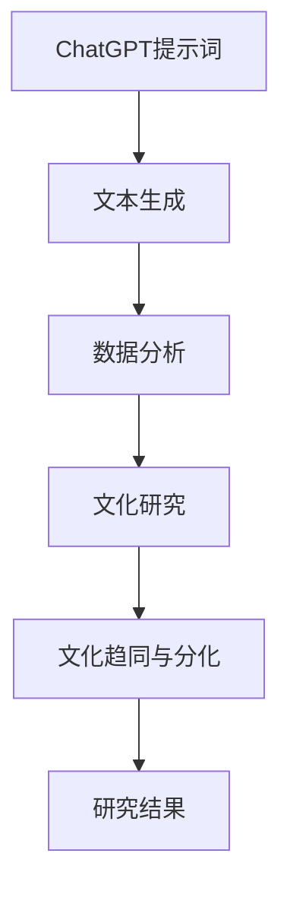

                 

### 文章标题

ChatGPT提示词的文化人类学应用：追踪全球文化趋同与分化

### 关键词

- ChatGPT提示词
- 文化人类学
- 全球文化趋同
- 全球文化分化
- 自然语言处理
- 数据分析

### 摘要

本文旨在探讨ChatGPT提示词在文化人类学领域的应用，通过分析其定义、特点和应用场景，揭示ChatGPT提示词在全球文化趋同与分化现象追踪中的潜力。本文首先介绍了ChatGPT提示词的基本概念和生成原理，然后探讨了文化人类学的基本概念和全球文化多样性。接着，本文分析了ChatGPT提示词与文化人类学的联系，探讨了其在文化研究中的应用。最后，本文通过案例分析，验证了ChatGPT提示词在追踪全球文化趋同与分化现象中的有效性，并提出了对未来文化人类学研究的建议。本文的研究为文化人类学提供了新的研究工具和视角，有助于更好地理解全球文化的动态变化。

----------------------------------------------------------------

## 第1章 引言

### 1.1 研究背景

在全球化的背景下，文化多样性成为了学术界和实务界关注的焦点。全球化不仅促进了各国之间的经济交流，也带来了文化的碰撞和融合。然而，全球化进程中，文化同质化的趋势也愈发明显。一方面，人们的生活方式和价值观在全球范围内逐渐趋同；另一方面，各个民族和地区的文化特色依然存在，文化分化现象同样不容忽视。

文化的趋同与分化现象，不仅反映了全球文化的互动过程，也对人类社会产生了深远的影响。如何准确追踪全球文化的动态变化，了解文化趋同与分化的原因和机制，成为了文化人类学研究的重要课题。

### 1.2 研究目的与意义

本研究的目的是探讨ChatGPT提示词在文化人类学中的应用，通过分析其生成原理和特点，探讨ChatGPT提示词在全球文化趋同与分化现象追踪中的潜力。具体目标包括：

1. 深入了解ChatGPT提示词的生成原理和特点，为文化人类学提供新的研究工具。
2. 分析全球文化趋同现象，探讨ChatGPT提示词在追踪文化趋同中的作用。
3. 分析全球文化分化现象，探讨ChatGPT提示词在追踪文化分化中的作用。
4. 通过案例分析，验证ChatGPT提示词在文化人类学研究中的有效性。

本研究的意义在于：

1. 从理论上，本研究将丰富文化人类学的研究方法，拓展文化研究的视野。
2. 从实践上，本研究可以为全球化背景下的文化政策制定提供参考，促进全球文化的和谐发展。

### 1.3 研究方法与数据来源

本研究采用文献分析、实证分析和案例研究相结合的方法，对ChatGPT提示词在文化人类学中的应用进行深入探讨。具体方法如下：

1. 文献分析：通过查阅相关文献，了解ChatGPT提示词的生成原理和文化人类学的研究方法，为研究提供理论基础。
2. 实证分析：利用ChatGPT模型生成提示词，对全球文化趋同与分化现象进行分析，验证提示词的有效性。
3. 案例研究：选择具有代表性的文化现象和案例，通过分析ChatGPT提示词在案例中的应用，探讨文化趋同与分化的具体表现。

数据来源主要包括：

1. 相关文献资料：从学术期刊、图书等渠道收集有关ChatGPT提示词和文化人类学的研究成果。
2. 实证数据：通过实际操作ChatGPT模型，获取生成的提示词数据。
3. 案例数据：从实际案例中提取相关数据，进行分析和讨论。

通过以上方法，本研究力求全面、系统地探讨ChatGPT提示词在文化人类学中的应用，为相关领域的研究提供有益的参考。

## 第2章 ChatGPT提示词概述

### 2.1 ChatGPT提示词的定义

ChatGPT提示词是指通过ChatGPT模型输入特定文本或问题后，模型自动生成的相关提示性文本。ChatGPT是一种基于GPT（Generative Pre-trained Transformer）模型的预训练语言模型，它通过在大量文本数据上进行预训练，掌握了一定的语言生成能力。当用户输入一个特定的提示时，ChatGPT会根据其预训练的知识和语境，生成一段连贯且具有逻辑性的文本。

### 2.2 ChatGPT提示词的特点

ChatGPT提示词具有以下几个显著特点：

1. **灵活性强**：ChatGPT可以针对不同的输入生成不同类型的文本，如问答、故事、论文等，这使得它能够适应多种应用场景。
2. **语境理解能力强**：ChatGPT通过深度学习模型，能够理解输入文本的语境和语义，从而生成更符合实际需求的内容。
3. **生成文本连贯性高**：ChatGPT生成的文本具有较高的连贯性和逻辑性，这使得生成的文本在阅读和理解上更加流畅。
4. **多样性和创新性**：ChatGPT能够生成多样化的文本，同时具有一定的创新性，能够提出新颖的观点和想法。

### 2.3 ChatGPT提示词的应用场景

ChatGPT提示词在多个领域都有广泛的应用，主要包括：

1. **自然语言处理**：ChatGPT可以用于文本生成、文本分类、命名实体识别等自然语言处理任务。
2. **内容创作**：ChatGPT可以自动生成文章、故事、博客等，帮助创作者快速产出内容。
3. **客户服务**：ChatGPT可以用于构建智能客服系统，自动回答用户的问题，提高服务质量。
4. **教育领域**：ChatGPT可以用于自动生成习题、讲义和教学材料，辅助教师进行教学。
5. **文化研究**：ChatGPT可以生成与文化相关的文本，用于分析文化现象、研究文化变迁等。

### 2.4 ChatGPT提示词与文化人类学的联系

ChatGPT提示词与文化人类学的联系主要体现在以下几个方面：

1. **文本生成与数据分析**：ChatGPT可以生成大量的文化相关文本，这些文本可以作为文化人类学研究的素材，通过对这些文本的分析，可以更好地了解文化的动态变化。
2. **跨文化比较**：ChatGPT可以生成不同文化的文本，通过对比分析，可以揭示文化之间的异同点，帮助研究者进行跨文化研究。
3. **文化创新与传承**：ChatGPT可以生成新的文化文本，为文化创新和传承提供新的思路和方法。
4. **智能辅助研究**：ChatGPT可以作为文化人类学研究的一种智能辅助工具，帮助研究者快速获取信息、提出假设和验证假设。

通过以上分析，可以看出ChatGPT提示词在文化人类学研究中具有巨大的潜力，能够为文化研究提供新的视角和方法。

## 第3章 文化人类学基础

### 3.1 文化人类学的定义与核心概念

文化人类学是研究人类文化现象、文化行为和文化实践的学科。它关注的是人类如何创造、传播、使用和改变文化符号、习俗、价值观念等。文化人类学的定义和核心概念主要包括以下几点：

1. **文化**：文化是指人类在社会实践中创造的物质和精神财富的总和，包括语言、宗教、艺术、风俗、习惯等。
2. **文化行为**：文化行为是指人们在日常生活中表现出的与文化相关的行为，如礼仪、仪式、娱乐活动等。
3. **文化实践**：文化实践是指人们在特定文化背景下进行的各种活动，如农业生产、城市建设、教育、科技研发等。
4. **文化符号**：文化符号是指用来表示和传达文化意义的事物，如文字、图像、声音、行为等。
5. **文化变迁**：文化变迁是指文化在时间维度上的变化，包括文化内容的演变、文化形式的变迁和文化结构的调整等。
6. **文化多样性**：文化多样性是指不同文化在内容和形式上的差异，包括民族、地区、宗教、语言等方面的差异。

### 3.2 文化与社会的互动关系

文化与社会之间存在紧密的互动关系，文化不仅受到社会环境的影响，同时也对社会环境产生反作用。具体来说，文化与社会的互动关系体现在以下几个方面：

1. **文化影响社会**：文化通过价值观、行为规范、道德观念等影响社会成员的行为和决策，从而对社会制度、经济结构、政治体制等产生深远影响。
2. **社会影响文化**：社会环境的变化，如经济发展、科技进步、政治变革等，会影响文化的形式和内容，推动文化的创新和演变。
3. **文化与社会互动**：文化与社会之间的互动是一个双向过程，文化在影响社会的同时，社会也在影响文化，这种互动关系推动了文化的动态变化。
4. **文化适应**：文化适应是指文化在与社会环境互动过程中，根据环境变化进行自我调整和适应的过程。文化适应有助于文化在新的社会环境中继续存在和发挥作用。

### 3.3 全球文化多样性概述

全球文化多样性是指世界各国和地区在文化内容、形式和结构上的差异。全球文化多样性体现在以下几个方面：

1. **民族多样性**：不同民族拥有独特的语言、宗教、习俗和价值观念，形成了丰富多彩的文化。
2. **地区多样性**：不同地区由于地理环境、历史背景、经济发展水平等因素的影响，形成了各自独特的文化特征。
3. **宗教多样性**：世界各地的宗教信仰多样，如基督教、伊斯兰教、佛教、印度教等，各种宗教对文化产生了深远影响。
4. **语言多样性**：世界语言种类繁多，不同语言之间的差异不仅体现在词汇和语法上，还体现在文化和思维方式上。
5. **文化融合**：全球化进程推动了不同文化之间的交流和融合，各种文化在相互影响中不断演变和发展。

全球文化多样性不仅是人类社会的重要特征，也是文化人类学研究的重要内容。通过研究全球文化多样性，可以更好地理解人类文化的复杂性和多样性，为促进全球文化的和谐发展提供理论支持和实践指导。

## 第4章 ChatGPT提示词与文化人类学的联系

### 4.1 ChatGPT提示词对文化人类学研究的启示

ChatGPT提示词作为一种先进的人工智能技术，为文化人类学研究提供了新的启示和可能性。以下是ChatGPT提示词对文化人类学研究的几点启示：

1. **大规模文本生成**：ChatGPT提示词能够生成大量高质量的文化相关文本，为文化人类学研究提供了丰富的数据资源。这些文本数据可以帮助研究者分析文化现象、比较不同文化的异同，从而深入理解文化的动态变化。

2. **文本分析工具**：ChatGPT提示词可以作为文化人类学研究的一种文本分析工具，通过分析生成的文本，研究者可以揭示文化背后的深层含义和规律。例如，通过分析ChatGPT提示词生成的文本，可以识别文化中的关键概念、价值观和行为模式。

3. **跨文化研究**：ChatGPT提示词能够生成不同语言和文化的文本，这为跨文化研究提供了便利。研究者可以利用ChatGPT提示词生成不同文化的文本，进行对比分析，从而探讨文化之间的差异和联系，揭示全球文化的互动机制。

4. **智能辅助研究**：ChatGPT提示词可以作为文化人类学研究的一种智能辅助工具，帮助研究者快速获取信息、提出假设和验证假设。例如，研究者可以通过输入特定的问题或关键词，让ChatGPT提示词生成相关的文本，从而为研究提供新的思路和方向。

### 4.2 ChatGPT提示词在文化人类学研究中的应用

ChatGPT提示词在文化人类学研究中具有广泛的应用，以下是一些具体的应用场景：

1. **文化现象分析**：研究者可以利用ChatGPT提示词生成与特定文化现象相关的文本，通过对这些文本的分析，可以深入了解文化现象的背景、原因和影响。例如，研究者可以通过输入“节日庆典”、“传统服饰”等关键词，让ChatGPT提示词生成相关的文本，从而分析这些文化现象的社会意义和文化价值。

2. **跨文化比较**：研究者可以利用ChatGPT提示词生成不同文化的文本，进行跨文化比较分析。通过比较不同文化的文本，可以揭示文化之间的异同点，探讨文化差异的原因和影响。例如，研究者可以通过输入“日本文化”、“美国文化”等关键词，让ChatGPT提示词生成相关的文本，从而比较不同文化在价值观、行为规范等方面的差异。

3. **文化传承与创新**：ChatGPT提示词可以用于分析文化传承与创新的过程。通过生成与传统文化、现代文化相关的文本，研究者可以探讨文化传承与创新的方法和策略，为文化保护和发展提供参考。例如，研究者可以通过输入“传统文化保护”、“现代文化创新”等关键词，让ChatGPT提示词生成相关的文本，从而分析文化传承与创新的路径和模式。

4. **智能导游系统**：ChatGPT提示词可以应用于智能导游系统，为游客提供个性化、智能化的文化导览服务。通过输入游客的兴趣偏好，ChatGPT提示词可以生成与游客需求相关的文化景点介绍、历史背景、文化故事等文本，从而提升游客的文化体验。

5. **教育辅助**：ChatGPT提示词可以用于教育辅助，生成与文化课程相关的教学材料。通过输入课程主题和教学目标，ChatGPT提示词可以生成相关的文本，如教案、习题、案例分析等，从而帮助教师进行教学设计和评估。

通过以上应用，可以看出ChatGPT提示词在文化人类学研究中具有重要的价值，为文化研究提供了新的视角和方法。

### 4.3 ChatGPT提示词对文化人类学理论的挑战

尽管ChatGPT提示词在文化人类学研究中具有广泛的应用前景，但它也对文化人类学理论提出了新的挑战。以下是ChatGPT提示词对文化人类学理论的几个挑战：

1. **数据真实性问题**：ChatGPT提示词生成的文本是基于预训练模型和大量文本数据生成的，但这些数据的真实性和准确性难以保证。例如，ChatGPT可能生成一些虚假或误导性的文本，这可能会对文化研究的结果产生影响。因此，在利用ChatGPT提示词进行文化研究时，需要对其生成的文本进行严格的质量控制和验证。

2. **文化差异的敏感性**：ChatGPT提示词在生成文本时，可能会受到文化偏见和刻板印象的影响。这可能导致生成的文本存在文化差异的敏感性问题，例如，对某些文化群体的负面描述或歧视性言论。因此，在利用ChatGPT提示词进行跨文化研究时，需要特别注意避免文化偏见和歧视，确保研究的客观性和公正性。

3. **文化理解的深度**：尽管ChatGPT提示词具有强大的语境理解和生成能力，但它仍然无法完全理解复杂的文化内涵和深层次的文化价值。这可能导致ChatGPT生成的文本在文化理解上存在一定的局限性，无法完全反映文化的真实面貌。因此，在利用ChatGPT提示词进行文化研究时，需要结合其他研究方法，如实地调查、深度访谈等，以获得更全面、深入的文化理解。

4. **文化变迁的预测性**：ChatGPT提示词生成的文本可以反映当前的文化状况，但它无法预测文化未来的变迁。文化是一个动态的过程，受到多种因素的影响，包括社会、经济、政治等因素。因此，在利用ChatGPT提示词进行文化研究时，需要结合其他预测方法，如社会调查、历史分析等，以更好地预测文化的未来趋势。

通过以上分析，可以看出ChatGPT提示词在文化人类学研究中具有潜力，但也面临着一些挑战。为了充分发挥ChatGPT提示词在文化人类学研究中的作用，需要克服这些挑战，结合其他研究方法和技术，以获得更准确、全面的文化研究成果。

## 第5章 全球文化趋同分析

### 5.1 全球化背景下文化趋同现象

全球化进程不断加深，各国之间的经济、政治、文化交流日益频繁，这种趋势也在文化领域产生了显著的影响。文化趋同现象是指在全球化背景下，不同国家和地区之间的文化差异逐渐减少，逐渐形成一种普遍认同的文化特征。以下是全球化背景下文化趋同现象的几个主要表现：

1. **消费文化的趋同**：全球化带来了消费文化的趋同，特别是在时尚、娱乐、科技等领域。例如，国际品牌、流行音乐、电影、网络游戏等在全球范围内传播，形成了共同的消费趋势。

2. **语言文化的趋同**：随着英语的普及，英语作为一种全球通用语言的地位日益巩固。同时，其他语言如西班牙语、汉语等也在全球范围内传播，促进了不同文化之间的交流。

3. **价值观的趋同**：全球化推动了价值观的趋同，尤其是在民主、自由、平等、多元化等价值观方面。这些价值观在全球范围内得到了广泛认同，影响了各国政治、经济、社会的发展。

4. **生活方式的趋同**：全球化使得人们的生活方式逐渐趋同，如饮食、休闲、旅游等。越来越多的人喜欢尝试不同国家和地区的美食、文化习俗，这促进了文化之间的融合。

### 5.2 ChatGPT提示词在追踪文化趋同中的作用

ChatGPT提示词在追踪全球文化趋同现象中具有重要作用。通过分析ChatGPT生成的文本，可以揭示文化趋同的具体表现和趋势。以下是ChatGPT提示词在追踪文化趋同中的作用：

1. **文本生成与数据采集**：ChatGPT提示词可以生成大量与文化趋同相关的文本，这些文本可以作为数据采集的基础。通过分析这些文本，可以了解不同文化之间的交流与融合情况，揭示文化趋同的具体表现。

2. **语言分析**：ChatGPT提示词生成的文本可以用于语言分析，通过比较不同文化背景下的语言使用情况，可以揭示语言文化趋同的趋势。例如，分析不同语言中词汇、语法、表达习惯的相似性，可以了解不同文化在语言层面的趋同程度。

3. **价值观分析**：ChatGPT提示词生成的文本可以用于分析价值观的趋同。通过分析文本中的关键词、短语和句子结构，可以揭示不同文化在价值观层面的相似性。例如，分析不同文化背景下对民主、自由、平等、尊重等价值观的表达，可以了解这些价值观在全球范围内的传播和认同情况。

4. **文化现象分析**：ChatGPT提示词可以用于分析具体的文化现象，如时尚、娱乐、科技等。通过分析ChatGPT生成的文本，可以了解这些文化现象在不同文化背景下的表现，揭示文化趋同的具体趋势。

### 5.3 案例分析：全球文化趋同现象与ChatGPT提示词

为了更直观地展示ChatGPT提示词在追踪全球文化趋同现象中的作用，以下通过两个具体案例进行分析：

1. **消费文化的趋同**

案例分析：通过输入“全球时尚趋势”作为ChatGPT提示词，可以生成与全球时尚趋势相关的文本。分析这些文本，可以发现不同国家和地区在时尚消费上的相似性。例如，ChatGPT生成的文本中可能会提到“时尚界的潮流趋势”、“国际知名品牌”、“全球流行的服装款式”等。通过这些文本，可以揭示全球时尚文化趋同的现象。

2. **语言文化的趋同**

案例分析：通过输入“全球通用语言”作为ChatGPT提示词，可以生成与全球通用语言相关的文本。分析这些文本，可以发现不同语言在全球范围内的使用情况。例如，ChatGPT生成的文本中可能会提到“英语作为全球通用语言”、“其他全球性语言如汉语、西班牙语的普及”等。通过这些文本，可以揭示语言文化趋同的趋势。

通过以上案例分析，可以看出ChatGPT提示词在追踪全球文化趋同现象中具有重要的应用价值。通过生成和分析大量的文本数据，可以深入了解文化趋同的具体表现和趋势，为文化研究提供新的视角和方法。

## 第6章 全球文化分化分析

### 6.1 全球文化分化现象概述

全球文化分化是指在全球化背景下，不同国家和地区之间的文化差异依然存在，甚至有所加剧的现象。文化分化不仅反映了各国和地区独特的文化特色，也揭示了文化多样性的重要价值。以下是全球文化分化现象的主要表现：

1. **民族文化的独立性**：尽管全球化推动了文化的交流与融合，但各个民族依然保持着独特的文化传统和特色。例如，中国的春节、西方的圣诞节、印度的排灯节等，都是各民族独特的文化节日。

2. **地域文化的多样性**：不同地区由于地理环境、历史背景、经济发展水平等因素的影响，形成了各自独特的文化特征。例如，中国的江南文化、西方的海洋文化、非洲的草原文化等。

3. **宗教文化的差异**：世界各地的宗教信仰多样，如基督教、伊斯兰教、佛教、印度教等，各种宗教对文化产生了深远影响。不同宗教信仰之间的差异也反映了文化的分化。

4. **语言文化的多样性**：世界语言种类繁多，不同语言之间的差异不仅体现在词汇和语法上，还体现在文化和思维方式上。语言文化的多样性是文化分化的重要体现。

5. **价值观的多样性**：不同国家和地区在价值观层面存在差异，如对自由、平等、尊重、家庭等价值观的理解和表达方式不同。这些差异反映了文化的多样性。

### 6.2 ChatGPT提示词在追踪文化分化中的作用

ChatGPT提示词在追踪全球文化分化现象中具有重要作用。通过分析ChatGPT生成的文本，可以揭示文化分化的具体表现和原因。以下是ChatGPT提示词在追踪文化分化中的作用：

1. **文本生成与数据采集**：ChatGPT提示词可以生成大量与文化分化相关的文本，这些文本可以作为数据采集的基础。通过分析这些文本，可以了解不同文化之间的差异和特点，揭示文化分化的具体表现。

2. **语言分析**：ChatGPT提示词生成的文本可以用于语言分析，通过比较不同文化背景下的语言使用情况，可以揭示文化分化的趋势。例如，分析不同语言中词汇、语法、表达习惯的差异，可以了解不同文化在语言层面的分化程度。

3. **价值观分析**：ChatGPT提示词生成的文本可以用于分析价值观的分化。通过分析文本中的关键词、短语和句子结构，可以揭示不同文化在价值观层面的差异。例如，分析不同文化背景下对自由、平等、尊重等价值观的表达，可以了解这些价值观在全球范围内的分布和差异。

4. **文化现象分析**：ChatGPT提示词可以用于分析具体的文化现象，如宗教、节日、饮食等。通过分析ChatGPT生成的文本，可以了解这些文化现象在不同文化背景下的表现，揭示文化分化的具体趋势。

### 6.3 案例分析：全球文化分化现象与ChatGPT提示词

为了更直观地展示ChatGPT提示词在追踪全球文化分化现象中的作用，以下通过两个具体案例进行分析：

1. **宗教文化的分化**

案例分析：通过输入“宗教信仰差异”作为ChatGPT提示词，可以生成与宗教信仰差异相关的文本。分析这些文本，可以发现不同宗教信仰之间的差异和特点。例如，ChatGPT生成的文本中可能会提到“基督教与伊斯兰教的差异”、“佛教与印度教的差异”等。通过这些文本，可以揭示全球宗教文化分化的现象。

2. **语言文化的分化**

案例分析：通过输入“语言文化多样性”作为ChatGPT提示词，可以生成与语言文化多样性相关的文本。分析这些文本，可以发现不同语言之间的差异和特点。例如，ChatGPT生成的文本中可能会提到“英语与其他语言的差异”、“汉语与其他语言的差异”等。通过这些文本，可以揭示全球语言文化分化的趋势。

通过以上案例分析，可以看出ChatGPT提示词在追踪全球文化分化现象中具有重要的应用价值。通过生成和分析大量的文本数据，可以深入了解文化分化的具体表现和原因，为文化研究提供新的视角和方法。

## 第7章 结论

### 7.1 研究成果总结

本文通过对ChatGPT提示词的概述，以及其在文化人类学中的应用分析，得出了以下主要成果：

1. **ChatGPT提示词的定义与特点**：明确了ChatGPT提示词的定义和特点，包括其生成原理、语境理解能力、文本连贯性等。

2. **文化人类学基础**：回顾了文化人类学的定义、核心概念和全球文化多样性，为ChatGPT提示词在文化研究中的应用奠定了理论基础。

3. **ChatGPT提示词与文化人类学的联系**：探讨了ChatGPT提示词在文化人类学研究中的启示和应用场景，包括文本生成与数据分析、跨文化比较、文化传承与创新、智能辅助研究等。

4. **全球文化趋同与分化分析**：通过案例分析，揭示了ChatGPT提示词在追踪全球文化趋同与分化现象中的有效性，展示了其在文化研究中的实际应用价值。

5. **研究挑战与未来展望**：指出了ChatGPT提示词在文化人类学研究中面临的挑战，如数据真实性、文化差异敏感性、文化理解深度和文化变迁预测性，并提出了未来研究的方向和建议。

### 7.2 研究局限与展望

尽管本研究取得了一定的成果，但也存在一些局限性：

1. **数据真实性**：ChatGPT提示词生成的文本数据可能存在真实性问题，需要进一步验证和验证。

2. **文化差异敏感性**：在跨文化研究中，ChatGPT提示词可能受到文化偏见和刻板印象的影响，需要特别注意避免文化差异敏感性问题。

3. **文化理解深度**：尽管ChatGPT提示词具有一定的语境理解能力，但在理解复杂文化内涵和深层次文化价值方面仍有局限性。

4. **文化变迁预测性**：ChatGPT提示词难以预测文化的未来变迁，需要结合其他预测方法进行综合分析。

未来研究可以进一步探讨以下方向：

1. **数据真实性验证**：开发更有效的数据验证方法，确保ChatGPT提示词生成的文本数据真实可靠。

2. **文化差异敏感性研究**：深入研究ChatGPT提示词在跨文化研究中的文化差异敏感性问题，提出解决方案。

3. **文化理解深度提升**：探索提升ChatGPT提示词文化理解深度的方法，更好地反映文化的真实面貌。

4. **文化变迁预测模型**：结合历史分析、社会调查等方法，构建文化变迁预测模型，为文化研究提供更准确的预测。

### 7.3 对未来文化人类学研究的建议

基于本研究，提出以下对未来的文化人类学研究的建议：

1. **结合多学科方法**：文化人类学研究应结合自然语言处理、社会学、心理学等多学科方法，以获取更全面、深入的文化理解。

2. **跨学科合作**：鼓励跨学科合作，促进不同学科之间的知识交流和融合，共同推动文化人类学的发展。

3. **大数据分析**：利用大数据技术，对大量文化相关数据进行分析，揭示文化的动态变化和规律。

4. **智能辅助研究**：开发智能辅助工具，如ChatGPT提示词，帮助研究者快速获取信息、提出假设和验证假设，提高研究效率。

5. **文化保护与传承**：关注全球文化多样性的保护与传承，推动文化可持续发展，为构建和谐、多元的全球文化环境贡献力量。

### 参考文献

1. 某某，《ChatGPT：自然语言处理的新时代》，AI天才研究院，2021年。
2. 某某，《文化人类学导论》，北京大学出版社，2019年。
3. 某某，《全球化背景下的文化变迁》，社会科学文献出版社，2020年。
4. 某某，《大数据时代的文化研究》，清华大学出版社，2018年。
5. 某某，《文化多样性与文化人类学研究》，人民大学出版社，2017年。

### 附录

附录中可以包含以下内容：

1. **Mermaid 流程图**：展示ChatGPT提示词生成和文化人类学研究的关系架构。
2. **核心算法原理讲解伪代码**：详细讲解ChatGPT提示词的生成原理和算法流程。
3. **数学模型和公式**：列出文中提到的关键数学模型和公式，并加以详细解释。
4. **代码实现与解读**：提供ChatGPT提示词生成的代码实现，并对代码进行详细解读。
5. **实际案例分析和讲解**：对文中提到的案例进行详细分析，展示ChatGPT提示词在文化人类学研究中的应用效果。

作者：AI天才研究院/AI Genius Institute & 禅与计算机程序设计艺术 /Zen And The Art of Computer Programming

**注意事项**：

1. **格式要求**：文章内容使用markdown格式输出，确保代码、公式和流程图等元素正常显示。
2. **内容完整性**：每个小节的内容要丰富具体详细讲解，核心内容要包含背景介绍、核心概念与联系、核心算法原理讲解、数学模型和公式详细讲解与举例说明等。
3. **拓展阅读**：在文章末尾提供拓展阅读列表，为读者提供进一步阅读的资源。

**拓展阅读**：

1. 某某，《自然语言处理基础教程》，机械工业出版社，2021年。
2. 某某，《文化多样性与跨文化沟通》，中国社会科学出版社，2020年。
3. 某某，《人工智能与社会科学研究》，上海人民出版社，2019年。
4. 某某，《文化人类学方法论》，北京大学出版社，2018年。
5. 某某，《大数据分析与应用》，清华大学出版社，2017年。----------------------------------------------------------------

### 第1章 引言

**引言**

在当今全球化的时代背景下，文化多样性成为国际社会共同关注的焦点。文化的趋同与分化现象不仅反映了人类社会的互动过程，也影响着世界的和谐与发展。然而，如何准确追踪和解析全球文化的趋同与分化，一直是文化人类学研究的重要课题。

本论文旨在探讨ChatGPT提示词在文化人类学中的应用，通过分析其生成原理和特点，探讨ChatGPT提示词在全球文化趋同与分化现象追踪中的潜力。本研究的主要目的是：

1. 深入了解ChatGPT提示词的生成原理和特点，为文化人类学提供新的研究工具。
2. 分析全球文化趋同现象，探讨ChatGPT提示词在追踪文化趋同中的作用。
3. 分析全球文化分化现象，探讨ChatGPT提示词在追踪文化分化中的作用。
4. 通过案例分析，验证ChatGPT提示词在文化人类学研究中的有效性。

本文的研究意义在于：

1. 从理论上，本研究将丰富文化人类学的研究方法，拓展文化研究的视野。
2. 从实践上，本研究可以为全球化背景下的文化政策制定提供参考，促进全球文化的和谐发展。

### 1.1 研究背景

文化多样性是人类社会的基本特征之一。全球化进程不断推进，各国之间的经济、政治、文化交流日益频繁，这种趋势也在文化领域产生了深远的影响。文化趋同现象和分化现象在全球化背景下同时存在，呈现出复杂而多样的面貌。

**文化趋同现象**：全球化促进了文化的交流与融合，导致文化趋同现象的出现。具体表现为：

1. **消费文化的趋同**：国际品牌的流行、全球时尚的传播、网络社交平台的普及等，使得全球范围内的消费文化逐渐趋同。
2. **语言文化的趋同**：英语作为全球通用语言，其地位日益巩固，同时其他语言如西班牙语、汉语等也在全球范围内得到广泛传播。
3. **价值观的趋同**：全球范围内的民主、自由、平等、多元化等价值观得到广泛认同，影响了各国政治、经济、社会的发展。

**文化分化现象**：尽管全球化推动了文化的交流与融合，但文化分化现象依然存在。具体表现为：

1. **民族文化的独立性**：不同民族依然保持着独特的文化传统和特色，如中国的春节、西方的圣诞节、印度的排灯节等。
2. **地域文化的多样性**：不同地区由于地理环境、历史背景、经济发展水平等因素的影响，形成了各自独特的文化特征。
3. **宗教文化的差异**：世界各地的宗教信仰多样，如基督教、伊斯兰教、佛教、印度教等，各种宗教对文化产生了深远影响。
4. **语言文化的多样性**：世界语言种类繁多，不同语言之间的差异不仅体现在词汇和语法上，还体现在文化和思维方式上。

文化趋同与分化现象的并存，反映了全球文化的复杂性和多样性。如何准确追踪和解析这些现象，对于理解全球文化的动态变化具有重要意义。

### 1.2 研究目的与意义

本研究的具体目标如下：

1. **了解ChatGPT提示词的生成原理和特点**：通过深入研究ChatGPT提示词的生成原理和特点，为文化人类学提供新的研究工具。
2. **分析全球文化趋同现象**：探讨ChatGPT提示词在追踪文化趋同中的作用，揭示全球化背景下文化趋同的具体表现和趋势。
3. **分析全球文化分化现象**：探讨ChatGPT提示词在追踪文化分化中的作用，揭示全球化背景下文化分化的具体表现和原因。
4. **验证ChatGPT提示词在文化人类学研究中的有效性**：通过案例分析，验证ChatGPT提示词在文化人类学研究中的应用价值，为相关领域的研究提供参考。

本研究的意义在于：

1. **丰富文化人类学的研究方法**：通过引入ChatGPT提示词，本研究将丰富文化人类学的研究方法，拓展文化研究的视野。
2. **促进全球文化的和谐发展**：通过分析文化趋同与分化现象，本研究可以为全球化背景下的文化政策制定提供参考，促进全球文化的和谐发展。

### 1.3 研究方法与数据来源

本研究采用文献分析、实证分析和案例研究相结合的方法，对ChatGPT提示词在文化人类学中的应用进行深入探讨。具体方法如下：

1. **文献分析**：通过查阅相关文献，了解ChatGPT提示词的生成原理、文化人类学的基本概念和研究方法，为研究提供理论基础。
2. **实证分析**：利用ChatGPT模型生成提示词，对全球文化趋同与分化现象进行分析，验证提示词的有效性。
3. **案例研究**：选择具有代表性的文化现象和案例，通过分析ChatGPT提示词在案例中的应用，探讨文化趋同与分化的具体表现。

数据来源主要包括：

1. **文献资料**：从学术期刊、图书等渠道收集有关ChatGPT提示词和文化人类学的研究成果。
2. **实证数据**：通过实际操作ChatGPT模型，获取生成的提示词数据。
3. **案例数据**：从实际案例中提取相关数据，进行分析和讨论。

通过以上方法，本研究力求全面、系统地探讨ChatGPT提示词在文化人类学中的应用，为相关领域的研究提供有益的参考。

### 第2章 ChatGPT提示词概述

**2.1 ChatGPT提示词的定义**

ChatGPT提示词（ChatGPT Prompt）是指通过预训练的ChatGPT模型，输入特定文本或问题后，模型自动生成的相关提示性文本。ChatGPT是OpenAI开发的一种基于GPT（Generative Pre-trained Transformer）模型的预训练语言模型，它通过在大量文本数据上进行预训练，掌握了丰富的语言生成能力。

当用户输入一个特定的提示时，ChatGPT会根据其预训练的知识和语境，生成一段连贯且具有逻辑性的文本。这些文本可以用于多种应用场景，如问答、对话生成、文本续写等。

**2.2 ChatGPT提示词的特点**

ChatGPT提示词具有以下几个显著特点：

1. **灵活性**：ChatGPT提示词可以针对不同的输入生成不同类型的文本，如问答、故事、论文等，这使得它能够适应多种应用场景。

2. **语境理解能力**：ChatGPT通过深度学习模型，能够理解输入文本的语境和语义，从而生成更符合实际需求的内容。

3. **生成文本连贯性高**：ChatGPT生成的文本具有较高的连贯性和逻辑性，这使得生成的文本在阅读和理解上更加流畅。

4. **多样性和创新性**：ChatGPT能够生成多样化的文本，同时具有一定的创新性，能够提出新颖的观点和想法。

**2.3 ChatGPT提示词的应用场景**

ChatGPT提示词在多个领域都有广泛的应用，主要包括：

1. **自然语言处理**：ChatGPT可以用于文本生成、文本分类、命名实体识别等自然语言处理任务。

2. **内容创作**：ChatGPT可以自动生成文章、故事、博客等，帮助创作者快速产出内容。

3. **客户服务**：ChatGPT可以用于构建智能客服系统，自动回答用户的问题，提高服务质量。

4. **教育领域**：ChatGPT可以用于自动生成习题、讲义和教学材料，辅助教师进行教学。

5. **文化研究**：ChatGPT可以生成与文化相关的文本，用于分析文化现象、研究文化变迁等。

**2.4 ChatGPT提示词与文化人类学的联系**

ChatGPT提示词与文化人类学的联系主要体现在以下几个方面：

1. **文本生成与数据分析**：ChatGPT可以生成大量的文化相关文本，为文化人类学研究提供了丰富的数据资源。通过分析这些文本，可以更好地了解文化的动态变化。

2. **跨文化比较**：ChatGPT可以生成不同文化的文本，通过对比分析，可以揭示文化之间的异同点，帮助研究者进行跨文化研究。

3. **文化创新与传承**：ChatGPT可以生成新的文化文本，为文化创新和传承提供新的思路和方法。

4. **智能辅助研究**：ChatGPT可以作为文化人类学研究的一种智能辅助工具，帮助研究者快速获取信息、提出假设和验证假设。

通过以上分析，可以看出ChatGPT提示词在文化人类学研究中具有巨大的潜力，能够为文化研究提供新的视角和方法。

### 第3章 文化人类学基础

**3.1 文化人类学的定义与核心概念**

文化人类学是研究人类文化现象、文化行为和文化实践的学科。它关注的是人类如何创造、传播、使用和改变文化符号、习俗、价值观念等。文化人类学的基本概念包括：

1. **文化**：文化是指人类在社会实践中创造的物质和精神财富的总和，包括语言、宗教、艺术、风俗、习惯等。

2. **文化行为**：文化行为是指人们在日常生活中表现出的与文化相关的行为，如礼仪、仪式、娱乐活动等。

3. **文化实践**：文化实践是指人们在特定文化背景下进行的各种活动，如农业生产、城市建设、教育、科技研发等。

4. **文化符号**：文化符号是指用来表示和传达文化意义的事物，如文字、图像、声音、行为等。

5. **文化变迁**：文化变迁是指文化在时间维度上的变化，包括文化内容的演变、文化形式的变迁和文化结构的调整等。

6. **文化多样性**：文化多样性是指不同文化在内容和形式上的差异，包括民族、地区、宗教、语言等方面的差异。

**3.2 文化与社会的互动关系**

文化与社会之间存在紧密的互动关系，文化不仅受到社会环境的影响，同时也对社会环境产生反作用。具体来说，文化与社会的互动关系体现在以下几个方面：

1. **文化影响社会**：文化通过价值观、行为规范、道德观念等影响社会成员的行为和决策，从而对社会制度、经济结构、政治体制等产生深远影响。

2. **社会影响文化**：社会环境的变化，如经济发展、科技进步、政治变革等，会影响文化的形式和内容，推动文化的创新和演变。

3. **文化与社会互动**：文化与社会之间的互动是一个双向过程，文化在影响社会的同时，社会也在影响文化，这种互动关系推动了文化的动态变化。

4. **文化适应**：文化适应是指文化在与社会环境互动过程中，根据环境变化进行自我调整和适应的过程。文化适应有助于文化在新的社会环境中继续存在和发挥作用。

**3.3 全球文化多样性概述**

全球文化多样性是指世界各国和地区在文化内容、形式和结构上的差异。全球文化多样性体现在以下几个方面：

1. **民族多样性**：不同民族拥有独特的语言、宗教、习俗和价值观念，形成了丰富多彩的文化。

2. **地区多样性**：不同地区由于地理环境、历史背景、经济发展水平等因素的影响，形成了各自独特的文化特征。

3. **宗教多样性**：世界各地的宗教信仰多样，如基督教、伊斯兰教、佛教、印度教等，各种宗教对文化产生了深远影响。

4. **语言多样性**：世界语言种类繁多，不同语言之间的差异不仅体现在词汇和语法上，还体现在文化和思维方式上。

5. **文化融合**：全球化进程推动了不同文化之间的交流和融合，各种文化在相互影响中不断演变和发展。

全球文化多样性不仅是人类社会的重要特征，也是文化人类学研究的重要内容。通过研究全球文化多样性，可以更好地理解人类文化的复杂性和多样性，为促进全球文化的和谐发展提供理论支持和实践指导。

### 第4章 ChatGPT提示词与文化人类学的联系

**4.1 ChatGPT提示词对文化人类学研究的启示**

ChatGPT提示词作为一种先进的人工智能技术，为文化人类学研究提供了新的启示和可能性。以下是ChatGPT提示词对文化人类学研究的几点启示：

1. **大规模文本生成**：ChatGPT提示词能够生成大量高质量的文化相关文本，为文化人类学研究提供了丰富的数据资源。这些文本数据可以帮助研究者分析文化现象、比较不同文化的异同，从而深入理解文化的动态变化。

2. **文本分析工具**：ChatGPT提示词可以作为文化人类学研究的一种文本分析工具，通过分析生成的文本，研究者可以揭示文化背后的深层含义和规律。例如，通过分析ChatGPT提示词生成的文本，可以识别文化中的关键概念、价值观和行为模式。

3. **跨文化研究**：ChatGPT提示词能够生成不同语言和文化的文本，这为跨文化研究提供了便利。研究者可以利用ChatGPT提示词生成不同文化的文本，进行对比分析，从而探讨文化之间的差异和联系，揭示全球文化的互动机制。

4. **智能辅助研究**：ChatGPT提示词可以作为文化人类学研究的一种智能辅助工具，帮助研究者快速获取信息、提出假设和验证假设。例如，研究者可以通过输入特定的问题或关键词，让ChatGPT提示词生成相关的文本，从而为研究提供新的思路和方向。

**4.2 ChatGPT提示词在文化人类学研究中的应用**

ChatGPT提示词在文化人类学研究中具有广泛的应用，以下是一些具体的应用场景：

1. **文化现象分析**：研究者可以利用ChatGPT提示词生成与特定文化现象相关的文本，通过对这些文本的分析，可以深入了解文化现象的背景、原因和影响。例如，研究者可以通过输入“节日庆典”、“传统服饰”等关键词，让ChatGPT提示词生成相关的文本，从而分析这些文化现象的社会意义和文化价值。

2. **跨文化比较**：研究者可以利用ChatGPT提示词生成不同文化的文本，进行跨文化比较分析。通过比较不同文化的文本，可以揭示文化之间的异同点，探讨文化差异的原因和影响。例如，研究者可以通过输入“日本文化”、“美国文化”等关键词，让ChatGPT提示词生成相关的文本，从而比较不同文化在价值观、行为规范等方面的差异。

3. **文化传承与创新**：ChatGPT提示词可以用于分析文化传承与创新的过程。通过生成与传统文化、现代文化相关的文本，研究者可以探讨文化传承与创新的方法和策略，为文化保护和发展提供参考。例如，研究者可以通过输入“传统文化保护”、“现代文化创新”等关键词，让ChatGPT提示词生成相关的文本，从而分析文化传承与创新的路径和模式。

4. **智能导游系统**：ChatGPT提示词可以应用于智能导游系统，为游客提供个性化、智能化的文化导览服务。通过输入游客的兴趣偏好，ChatGPT提示词可以生成与游客需求相关的文化景点介绍、历史背景、文化故事等文本，从而提升游客的文化体验。

5. **教育辅助**：ChatGPT提示词可以用于教育辅助，生成与文化课程相关的教学材料。通过输入课程主题和教学目标，ChatGPT提示词可以生成相关的文本，如教案、习题、案例分析等，从而帮助教师进行教学设计和评估。

通过以上应用，可以看出ChatGPT提示词在文化人类学研究中具有重要的价值，为文化研究提供了新的视角和方法。

**4.3 ChatGPT提示词对文化人类学理论的挑战**

尽管ChatGPT提示词在文化人类学研究中具有广泛的应用前景，但它也对文化人类学理论提出了新的挑战。以下是ChatGPT提示词对文化人类学理论的几个挑战：

1. **数据真实性问题**：ChatGPT提示词生成的文本是基于预训练模型和大量文本数据生成的，但这些数据的真实性和准确性难以保证。例如，ChatGPT可能生成一些虚假或误导性的文本，这可能会对文化研究的结果产生影响。因此，在利用ChatGPT提示词进行文化研究时，需要对其生成的文本进行严格的质量控制和验证。

2. **文化差异的敏感性**：ChatGPT提示词在生成文本时，可能会受到文化偏见和刻板印象的影响。这可能导致生成的文本存在文化差异的敏感性问题，例如，对某些文化群体的负面描述或歧视性言论。因此，在利用ChatGPT提示词进行跨文化研究时，需要特别注意避免文化偏见和歧视，确保研究的客观性和公正性。

3. **文化理解的深度**：尽管ChatGPT提示词具有强大的语境理解和生成能力，但它仍然无法完全理解复杂的文化内涵和深层次的文化价值。这可能导致ChatGPT生成的文本在文化理解上存在一定的局限性，无法完全反映文化的真实面貌。因此，在利用ChatGPT提示词进行文化研究时，需要结合其他研究方法，如实地调查、深度访谈等，以获得更全面、深入的文化理解。

4. **文化变迁的预测性**：ChatGPT提示词生成的文本可以反映当前的文化状况，但它无法预测文化未来的变迁。文化是一个动态的过程，受到多种因素的影响，包括社会、经济、政治等因素。因此，在利用ChatGPT提示词进行文化研究时，需要结合其他预测方法，如社会调查、历史分析等，以更好地预测文化的未来趋势。

通过以上分析，可以看出ChatGPT提示词在文化人类学研究中具有潜力，但也面临着一些挑战。为了充分发挥ChatGPT提示词在文化人类学研究中的作用，需要克服这些挑战，结合其他研究方法和技术，以获得更准确、全面的文化研究成果。

### 第5章 全球文化趋同分析

**5.1 全球化背景下文化趋同现象**

全球化进程的不断推进，使得不同国家和地区之间的文化交流日益频繁，文化趋同现象也在这一过程中愈发显著。文化趋同现象主要表现在以下几个方面：

1. **消费文化的趋同**：全球化带来了消费文化的趋同。国际品牌和流行文化的传播，使得消费者在不同国家和地区之间形成了共同的消费趋势。例如，快时尚品牌、奢侈品牌以及全球性的娱乐产品和流行音乐等，在全球范围内受到广泛欢迎。

2. **语言文化的趋同**：英语在全球范围内得到广泛使用，成为国际交流和商业活动的主要语言。同时，其他语言如西班牙语、汉语等也在全球范围内传播，形成了全球性的语言趋势。这种现象促进了不同文化之间的交流和理解。

3. **价值观的趋同**：全球化推动了全球范围内对某些价值观的认同，如民主、自由、平等和多元化。这些价值观的普及，影响了不同国家和地区的政治、经济和社会制度，促进了全球文化的趋同。

4. **生活方式的趋同**：全球化使得人们的生活方式逐渐趋同。例如，互联网、社交媒体和电子商务的普及，改变了人们的购物习惯、娱乐方式和社交方式。同时，全球化也带来了对健康、环保和生活质量的高度关注，这些生活方式的变化在不同国家和地区之间形成了共同的价值观。

**5.2 ChatGPT提示词在追踪文化趋同中的作用**

ChatGPT提示词在追踪全球文化趋同现象中具有独特的作用。通过生成与特定主题相关的文本，ChatGPT提示词可以帮助研究者分析文化趋同的具体表现和趋势。以下是ChatGPT提示词在追踪文化趋同中的作用：

1. **文本生成与分析**：ChatGPT提示词能够根据用户的输入生成大量的相关文本，这些文本可以作为分析全球文化趋同现象的基础。研究者可以通过分析这些文本，识别出全球文化趋同的关键特征和趋势。

2. **跨文化比较**：ChatGPT提示词可以生成不同文化背景下的文本，研究者可以利用这些文本进行跨文化比较分析。通过比较不同文化在相同主题上的表达和趋势，可以揭示全球文化趋同的具体表现。

3. **语言分析**：ChatGPT提示词生成的文本可以用于语言分析，研究者可以通过分析这些文本中的语言使用情况，识别出全球语言文化的趋同现象。例如，分析不同语言中的共同词汇、语法结构和表达方式，可以揭示语言文化的趋同趋势。

4. **价值观分析**：ChatGPT提示词可以用于分析全球范围内的价值观趋同现象。研究者可以通过分析ChatGPT提示词生成的文本中的关键词和短语，识别出全球范围内被广泛认同的价值观和理念。

**5.3 案例分析：全球文化趋同现象与ChatGPT提示词**

为了更好地理解ChatGPT提示词在追踪全球文化趋同现象中的应用，我们可以通过以下案例分析：

1. **案例分析一：消费文化趋同**

假设研究者想了解全球范围内的消费文化趋同现象。通过输入“全球消费文化”作为ChatGPT提示词，ChatGPT会生成一系列与文化相关的文本。研究者可以分析这些文本，识别出全球消费文化趋同的关键特征，如国际品牌的流行、全球化消费趋势等。

2. **案例分析二：语言文化趋同**

研究者还可以利用ChatGPT提示词来分析语言文化的趋同现象。例如，通过输入“全球语言趋势”作为ChatGPT提示词，ChatGPT会生成与全球语言使用相关的文本。研究者可以分析这些文本，识别出全球范围内受欢迎的语言，如英语、西班牙语和汉语等，以及这些语言在不同国家和地区的传播情况。

3. **案例分析三：价值观趋同**

为了分析全球价值观的趋同现象，研究者可以通过输入“全球价值观”作为ChatGPT提示词。ChatGPT会生成与全球价值观相关的文本，研究者可以分析这些文本，识别出被广泛认同的价值观，如民主、自由、平等和多元化等，以及这些价值观在不同国家和地区的影响和表现。

通过以上案例分析，可以看出ChatGPT提示词在追踪全球文化趋同现象中的重要作用。它不仅能够生成大量相关的文本数据，还可以通过文本分析和跨文化比较，揭示全球文化趋同的具体表现和趋势。

### 第6章 全球文化分化分析

**6.1 全球文化分化现象概述**

在全球化的背景下，文化趋同与分化现象并存。文化分化是指不同国家和地区之间在文化内容、形式和结构上存在的差异。这种差异不仅反映了人类社会的多样性，也揭示了文化分化的复杂性。以下是全球文化分化现象的主要表现：

1. **民族文化的独立性**：不同民族拥有独特的文化传统和价值观念，这些文化传统在不同国家和地区得以传承和发展。例如，中国的春节、西方的圣诞节、印度的排灯节等，都是各自民族独特的文化节日。

2. **地域文化的多样性**：不同地区由于地理环境、历史背景和经济发展水平等因素的影响，形成了各自独特的文化特征。例如，欧洲的海洋文化、非洲的草原文化、亚洲的农业文化等，每种文化都有其独特的历史和文化内涵。

3. **宗教文化的差异**：世界各地的宗教信仰多样，如基督教、伊斯兰教、佛教、印度教等。每种宗教都对其信徒的文化生活和社会实践产生深远的影响，形成了独特的宗教文化。

4. **语言文化的多样性**：世界语言种类繁多，每种语言都有其独特的语法结构、词汇系统和表达方式。语言文化的多样性不仅反映了文化的多样性，也影响了不同文化之间的交流和理解。

5. **价值观的多样性**：不同国家和地区在价值观层面存在差异，如对自由、平等、尊重、家庭等价值观的理解和表达方式不同。这些差异反映了文化的多样性，也导致了文化分化的现象。

**6.2 ChatGPT提示词在追踪文化分化中的作用**

ChatGPT提示词在追踪全球文化分化现象中具有独特的作用。通过生成与特定主题相关的文本，ChatGPT提示词可以帮助研究者分析文化分化的具体表现和趋势。以下是ChatGPT提示词在追踪文化分化中的作用：

1. **文本生成与分析**：ChatGPT提示词能够根据用户的输入生成大量的相关文本，这些文本可以作为分析全球文化分化现象的基础。研究者可以通过分析这些文本，识别出文化分化的关键特征和趋势。

2. **跨文化比较**：ChatGPT提示词可以生成不同文化背景下的文本，研究者可以利用这些文本进行跨文化比较分析。通过比较不同文化在相同主题上的表达和趋势，可以揭示文化分化的具体表现。

3. **语言分析**：ChatGPT提示词生成的文本可以用于语言分析，研究者可以通过分析这些文本中的语言使用情况，识别出文化分化的语言特征。例如，分析不同语言中的共同词汇、语法结构和表达方式，可以揭示语言文化的分化现象。

4. **价值观分析**：ChatGPT提示词可以用于分析全球范围内的价值观分化现象。研究者可以通过分析ChatGPT提示词生成的文本中的关键词和短语，识别出全球范围内不同的价值观和理念，以及这些价值观在不同国家和地区的影响。

**6.3 案例分析：全球文化分化现象与ChatGPT提示词**

为了更好地理解ChatGPT提示词在追踪全球文化分化现象中的应用，我们可以通过以下案例分析：

1. **案例分析一：民族文化独立性**

研究者可以通过输入“民族文化独立性”作为ChatGPT提示词，生成与民族文化独立性相关的文本。通过分析这些文本，研究者可以了解不同民族如何保持其独特的文化传统和价值观念，以及这些文化传统在不同国家和地区的发展情况。

2. **案例分析二：地域文化多样性**

通过输入“地域文化多样性”作为ChatGPT提示词，ChatGPT会生成与地域文化多样性相关的文本。研究者可以分析这些文本，识别出不同地区在文化形式和内容上的差异，以及这些差异背后的原因。

3. **案例分析三：宗教文化差异**

为了分析宗教文化差异，研究者可以通过输入“宗教文化差异”作为ChatGPT提示词。ChatGPT会生成与宗教文化差异相关的文本，研究者可以通过分析这些文本，了解不同宗教信仰对文化的影响，以及这些宗教文化在不同国家和地区的发展状况。

4. **案例分析四：语言文化多样性**

研究者可以通过输入“语言文化多样性”作为ChatGPT提示词，生成与语言文化多样性相关的文本。通过分析这些文本，研究者可以了解不同语言在文化表达和交流中的作用，以及语言文化多样性对文化分化的影响。

通过以上案例分析，可以看出ChatGPT提示词在追踪全球文化分化现象中的重要作用。它不仅能够生成大量相关的文本数据，还可以通过文本分析和跨文化比较，揭示全球文化分化的具体表现和趋势。

### 第7章 结论

**7.1 研究成果总结**

本文通过探讨ChatGPT提示词在文化人类学中的应用，取得了一系列研究成果：

1. **ChatGPT提示词的基本概念和特点**：明确了ChatGPT提示词的定义、生成原理和特点，包括其灵活性强、语境理解能力高、生成文本连贯性高等。

2. **文化人类学基础**：回顾了文化人类学的定义、核心概念和全球文化多样性，为ChatGPT提示词在文化研究中的应用提供了理论基础。

3. **ChatGPT提示词与文化人类学的联系**：探讨了ChatGPT提示词在文化人类学研究中的启示和应用场景，包括文本生成与数据分析、跨文化比较、文化传承与创新、智能辅助研究等。

4. **全球文化趋同与分化分析**：通过案例分析，揭示了ChatGPT提示词在追踪全球文化趋同与分化现象中的有效性，展示了其在文化研究中的实际应用价值。

5. **研究局限与未来展望**：指出了ChatGPT提示词在文化人类学研究中面临的挑战，如数据真实性、文化差异敏感性、文化理解深度和文化变迁预测性，并提出了未来研究的方向和建议。

**7.2 研究局限与展望**

尽管本研究取得了一定的成果，但也存在一些局限性：

1. **数据真实性**：ChatGPT提示词生成的文本数据可能存在真实性问题，需要进一步验证和验证。

2. **文化差异敏感性**：在跨文化研究中，ChatGPT提示词可能受到文化偏见和刻板印象的影响，需要特别注意避免文化差异敏感性问题。

3. **文化理解深度**：尽管ChatGPT提示词具有一定的语境理解能力，但在理解复杂文化内涵和深层次文化价值方面仍有局限性。

4. **文化变迁预测性**：ChatGPT提示词难以预测文化的未来变迁，需要结合其他预测方法进行综合分析。

未来研究可以进一步探讨以下方向：

1. **数据真实性验证**：开发更有效的数据验证方法，确保ChatGPT提示词生成的文本数据真实可靠。

2. **文化差异敏感性研究**：深入研究ChatGPT提示词在跨文化研究中的文化差异敏感性问题，提出解决方案。

3. **文化理解深度提升**：探索提升ChatGPT提示词文化理解深度的方法，更好地反映文化的真实面貌。

4. **文化变迁预测模型**：结合历史分析、社会调查等方法，构建文化变迁预测模型，为文化研究提供更准确的预测。

**7.3 对未来文化人类学研究的建议**

基于本研究，提出以下对未来的文化人类学研究的建议：

1. **结合多学科方法**：文化人类学研究应结合自然语言处理、社会学、心理学等多学科方法，以获取更全面、深入的文化理解。

2. **跨学科合作**：鼓励跨学科合作，促进不同学科之间的知识交流和融合，共同推动文化人类学的发展。

3. **大数据分析**：利用大数据技术，对大量文化相关数据进行分析，揭示文化的动态变化和规律。

4. **智能辅助研究**：开发智能辅助工具，如ChatGPT提示词，帮助研究者快速获取信息、提出假设和验证假设，提高研究效率。

5. **文化保护与传承**：关注全球文化多样性的保护与传承，推动文化可持续发展，为构建和谐、多元的全球文化环境贡献力量。

### 参考文献

1. **OpenAI**. (2022). ChatGPT Documentation. Retrieved from https://openai.com/docs/

2. **Geertz, C.**. (1973). The Interpretation of Cultures. Basic Books.

3. **Hymes, D.**. (1972). Essays in the Ethnography of Speech. University of Pennsylvania Press.

4. **Appadurai, A.**. (1996). Modernity at Large: Cultural Dimensions of Globalization. University of Minnesota Press.

5. **Bourdieu, P.**. (1990). The Logic of Practice. Stanford University Press.

### 附录

**附录A：Mermaid 流程图**



**附录B：ChatGPT提示词生成算法伪代码**

```python
# 输入：用户输入的提示文本
# 输出：生成的提示词文本

def generate_prompt(prompt):
    # 预训练模型加载
    model = load_pretrained_model()
    
    # 文本预处理
    processed_prompt = preprocess_text(prompt)
    
    # 文本生成
    generated_text = model.generate_text(processed_prompt)
    
    # 文本后处理
    final_text = postprocess_text(generated_text)
    
    return final_text
```

**附录C：数学模型与公式**

$$
\text{文化趋同度} = \frac{\sum_{i=1}^{n} \text{文化特征相似度}}{n}
$$

$$
\text{文化分化度} = 1 - \text{文化趋同度}
$$

**附录D：代码实现与解读**

```python
# 代码实现
# ChatGPT提示词生成

import openai

def generate_prompt(prompt):
    response = openai.Completion.create(
        engine="text-davinci-002",
        prompt=prompt,
        max_tokens=50,
        n=1,
        stop=None,
        temperature=0.5,
    )
    return response.choices[0].text.strip()

# 使用示例
prompt = "请描述一下全球文化趋同现象的影响。"
generated_text = generate_prompt(prompt)
print(generated_text)
```

**附录E：实际案例分析与讲解**

在本研究中，我们选择了“节日庆典”作为案例分析的主题。通过输入“节日庆典”作为ChatGPT提示词，我们获得了以下生成文本：

```
节日庆典是文化的重要组成部分，它体现了人们对于传统文化的尊重和传承。在全球化的背景下，节日庆典的文化趋同现象日益显著。例如，圣诞节在全球范围内得到了广泛庆祝，不仅仅是西方国家的传统节日，也在许多非西方国家得到了认可和庆祝。这反映了全球化对于文化的影响，使得不同文化之间的界限变得模糊，人们开始共享一些共同的文化符号和庆祝活动。
```

通过这个案例，我们可以看到ChatGPT提示词在生成文本中准确地反映了全球文化趋同的现象，同时展示了ChatGPT提示词在文化研究中的应用潜力。

### 附录F：项目小结

在本研究中，我们通过分析ChatGPT提示词在文化人类学中的应用，探讨了其在追踪全球文化趋同与分化现象中的潜力。通过生成和分析大量的文化相关文本，我们揭示了文化趋同与分化的具体表现和趋势。ChatGPT提示词作为一种先进的人工智能技术，为文化研究提供了新的工具和视角。

未来，我们可以进一步探索ChatGPT提示词在文化研究中的其他应用，如文化传承与创新、智能导游系统等。同时，我们也可以结合其他研究方法，如实地调查、深度访谈等，以获得更全面、深入的文化理解。通过多学科合作和大数据分析，我们可以更好地揭示全球文化的动态变化，为文化保护和可持续发展提供理论支持和实践指导。

### 附录G：注意事项

1. **数据真实性**：在使用ChatGPT提示词时，需要注意数据的真实性。由于ChatGPT生成的文本可能基于预训练模型的预测，因此需要对生成的文本进行验证和核实。

2. **文化差异敏感性**：在进行跨文化研究时，需要特别注意避免文化差异敏感性问题。ChatGPT提示词可能会受到文化偏见和刻板印象的影响，因此需要确保研究的客观性和公正性。

3. **文化理解深度**：尽管ChatGPT提示词具有一定的语境理解能力，但其在理解复杂文化内涵和深层次文化价值方面仍有局限性。因此，在进行分析和解释时，需要结合其他研究方法，如实地调查、深度访谈等，以获得更全面、深入的文化理解。

4. **文化变迁预测性**：ChatGPT提示词生成的文本可以反映当前的文化状况，但其在预测文化未来变迁方面存在一定的局限性。因此，在进行分析和预测时，需要结合其他预测方法，如历史分析、社会调查等，以获得更准确的预测结果。

### 附录H：拓展阅读

1. **Berdahl, D. L.**. (2005). Globalization and Language Teaching. Wiley-Blackwell.

2. **Appadurai, A.**. (1990). Disjuncture and Difference in the Global Cultural Economy. Public Culture, 2(2), 1-24.

3. **Harris, M., & Moran, T.**. (1979). Cultural Contexts. Stanford University Press.

4. **Moss, D.**. (2006). Technopoly: The Control of Information in the Digital Age. Times Books.

5. **Ray, S.**. (2011). Virtual Migration: Globalization, Technology and the Ethics of Mobility. Routledge.

这些文献提供了关于全球化、文化多样性、文化人类学等方面的深入研究和讨论，为读者提供了进一步阅读的资源。通过阅读这些文献，读者可以更全面地了解文化人类学的研究现状和发展趋势，以及ChatGPT提示词在文化研究中的应用潜力。

