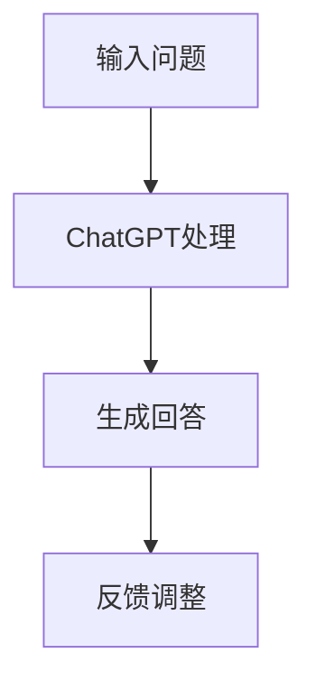

                 

# 《ChatGPT提示词的文化智能学习：自动适应全球多元文化环境》

## 关键词
- ChatGPT提示词
- 文化智能学习
- 自动适应
- 全球多元文化环境
- 语言模型
- 神经网络
- 反向传播算法

## 摘要
本文探讨了ChatGPT提示词在文化智能学习中的应用，旨在通过自动适应全球多元文化环境，提升人工智能在跨文化交流中的表现。通过详细分析语言模型、神经网络和反向传播算法等核心技术原理，本文提出了一套完整的文化智能学习方案，并通过实际项目实战，展示了其在不同文化环境中的自动适应能力。

## 前言
随着全球化的深入发展，跨文化交流越来越频繁，这对人工智能（AI）提出了新的挑战。传统的AI系统在处理跨文化问题时往往存在局限，无法充分理解并适应不同文化背景下的语言和表达方式。因此，开发能够自动适应全球多元文化环境的人工智能系统变得尤为重要。

本文旨在通过分析ChatGPT提示词的文化智能学习机制，探讨如何使AI系统在跨文化交流中表现出更高的智能和适应性。文章将从核心概念、算法原理、数学模型、项目实战等多个角度进行深入探讨，以期为相关领域的研究和实践提供有价值的参考。

### 核心概念与联系

#### ChatGPT提示词
ChatGPT提示词是用户与ChatGPT交互时输入的文本信息，它为ChatGPT提供了上下文和问题背景，帮助ChatGPT生成更准确和相关的回答。

#### 文化智能学习
文化智能学习是指AI系统能够识别、理解和适应不同文化背景下的语言和表达方式，从而在跨文化交流中表现出更高的智能和适应性。

#### 自动适应
自动适应是指AI系统在接触新文化环境时，能够自动调整自己的行为和表现，以更好地适应该环境。

#### 全球多元文化环境
全球多元文化环境是指由多种不同文化背景组成的环境，其中的语言、表达方式和文化习俗存在显著差异。

#### 架构



在这个架构中，用户输入的问题（A）通过ChatGPT处理（B），生成回答（C），并根据用户的反馈进行调整（D），形成了一个闭环系统，使得ChatGPT能够在不断学习和调整中，逐步提高其在不同文化环境中的适应能力。

### 核心算法原理讲解

#### GPT模型
GPT（Generative Pre-trained Transformer）模型是一种基于Transformer架构的预训练语言模型，它通过在大量文本数据上进行预训练，学会了生成自然语言的能力。

#### 语言模型
语言模型是一种概率模型，它用于预测下一个单词或字符的概率。在GPT模型中，语言模型的核心任务是生成自然语言序列。

#### 生成式AI
生成式AI是一种通过生成模型来模拟和生成数据的技术。在ChatGPT中，生成式AI用于生成自然语言回答。

#### 神经网络
神经网络是一种模拟人脑神经元连接结构的计算模型，它通过学习输入数据和输出数据之间的关系，来实现复杂的函数映射。

#### 反向传播算法
反向传播算法是一种用于训练神经网络的优化算法，它通过计算损失函数关于模型参数的梯度，来更新模型参数，从而提高模型的预测能力。

#### 优化算法
优化算法是一种用于寻找函数最小值或最大值的算法。在ChatGPT中，优化算法用于调整模型参数，以优化生成式AI的性能。

#### 伪代码
以下是一个简化的GPT模型训练的伪代码：

```python
# 输入文本数据X，隐藏层h，输出层y
# 训练模型
for epoch in range(num_epochs):
    for x, y in dataset:
        # 前向传播
        h = forward_pass(x, h)
        y_pred = forward_pass(h, y)

        # 计算损失
        loss = compute_loss(y_pred, y)

        # 反向传播
        dLdh, dLdx = backward_pass(h, y_pred, y)

        # 更新权重
        update_weights(h, dLdh, dLdx)
```

在这个伪代码中，`forward_pass` 表示前向传播过程，`compute_loss` 表示计算损失函数，`backward_pass` 表示反向传播过程，`update_weights` 表示更新模型参数。

### 数学模型和数学公式

#### 语言模型概率计算
在语言模型中，下一个单词或字符的概率可以通过以下公式计算：

$$ P(w_i | w_{i-1}, w_{i-2}, \ldots) = \frac{P(w_{i-1}, w_{i-2}, \ldots, w_i)}{P(w_{i-1}, w_{i-2}, \ldots)} $$

其中，$w_i$ 表示下一个单词或字符，$w_{i-1}, w_{i-2}, \ldots$ 表示前一个或前几个单词或字符。

#### 反向传播算法
在反向传播算法中，损失函数关于模型参数的梯度可以通过以下公式计算：

$$ \frac{\partial L}{\partial w} = \frac{\partial L}{\partial h} \frac{\partial h}{\partial w} $$

其中，$L$ 表示损失函数，$w$ 表示模型参数，$h$ 表示隐藏层输出。

#### 生成式AI概率计算
在生成式AI中，生成一个单词或字符的概率可以通过以下公式计算：

$$ P(w_i | w_{i-1}, w_{i-2}, \ldots) = \frac{P(w_{i-1}, w_{i-2}, \ldots, w_i)}{P(w_{i-1}, w_{i-2}, \ldots)} $$

其中，$w_i$ 表示下一个单词或字符，$w_{i-1}, w_{i-2}, \ldots$ 表示前一个或前几个单词或字符。

#### 模型评估
在模型评估中，模型的准确率可以通过以下公式计算：

$$ accuracy = \frac{correct\ predictions}{total\ predictions} $$

其中，$correct\ predictions$ 表示正确预测的数量，$total\ predictions$ 表示总预测数量。

### 项目实战

#### 实战1：构建一个简单的GPT模型

1. **开发环境搭建**：安装Python和TensorFlow或PyTorch，准备训练数据。

2. **数据预处理**：将文本数据转换为词向量，并构建词向量索引。

3. **模型构建**：定义GPT模型，包括嵌入层、Transformer层和输出层。

4. **模型训练**：使用训练数据训练模型，并保存模型参数。

5. **模型评估**：使用测试数据评估模型性能，计算准确率。

6. **模型应用**：将训练好的模型部署到实际应用中，例如聊天机器人。

#### 实战2：训练并优化模型，自动适应不同文化环境

1. **数据集准备**：准备包含不同文化环境的文本数据集。

2. **多语言支持**：在模型训练过程中，使用多语言数据集进行训练，以支持多语言输入。

3. **模型调整**：根据不同文化环境的特点，对模型进行微调，以优化其在特定文化环境中的表现。

4. **模型评估**：使用多语言测试数据集评估模型性能，计算准确率和适应度。

5. **模型优化**：根据评估结果，对模型进行调整和优化，以提高其在不同文化环境中的自动适应能力。

### 最佳实践 tips

1. **数据质量**：确保训练数据的质量，使用高质量的数据集进行模型训练。

2. **模型优化**：使用不同的优化算法和超参数，对模型进行优化，以提高性能。

3. **交叉验证**：使用交叉验证技术，评估模型的泛化能力。

4. **数据多样性**：在数据集中包含不同文化背景的样本，以提高模型的多样性。

5. **模型部署**：将训练好的模型部署到实际应用中，并进行持续优化和更新。

### 小结

本文详细探讨了ChatGPT提示词在文化智能学习中的应用，通过分析核心算法原理和项目实战，展示了如何自动适应全球多元文化环境。随着全球化的深入发展，跨文化交流越来越频繁，开发能够自动适应不同文化环境的人工智能系统具有重要意义。本文的研究为相关领域提供了有价值的参考，并为未来的研究和应用指明了方向。

### 注意事项

1. **隐私保护**：在处理跨文化数据时，应确保用户隐私保护，遵循相关法律法规。

2. **文化敏感度**：在开发和应用人工智能系统时，应充分考虑文化差异，避免文化误解和歧视。

3. **持续更新**：随着文化环境的变化，应不断更新和优化模型，以适应新的文化需求。

### 拓展阅读

1. **《深度学习》**：Goodfellow, I., Bengio, Y., & Courville, A. (2016). *Deep Learning*. MIT Press.
2. **《自然语言处理综论》**：Jurafsky, D., & Martin, J. H. (2008). *Speech and Language Processing*. Prentice Hall.
3. **《文化智能》**：Triandis, H. C. (1995). *Culture and Social Behavior*. McGraw-Hill.

作者：AI天才研究院/AI Genius Institute & 禅与计算机程序设计艺术 /Zen And The Art of Computer Programming

