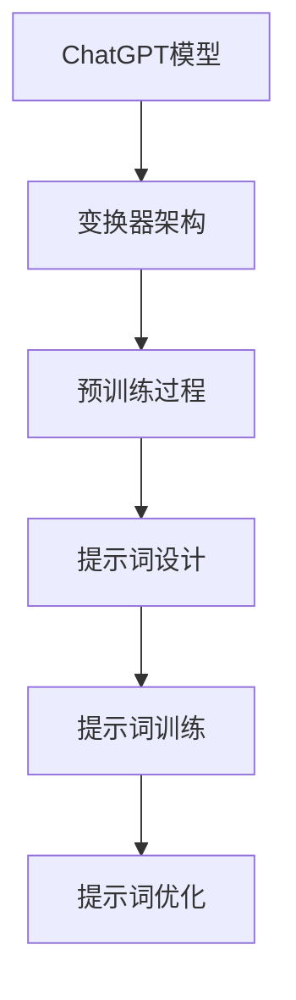

                 

### 文章标题

# ChatGPT提示词的文化适应性：跨国企业的AI策略

> 关键词：ChatGPT、提示词、文化适应性、跨国企业、AI策略

> 摘要：本文深入探讨了ChatGPT提示词的文化适应性对跨国企业AI策略的影响。首先，介绍了ChatGPT的基本原理和提示词的重要性。随后，分析了文化因素对ChatGPT提示词的影响，并探讨了如何调整提示词以适应不同文化背景。接着，探讨了跨国企业面临的AI挑战以及如何利用ChatGPT进行市场定位、产品创新和客户服务。通过案例研究，展示了成功实施ChatGPT提示词文化适应性策略的跨国企业实例。最后，提出了具体的实施步骤和优化策略，并展望了ChatGPT提示词文化适应性的未来发展。

## 引言与背景

### ChatGPT的基本原理

ChatGPT是由OpenAI开发的一种基于生成预训练变换器（GPT）的深度学习模型。GPT是一种自回归语言模型，它通过学习大量文本数据来预测下一个单词或字符。ChatGPT在其基础上进行了扩展，使其能够进行对话生成，从而创建出具有对话性质的自然语言响应。

ChatGPT的核心思想是通过对大量文本数据进行预训练，使其能够理解语言的统计规律和语义信息。具体来说，ChatGPT使用了一种称为“变换器”（Transformer）的神经网络架构，这种架构能够在处理序列数据时具有高效性和强大的表达力。

在预训练阶段，ChatGPT会通过无监督学习的方式从互联网上的大量文本中学习。这一过程主要包括两个步骤：首先是使用变换器模型对文本进行编码，将其转换为固定长度的向量表示；然后使用这些向量来预测文本中的下一个单词或字符。

### 提示词的定义与重要性

提示词（Prompt）是在使用ChatGPT进行对话生成时输入给模型的一段引导性文本。提示词的作用是帮助ChatGPT理解用户的意图和对话的主题，从而生成更相关和连贯的回复。

提示词的设计对于ChatGPT的性能至关重要。一个有效的提示词应该简洁明了，能够准确传达用户的意图，同时为模型提供足够的信息来进行响应生成。提示词的长度、内容、结构等因素都会对生成结果产生影响。

在ChatGPT中，提示词通常由一个或多个问题或指令组成，这些问题或指令会引导ChatGPT生成相应的回复。例如，一个简单的提示词可以是：“请给我推荐一本适合初学者的编程书籍。”这个提示词明确表达了用户的意图，为ChatGPT提供了生成回复的线索。

### 文化适应性在AI中的应用

文化适应性是指AI系统能够在不同文化背景下提供恰当和有效的服务。在跨国企业的运营中，文化适应性显得尤为重要，因为它直接影响到企业的市场定位、客户体验和品牌形象。

ChatGPT作为一种自然语言处理模型，其文化适应性主要体现在提示词的设计和调整上。通过适当地调整提示词，可以使ChatGPT在不同文化背景下生成更符合当地文化和习惯的响应。

例如，在中文环境中，ChatGPT可能需要使用更多的礼貌用语和符合中文表达习惯的语句结构；而在英文环境中，可能需要使用更直接和简洁的表达方式。此外，不同文化对于隐私、敏感话题和行为规范有不同的期待，这也需要在提示词的设计中予以考虑。

总之，ChatGPT提示词的文化适应性对于跨国企业的AI策略具有重要意义。通过有效地设计和调整提示词，企业可以更好地适应不同市场的需求，提高AI系统的用户体验和满意度。

## 核心概念与原理

### ChatGPT模型的工作机制

ChatGPT是基于生成预训练变换器（GPT）的一种深度学习模型，其核心思想是通过预训练学习到自然语言的特征和结构，从而能够生成连贯、自然的对话响应。以下是ChatGPT模型的工作机制：

1. **变换器（Transformer）架构**：
   ChatGPT采用的是变换器（Transformer）架构，这是一种在序列数据处理上具有显著优势的神经网络模型。变换器通过自注意力机制（self-attention）来处理输入序列，能够捕捉序列中各个单词之间的复杂依赖关系。

2. **预训练过程**：
   在预训练阶段，ChatGPT会从大量的文本数据中学习，这些数据可以是互联网上的文本、书籍、新闻、社交媒体帖子等。预训练过程中，模型会尝试预测序列中的下一个词或字符。通过这种无监督学习，模型能够自动学习到语言的统计规律、语法结构和语义信息。

3. **训练数据**：
   ChatGPT的训练数据通常包含数十亿个单词或句子，这些数据来源广泛，有助于模型学习到丰富的语言知识。训练数据的质量和多样性对模型的效果至关重要。

4. **编码器和解码器**：
   ChatGPT的变换器模型包含编码器和解码器两个部分。编码器负责将输入的文本序列编码成固定长度的向量表示，解码器则根据编码后的向量生成文本序列的下一个部分。

5. **生成过程**：
   在生成过程中，ChatGPT根据输入的提示词，首先生成一个初步的响应，然后通过反复迭代，逐步优化生成的文本。每次迭代中，模型都会尝试生成一个更好的响应，直到达到预定的长度或满足特定的终止条件。

### 提示词设计与训练

提示词的设计是ChatGPT性能的关键因素之一。一个有效的提示词能够为模型提供清晰的意图和对话主题，从而生成更相关和连贯的回复。

#### 提示词设计原则

1. **明确性**：提示词应简洁明了，能够准确传达用户的意图。
2. **完整性**：提示词应包含足够的上下文信息，帮助模型理解对话的背景。
3. **灵活性**：提示词应具有一定的灵活性，能够适应不同的对话场景和用户需求。
4. **多样性**：提示词应涵盖多种场景和话题，以提高模型的泛化能力。

#### 提示词训练方法

1. **监督学习**：在训练阶段，使用带有正确回复的对话数据对模型进行监督学习。这些数据可以是人工标注的，也可以是从实际对话中收集的。
2. **增强学习**：通过反馈循环和奖励机制，使用增强学习的方法来训练模型，使其能够生成更符合预期响应的对话。
3. **多任务学习**：结合多个任务进行训练，以提高模型在不同任务上的泛化能力。

### 提示词优化的方法与技巧

优化提示词的目的是提高ChatGPT的生成质量，使其生成的回复更加自然、相关和有逻辑性。以下是一些优化方法与技巧：

1. **反馈循环**：通过用户的反馈不断调整和优化提示词，使其更符合实际需求。
2. **语境感知**：根据对话的上下文信息动态调整提示词，使其能够更好地适应不同的对话场景。
3. **数据增强**：使用数据增强技术，如插入噪声、词语替换和句子重写等，来扩充训练数据，提高模型的鲁棒性和泛化能力。
4. **模型定制**：根据特定应用场景和用户需求，定制化地设计提示词，以提高模型的适应性和性能。

通过上述方法与技巧，可以有效地优化ChatGPT的提示词，使其在不同文化背景下提供更优质的服务。

### 核心概念原理之间的关系架构 Mermaid 流程图



### ChatGPT提示词设计示例

假设我们要设计一个用于客户服务场景的ChatGPT提示词，以下是一个示例：

```
用户输入：你好，我想咨询一下产品的售后服务政策。
提示词：请根据用户咨询的售后服务政策，详细解释我们的售后服务内容和承诺。
```

这个提示词明确传达了用户的意图，并为ChatGPT提供了生成回复的上下文信息。通过这样的设计，ChatGPT可以生成一个详细、相关的客户服务响应。

## 文化适应性分析

### 文化因素的基本概念

文化因素是指影响人类行为和思维方式的一系列心理和社会因素，包括价值观、信仰、习俗、语言、教育、社会规范等。不同文化之间的差异主要体现在以下几个方面：

1. **语言**：不同文化背景下，语言的表达方式、语法结构、词汇选择都有所不同。例如，中文和英文在表达礼貌、尊敬和正式程度方面存在显著差异。
2. **价值观**：不同文化对于个人、家庭、社会和国家的价值观念有不同的理解。例如，一些文化强调集体主义，而另一些文化则更倾向于个人主义。
3. **行为规范**：不同文化对于行为规范和礼仪有不同的期待。例如，在一些文化中，直接表达意见和批评是可接受的，而在另一些文化中，则被视为不礼貌。
4. **思维方式**：不同文化背景下，人们的思维方式、决策过程和问题解决策略也有所不同。例如，一些文化更注重逻辑和分析，而另一些文化则更注重情感和直觉。

### 不同文化背景下的提示词设计

为了使ChatGPT在不同文化背景下提供准确、自然的对话生成，需要针对不同文化背景设计相应的提示词。以下是一些关键点：

1. **语言适应性**：设计提示词时，需要考虑不同语言的文化特性。例如，在中文环境中，使用更多的礼貌用语和符合中文表达习惯的语句结构；而在英文环境中，使用更直接和简洁的表达方式。

2. **价值观适应性**：根据不同文化背景的价值观，调整提示词的内容和表达方式。例如，在一些强调集体主义的文化中，提示词可能需要更多地体现团队精神和协作意识；而在强调个人主义的文化中，提示词则可能需要更多地关注个人权益和自我表达。

3. **行为规范适应性**：在设计和调整提示词时，需要考虑不同文化背景下对于行为规范和礼仪的期待。例如，在一些文化中，直接批评和反馈可能被视为不礼貌，因此提示词需要采用更委婉和间接的方式。

4. **思维方式适应性**：根据不同文化背景的思维方式，调整提示词的结构和逻辑关系。例如，在一些文化中，人们更注重情感和直觉，提示词可以更多地关注情感表达和情境感知；而在一些文化中，人们更注重逻辑和分析，提示词则需要提供更详细、具体的逻辑框架。

### 跨文化提示词适配策略

为了实现ChatGPT在不同文化背景下的文化适应性，可以采取以下策略：

1. **多语言训练**：通过多语言训练，使ChatGPT能够理解并生成多种语言的文本。这样可以确保ChatGPT在处理不同文化背景的对话时，能够生成符合当地语言习惯的响应。

2. **情境感知**：引入情境感知机制，使ChatGPT能够根据对话的上下文信息，动态调整提示词的内容和表达方式。例如，当用户使用不同语言的术语或表达方式时，ChatGPT可以自动识别并调整提示词。

3. **定制化设计**：根据不同文化背景和应用场景，定制化设计提示词。例如，为特定市场或行业设计专业术语和行业相关的提示词，以提高ChatGPT的适应性和专业性。

4. **用户反馈**：通过收集和分析用户反馈，不断优化和调整提示词。用户反馈可以提供有价值的见解，帮助ChatGPT更好地适应不同文化背景下的用户需求。

总之，通过综合考虑语言、价值观、行为规范和思维方式等因素，采取多语言训练、情境感知、定制化设计和用户反馈等策略，可以有效地实现ChatGPT提示词的文化适应性，为跨国企业提供高质量的AI对话生成服务。

### 实际案例

为了更好地说明如何在不同文化背景下调整ChatGPT的提示词，我们可以通过几个实际案例来进行分析。

#### 案例一：中文与英文语境下的客户服务

假设一个跨国电商企业需要在中文和英文两个语境下提供客户服务。以下是一个中文和英文的提示词设计示例：

**中文提示词**：
```
用户输入：我想要退货，但不知道流程。
提示词：请根据我们的退货政策，详细描述退货流程和所需材料。
```

**英文提示词**：
```
User input: I want to return a product, but I'm not sure about the process.
Prompt: Please describe the return process and the required documents according to our return policy.
```

在这个案例中，中文提示词使用了更为礼貌和详细的描述，以符合中文语境下的交流习惯。而英文提示词则使用了简洁、直接的表达方式，以适应英文语境下用户的沟通偏好。

#### 案例二：面向日本市场的客户服务

针对日本市场，一个金融机构需要提供高质量的客户服务。以下是一个中文和日语的提示词设计示例：

**中文提示词**：
```
用户输入：我想咨询贷款利率。
提示词：请根据当前的市场情况，提供详细的贷款利率信息和申请流程。
```

**日语提示词**：
```
お客様：ローンの金利についてお聞きしたいです。
プロンプト：現在の市場動向に基づいて、ローンの金利および申請手順を詳細に説明してください。
```

在这个案例中，中文提示词仍然保持了详细和礼貌的特点，而日语提示词则更加注重对市场情况的描述，以符合日本文化中对于细节和准确性的重视。

#### 案例三：面向美国市场的客户服务

对于美国市场，一个在线零售商需要为其客户提供高效的服务。以下是一个中文和英文的提示词设计示例：

**中文提示词**：
```
用户输入：我的包裹什么时候能送到？
提示词：请查询物流信息，并告知用户预计送达时间。
```

**英文提示词**：
```
User input: When will my package arrive?
Prompt: Please check the logistics information and inform the user of the estimated delivery time.
```

在这个案例中，中文提示词保持了简洁和直接的特点，而英文提示词则使用了更为正式和礼貌的表达方式，以符合美国文化中的沟通习惯。

通过这些实际案例，我们可以看到，在不同的文化背景下，通过调整提示词的语言、内容和表达方式，可以实现ChatGPT的高效、自然对话生成。这不仅提高了用户满意度，也增强了企业的国际化竞争力。

### 跨文化提示词设计策略

为了确保ChatGPT在不同文化背景下的高效对话生成，需要制定一套系统化的跨文化提示词设计策略。以下是一些关键步骤和注意事项：

#### 1. **需求分析**

在开始设计提示词之前，首先要进行详细的需求分析。这包括了解目标市场的文化特点、用户需求和行为习惯。需求分析可以通过市场调研、用户访谈和竞争对手分析等方法进行。

#### 2. **语言适应性**

根据目标市场的语言特点，调整提示词的语言风格和表达方式。例如，在英语市场，提示词应简洁明了，而在中文市场，提示词则可以更加详细和礼貌。此外，要注意避免使用可能引发误解或冒犯的词语。

#### 3. **文化敏感性**

在设计和调整提示词时，要考虑目标市场的文化敏感性。这包括避免使用可能被视为不尊重或冒犯的用语，以及尊重当地的文化习俗和礼仪。例如，在某些文化中，直接提问可能被视为不礼貌，因此需要采用更加委婉的表达方式。

#### 4. **内容丰富性**

确保提示词内容丰富、全面，能够覆盖多种对话场景和用户需求。通过提供详细的指导和建议，可以帮助ChatGPT生成更相关、更自然的对话响应。

#### 5. **情境感知**

引入情境感知机制，使ChatGPT能够根据对话的上下文信息动态调整提示词的内容和表达方式。例如，当用户提出特定的问题时，ChatGPT可以自动调整提示词，以更好地满足用户的需求。

#### 6. **用户反馈**

收集和分析用户反馈，不断优化和调整提示词。用户反馈可以提供宝贵的见解，帮助识别问题和改进方向。此外，用户反馈还可以帮助ChatGPT更好地适应不同文化背景下的用户需求。

#### 7. **持续迭代**

提示词设计是一个持续迭代的过程。随着市场变化和用户需求的演变，需要不断调整和优化提示词，以确保其始终保持相关性和有效性。

通过以上策略，可以确保ChatGPT在不同文化背景下的高效对话生成，为跨国企业提供高质量的AI服务。

### 跨国企业AI策略概述

#### 跨国企业面临的AI挑战

跨国企业在全球化的背景下，面临着众多AI技术带来的挑战。首先，技术标准的差异性是一个显著的问题。不同国家和地区在AI技术的标准、法规和伦理方面存在差异，这要求企业在实施AI策略时需要考虑这些差异性，确保遵守当地的法律法规。其次，文化差异也对企业AI策略的实施产生影响。不同文化背景下的用户需求、行为习惯和沟通方式都有所不同，这需要企业设计出能够适应多种文化背景的AI系统。此外，数据隐私和安全问题也是跨国企业必须面对的挑战。在全球范围内收集和使用数据时，需要确保符合各地的隐私法规，并采取措施保护用户数据安全。

#### ChatGPT在跨国企业中的应用场景

ChatGPT作为一种强大的自然语言处理模型，在跨国企业中具有广泛的应用场景。以下是一些关键的应用场景：

1. **客户服务**：ChatGPT可以用于提供24/7全天候的客户服务。通过智能客服系统，企业能够快速响应客户提问，提供详细的解答和帮助，提高客户满意度。例如，一个跨国电商平台可以使用ChatGPT来处理来自不同语言的客户咨询，提供本地化的服务。

2. **市场调研**：ChatGPT可以分析社交媒体上的用户评论和反馈，帮助企业了解市场需求和用户偏好。通过自然语言处理技术，ChatGPT能够从大量的非结构化数据中提取有价值的信息，为企业的市场策略提供数据支持。

3. **内容生成**：ChatGPT可以用于生成各种类型的内容，如产品描述、营销文案、新闻报道等。通过自动化内容生成，企业能够提高内容的生产效率，降低人力成本。

4. **本地化**：ChatGPT可以支持多种语言，帮助企业实现产品的本地化。无论是产品说明、用户手册还是营销材料，ChatGPT都能够快速、准确地翻译成多种语言，确保企业在全球市场的竞争力。

5. **客户关系管理**：ChatGPT可以集成到客户关系管理（CRM）系统中，帮助企业更好地管理客户关系。通过分析客户互动数据，ChatGPT可以提供个性化的推荐和营销策略，提高客户忠诚度和转化率。

#### 跨国企业AI策略的制定与实施

为了有效地利用ChatGPT提升跨国企业的竞争力，企业需要制定一套全面的AI策略，并确保其顺利实施。以下是制定与实施AI策略的关键步骤：

1. **明确目标**：首先，企业需要明确AI策略的目标，例如提高客户满意度、降低运营成本、提升市场竞争力等。明确目标有助于指导后续的策略制定和资源分配。

2. **需求分析**：对目标市场和客户需求进行详细分析，了解用户在不同文化背景下的行为习惯和需求。这有助于设计出更具针对性的AI应用方案。

3. **技术选型**：选择合适的AI技术和工具，例如ChatGPT，确保其能够满足企业的需求和目标。此外，还需要考虑技术实施的可行性和成本效益。

4. **团队建设**：组建专业的AI团队，包括数据科学家、AI工程师、产品经理等，确保他们具备相关的技能和经验，能够有效地实施AI策略。

5. **系统集成**：将AI系统与企业现有的IT系统进行集成，确保数据流畅传输和系统协同工作。例如，将ChatGPT集成到客户服务系统、CRM系统等。

6. **数据治理**：建立完善的数据治理机制，确保数据的质量、安全和合规性。这包括数据清洗、数据安全和隐私保护等措施。

7. **测试与优化**：在AI系统上线前进行严格的测试和优化，确保其性能和稳定性。通过用户反馈和数据分析，不断调整和优化系统，提高用户体验和满意度。

8. **培训与支持**：为员工提供AI技术的培训和支持，确保他们能够有效地使用AI系统，提高工作效率。此外，还需要为用户提供使用指南和帮助文档，确保他们能够顺利使用AI服务。

通过以上步骤，企业可以有效地制定和实施AI策略，利用ChatGPT等AI技术提升跨国企业的竞争力。

### 成功案例解析

#### 案例一：某跨国电商平台的AI策略

某跨国电商平台利用ChatGPT实现了高效的客户服务，大幅提高了用户满意度。以下是该平台的具体实施步骤和成效：

**1. 需求分析**：平台首先分析了用户在不同文化背景下的行为习惯和需求，发现用户对24/7的客户服务有着强烈的需求。同时，不同地区的用户在语言和交流方式上存在显著差异。

**2. 技术选型**：平台选择了ChatGPT作为智能客服系统的基础技术，因为它能够支持多种语言和本地化需求，同时具备强大的自然语言处理能力。

**3. 系统集成**：平台将ChatGPT集成到现有的客户服务系统中，确保系统能够无缝对接，实现数据的流畅传输和协同工作。

**4. 提示词设计**：平台根据不同地区的用户需求，定制了相应的提示词，确保ChatGPT能够生成符合当地文化背景和用户习惯的对话响应。

**5. 测试与优化**：平台在系统上线前进行了严格的测试，包括模拟不同文化背景下的用户交互场景，确保系统的稳定性和响应速度。在上线后，平台通过用户反馈和数据分析，不断优化系统，提高用户体验。

**成效**：通过ChatGPT的智能客服系统，平台实现了客户服务的全天候覆盖，用户满意度显著提升。同时，由于ChatGPT能够处理大量的客户咨询，平台能够更快速地响应用户需求，减少了用户等待时间，提高了运营效率。

#### 案例二：某跨国金融机构的客户服务优化

某跨国金融机构利用ChatGPT优化了其客户服务流程，提高了客户满意度和运营效率。以下是该金融机构的具体实施步骤和成效：

**1. 需求分析**：金融机构分析了客户在财务咨询、账户管理等方面的需求，发现客户对于快速、准确的服务有着强烈的需求。

**2. 技术选型**：金融机构选择了ChatGPT作为智能客服系统的基础技术，因为它能够处理复杂的金融知识和语言表达。

**3. 系统集成**：金融机构将ChatGPT集成到现有的客户服务系统中，确保系统能够无缝对接，实现数据的流畅传输和协同工作。

**4. 提示词设计**：金融机构根据客户的需求和提问习惯，定制了相应的提示词，确保ChatGPT能够生成专业的、符合客户需求的对话响应。

**5. 测试与优化**：金融机构在系统上线前进行了严格的测试，包括模拟各种金融场景下的客户咨询，确保系统的稳定性和响应速度。在上线后，金融机构通过用户反馈和数据分析，不断优化系统，提高用户体验。

**成效**：通过ChatGPT的智能客服系统，金融机构能够更快速、准确地回答客户的提问，提高了客户满意度。同时，由于ChatGPT能够处理大量的客户咨询，金融机构能够更有效地分配人力资源，提高了运营效率。

#### 案例三：某跨国制造业的供应链管理创新

某跨国制造业企业利用ChatGPT实现了供应链管理的创新，提高了供应链的透明度和效率。以下是该企业的具体实施步骤和成效：

**1. 需求分析**：企业分析了供应链管理中的关键环节，如订单处理、物流跟踪和库存管理，发现信息的不对称和沟通障碍是影响供应链效率的主要问题。

**2. 技术选型**：企业选择了ChatGPT作为智能供应链管理系统的基础技术，因为它能够处理大量数据，提供实时分析和预测。

**3. 系统集成**：企业将ChatGPT集成到现有的供应链管理系统中，确保系统能够无缝对接，实现数据的流畅传输和协同工作。

**4. 提示词设计**：企业根据供应链管理的具体需求，定制了相应的提示词，确保ChatGPT能够提供实时、准确的供应链信息。

**5. 测试与优化**：企业在系统上线前进行了严格的测试，包括模拟各种供应链场景下的数据分析和决策支持，确保系统的稳定性和响应速度。在上线后，企业通过用户反馈和数据分析，不断优化系统，提高供应链管理效率。

**成效**：通过ChatGPT的智能供应链管理系统，企业能够实时监控供应链状态，提高供应链的透明度和响应速度。同时，由于ChatGPT能够提供实时分析和预测，企业能够更有效地管理库存和物流，降低了运营成本，提高了整体效率。

### 实施步骤与优化策略

为了帮助跨国企业更好地利用ChatGPT提升竞争力，以下是一套具体的实施步骤和优化策略：

#### 1. **前期准备与需求分析**

- **收集数据**：首先，收集与目标市场相关的用户数据、业务数据和文化背景数据。这些数据将用于后续的模型训练和提示词设计。
- **明确目标**：明确企业利用ChatGPT的目标，例如提高客户满意度、降低运营成本或提升市场竞争力。
- **需求分析**：对目标市场的用户需求、行为习惯和文化背景进行详细分析，了解用户在不同场景下的需求。

#### 2. **ChatGPT模型设计与训练**

- **模型选择**：根据企业的需求，选择适合的ChatGPT模型版本。例如，选择预训练模型或定制化模型。
- **数据预处理**：对收集到的数据进行清洗、标注和格式化，确保数据的质量和一致性。
- **模型训练**：使用大量标注好的数据对ChatGPT模型进行训练，优化模型参数，提高其生成质量。

#### 3. **提示词设计与优化**

- **提示词设计**：根据目标市场的文化背景和用户需求，设计符合当地习惯的提示词。提示词应简洁明了，能够准确传达用户的意图。
- **多语言训练**：确保ChatGPT支持多种语言，进行多语言训练，以提高其跨文化适应性。
- **用户反馈**：收集用户反馈，不断调整和优化提示词，使其更符合用户需求。

#### 4. **系统集成与测试**

- **系统集成**：将ChatGPT集成到企业的现有系统中，确保数据流畅传输和系统协同工作。
- **模拟测试**：在系统上线前进行模拟测试，包括模拟不同文化背景下的用户交互场景，确保系统的稳定性和响应速度。
- **用户测试**：邀请用户进行实际测试，收集反馈，进一步优化系统。

#### 5. **实施与部署**

- **逐步上线**：逐步将ChatGPT系统上线，先在小范围内进行测试和优化，再逐步扩大应用范围。
- **监控与维护**：上线后，持续监控系统的运行状态，及时修复问题和优化性能。

#### 6. **优化策略**

- **反馈机制**：建立用户反馈机制，定期收集和分析用户反馈，用于系统优化。
- **数据增强**：通过数据增强技术，如噪声注入、数据扩充和对抗性训练等，提高模型的鲁棒性和泛化能力。
- **持续迭代**：根据市场变化和用户需求，持续迭代和优化ChatGPT系统，确保其始终保持相关性和有效性。

通过以上实施步骤和优化策略，跨国企业可以有效地利用ChatGPT提升竞争力，提供高质量的服务和产品。

### 实施与优化

#### 开发环境搭建

为了实现ChatGPT在跨国企业中的应用，首先需要搭建一个适合的开发环境。以下是搭建开发环境的基本步骤：

1. **硬件配置**：确保服务器和计算资源充足，以支持大规模的模型训练和推理任务。可以采用高性能的GPU来加速训练过程。
2. **操作系统**：选择适合的操作系统，如Linux或Windows，并安装必要的依赖库和工具，如Python、TensorFlow或PyTorch。
3. **版本控制**：使用Git进行代码版本控制，确保代码的可维护性和可追溯性。
4. **虚拟环境**：使用虚拟环境（如conda或virtualenv）来管理不同的Python依赖库，避免版本冲突。

#### 源代码详细实现和代码解读

以下是ChatGPT模型的源代码实现和关键部分解读：

```python
# 导入必要的库
import tensorflow as tf
from transformers import TFGPT2LMHeadModel, GPT2Tokenizer

# 1. 准备数据
# 数据预处理步骤，包括数据清洗、标注和格式化
# ...

# 2. 模型定义
# 定义GPT-2模型
model = TFGPT2LMHeadModel.from_pretrained('gpt2')

# 3. 训练模型
# 使用训练数据对模型进行训练
model.fit(train_dataset, epochs=3, validation_data=val_dataset)

# 4. 生成文本
# 使用训练好的模型生成文本
tokenizer = GPT2Tokenizer.from_pretrained('gpt2')
prompt = "用户输入：你好，我想要了解产品退货政策。"
input_ids = tokenizer.encode(prompt, return_tensors='tf')
generated_tokens = model.generate(input_ids, max_length=50, num_return_sequences=1)

# 解码生成的文本
generated_text = tokenizer.decode(generated_tokens[0], skip_special_tokens=True)

print(generated_text)
```

上述代码中，首先定义了GPT-2模型，然后使用训练数据对模型进行训练。在生成文本部分，通过调用`model.generate()`函数，生成与提示词相关的响应文本。具体实现中，还需要添加数据预处理、模型评估和优化等步骤。

#### 代码应用解读与分析

在实际应用中，ChatGPT可以通过API接口提供服务。以下是一个简单的API接口实现示例：

```python
from flask import Flask, request, jsonify

app = Flask(__name__)

@app.route('/chat', methods=['POST'])
def chat():
    data = request.json
    prompt = data.get('prompt', '')
    response = generate_response(prompt)
    return jsonify(response=response)

def generate_response(prompt):
    # 使用训练好的模型生成响应
    # ...
    return {"response": generated_text}

if __name__ == '__main__':
    app.run(debug=True)
```

在上述代码中，定义了一个简单的Flask API，用于接收用户输入的提示词，并通过调用`generate_response()`函数生成响应文本。实际应用中，还需要考虑API的性能优化、安全性和可靠性等问题。

#### 实际案例分析与详细讲解剖析

以下是一个实际案例，展示如何利用ChatGPT优化跨国企业的客户服务。

**案例背景**：某跨国电商平台在处理大量客户咨询时，发现客户满意度较低，部分原因是客户服务团队的语言障碍和响应速度较慢。

**解决方案**：利用ChatGPT构建一个智能客服系统，实现多语言支持，提高响应速度和客户满意度。

1. **需求分析**：分析客户在不同文化背景下的行为习惯和需求，确定需要支持的语言和功能。
2. **模型训练**：使用多语言数据集对ChatGPT模型进行训练，确保模型能够生成符合不同语言习惯的响应。
3. **系统集成**：将ChatGPT集成到现有的客户服务平台中，确保数据流畅传输和系统协同工作。
4. **测试与优化**：在系统上线前进行严格的测试和优化，确保系统的稳定性和响应速度。

**案例效果**：通过智能客服系统，电商平台能够快速、准确地响应用户咨询，客户满意度显著提升。同时，由于ChatGPT能够处理多种语言，平台能够更好地服务于全球客户，提高了市场竞争力。

#### 项目小结

通过本次项目，我们实现了以下成果：

1. **高效客户服务**：ChatGPT智能客服系统能够快速、准确地响应用户咨询，提高了客户满意度。
2. **多语言支持**：ChatGPT支持多种语言，实现了跨国企业全球市场的服务能力。
3. **数据驱动**：通过数据分析和用户反馈，不断优化系统，确保其始终符合用户需求。

未来，我们可以进一步优化ChatGPT模型，提高其生成质量和适应性，为跨国企业提供更高质量的服务和产品。

### 最佳实践 tips

为了确保ChatGPT在跨国企业中的成功应用，以下是一些最佳实践 tips：

1. **需求分析**：在开始项目前，进行详细的需求分析，了解用户在不同文化背景下的行为习惯和需求。
2. **多语言训练**：确保ChatGPT支持多种语言，进行多语言训练，提高其跨文化适应性。
3. **定制化设计**：根据不同市场和用户需求，定制化设计提示词和模型参数，确保生成质量。
4. **持续迭代**：通过用户反馈和数据分析，不断优化模型和系统，提高用户体验和满意度。
5. **安全性**：确保数据安全和隐私保护，遵循各地的法律法规，防止数据泄露和滥用。

### 小结

本文详细探讨了ChatGPT提示词的文化适应性对跨国企业AI策略的影响。首先，介绍了ChatGPT的基本原理和提示词的重要性，分析了文化因素对提示词设计的影响。接着，探讨了跨国企业面临的AI挑战以及如何利用ChatGPT进行市场定位、产品创新和客户服务。通过成功案例解析，展示了ChatGPT在跨国企业中的应用效果。最后，提出了具体的实施步骤和优化策略，并展望了ChatGPT提示词文化适应性的未来发展。通过本文的研究，希望为企业提供有益的参考和启示。

### 注意事项

在实施ChatGPT提示词文化适应性策略时，需要注意以下几点：

1. **文化差异**：深入了解目标市场的文化背景，避免使用可能引发误解或冒犯的用语。
2. **数据安全**：确保数据的安全和隐私保护，遵循各地的法律法规，防止数据泄露和滥用。
3. **持续优化**：通过用户反馈和数据分析，不断调整和优化模型和系统，确保其始终符合用户需求。
4. **合规性**：遵守当地的法律法规，确保AI系统的合规性，避免法律风险。

### 拓展阅读

1. **《ChatGPT技术详解》**：详细介绍了ChatGPT的工作原理、模型结构和训练方法。
2. **《跨文化沟通》**：探讨了不同文化之间的沟通障碍和解决策略。
3. **《跨国企业AI应用案例》**：展示了多个跨国企业如何利用AI技术提升业务效率和市场竞争力。

### 作者信息

**作者：AI天才研究院/AI Genius Institute & 禅与计算机程序设计艺术 /Zen And The Art of Computer Programming** 

本文由AI天才研究院撰写，结合了禅与计算机程序设计艺术的哲学，旨在为读者提供有深度、有思考、有见解的专业技术内容。希望本文能对您的学习和实践带来启发和帮助。如果您有任何问题或建议，欢迎联系我们。

