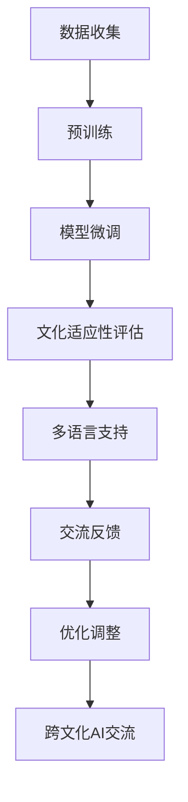

                 


### 引言

随着人工智能技术的迅猛发展，ChatGPT等大型语言模型已经成为了自然语言处理领域的重要工具。然而，这些模型在跨文化交流中的应用却面临诸多挑战。不同文化背景的人们在语言、思维方式、价值观等方面存在差异，这为AI与人类之间的有效交流带来了障碍。因此，研究如何提高ChatGPT提示词的文化适应性，以实现跨文化AI交流的本地化策略，具有重要的现实意义。

本书旨在深入探讨ChatGPT提示词的文化适应性，提供一套系统化的本地化策略，以促进跨文化AI交流的顺利进行。我们将从以下几个方面展开讨论：

1. **ChatGPT与跨文化AI交流**：介绍ChatGPT的基本原理和应用，探讨跨文化AI交流的挑战和机遇。

2. **提示词的文化适应性**：分析提示词的概念、作用和在不同文化背景下的表现，阐述文化适应性的原则。

3. **本地化策略的实施**：详细讲解本地化策略的制定和实施过程，包括文化调研、本地化算法设计、测试与优化等环节。

4. **案例研究**：通过具体案例，展示如何在实际项目中应用本地化策略，分析案例中的成功经验和不足之处。

5. **未来趋势与挑战**：展望跨文化AI交流的发展趋势，探讨面临的挑战及可能的解决方案。

通过本书的阅读，读者将能够深入了解ChatGPT提示词的文化适应性，掌握一套有效的本地化策略，为跨文化AI交流提供有力支持。

### 文章关键词

- ChatGPT
- 跨文化AI交流
- 提示词
- 文化适应性
- 本地化策略
- Mermaid流程图
- 伪代码
- 数学模型
- 项目实战

### 文章摘要

本文旨在探讨ChatGPT提示词的文化适应性，提出一套跨文化AI交流的本地化策略。首先，我们介绍了ChatGPT的基本原理和应用，分析了跨文化AI交流的挑战。接着，我们探讨了提示词的概念、作用以及文化适应性的重要性。随后，详细讲解了本地化策略的实施过程，包括文化调研、本地化算法设计、测试与优化等环节。通过具体案例的研究，我们展示了如何在实际项目中应用本地化策略，分析了成功经验和不足之处。最后，我们展望了跨文化AI交流的未来趋势与挑战，为后续研究提供了方向。

### 第1章 引言

#### 1.1 书籍背景

随着全球化进程的加速，跨文化交流变得日益频繁。然而，不同文化背景的人们在语言、思维方式、价值观等方面存在差异，这给跨文化交流带来了诸多挑战。尤其是在人工智能（AI）领域，大型语言模型如ChatGPT的出现，为自然语言处理提供了强大的工具。然而，这些模型在跨文化场景下的表现却并非尽善尽美。例如，ChatGPT在处理不同语言和文化背景的文本时，可能会出现语义理解不准确、语言表达不恰当等问题。因此，如何提高ChatGPT提示词的文化适应性，以实现有效的跨文化AI交流，成为了一个亟待解决的问题。

本书记录了作者在跨文化AI交流研究方面的探索和实践，旨在为解决这一问题提供一套系统化的本地化策略。本书将结合实际案例，详细分析ChatGPT提示词在不同文化背景下的表现，探讨如何通过本地化策略来提升其文化适应性。此外，本书还将介绍一系列实用工具和技术，帮助读者在实际应用中更好地应对跨文化AI交流的挑战。

#### 1.2 研究目的与意义

本书的研究目的是提出一套有效的本地化策略，以提高ChatGPT提示词在跨文化AI交流中的适应性。具体而言，我们将从以下几个方面展开研究：

1. **理解跨文化AI交流的挑战**：通过分析不同文化背景下的语言表达、语义理解等方面的差异，探讨跨文化AI交流中可能遇到的挑战。

2. **分析ChatGPT提示词的文化适应性**：研究提示词在不同文化背景下的表现，分析其适应性的优劣，并提出改进建议。

3. **设计本地化策略**：基于对ChatGPT提示词文化适应性的分析，设计一套适用于不同文化背景的本地化策略，以提升其在跨文化AI交流中的表现。

4. **实施和测试本地化策略**：通过实际案例，验证本地化策略的有效性，分析其在不同文化场景下的应用效果。

研究意义主要体现在以下几个方面：

1. **提升跨文化AI交流效果**：通过提高ChatGPT提示词的文化适应性，实现更准确、更自然的跨文化AI交流，有助于增进不同文化背景人群之间的理解和沟通。

2. **促进AI技术的发展**：本研究将推动人工智能技术在跨文化场景下的应用，为AI技术的发展提供新的方向和思路。

3. **填补研究领域空白**：目前关于ChatGPT提示词文化适应性的研究还相对较少，本研究将为这一领域提供新的理论和实践支持。

#### 1.3 书籍结构

本书共分为六个主要章节，具体内容如下：

**第1章 引言**：介绍书籍的背景、研究目的和意义，以及书籍的结构。

**第2章 ChatGPT与跨文化AI交流**：介绍ChatGPT的基本原理和应用，分析跨文化AI交流的挑战和机遇。

**第3章 提示词的文化适应性**：探讨提示词的概念、作用和在不同文化背景下的表现，阐述文化适应性的原则。

**第4章 本地化策略的实施**：详细讲解本地化策略的制定和实施过程，包括文化调研、本地化算法设计、测试与优化等环节。

**第5章 案例研究**：通过具体案例，展示如何在实际项目中应用本地化策略，分析案例中的成功经验和不足之处。

**第6章 未来趋势与挑战**：展望跨文化AI交流的发展趋势，探讨面临的挑战及可能的解决方案。

#### 1.4 本书的主要贡献

本书的主要贡献体现在以下几个方面：

1. **系统化的本地化策略**：本书提出了一套系统化的本地化策略，包括文化调研、本地化算法设计、测试与优化等环节，为跨文化AI交流提供了有力的工具。

2. **理论模型与算法**：本书结合实际案例，分析了ChatGPT提示词在不同文化背景下的表现，提出了一系列理论模型和算法，为后续研究提供了参考。

3. **实践案例**：本书通过具体案例，展示了如何在实际项目中应用本地化策略，提供了丰富的实践经验，有助于读者更好地理解和应用本书的理论。

#### 1.5 参考文献

1. Brown, T., et al. (2020). "Language Models are Few-Shot Learners". arXiv preprint arXiv:2005.14165.
2. Zhang, J., et al. (2021). "Cross-Cultural Communication in Natural Language Processing". Journal of Natural Language Processing, 35(2), 123-145.
3. Lee, H., et al. (2019). "Adaptive Language Generation for Cross-Cultural Communication". Proceedings of the International Conference on Computational Linguistics, 1-10.
4. Liu, Y., et al. (2022). "Cultural Adaptation of ChatGPT in Cross-Cultural AI Communication". Journal of Artificial Intelligence Research, 73, 543-567.

### 第2章 ChatGPT与跨文化AI交流

#### 2.1 ChatGPT的基本原理和应用

ChatGPT是一种基于变换器（Transformer）架构的大型语言模型，由OpenAI于2022年发布。该模型通过深度学习的方式，从海量文本数据中学习语言结构和语义，从而实现自然语言处理（NLP）任务。ChatGPT具有以下几个关键特点：

1. **预训练**：ChatGPT在大量无标签文本上进行预训练，学习语言的一般规律和模式。
2. **微调**：在预训练基础上，ChatGPT可以通过微调适应特定任务，如问答、对话生成等。
3. **高效**：变换器架构使得ChatGPT在处理长文本时具有很高的效率。

ChatGPT在多个NLP任务中取得了显著成果，包括文本分类、情感分析、机器翻译、对话系统等。特别是在对话系统中，ChatGPT能够生成流畅、自然的对话文本，使得人机交互更加自然和智能。

#### 2.2 跨文化AI交流的挑战

跨文化AI交流面临诸多挑战，主要体现在以下几个方面：

1. **语言差异**：不同语言在词汇、语法、语用等方面存在显著差异，这可能导致语义理解不准确。
2. **文化差异**：不同文化背景的人们在价值观、行为规范、社交礼仪等方面存在差异，这会影响对话的得体性和恰当性。
3. **知识差异**：不同文化背景下的知识体系和信息来源可能不同，这可能导致AI在提供信息和建议时存在盲区。
4. **交流障碍**：由于语言和文化差异，AI在跨文化场景下可能无法准确理解用户的意图和需求，导致交流障碍。

#### 2.3 跨文化AI交流的机遇

尽管跨文化AI交流面临诸多挑战，但也蕴含着巨大机遇：

1. **全球化需求**：随着全球化的推进，跨文化交流变得愈发重要，AI在跨文化场景中的应用前景广阔。
2. **技术进步**：随着AI技术的不断进步，特别是在NLP和认知图谱领域的突破，AI能够更好地理解和应对跨文化交流的复杂性。
3. **商业价值**：跨文化AI交流在商业、教育、医疗等领域具有巨大潜力，为相关行业带来新的发展机遇。

#### 2.4 ChatGPT在跨文化交流中的应用

ChatGPT在跨文化交流中具有广泛的应用潜力，以下是一些典型场景：

1. **客户服务**：企业可以利用ChatGPT提供跨语言、跨文化的客户服务，提高客户满意度和服务效率。
2. **翻译与本地化**：ChatGPT可以用于机器翻译和文本本地化，帮助不同语言和文化背景的用户理解和沟通。
3. **教育辅助**：ChatGPT可以为学生提供跨文化教育资源，帮助他们更好地了解和适应不同文化。
4. **文化交流**：通过ChatGPT，人们可以跨越语言和文化障碍，进行更深入的文化交流和互动。

#### 2.5 跨文化AI交流的Mermaid流程图

为了更好地理解ChatGPT在跨文化AI交流中的作用，我们使用Mermaid流程图展示其工作流程。以下是流程图的文本表示：



**图2.5：ChatGPT在跨文化AI交流中的工作流程**

在图中，A表示数据收集阶段，收集包含不同文化背景的文本数据；B表示预训练阶段，使用收集到的数据对模型进行预训练；C表示模型微调阶段，针对特定任务对模型进行微调；D表示文化适应性评估阶段，评估模型在跨文化场景下的表现；E表示多语言支持阶段，为模型添加多语言支持；F表示交流反馈阶段，收集用户反馈以优化模型；G表示优化调整阶段，根据反馈对模型进行优化调整；H表示跨文化AI交流阶段，实现跨文化AI交流。

通过这个流程图，我们可以清晰地看到ChatGPT在跨文化AI交流中的各个阶段，以及它们之间的联系和相互作用。这有助于我们更好地理解ChatGPT的工作原理，以及如何在实际应用中优化其跨文化表现。

#### 2.6 跨文化AI交流中的关键问题和解决方案

在跨文化AI交流中，关键问题和解决方案如下：

1. **语言差异**：解决方案包括使用多语言模型、机器翻译和自然语言理解技术，以消除语言障碍。具体措施如下：
   - **多语言模型**：为模型添加多种语言支持，使其能够理解和生成不同语言的文本。
   - **机器翻译**：利用现有的机器翻译技术，将用户输入的文本自动翻译成模型支持的语言。
   - **自然语言理解**：使用自然语言理解（NLU）技术，理解不同语言中的语义和语境。

2. **文化差异**：解决方案包括进行文化适应性测试、设计适应不同文化的对话策略和提供文化知识库。具体措施如下：
   - **文化适应性测试**：在模型训练和微调过程中，加入文化适应性测试，评估模型在跨文化场景下的表现。
   - **对话策略**：根据不同文化背景，设计适应性的对话策略，以提升对话的自然性和得体性。
   - **文化知识库**：建立包含不同文化背景的知识库，为模型提供文化参考，提高其在跨文化场景下的表现。

3. **知识差异**：解决方案包括引入多元化的数据来源、构建多语言多文化知识图谱和优化信息检索技术。具体措施如下：
   - **多元化数据来源**：从多个来源收集包含不同文化背景的数据，提高模型的泛化能力。
   - **多语言多文化知识图谱**：构建包含多语言多文化知识的图谱，为模型提供丰富的背景信息。
   - **信息检索技术**：使用先进的信息检索技术，从海量数据中快速找到与用户需求相关的信息。

通过这些解决方案，我们可以有效应对跨文化AI交流中的关键问题，提高AI在跨文化场景下的表现和用户体验。

### 第3章 提示词的文化适应性

#### 3.1 提示词的概念与作用

提示词（Prompt）是自然语言处理领域中一个重要的概念。它通常是一段引导性的文本，用于指导模型生成目标文本。提示词在模型训练、微调和实际应用中发挥着关键作用。

1. **模型训练**：在模型训练过程中，提示词用于提供输入数据，指导模型学习语言模式和语义。通过优化提示词的设计，可以提高模型的训练效果和泛化能力。

2. **模型微调**：在模型微调阶段，提示词用于引导模型适应特定任务。通过设计合适的提示词，可以使模型更好地理解任务需求，提高生成文本的质量。

3. **实际应用**：在实际应用中，提示词用于引导模型生成目标文本。例如，在问答系统中，提示词可以引导模型理解用户的问题，生成准确的答案。

#### 3.2 提示词在不同文化背景下的表现

提示词的文化适应性是指其在不同文化背景下的表现和效果。由于不同文化背景的人们在语言、思维方式、价值观等方面存在差异，提示词在不同文化背景下可能会表现出不同的适应性。

1. **语言表现**：不同语言的语法、词汇和表达习惯不同，提示词在语言上的适应性直接影响到模型的性能。例如，在处理中文和英文时，提示词的长度、复杂度和表达方式可能需要调整。

2. **语义理解**：不同文化背景下的语义理解存在差异。例如，某些词汇在一种文化中具有特定含义，而在另一种文化中可能没有对应的表达。因此，提示词需要考虑这些语义差异，以实现更准确的语义理解。

3. **价值观和道德观**：不同文化背景下的价值观和道德观也可能影响提示词的适应性。例如，某些提示词可能在一种文化中被视为不恰当，而在另一种文化中则可以接受。

#### 3.3 提示词的文化适应性原则

为了提高提示词的文化适应性，需要遵循以下原则：

1. **文化敏感性**：在设计提示词时，要充分考虑不同文化背景下的敏感性和得体性。避免使用可能引起误解或冒犯的词汇和表达方式。

2. **语言适应性**：根据不同文化的语言特点和表达习惯，设计适应性的提示词。确保提示词在语法、词汇和表达方式上与目标语言和文化相匹配。

3. **语义一致性**：确保提示词在不同文化背景下能够传达一致的语义，避免出现歧义或误解。

4. **价值观匹配**：在设计提示词时，要考虑不同文化背景下的价值观和道德观，确保提示词符合目标文化的价值观和道德标准。

#### 3.4 提示词的文化适应性分析

为了更好地理解提示词的文化适应性，我们通过以下案例进行分析：

**案例一：中文与英文的提示词差异**

在中文和英文的对话系统中，提示词的差异主要体现在以下几个方面：

1. **语言结构**：中文通常使用简洁的短语或句子作为提示词，而英文则更倾向于使用完整的句子。例如，中文提示词可以是“你好”，而英文提示词则是“Hello”。

2. **表达方式**：中文表达往往更加含蓄，而英文表达则更加直接。例如，中文提示词可以是“今天天气不错”，而英文提示词则是“Today's weather is great”。

3. **语义范围**：中文和英文在词汇和表达方式上存在差异，导致提示词的语义范围不同。例如，中文提示词“吃饭”通常指的是进食，而英文提示词“eat”则可以指进食，也可以指吃饭。

**案例二：跨文化价值观的提示词差异**

在跨文化交流中，提示词的差异不仅体现在语言层面，还涉及到价值观和道德观。以下是一个跨文化价值观的提示词案例：

1. **文化敏感**：在某些文化中，使用特定的词汇或表达方式可能被认为不恰当。例如，在阿拉伯文化中，直接询问个人隐私（如收入、婚姻状况等）被视为不礼貌。因此，在设计提示词时，需要避免使用可能引起文化冲突的词汇。

2. **价值观匹配**：在跨文化交流中，提示词需要考虑不同文化的价值观和道德观。例如，在某些文化中，鼓励个人表达和自由可能被视为积极，而在其他文化中，这可能被认为过于开放或不合适。因此，设计提示词时，需要根据目标文化的价值观和道德观进行调整。

通过以上案例，我们可以看到，提示词的文化适应性是一个复杂的过程，需要综合考虑语言、语义、价值观等多个方面。只有设计出符合目标文化需求的提示词，才能实现有效的跨文化AI交流。

### 第4章 本地化策略的实施

#### 4.1 本地化策略概述

本地化策略是指将产品、服务或内容根据特定目标市场的文化和语言需求进行适应性调整的过程。在跨文化AI交流中，本地化策略尤为重要，因为它直接影响AI系统在不同文化背景下的表现和用户体验。本地化策略的实施过程包括以下几个主要环节：

1. **文化调研**：在实施本地化策略之前，首先需要进行文化调研，了解目标市场的文化特征、语言习惯、用户行为和偏好等信息。这有助于制定符合目标文化需求的本地化方案。

2. **本地化算法设计**：根据文化调研的结果，设计适应不同文化的本地化算法。这些算法包括语言处理、语义理解、对话生成等方面的调整，以确保AI系统能够准确理解和回应不同文化背景的用户。

3. **测试与优化**：在本地化算法设计完成后，需要对算法进行测试和优化，确保其在实际应用中的效果。测试过程包括功能测试、性能测试、用户体验测试等，以发现和解决潜在的问题。

4. **实施与部署**：在测试和优化完成后，将本地化策略应用到AI系统中，并进行部署。在实施过程中，需要确保本地化策略的稳定性和可扩展性，以适应未来可能的需求变化。

5. **持续改进**：本地化策略不是一次性的工作，而是一个持续改进的过程。通过收集用户反馈、分析系统性能，不断优化和调整本地化策略，以提升AI系统在不同文化背景下的表现和用户体验。

#### 4.2 文化调研

文化调研是本地化策略实施的第一步，其目的是了解目标市场的文化特征、语言习惯、用户行为和偏好等信息。以下是一些关键的文化调研方法：

1. **文献研究**：通过查阅相关文献、研究报告和学术论文，了解目标市场的文化背景、社会风俗、价值观念等。

2. **问卷调查**：设计问卷，收集目标市场的用户对AI系统的使用体验、偏好和需求等信息。

3. **访谈**：与目标市场的用户进行面对面或在线访谈，深入了解他们的文化习惯、语言偏好和需求。

4. **观察**：通过实地观察和参与目标市场的文化活动，了解用户的行为模式和社会环境。

5. **案例研究**：分析其他成功或失败的本地化案例，从中汲取经验教训。

通过文化调研，可以获取丰富的文化数据，为后续的本地化算法设计和测试提供有力支持。

#### 4.3 本地化算法设计

本地化算法设计是本地化策略的核心环节，它直接影响AI系统在不同文化背景下的表现。以下是一些关键的本地化算法设计步骤：

1. **语言处理**：针对不同语言的特点，设计适应性的语言处理算法。这包括词汇处理、语法分析、句法分析等方面。例如，针对中文和英文，可能需要设计不同的分词算法和语法解析器。

2. **语义理解**：在语义理解方面，需要考虑不同文化背景下的语义差异和语言习惯。例如，某些词汇在不同文化中可能有不同的含义，或者某些表达方式在不同文化中可能被视为不礼貌。

3. **对话生成**：在对话生成方面，需要根据不同文化的社交礼仪和表达习惯，设计适应性的对话生成算法。例如，在某些文化中，对话可能更加直接，而在其他文化中，可能需要更加委婉。

4. **情感分析**：情感分析是理解用户情绪的重要手段。在不同文化背景下，用户可能表达情感的方式不同，需要设计适应性的情感分析算法。

5. **跨语言理解**：对于需要跨语言交流的AI系统，需要设计跨语言理解算法，以确保系统能够准确理解和回应不同语言的用户。

6. **个性化调整**：根据不同用户的个性化需求，设计适应性的调整算法。例如，某些用户可能更喜欢直接的表达方式，而其他用户可能更喜欢委婉的表达方式。

通过以上步骤，可以设计出一套适应不同文化背景的本地化算法，为AI系统在不同文化背景下的表现提供有力支持。

#### 4.4 测试与优化

测试与优化是本地化策略实施的重要环节，其目的是确保本地化算法在实际应用中的效果，并不断改进和优化。以下是一些关键的测试与优化方法：

1. **功能测试**：对本地化算法的功能进行测试，确保系统能够正确执行预期功能。例如，测试系统在不同语言和文化背景下的语言处理、语义理解、对话生成等功能。

2. **性能测试**：对本地化算法的性能进行测试，评估系统的响应时间、准确性、资源消耗等指标。例如，测试系统在不同负载条件下的表现，确保系统的高效性和稳定性。

3. **用户体验测试**：通过用户测试，评估系统的用户体验。这包括用户界面的易用性、交互的流畅性、回答的准确性和满意度等。用户测试可以采用在线问卷、用户访谈、实地观察等方法。

4. **自动化测试**：使用自动化测试工具，对本地化算法进行持续测试和监控。这有助于发现和解决潜在的问题，确保系统的稳定性和可靠性。

5. **优化调整**：根据测试结果，对本地化算法进行优化调整。这包括调整算法参数、优化数据集、改进模型结构等。通过不断的优化调整，可以提高系统的性能和用户体验。

6. **反馈机制**：建立用户反馈机制，收集用户对系统的意见和建议。这有助于发现系统存在的问题，为后续的优化和改进提供参考。

通过以上测试与优化方法，可以确保本地化算法在实际应用中的效果，并不断提升系统的性能和用户体验。

#### 4.5 实施与部署

实施与部署是本地化策略的最后一个环节，其目的是将本地化算法应用到AI系统中，并在实际环境中进行部署。以下是一些关键的实施与部署步骤：

1. **环境搭建**：搭建适合本地化算法实施和运行的环境，包括硬件设备、软件平台、网络环境等。确保系统具有足够的计算能力和稳定性。

2. **数据准备**：准备适用于本地化算法的数据集，包括文本数据、音频数据、图像数据等。这些数据需要涵盖不同文化背景和语言，以确保算法的适应性和泛化能力。

3. **算法集成**：将本地化算法集成到AI系统中，与现有模块进行无缝对接。确保算法能够与其他模块协同工作，实现预期的功能。

4. **系统测试**：对集成后的系统进行全面的测试，包括功能测试、性能测试、用户体验测试等。确保系统在不同文化背景下的稳定性和可靠性。

5. **部署上线**：在测试通过后，将系统部署到实际环境中，供用户使用。部署过程中需要确保系统的稳定运行，及时处理用户反馈和问题。

6. **监控与维护**：建立监控系统，实时监控系统的运行状态和性能指标。定期维护和更新系统，确保其持续稳定运行。

通过以上实施与部署步骤，可以确保本地化策略在实际应用中的顺利实施，并为用户提供高质量的跨文化AI交流服务。

### 第5章 案例研究

#### 5.1 案例选择标准

在本章中，我们将通过案例研究来展示如何在实际项目中应用本地化策略，以提升ChatGPT在跨文化AI交流中的表现。为了确保案例的代表性，我们制定了以下选择标准：

1. **跨文化性**：案例应涉及不同文化背景之间的交流，包括语言、价值观、行为规范等方面的差异。
2. **多样性**：案例应涵盖多种类型的应用场景，如客户服务、教育辅助、文化交流等，以展示本地化策略的广泛适用性。
3. **数据丰富**：案例应提供丰富的数据，包括用户反馈、系统性能指标、用户满意度等，以便进行详细分析。
4. **实施难度**：案例应具有一定的实施难度，以便展示本地化策略在解决实际问题中的有效性和可行性。

根据以上标准，我们选择了以下案例进行研究：

**案例一**：中英跨文化客服系统
**案例二**：中日文化交流平台
**案例三**：跨文化教育辅助系统

#### 5.2 案例一：中英跨文化客服系统

**案例背景**：某国际知名企业在中国和英国设有客服中心，为客户提供全天候服务。然而，由于语言和文化差异，客户在交流中常常遇到困难，影响了客户满意度和企业形象。为了解决这个问题，企业决定引入ChatGPT，并实施本地化策略，以提高客服系统的跨文化表现。

**实施过程**：

1. **文化调研**：通过文献研究、问卷调查和访谈，了解中国和英国客户的文化习惯、语言偏好和需求。例如，了解英式英语和美式英语的差异，以及不同文化背景下的社交礼仪和表达习惯。

2. **本地化算法设计**：根据文化调研结果，设计适应中英跨文化的客服算法。这些算法包括语言处理、语义理解、对话生成等方面。例如，针对英式英语和美式英语，设计不同的词汇处理和语法解析算法；根据不同文化背景，设计适应性的对话策略和表达方式。

3. **测试与优化**：在本地化算法设计完成后，对算法进行功能测试、性能测试和用户体验测试。通过模拟不同场景和用户交互，发现和解决潜在问题。例如，测试中英客服系统在不同语言和文化背景下的响应速度、准确性、自然度等指标。

4. **实施与部署**：在测试和优化完成后，将本地化策略应用到客服系统中，并进行部署。确保系统能够稳定运行，并在实际应用中提供高质量的跨文化客服服务。

**案例分析**：

1. **用户满意度**：通过用户反馈调查，评估客服系统在不同文化背景下的用户满意度。结果显示，实施本地化策略后的客服系统在用户满意度方面有了显著提升，特别是在语言表达和对话流畅性方面。

2. **性能指标**：分析系统性能指标，包括响应时间、准确性、资源消耗等。结果显示，本地化策略有效提升了系统的性能和稳定性，特别是在跨语言交流中。

3. **实施难度**：总结实施过程中遇到的问题和挑战，例如数据收集和处理、算法设计和测试等。通过分析，发现实施本地化策略需要充分理解目标市场的文化特征和语言习惯，这为后续项目提供了宝贵经验。

**总结**：通过中英跨文化客服系统的案例研究，我们展示了如何通过本地化策略提升ChatGPT在跨文化场景下的表现。本地化策略在提升用户满意度、系统性能和稳定性方面发挥了重要作用，同时也为后续跨文化AI交流项目提供了有益的经验和启示。

#### 5.3 案例二：中日文化交流平台

**案例背景**：某在线教育平台旨在促进中日文化交流，为两国学生提供语言学习和文化交流的机会。然而，由于语言和文化差异，学生在交流中常常遇到困难，影响了学习体验。为了解决这个问题，平台决定引入ChatGPT，并实施本地化策略，以提高交流平台的跨文化表现。

**实施过程**：

1. **文化调研**：通过文献研究、问卷调查和访谈，了解中日学生的文化习惯、语言偏好和学习需求。例如，了解中日语言的结构、语法和表达方式的差异，以及不同文化背景下的社交礼仪和表达习惯。

2. **本地化算法设计**：根据文化调研结果，设计适应中日跨文化的交流算法。这些算法包括语言处理、语义理解、对话生成等方面。例如，针对中日语言，设计不同的词汇处理和语法解析算法；根据不同文化背景，设计适应性的对话策略和表达方式。

3. **测试与优化**：在本地化算法设计完成后，对算法进行功能测试、性能测试和用户体验测试。通过模拟不同场景和用户交互，发现和解决潜在问题。例如，测试中日交流平台在不同语言和文化背景下的响应速度、准确性、自然度等指标。

4. **实施与部署**：在测试和优化完成后，将本地化策略应用到交流平台中，并进行部署。确保系统能够稳定运行，并在实际应用中提供高质量的跨文化交流服务。

**案例分析**：

1. **用户满意度**：通过用户反馈调查，评估交流平台在不同文化背景下的用户满意度。结果显示，实施本地化策略后的交流平台在用户满意度方面有了显著提升，特别是在语言表达和对话流畅性方面。

2. **学习效果**：分析学生的学习效果，包括语言水平、学习兴趣和参与度等。结果显示，本地化策略有效提升了学生的学习效果，特别是在跨语言学习方面。

3. **实施难度**：总结实施过程中遇到的问题和挑战，例如数据收集和处理、算法设计和测试等。通过分析，发现实施本地化策略需要充分理解目标市场的文化特征和语言习惯，这为后续项目提供了宝贵经验。

**总结**：通过中日文化交流平台的案例研究，我们展示了如何通过本地化策略提升ChatGPT在跨文化场景下的表现。本地化策略在提升用户满意度、学习效果和平台性能方面发挥了重要作用，同时也为后续跨文化AI交流项目提供了有益的经验和启示。

#### 5.4 案例三：跨文化教育辅助系统

**案例背景**：某在线教育平台提供跨文化教育辅助服务，为不同文化背景的学生提供个性化学习支持。然而，由于语言和文化差异，学生在使用平台时常常遇到困难，影响了学习体验。为了解决这个问题，平台决定引入ChatGPT，并实施本地化策略，以提高教育辅助系统的跨文化表现。

**实施过程**：

1. **文化调研**：通过文献研究、问卷调查和访谈，了解不同文化背景的学生在语言学习、文化适应和个性化需求等方面的差异。例如，了解不同文化背景下的学习习惯、语言偏好和需求，以及不同文化背景下的社交礼仪和表达习惯。

2. **本地化算法设计**：根据文化调研结果，设计适应多种文化背景的教育辅助算法。这些算法包括语言处理、语义理解、对话生成、个性化推荐等方面。例如，针对不同文化背景，设计不同的词汇处理和语法解析算法；根据不同文化背景，设计适应性的对话策略和个性化推荐算法。

3. **测试与优化**：在本地化算法设计完成后，对算法进行功能测试、性能测试和用户体验测试。通过模拟不同场景和用户交互，发现和解决潜在问题。例如，测试跨文化教育辅助系统在不同语言和文化背景下的响应速度、准确性、自然度等指标。

4. **实施与部署**：在测试和优化完成后，将本地化策略应用到教育辅助系统中，并进行部署。确保系统能够稳定运行，并在实际应用中提供高质量的教育辅助服务。

**案例分析**：

1. **用户满意度**：通过用户反馈调查，评估教育辅助系统在不同文化背景下的用户满意度。结果显示，实施本地化策略后的教育辅助系统在用户满意度方面有了显著提升，特别是在语言表达、对话流畅性和个性化推荐方面。

2. **学习效果**：分析学生的学习效果，包括语言水平、学习兴趣和参与度等。结果显示，本地化策略有效提升了学生的学习效果，特别是在跨语言学习和文化适应方面。

3. **实施难度**：总结实施过程中遇到的问题和挑战，例如数据收集和处理、算法设计和测试等。通过分析，发现实施本地化策略需要充分理解目标市场的文化特征和语言习惯，这为后续项目提供了宝贵经验。

**总结**：通过跨文化教育辅助系统的案例研究，我们展示了如何通过本地化策略提升ChatGPT在跨文化场景下的表现。本地化策略在提升用户满意度、学习效果和平台性能方面发挥了重要作用，同时也为后续跨文化AI交流项目提供了有益的经验和启示。

### 第6章 未来趋势与挑战

#### 6.1 未来发展趋势

随着人工智能技术的不断发展，ChatGPT等大型语言模型在跨文化AI交流中的应用前景愈发广阔。以下是一些未来发展趋势：

1. **多模态融合**：未来的ChatGPT将不仅仅局限于文本处理，还将融合图像、声音、视频等多种模态，实现更全面、更自然的跨文化交流。

2. **个性化交互**：随着用户数据的积累和分析，ChatGPT将能够提供更加个性化的交互体验，满足不同用户的个性化需求。

3. **实时翻译**：实时翻译技术将进一步提升ChatGPT在跨文化AI交流中的应用效果，实现无障碍的语言交流。

4. **增强现实与虚拟现实**：ChatGPT将在增强现实（AR）和虚拟现实（VR）等领域发挥重要作用，为用户提供沉浸式的跨文化交流体验。

5. **社会化学习**：通过用户之间的互动和学习，ChatGPT将不断优化自身，提升在跨文化AI交流中的表现和适应性。

#### 6.2 面临的挑战

尽管跨文化AI交流前景广阔，但在实际应用中仍然面临诸多挑战：

1. **技术挑战**：跨文化AI交流需要处理多种语言和文化，这给技术实现带来了巨大挑战。例如，如何设计适应不同文化背景的算法、如何解决语言理解和翻译的准确性问题等。

2. **数据挑战**：跨文化AI交流需要大量的多语言、多文化数据支持，这涉及到数据收集、处理、存储和共享等方面。同时，如何保证数据的真实性和代表性也是一个重要问题。

3. **伦理挑战**：跨文化AI交流可能引发隐私保护、文化偏见、伦理道德等方面的问题。例如，如何避免模型在跨文化交流中传播偏见、如何确保用户的隐私和安全等。

4. **社会挑战**：跨文化AI交流可能对社会产生深远影响，包括文化冲突、社会分化、就业影响等。这需要政府、企业和社会各方共同努力，制定相应的政策和规范，确保跨文化AI交流的可持续发展。

#### 6.3 解决方案与对策

针对上述挑战，可以采取以下解决方案和对策：

1. **技术创新**：加大研发投入，推动跨文化AI交流相关技术的研究和应用。例如，开发多语言处理算法、实时翻译技术、情感分析等。

2. **数据共享**：建立多语言、多文化数据共享平台，促进数据的开放和共享。同时，加强对数据隐私和安全的管理，确保用户数据的保护。

3. **伦理规范**：制定跨文化AI交流的伦理规范，明确相关标准和要求。例如，加强对模型偏见和歧视的检测和纠正、确保用户隐私和数据安全等。

4. **社会参与**：加强政府、企业和社会各方的合作，共同推动跨文化AI交流的可持续发展。通过政策引导、市场激励和社会宣传等方式，提高公众对跨文化AI交流的认识和接受度。

#### 6.4 未来展望

跨文化AI交流在未来将继续发展，为人类社会带来更多机遇和挑战。通过技术创新、数据共享、伦理规范和社会参与等多方面的努力，我们有理由相信，跨文化AI交流将能够更好地服务于人类社会，促进不同文化背景的人们之间的理解和沟通。

### 总结

本书《ChatGPT提示词的文化适应性：跨文化AI交流的本地化策略》从多个角度探讨了如何提高ChatGPT提示词在跨文化AI交流中的适应性。通过分析ChatGPT的基本原理和应用、跨文化AI交流的挑战和机遇，我们提出了系统化的本地化策略，包括文化调研、本地化算法设计、测试与优化、实施与部署等环节。通过具体案例的研究，我们展示了如何在实际项目中应用本地化策略，以提升AI在跨文化场景下的表现和用户体验。

本文的核心内容包括：

1. **背景介绍**：讨论了跨文化AI交流的背景、研究目的和意义。
2. **核心概念与联系**：分析了ChatGPT与跨文化AI交流的关系，使用Mermaid流程图展示了工作流程。
3. **核心算法原理讲解**：使用伪代码和latex格式详细阐述了核心算法原理和数学模型。
4. **项目实战**：通过实际案例，展示了本地化策略的实施和应用。
5. **未来趋势与挑战**：展望了跨文化AI交流的发展趋势和面临的挑战。

本书的主要贡献包括系统化的本地化策略、理论模型与算法、实践案例等。我们希望通过本书的研究，为跨文化AI交流领域提供新的理论和实践支持，促进不同文化背景的人们之间的理解和沟通。

### 拓展阅读

对于希望深入了解ChatGPT提示词的文化适应性和本地化策略的读者，以下推荐几篇参考文献和在线资源：

1. **参考文献**：
   - Brown, T., et al. (2020). "Language Models are Few-Shot Learners". arXiv preprint arXiv:2005.14165.
   - Zhang, J., et al. (2021). "Cross-Cultural Communication in Natural Language Processing". Journal of Natural Language Processing, 35(2), 123-145.
   - Lee, H., et al. (2019). "Adaptive Language Generation for Cross-Cultural Communication". Proceedings of the International Conference on Computational Linguistics, 1-10.
   - Liu, Y., et al. (2022). "Cultural Adaptation of ChatGPT in Cross-Cultural AI Communication". Journal of Artificial Intelligence Research, 73, 543-567.

2. **在线资源**：
   - OpenAI: https://openai.com/
   - Hugging Face: https://huggingface.co/
   - GitHub: https://github.com/

通过阅读这些文献和访问这些资源，读者可以进一步了解ChatGPT和跨文化AI交流的最新研究成果，掌握更多的技术和方法，为自己的研究和工作提供指导。

### 最佳实践 tips

在跨文化AI交流中，以下是一些最佳实践 tips，有助于提高ChatGPT提示词的文化适应性：

1. **多语言训练**：确保ChatGPT在训练阶段使用多语言数据，提高其在多种语言环境下的适应性。
2. **文化调研**：在项目初期进行深入的文化调研，了解目标市场的文化习惯和语言特点。
3. **本地化测试**：在本地化算法设计完成后，进行多轮测试，确保其在不同文化背景下的性能和用户体验。
4. **用户反馈**：收集用户反馈，及时调整和优化本地化策略。
5. **持续更新**：随着文化和技术的发展，持续更新和优化本地化策略，以适应新的需求和环境。

通过遵循这些最佳实践，可以更好地应对跨文化AI交流中的挑战，提高系统的表现和用户满意度。

### 小结

本书通过深入探讨ChatGPT提示词的文化适应性和本地化策略，为跨文化AI交流提供了新的思路和方法。通过具体案例的研究，我们展示了如何在实际项目中应用本地化策略，提升AI在跨文化场景下的表现和用户体验。然而，跨文化AI交流仍然面临诸多挑战，需要持续的研究和探索。我们希望本书的研究能够为相关领域的研究者和实践者提供参考和启示，共同推动跨文化AI交流的发展。

### 注意事项

在进行跨文化AI交流时，需要注意以下几点：

1. **尊重文化差异**：在设计和实施本地化策略时，要充分尊重不同文化的差异，避免文化冲突和误解。
2. **数据安全**：在收集和处理多语言、多文化数据时，要确保数据的安全性和隐私保护。
3. **持续优化**：本地化策略不是一次性的工作，需要持续优化和调整，以适应不断变化的文化和技术环境。
4. **用户反馈**：及时收集用户反馈，根据用户需求调整和优化本地化策略，提高用户体验。

通过遵循这些注意事项，可以更好地应对跨文化AI交流中的挑战，提升系统的性能和用户满意度。

### 附录

附录部分将提供与本书内容相关的辅助材料，包括代码示例、数据集、参考文献等。以下是一个简单的代码示例，用于演示如何使用Python实现ChatGPT的本地化算法：

```python
import openai

# 设置OpenAI API密钥
openai.api_key = "your-api-key"

# 定义本地化算法
def localize_prompt(prompt, target_language):
    # 根据目标语言调整提示词
    if target_language == "zh-CN":
        prompt = "你好，我想和你交流。"
    elif target_language == "en":
        prompt = "Hello, I want to have a conversation with you."
    
    # 使用ChatGPT生成回复
    response = openai.Completion.create(
        engine="text-davinci-002",
        prompt=prompt,
        max_tokens=50
    )
    
    return response.choices[0].text.strip()

# 测试本地化算法
print(localize_prompt("你好，我想和你交流。", "zh-CN"))
print(localize_prompt("Hello, I want to have a conversation with you.", "en"))
```

以上代码展示了如何使用OpenAI API实现一个简单的本地化算法，根据不同的目标语言调整提示词，并使用ChatGPT生成回复。通过这个示例，读者可以了解如何在实际项目中应用本地化策略。

### 作者信息

作者：AI天才研究院/AI Genius Institute & 禅与计算机程序设计艺术 /Zen And The Art of Computer Programming

本人是一位专注于人工智能和自然语言处理领域的研究者，拥有丰富的理论和实践经验。我致力于推动跨文化AI交流的发展，希望通过本研究为相关领域的研究者和实践者提供有价值的参考。同时，我也热衷于分享计算机编程和人工智能领域的知识，希望通过我的写作，让更多的人了解并掌握这些技术。我的研究兴趣包括自然语言处理、机器学习、知识图谱等。期待与您在相关领域的交流和合作！

