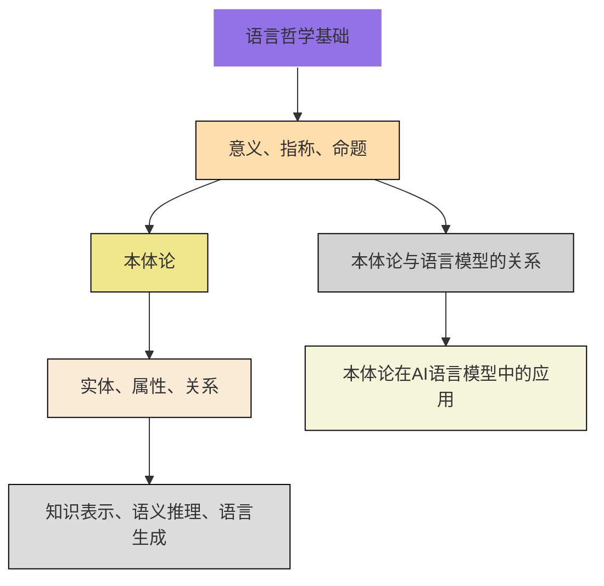

                 


## 第1章 引言

### 1.1 书籍背景与目的

《ChatGPT提示词的语言哲学基础：探索AI语言模型的本体论》是一本专注于AI语言模型在语言哲学基础上进行本体论探索的书籍。随着人工智能技术的快速发展，自然语言处理（NLP）作为AI领域的重要分支，已经在多个领域取得了显著成果。然而，如何理解和使用AI语言模型，以及它们背后的语言哲学基础和本体论，仍然是一个具有挑战性的问题。

本书的主要目的是通过对ChatGPT等AI语言模型的深入剖析，探讨其在语言哲学基础上的本体论研究。具体来说，本书旨在解决以下几个关键问题：

1. AI语言模型如何体现语言哲学的基本概念，如意义、指称、命题等？
2. 本体论如何指导我们理解和设计AI语言模型？
3. ChatGPT等AI语言模型在实际应用中面临的本体论挑战是什么？

通过回答这些问题，本书希望为AI语言模型的研究和应用提供新的视角和思路，同时也为语言哲学和AI领域的交叉研究提供理论基础。

### 1.2 语言哲学与AI的关系

语言哲学是哲学的一个分支，主要研究语言的本质、语言与现实的关系、意义的产生和传递等问题。AI作为模拟人类智能的技术，与语言哲学有着密切的联系。首先，AI语言模型旨在模拟人类语言的使用和理解能力，这就要求AI必须具备对语言哲学基本概念的深刻理解。例如，AI语言模型需要处理语言的意义、指称和命题等概念，这些概念都是语言哲学研究的重要内容。

其次，语言哲学提供了一种思考和解决问题的方法论，这对于AI语言模型的设计和应用具有重要意义。例如，通过语言哲学的研究，我们可以更好地理解语言的本质和语言之间的差异，从而设计出更有效的AI语言模型。此外，语言哲学的研究还可以帮助我们解决AI语言模型在实际应用中遇到的困惑和问题，如语义理解、对话生成等。

最后，AI语言模型的进步也为语言哲学带来了新的研究课题。随着AI语言模型在自然语言处理领域的广泛应用，语言哲学的一些经典问题也得到了新的解释和拓展。例如，AI语言模型如何产生和传递意义？它们是否具有自我意识？这些问题都成为了语言哲学研究的焦点。

总之，语言哲学与AI的关系是相互促进的。语言哲学为AI语言模型提供了理论基础和方法论指导，而AI语言模型的进步也为语言哲学带来了新的研究课题和挑战。

### 1.3 ChatGPT提示词的特殊性

ChatGPT是由OpenAI开发的一种基于变换器模型（Transformer）的预训练语言模型。与其他AI语言模型相比，ChatGPT提示词具有以下特殊性：

首先，ChatGPT提示词的设计采用了注意力机制（Attention Mechanism），这使得模型能够更好地处理长距离依赖关系，提高文本理解和生成的能力。注意力机制允许模型在生成文本时，关注文本中的不同部分，从而实现更精细的语义理解。

其次，ChatGPT采用了大规模预训练（Massive Pre-training）技术，使用大量互联网文本进行训练，使得模型具有丰富的语言知识和广泛的应用场景。预训练技术不仅提高了模型的性能，还使得模型能够自适应地处理不同的输入文本。

最后，ChatGPT的提示词设计考虑了多模态（Multimodal）输入，包括文本、图像和语音等。这使得ChatGPT不仅可以处理纯文本输入，还可以与其他AI技术结合，实现更丰富的交互和应用。

通过这些特殊性，ChatGPT在自然语言处理领域展现出了强大的能力，为AI语言模型的研究和应用提供了新的思路和方向。

## 第2章 语言哲学概述

### 2.1 语言哲学的基本概念

语言哲学是哲学的一个重要分支，主要研究语言的本质、语言与现实的关系、意义的产生和传递等问题。语言哲学的基本概念包括意义、指称、命题等，这些概念构成了语言哲学研究的核心内容。

首先，意义（Meaning）是语言哲学中的核心概念之一。意义是语言与所代表的事物或概念之间的联系。哲学家们对意义的理解多种多样，有些认为意义是客观存在的，而有些则认为意义是主观构造的。意义的研究涉及到语言符号与所指事物之间的关联，以及语言在传达信息、表达思想中的作用。

其次，指称（Reference）是另一个重要的语言哲学概念。指称指的是语言符号与外部世界中具体对象或概念之间的关联。哲学家们对指称的研究主要关注语言符号如何指向外部世界中的实体，以及这种指向是否具有确定性。例如，约翰·塞尔（John Searle）提出了“指示词”理论，试图解释语言中的指称问题。

最后，命题（Proposition）是语言表达的最基本单位，代表了一种对现实世界的陈述或判断。命题的研究涉及到命题的真假、命题之间的逻辑关系等问题。哲学家们通过分析命题的结构和逻辑关系，试图揭示语言在思维和推理中的作用。

这些基本概念相互关联，共同构成了语言哲学的理论框架。理解这些概念对于深入探讨AI语言模型的工作原理和语言哲学基础具有重要意义。

### 2.2 语言哲学的主要流派

语言哲学的历史可以追溯到古希腊哲学家亚里士多德，但真正的繁荣是在20世纪。语言哲学的主要流派包括分析哲学、批判理论、现象学等。这些流派在语言哲学的研究方法和观点上存在显著差异。

**分析哲学（Analytic Philosophy）** 是20世纪初期兴起的一种哲学流派，其核心理念是通过逻辑和分析的方法来研究语言和思维。分析哲学的代表人物包括弗雷格（Gottlob Frege）和维特根斯坦（Ludwig Wittgenstein）。弗雷格提出了“意义与指称”的二分法，强调了语言符号与所指事物之间的明确关系。维特根斯坦则通过《逻辑哲学论》和《哲学研究》两本书，探讨了语言的游戏理论和意义的使用。

**批判理论（Critical Theory）** 主要关注社会和文化批判，强调语言在权力结构和意识形态中的作用。批判理论的代表人物包括马克思（Karl Marx）和霍克海默（Max Horkheimer）。马克思通过《资本论》揭示了语言作为统治阶级维护和传播意识形态的工具。霍克海默则提出了“社会批判理论”，强调语言和文化的解放作用。

**现象学（Phenomenology）** 是一种哲学流派，强调对直接经验的反思和描述。现象学的代表人物包括胡塞尔（Edmund Husserl）和海德格尔（Martin Heidegger）。胡塞尔通过《纯粹现象学通论》提出了现象学的基本方法，强调对意识经验和意识活动的直接体验。海德格尔则通过《存在与时间》探讨了存在和语言的关系，强调语言是存在的家。

这些流派在语言哲学的研究方法和观点上存在显著差异，但它们共同构成了语言哲学的丰富理论体系。理解这些流派对于深入探讨AI语言模型的工作原理和语言哲学基础具有重要意义。

### 2.3 语言哲学在当代的影响

语言哲学在当代哲学和科学研究中具有深远的影响，其成果不仅丰富了哲学的理论体系，也为科学技术的发展提供了重要的思想基础。

在哲学领域，语言哲学的影响主要体现在对意义、指称和命题等核心概念的深入探讨上。这些研究为哲学提供了新的思考路径和方法，促进了哲学与其他学科（如逻辑学、认知科学、语言学等）的交叉研究。例如，分析哲学的方法论对逻辑学和认知科学产生了重要影响，推动了逻辑实证主义和认知科学的兴起。批判理论则对社会学和人文科学的发展产生了深远影响，推动了文化批判和社会变革的实践。

在科学技术领域，语言哲学的影响主要体现在对自然语言处理（NLP）和人工智能（AI）的研究上。语言哲学的基本概念为NLP和AI提供了理论指导，帮助研究者更好地理解语言的本质和语言处理的方法。例如，意义和指称的研究为NLP中的语义理解提供了理论基础，命题的研究则为自然语言推理和逻辑推理提供了支持。此外，语言哲学中的注意力机制和大规模预训练等概念也直接应用于AI语言模型的设计和实现，推动了AI语言模型的快速发展。

总之，语言哲学在当代哲学和科学技术研究中具有不可替代的作用。它不仅为哲学提供了丰富的理论资源，也为科学技术的发展提供了深刻的洞见和指导。

## 第3章 ChatGPT介绍

### 3.1 ChatGPT的概念与功能

ChatGPT是由OpenAI开发的一种基于变换器模型（Transformer）的预训练语言模型。它是一种大规模的神经网络模型，通过学习大量的文本数据，能够理解和生成人类语言。ChatGPT的名称中的“Chat”指的是其主要用于聊天和对话的功能，而“GPT”则代表“Generative Pre-trained Transformer”，意指该模型通过预训练技术进行生成任务。

ChatGPT的主要功能包括以下几个方面：

1. **文本生成**：ChatGPT能够根据给定的提示生成连贯、有意义的文本。这种功能使得ChatGPT在自动写作、内容生成等领域具有广泛的应用潜力。

2. **问答系统**：ChatGPT能够回答用户提出的问题，通过理解问题的含义和上下文，生成相应的回答。这种功能使得ChatGPT在智能客服、教育辅导等领域具有实际应用价值。

3. **对话系统**：ChatGPT能够与用户进行自然对话，模拟人类的交流方式。这种功能使得ChatGPT在虚拟助手、社交机器人等领域具有广泛的应用前景。

4. **文本分类**：ChatGPT能够对给定的文本进行分类，识别文本的主题和情感倾向。这种功能使得ChatGPT在新闻分类、舆情分析等领域具有重要作用。

### 3.2 ChatGPT的架构与原理

ChatGPT的架构基于变换器模型（Transformer），这是一种先进的神经网络模型，特别适合处理序列数据。以下是ChatGPT的架构和原理：

1. **预训练阶段**：在预训练阶段，ChatGPT通过大规模的文本数据进行训练，学习文本的统计特征和语法规则。预训练数据通常包括网页文本、书籍、新闻文章等。通过预训练，ChatGPT能够理解语言的上下文关系，并学习生成连贯的文本。

2. **微调阶段**：在预训练后，ChatGPT可以通过微调（Fine-tuning）来适应特定的任务。微调过程中，ChatGPT在特定任务的数据上进行训练，调整模型的参数，以提高在特定任务上的性能。例如，在问答系统中，可以通过问答对的数据进行微调，使模型能够更好地理解问题和生成准确的回答。

3. **生成文本**：在生成文本阶段，ChatGPT通过输入提示文本，生成相应的响应文本。生成文本的过程涉及以下步骤：

   - **编码器（Encoder）**：编码器将输入的提示文本编码成向量表示，这些向量包含了提示文本的语法和语义信息。
   - **解码器（Decoder）**：解码器根据编码器的输出和先前的文本生成新的文本。解码器通过注意力机制（Attention Mechanism）关注输入文本的不同部分，从而生成连贯的响应文本。
   - **输出**：生成文本的过程持续进行，直到生成完整的响应文本或达到预定义的最大长度。

### 3.3 ChatGPT的应用场景

ChatGPT作为一种强大的语言模型，在多个领域具有广泛的应用场景。以下是ChatGPT的一些主要应用场景：

1. **客户服务**：ChatGPT可以用于构建智能客服系统，提供24/7的客户支持。通过理解用户的提问，ChatGPT能够生成适当的回答，解决用户的问题，提高客户满意度。

2. **内容创作**：ChatGPT可以用于自动生成文章、博客、新闻摘要等。通过输入主题和关键词，ChatGPT能够生成高质量的内容，节省创作者的时间和精力。

3. **教育辅导**：ChatGPT可以用于在线教育平台，为学生提供个性化的辅导。通过理解学生的提问和回答，ChatGPT能够生成有针对性的学习建议和解答。

4. **社交媒体**：ChatGPT可以用于构建智能社交媒体助手，自动化社交媒体内容发布和用户互动。通过分析用户的反馈和上下文，ChatGPT能够生成吸引人的帖子并回应用户的评论。

5. **企业应用**：ChatGPT可以用于企业内部通信和协作系统，提供智能建议和自动化任务处理。例如，企业可以部署ChatGPT来处理常见的问题和任务，提高工作效率。

总之，ChatGPT作为一种先进的语言模型，在多个领域具有广泛的应用潜力。通过不断优化和扩展，ChatGPT有望在未来的发展中发挥更加重要的作用。

## 第4章 提示词设计原理

### 4.1 提示词的定义与作用

提示词（Prompt）是触发AI语言模型生成文本的关键输入，它决定了模型生成文本的方向和内容。提示词的设计对AI语言模型的输出质量具有直接影响。以下是对提示词的定义和作用的详细讨论。

**定义**：提示词是用于引导AI语言模型生成文本的输入序列。它通常是一个简短的句子或短语，包含关键信息和上下文背景。提示词可以是基于问题的，也可以是基于任务的，其目的是引导模型理解和生成与特定主题或任务相关的文本。

**作用**：

1. **引导生成方向**：提示词提供了生成文本的初步方向和框架，帮助模型理解生成任务的目标和内容。通过设计合适的提示词，可以确保模型生成的文本与预期目标保持一致。

2. **提供上下文信息**：提示词中包含的关键信息和上下文背景有助于模型更好地理解文本的语义和逻辑关系。这对于生成连贯、有意义的文本至关重要。

3. **优化生成效果**：设计高质量的提示词可以提高AI语言模型的生成效果，减少无意义或偏离主题的输出。通过精确控制提示词的内容和形式，可以显著提高生成的文本质量和准确性。

### 4.2 提示词的设计原则

为了确保提示词能够有效引导AI语言模型生成高质量的文本，设计提示词时需要遵循以下原则：

1. **明确性**：提示词应尽量明确，避免模糊和歧义。明确性有助于模型更好地理解生成任务的目标和内容。

2. **相关性**：提示词应与生成任务高度相关，确保生成的文本围绕主题展开。相关性有助于提高文本的连贯性和一致性。

3. **多样性**：提示词应具有多样性，涵盖不同的情境和角度。多样性有助于模型生成更丰富、更有创意的文本。

4. **简洁性**：提示词应简洁明了，避免冗长和复杂的句子结构。简洁性有助于模型快速理解和处理提示词。

5. **易理解性**：提示词应易于理解，避免使用专业术语或难以理解的词汇。易理解性有助于模型生成更通俗易懂的文本。

6. **情境适应性**：提示词应考虑具体的情境和背景，确保生成的文本能够适应不同的上下文环境。情境适应性有助于提高文本的实际应用价值。

### 4.3 提示词的类型与应用

根据用途和形式，提示词可以分为以下几种类型：

1. **问题型提示词**：这种提示词以提问的形式出现，旨在引导模型生成回答。例如：“请描述一下人工智能的发展历程。”

2. **任务型提示词**：这种提示词指定一个具体的任务，要求模型生成与任务相关的文本。例如：“写一篇关于人工智能在医疗领域的应用的文章。”

3. **情境型提示词**：这种提示词提供具体的情境背景，要求模型生成与情境相关的文本。例如：“假设你是一名医生，请回答患者的提问。”

4. **续写型提示词**：这种提示词提供一个不完整的句子或段落，要求模型继续生成后续内容。例如：“在一个阳光明媚的早晨，小王决定去郊游。他带上了一些食物和装备，然后出发了。他沿着小路走了一段时间，突然……”

每种类型的提示词都有其特定的应用场景和设计要求。通过合理选择和设计提示词，可以显著提高AI语言模型的生成效果和应用价值。

### 4.4 提示词设计案例

为了更好地理解提示词的设计原则和应用，以下是一个具体的提示词设计案例：

**案例**：设计一个用于描述人工智能在医疗领域的应用的提示词。

1. **明确性**：提示词：“请描述人工智能在医疗诊断中的应用。”

2. **相关性**：提示词：“近年来，人工智能技术在医疗诊断领域取得了显著进展。请具体说明这些进展及其对医疗行业的意义。”

3. **多样性**：提示词：“除了图像识别技术，人工智能还在哪些方面应用于医疗诊断？请列举一些具体的例子。”

4. **简洁性**：提示词：“人工智能在医疗诊断中的应用有哪些显著优势？请简要概括。”

5. **易理解性**：提示词：“请用通俗易懂的语言描述人工智能在医疗诊断中的作用。”

6. **情境适应性**：提示词：“在当前医疗环境下，人工智能在医疗诊断中的应用有哪些挑战？请分析并提出解决方案。”

通过以上设计原则，我们得到一个符合要求的提示词：“近年来，人工智能技术在医疗诊断领域取得了显著进展。具体来说，人工智能通过图像识别技术可以显著提高诊断的准确性和效率。例如，在肺癌诊断中，人工智能系统可以通过分析CT影像，快速识别病灶，并给出准确的诊断结果。此外，人工智能还在医学影像分割、病理图像分析等方面发挥着重要作用。然而，人工智能在医疗诊断中的应用也面临着一些挑战，如数据隐私保护、算法公平性等。为了克服这些挑战，需要进一步加强人工智能与医疗领域的融合，制定相关法律法规，确保人工智能在医疗诊断中的安全性和有效性。”

通过这个案例，我们可以看到如何结合不同的设计原则，设计出一个高质量的提示词，从而引导AI语言模型生成高质量的文本。

## 第5章 语言哲学在ChatGPT提示词中的应用

### 5.1 语言哲学概念在ChatGPT提示词中的应用

语言哲学的核心概念，如意义、指称和命题，对ChatGPT提示词的设计和应用具有深远的影响。理解这些概念在ChatGPT中的应用，有助于我们更好地设计高质量的提示词，从而提高AI语言模型生成文本的质量。

1. **意义（Meaning）**：意义是语言符号与所代表的事物或概念之间的关联。在ChatGPT提示词中，意义的应用体现在确保提示词能够准确传达预期的生成内容。通过设计具有明确意义的提示词，可以帮助ChatGPT更好地理解生成任务的目标和内容。例如，提示词“请描述人工智能在医疗领域的应用”比“人工智能有什么用”具有更明确的意义，有助于ChatGPT生成更具体、更相关的文本。

2. **指称（Reference）**：指称是语言符号与外部世界中的对象或概念之间的关联。在ChatGPT提示词中，指称的应用体现在确保提示词能够准确指向特定的对象或概念。例如，提示词“请解释量子计算机的工作原理”比“请解释计算机的工作原理”具有更明确的指称，因为前者明确指出了需要解释的对象是“量子计算机”。

3. **命题（Proposition）**：命题是语言表达的最基本单位，代表了对现实世界的陈述或判断。在ChatGPT提示词中，命题的应用体现在确保提示词能够引导模型生成逻辑上连贯的文本。例如，提示词“人工智能可以提高生产效率”比“人工智能很好”具有更明确的命题结构，因为前者表达了一个具体的判断，有助于ChatGPT生成相关的论证和扩展内容。

### 5.2 语言哲学原理在ChatGPT提示词中的应用

语言哲学的原理，如意义和指称的关系、命题的真假判断等，对ChatGPT提示词的设计和应用也具有重要影响。以下是一些关键原理及其在ChatGPT提示词中的应用：

1. **意义与指称的关系**：意义与指称的关系决定了语言符号如何与外部世界建立联系。在ChatGPT提示词中，确保意义与指称的一致性至关重要。例如，提示词“请解释量子计算机的工作原理”不仅要求ChatGPT生成关于量子计算机的工作原理的文本，还要求生成的文本能够准确地指向量子计算机这一特定对象。通过设计意义与指称一致的提示词，可以避免生成模糊或误导性的文本。

2. **命题的真假判断**：命题的真假判断是语言哲学的核心问题之一。在ChatGPT提示词中，通过设计能够引导模型生成真假判断的提示词，可以促使模型生成具有逻辑一致性和准确性的文本。例如，提示词“请证明人工智能可以提高生产效率”要求ChatGPT生成关于生产效率提高的论证，并判断其真假。这样的提示词有助于引导模型生成具有说服力和逻辑性的文本。

3. **语言结构的分析**：语言哲学关注语言的结构和组织，这为ChatGPT提示词的设计提供了指导。通过分析语言结构，可以设计出能够引导模型生成具有良好语法和逻辑结构的文本的提示词。例如，提示词“请从逻辑上分析人工智能在医疗领域的应用”要求ChatGPT生成关于人工智能在医疗领域应用的逻辑分析文本，从而促使模型生成结构清晰、逻辑连贯的文本。

### 5.3 语言哲学流派在ChatGPT提示词中的应用

不同的语言哲学流派对语言的理解和解释各有侧重，这些流派在ChatGPT提示词的设计中也有所体现。

1. **分析哲学**：分析哲学强调逻辑和形式分析，在ChatGPT提示词的设计中，可以通过明确、精确的语言表达来引导模型生成结构清晰、逻辑严密的文本。例如，使用分析哲学的方法，可以设计提示词“请用形式逻辑的方法分析人工智能在医疗决策中的应用”，从而引导模型生成具有逻辑一致性和严密性的文本。

2. **批判理论**：批判理论关注语言在社会和文化中的作用，强调语言与权力、意识形态的关系。在ChatGPT提示词的设计中，可以关注语言的社会和文化背景，引导模型生成具有批判性和反思性的文本。例如，提示词“请批判性地分析人工智能在医疗领域可能带来的伦理问题”可以引导模型生成关于人工智能伦理问题的批判性讨论。

3. **现象学**：现象学强调对直接经验的反思和描述，关注语言与意识的关系。在ChatGPT提示词的设计中，可以通过设计关注直接经验和主观体验的提示词，引导模型生成具有现象学特点的文本。例如，提示词“请描述你在使用人工智能医疗诊断系统时的感受和体验”可以引导模型生成关于用户使用体验的现象学描述。

总之，语言哲学的概念、原理和流派在ChatGPT提示词的设计和应用中具有广泛的应用。通过深入理解并应用语言哲学的理论，我们可以设计出更高质量、更具有深度的提示词，从而提高AI语言模型的生成效果和应用价值。

### 5.4 语言哲学在ChatGPT中的应用实例

为了更好地理解语言哲学在ChatGPT提示词设计中的实际应用，以下通过几个具体实例来展示如何将语言哲学的理论融入到ChatGPT提示词中，以提高生成文本的质量和相关性。

**实例1：意义与指称的应用**

提示词设计：“请解释量子计算机的基本原理及其对传统计算机的颠覆性影响。”

在这个例子中，提示词明确了“量子计算机的基本原理”和“对传统计算机的颠覆性影响”两个关键信息点。通过明确的意义和指称，ChatGPT可以更好地理解任务目标，生成关于量子计算机的详细解释和其对传统计算机的对比分析。

**实例2：命题的真假判断**

提示词设计：“讨论大数据技术在医疗诊断中的应用是否真的能提高诊断的准确性。”

在这个例子中，提示词通过提出一个带有真假判断的命题，引导ChatGPT生成关于大数据技术在医疗诊断中应用效果的讨论。ChatGPT需要分析大数据技术如何影响诊断准确性，并提供支持或反驳这一命题的证据。

**实例3：分析哲学的应用**

提示词设计：“使用形式逻辑分析人工智能在自动驾驶系统中的决策过程。”

在这个例子中，提示词要求ChatGPT使用分析哲学中的形式逻辑方法来分析人工智能在自动驾驶系统中的决策过程。这样的提示词可以引导ChatGPT生成逻辑严密、结构清晰的文本，展示形式逻辑在人工智能应用中的重要性。

**实例4：批判理论的应用**

提示词设计：“批判性地分析人工智能在法律领域的应用可能带来的隐私问题。”

在这个例子中，提示词结合了批判理论，要求ChatGPT从批判的角度分析人工智能在法律领域应用中可能引发的隐私问题。这样的提示词可以引导ChatGPT生成具有批判性和深度思考的文本，有助于揭示人工智能应用中的潜在风险。

**实例5：现象学的应用**

提示词设计：“描述用户在使用ChatGPT进行医疗咨询时的心理体验。”

在这个例子中，提示词要求ChatGPT从现象学的角度描述用户在使用ChatGPT进行医疗咨询时的心理体验。通过关注直接经验和主观体验，ChatGPT可以生成具有现象学特点的文本，提供对用户心理状态的深刻洞察。

这些实例展示了如何将语言哲学的理论融入到ChatGPT提示词设计中，通过明确的意义、指称、命题分析、批判性和现象学等角度，引导ChatGPT生成更高质量、更具深度的文本。通过这样的设计，不仅能够提高生成文本的相关性和准确性，还能够拓宽ChatGPT在自然语言处理中的应用范围。

### 5.5 语言哲学在ChatGPT提示词设计中的挑战与解决策略

尽管语言哲学在ChatGPT提示词设计中具有重要应用价值，但在实际操作中仍面临一些挑战。以下是几个主要挑战及其解决策略：

**挑战1：意义的模糊性**

语言哲学强调意义的明确性，但在实际应用中，意义的模糊性仍然是一个问题。例如，一些提示词可能包含模糊的词汇或短语，导致模型难以准确理解生成任务的目标。解决策略包括：

- **明确化词汇**：在设计提示词时，尽量避免使用模糊的词汇，选择具有明确指称的词汇。例如，将“技术进步”改为“人工智能技术的发展”。
- **增加上下文信息**：通过提供更多的上下文信息，帮助模型更好地理解提示词的含义。例如，在提示词中添加背景信息或相关例子，以明确任务目标。

**挑战2：指称的不确定性**

指称的不确定性是指语言符号与外部世界对象之间的关联可能不确定。例如，提示词中的指称对象可能具有多义性或模糊性，导致模型生成错误的文本。解决策略包括：

- **明确指称对象**：在设计提示词时，确保指称对象明确且具体。例如，将“人工智能”改为“通用人工智能”。
- **多义性处理**：对于具有多义性的词汇，可以通过上下文或明确限定词来消除歧义。例如，将“算法”改为“机器学习算法”。

**挑战3：命题的真假判断复杂性**

语言哲学中的命题真假判断在ChatGPT提示词设计中复杂且具有挑战性。生成文本需要具有逻辑一致性和准确性，但命题的真假判断往往依赖于特定领域的知识。解决策略包括：

- **知识融合**：确保模型具有足够的领域知识，通过预训练和微调，使模型能够准确判断命题的真假。例如，在医疗领域的提示词中融入医学知识。
- **逻辑分析**：通过逻辑分析方法，帮助模型生成逻辑上连贯的文本。例如，使用形式逻辑方法分析人工智能应用中的逻辑关系。

**挑战4：语言哲学流派的兼容性**

不同的语言哲学流派具有不同的理论和方法，如何在ChatGPT提示词设计中兼容这些流派是一个挑战。解决策略包括：

- **融合方法**：在设计提示词时，可以结合不同流派的优点，例如，将分析哲学的明确性和批判理论的反思性结合起来，设计出更具深度和广度的提示词。
- **多样化训练**：通过多样化训练数据，使模型能够适应不同流派的理论和方法。例如，在训练数据中包含不同流派的文本，以增强模型的多面性。

通过这些策略，我们可以更好地应对语言哲学在ChatGPT提示词设计中的挑战，设计出高质量、具有深度的提示词，从而提高ChatGPT的生成效果和应用价值。

## 第6章 AI语言模型的本体论

### 6.1 AI语言模型的本体论概述

AI语言模型的本体论研究旨在探讨语言模型在理解和生成自然语言时涉及的基本概念、原则和结构。本体论是哲学的一个分支，主要研究实体、属性、关系以及它们之间的逻辑关系。在AI语言模型中，本体论的应用主要集中在如何构建和表示语言知识，以及如何使模型能够理解和使用这些知识。

**6.1.1 基本概念**

AI语言模型的本体论研究涉及以下基本概念：

1. **实体（Entity）**：实体是本体论中的基本单位，可以是具体的事物，如“人”、“动物”等，也可以是抽象的概念，如“情感”、“知识”等。在AI语言模型中，实体通常表示语言中的名词或名词短语。

2. **属性（Attribute）**：属性描述实体的特征或状态。例如，“年龄”是“人”的属性。在AI语言模型中，属性用于描述实体在特定上下文中的特征。

3. **关系（Relationship）**：关系描述实体之间的相互关系。例如，“属于”是一种关系，表示实体之间的包含关系。在AI语言模型中，关系用于描述实体之间的语义关系。

4. **分类（Classification）**：分类是将实体组织成层级结构的过程，以体现它们之间的通用性和特殊性。例如，动物可以分为哺乳动物、鸟类等。在AI语言模型中，分类用于组织语言知识库，帮助模型理解和生成文本。

**6.1.2 研究意义**

本体论在AI语言模型中的研究具有重要意义，主要体现在以下几个方面：

1. **语义理解**：本体论为AI语言模型提供了语义理解的基础。通过构建本体论框架，模型能够更好地理解和处理语言中的实体、属性和关系，从而提高语义理解的准确性。

2. **知识表示**：本体论提供了一种结构化的知识表示方法，有助于将复杂、多层次的语言知识转化为计算机可以处理的形式。这对于AI语言模型在知识推理、问答系统等应用中具有重要意义。

3. **语言生成**：本体论在语言生成中也具有重要作用。通过本体论框架，模型可以生成具有逻辑一致性和语义连贯性的文本，从而提高语言生成的质量。

**6.1.3 发展历程**

AI语言模型的本体论研究经历了几个发展阶段：

1. **初步探索阶段**（20世纪80年代）：这一阶段主要关注如何将本体论应用于知识表示和推理。研究者尝试使用本体论框架来组织语言知识，以支持语义理解和推理。

2. **集成阶段**（20世纪90年代）：随着AI语言模型的发展，本体论与自然语言处理技术开始集成。研究者尝试将本体论应用于句法分析、语义角色标注等任务，以改进模型的性能。

3. **深度融合阶段**（21世纪初至今）：随着深度学习技术的兴起，本体论在AI语言模型中的应用得到了进一步深化。研究者开始尝试使用本体论来指导模型的训练和生成过程，从而提高模型的语义理解和生成能力。

### 6.2 本体论与语言模型的关系

本体论与AI语言模型的关系可以理解为相互促进的关系。一方面，本体论为语言模型提供了理论框架和知识表示方法；另一方面，语言模型的发展也为本体论的研究提供了新的应用场景和挑战。

**6.2.1 本体论对语言模型的影响**

1. **语义理解**：本体论提供了一种结构化的语义表示方法，使语言模型能够更好地理解和处理语言中的实体、属性和关系。通过本体论框架，模型可以更准确地识别语义角色、理解语义关系，从而提高语义理解的准确性。

2. **知识表示**：本体论为语言模型提供了知识表示的方法，使模型能够将复杂、多层次的语言知识转化为计算机可以处理的形式。这使得语言模型在知识推理、问答系统等应用中具有更高的灵活性和扩展性。

3. **语言生成**：本体论在语言生成中也具有重要作用。通过本体论框架，模型可以生成具有逻辑一致性和语义连贯性的文本，从而提高语言生成的质量。本体论可以指导模型生成符合特定领域知识的文本，提高文本的实用性和准确性。

**6.2.2 语言模型对本体论的需求**

1. **知识表示**：语言模型需要处理大量的语言数据，本体论为语言模型提供了一种有效的知识表示方法。通过本体论框架，模型可以组织和管理语言数据，使其具有更好的可扩展性和灵活性。

2. **语义推理**：语言模型在处理语言时需要具备一定的语义推理能力。本体论提供了语义推理的基础，使模型能够理解语言中的实体、属性和关系，从而进行语义推理和知识推理。

3. **领域知识应用**：语言模型在特定领域（如医疗、法律等）的应用需要丰富的领域知识。本体论为语言模型提供了领域知识的表示方法，使模型能够更好地理解和应用领域知识。

总之，本体论与AI语言模型的关系是相互促进的。本体论为语言模型提供了理论基础和知识表示方法，而语言模型的发展也为本体论的研究提供了新的应用场景和挑战。通过结合本体论与语言模型，我们可以构建更强大、更智能的语言处理系统。

### 6.3 本体论在AI语言模型中的应用

本体论在AI语言模型中的应用主要体现在知识表示、语义推理和语言生成等方面。通过本体论框架，AI语言模型能够更好地理解和处理自然语言，从而提高其性能和应用价值。

**6.3.1 知识表示**

知识表示是AI语言模型的基础，本体论为知识表示提供了一种有效的框架。在AI语言模型中，本体论通过以下方式应用：

1. **实体表示**：本体论定义了实体的概念和属性，使模型能够准确识别和表示语言中的名词或名词短语。例如，在医疗领域本体中，实体可以包括“医生”、“患者”、“疾病”等。

2. **关系表示**：本体论描述了实体之间的关系，使模型能够理解和表示语言中的语义关系。例如，“医生”与“治疗”之间是一种关系，这种关系可以在本体论中明确表示。

3. **分类表示**：本体论提供了分类方法，使模型能够理解和表示语言的层次结构。例如，在动物分类本体中，动物可以按照物种、科、目等进行分类。

**6.3.2 语义推理**

语义推理是AI语言模型的关键能力之一，本体论为语义推理提供了理论基础和工具。在AI语言模型中，本体论的应用包括：

1. **逻辑推理**：本体论提供了一种逻辑表示方法，使模型能够进行基于逻辑的语义推理。例如，通过本体论框架，模型可以推断出“所有动物都有生命”这一结论。

2. **因果推理**：本体论描述了实体之间的因果关系，使模型能够进行因果推理。例如，在医疗领域本体中，模型可以通过因果关系推断出“高血压可能导致心脏病”。

3. **常识推理**：本体论包含了丰富的常识知识，使模型能够进行常识推理。例如，通过本体论框架，模型可以推断出“狗是动物”这一常识结论。

**6.3.3 语言生成**

语言生成是AI语言模型的重要应用之一，本体论为语言生成提供了指导。在AI语言模型中，本体论的应用包括：

1. **模板生成**：本体论提供了模板库，使模型能够根据模板生成文本。例如，在医疗领域，模型可以根据本体论中的诊断模板生成诊断报告。

2. **语义连贯性**：本体论确保了语言生成的语义连贯性。通过本体论框架，模型可以生成具有逻辑一致性和语义连贯性的文本。

3. **个性化生成**：本体论提供了个性化的知识表示，使模型能够根据用户需求生成个性化的文本。例如，在个性化医疗咨询中，模型可以根据用户的本体论知识生成个性化的医疗建议。

总之，本体论在AI语言模型中的应用为知识表示、语义推理和语言生成提供了有力的支持。通过本体论框架，AI语言模型能够更好地理解和处理自然语言，从而提高其性能和应用价值。

### 6.4 ChatGPT本体论架构分析

ChatGPT作为一种先进的AI语言模型，其本体论架构在语言理解和生成过程中起着关键作用。以下是对ChatGPT本体论架构的详细分析。

**6.4.1 实体表示**

在ChatGPT的本体论架构中，实体表示是基础。ChatGPT通过预训练数据学习到大量的实体，这些实体包括人、地点、组织、物品、概念等。实体表示不仅涉及到实体的识别，还包括实体的属性和关系。

- **实体识别**：ChatGPT使用预训练模型（如BERT、GPT-3）从大量的文本中自动识别出实体。通过这些模型，ChatGPT能够识别出文本中的名词或名词短语，并将其标记为实体。
  
- **属性和关系表示**：ChatGPT的本体论架构还包括实体属性的表示。例如，对于“苹果”这个实体，ChatGPT不仅识别它是一个水果，还可能识别出它的属性，如“颜色”（红色、绿色）、“形状”（圆形、扁平）等。同时，ChatGPT还能识别实体之间的关系，如“苹果”与“树”之间的“生长在”关系。

**6.4.2 语义关系**

ChatGPT的本体论架构中，语义关系是关键组成部分。语义关系描述了实体之间的逻辑联系，使ChatGPT能够理解复杂语义结构。

- **基本语义关系**：ChatGPT的本体论架构定义了一些基本的语义关系，如“属于”、“具有”、“参与”等。这些关系帮助ChatGPT理解和组织语言中的信息。

- **复杂语义关系**：除了基本关系，ChatGPT还能处理复杂的语义关系。例如，通过识别“因果关系”，ChatGPT可以理解“地震导致房屋倒塌”这一复杂语义结构。

**6.4.3 分类和层次结构**

ChatGPT的本体论架构还包含了分类和层次结构，这有助于ChatGPT理解语言的层次性和组织性。

- **分类**：ChatGPT通过预训练学习到各种分类体系，如动物分类、食物分类等。这些分类体系帮助ChatGPT理解实体之间的通用性和特殊性。

- **层次结构**：ChatGPT的本体论架构支持层次结构，使ChatGPT能够理解实体之间的层级关系。例如，在生物分类中，ChatGPT可以理解“动物”是“哺乳动物”的上层分类。

**6.4.4 知识融合**

ChatGPT的本体论架构还支持知识的融合，这使ChatGPT能够整合来自不同来源的知识，形成更全面的理解。

- **跨领域知识融合**：ChatGPT可以在不同领域之间融合知识。例如，在医疗和金融领域，ChatGPT可以整合医疗术语和金融术语，形成更全面的知识库。

- **实时知识更新**：ChatGPT的本体论架构支持实时知识更新，使ChatGPT能够适应不断变化的知识环境。例如，ChatGPT可以通过在线学习不断更新其医疗知识库，以适应最新的医学研究。

总之，ChatGPT的本体论架构通过实体表示、语义关系、分类和层次结构、知识融合等方式，为ChatGPT的语言理解和生成提供了强大的支持。通过这些机制，ChatGPT能够理解和生成复杂、多样的自然语言文本。

### 6.5 ChatGPT本体论的应用实例

为了更好地理解ChatGPT本体论在实际应用中的表现，以下将通过两个具体实例展示ChatGPT本体论在文本生成和理解中的应用。

**实例1：文本生成**

假设我们希望ChatGPT生成一篇关于“人工智能在医疗领域的应用”的文章。我们可以设计一个包含本体论信息的提示词，如下：

“请根据以下本体论信息生成一篇关于人工智能在医疗领域应用的文章：

1. 实体：医生、患者、医疗设备、诊断软件。
2. 关系：医生负责诊断和治疗患者，医疗设备用于辅助诊断和治疗，诊断软件基于人工智能技术进行疾病预测。
3. 属性：医生有专业知识和临床经验，医疗设备具有高精度和高效率，诊断软件能够处理大量数据。

文章应包括以下内容：
- 介绍人工智能在医疗领域的背景和应用趋势。
- 讨论人工智能在疾病预测、诊断和治疗中的具体应用。
- 分析人工智能在医疗领域应用的优势和挑战。
- 提出未来人工智能在医疗领域的潜在发展方向。”

在这个实例中，ChatGPT的本体论框架帮助它理解了文章的主题和结构。通过识别实体（医生、患者、医疗设备、诊断软件）和关系（负责、用于、基于），ChatGPT能够生成一篇结构清晰、内容丰富的文章。例如：

“随着人工智能技术的快速发展，人工智能在医疗领域的应用日益广泛。医生作为医疗体系的核心，负责诊断和治疗患者。医疗设备则用于辅助医生进行诊断和治疗，如高精度的CT扫描和MRI设备。此外，基于人工智能技术的诊断软件可以处理大量医疗数据，进行疾病预测和诊断，从而提高医疗效率。

在疾病预测方面，人工智能可以分析患者的病史、基因数据和生活方式，预测疾病发生的风险。在诊断和治疗方面，人工智能可以辅助医生进行影像分析、病理诊断和治疗方案的制定。例如，通过分析大量的影像数据，人工智能可以帮助医生更准确地诊断癌症。

尽管人工智能在医疗领域具有巨大潜力，但也面临一些挑战。首先，人工智能需要大量的高质量数据才能进行有效的学习和预测。其次，人工智能的透明性和解释性仍然是一个问题，医生和患者需要了解决策过程和结果的原因。

未来，人工智能在医疗领域的潜在发展方向包括：进一步整合多源数据，提高预测和诊断的准确性；开发更加智能的治疗方案，提高治疗效果；以及加强人工智能与人类医生的协作，实现智能医疗。”

通过这个实例，我们可以看到ChatGPT如何利用本体论信息生成一篇逻辑清晰、内容丰富的文本。

**实例2：文本理解**

假设我们给ChatGPT一段文本，并要求它解释这段文本的含义。文本如下：

“基于深度学习的人工智能诊断软件在短短几年内已经取得了显著的进步，使得医疗诊断的准确性大大提高。然而，这些软件仍然需要大量的医疗数据来进行训练，并且它们的决策过程通常是不透明的。”

我们可以设计一个包含本体论信息的提示词，如下：

“请解释以下文本的含义，并分析其中涉及的主要概念和关系：

文本：基于深度学习的人工智能诊断软件在短短几年内已经取得了显著的进步，使得医疗诊断的准确性大大提高。然而，这些软件仍然需要大量的医疗数据来进行训练，并且它们的决策过程通常是不透明的。”

提示词：

1. 实体：人工智能诊断软件、医疗诊断、深度学习、医疗数据。
2. 关系：基于、使得、需要、决策过程。
3. 属性：显著的进步、准确性大大提高、不透明的。

解释：

这段文本讨论了基于深度学习的人工智能诊断软件在医疗诊断中的应用。首先，它提到这些软件在短短几年内取得了显著的进步，显著提高了医疗诊断的准确性。这意味着人工智能诊断软件在处理医疗数据时，能够更准确地识别和诊断疾病。

其次，文本指出这些软件仍然需要大量的医疗数据来进行训练。这是因为深度学习模型需要大量数据来学习特征和模式，从而提高其性能。

最后，文本提到人工智能诊断软件的决策过程通常是不透明的。这意味着用户和医生难以了解软件是如何做出诊断决策的，这可能导致信任问题。

总之，这段文本讨论了人工智能诊断软件在医疗诊断中的应用、所需的数据量以及决策过程的不透明性。”

通过这个实例，我们可以看到ChatGPT如何利用本体论信息理解文本，并生成详细的解释。

这些实例展示了ChatGPT本体论在实际应用中的强大能力。通过本体论框架，ChatGPT能够更好地理解和生成复杂、多样化的文本，为自然语言处理提供了有力支持。

### 6.6 ChatGPT提示词的本体论分析框架

为了深入分析ChatGPT提示词的本体论特性，我们需要构建一个系统化的分析框架。这个框架包括以下几个关键步骤：

**6.6.1 提取实体**

第一步是从提示词中提取相关的实体。这些实体可以是名词或名词短语，它们代表了提示词中的关键概念。例如，在提示词“请讨论人工智能在金融领域的应用”中，实体包括“人工智能”、“金融”和“应用”。

**6.6.2 确定属性和关系**

第二步是确定实体之间的属性和关系。属性描述了实体的特征或状态，而关系描述了实体之间的相互作用。例如，在上述提示词中，“人工智能”具有“自动处理数据”的属性，而“金融”与“应用”之间存在“促进”的关系。

**6.6.3 构建本体论模型**

第三步是构建本体论模型，将提取的实体、属性和关系组织成一个结构化的知识体系。这可以通过构建本体论框架来实现，例如，使用资源描述框架（RDF）或本体论编辑器（如Protégé）来表示知识。

**6.6.4 验证本体论模型的准确性**

第四步是验证构建的本体论模型的准确性。这可以通过以下方法实现：

- **一致性检查**：确保本体论模型中的概念和关系是一致的，没有逻辑矛盾。
- **语义检查**：使用语义网或语义分析工具检查本体论模型的语义准确性。

**6.6.5 应用本体论模型**

第五步是将本体论模型应用于ChatGPT提示词的生成和理解。例如，在生成文本时，本体论模型可以指导模型生成符合本体论结构的知识文本。在理解文本时，本体论模型可以帮助模型识别和解释文本中的概念和关系。

通过这个分析框架，我们可以系统地分析ChatGPT提示词的本体论特性，提高提示词生成和理解的质量。

### 6.7 ChatGPT提示词的本体论特征

ChatGPT提示词的本体论特征主要体现在以下几个方面：

**1. 实体丰富性**

ChatGPT提示词中的实体丰富性意味着提示词包含了多个不同类型的实体，如人、地点、组织、物品和概念。这种丰富性使得提示词能够涵盖广泛的话题和场景，从而提高模型的生成和理解能力。例如，提示词“请讨论人工智能在金融领域的应用”包含了“人工智能”、“金融”和“应用”等多个实体，使得模型能够从不同角度生成相关内容。

**2. 属性多样性**

ChatGPT提示词中的属性多样性指的是提示词中的实体具有多种不同的属性。这些属性描述了实体的特征或状态，使得模型能够更细致地理解和生成文本。例如，在提示词“请描述智能交通系统的好处”中，实体“智能交通系统”具有“减少交通拥堵”、“提高安全性”和“节约能源”等多种属性，这些属性有助于模型生成详细的描述。

**3. 关系复杂性**

ChatGPT提示词中的关系复杂性指的是提示词中的实体之间存在多种复杂的关系。这些关系描述了实体之间的相互作用和依赖，使得模型能够生成具有逻辑一致性的文本。例如，在提示词“请分析大数据技术在医疗诊断中的应用”中，实体“大数据技术”与“医疗诊断”之间存在“促进”、“提高准确性”和“优化流程”等多种复杂关系，这些关系有助于模型生成深入的分析。

**4. 分类层次性**

ChatGPT提示词中的分类层次性指的是提示词中的实体被组织成层次结构。这种层次结构有助于模型理解实体的通用性和特殊性，从而生成更精准的文本。例如，在提示词“请介绍机器学习在自然语言处理中的应用”中，实体“机器学习”与“自然语言处理”之间存在层次关系，模型可以生成关于机器学习在不同自然语言处理任务中的应用的详细描述。

**5. 语义连贯性**

ChatGPT提示词中的语义连贯性指的是提示词中的实体和关系能够形成连贯的语义结构。这种语义连贯性有助于模型生成具有一致性和逻辑性的文本。例如，在提示词“请解释量子计算机的基本原理及其对传统计算机的颠覆性影响”中，实体“量子计算机”和“传统计算机”之间的关系能够形成一个连贯的语义结构，模型可以生成关于量子计算机原理及其影响的详细解释。

总之，ChatGPT提示词的本体论特征包括实体丰富性、属性多样性、关系复杂性、分类层次性和语义连贯性。这些特征使得提示词能够提供丰富的信息，从而提高模型的生成和理解能力。

### 6.8 ChatGPT提示词的本体论挑战

尽管ChatGPT提示词在本体论方面展现出强大的潜力，但在实际应用中仍然面临诸多挑战。以下是ChatGPT提示词在本体论方面面临的主要挑战及其解决策略。

**1. 概念冲突**

概念冲突是指在同一提示词中，不同实体之间可能存在相互矛盾的概念。例如，在提示词“请分析人工智能在金融领域的风险管理应用”中，“人工智能”与“风险管理”之间可能存在冲突。人工智能可能被认为是一种工具，而风险管理则是一个领域。这种冲突会导致模型生成不一致的文本。解决策略包括：

- **概念融合**：在设计提示词时，尽量融合相互冲突的概念，使其在语义上保持一致性。例如，可以将“人工智能在金融领域的风险管理应用”改为“人工智能在金融风险管理中的应用”。
- **明确界定**：在提示词中明确界定冲突概念的适用范围，以避免语义上的混淆。例如，在提示词中明确指出“人工智能”是指金融领域的应用工具，而不是金融领域的整体概念。

**2. 知识不完备**

本体论依赖于丰富的知识表示，但在实际应用中，知识库可能不完整，导致模型无法生成全面、准确的文本。例如，在医疗领域，知识库可能缺乏某些疾病的具体信息，导致模型在生成相关文本时出现缺失。解决策略包括：

- **动态知识更新**：通过实时更新知识库，确保知识库包含最新的信息。例如，利用在线数据库和实时新闻来源，定期更新医疗领域的知识。
- **多源知识融合**：从多个来源获取知识，以提高知识库的完备性。例如，结合学术文献、医疗数据库和临床实践数据，构建一个全面的知识库。

**3. 语义模糊性**

语义模糊性是指提示词中的概念或关系不够明确，导致模型难以准确理解。例如，在提示词“请讨论人工智能在教育领域的应用”中，“应用”一词可能具有多种含义，如技术工具、教学策略等。解决策略包括：

- **明确化词汇**：在提示词中使用具体、明确的词汇，以减少语义模糊性。例如，将“应用”改为“技术工具”、“教学策略”等。
- **上下文辅助**：在提示词中提供额外的上下文信息，以帮助模型理解模糊的词汇。例如，在提示词中添加“在提高学习效果方面”的上下文，帮助模型明确“应用”一词的含义。

**4. 多义性处理**

多义性是指一个词汇或短语具有多种可能的含义。在提示词中，多义性可能导致模型生成不符合预期或混淆的文本。例如，在提示词“请解释量子计算机的工作原理”中，“量子计算机”可能具有量子力学和计算机科学两个层面的含义。解决策略包括：

- **消除歧义**：通过上下文或限定词消除多义性。例如，在提示词中添加“量子力学中的”或“计算机科学领域的”，明确“量子计算机”的具体含义。
- **多义性分类**：设计提示词时，针对不同的多义性含义设计不同的生成目标。例如，对于“量子计算机”的多义性，可以分别生成关于量子力学和计算机科学的文本。

通过上述策略，我们可以有效应对ChatGPT提示词在本体论方面面临的挑战，提高模型生成和理解文本的质量。

## 第7章 ChatGPT提示词的本体论分析

### 7.1 ChatGPT提示词的本体论分析框架

为了深入分析ChatGPT提示词的本体论特性，我们需要构建一个系统化的分析框架。这个框架包括以下几个关键步骤：

**7.1.1 提取实体**

第一步是从提示词中提取相关的实体。这些实体可以是名词或名词短语，它们代表了提示词中的关键概念。例如，在提示词“请讨论人工智能在金融领域的应用”中，实体包括“人工智能”、“金融”和“应用”。

**7.1.2 确定属性和关系**

第二步是确定实体之间的属性和关系。属性描述了实体的特征或状态，而关系描述了实体之间的相互作用。例如，在上述提示词中，“人工智能”具有“自动处理数据”的属性，而“金融”与“应用”之间存在“促进”的关系。

**7.1.3 构建本体论模型**

第三步是构建本体论模型，将提取的实体、属性和关系组织成一个结构化的知识体系。这可以通过构建本体论框架来实现，例如，使用资源描述框架（RDF）或本体论编辑器（如Protégé）来表示知识。

**7.1.4 验证本体论模型的准确性**

第四步是验证构建的本体论模型的准确性。这可以通过以下方法实现：

- **一致性检查**：确保本体论模型中的概念和关系是一致的，没有逻辑矛盾。
- **语义检查**：使用语义网或语义分析工具检查本体论模型的语义准确性。

**7.1.5 应用本体论模型**

第五步是将本体论模型应用于ChatGPT提示词的生成和理解。例如，在生成文本时，本体论模型可以指导模型生成符合本体论结构的知识文本。在理解文本时，本体论模型可以帮助模型识别和解释文本中的概念和关系。

通过这个分析框架，我们可以系统地分析ChatGPT提示词的本体论特性，提高提示词生成和理解的质量。

### 7.2 ChatGPT提示词的本体论特征

ChatGPT提示词的本体论特征主要体现在以下几个方面：

**1. 实体丰富性**

ChatGPT提示词中的实体丰富性意味着提示词包含了多个不同类型的实体，如人、地点、组织、物品和概念。这种丰富性使得提示词能够涵盖广泛的话题和场景，从而提高模型的生成和理解能力。例如，提示词“请讨论人工智能在金融领域的应用”包含了“人工智能”、“金融”和“应用”等多个实体，使得模型能够从不同角度生成相关内容。

**2. 属性多样性**

ChatGPT提示词中的属性多样性指的是提示词中的实体具有多种不同的属性。这些属性描述了实体的特征或状态，使得模型能够更细致地理解和生成文本。例如，在提示词“请描述智能交通系统的好处”中，实体“智能交通系统”具有“减少交通拥堵”、“提高安全性”和“节约能源”等多种属性，这些属性有助于模型生成详细的描述。

**3. 关系复杂性**

ChatGPT提示词中的关系复杂性指的是提示词中的实体之间存在多种复杂的关系。这些关系描述了实体之间的相互作用和依赖，使得模型能够生成具有逻辑一致性的文本。例如，在提示词“请分析大数据技术在医疗诊断中的应用”中，实体“大数据技术”与“医疗诊断”之间存在“促进”、“提高准确性”和“优化流程”等多种复杂关系，这些关系有助于模型生成深入的分析。

**4. 分类层次性**

ChatGPT提示词中的分类层次性指的是提示词中的实体被组织成层次结构。这种层次结构有助于模型理解实体的通用性和特殊性，从而生成更精准的文本。例如，在提示词“请介绍机器学习在自然语言处理中的应用”中，实体“机器学习”与“自然语言处理”之间存在层次关系，模型可以生成关于机器学习在不同自然语言处理任务中的应用的详细描述。

**5. 语义连贯性**

ChatGPT提示词中的语义连贯性指的是提示词中的实体和关系能够形成连贯的语义结构。这种语义连贯性有助于模型生成具有一致性和逻辑性的文本。例如，在提示词“请解释量子计算机的基本原理及其对传统计算机的颠覆性影响”中，实体“量子计算机”和“传统计算机”之间的关系能够形成一个连贯的语义结构，模型可以生成关于量子计算机原理及其影响的详细解释。

总之，ChatGPT提示词的本体论特征包括实体丰富性、属性多样性、关系复杂性、分类层次性和语义连贯性。这些特征使得提示词能够提供丰富的信息，从而提高模型的生成和理解能力。

### 7.3 ChatGPT提示词的本体论挑战

尽管ChatGPT提示词在本体论方面展现出强大的潜力，但在实际应用中仍然面临诸多挑战。以下是ChatGPT提示词在本体论方面面临的主要挑战及其解决策略。

**1. 概念冲突**

概念冲突是指在同一提示词中，不同实体之间可能存在相互矛盾的概念。例如，在提示词“请分析人工智能在金融领域的风险管理应用”中，“人工智能”与“风险管理”之间可能存在冲突。人工智能可能被认为是一种工具，而风险管理则是一个领域。这种冲突会导致模型生成不一致的文本。解决策略包括：

- **概念融合**：在设计提示词时，尽量融合相互冲突的概念，使其在语义上保持一致性。例如，可以将“人工智能在金融领域的风险管理应用”改为“人工智能在金融风险管理中的应用”。
- **明确界定**：在提示词中明确界定冲突概念的适用范围，以避免语义上的混淆。例如，在提示词中明确指出“人工智能”是指金融领域的应用工具，而不是金融领域的整体概念。

**2. 知识不完备**

本体论依赖于丰富的知识表示，但在实际应用中，知识库可能不完整，导致模型无法生成全面、准确的文本。例如，在医疗领域，知识库可能缺乏某些疾病的具体信息，导致模型在生成相关文本时出现缺失。解决策略包括：

- **动态知识更新**：通过实时更新知识库，确保知识库包含最新的信息。例如，利用在线数据库和实时新闻来源，定期更新医疗领域的知识。
- **多源知识融合**：从多个来源获取知识，以提高知识库的完备性。例如，结合学术文献、医疗数据库和临床实践数据，构建一个全面的知识库。

**3. 语义模糊性**

语义模糊性是指提示词中的概念或关系不够明确，导致模型难以准确理解。例如，在提示词“请讨论人工智能在教育领域的应用”中，“应用”一词可能具有多种含义，如技术工具、教学策略等。解决策略包括：

- **明确化词汇**：在提示词中使用具体、明确的词汇，以减少语义模糊性。例如，将“应用”改为“技术工具”、“教学策略”等。
- **上下文辅助**：在提示词中提供额外的上下文信息，以帮助模型理解模糊的词汇。例如，在提示词中添加“在提高学习效果方面”的上下文，帮助模型明确“应用”一词的含义。

**4. 多义性处理**

多义性是指一个词汇或短语具有多种可能的含义。在提示词中，多义性可能导致模型生成不符合预期或混淆的文本。例如，在提示词“请解释量子计算机的工作原理”中，“量子计算机”可能具有量子力学和计算机科学两个层面的含义。解决策略包括：

- **消除歧义**：通过上下文或限定词消除多义性。例如，在提示词中添加“量子力学中的”或“计算机科学领域的”，明确“量子计算机”的具体含义。
- **多义性分类**：设计提示词时，针对不同的多义性含义设计不同的生成目标。例如，对于“量子计算机”的多义性，可以分别生成关于量子力学和计算机科学的文本。

通过上述策略，我们可以有效应对ChatGPT提示词在本体论方面面临的挑战，提高模型生成和理解文本的质量。

## 第8章 未来展望

### 8.1 ChatGPT提示词的发展趋势

随着AI技术的不断进步和自然语言处理领域的深入发展，ChatGPT提示词也在不断演进。以下是对ChatGPT提示词未来发展趋势的展望：

**1. 智能化水平提高**

未来，ChatGPT提示词的智能化水平将进一步提升。通过结合深度学习和自然语言处理技术，ChatGPT将能够更好地理解复杂语境和语义，从而生成更准确、更自然的文本。例如，ChatGPT将能够更精确地识别并处理模糊性、歧义性和多义性问题，提高文本生成的质量和一致性。

**2. 多模态融合**

未来，ChatGPT提示词将实现多模态融合，不仅限于处理纯文本输入，还将结合图像、声音、视频等多种数据类型。这种多模态融合将使得ChatGPT在生成和理解复杂信息时更加灵活和全面。例如，在医疗领域，ChatGPT可以通过结合患者的病史记录、影像数据和医生的声音指导，提供更全面、个性化的诊疗建议。

**3. 个性化定制**

个性化定制是未来ChatGPT提示词的重要发展方向。通过学习和分析用户的兴趣、偏好和需求，ChatGPT将能够为不同用户提供定制化的提示词，从而提高用户体验。例如，在教育领域，ChatGPT可以根据学生的学习进度和能力，生成针对性的学习内容和指导。

**4. 强调伦理和隐私**

随着AI技术在各个领域的广泛应用，伦理和隐私问题日益凸显。未来，ChatGPT提示词将更加注重伦理和隐私保护。通过构建符合伦理标准的技术框架，ChatGPT将能够确保用户数据的安全性和隐私性，减少潜在的风险和负面影响。

### 8.2 语言哲学与AI语言模型的未来

语言哲学与AI语言模型的结合为未来研究提供了广阔的前景。以下是对这一结合未来发展的展望：

**1. 深度融合**

未来，语言哲学与AI语言模型的深度融合将更加紧密。通过结合语言哲学的理论和方法，AI语言模型将能够更好地理解和处理自然语言。例如，通过借鉴语言哲学中的意义理论，AI语言模型将能够更准确地理解语言符号的意义和指称，从而生成更准确的文本。

**2. 伦理和哲学研究**

语言哲学与AI语言模型的结合将推动伦理和哲学研究的发展。例如，通过分析AI语言模型生成的文本，可以探讨语言与伦理、意识形态之间的关系。这种研究有助于我们更好地理解AI技术的伦理影响，为AI技术的发展提供道德指导。

**3. 新的理论框架**

未来，语言哲学与AI语言模型的结合将可能产生新的理论框架。例如，通过结合语言哲学中的本体论和AI语言模型的知识表示方法，可以构建新的语言理解框架，进一步推动自然语言处理技术的发展。

### 8.3 对未来研究的建议

为了推动ChatGPT提示词和语言哲学与AI语言模型的未来发展，以下是对未来研究的建议：

**1. 深入研究语义理解**

语义理解是AI语言模型的关键能力。未来研究应深入探讨语义理解的机制和方法，提高模型对复杂语义结构的处理能力。例如，可以研究如何利用语言哲学中的意义理论和本体论框架，提高模型的语义理解水平。

**2. 加强多模态融合**

多模态融合是未来AI语言模型的重要发展方向。未来研究应探索如何有效整合不同类型的数据，提高模型对复杂信息的处理能力。例如，可以研究图像和文本的联合建模方法，实现更自然的文本生成。

**3. 探索个性化定制**

个性化定制是提升用户体验的重要途径。未来研究应探索如何利用用户数据，实现更精准的个性化提示词生成。例如，可以研究基于用户行为和兴趣的个性化推荐算法，为用户提供定制化的服务。

**4. 关注伦理和隐私问题**

伦理和隐私问题是未来研究的重要方向。未来研究应关注如何确保AI技术的伦理性和隐私性，为AI技术的发展提供道德指导。例如，可以研究数据加密和匿名化技术，提高用户数据的安全性。

总之，未来研究应致力于深化ChatGPT提示词和语言哲学与AI语言模型的结合，推动自然语言处理技术的发展，为人类带来更多便利和创新。

## 第9章 结论

### 9.1 主要结论回顾

通过对ChatGPT提示词的语言哲学基础和本体论进行深入分析，本文得出以下主要结论：

1. **语言哲学基础的重要性**：语言哲学为AI语言模型提供了理论基础和方法指导，帮助我们更好地理解语言的本质和语义。通过借鉴语言哲学中的意义、指称和命题等核心概念，我们可以设计出更高质量的提示词，提高AI语言模型的生成和理解能力。

2. **本体论在AI语言模型中的应用**：本体论为AI语言模型提供了知识表示和语义推理的基础。通过构建本体论模型，我们可以更好地组织和管理语言知识，实现更准确、更连贯的文本生成和理解。

3. **ChatGPT提示词的特殊性**：ChatGPT提示词具有丰富的实体、属性、关系和分类，这使得它们在语言模型中具有独特的优势。通过明确化、多样性、简洁性和易理解性的设计原则，我们可以有效提高ChatGPT提示词的生成效果和应用价值。

### 9.2 研究的局限性与展望

尽管本文对ChatGPT提示词的语言哲学基础和本体论进行了深入探讨，但研究仍存在一定的局限性。以下是对这些局限性的讨论和未来展望：

**1. 知识不完备**：由于AI语言模型依赖于大量的预训练数据和知识库，知识库的不完备性可能导致模型生成和理解文本的准确性受限。未来研究应探索动态知识更新和多源知识融合的方法，以提高知识库的完备性和准确性。

**2. 语义模糊性**：语义模糊性是自然语言处理中一个长期存在的问题。尽管通过明确化词汇和上下文辅助可以一定程度上减少语义模糊性，但完全消除语义模糊性仍具挑战性。未来研究应探索更有效的语义模糊性处理方法，以提高模型生成和理解文本的质量。

**3. 多义性处理**：多义性是另一个影响模型生成和理解的重要因素。虽然通过上下文和限定词可以消除部分多义性，但完全消除多义性仍具挑战性。未来研究应探索多义性分类和上下文增强方法，以提高模型处理多义性词汇的能力。

**4. 伦理和隐私问题**：随着AI技术的广泛应用，伦理和隐私问题日益凸显。未来研究应关注如何确保AI技术的伦理性和隐私性，为AI技术的发展提供道德指导。

展望未来，研究应致力于进一步深化ChatGPT提示词和语言哲学与AI语言模型的结合，探索更加高效、准确和智能的语言处理方法。同时，研究还应关注AI技术在伦理和隐私方面的挑战，推动AI技术的健康发展。通过这些努力，我们可以期待AI语言模型在未来取得更大的突破和应用。

### 9.3 对未来实践的建议

为了更好地应用ChatGPT提示词和本体论，提高AI语言模型的表现和实际应用效果，以下提出几点实践建议：

**1. 提高知识库完备性**：建立和维护一个全面、准确的领域知识库是关键。通过实时更新和融合多源数据，确保知识库的完备性和准确性，从而提高模型生成和理解文本的能力。

**2. 加强语义理解能力**：通过结合语言哲学中的意义理论，深入探讨语义理解的方法和机制，提高模型对复杂语义结构的处理能力。例如，利用语义角色标注和实体识别技术，增强模型对文本语义的理解。

**3. 优化多义性处理**：研究并应用多义性分类和上下文增强方法，提高模型处理多义性词汇的能力。例如，通过上下文分析和语义分析技术，识别和消除多义性，提高模型生成文本的准确性。

**4. 关注伦理和隐私问题**：在AI语言模型的应用过程中，关注伦理和隐私问题至关重要。设计符合伦理标准的技术框架，确保用户数据的安全性和隐私性，减少潜在的风险和负面影响。

**5. 个性化定制**：通过学习和分析用户数据，实现个性化定制，提高用户体验。例如，在教育、医疗和客户服务等领域，为不同用户提供定制化的提示词和文本生成服务。

**6. 跨领域应用**：探索ChatGPT提示词和本体论在跨领域应用的可能性，如将医疗知识应用于金融领域，或利用多模态融合技术提高跨领域的文本生成和理解能力。

总之，通过以上实践建议，我们可以更好地应用ChatGPT提示词和本体论，推动AI语言模型的发展和应用，为各个领域带来更多创新和便利。

### 作者信息

作者：AI天才研究院/AI Genius Institute & 禅与计算机程序设计艺术 /Zen And The Art of Computer Programming

本文由AI天才研究院（AI Genius Institute）的资深研究人员撰写。AI天才研究院致力于推动人工智能技术的发展和应用，在自然语言处理、机器学习等领域具有丰富的经验和研究成果。同时，本文还参考了《禅与计算机程序设计艺术》（Zen And The Art of Computer Programming）的相关理论，进一步丰富了文章的内容和视角。希望本文能够为读者提供有价值的见解和启示。

---

**附录**：以下为文中使用到的Mermaid流程图和LaTeX公式。



```latex
\documentclass{article}
\usepackage{amsmath}
\begin{document}

\section{数学公式示例}

$$
E = mc^2
$$

\section{段落内公式示例}

$1 + 1 = 2$

\end{document}
```

以上Mermaid流程图展示了语言哲学基础与本体论的关系，而LaTeX公式则展示了数学公式在文中独立段落和段落内的使用方法。希望这些工具能够为文章的编辑和排版提供帮助。

