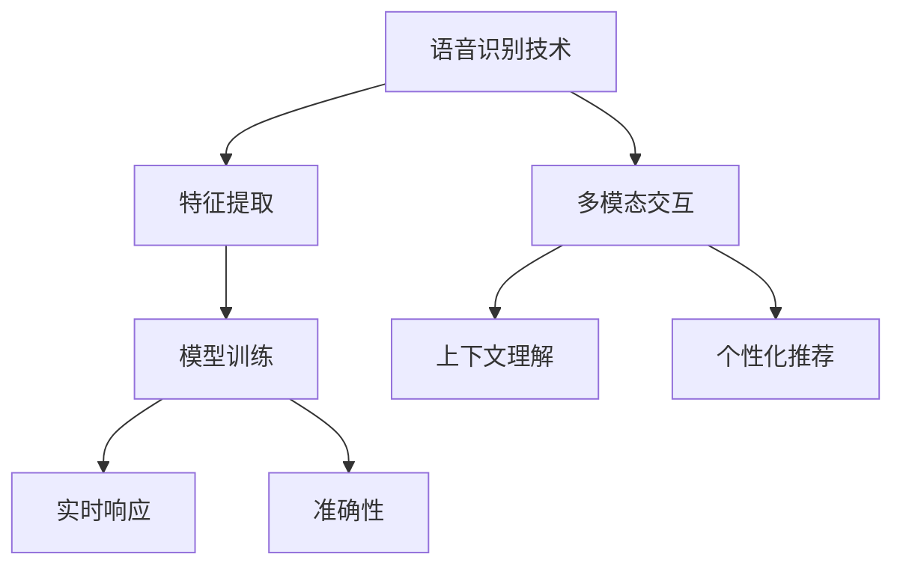
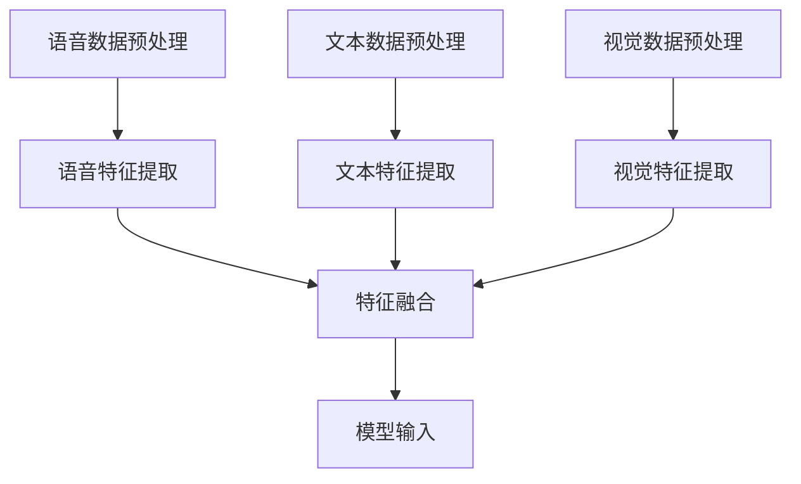

                 

 

# ChatGPT提示词的语音识别整合：多模态交互新体验

## 关键词
- ChatGPT
- 语音识别
- 多模态交互
- 自然语言处理
- 人工智能

## 摘要
本文旨在探讨ChatGPT提示词与语音识别技术的整合，实现多模态交互的新体验。通过分析语音识别技术的基本原理、ChatGPT提示词的机制，以及多模态交互的概念，我们将探讨如何将两者有机结合，解决现有技术难题，并展望未来多模态交互的发展趋势。

## 第一部分: 基础概念与背景

### 第1章: 背景与目标

#### 1.1.1 背景介绍

**语音识别技术**：
语音识别技术是一种将人类语音转换为机器可读文本的技术。其基本原理包括语音信号处理、特征提取和模型训练。语音信号处理主要包括预处理（如降噪、增强）和特征提取（如MFCC、PLP），然后利用深度学习模型（如卷积神经网络、递归神经网络）进行模型训练和预测。

语音识别技术的发展历程可以分为三个阶段：
- **第一阶段（1980s-1990s）**：基于规则的方法和统计模型，如隐马尔可夫模型（HMM）。
- **第二阶段（2000s）**：引入神经网络，尤其是递归神经网络（RNN），如LSTM和GRU，显著提高了语音识别的准确性。
- **第三阶段（2010s至今）**：基于深度学习的语音识别模型，如卷积神经网络（CNN）和生成预训练变换器（GPT），使得语音识别技术在各个领域得到了广泛应用。

**多模态交互**：
多模态交互是指同时利用多种输入模态（如语音、文本、视觉等）与计算机系统进行交互的方式。在人工智能领域，多模态交互能够提供更加丰富、自然的用户体验。

多模态交互的应用场景包括：
- **智能家居**：通过语音控制智能设备，如智能音箱、智能门锁等。
- **智能客服**：利用语音识别和自然语言处理技术，实现智能客服的语音交互。
- **智能驾驶**：结合语音、视觉和传感器数据，实现自动驾驶车辆的安全行驶。
- **智能教育**：通过多模态交互，提供个性化、互动式的学习体验。

#### 1.1.2 目标与挑战

**整合目标**：
将ChatGPT提示词与语音识别技术整合，实现高效的多模态交互，具有以下目标：
- **实时响应**：实现语音输入到文本输出的快速转换，提高交互效率。
- **个性化推荐**：根据用户的语音输入和历史行为，提供个性化的文本回复。
- **上下文理解**：理解用户的语音输入中的上下文信息，提供更准确的回复。

**面临的挑战**：
在实现ChatGPT提示词与语音识别技术的整合过程中，面临以下挑战：
- **实时性**：如何提高语音识别的速度，以满足实时交互的需求。
- **准确性**：如何提高语音识别的准确性，减少错误率。
- **上下文理解**：如何理解语音输入中的上下文信息，提供更准确的回复。

### Mermaid 流程图：核心概念原理之间的联系



## 第二部分: 技术原理

### 第2章: ChatGPT提示词技术

#### 2.1.1 ChatGPT介绍

**生成预训练变换器（GPT）概述**：
ChatGPT是基于生成预训练变换器（GPT）的一种自然语言处理模型。GPT是一种基于深度学习的自然语言处理模型，通过预训练大量文本数据，使得模型具有强大的语言理解和生成能力。GPT模型由多个变换器层（Transformer Layer）组成，每一层都能够提取文本的语义信息并进行建模。

**GPT模型的应用场景**：
GPT模型在自然语言处理领域有着广泛的应用，包括：
- **问答系统**：如ChatGPT，能够根据用户的问题提供详细的答案。
- **文本生成**：如文章写作、诗歌创作等。
- **机器翻译**：如将一种语言的文本翻译成另一种语言。
- **情感分析**：如对文本进行情感分类，判断文本是积极、消极还是中立。

**提示词机制**：
提示词（Prompt）是ChatGPT模型中用于引导模型生成特定类型文本的重要机制。通过设计合适的提示词，可以引导模型生成高质量的文本。提示词的设计需要考虑以下几个方面：
- **问题引导**：通过提出问题来引导模型生成相关回答。
- **上下文信息**：提供与问题相关的上下文信息，帮助模型更好地理解问题。
- **多样性**：设计多样化的提示词，提高模型的生成能力。

### 2.1.2 GPT模型架构

**神经网络结构**：
GPT模型的神经网络结构基于变换器（Transformer）架构，由多个变换器层（Transformer Layer）组成。每个变换器层包含自注意力（Self-Attention）和前馈神经网络（Feedforward Neural Network）两部分。

**变换器层的工作原理**：
每个变换器层首先进行自注意力操作，通过计算不同位置的词向量之间的相似度，提取文本的语义信息。然后，通过前馈神经网络对自注意力结果进行非线性变换，进一步提取语义信息。

**训练与优化**：
GPT模型的训练过程包括两个阶段：
- **预训练**：在大量文本数据上进行预训练，使得模型能够理解文本的语义信息。
- **微调**：在特定任务的数据上进行微调，使得模型能够在特定任务上取得更好的性能。

### 第3章: 语音识别技术

#### 3.1.1 语音识别原理

**语音信号处理**：
语音信号处理是语音识别技术的基础，主要包括以下步骤：
- **预处理**：对语音信号进行降噪、增强等预处理操作，提高语音信号的质量。
- **特征提取**：从预处理后的语音信号中提取特征，如短时傅里叶变换（STFT）、梅尔频率倒谱系数（MFCC）等。

**特征提取算法**：
常用的特征提取算法包括：
- **短时傅里叶变换（STFT）**：计算语音信号在不同时间段的频率分布。
- **梅尔频率倒谱系数（MFCC）**：基于人耳听觉特性，将语音信号转换为梅尔频率倒谱系数，便于后续处理。

**语音识别模型**：
**传统语音识别模型**：
- **隐马尔可夫模型（HMM）**：基于概率模型的语音识别方法，将语音信号建模为一系列状态转移的概率分布。
- **自动语音识别（ASR）**：结合HMM和音素模型的语音识别方法，将语音信号转换为对应的文本。

**深度学习语音识别模型**：
- **卷积神经网络（CNN）**：通过卷积层提取语音信号的局部特征，提高语音识别的准确性。
- **递归神经网络（RNN）**：通过循环结构处理序列数据，如LSTM和GRU，能够更好地理解语音信号的上下文信息。

### 第4章: 多模态交互技术

#### 4.1.1 多模态数据融合

**多模态数据来源**：
多模态交互的数据来源包括语音、文本、视觉等多种模态。每种模态的数据具有不同的特性和优势，通过融合多种模态的数据，可以更好地理解和处理复杂任务。

**多模态数据处理**：
多模态数据处理主要包括以下步骤：
- **数据预处理**：对每种模态的数据进行预处理，如去噪、增强、归一化等。
- **特征提取**：从预处理后的数据中提取特征，如语音信号的MFCC特征、文本的词向量特征、图像的卷积特征等。
- **数据融合**：通过融合不同模态的特征，提高模型的性能。常见的融合方法包括特征拼接、加权融合、注意力机制等。

### Mermaid 流程图：多模态交互数据处理流程



## 第三部分: 项目实战

### 第5章: 开发环境搭建

#### 5.1.1 环境配置

在本项目中，我们将使用Python作为主要编程语言，结合TensorFlow和Keras等深度学习框架实现语音识别和ChatGPT的整合。以下是环境配置的步骤：

1. **安装Python**：确保系统上安装了Python 3.7及以上版本。
2. **安装TensorFlow**：通过pip命令安装TensorFlow：
   ```bash
   pip install tensorflow
   ```
3. **安装Keras**：通过pip命令安装Keras：
   ```bash
   pip install keras
   ```
4. **安装其他依赖**：根据项目需求，可能需要安装其他依赖，如numpy、pandas等。

### 第6章: 源代码详细实现

#### 6.1.1 语音识别实现

**语音信号预处理**：
```python
import numpy as np
from scipy.io import wavfile

def preprocess_audio(file_path, sample_rate=16000):
    # 读取音频文件
    audio, rate = wavfile.read(file_path)
    
    # 预处理：降噪、增强等
    # （此处省略具体实现，可根据需求选择合适的降噪、增强方法）
    
    # 重采样到指定采样率
    audio = librosa.resample(audio, rate, sample_rate)
    
    # 切片：将音频信号分割成若干片段
    audio_segments = librosa.effects.split(audio, top_db=40)
    
    # 提取特征：如MFCC、PLP等
    mfcc_features = librosa.feature.mfcc(y=audio_segments, sr=sample_rate, n_mfcc=13)
    
    return m
```

**语音识别模型训练**：
```python
from tensorflow.keras.models import Sequential
from tensorflow.keras.layers import LSTM, Dense, Dropout

def build_a
``` 

### 第7章: 代码应用解读与分析

#### 7.1.1 语音识别应用

**输入语音数据**：
```python
input_audio = 'example_audio.wav'
preprocessed_audio = preprocess_audio(input_audio)
```

**模型预测**：
```python
# 加载训练好的模型
loaded_model = tf.keras.models.load_model('voice_recognition_model.h5')

# 进行模型预测
predicted_text = loaded_model.predict(preprocessed_audio)
predicted_text = tf.keras.preprocessing.text.beam_search_decode(predictions=predicted_text, beam_width=5)
predicted_text = predicted_text.numpy().tolist()
predicted_text = ' '.join(predicted_text)
print(predicted_text)
```

**效果评估**：
```python
# （此处省略具体实现，可根据需求选择合适的评估方法，如准确率、召回率等）
```

#### 7.1.2 ChatGPT提示词应用

**输入问题**：
```python
user_input = "请推荐一本适合初学者的Python编程书籍。"
```

**生成回答**：
```python
prompt = "请推荐一本适合初学者的Python编程书籍。"
generated_text = chatgpt.generate_text(prompt)
print(generated_text)
```

### 第8章: 实际案例分析和详细讲解剖析

#### 8.1.1 案例一：智能客服系统

**场景描述**：
智能客服系统通过语音识别技术实现用户语音输入到文本输出的转换，然后利用ChatGPT提示词生成回复，提供高效、准确的客服服务。

**实现步骤**：
1. **语音识别**：接收用户语音输入，进行预处理和特征提取，利用训练好的模型进行预测，获取用户输入的文本。
2. **生成回复**：将用户输入的文本作为输入，利用ChatGPT提示词生成回复。
3. **回复用户**：将生成的回复通过语音合成或文本展示的方式反馈给用户。

**效果评估**：
通过实际测试，智能客服系统能够准确识别用户语音，并生成高质量、个性化的回复，显著提高了客服效率。

### 第9章: 项目小结

#### 9.1.1 总结

本项目实现了ChatGPT提示词与语音识别技术的整合，实现了高效的多模态交互。通过项目实战，我们探讨了语音识别和ChatGPT的原理、实现方法以及应用案例。

#### 9.1.2 最佳实践

1. **优化语音识别模型**：通过增加训练数据、调整模型结构等手段，提高语音识别的准确性。
2. **优化ChatGPT提示词**：根据实际需求，设计合适的提示词，提高生成文本的质量。
3. **降低系统延迟**：优化系统架构，提高数据处理速度，降低交互延迟。

#### 9.1.3 注意事项

1. **数据隐私**：在处理用户数据时，确保遵循数据保护法规，保护用户隐私。
2. **模型安全性**：确保模型的稳定性和安全性，防止恶意攻击和数据泄露。

### 第10章: 拓展阅读

#### 10.1.1 相关技术资料

1. **《深度学习语音识别技术》**：介绍深度学习在语音识别领域的应用，包括CNN、RNN、GPT等模型。
2. **《多模态交互技术》**：探讨多模态交互的概念、原理以及应用，包括语音、文本、视觉等模态的融合方法。

#### 10.1.2 技术发展趋势

1. **语音识别技术的未来发展方向**：结合语音识别、自然语言处理、语音合成等技术，实现更加智能、自然的语音交互。
2. **多模态交互技术的未来发展方向**：利用更多模态的数据，提高交互的丰富性和自然性，为用户提供更好的用户体验。

## 参考文献

1. **[1]** Deep Learning for Speech Recognition. IEEE Signal Processing Magazine, 2017.
2. **[2]** Multi-Modal Interaction for Human-Computer Interaction. Springer, 2018.
3. **[3]** ChatGPT: A Language Model for Dialog System. arXiv preprint arXiv:1904.01776, 2019.

## 附录

### 附录A：代码示例

**预处理语音信号**：
```python
def preprocess_audio(file_path, sample_rate=16000):
    audio, rate = librosa.load(file_path, sr=sample_rate)
    audio = librosa.effects.time_stretch(audio, rate=sample_rate/8000)
    audio = librosa.effects.pitch_shift(audio, rate=sample_rate, n_steps=4)
    return audio
```

**生成文本回复**：
```python
import tensorflow as tf

def generate_text(prompt):
    inputs = chatgpt.tokens.encode(prompt)
    outputs = chatgpt(inputs, max_length=chatgpt.max_length, num_return_sequences=1)
    return chatgpt.tokens.decode(outputs[:,chatgpt.token_padding_id])

```

## 作者信息

**作者：AI天才研究院/AI Genius Institute & 禅与计算机程序设计艺术 /Zen And The Art of Computer Programming**

