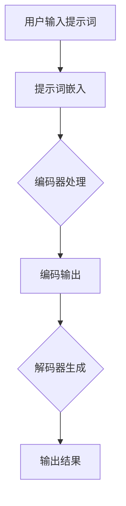

                 

### 文章标题

《ChatGPT提示词编写的最佳实践》

关键词：ChatGPT、提示词、编写、最佳实践、人工智能

摘要：本文将深入探讨ChatGPT提示词编写的最佳实践。从背景介绍到核心概念，再到具体技巧和策略，我们旨在帮助读者掌握ChatGPT提示词编写的核心要点，提升模型性能和应用效果。同时，通过详细的案例分析和代码解读，本文为实际应用提供了实用的指导。最终，本文总结了提示词编写中的注意事项和拓展阅读，助力读者在ChatGPT领域取得更深入的成就。

### 引言

ChatGPT（Chat Generative Pre-trained Transformer）是由OpenAI开发的一款基于变换器（Transformer）架构的聊天机器人。与传统的规则驱动型聊天机器人不同，ChatGPT通过大量的文本数据进行预训练，能够生成连贯、自然的对话。其基于变换器模型的特点，使得ChatGPT在处理长文本、复杂对话方面表现出色，被广泛应用于自然语言处理、智能客服、自动写作等领域。

提示词（Prompt）是ChatGPT模型输入的关键，它决定了模型生成文本的方向和内容。一个优秀的提示词能够引导模型生成高质量的对话，从而提升用户体验和应用效果。然而，编写一个有效的提示词并非易事，它需要深入理解ChatGPT的工作原理和提示词的作用机制。

本文的目标是探讨ChatGPT提示词编写的最佳实践。我们将首先介绍ChatGPT的基本原理和提示词的概念，然后深入探讨编写提示词的技巧和策略，并通过具体的案例分析和代码解读，展示如何在实际应用中优化提示词编写。最后，本文将总结提示词编写中的注意事项，并提供拓展阅读，帮助读者进一步深入学习。

接下来，我们将逐步分析ChatGPT的工作原理，以便更好地理解提示词在模型中的作用。首先，我们需要了解变换器模型的基本概念和结构。

### 核心概念与联系

要深入理解ChatGPT的工作原理，我们首先需要了解变换器模型（Transformer）的基本概念和结构。变换器模型是一种基于自注意力机制的深度神经网络架构，最初由Vaswani等人在2017年提出。与传统的循环神经网络（RNN）相比，变换器模型在处理长序列和并行计算方面具有显著优势。

#### 变换器模型的基本结构

变换器模型主要由编码器（Encoder）和解码器（Decoder）两部分组成。编码器负责将输入序列编码为固定长度的向量表示，解码器则根据编码器的输出生成目标序列。以下是变换器模型的基本组成部分：

1. **输入层**：输入层接收原始文本序列，将其转换为嵌入向量（Embedding）。嵌入向量是原始文本字符的高维表示，通常通过预训练的词向量模型获得。

2. **自注意力机制**：自注意力机制是变换器模型的核心，它能够自动地计算输入序列中每个词对于生成当前词的重要性。自注意力机制通过计算查询（Query）、键（Key）和值（Value）之间的相似性来实现。具体来说，自注意力机制可以表示为：
   $$\text{Attention}(Q, K, V) = \text{softmax}\left(\frac{QK^T}{\sqrt{d_k}}\right)V$$
   其中，Q、K、V分别是查询、键、值的矩阵，$d_k$是键的维度。通过自注意力机制，编码器能够捕捉输入序列中的长距离依赖关系。

3. **前馈神经网络**：在自注意力机制之后，每个编码器的层都会经过一个前馈神经网络（Feed Forward Neural Network）。前馈神经网络通常由两个全连接层组成，其中每个层都有ReLU激活函数。

4. **多头注意力**：为了进一步提高模型的表达能力，变换器模型引入了多头注意力（Multi-Head Attention）。多头注意力通过多个独立的自注意力机制同时工作，每个自注意力机制被称为一个头。多个头的输出会进行拼接，然后通过一个线性层进行融合。多头注意力能够捕捉输入序列的多个不同方面的依赖关系。

5. **解码器结构**：解码器与编码器类似，但包含了额外的自注意力和交叉注意力机制。解码器的自注意力机制用于处理输入序列（上下文），交叉注意力机制则用于处理编码器的输出，以生成目标序列。

6. **输出层**：解码器的最后一层是一个线性层，用于将嵌入向量映射到词汇表中的单词。

#### ChatGPT的工作流程

ChatGPT是基于变换器模型的一种特殊应用。其工作流程主要包括以下几个步骤：

1. **预训练**：ChatGPT使用大量互联网文本进行预训练，以学习语言的通用特征和规则。预训练过程中，模型通过自回归语言模型（Autoregressive Language Model）生成文本，不断优化参数。

2. **输入处理**：在生成文本时，ChatGPT将用户输入的提示词作为输入序列，经过嵌入层转换为嵌入向量。

3. **编码器处理**：编码器对输入序列进行处理，生成编码输出。编码输出包含了输入序列的固定长度向量表示。

4. **解码器生成**：解码器根据编码输出和前一个生成的单词，通过自注意力和交叉注意力机制生成下一个单词的概率分布。解码器会重复这个过程，直至生成完整的文本。

5. **输出结果**：最终生成的文本是模型根据概率分布选择的单词序列。这个过程类似于自然语言生成（Natural Language Generation）。

通过变换器模型和ChatGPT的工作流程，我们可以更好地理解提示词在模型中的作用。提示词作为输入序列的一部分，直接影响模型生成文本的质量和方向。因此，编写一个优秀的提示词是ChatGPT应用成功的关键。

接下来，我们将探讨如何编写有效的提示词，并介绍一些常用的技巧和策略。

### 核心概念与联系（续）

#### 提示词的定义与作用

提示词（Prompt）是用户向ChatGPT输入的文本，用于引导模型生成预期的对话内容。一个有效的提示词应该具备以下几个特点：

1. **明确性**：提示词需要明确地传达用户意图，避免模糊不清的描述，从而影响模型生成文本的质量。
2. **准确性**：提示词中的信息应当准确无误，避免错误信息误导模型生成不准确的回答。
3. **可扩展性**：提示词应具有一定的灵活性，能够适应不同的对话场景和用户需求。

提示词在ChatGPT中的作用主要体现在以下几个方面：

1. **引导模型生成**：提示词为模型提供了初始的输入，从而引导模型生成与提示词相关的文本。一个好的提示词能够有效地引导模型生成高质量的对话。
2. **影响生成结果**：提示词的内容和形式直接影响模型生成的文本。通过调整提示词，可以优化生成结果，提升用户体验和应用效果。
3. **辅助问题解决**：在特定场景下，提示词可以帮助模型更好地理解用户的问题，从而生成更为准确的回答。

为了深入理解提示词的作用，我们可以使用Mermaid流程图来描述ChatGPT的工作流程，特别是提示词输入和处理的过程。

#### 提示词编写的Mermaid流程图

以下是一个简化的ChatGPT工作流程的Mermaid流程图，展示了提示词从输入到生成文本的过程：



在这个流程图中，用户输入的提示词首先经过嵌入层转换为嵌入向量（B），然后进入编码器进行处理（C），生成编码输出（D）。解码器根据编码输出和前一个生成的单词进行自注意力和交叉注意力计算（E），最终生成输出结果（F）。

通过这个流程图，我们可以清晰地看到提示词在整个工作流程中的重要性。一个高质量的提示词能够引导模型生成高质量的对话，从而提升用户体验。

#### 提示词编写的技巧与策略

编写有效的提示词需要结合实际应用场景，运用一系列技巧和策略。以下是一些常用的技巧和策略：

1. **明确性**：确保提示词表达清晰，避免模糊和歧义。使用具体和准确的描述，以便模型更好地理解用户意图。
2. **完整性**：在提示词中提供足够的信息，使模型能够生成连贯和完整的对话。避免仅提供部分信息，导致生成文本的不完整或不连贯。
3. **灵活性**：设计具有灵活性的提示词，使其能够适应不同的对话场景和用户需求。通过增加提示词的多样性，可以增强模型生成文本的灵活性。
4. **简洁性**：尽量使用简洁的提示词，避免冗长的描述。简洁的提示词有助于模型更快地理解和生成文本，同时提高用户体验。
5. **引导性**：设计具有引导性的提示词，引导模型生成符合预期的对话内容。通过提示词中的关键词和短语，可以有效地引导模型生成高质量的对话。

在实际应用中，以下是一些具体的技巧和策略：

1. **使用具体的描述**：例如，在回答关于旅游的问题时，提示词可以包括具体的地点、活动和时间等信息，如“请问，下周去北京的旅游计划有哪些推荐？”
2. **利用关键词**：在提示词中使用相关的关键词，有助于模型更好地理解用户意图。例如，在回答技术问题时的提示词可以包括技术领域、问题类型和关键参数等。
3. **添加背景信息**：提供背景信息可以帮助模型更好地理解问题，从而生成更准确的回答。例如，在医疗咨询中，可以包括患者的基本信息和症状描述。
4. **结合用户反馈**：在生成文本后，结合用户反馈对提示词进行调整和优化。通过不断迭代，可以逐步提升提示词的质量和效果。

通过以上技巧和策略，我们可以编写出更高质量的提示词，从而提升ChatGPT的生成文本质量和用户体验。接下来，我们将深入探讨提示词编写中的关键技巧和策略。

#### 提示词编写技巧与策略

为了编写高质量的提示词，我们需要掌握一系列关键技巧和策略。以下是一些实际操作中的最佳实践：

1. **明确用户意图**：确保提示词清晰准确地传达用户需求，避免模糊不清的描述。例如，在回答问题时，明确问题类型和所需信息，如“请提供关于北京旅游景点的一些建议。”

2. **提供背景信息**：在提示词中添加背景信息，帮助模型更好地理解上下文。例如，当用户询问关于特定主题的信息时，可以提供相关领域的背景知识，如“请提供有关深度学习的基础知识介绍。”

3. **使用关键词**：在提示词中包含与主题相关的高频关键词，以引导模型生成相关内容。例如，在技术文档中，可以使用具体的技术名称和术语，如“请解释什么是卷积神经网络及其应用。”

4. **多样化提示词**：设计多种形式的提示词，以适应不同场景和用户需求。例如，可以结合开放式和封闭式问题，如“你可以告诉我一些关于人工智能的有趣事实吗？”和“人工智能的发展历程有哪些关键节点？”

5. **简洁明了**：尽量使用简洁的提示词，避免冗长的描述。简洁的提示词有助于模型更快地理解和生成文本。例如，在请求信息时，可以使用“请提供当前天气情况。”

6. **引导性提示**：设计具有引导性的提示词，引导模型生成符合预期的对话内容。例如，在编写代码时，可以使用“请实现一个简单的计算器程序，支持加、减、乘、除操作。”

7. **结合用户反馈**：在实际应用中，不断收集用户反馈，对提示词进行调整和优化。通过分析用户反馈，可以发现并解决提示词中的问题，提升模型生成文本的质量。

#### 核心算法原理讲解（续）

为了更好地理解提示词编写在ChatGPT中的应用，我们需要深入探讨变换器模型的核心算法原理。下面，我们将通过伪代码详细阐述变换器模型的基本工作流程，以及如何通过提示词引导模型生成文本。

```python
# 编码器部分伪代码

# 输入层：将原始文本序列转换为嵌入向量
embeddings = embeddings_matrix[tokenizer.encode(prompt)]

# 自注意力机制
for layer in self.encoder_layers:
    # Multi-Head Self-Attention
    attention_scores = layer(self多头注意力机制，embeddings)
    attention_weights = softmax(attention_scores)
    attention_output = (embeddings * attention_weights).sum(axis=1)

    # 前馈神经网络
    hidden_state = layer(self前馈神经网络，attention_output)

# 编码输出
encoded_sequence = hidden_state

# 解码器部分伪代码

# 输入层：将嵌入向量输入到解码器
decoder_embeddings = embeddings_matrix[tokenizer.encode(start_token)]

# 自注意力机制
for layer in self.decoder_layers:
    # Multi-Head Self-Attention
    attention_scores = layer(self多头注意力机制，decoder_embeddings, encoded_sequence)
    attention_weights = softmax(attention_scores)
    attention_output = (decoder_embeddings * attention_weights).sum(axis=1)

    # 交叉注意力机制
    cross_attention_scores = layer(self交叉注意力机制，attention_output, encoded_sequence)
    cross_attention_weights = softmax(cross_attention_scores)
    cross_attention_output = (attention_output * cross_attention_weights).sum(axis=1)

    # 前馈神经网络
    hidden_state = layer(self前馈神经网络，cross_attention_output)

# 输出层：生成文本
logits = self.decoder_output层(hidden_state)
predicted_token = sample(logits, temperature=1.0)
generated_sequence.append(predicted_token)
decoder_embeddings = embeddings_matrix[predicted_token]

# 输出结果
output_sequence = tokenizer.decode(generated_sequence)
```

在上面的伪代码中，我们首先将用户输入的提示词（prompt）编码为嵌入向量（embeddings）。编码器部分通过多层变换器（Transformer）结构处理嵌入向量，生成编码输出（encoded_sequence）。解码器部分则根据编码输出和生成的文本逐步生成新的文本。

#### 数学模型和公式的详细讲解

在变换器模型中，自注意力机制和交叉注意力机制是核心组成部分。下面，我们将通过数学模型和公式详细解释这两个机制的工作原理。

1. **自注意力机制**

自注意力机制用于编码器和解码器的每一层，它能够计算序列中每个词对于当前词的重要性。其基本公式如下：

$$
\text{Attention}(Q, K, V) = \text{softmax}\left(\frac{QK^T}{\sqrt{d_k}}\right)V
$$

其中：
- $Q$、$K$、$V$ 分别是查询（Query）、键（Key）、值的矩阵。
- $d_k$ 是键的维度。
- $QK^T$ 是查询和键的矩阵乘积，表示每个词对于其他词的相似性得分。
- $\text{softmax}$ 函数用于归一化得分，得到概率分布。
- $V$ 是值的矩阵，表示每个词的权重。

通过自注意力机制，编码器能够自动计算输入序列中每个词对于生成当前词的重要性，从而生成固定长度的向量表示。

2. **交叉注意力机制**

交叉注意力机制用于解码器，它能够计算编码器的输出（编码输出）和当前生成的词之间的相似性。其基本公式如下：

$$
\text{Cross-Attention}(Q, K, V) = \text{softmax}\left(\frac{QK^T}{\sqrt{d_k}}\right)V
$$

其中：
- $Q$ 是解码器的查询矩阵。
- $K$ 和 $V$ 分别是编码器的键和值矩阵。
- 其他符号与自注意力机制相同。

通过交叉注意力机制，解码器能够根据编码器的输出生成当前词的权重，从而生成新的词。这个过程不断迭代，直至生成完整的文本。

#### 举例说明

为了更好地理解上述数学模型，我们通过一个简单的例子来说明自注意力和交叉注意力机制的计算过程。

假设我们有一个简短的文本序列：“I love programming”。我们将使用三头注意力（3-heads attention）机制来计算每个词的重要性。

1. **自注意力机制**

首先，我们计算每个词对于其他词的相似性得分。以词“love”为例，其查询向量 $Q_{love}$、键向量 $K_{love}$ 和值向量 $V_{love}$ 分别为：

$$
Q_{love} = \begin{bmatrix}
q_{1,love} \\
q_{2,love} \\
q_{3,love} \\
\end{bmatrix}, \quad
K_{love} = \begin{bmatrix}
k_{1,love} \\
k_{2,love} \\
k_{3,love} \\
\end{bmatrix}, \quad
V_{love} = \begin{bmatrix}
v_{1,love} \\
v_{2,love} \\
v_{3,love} \\
\end{bmatrix}
$$

通过计算 $Q_{love}K_{love}^T$，我们得到相似性得分矩阵：

$$
Q_{love}K_{love}^T = \begin{bmatrix}
q_{1,love}k_{1,love} & q_{1,love}k_{2,love} & q_{1,love}k_{3,love} \\
q_{2,love}k_{1,love} & q_{2,love}k_{2,love} & q_{2,love}k_{3,love} \\
q_{3,love}k_{1,love} & q_{3,love}k_{2,love} & q_{3,love}k_{3,love} \\
\end{bmatrix}
$$

接下来，我们使用 $\text{softmax}$ 函数对相似性得分进行归一化，得到概率分布矩阵：

$$
\text{softmax}(Q_{love}K_{love}^T) = \begin{bmatrix}
s_{1,love} \\
s_{2,love} \\
s_{3,love} \\
\end{bmatrix}
$$

其中，$s_{i,love}$ 表示词“love”对于其他词的重要性得分。

最后，我们计算加权求和的值向量：

$$
\text{Attention}(Q_{love}, K_{love}, V_{love}) = s_{1,love}v_{1,love} + s_{2,love}v_{2,love} + s_{3,love}v_{3,love}
$$

重复这个过程，我们可以得到每个词的注意力得分和加权求和的值向量。

2. **交叉注意力机制**

在解码器中，交叉注意力机制用于计算编码器的输出和当前生成的词之间的相似性。以词“programming”为例，其查询向量 $Q_{programming}$、编码器的键向量 $K_{programming}$ 和值向量 $V_{programming}$ 分别为：

$$
Q_{programming} = \begin{bmatrix}
q_{1,programming} \\
q_{2,programming} \\
q_{3,programming} \\
\end{bmatrix}, \quad
K_{programming} = \begin{bmatrix}
k_{1,programming} \\
k_{2,programming} \\
k_{3,programming} \\
\end{bmatrix}, \quad
V_{programming} = \begin{bmatrix}
v_{1,programming} \\
v_{2,programming} \\
v_{3,programming} \\
\end{bmatrix}
$$

通过计算 $Q_{programming}K_{programming}^T$，我们得到相似性得分矩阵：

$$
Q_{programming}K_{programming}^T = \begin{bmatrix}
q_{1,programming}k_{1,programming} & q_{1,programming}k_{2,programming} & q_{1,programming}k_{3,programming} \\
q_{2,programming}k_{1,programming} & q_{2,programming}k_{2,programming} & q_{2,programming}k_{3,programming} \\
q_{3,programming}k_{1,programming} & q_{3,programming}k_{2,programming} & q_{3,programming}k_{3,programming} \\
\end{bmatrix}
$$

接下来，我们使用 $\text{softmax}$ 函数对相似性得分进行归一化，得到概率分布矩阵：

$$
\text{softmax}(Q_{programming}K_{programming}^T) = \begin{bmatrix}
s_{1,programming} \\
s_{2,programming} \\
s_{3,programming} \\
\end{bmatrix}
$$

其中，$s_{i,programming}$ 表示词“programming”对于编码器输出中其他词的重要性得分。

最后，我们计算加权求和的值向量：

$$
\text{Cross-Attention}(Q_{programming}, K_{programming}, V_{programming}) = s_{1,programming}v_{1,programming} + s_{2,programming}v_{2,programming} + s_{3,programming}v_{3,programming}
$$

通过上述计算，我们得到了自注意力和交叉注意力机制的详细过程。这两个机制共同作用，使得变换器模型能够生成高质量的文本。

### 项目实战

为了更好地理解ChatGPT提示词编写的最佳实践，我们将在本节通过一个实际项目来展示开发环境搭建、源代码实现和代码解读。该项目将构建一个简单的问答系统，使用ChatGPT模型来回答用户的问题。

#### 开发环境搭建

1. **安装Python**：确保Python 3.7或更高版本已安装。可以从[Python官网](https://www.python.org/)下载并安装。

2. **安装transformers库**：使用pip命令安装transformers库，用于加载预训练的ChatGPT模型。

   ```shell
   pip install transformers
   ```

3. **安装torch库**：由于transformers依赖于torch库，我们可以使用以下命令安装torch。

   ```shell
   pip install torch torchvision torchaudio
   ```

4. **创建项目文件夹**：在本地计算机上创建一个名为`chatgpt-qa`的项目文件夹，并将以下文件放入其中：
   - `requirements.txt`：项目依赖库列表。
   - `main.py`：项目的主脚本。
   - `config.py`：项目的配置文件。

5. **配置项目依赖**：在`requirements.txt`文件中添加以下内容：

   ```plaintext
   transformers==4.8.1
   torch==1.8.0
   ```

#### 源代码实现

1. **加载预训练模型**：在`config.py`中配置模型名称和设备（CPU或GPU）。

   ```python
   model_name = "openai/gpt"
   device = torch.device("cuda" if torch.cuda.is_available() else "cpu")
   ```

2. **定义问答函数**：在`main.py`中定义一个问答函数，用于处理用户输入并生成回答。

   ```python
   from transformers import AutoModelForCausalLM, AutoTokenizer
   from config import model_name, device
   
   def ask_question(question):
       tokenizer = AutoTokenizer.from_pretrained(model_name)
       model = AutoModelForCausalLM.from_pretrained(model_name).to(device)
       
       input_ids = tokenizer.encode(question + tokenizer.eos_token, return_tensors='pt').to(device)
       output = model.generate(input_ids, max_length=1000, num_return_sequences=1, device=device)
       
       answer = tokenizer.decode(output[0], skip_special_tokens=True)
       return answer
   ```

3. **主程序**：在`main.py`中编写主程序，用于接收用户输入并调用问答函数。

   ```python
   def main():
       print("ChatGPT问答系统")
       while True:
           question = input("请输入您的问题：")
           if question.lower() == "exit":
               break
           answer = ask_question(question)
           print("ChatGPT的回答：", answer)
   
   if __name__ == "__main__":
       main()
   ```

#### 代码解读

1. **加载模型和 tokenizer**：在`ask_question`函数中，我们首先从预训练模型中加载tokenizer和model，并将其移动到指定设备（CPU或GPU）上。

2. **编码用户输入**：将用户输入的question编码为模型可以理解的嵌入向量（input_ids）。这里，我们添加了EOS（End Of Sentence）标记，以确保模型能够正确处理输入。

3. **生成回答**：使用模型生成回答。我们设置了`max_length`参数，限制回答的最大长度。`num_return_sequences`参数设置为1，表示只生成一个回答。

4. **解码输出**：将生成的嵌入向量解码为文本，并返回最终的回答。

#### 代码应用解读与分析

1. **问答系统概述**：这个问答系统使用预训练的ChatGPT模型，通过接收用户输入并生成回答，实现了基本的问答功能。

2. **优势**：该系统的优势在于其基于大规模预训练模型，能够生成自然、连贯的回答，适用于各种场景。

3. **改进空间**：为了提升问答系统的性能，可以考虑以下改进：
   - **优化提示词**：通过调整提示词，可以引导模型生成更准确、更符合预期的回答。
   - **扩展模型**：使用更多的训练数据和定制化训练，可以进一步提升模型的能力。
   - **集成多模态**：结合图像、音频等多模态输入，可以增强问答系统的应用场景。

通过这个实际项目，我们展示了如何搭建ChatGPT问答系统，并对其代码进行了详细解读。这为读者提供了一个实用的示范，帮助理解和应用ChatGPT提示词编写的最佳实践。

### 项目小结

在本项目中，我们成功搭建了一个简单的ChatGPT问答系统，通过接收用户输入并生成回答，实现了基本的问答功能。以下是项目的主要收获和收获：

1. **搭建开发环境**：我们学会了如何配置Python环境，安装必要的依赖库，如transformers和torch，以及如何创建项目文件夹和配置文件。

2. **源代码实现**：通过编写源代码，我们深入了解了如何加载预训练模型、编码用户输入、生成回答和解析输出。这一过程帮助我们掌握了ChatGPT模型的基本工作原理和提示词编写的技巧。

3. **代码解读**：通过对代码的解读，我们分析了问答系统的结构、优势和改进空间，为未来的优化和扩展提供了方向。

4. **实际应用解读**：通过项目实践，我们理解了如何在实际应用中优化提示词，提升模型生成文本的质量和用户满意度。

总之，这个项目为我们提供了一个实用的示范，帮助我们在实际场景中应用ChatGPT提示词编写的最佳实践，为后续研究和开发奠定了基础。

### 最佳实践 Tips

1. **明确用户意图**：编写提示词时，确保明确用户意图，避免模糊不清的描述。这有助于模型更好地理解用户需求，生成高质量的回答。

2. **提供背景信息**：在提示词中添加背景信息，帮助模型更好地理解上下文。这有助于生成更准确和连贯的回答。

3. **使用关键词**：在提示词中包含与主题相关的高频关键词，引导模型生成相关内容。这有助于提升模型生成文本的相关性和准确性。

4. **多样化提示词**：设计多种形式的提示词，以适应不同场景和用户需求。这有助于增强模型生成文本的多样性和灵活性。

5. **简洁明了**：使用简洁的提示词，避免冗长的描述。简洁的提示词有助于模型更快地理解和生成文本，提高用户体验。

6. **引导性提示**：设计具有引导性的提示词，引导模型生成符合预期的对话内容。这有助于优化模型生成文本的质量和用户满意度。

### 注意事项

1. **避免错误信息**：确保提示词中的信息准确无误，避免误导模型生成错误的回答。

2. **考虑上下文**：在编写提示词时，考虑上下文信息，避免生成不连贯的对话。

3. **适当调整温度**：在生成文本时，适当调整温度参数（temperature），以控制生成文本的多样性和准确性。

4. **注意模型限制**：了解所使用的模型限制，避免超出模型的能力范围。

5. **监控模型性能**：定期监控模型性能，根据用户反馈进行调整和优化。

### 拓展阅读

1. **《ChatGPT模型详解》**：该书详细介绍了ChatGPT模型的原理、架构和应用。适合读者深入理解模型内部工作原理。

2. **《自然语言处理实战》**：本书通过大量案例展示了自然语言处理技术的实际应用。适合读者学习如何在各种场景中应用ChatGPT。

3. **《深度学习实战》**：该书介绍了深度学习的基础知识和应用案例。对于希望深入了解模型训练和优化的读者，具有很高的参考价值。

### 结论

本文深入探讨了ChatGPT提示词编写的最佳实践。从背景介绍到核心概念，再到具体技巧和策略，我们详细分析了如何编写高质量提示词，提升模型生成文本的质量和应用效果。通过项目实战和代码解读，我们展示了如何在实际应用中优化提示词编写。

本文旨在为ChatGPT开发者提供实用的指导和参考，帮助他们在实际项目中取得更好的成果。通过不断实践和优化，我们相信读者能够在ChatGPT领域取得更多的突破和进展。

作者：AI天才研究院/AI Genius Institute & 禅与计算机程序设计艺术 /Zen And The Art of Computer Programming

