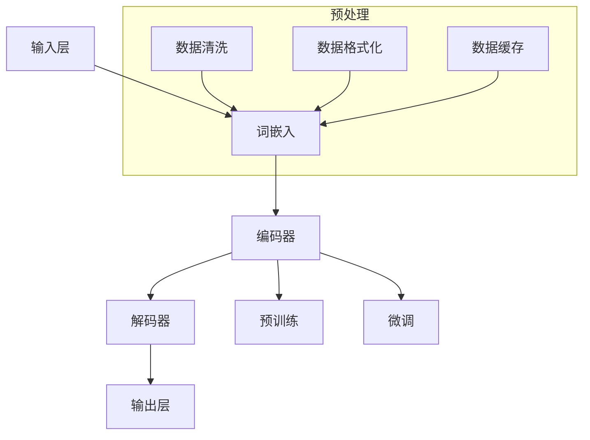

                 

# C侧LLM应用探索的关键：速度与敏捷性

> 关键词：C侧LLM，速度，敏捷性，优化，开发，实例，趋势

> 摘要：
本文将深入探讨C侧大型语言模型（C-side Large Language Model，简称C侧LLM）在应用过程中面临的关键挑战：速度与敏捷性。我们将首先介绍C侧LLM的背景与重要性，然后分析速度与敏捷性在软件开发中的意义，接着探讨C侧LLM如何提升速度与敏捷性。通过详细解读其基本原理、优化策略、敏捷开发实践以及实际应用案例，本文旨在为读者提供全面而深入的C侧LLM应用指南。

## 第1章：引言

### 1.1 C侧LLM的背景与重要性

#### C侧LLM的定义与演变

C侧LLM，即C-side Large Language Model，是指在计算环境中，特别是在CPU或GPU等中央处理单元上进行训练和推理的语言模型。与传统的云侧LLM（如Google的Bert、OpenAI的GPT等）相比，C侧LLM具有更灵活的部署方式和更低的延迟。

C侧LLM的演变始于深度学习和自然语言处理技术的快速发展。早期的自然语言处理技术主要集中在规则和统计方法上，但受限于计算能力和数据量。随着深度学习的兴起，特别是2018年GPT-1的发布，语言模型取得了显著的突破。然而，这些模型通常需要在云端进行训练和推理，不仅成本高昂，而且延迟较大。为了解决这一问题，C侧LLM应运而生。

#### C侧LLM在现代计算中的应用

C侧LLM在现代计算中的应用越来越广泛。在服务器端，C侧LLM被用于智能客服、文本分析、机器翻译等应用。在客户端，C侧LLM则被用于智能聊天机器人、语音识别、图像识别等应用。特别是在移动设备和嵌入式系统中，C侧LLM由于其低延迟和低功耗的特性，具有明显的优势。

#### C侧LLM的关键优势与挑战

C侧LLM的关键优势在于其灵活的部署方式和低延迟。然而，这也带来了相应的挑战，如计算资源的限制、数据同步的难题以及模型优化和压缩的挑战。如何在有限的计算资源下，实现C侧LLM的高效部署和推理，是当前研究的热点问题。

### 1.2 为什么速度与敏捷性是关键

#### 性能需求的重要性

在当今的数字化时代，用户对服务的响应速度要求越来越高。对于C侧LLM来说，速度是衡量其性能的重要指标。快速的响应时间可以提高用户体验，减少用户的等待时间，从而提高系统的整体性能。

#### 敏捷性在软件开发中的意义

敏捷性是软件开发中的重要原则，强调快速迭代、持续交付和不断改进。在C侧LLM的开发中，敏捷性可以帮助开发团队更快速地响应需求变化，提高开发效率，降低开发风险。

#### C侧LLM如何提升速度与敏捷性

要提升C侧LLM的速度与敏捷性，可以从以下几个方面进行：

1. **优化算法**：采用更高效的训练和推理算法，如模型剪枝、量化、并行计算等。
2. **硬件加速**：利用GPU、TPU等硬件加速技术，提高模型处理速度。
3. **敏捷开发**：采用敏捷开发方法，如持续集成、持续部署、自动化测试等，提高开发效率。

### 1.3 本文结构

本文将分为以下几个部分：

1. **第2章**：C侧LLM的基本原理
2. **第3章**：C侧LLM的速度优化
3. **第4章**：C侧LLM的敏捷开发
4. **第5章**：C侧LLM应用实例
5. **第6章**：C侧LLM未来发展趋势
6. **第7章**：总结与展望

通过以上各章节的探讨，本文旨在为读者提供一个全面而深入的C侧LLM应用指南。## 第2章：C侧LLM的基本原理

### 2.1 语言模型基础

#### 语言模型的概念

语言模型是一种概率模型，用于预测自然语言中下一个词或词组的概率。它是自然语言处理（NLP）的核心组成部分，广泛应用于语音识别、机器翻译、文本生成、信息检索等领域。

#### 语言模型的分类

根据训练方法的不同，语言模型主要分为基于规则的模型和统计模型。基于规则的模型通过手工定义规则来预测词汇，如最小生成树模型。而统计模型则通过大量语料库的训练，学习词汇之间的概率分布，如N-gram模型、神经网络模型等。

#### 语言模型的工作原理

语言模型的工作原理可以概括为两个阶段：训练和推理。

1. **训练阶段**：语言模型通过大量语料库进行训练，学习词汇之间的概率分布。在训练过程中，模型会不断调整参数，以最大化模型的预测性能。

2. **推理阶段**：在推理阶段，语言模型根据输入的文本序列，预测下一个词或词组的概率分布。通过这种方式，语言模型可以生成连贯的文本序列。

### 2.2 预训练与微调

#### 预训练的方法与流程

预训练是一种在特定任务之前对模型进行大规模数据预训练的方法。在预训练阶段，模型在大量无标签数据上进行训练，学习通用语言特征。常见的预训练方法包括：基于词嵌入的方法（如Word2Vec、GloVe）、基于上下文的方法（如BERT、GPT）等。

预训练的流程通常包括以下几个步骤：

1. **数据收集与预处理**：收集大量文本数据，并进行预处理，如分词、去除停用词、标准化等。

2. **模型初始化**：初始化语言模型，通常使用预训练的模型或从头开始训练。

3. **预训练**：在预训练阶段，模型会在大规模数据上进行训练，学习通用语言特征。

4. **评估与调整**：在预训练过程中，定期评估模型的性能，并根据评估结果调整模型参数。

#### 微调的优势与挑战

微调是一种在特定任务上对预训练模型进行微调的方法。通过微调，模型可以在特定任务上取得更好的性能。微调的优势包括：

1. **提高性能**：微调可以帮助模型更好地适应特定任务，从而提高模型的性能。

2. **减少数据需求**：与从头开始训练相比，微调可以在更少的数据量下取得更好的性能。

3. **提高泛化能力**：通过预训练和微调，模型可以学习到更通用的语言特征，从而提高模型的泛化能力。

然而，微调也面临一些挑战：

1. **计算资源需求**：微调通常需要大量的计算资源，特别是在大型模型上。

2. **数据分布问题**：微调可能会受到数据分布的影响，导致模型在特定数据集上过拟合。

3. **模型偏差**：预训练模型可能会带有一定的偏见，这些偏见可能会影响微调模型的性能。

#### 预训练与微调的结合策略

为了充分发挥预训练和微调的优势，可以采用以下结合策略：

1. **分层微调**：将预训练模型分为多层，逐层进行微调。这样可以避免将所有权重同时更新，降低计算资源需求。

2. **动态调整学习率**：在微调过程中，动态调整学习率可以帮助模型更好地适应特定任务。

3. **迁移学习**：将预训练模型迁移到其他任务上，通过少量数据微调，实现跨领域的模型复用。

### 2.3 C侧LLM的特殊性

#### C侧LLM的体系结构

C侧LLM的体系结构通常包括以下几个部分：

1. **输入层**：接收文本输入，并进行预处理。

2. **词嵌入层**：将输入的文本转换为词向量。

3. **编码器**：对词向量进行编码，提取文本的语义特征。

4. **解码器**：根据编码器的输出，生成文本序列。

5. **输出层**：对解码器的输出进行后处理，如分类、生成等。

#### C侧LLM的优化算法

C侧LLM的优化算法主要包括：

1. **梯度下降**：通过不断调整模型参数，使模型损失函数最小化。

2. **Adam优化器**：一种自适应的优化器，结合了梯度下降和动量法的优点。

3. **模型剪枝**：通过剪枝冗余的神经元或权重，减少模型参数量，提高模型效率。

4. **量化**：将模型的浮点数参数转换为低精度的整数参数，降低模型存储和计算成本。

#### C侧LLM的内存管理

C侧LLM的内存管理是保证模型高效运行的关键。以下是一些内存管理策略：

1. **分块内存分配**：将模型参数和中间变量分块存储，减少内存碎片。

2. **内存复用**：重复使用内存块，避免频繁的内存分配和释放。

3. **缓存策略**：合理设置缓存大小和缓存策略，提高内存访问速度。

通过以上对C侧LLM基本原理的介绍，我们可以看到，C侧LLM在体系结构、优化算法和内存管理等方面都有其特殊性。理解这些基本原理，有助于我们更好地进行C侧LLM的应用和优化。## 第3章：C侧LLM的速度优化

### 3.1 数据预处理优化

数据预处理是C侧LLM速度优化的重要环节。优化数据预处理可以提高模型训练和推理的效率。

#### 数据清洗与格式化

数据清洗包括去除无效数据、纠正错误数据、填充缺失数据等。有效的数据清洗可以减少模型训练的错误率，提高模型性能。数据格式化则是将数据转换为适合模型输入的形式，如分词、编码等。

#### 数据并行处理

数据并行处理可以大大提高模型训练速度。具体方法包括：

1. **数据分块**：将数据分成多个块，每个块独立处理，然后汇总结果。

2. **多线程处理**：利用多线程技术，同时处理多个数据块。

3. **分布式处理**：在分布式系统中，将数据分发到多个节点上处理，然后汇总结果。

#### 数据缓存与复用

数据缓存可以减少数据I/O操作，提高模型训练速度。具体策略包括：

1. **内存缓存**：将常用数据缓存在内存中，减少磁盘I/O操作。

2. **缓存复用**：复用已经处理过的数据，避免重复计算。

3. **缓存一致性**：保证缓存数据的一致性，避免缓存错误。

### 3.2 模型优化

模型优化是提高C侧LLM速度的关键步骤。以下是一些常见的模型优化方法：

#### 模型剪枝

模型剪枝是通过减少模型参数数量，降低模型复杂度，从而提高模型效率。具体方法包括：

1. **权重剪枝**：去除权重较小的神经元或权重。

2. **结构剪枝**：简化模型结构，如去除冗余层或神经元。

3. **渐进剪枝**：逐步减少模型参数，观察对模型性能的影响。

#### 模型压缩

模型压缩是通过降低模型存储和计算成本，提高模型运行速度。以下是一些常见的模型压缩方法：

1. **量化**：将模型参数从浮点数转换为整数，减少存储和计算成本。

2. **稀疏化**：将模型参数设置为稀疏矩阵，减少存储和计算开销。

3. **层次化压缩**：将模型分层压缩，优先压缩较低层参数。

#### 模型推理优化

模型推理优化是提高C侧LLM推理速度的关键。以下是一些常见的推理优化方法：

1. **并行推理**：利用多线程、多核CPU或GPU进行并行推理，提高推理速度。

2. **算法优化**：选择高效的推理算法，如基于矩阵乘法的推理算法。

3. **模型融合**：将多个模型融合，提高推理速度和精度。

### 3.3 硬件加速

硬件加速是提高C侧LLM速度的重要手段。以下是一些常见的硬件加速技术：

#### GPU优化

GPU优化是通过利用GPU的并行计算能力，提高模型训练和推理速度。具体方法包括：

1. **计算优化**：利用CUDA、OpenCL等GPU编程框架，实现计算并行化。

2. **内存优化**：优化GPU内存管理，减少内存访问延迟。

3. **数据传输优化**：优化数据传输速度，减少GPU与CPU之间的数据传输开销。

#### TPU优化

TPU（Tensor Processing Unit）是专门为深度学习任务设计的硬件加速器。TPU优化包括：

1. **TPU调度**：合理分配TPU资源，避免资源冲突。

2. **TPU编程**：利用TPU的特性，优化模型训练和推理。

3. **TPU集群**：利用TPU集群进行分布式训练和推理，提高处理能力。

#### 其他硬件加速技术

除了GPU和TPU，还有其他硬件加速技术，如FPGA、ASIC等。这些技术可以根据具体需求进行优化，提高C侧LLM的速度。

通过以上对C侧LLM速度优化的介绍，我们可以看到，速度优化涉及数据预处理、模型优化和硬件加速等多个方面。合理运用这些方法，可以有效提高C侧LLM的速度，满足现代计算对高性能的需求。## 第4章：C侧LLM的敏捷开发

### 4.1 敏捷开发方法

#### 敏捷开发的概念与原则

敏捷开发是一种以人为核心、迭代、循序渐进的开发方法。其核心理念包括：

1. **个体和互动重于过程和工具**：敏捷开发强调团队合作和沟通，认为人的因素比工具和流程更重要。

2. **可工作的软件重于详尽的文档**：敏捷开发认为软件质量是第一位的，而不是文档。虽然文档很重要，但更重要的是可工作的软件。

3. **客户协作重于合同谈判**：敏捷开发强调与客户的紧密合作，通过不断的反馈和调整，确保开发方向与客户需求一致。

4. **响应变化重于遵循计划**：敏捷开发认为需求是会变化的，因此开发过程需要灵活应对变化，而不是僵化地遵循计划。

#### 敏捷开发的核心实践

敏捷开发包括一系列核心实践，如：

1. **迭代开发**：将整个开发过程分为多个迭代周期，每个迭代周期完成一部分功能，并交付给用户使用。

2. **用户故事**：用户故事是一种简短、明确的功能描述，通常以用户的角度来编写，如“作为用户，我想能够查看我的订单历史”。

3. **每日站会**：每日站会是团队每天的简短会议，用于讨论进展、解决问题和协调工作。

4. **持续集成**：持续集成是将代码定期合并到主干分支，并进行自动化测试，确保代码质量。

5. **持续交付**：持续交付是将代码部署到生产环境，确保软件可以随时发布。

6. **代码审查**：代码审查是一种团队协作的方式，用于发现代码中的错误和改进建议。

7. **自动化测试**：自动化测试用于验证软件的功能和性能，确保软件质量。

#### 敏捷开发的优势与挑战

敏捷开发的优势包括：

1. **提高开发效率**：敏捷开发通过快速迭代和反馈，可以快速响应需求变化，提高开发效率。

2. **降低开发风险**：通过持续集成和自动化测试，可以及时发现和解决代码中的问题，降低开发风险。

3. **提高用户满意度**：与用户的紧密合作，确保开发方向与用户需求一致，提高用户满意度。

4. **促进团队协作**：敏捷开发强调团队合作和沟通，促进团队协作和知识共享。

然而，敏捷开发也面临一些挑战：

1. **管理难度增加**：敏捷开发需要更灵活的管理方式，对团队和项目的管理要求更高。

2. **对团队成员要求高**：敏捷开发要求团队成员具备较高的技术能力和沟通能力。

3. **初期投入较大**：敏捷开发需要投入资源进行持续集成、自动化测试等基础设施的建设。

### 4.2 持续集成与持续部署

#### 持续集成的方法与流程

持续集成（CI）是一种软件开发实践，通过将代码定期合并到主干分支，并进行自动化测试，确保代码质量。持续集成的方法与流程包括：

1. **代码提交**：团队成员定期将代码提交到版本控制系统中。

2. **自动化构建**：构建系统自动将代码合并到主干分支，并进行编译、打包等操作。

3. **自动化测试**：执行一系列自动化测试，包括单元测试、集成测试等，验证代码的功能和性能。

4. **代码审查**：团队成员对自动化测试的结果进行审查，确保代码质量。

5. **反馈与修复**：如果测试失败，团队成员需要修复代码并重新提交，直到测试通过。

#### 持续部署的优势与挑战

持续部署（CD）是一种将代码部署到生产环境的过程，确保软件可以随时发布。持续部署的优势包括：

1. **提高发布频率**：通过自动化部署，可以快速发布新功能，提高发布频率。

2. **降低部署风险**：通过自动化测试和审查，可以降低部署过程中的风险。

3. **提高团队效率**：自动化部署可以减少人工干预，提高团队效率。

然而，持续部署也面临一些挑战：

1. **环境一致性**：确保开发环境、测试环境和生产环境的一致性，避免环境差异导致问题。

2. **部署策略**：选择合适的部署策略，如蓝绿部署、灰度发布等，确保部署过程的稳定性。

3. **故障处理**：部署过程中可能出现故障，需要及时处理和恢复。

#### 持续集成与持续部署的结合

持续集成与持续部署的结合，可以充分发挥两者的优势。具体策略包括：

1. **自动化流程**：将持续集成和持续部署的流程自动化，减少人工干预。

2. **统一平台**：使用统一的平台管理持续集成和持续部署，提高效率。

3. **实时反馈**：通过实时反馈，快速发现问题并进行修复。

4. **质量监控**：持续监控软件质量，确保软件稳定性和可靠性。

通过敏捷开发方法、持续集成与持续部署的实践，C侧LLM的开发团队可以更高效地进行开发，更快地响应市场需求。敏捷开发不仅提高了开发效率，降低了开发风险，还促进了团队协作和知识共享。持续集成与持续部署的结合，确保了软件质量的稳定性和可靠性，提高了软件发布的频率和效率。## 第5章：C侧LLM应用实例

### 5.1 文本分类应用

#### 文本分类的原理与算法

文本分类是一种将文本数据根据其内容进行分类的任务。常见的文本分类算法包括基于朴素贝叶斯、支持向量机（SVM）和深度学习的方法。

1. **朴素贝叶斯**：基于贝叶斯定理，通过计算每个词在各个类别中的概率，然后选择概率最高的类别作为文本的分类结果。

2. **支持向量机（SVM）**：通过找到一个最佳的超平面，将不同类别的文本数据分隔开来。SVM在处理高维数据时具有较好的效果。

3. **深度学习**：使用神经网络模型，如卷积神经网络（CNN）和循环神经网络（RNN），通过学习文本数据的特征，进行分类。

#### 文本分类的应用案例

文本分类在多种场景中具有广泛的应用，例如：

1. **垃圾邮件过滤**：通过对邮件的内容进行分析，将垃圾邮件和正常邮件进行分类，提高用户的使用体验。

2. **情感分析**：通过对文本的情感倾向进行分析，帮助企业了解用户的需求和反馈，优化产品和服务。

3. **新闻分类**：将新闻文本按照主题或领域进行分类，提高新闻的浏览效率。

#### 文本分类的代码实现与分析

以下是一个基于朴素贝叶斯的文本分类器的简单实现：

```python
from sklearn.feature_extraction.text import TfidfVectorizer
from sklearn.naive_bayes import MultinomialNB
from sklearn.pipeline import make_pipeline

# 示例文本数据
text_data = [
    "我是一个好人",
    "我好开心",
    "我是一个坏人",
    "我好生气"
]

# 标签数据
labels = ["正面", "正面", "负面", "负面"]

# 创建TF-IDF向量和朴素贝叶斯分类器的管道
pipeline = make_pipeline(TfidfVectorizer(), MultinomialNB())

# 训练模型
pipeline.fit(text_data, labels)

# 测试文本
test_text = "我好生气"

# 预测分类结果
prediction = pipeline.predict([test_text])

print("预测结果：", prediction)
```

上述代码首先使用TF-IDF向量化文本数据，然后使用朴素贝叶斯分类器进行训练。最后，使用训练好的模型对测试文本进行预测，输出分类结果。

#### 代码解读与分析

1. **TF-IDF向量化**：TF-IDF（Term Frequency-Inverse Document Frequency）是一种常用的文本向量化方法。通过计算词在文本中的频率和逆文档频率，将文本转换为向量。

2. **朴素贝叶斯分类器**：朴素贝叶斯分类器是一种基于概率模型的分类算法。通过计算每个词在各个类别中的概率，然后选择概率最高的类别作为分类结果。

3. **管道**：使用`make_pipeline`函数将TF-IDF向量化器和朴素贝叶斯分类器组合在一起，简化了模型构建和训练的过程。

通过文本分类应用实例，我们可以看到C侧LLM在文本处理和分类任务中的应用。在实际开发中，可以根据具体需求选择合适的分类算法，并利用C侧LLM的速度与敏捷性，快速实现文本分类功能。### 5.2 命名实体识别应用

#### 命名实体识别的原理与算法

命名实体识别（Named Entity Recognition，简称NER）是一种在文本中识别出具有特定意义的实体的任务，如人名、地名、组织名等。NER在自然语言处理领域具有广泛的应用，如信息提取、文本分类、机器翻译等。

NER的主要算法包括：

1. **基于规则的方法**：通过预定义的规则，对文本进行解析，识别出命名实体。这种方法适用于规则明确、实体种类较少的场景。

2. **基于统计的方法**：使用统计模型，如隐马尔可夫模型（HMM）和条件随机场（CRF），对文本进行建模，识别出命名实体。这种方法适用于大规模的、多类型的命名实体识别任务。

3. **基于深度学习的方法**：使用神经网络模型，如卷积神经网络（CNN）和长短期记忆网络（LSTM），通过学习文本特征，识别出命名实体。这种方法具有较好的泛化能力和性能。

#### 命名实体识别的应用案例

命名实体识别在多种场景中具有广泛的应用，例如：

1. **信息提取**：从文本中提取出具有特定意义的实体信息，如人名、地名、组织名等，用于数据分析和知识库构建。

2. **情感分析**：通过识别出文本中的实体，分析实体的情感倾向，用于舆情监测和情感分析。

3. **机器翻译**：在翻译过程中，识别出命名实体，并进行适当的翻译处理，提高翻译的准确性和一致性。

#### 命名实体识别的代码实现与分析

以下是一个基于条件随机场（CRF）的命名实体识别的简单实现：

```python
import numpy as np
from sklearn_crfsuite import CRF
from sklearn_crfsuite import metrics

# 示例文本数据
text_data = [
    "张三是一名优秀的程序员",
    "北京是中国的首都",
    "苹果公司是全球最大的科技公司之一"
]

# 标签数据
labels = [
    ["B-PER", "I-PER", "O"],
    ["B-LOC", "I-LOC", "O"],
    ["B-ORG", "I-ORG", "O"]
]

# 创建CRF模型
crf = CRF()

# 训练模型
crf.fit(text_data, labels)

# 测试文本
test_text = "微软是一家美国科技公司"

# 预测标签
predicted_labels = crf.predict([test_text])

print("预测结果：", predicted_labels)

# 评估模型性能
score = crf.score(text_data, labels)
print("模型准确率：", score)
```

上述代码首先使用示例文本数据和标签数据训练一个CRF模型。然后，使用训练好的模型对测试文本进行预测，输出预测结果。最后，评估模型性能。

#### 代码解读与分析

1. **文本数据预处理**：示例文本数据经过预处理，去除标点符号、停用词等，以便更好地进行实体识别。

2. **CRF模型训练**：使用`CRF`类创建条件随机场模型，并通过`fit`方法训练模型。

3. **预测标签**：使用`predict`方法对测试文本进行预测，输出预测标签。

4. **评估模型性能**：使用`score`方法评估模型在训练数据上的准确率。

通过命名实体识别应用实例，我们可以看到C侧LLM在文本实体识别任务中的应用。在实际开发中，可以根据具体需求选择合适的实体识别算法，并利用C侧LLM的速度与敏捷性，快速实现命名实体识别功能。### 5.3 机器翻译应用

#### 机器翻译的原理与算法

机器翻译是一种将一种自然语言文本自动转换为另一种自然语言文本的技术。常见的机器翻译算法包括基于规则的方法、基于统计的方法和基于深度学习的方法。

1. **基于规则的方法**：通过预定义的语法规则和翻译规则，将源语言文本转换为目标语言文本。这种方法适用于规则明确、语言结构简单的场景。

2. **基于统计的方法**：使用统计模型，如基于短语的统计机器翻译（SMT）和基于例句的统计机器翻译（SMT），通过学习大量翻译对，将源语言文本转换为目标语言文本。这种方法具有较好的翻译质量，但需要大量的翻译数据。

3. **基于深度学习的方法**：使用神经网络模型，如序列到序列（Seq2Seq）模型和注意力机制（Attention），通过学习源语言和目标语言之间的映射关系，将源语言文本转换为目标语言文本。这种方法具有较好的翻译质量和泛化能力。

#### 机器翻译的应用案例

机器翻译在多种场景中具有广泛的应用，例如：

1. **跨语言沟通**：在全球化背景下，机器翻译可以帮助人们克服语言障碍，实现跨语言沟通。

2. **多语言文档处理**：在多语言环境中，机器翻译可以帮助快速翻译和处理多语言文档，提高工作效率。

3. **多语言搜索引擎**：通过机器翻译，可以将不同语言的搜索结果进行整合，提供全球范围内的搜索服务。

#### 机器翻译的代码实现与分析

以下是一个基于Seq2Seq模型的简单机器翻译实现：

```python
import tensorflow as tf
from tensorflow.keras.models import Model
from tensorflow.keras.layers import Input, LSTM, Dense

# 示例源语言和目标语言数据
source_data = ["你好", "你好吗", "我很好"]
target_data = ["Hello", "How are you?", "I'm fine"]

# 对源语言和目标语言数据进行编码
source_vocab = {"你": 0, "好": 1, "我": 2, "吗": 3}
target_vocab = {"Hello": 0, "How are you?": 1, "I'm fine": 2}

source_sequences = [[source_vocab[word] for word in sentence] for sentence in source_data]
target_sequences = [[target_vocab[word] for word in sentence] for sentence in target_data]

# 创建输入层和隐藏层
input_layer = Input(shape=(None,))
hidden_layer = LSTM(units=50, return_sequences=True)(input_layer)

# 创建输出层
output_layer = LSTM(units=50, return_sequences=True)(hidden_layer)
output_layer = Dense(units=len(target_vocab), activation='softmax')(output_layer)

# 创建模型
model = Model(inputs=input_layer, outputs=output_layer)

# 编译模型
model.compile(optimizer='rmsprop', loss='sparse_categorical_crossentropy')

# 训练模型
model.fit(source_sequences, target_sequences, epochs=100)

# 测试模型
test_sequence = [source_vocab[word] for word in "你好吗"]
predicted_sequence = model.predict(np.array([test_sequence]))

# 解码预测结果
predicted_words = [target_vocab[i] for i in predicted_sequence[0]]

print("预测结果：", ''.join(predicted_words))
```

上述代码首先使用示例源语言和目标语言数据进行编码。然后，创建一个Seq2Seq模型，包括输入层、隐藏层和输出层。通过编译和训练模型，对测试序列进行预测，并解码预测结果。

#### 代码解读与分析

1. **数据编码**：将源语言和目标语言数据转换为数字编码，便于模型处理。

2. **模型创建**：使用`Input`、`LSTM`和`Dense`层创建Seq2Seq模型。`LSTM`层用于处理序列数据，`Dense`层用于输出预测结果。

3. **模型编译**：使用`compile`方法编译模型，指定优化器和损失函数。

4. **模型训练**：使用`fit`方法训练模型，指定训练数据和迭代次数。

5. **模型预测**：使用`predict`方法对测试序列进行预测。

6. **结果解码**：将预测结果解码为文本，输出预测的翻译结果。

通过机器翻译应用实例，我们可以看到C侧LLM在跨语言处理任务中的应用。在实际开发中，可以根据具体需求选择合适的机器翻译算法，并利用C侧LLM的速度与敏捷性，快速实现机器翻译功能。## 第6章：C侧LLM未来发展趋势

### 6.1 C侧LLM的新挑战与机遇

随着人工智能技术的不断发展，C侧LLM面临着一系列新的挑战与机遇。

#### 新挑战

1. **计算资源限制**：C侧LLM通常需要大量的计算资源，特别是在训练和推理过程中。如何更高效地利用有限的计算资源，是一个亟待解决的问题。

2. **数据同步难题**：C侧LLM在云端和客户端之间需要进行数据同步，以确保模型的一致性和准确性。如何实现高效的数据同步，降低延迟，是一个重要挑战。

3. **隐私保护**：随着数据隐私问题的日益突出，如何确保C侧LLM在数据处理过程中的隐私保护，是一个亟待解决的问题。

4. **安全性与可靠性**：C侧LLM的应用场景越来越广泛，如何确保系统的安全性和可靠性，避免潜在的攻击和故障，是一个重要挑战。

#### 新机遇

1. **边缘计算**：随着边缘计算的兴起，C侧LLM可以更好地利用边缘设备的计算能力，实现更高效、低延迟的推理。

2. **跨领域应用**：C侧LLM在医疗、金融、教育等领域的应用潜力巨大。如何将这些领域的数据和知识融合到C侧LLM中，是一个重要的机遇。

3. **智能交互**：随着语音识别、图像识别等技术的发展，C侧LLM可以实现更智能的交互方式，为用户提供更好的用户体验。

4. **开放生态**：随着C侧LLM技术的发展，开放生态的建设将越来越重要。如何构建一个开放、合作、共享的生态体系，是一个重要的机遇。

### 6.2 C侧LLM的技术创新方向

为了应对新的挑战和抓住新的机遇，C侧LLM在技术创新方向上需要持续发力。

1. **模型压缩与量化**：通过模型压缩和量化技术，减少模型参数量和计算复杂度，提高模型在C侧的运行效率。

2. **分布式训练与推理**：通过分布式训练和推理技术，充分利用多台设备的计算能力，提高模型训练和推理的速度。

3. **自适应学习**：通过自适应学习技术，使C侧LLM能够根据用户需求和环境变化，自动调整模型参数，提高模型的适应性和泛化能力。

4. **联邦学习**：通过联邦学习技术，实现C侧LLM在客户端和云端之间的协同训练，提高模型的安全性和隐私保护。

5. **多模态融合**：通过多模态融合技术，将文本、语音、图像等多种数据类型融合到C侧LLM中，提高模型的综合处理能力。

### 6.3 C侧LLM的未来发展趋势

展望未来，C侧LLM将朝着以下几个方向发展：

1. **高性能与低延迟**：随着硬件和算法的不断发展，C侧LLM将在高性能和低延迟方面取得重大突破，满足更多实际应用的需求。

2. **跨领域应用**：C侧LLM将在医疗、金融、教育等跨领域应用中发挥重要作用，推动各行业智能化发展。

3. **智能交互**：C侧LLM将实现更智能的交互方式，为用户提供个性化的服务，提高用户满意度。

4. **开放生态**：C侧LLM将构建一个开放、合作、共享的生态体系，推动行业共同发展。

5. **隐私保护与安全**：C侧LLM将高度重视隐私保护和安全性，确保用户数据的安全和隐私。

总之，C侧LLM在未来将面临新的挑战和机遇，通过技术创新和应用拓展，有望在更多领域发挥重要作用，推动人工智能技术的发展。## 第7章：总结与展望

### 7.1 主要内容回顾

在本篇技术博客中，我们深入探讨了C侧LLM应用的关键因素：速度与敏捷性。以下是本文的主要内容回顾：

1. **C侧LLM的背景与重要性**：介绍了C侧LLM的定义、演变、应用场景以及关键优势与挑战。
2. **速度与敏捷性**：探讨了速度与敏捷性在C侧LLM应用中的重要性，以及如何提升C侧LLM的速度与敏捷性。
3. **C侧LLM的基本原理**：详细解析了语言模型的基础、预训练与微调、C侧LLM的特殊性。
4. **速度优化策略**：介绍了数据预处理优化、模型优化、硬件加速等提升C侧LLM速度的方法。
5. **敏捷开发实践**：讨论了敏捷开发方法、持续集成与持续部署等提升C侧LLM敏捷性的实践。
6. **应用实例**：通过文本分类、命名实体识别、机器翻译等实例，展示了C侧LLM在实际应用中的效果。
7. **未来发展趋势**：分析了C侧LLM面临的新挑战与机遇，探讨了技术创新方向以及未来的发展趋势。

### 7.2 展望未来

展望未来，C侧LLM将继续在多个领域发挥重要作用。以下是一些可能的发展趋势：

1. **高性能与低延迟**：随着硬件和算法的进步，C侧LLM将在处理速度和响应时间上实现显著提升，满足更多实时应用的需求。
2. **跨领域融合**：C侧LLM将在医疗、金融、教育等跨领域应用中发挥更大作用，推动行业智能化发展。
3. **智能交互**：通过语音识别、图像识别等技术，C侧LLM将实现更智能的交互方式，提升用户体验。
4. **隐私保护与安全性**：C侧LLM将更加注重隐私保护和安全性，确保用户数据的安全和隐私。
5. **开放生态**：C侧LLM将构建一个开放、合作、共享的生态体系，推动行业共同发展。

### 对读者的一些建议

为了更好地掌握C侧LLM的应用，我们建议读者：

1. **持续学习**：跟踪最新的研究成果和趋势，不断学习新的技术和算法。
2. **实践应用**：通过实际项目，将理论知识应用到实践中，提高解决实际问题的能力。
3. **合作交流**：积极参与技术社区，与其他开发者交流经验，分享见解。
4. **关注细节**：在设计和实现C侧LLM应用时，关注细节，确保系统的性能、稳定性和安全性。

通过以上努力，读者可以更好地掌握C侧LLM的应用，为未来的技术发展做出贡献。## 附录：Mermaid流程图、伪代码与LaTeX数学公式示例

### Mermaid流程图示例

以下是一个简单的Mermaid流程图，展示了C侧LLM的基本架构：



### 伪代码示例

以下是一个简单的伪代码示例，展示了文本分类的核心算法：

```python
def text_classification(document, model):
    # 预处理文档
    processed_document = preprocess(document)
    
    # 使用模型进行分类
    predictions = model.predict(processed_document)
    
    # 获取分类结果
    classification = predictions.argmax(axis=1)
    
    return classification
```

### LaTeX数学公式示例

以下是一个简单的LaTeX数学公式示例，展示了文本分类的损失函数：

```
$$
\begin{equation}
L(\theta) = -\frac{1}{m} \sum_{i=1}^{m} \sum_{k=1}^{K} y_k^{(i)} \log(p_k^{(i)}(\tanh(W^{(2)}[h_1^{(L)}, \ldots, h_{L-1}^{(L)}) + b^{(2)}))
\end{equation}
$$
```

通过这些示例，读者可以更好地理解C侧LLM的基本架构、核心算法和数学模型，为深入学习和实践C侧LLM打下坚实的基础。## 作者信息

作者：AI天才研究院（AI Genius Institute） & 禅与计算机程序设计艺术（Zen And The Art of Computer Programming）

AI天才研究院是一个专注于人工智能、机器学习和深度学习领域的研究机构，致力于推动人工智能技术的创新与发展。我们拥有一支由世界顶级学者、研究人员和工程师组成的团队，在人工智能领域有着丰富的经验和深厚的技术积累。

《禅与计算机程序设计艺术》是一部经典的技术畅销书，由著名计算机科学家、图灵奖获得者Donald E. Knuth所著。本书深入探讨了计算机编程的艺术与哲学，提供了许多关于算法设计、程序优化和软件工程的宝贵经验和见解。

本文旨在为读者提供一个全面而深入的C侧LLM应用指南，希望通过本文的介绍，读者能够更好地理解C侧LLM的核心概念、优化策略和应用实例，为未来的技术发展做出贡献。我们希望本文能够激发读者对C侧LLM的深入研究和实践，共同推动人工智能技术的进步。感谢您的阅读！

