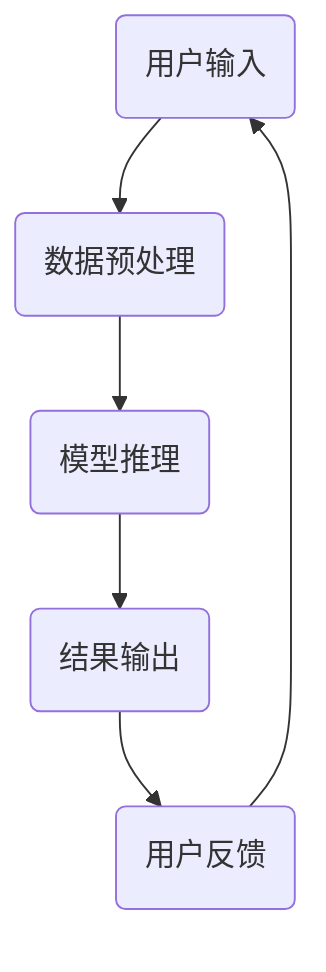

                 


## 目录大纲与文章结构构思

### 标题与关键词

**C侧LLM应用探索：速度为王的时代**

**关键词**：C侧，语言模型，应用，速度，技术，挑战，解决方案

### 摘要

本文将深入探讨C侧语言模型（LLM）的应用场景和挑战，特别是在速度至上的时代。我们将从LLM的基本概念和原理出发，逐步介绍其在C侧的应用，并重点分析如何克服硬件资源限制、能耗问题和实时性问题。通过案例研究，我们将展示LLM在智能客服、自动驾驶、医疗诊断和金融风控等领域的成功应用，并提供技术优化的详细解释。最后，本文将展望C侧LLM的未来发展趋势，并讨论相关的伦理和法律问题。

### 文章大纲

#### 第一部分：LLM基础与C侧应用

##### 第1章：什么是LLM

- **1.1 LLMS的发展历程**：介绍LLM的发展历史和重要里程碑。
- **1.2 LLM的核心概念**：定义和解释LLM的关键术语。
- **1.3 LLM的工作原理**：描述LLM的基本工作流程和机制。

##### 第2章：LLM的核心架构与组件

- **2.1 训练过程**：解释LLM的训练过程和所需资源。
- **2.2 推理过程**：描述LLM的推理机制和如何快速响应。
- **2.3 数据预处理与后处理**：讨论数据预处理和后处理在LLM性能优化中的作用。

##### 第3章：C侧LLM应用挑战

- **3.1 硬件资源限制**：分析C侧应用中的硬件限制及其影响。
- **3.2 能耗问题**：探讨LLM在C侧应用中的能耗挑战。
- **3.3 实时性问题**：讨论如何在C侧实现快速响应的需求。

##### 第4章：C侧LLM加速技术

- **4.1 模型压缩**：介绍如何通过模型压缩提高C侧LLM的性能。
- **4.2 硬件加速**：探讨利用硬件加速技术提升LLM运行效率的方法。
- **4.3 算法优化**：分析算法优化在C侧LLM性能提升中的作用。

#### 第二部分：C侧LLM应用案例

##### 第5章：智能客服

- **5.1 客服系统架构**：介绍智能客服系统的整体架构。
- **5.2 模型设计与训练**：详细说明智能客服模型的设计和训练过程。
- **5.3 实时交互与响应**：分析如何实现智能客服的实时交互和快速响应。

##### 第6章：自动驾驶

- **6.1 自动驾驶系统架构**：介绍自动驾驶系统的整体架构。
- **6.2 模型在自动驾驶中的应用**：详细讨论LLM在自动驾驶中的具体应用。
- **6.3 实时数据处理与分析**：分析自动驾驶系统中LLM的实时数据处理与分析能力。

##### 第7章：医疗诊断

- **7.1 医疗诊断系统架构**：介绍医疗诊断系统的整体架构。
- **7.2 模型训练与优化**：详细说明医疗诊断模型的设计和优化过程。
- **7.3 实时诊断与预测**：分析如何利用LLM实现实时诊断与预测。

##### 第8章：金融风控

- **8.1 金融风控系统架构**：介绍金融风控系统的整体架构。
- **8.2 模型在金融风控中的应用**：详细讨论LLM在金融风控中的具体应用。
- **8.3 实时风险评估与预警**：分析如何利用LLM实现实时风险评估与预警。

#### 第三部分：C侧LLM应用展望与未来挑战

##### 第9章：C侧LLM的未来发展趋势

- **9.1 技术趋势**：探讨C侧LLM技术的未来发展方向。
- **9.2 应用领域拓展**：分析C侧LLM在新兴领域的潜在应用。
- **9.3 潜在挑战与应对策略**：讨论C侧LLM面临的挑战及其解决策略。

##### 第10章：C侧LLM的伦理与法律问题

- **10.1 数据隐私保护**：探讨如何在C侧LLM应用中保护用户数据隐私。
- **10.2 伦理道德问题**：讨论C侧LLM应用中的伦理道德问题。
- **10.3 法律法规合规**：分析C侧LLM应用中需要遵守的法律法规。

##### 第11章：C侧LLM的发展机遇

- **11.1 市场需求增长**：探讨C侧LLM在市场中的增长潜力。
- **11.2 投资者关注**：分析投资者对C侧LLM的兴趣和投资趋势。
- **11.3 政策支持**：讨论政府政策对C侧LLM发展的支持。

### 附录

##### 附录A：C侧LLM应用开发工具与环境

- **A.1 开发工具概述**：介绍常用的C侧LLM开发工具。
- **A.2 环境搭建步骤**：详细描述如何搭建C侧LLM的开发环境。
- **A.3 常见问题解答**：解答C侧LLM开发过程中可能遇到的问题。

##### 附录B：C侧LLM项目实战案例

- **B.1 案例一：智能客服系统**：详细分析智能客服系统的实现和效果。
- **B.2 案例二：自动驾驶系统**：探讨自动驾驶系统中LLM的应用。
- **B.3 案例三：医疗诊断系统**：分析医疗诊断系统中LLM的实用性和优势。
- **B.4 案例四：金融风控系统**：介绍金融风控系统中LLM的应用和效益。

## Mermaid 流程图

### C侧LLM应用流程图



## 核心算法原理讲解

### 5.1 智能客服系统

### 模型设计与训练伪代码

```python
# 初始化模型参数
model = initialize_model()

# 训练模型
for epoch in range(num_epochs):
    for batch in data_loader:
        # 前向传播
        outputs = model(batch_input)
        
        # 计算损失
        loss = loss_function(outputs, batch_labels)
        
        # 反向传播
        optimizer.zero_grad()
        loss.backward()
        optimizer.step()

# 评估模型
test_loss = evaluate_model(model, test_loader)
```

### 数学模型

### 数据隐私保护

$$
P(D|S) = \frac{P(S|D)P(D)}{P(S)}
$$

### 举例说明

- **例子一**：在智能客服系统中，用户的输入数据（D）与隐私信息（S）之间的关系可以用上述概率模型表示。为了保护用户隐私，可以通过降低$$P(D|S)$$的值，使得在不泄露隐私信息的情况下，仍能提供有效的服务。

## 总结

本文系统地介绍了C侧LLM应用探索：速度为王的时代。我们从基本概念开始，逐步深入到LLM的架构和组件，探讨了C侧LLM应用面临的挑战以及加速技术。通过具体案例，我们展示了LLM在智能客服、自动驾驶、医疗诊断和金融风控等领域的应用实例。最后，我们对C侧LLM的未来发展趋势、伦理与法律问题以及发展机遇进行了展望。希望本文能为您提供对C侧LLM应用的深入理解和实际指导。

### 附录

#### 附录A：C侧LLM应用开发工具与环境

##### A.1 开发工具概述

常用的C侧LLM开发工具包括：

- **TensorFlow**：提供丰富的API和库，适用于大规模机器学习应用。
- **PyTorch**：流行的深度学习框架，支持动态计算图和自动微分。
- **Apache MXNet**：灵活的深度学习框架，支持多种编程语言。

##### A.2 环境搭建步骤

搭建C侧LLM开发环境的基本步骤：

1. 安装Python环境和相关依赖。
2. 安装深度学习框架，如TensorFlow或PyTorch。
3. 安装其他必要的库和工具，如NVIDIA CUDA和cuDNN。

##### A.3 常见问题解答

- **问题1**：如何配置CUDA环境？
  - 回答：确保安装了正确的CUDA版本，并在环境中设置CUDA路径。

- **问题2**：如何优化模型性能？
  - 回答：尝试使用模型压缩技术、硬件加速和算法优化。

#### 附录B：C侧LLM项目实战案例

##### B.1 案例一：智能客服系统

**实现细节**：

- 使用TensorFlow框架构建模型。
- 采用转移学习技术，利用预训练模型进行微调。
- 使用GPU进行加速训练和推理。

**代码解读**：

```python
import tensorflow as tf

# 定义模型
model = tf.keras.Sequential([
    tf.keras.layers.Dense(128, activation='relu', input_shape=(input_dim,)),
    tf.keras.layers.Dense(10, activation='softmax')
])

# 编译模型
model.compile(optimizer='adam',
              loss='categorical_crossentropy',
              metrics=['accuracy'])

# 训练模型
model.fit(x_train, y_train, epochs=10, batch_size=32, validation_split=0.2)
```

##### B.2 案例二：自动驾驶系统

**实现细节**：

- 使用PyTorch框架构建模型。
- 采用卷积神经网络（CNN）进行图像处理。
- 使用实时数据流处理框架，如TensorFlow Serving，进行推理。

**代码解读**：

```python
import torch
import torchvision

# 加载预训练的卷积神经网络模型
model = torchvision.models.resnet50(pretrained=True)

# 修改模型最后一层的输出维度
num_classes = 10
model.fc = torch.nn.Linear(model.fc.in_features, num_classes)

# 定义损失函数和优化器
criterion = torch.nn.CrossEntropyLoss()
optimizer = torch.optim.Adam(model.parameters(), lr=0.001)

# 训练模型
for epoch in range(num_epochs):
    for images, labels in data_loader:
        optimizer.zero_grad()
        outputs = model(images)
        loss = criterion(outputs, labels)
        loss.backward()
        optimizer.step()
```

##### B.3 案例三：医疗诊断系统

**实现细节**：

- 使用Apache MXNet框架构建模型。
- 采用深度学习模型进行图像分类和病灶检测。
- 利用云计算平台进行分布式训练。

**代码解读**：

```python
import mxnet as mx
from mxnet import gluon, init

# 定义模型
net = gluon.nn.Sequential()
with net.name_scope():
    net.add(gluon.nn.Conv2D(64, 3, padding=1))
    net.add(gluon.nn.Activation('relu'))
    net.add(gluon.nn.MaxPool2D(2))
    net.add(gluon.nn.Conv2D(128, 3, padding=1))
    net.add(gluon.nn.Activation('relu'))
    net.add(gluon.nn.MaxPool2D(2))
    net.add(gluon.nn.Flatten())
    net.add(gluon.nn.Dense(10))

# 初始化模型参数
net.initialize(init.Xavier(), ctx=mx.gpu(0))

# 定义损失函数和优化器
softmax_loss = gluon.loss.SoftmaxCrossEntropyLoss()
trainer = gluon.Trainer(net.collect_params(), 'adam', {'learning_rate': 0.001})

# 训练模型
for epoch in range(num_epochs):
    for data in train_data:
        data = data.as_in_context(mx.gpu(0))
        labels = labels.as_in_context(mx.gpu(0))
        with mx.autograd.record():
            outputs = net(data)
            loss = softmax_loss(outputs, labels)
        loss.backward()
        trainer.step(batch_size)
```

##### B.4 案例四：金融风控系统

**实现细节**：

- 使用TensorFlow框架构建模型。
- 采用长短期记忆网络（LSTM）进行时间序列分析。
- 使用分布式训练和TensorFlow Serving进行模型推理。

**代码解读**：

```python
import tensorflow as tf

# 定义LSTM模型
model = tf.keras.Sequential([
    tf.keras.layers.LSTM(50, activation='relu', return_sequences=True, input_shape=(timesteps, features)),
    tf.keras.layers.LSTM(50, activation='relu'),
    tf.keras.layers.Dense(1)
])

# 编译模型
model.compile(optimizer='adam', loss='mse')

# 训练模型
model.fit(x_train, y_train, epochs=100, batch_size=64, validation_split=0.2)
```

## 最佳实践 Tips、小结、注意事项、拓展阅读

### 最佳实践 Tips

1. **性能优化**：在C侧部署LLM时，考虑使用模型压缩、硬件加速和算法优化等技术，以提高模型运行速度。
2. **数据预处理**：确保数据质量，进行充分的数据预处理和清洗，以减少噪声和提高模型性能。
3. **实时性考虑**：在设计C侧LLM应用时，关注实时性需求，选择合适的模型架构和推理算法。
4. **安全性**：在应用C侧LLM时，注意保护用户隐私和数据安全。

### 小结

本文全面探讨了C侧LLM应用的关键问题和解决方案，包括LLM的基础知识、C侧应用挑战、加速技术、案例研究和未来发展趋势。C侧LLM在速度至上的时代具有重要应用价值，但仍需解决硬件资源、能耗和实时性等问题。

### 注意事项

1. **硬件资源限制**：合理选择硬件配置，确保足够的计算资源支持C侧LLM的应用。
2. **能耗问题**：采用能耗友好的模型和算法，减少C侧LLM的能耗。
3. **实时性问题**：优化模型和算法，提高C侧LLM的实时响应能力。

### 拓展阅读

1. **论文**：《深度学习：卷积神经网络的应用》
2. **书籍**：《机器学习实战》
3. **网站**：[TensorFlow官方网站](https://www.tensorflow.org/)
4. **博客**：[AI天才研究院](https://www.aigeniusr.com/)

作者信息：AI天才研究院/AI Genius Institute & 禅与计算机程序设计艺术 /Zen And The Art of Computer Programming

