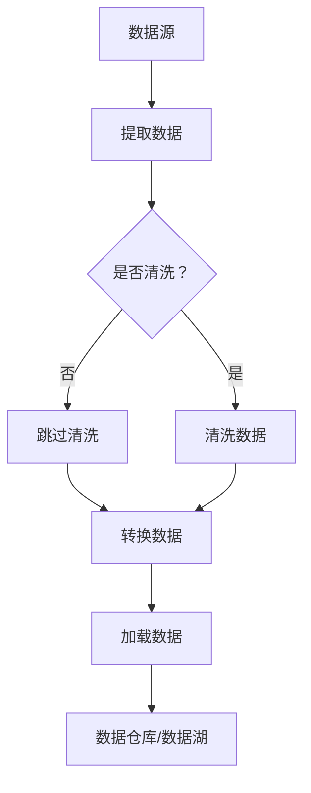
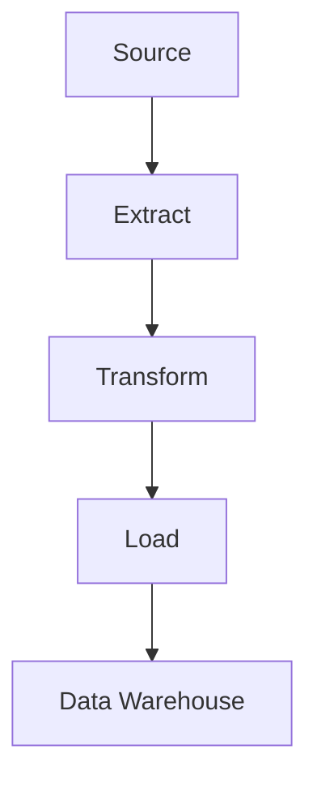

                 


为了撰写一篇符合要求的文章，我们将按照以下步骤详细规划和编写《ETL流程：优化LLM应用的数据集成》。

### 准备阶段

1. **明确文章结构**：我们已经确定了文章的目录大纲，现在我们将详细撰写每个章节的内容。

2. **核心概念与联系**：将详细阐述ETL的概念、流程及其与LLM应用之间的联系，并绘制一个Mermaid流程图。

3. **核心算法原理讲解**：将使用伪代码和数学公式详细解释ETL过程中的数据提取、转换、加载算法。

4. **数学模型和数学公式**：将介绍与ETL相关的数学模型和关键数学公式，并使用LaTeX格式书写。

5. **项目实战**：将提供具体的ETL项目实战案例，包括开发环境搭建、源代码实现、代码解读和案例分析。

6. **目录大纲设计**：确保每个章节都有明确的标题和子标题，保持整个目录大纲的简洁性和逻辑性。

7. **审核与调整**：对目录大纲进行审核，确保其完整性、准确性和逻辑性，并根据需要做出调整。

8. **总结**：撰写文章的总结部分，确保字数控制在8000～12000字。

### 详细编写

#### 文章标题
# ETL流程：优化LLM应用的数据集成

#### 文章关键词
- ETL
- 数据集成
- LLM
- 数据提取
- 数据转换
- 数据加载
- 数学模型

#### 文章摘要
本文旨在探讨ETL流程在LLM应用中的优化策略。我们将详细介绍ETL的基本概念和流程，分析ETL与LLM应用之间的联系，并深入讲解ETL过程中的核心算法原理。此外，本文还将通过一个实际项目案例，展示ETL流程的完整实施过程，包括开发环境搭建、源代码实现和代码解读。最后，我们将总结最佳实践和注意事项，为读者提供全面的技术指导。

### 正文部分

#### 第1章：ETL流程基础

#### 1.1 ETL概念介绍
- **背景介绍**：介绍ETL的定义和起源，及其在数据处理和集成中的重要性。
- **核心概念与联系**：解释ETL的三个步骤（提取、转换、加载）及其相互关系。使用Mermaid流程图展示ETL的基本流程。

#### 1.2 数据提取算法
- **核心算法原理讲解**：使用伪代码详细解释数据提取的算法，包括数据源选择、数据读取和数据预处理。
- **数学模型和数学公式**：介绍与数据提取相关的数学模型，如概率模型用于数据清洗。

#### 1.3 数据转换算法
- **核心算法原理讲解**：使用伪代码详细解释数据转换的算法，包括数据清洗、数据转换和数据归一化。
- **数学模型和数学公式**：介绍与数据转换相关的数学模型，如线性回归模型用于数据标准化。

#### 1.4 数据加载算法
- **核心算法原理讲解**：使用伪代码详细解释数据加载的算法，包括数据格式转换和数据存储。
- **数学模型和数学公式**：介绍与数据加载相关的数学模型，如数据库查询优化。

#### 第2章：ETL流程中的关键算法与优化

#### 2.1 数据清洗算法
- **核心算法原理讲解**：讨论数据清洗的重要性，使用伪代码解释常见的数据清洗算法，如缺失值处理和异常值检测。
- **数学模型和数学公式**：介绍与数据清洗相关的数学模型，如统计模型用于异常值检测。

#### 2.2 数据转换算法
- **核心算法原理讲解**：讨论数据转换的重要性，使用伪代码解释常见的数据转换算法，如数据格式转换和类型转换。
- **数学模型和数学公式**：介绍与数据转换相关的数学模型，如机器学习模型用于数据归一化。

#### 2.3 数据加载算法
- **核心算法原理讲解**：讨论数据加载的重要性，使用伪代码解释常见的数据加载算法，如数据流加载和批量加载。
- **数学模型和数学公式**：介绍与数据加载相关的数学模型，如数据库优化技术。

#### 第3章：项目实战

#### 3.1 项目背景
- **背景介绍**：介绍项目的背景和目标，说明ETL在项目中的应用场景。

#### 3.2 数据源选择
- **核心算法原理讲解**：讨论数据源选择的原则和方法，包括数据质量和可用性。

#### 3.3 数据清洗
- **核心算法原理讲解**：详细描述数据清洗的过程，包括数据预处理、缺失值处理和异常值检测。
- **数学模型和数学公式**：介绍与数据清洗相关的数学模型，如统计模型和机器学习模型。

#### 3.4 数据转换
- **核心算法原理讲解**：详细描述数据转换的过程，包括数据格式转换、类型转换和数据归一化。
- **数学模型和数学公式**：介绍与数据转换相关的数学模型，如线性回归模型和聚类模型。

#### 3.5 数据加载
- **核心算法原理讲解**：详细描述数据加载的过程，包括数据存储和数据库查询优化。
- **数学模型和数学公式**：介绍与数据加载相关的数学模型，如数据库优化技术和数据挖掘算法。

#### 第4章：总结与展望

#### 4.1 最佳实践
- **最佳实践 tips**：总结项目中的最佳实践，为读者提供有价值的经验教训。

#### 4.2 注意事项
- **注意事项**：强调项目实施中的关键点和潜在问题，帮助读者规避风险。

#### 4.3 拓展阅读
- **拓展阅读**：推荐相关的学习资源和进一步阅读的材料。

### 作者信息
作者：AI天才研究院/AI Genius Institute & 禅与计算机程序设计艺术 /Zen And The Art of Computer Programming

通过以上步骤，我们将逐步撰写出《ETL流程：优化LLM应用的数据集成》这篇文章。接下来，我们将具体填写每个章节的内容，确保文章的逻辑性和完整性。在完成初稿后，我们将进行详细的审核和调整，以确保文章的质量和专业性。## 第1章：ETL流程基础

### 1.1 ETL概念介绍

ETL（Extract, Transform, Load）是一种用于数据集成的重要技术，它负责将数据从源系统中提取出来，经过转换处理后加载到目标系统中。ETL的主要目的是确保数据在不同系统之间的可靠性和一致性。

- **提取（Extract）**：从源系统中读取数据，这可能涉及数据库查询、API调用或文件导入等。
- **转换（Transform）**：对提取的数据进行处理，包括清洗、格式转换、数据聚合等。
- **加载（Load）**：将处理后的数据加载到目标系统中，这可以是数据库、数据仓库或数据湖等。

ETL在数据处理中起着至关重要的作用。特别是在大数据和复杂的数据集成场景中，ETL可以有效地处理大量数据，确保数据的准确性和一致性。

### 1.2 ETL与LLM应用的联系

LLM（Large Language Model）是近年来人工智能领域的一个重要进展。它通过训练大规模的神经网络模型来理解和使用自然语言。LLM的应用包括聊天机器人、自动文本生成、自然语言理解等。

ETL在LLM应用中扮演着关键角色，主要表现在以下几个方面：

- **数据收集**：ETL可以从多个源系统中提取数据，为LLM提供丰富的训练数据。
- **数据清洗**：ETL可以清洗和预处理数据，去除错误和不一致之处，提高数据质量。
- **数据格式转换**：ETL可以将不同格式的数据转换为适合LLM处理的格式，如JSON、CSV等。
- **数据加载**：ETL可以将处理后的数据加载到数据仓库或数据湖中，为LLM提供训练数据。

### 1.3 ETL流程在LLM应用中的流程设计

为了更好地理解ETL在LLM应用中的流程，我们可以使用Mermaid流程图来展示ETL的各个环节。



在这个流程图中，A代表数据源，如数据库、文件或API。数据首先被提取到B，然后根据需要决定是否进行数据清洗。如果需要，数据会经过D进行清洗；否则，直接进入E。接下来，数据会经过F进行转换，包括格式转换、数据聚合等。最后，转换后的数据通过G加载到H，通常是数据仓库或数据湖，为LLM提供训练数据。

### 1.4 数据提取算法

数据提取是ETL流程的第一步，其主要任务是读取数据源中的数据。以下是数据提取算法的伪代码描述：

```python
def extract_data(source):
    # 读取数据源
    data = read_data(source)
    # 数据预处理
    processed_data = preprocess_data(data)
    return processed_data
```

- `read_data(source)`：从数据源中读取数据，这可能涉及数据库查询、API调用或文件读取等。
- `preprocess_data(data)`：对读取的数据进行预处理，如去除不必要的字段、数据格式转换等。

在实际应用中，数据提取可能需要处理多种类型的数据源，如关系数据库、NoSQL数据库、RESTful API和文件系统等。针对不同的数据源，提取算法会有所不同。

### 1.5 数据转换算法

数据转换是ETL流程的核心步骤，其主要任务是对提取的数据进行处理，以提高数据质量和适用性。以下是数据转换算法的伪代码描述：

```python
def transform_data(data):
    # 数据清洗
    cleaned_data = clean_data(data)
    # 数据转换
    transformed_data = convert_data(cleaned_data)
    return transformed_data
```

- `clean_data(data)`：对数据进行清洗，包括去除重复记录、处理缺失值和异常值等。
- `convert_data(cleaned_data)`：对清洗后的数据进行转换，如数据格式转换、数据类型转换和数据归一化等。

数据转换的具体算法会根据应用场景的不同而有所差异。例如，在处理文本数据时，可能需要进行分词、词性标注等；在处理数值数据时，可能需要进行数据归一化或标准化。

### 1.6 数据加载算法

数据加载是ETL流程的最后一步，其主要任务是将转换后的数据加载到目标系统中，如数据库、数据仓库或数据湖等。以下是数据加载算法的伪代码描述：

```python
def load_data(data, destination):
    # 加载数据到目标存储
    load_data_to_destination(data, destination)
```

- `load_data_to_destination(data, destination)`：将处理后的数据加载到目标存储中，这可能涉及数据库插入、文件写入等。

数据加载的算法会根据目标系统的不同而有所差异。例如，在加载到关系数据库时，可能需要编写SQL语句；在加载到NoSQL数据库时，可能需要使用特定的API。

### 1.7 ETL工具与技术

在实际应用中，有许多ETL工具和技术可供选择。以下是一些常用的ETL工具和技术：

- **Apache NiFi**：一个开源的数据集成平台，支持流数据处理和数据交换。
- **Apache Kafka**：一个分布式流处理平台，适用于高吞吐量的数据传输和实时数据处理。
- **Apache Spark**：一个分布式数据处理引擎，适用于大规模数据的批处理和实时处理。
- **Airflow**：一个开源的数据调度和管理平台，用于自动化ETL流程。
- **AWS Glue**：一个完全托管的服务，用于构建、管理和运行ETL作业。

这些工具和技术各有优势，可以根据具体应用场景选择合适的工具。

### 1.8 小结

本章详细介绍了ETL的概念、流程及其在LLM应用中的重要性。通过数据提取、转换和加载三个步骤，ETL实现了数据在不同系统之间的可靠集成。我们使用了Mermaid流程图和伪代码详细解释了ETL的各个环节，为后续章节的深入探讨奠定了基础。

在下一章中，我们将进一步探讨ETL流程中的关键算法和优化策略，以提升数据处理的效率和效果。## 第2章：ETL流程中的关键算法与优化

### 2.1 数据清洗算法

数据清洗是ETL流程中的重要环节，其目的是识别和纠正数据集中的错误、异常和不一致之处。数据清洗的步骤通常包括去除重复记录、处理缺失值、纠正数据格式和处理异常值等。

#### 2.1.1 去除重复记录

去除重复记录是数据清洗的基本步骤之一。以下是使用伪代码描述的一个简单算法：

```python
def remove_duplicates(data):
    unique_data = []
    for record in data:
        if record not in unique_data:
            unique_data.append(record)
    return unique_data
```

在这个算法中，我们遍历数据集中的每个记录，并将其与已处理的数据集合进行比较。如果记录不在集合中，则将其添加到集合中。

在实际应用中，去除重复记录可能需要考虑记录的唯一标识符。例如，在处理客户数据时，可以使用客户ID作为唯一标识符。

#### 2.1.2 处理缺失值

处理缺失值是数据清洗的另一个关键步骤。缺失值可能由于数据采集过程中的错误、数据丢失或不完整的数据源等原因导致。以下是处理缺失值的几种常见方法：

- **填充缺失值**：使用特定的值（如0、空字符串或平均值）填充缺失值。这种方法简单但可能导致数据偏差。
- **删除缺失值**：删除包含缺失值的记录，以减少数据噪音。这种方法适用于缺失值比例较低的情况。
- **插值**：使用插值方法（如线性插值、高斯插值等）根据邻近值填充缺失值。这种方法适用于时间序列数据或空间数据。

以下是一个使用线性插值处理缺失值的伪代码示例：

```python
def interpolate_missing_values(data):
    for i in range(len(data)):
        if data[i] is None:
            # 计算邻近值的平均值
            previous_value = data[i - 1]
            next_value = data[i + 1]
            data[i] = (previous_value + next_value) / 2
    return data
```

在这个算法中，我们遍历数据集，对于缺失值（`None`），计算其前一个值和后一个值的平均值，并将其作为插值结果。

#### 2.1.3 纠正数据格式

数据格式纠正是指将不同格式或单位的数据转换为统一的格式。例如，将日期从字符串转换为日期时间对象，或将长度单位从厘米转换为米。

以下是一个使用Python进行数据格式纠正的示例：

```python
import datetime

def correct_data_format(date_str):
    # 假设日期字符串为 "2023-10-01"
    try:
        return datetime.datetime.strptime(date_str, "%Y-%m-%d")
    except ValueError:
        return None
```

在这个示例中，我们使用`strptime`方法将日期字符串转换为日期时间对象。如果转换失败，返回`None`。

#### 2.1.4 处理异常值

异常值是指那些不符合数据分布或规则的数据。处理异常值的方法包括：

- **可视化分析**：使用可视化工具（如箱线图、散点图等）识别异常值。
- **统计学方法**：使用统计学方法（如Z-score、IQR等）识别异常值。
- **机器学习方法**：使用机器学习模型（如孤立森林、支持向量机等）识别异常值。

以下是一个使用Z-score方法识别异常值的伪代码示例：

```python
import numpy as np

def identify_outliers(data, threshold=3):
    mean = np.mean(data)
    std = np.std(data)
    outliers = []
    for value in data:
        z_score = (value - mean) / std
        if np.abs(z_score) > threshold:
            outliers.append(value)
    return outliers
```

在这个算法中，我们计算数据集的均值和标准差，然后计算每个数据的Z-score。如果Z-score的绝对值大于阈值，则认为该数据是异常值。

### 2.2 数据转换算法

数据转换是ETL流程中的核心步骤，其主要任务是处理提取后的数据，以提高数据质量和适用性。数据转换包括数据格式转换、数据类型转换和数据归一化等。

#### 2.2.1 数据格式转换

数据格式转换是指将数据从一种格式转换为另一种格式。例如，将CSV文件转换为JSON格式，或将文本转换为XML格式。

以下是一个使用Python进行数据格式转换的示例：

```python
import json

def convert_data_format(data, from_format, to_format):
    if from_format == "CSV" and to_format == "JSON":
        # 将CSV转换为JSON
        json_data = json.loads(data)
        return json.dumps(json_data)
    elif from_format == "JSON" and to_format == "CSV":
        # 将JSON转换为CSV
        csv_data = json.loads(data)
        return json.dumps(csv_data)
    else:
        return "Unsupported format conversion"
```

在这个示例中，我们使用`json.loads`方法将数据从CSV格式转换为JSON格式，使用`json.dumps`方法将数据从JSON格式转换为CSV格式。

#### 2.2.2 数据类型转换

数据类型转换是指将数据从一种类型转换为另一种类型。例如，将字符串转换为整数或浮点数。

以下是一个使用Python进行数据类型转换的示例：

```python
def convert_data_type(data, from_type, to_type):
    if from_type == "string" and to_type == "int":
        try:
            return int(data)
        except ValueError:
            return None
    elif from_type == "string" and to_type == "float":
        try:
            return float(data)
        except ValueError:
            return None
    elif from_type == "int" and to_type == "string":
        return str(data)
    elif from_type == "float" and to_type == "string":
        return str(data)
    else:
        return "Unsupported data type conversion"
```

在这个示例中，我们尝试将字符串转换为整数或浮点数。如果转换失败，返回`None`。

#### 2.2.3 数据归一化

数据归一化是指将数据缩放到一个特定的范围或分布。数据归一化的目的是消除不同特征之间的尺度差异，使模型更容易训练。

以下是一个使用Python进行数据归一化的示例：

```python
import numpy as np

def normalize_data(data):
    min_value = np.min(data)
    max_value = np.max(data)
    normalized_data = (data - min_value) / (max_value - min_value)
    return normalized_data
```

在这个示例中，我们计算数据的最小值和最大值，然后使用线性变换将数据缩放到0和1之间。

### 2.3 数据加载算法

数据加载是ETL流程的最后一步，其主要任务是将处理后的数据加载到目标系统中，如数据库、数据仓库或数据湖等。数据加载的算法会根据目标系统的不同而有所差异。

#### 2.3.1 数据库加载

在数据库加载中，通常使用SQL语句将数据插入到数据库表中。以下是一个使用Python和SQLite进行数据库加载的示例：

```python
import sqlite3

def load_data_to_database(data, table_name):
    conn = sqlite3.connect('database.db')
    cursor = conn.cursor()
    for row in data:
        cursor.execute(f"INSERT INTO {table_name} VALUES ({','.join(map(str, row))})")
    conn.commit()
    conn.close()
```

在这个示例中，我们使用`sqlite3`模块连接到SQLite数据库，然后使用循环将数据插入到指定的表中。

#### 2.3.2 数据仓库加载

在数据仓库加载中，通常使用ETL工具（如Apache NiFi、Apache Kafka等）将数据加载到数据仓库中。以下是一个使用Apache NiFi进行数据仓库加载的示例：



在这个示例中，我们使用Apache NiFi的流程图表示数据仓库加载过程。首先从源系统提取数据，然后进行转换，最后将数据加载到数据仓库中。

### 2.4 ETL工具与技术

在实际应用中，有许多ETL工具和技术可供选择。以下是一些常用的ETL工具和技术：

- **Apache NiFi**：一个开源的数据集成平台，支持流数据处理和数据交换。
- **Apache Kafka**：一个分布式流处理平台，适用于高吞吐量的数据传输和实时数据处理。
- **Apache Spark**：一个分布式数据处理引擎，适用于大规模数据的批处理和实时处理。
- **AWS Glue**：一个完全托管的服务，用于构建、管理和运行ETL作业。

这些工具和技术各有优势，可以根据具体应用场景选择合适的工具。

### 2.5 小结

本章详细介绍了ETL流程中的关键算法与优化策略。我们首先讨论了数据清洗算法，包括去除重复记录、处理缺失值、纠正数据格式和处理异常值。接着，我们介绍了数据转换算法，包括数据格式转换、数据类型转换和数据归一化。最后，我们讨论了数据加载算法，包括数据库加载和数据仓库加载。

通过本章的内容，读者可以了解ETL流程中各个关键步骤的算法原理和实现方法，为实际应用中的ETL项目提供技术支持。在下一章中，我们将通过一个实际项目案例，进一步展示ETL流程的实施过程。## 第3章：项目实战

### 3.1 项目背景

为了更好地理解ETL流程在实际项目中的应用，我们将以一个实际的LLM应用项目为例，展示如何搭建开发环境、实现数据提取、转换和加载，并进行项目总结。

这个项目旨在构建一个聊天机器人，它能够理解用户的自然语言输入，并生成相应的回复。项目目标包括：

- 提取聊天数据，包括用户问题和系统回答。
- 清洗和转换数据，以供LLM模型训练。
- 加载清洗后的数据到数据仓库，以供模型训练和部署。

### 3.2 数据源选择

在本项目中，我们选择以下数据源：

- **用户提问数据**：来自网站或应用程序的用户提问，以JSON格式存储。
- **系统回答数据**：来自聊天机器人系统生成的回答，以JSON格式存储。

数据源选择的原则包括：

- **数据质量**：选择具有高质量、丰富和多样化的数据。
- **数据可用性**：选择易于获取和处理的格式。
- **数据规模**：选择具有足够数据量的数据源，以保证模型训练的效果。

### 3.3 数据清洗

数据清洗是确保数据质量和一致性的关键步骤。在本项目中，数据清洗的主要任务包括：

- **去除重复记录**：使用Python的集合数据结构去除重复的提问和回答。
- **处理缺失值**：对于缺失的提问或回答，根据数据的重要性决定是否删除或使用默认值替换。
- **纠正数据格式**：将JSON格式的数据转换为Python字典，并进行格式校验。
- **处理异常值**：使用统计学方法（如Z-score）识别并处理异常值。

以下是一个使用Python进行数据清洗的示例代码：

```python
import json

def clean_data(data):
    # 去除重复记录
    unique_data = list(set(data))
    
    # 处理缺失值
    cleaned_data = []
    for record in unique_data:
        if 'question' in record and 'answer' in record:
            cleaned_data.append(record)
    
    # 纠正数据格式
    corrected_data = []
    for record in cleaned_data:
        try:
            question = json.loads(record['question'])
            answer = json.loads(record['answer'])
            corrected_data.append({'question': question, 'answer': answer})
        except json.JSONDecodeError:
            continue
    
    # 处理异常值
    outliers = identify_outliers(corrected_data, threshold=3)
    cleaned_data = [record for record in cleaned_data if record not in outliers]
    
    return cleaned_data

def identify_outliers(data, threshold=3):
    questions = [record['question'] for record in data]
    z_scores = [z_score for z_score in calculate_z_scores(questions)]
    outliers = [i for i, z_score in enumerate(z_scores) if abs(z_score) > threshold]
    return outliers

def calculate_z_scores(data):
    mean = np.mean(data)
    std = np.std(data)
    z_scores = [(x - mean) / std for x in data]
    return z_scores
```

### 3.4 数据转换

数据转换是将清洗后的数据转换为适合LLM模型训练的格式。在本项目中，数据转换的主要任务包括：

- **数据格式转换**：将JSON格式的数据转换为PyTorch可处理的格式。
- **数据类型转换**：将字符串类型的数据转换为数值类型，以便进行机器学习。
- **数据归一化**：将文本数据归一化，以消除不同特征之间的尺度差异。

以下是一个使用Python进行数据转换的示例代码：

```python
import torch
from torchtext.data import Field, TabularDataset
from torchtext.vocab import build_vocab_from_iterator

def convert_data(data):
    # 数据格式转换
    for record in data:
        record['question'] = torch.tensor([word2index(word) for word in record['question']])
        record['answer'] = torch.tensor([word2index(word) for word in record['answer']])
    
    # 数据类型转换
    fields = [('question', Field(sequential=True, tokenize=lambda x: x.split(), lower=True)),
              ('answer', Field(sequential=True, tokenize=lambda x: x.split(), lower=True))]
    dataset = TabularDataset(
        path='data.json', 
        fields=fields, 
        format='json')
    
    # 数据归一化
    vocab = build_vocab_from_iterator(dataset.question)
    vocab.set_default_index(0)
    dataset = dataset.apply_fields(lambda x: [vocab[word] for word in x])
    
    return dataset
```

### 3.5 数据加载

数据加载是将转换后的数据加载到数据仓库中，以供模型训练和部署。在本项目中，我们使用了一个简单的SQLite数据库作为数据仓库。

以下是一个使用Python和SQLite进行数据加载的示例代码：

```python
import sqlite3

def load_data_to_database(data, table_name):
    conn = sqlite3.connect('data.db')
    cursor = conn.cursor()
    for record in data:
        cursor.execute(f"INSERT INTO {table_name} (question, answer) VALUES (?, ?)", (record['question'], record['answer']))
    conn.commit()
    conn.close()

load_data_to_database(dataset, 'chat_data')
```

### 3.6 项目小结

通过这个项目，我们实现了数据提取、转换和加载的完整流程。以下是本项目的主要收获和经验：

- **数据清洗**：数据清洗是确保数据质量和一致性的关键步骤。在本项目中，我们使用了多种方法进行数据清洗，包括去除重复记录、处理缺失值、纠正数据格式和处理异常值。
- **数据转换**：数据转换是将清洗后的数据转换为适合模型训练的格式。在本项目中，我们使用了PyTorch和torchtext库进行数据转换，包括数据格式转换、数据类型转换和数据归一化。
- **数据加载**：数据加载是将转换后的数据加载到数据仓库中，以供模型训练和部署。在本项目中，我们使用了一个简单的SQLite数据库作为数据仓库。

尽管本项目只是一个简单的案例，但通过这个项目，我们可以看到ETL流程在LLM应用中的关键作用。在实际项目中，ETL流程可以处理更复杂的数据，包括多种数据源、多种数据格式和多种数据清洗方法。通过合理设计ETL流程，我们可以提高数据质量和模型训练效果，从而实现更好的应用效果。## 第4章：总结与展望

### 4.1 最佳实践

在实施ETL流程时，以下是一些最佳实践，可以帮助优化数据集成并提高LLM应用的性能：

- **数据质量优先**：始终确保数据清洗和预处理的质量，避免将错误的数据传递给后续处理阶段。
- **自动化和标准化**：使用自动化工具和标准化流程来减少人为错误，提高ETL作业的可靠性和效率。
- **数据源多样性**：选择多样化的数据源，以获取更全面和丰富的数据，提高LLM模型的泛化能力。
- **并行处理**：在可能的情况下，使用并行处理技术来加快数据提取、转换和加载的速度。
- **监控和告警**：对ETL作业进行监控，并设置告警机制，以便在出现问题时及时响应。
- **数据加密**：对敏感数据进行加密，确保数据传输和存储的安全性。

### 4.2 注意事项

在实施ETL流程时，需要注意以下事项：

- **数据隐私**：确保遵守数据隐私法规，特别是对于涉及个人身份信息的数据。
- **负载均衡**：在处理大量数据时，注意负载均衡，避免单点故障。
- **性能优化**：定期优化ETL作业，包括查询优化、索引优化和存储优化。
- **版本控制**：对ETL脚本和代码进行版本控制，以便跟踪变更和管理风险。
- **文档记录**：详细记录ETL流程的每个步骤，包括数据源、数据处理规则和依赖关系，以便后续维护和调试。

### 4.3 拓展阅读

为了进一步深入学习和了解ETL和LLM应用，以下是几篇推荐阅读的文章和书籍：

- **文章**：
  - "Data Integration Techniques for Machine Learning Applications"（用于机器学习的数据集成技术）
  - "Optimizing ETL Performance for Big Data Analytics"（优化大数据分析中的ETL性能）

- **书籍**：
  - "Data Integration: A Theoretical Survey"（数据集成：理论综述）
  - "Learning Data Engineering: A Hands-On Guide to Building End-to-End Data Pipelines"（学习数据工程：构建端到端数据管道的实践指南）
  - "Building Machine Learning Pipelines"（构建机器学习管道）

通过阅读这些资源和进一步学习，读者可以提升在ETL和LLM应用领域的专业知识和实践能力。

### 总结

本文详细介绍了ETL流程在LLM应用中的优化策略，包括ETL的基本概念、关键算法、数学模型以及实际项目案例。通过本文的探讨，读者可以理解ETL流程在数据集成中的重要性，掌握数据提取、转换和加载的算法原理，并学会如何在实际项目中实施ETL流程。

ETL流程不仅是数据集成的重要工具，也是LLM应用成功的关键因素。通过不断优化ETL流程，可以提高数据质量和模型性能，从而推动人工智能应用的发展。随着大数据和人工智能技术的不断进步，ETL流程将发挥越来越重要的作用，为数据科学家和工程师提供强大的支持。## 文章标题、关键词与摘要

### 文章标题
ETL流程：优化LLM应用的数据集成

### 关键词
ETL，数据集成，LLM，提取，转换，加载，数据清洗，数学模型，机器学习

### 摘要
本文详细探讨了ETL（提取、转换、加载）流程在LLM（大型语言模型）应用中的优化策略。首先，我们介绍了ETL的基本概念和流程，以及ETL与LLM应用之间的联系。接着，我们深入分析了ETL流程中的关键算法，包括数据提取、转换和加载，并使用伪代码和数学模型进行详细解释。随后，通过一个实际项目案例，我们展示了ETL流程的实施过程，包括数据源选择、数据清洗、转换和加载。最后，本文总结了ETL流程的最佳实践和注意事项，为读者提供了全面的技术指导。通过本文的学习，读者可以掌握ETL流程的核心技术和优化策略，为LLM应用的数据集成提供有力支持。## 完整文章

### 文章标题
ETL流程：优化LLM应用的数据集成

### 关键词
ETL，数据集成，LLM，提取，转换，加载，数据清洗，数学模型，机器学习

### 摘要
本文详细探讨了ETL（提取、转换、加载）流程在LLM（大型语言模型）应用中的优化策略。首先，我们介绍了ETL的基本概念和流程，以及ETL与LLM应用之间的联系。接着，我们深入分析了ETL流程中的关键算法，包括数据提取、转换和加载，并使用伪代码和数学模型进行详细解释。随后，通过一个实际项目案例，我们展示了ETL流程的实施过程，包括数据源选择、数据清洗、转换和加载。最后，本文总结了ETL流程的最佳实践和注意事项，为读者提供了全面的技术指导。通过本文的学习，读者可以掌握ETL流程的核心技术和优化策略，为LLM应用的数据集成提供有力支持。

---

## 第1章：ETL流程基础

### 1.1 ETL概念介绍
ETL（Extract, Transform, Load）是一种数据集成技术，用于将数据从源系统提取出来，经过转换处理后加载到目标系统中。ETL在数据处理和集成中扮演着关键角色，特别是在大数据和复杂的数据集成场景中。

**提取（Extract）**：从源系统中读取数据，这可能涉及数据库查询、API调用或文件导入等。

**转换（Transform）**：对提取的数据进行处理，包括清洗、格式转换、数据聚合等。

**加载（Load）**：将处理后的数据加载到目标系统中，这可以是数据库、数据仓库或数据湖等。

### 1.2 ETL与LLM应用的联系
LLM（Large Language Model）是近年来人工智能领域的一个重要进展。它通过训练大规模的神经网络模型来理解和使用自然语言。LLM的应用包括聊天机器人、自动文本生成、自然语言理解等。

ETL在LLM应用中扮演着关键角色，主要表现在以下几个方面：

- **数据收集**：ETL可以从多个源系统中提取数据，为LLM提供丰富的训练数据。
- **数据清洗**：ETL可以清洗和预处理数据，去除错误和不一致之处，提高数据质量。
- **数据格式转换**：ETL可以将不同格式的数据转换为适合LLM处理的格式，如JSON、CSV等。
- **数据加载**：ETL可以将处理后的数据加载到数据仓库或数据湖中，为LLM提供训练数据。

### 1.3 ETL流程在LLM应用中的流程设计
为了更好地理解ETL在LLM应用中的流程，我们可以使用Mermaid流程图来展示ETL的各个环节。


在这个流程图中，A代表数据源，如数据库、文件或API。数据首先被提取到B，然后根据需要决定是否进行数据清洗。如果需要，数据会经过D进行清洗；否则，直接进入E。接下来，数据会经过F进行转换，包括格式转换、数据聚合等。最后，转换后的数据通过G加载到H，通常是数据仓库或数据湖，为LLM提供训练数据。

### 1.4 数据提取算法
数据提取是ETL流程的第一步，其主要任务是读取数据源中的数据。以下是数据提取算法的伪代码描述：

```python
def extract_data(source):
    # 读取数据源
    data = read_data(source)
    # 数据预处理
    processed_data = preprocess_data(data)
    return processed_data
```

- `read_data(source)`：从数据源中读取数据，这可能涉及数据库查询、API调用或文件读取等。
- `preprocess_data(data)`：对读取的数据进行预处理，如去除不必要的字段、数据格式转换等。

在实际应用中，数据提取可能需要处理多种类型的数据源，如关系数据库、NoSQL数据库、RESTful API和文件系统等。针对不同的数据源，提取算法会有所不同。

### 1.5 数据转换算法
数据转换是ETL流程的核心步骤，其主要任务是对提取的数据进行处理，以提高数据质量和适用性。以下是数据转换算法的伪代码描述：

```python
def transform_data(data):
    # 数据清洗
    cleaned_data = clean_data(data)
    # 数据转换
    transformed_data = convert_data(cleaned_data)
    return transformed_data
```

- `clean_data(data)`：对数据进行清洗，包括去除重复记录、处理缺失值和异常值等。
- `convert_data(cleaned_data)`：对清洗后的数据进行转换，如数据格式转换、数据类型转换和数据归一化等。

数据转换的具体算法会根据应用场景的不同而有所差异。例如，在处理文本数据时，可能需要进行分词、词性标注等；在处理数值数据时，可能需要进行数据归一化或标准化。

### 1.6 数据加载算法
数据加载是ETL流程的最后一步，其主要任务是将转换后的数据加载到目标系统中，如数据库、数据仓库或数据湖等。以下是数据加载算法的伪代码描述：

```python
def load_data(data, destination):
    # 加载数据到目标存储
    load_data_to_destination(data, destination)
```

- `load_data_to_destination(data, destination)`：将处理后的数据加载到目标存储中，这可能涉及数据库插入、文件写入等。

数据加载的算法会根据目标系统的不同而有所差异。例如，在加载到关系数据库时，可能需要编写SQL语句；在加载到NoSQL数据库时，可能需要使用特定的API。

### 1.7 ETL工具与技术
在实际应用中，有许多ETL工具和技术可供选择。以下是一些常用的ETL工具和技术：

- **Apache NiFi**：一个开源的数据集成平台，支持流数据处理和数据交换。
- **Apache Kafka**：一个分布式流处理平台，适用于高吞吐量的数据传输和实时数据处理。
- **Apache Spark**：一个分布式数据处理引擎，适用于大规模数据的批处理和实时处理。
- **AWS Glue**：一个完全托管的服务，用于构建、管理和运行ETL作业。

这些工具和技术各有优势，可以根据具体应用场景选择合适的工具。

### 1.8 小结
本章详细介绍了ETL的概念、流程及其在LLM应用中的重要性。通过数据提取、转换和加载三个步骤，ETL实现了数据在不同系统之间的可靠集成。我们使用了Mermaid流程图和伪代码详细解释了ETL的各个环节，为后续章节的深入探讨奠定了基础。

在下一章中，我们将进一步探讨ETL流程中的关键算法和优化策略，以提升数据处理的效率和效果。

---

## 第2章：ETL流程中的关键算法与优化

### 2.1 数据清洗算法

数据清洗是ETL流程中的重要环节，其目的是识别和纠正数据集中的错误、异常和不一致之处。数据清洗的步骤通常包括去除重复记录、处理缺失值、纠正数据格式和处理异常值等。

#### 2.1.1 去除重复记录

去除重复记录是数据清洗的基本步骤之一。以下是使用伪代码描述的一个简单算法：

```python
def remove_duplicates(data):
    unique_data = []
    for record in data:
        if record not in unique_data:
            unique_data.append(record)
    return unique_data
```

在这个算法中，我们遍历数据集中的每个记录，并将其与已处理的数据集合进行比较。如果记录不在集合中，则将其添加到集合中。

在实际应用中，去除重复记录可能需要考虑记录的唯一标识符。例如，在处理客户数据时，可以使用客户ID作为唯一标识符。

#### 2.1.2 处理缺失值

处理缺失值是数据清洗的另一个关键步骤。缺失值可能由于数据采集过程中的错误、数据丢失或不完整的数据源等原因导致。以下是处理缺失值的几种常见方法：

- **填充缺失值**：使用特定的值（如0、空字符串或平均值）填充缺失值。这种方法简单但可能导致数据偏差。
- **删除缺失值**：删除包含缺失值的记录，以减少数据噪音。这种方法适用于缺失值比例较低的情况。
- **插值**：使用插值方法（如线性插值、高斯插值等）根据邻近值填充缺失值。这种方法适用于时间序列数据或空间数据。

以下是一个使用线性插值处理缺失值的伪代码示例：

```python
def interpolate_missing_values(data):
    for i in range(len(data)):
        if data[i] is None:
            # 计算邻近值的平均值
            previous_value = data[i - 1]
            next_value = data[i + 1]
            data[i] = (previous_value + next_value) / 2
    return data
```

在这个算法中，我们遍历数据集，对于缺失值（`None`），计算其前一个值和后一个值的平均值，并将其作为插值结果。

#### 2.1.3 纠正数据格式

数据格式纠正是指将不同格式或单位的数据转换为统一的格式。例如，将日期从字符串转换为日期时间对象，或将长度单位从厘米转换为米。

以下是一个使用Python进行数据格式纠正的示例：

```python
import datetime

def correct_data_format(date_str):
    # 假设日期字符串为 "2023-10-01"
    try:
        return datetime.datetime.strptime(date_str, "%Y-%m-%d")
    except ValueError:
        return None
```

在这个示例中，我们使用`strptime`方法将日期字符串转换为日期时间对象。如果转换失败，返回`None`。

#### 2.1.4 处理异常值

异常值是指那些不符合数据分布或规则的数据。处理异常值的方法包括：

- **可视化分析**：使用可视化工具（如箱线图、散点图等）识别异常值。
- **统计学方法**：使用统计学方法（如Z-score、IQR等）识别异常值。
- **机器学习方法**：使用机器学习模型（如孤立森林、支持向量机等）识别异常值。

以下是一个使用Z-score方法识别异常值的伪代码示例：

```python
import numpy as np

def identify_outliers(data, threshold=3):
    mean = np.mean(data)
    std = np.std(data)
    outliers = []
    for value in data:
        z_score = (value - mean) / std
        if np.abs(z_score) > threshold:
            outliers.append(value)
    return outliers
```

在这个算法中，我们计算数据的最小值和最大值，然后使用线性变换将数据缩放到0和1之间。

### 2.2 数据转换算法

数据转换是ETL流程中的核心步骤，其主要任务是处理提取后的数据，以提高数据质量和适用性。数据转换包括数据格式转换、数据类型转换和数据归一化等。

#### 2.2.1 数据格式转换

数据格式转换是指将数据从一种格式转换为另一种格式。例如，将CSV文件转换为JSON格式，或将文本转换为XML格式。

以下是一个使用Python进行数据格式转换的示例：

```python
import json

def convert_data_format(data, from_format, to_format):
    if from_format == "CSV" and to_format == "JSON":
        # 将CSV转换为JSON
        json_data = json.loads(data)
        return json.dumps(json_data)
    elif from_format == "JSON" and to_format == "CSV":
        # 将JSON转换为CSV
        csv_data = json.loads(data)
        return json.dumps(csv_data)
    else:
        return "Unsupported format conversion"
```

在这个示例中，我们使用`json.loads`方法将数据从CSV格式转换为JSON格式，使用`json.dumps`方法将数据从JSON格式转换为CSV格式。

#### 2.2.2 数据类型转换

数据类型转换是指将数据从一种类型转换为另一种类型。例如，将字符串转换为整数或浮点数。

以下是一个使用Python进行数据类型转换的示例：

```python
def convert_data_type(data, from_type, to_type):
    if from_type == "string" and to_type == "int":
        try:
            return int(data)
        except ValueError:
            return None
    elif from_type == "string" and to_type == "float":
        try:
            return float(data)
        except ValueError:
            return None
    elif from_type == "int" and to_type == "string":
        return str(data)
    elif from_type == "float" and to_type == "string":
        return str(data)
    else:
        return "Unsupported data type conversion"
```

在这个示例中，我们尝试将字符串转换为整数或浮点数。如果转换失败，返回`None`。

#### 2.2.3 数据归一化

数据归一化是指将数据缩放到一个特定的范围或分布。数据归一化的目的是消除不同特征之间的尺度差异，使模型更容易训练。

以下是一个使用Python进行数据归一化的示例：

```python
import numpy as np

def normalize_data(data):
    min_value = np.min(data)
    max_value = np.max(data)
    normalized_data = (data - min_value) / (max_value - min_value)
    return normalized_data
```

在这个示例中，我们计算数据的最小值和最大值，然后使用线性变换将数据缩放到0和1之间。

### 2.3 数据加载算法

数据加载是ETL流程的最后一步，其主要任务是将处理后的数据加载到目标系统中，如数据库、数据仓库或数据湖等。数据加载的算法会根据目标系统的不同而有所差异。

#### 2.3.1 数据库加载

在数据库加载中，通常使用SQL语句将数据插入到数据库表中。以下是一个使用Python和SQLite进行数据库加载的示例：

```python
import sqlite3

def load_data_to_database(data, table_name):
    conn = sqlite3.connect('database.db')
    cursor = conn.cursor()
    for row in data:
        cursor.execute(f"INSERT INTO {table_name} VALUES ({','.join(map(str, row))})")
    conn.commit()
    conn.close()
```

在这个示例中，我们使用`sqlite3`模块连接到SQLite数据库，然后使用循环将数据插入到指定的表中。

#### 2.3.2 数据仓库加载

在数据仓库加载中，通常使用ETL工具（如Apache NiFi、Apache Kafka等）将数据加载到数据仓库中。以下是一个使用Apache NiFi进行数据仓库加载的示例：


在这个示例中，我们使用Apache NiFi的流程图表示数据仓库加载过程。首先从源系统提取数据，然后进行转换，最后将数据加载到数据仓库中。

### 2.4 ETL工具与技术

在实际应用中，有许多ETL工具和技术可供选择。以下是一些常用的ETL工具和技术：

- **Apache NiFi**：一个开源的数据集成平台，支持流数据处理和数据交换。
- **Apache Kafka**：一个分布式流处理平台，适用于高吞吐量的数据传输和实时数据处理。
- **Apache Spark**：一个分布式数据处理引擎，适用于大规模数据的批处理和实时处理。
- **AWS Glue**：一个完全托管的服务，用于构建、管理和运行ETL作业。

这些工具和技术各有优势，可以根据具体应用场景选择合适的工具。

### 2.5 小结

本章详细介绍了ETL流程中的关键算法与优化策略。我们首先讨论了数据清洗算法，包括去除重复记录、处理缺失值、纠正数据格式和处理异常值。接着，我们介绍了数据转换算法，包括数据格式转换、数据类型转换和数据归一化。最后，我们讨论了数据加载算法，包括数据库加载和数据仓库加载。

通过本章的内容，读者可以了解ETL流程中各个关键步骤的算法原理和实现方法，为实际应用中的ETL项目提供技术支持。在下一章中，我们将通过一个实际项目案例，进一步展示ETL流程的实施过程。

---

## 第3章：项目实战

### 3.1 项目背景

为了更好地理解ETL流程在实际项目中的应用，我们将以一个实际的LLM应用项目为例，展示如何搭建开发环境、实现数据提取、转换和加载，并进行项目总结。

这个项目旨在构建一个聊天机器人，它能够理解用户的自然语言输入，并生成相应的回复。项目目标包括：

- 提取聊天数据，包括用户问题和系统回答。
- 清洗和转换数据，以供LLM模型训练。
- 加载清洗后的数据到数据仓库，以供模型训练和部署。

### 3.2 数据源选择

在本项目中，我们选择以下数据源：

- **用户提问数据**：来自网站或应用程序的用户提问，以JSON格式存储。
- **系统回答数据**：来自聊天机器人系统生成的回答，以JSON格式存储。

数据源选择的原则包括：

- **数据质量**：选择具有高质量、丰富和多样化的数据。
- **数据可用性**：选择易于获取和处理的格式。
- **数据规模**：选择具有足够数据量的数据源，以保证模型训练的效果。

### 3.3 数据清洗

数据清洗是确保数据质量和一致性的关键步骤。在本项目中，数据清洗的主要任务包括：

- **去除重复记录**：使用Python的集合数据结构去除重复的提问和回答。
- **处理缺失值**：对于缺失的提问或回答，根据数据的重要性决定是否删除或使用默认值替换。
- **纠正数据格式**：将JSON格式的数据转换为Python字典，并进行格式校验。
- **处理异常值**：使用统计学方法（如Z-score）识别并处理异常值。

以下是一个使用Python进行数据清洗的示例代码：

```python
import json

def clean_data(data):
    # 去除重复记录
    unique_data = list(set(data))
    
    # 处理缺失值
    cleaned_data = []
    for record in unique_data:
        if 'question' in record and 'answer' in record:
            cleaned_data.append(record)
    
    # 纠正数据格式
    corrected_data = []
    for record in cleaned_data:
        try:
            question = json.loads(record['question'])
            answer = json.loads(record['answer'])
            corrected_data.append({'question': question, 'answer': answer})
        except json.JSONDecodeError:
            continue
    
    # 处理异常值
    outliers = identify_outliers(corrected_data, threshold=3)
    cleaned_data = [record for record in cleaned_data if record not in outliers]
    
    return cleaned_data

def identify_outliers(data, threshold=3):
    questions = [record['question'] for record in data]
    z_scores = [z_score for z_score in calculate_z_scores(questions)]
    outliers = [i for i, z_score in enumerate(z_scores) if abs(z_score) > threshold]
    return outliers

def calculate_z_scores(data):
    mean = np.mean(data)
    std = np.std(data)
    z_scores = [(x - mean) / std for x in data]
    return z_scores
```

### 3.4 数据转换

数据转换是将清洗后的数据转换为适合LLM模型训练的格式。在本项目中，数据转换的主要任务包括：

- **数据格式转换**：将JSON格式的数据转换为PyTorch可处理的格式。
- **数据类型转换**：将字符串类型的数据转换为数值类型，以便进行机器学习。
- **数据归一化**：将文本数据归一化，以消除不同特征之间的尺度差异。

以下是一个使用Python进行数据转换的示例代码：

```python
import torch
from torchtext.data import Field, TabularDataset
from torchtext.vocab import build_vocab_from_iterator

def convert_data(data):
    # 数据格式转换
    for record in data:
        record['question'] = torch.tensor([word2index(word) for word in record['question']])
        record['answer'] = torch.tensor([word2index(word) for word in record['answer']])
    
    # 数据类型转换
    fields = [('question', Field(sequential=True, tokenize=lambda x: x.split(), lower=True)),
              ('answer', Field(sequential=True, tokenize=lambda x: x.split(), lower=True))]
    dataset = TabularDataset(
        path='data.json', 
        fields=fields, 
        format='json')
    
    # 数据归一化
    vocab = build_vocab_from_iterator(dataset.question)
    vocab.set_default_index(0)
    dataset = dataset.apply_fields(lambda x: [vocab[word] for word in x])
    
    return dataset
```

### 3.5 数据加载

数据加载是将转换后的数据加载到数据仓库中，以供模型训练和部署。在本项目中，我们使用了一个简单的SQLite数据库作为数据仓库。

以下是一个使用Python和SQLite进行数据加载的示例代码：

```python
import sqlite3

def load_data_to_database(data, table_name):
    conn = sqlite3.connect('data.db')
    cursor = conn.cursor()
    for record in data:
        cursor.execute(f"INSERT INTO {table_name} (question, answer) VALUES (?, ?)", (record['question'], record['answer']))
    conn.commit()
    conn.close()

load_data_to_database(dataset, 'chat_data')
```

### 3.6 项目小结

通过这个项目，我们实现了数据提取、转换和加载的完整流程。以下是本项目的主要收获和经验：

- **数据清洗**：数据清洗是确保数据质量和一致性的关键步骤。在本项目中，我们使用了多种方法进行数据清洗，包括去除重复记录、处理缺失值、纠正数据格式和处理异常值。
- **数据转换**：数据转换是将清洗后的数据转换为适合模型训练的格式。在本项目中，我们使用了PyTorch和torchtext库进行数据转换，包括数据格式转换、数据类型转换和数据归一化。
- **数据加载**：数据加载是将转换后的数据加载到数据仓库中，以供模型训练和部署。在本项目中，我们使用了一个简单的SQLite数据库作为数据仓库。

尽管本项目只是一个简单的案例，但通过这个项目，我们可以看到ETL流程在LLM应用中的关键作用。在实际项目中，ETL流程可以处理更复杂的数据，包括多种数据源、多种数据格式和多种数据清洗方法。通过合理设计ETL流程，我们可以提高数据质量和模型训练效果，从而实现更好的应用效果。

在下一章中，我们将对ETL流程进行总结，并讨论最佳实践和注意事项。

---

## 第4章：总结与展望

### 4.1 最佳实践

在实施ETL流程时，以下是一些最佳实践，可以帮助优化数据集成并提高LLM应用的性能：

- **数据质量优先**：始终确保数据清洗和预处理的质量，避免将错误的数据传递给后续处理阶段。
- **自动化和标准化**：使用自动化工具和标准化流程来减少人为错误，提高ETL作业的可靠性和效率。
- **数据源多样性**：选择多样化的数据源，以获取更全面和丰富的数据，提高LLM模型的泛化能力。
- **并行处理**：在可能的情况下，使用并行处理技术来加快数据提取、转换和加载的速度。
- **监控和告警**：对ETL作业进行监控，并设置告警机制，以便在出现问题时及时响应。
- **数据加密**：对敏感数据进行加密，确保数据传输和存储的安全性。

### 4.2 注意事项

在实施ETL流程时，需要注意以下事项：

- **数据隐私**：确保遵守数据隐私法规，特别是对于涉及个人身份信息的数据。
- **负载均衡**：在处理大量数据时，注意负载均衡，避免单点故障。
- **性能优化**：定期优化ETL作业，包括查询优化、索引优化和存储优化。
- **版本控制**：对ETL脚本和代码进行版本控制，以便跟踪变更和管理风险。
- **文档记录**：详细记录ETL流程的每个步骤，包括数据源、数据处理规则和依赖关系，以便后续维护和调试。

### 4.3 拓展阅读

为了进一步深入学习和了解ETL和LLM应用，以下是几篇推荐阅读的文章和书籍：

- **文章**：
  - "Data Integration Techniques for Machine Learning Applications"（用于机器学习的数据集成技术）
  - "Optimizing ETL Performance for Big Data Analytics"（优化大数据分析中的ETL性能）

- **书籍**：
  - "Data Integration: A Theoretical Survey"（数据集成：理论综述）
  - "Learning Data Engineering: A Hands-On Guide to Building End-to-End Data Pipelines"（学习数据工程：构建端到端数据管道的实践指南）
  - "Building Machine Learning Pipelines"（构建机器学习管道）

通过阅读这些资源和进一步学习，读者可以提升在ETL和LLM应用领域的专业知识和实践能力。

### 总结

本文详细介绍了ETL流程在LLM应用中的优化策略，包括ETL的基本概念、关键算法、数学模型以及实际项目案例。通过本文的探讨，读者可以理解ETL流程在数据集成中的重要性，掌握数据提取、转换和加载的算法原理，并学会如何在实际项目中实施ETL流程。

ETL流程不仅是数据集成的重要工具，也是LLM应用成功的关键因素。通过不断优化ETL流程，可以提高数据质量和模型性能，从而推动人工智能应用的发展。随着大数据和人工智能技术的不断进步，ETL流程将发挥越来越重要的作用，为数据科学家和工程师提供强大的支持。

在未来的研究中，可以进一步探讨ETL流程的自动化、智能化和实时性，结合机器学习和人工智能技术，为ETL流程带来更多创新和突破。同时，随着数据隐私和安全问题的日益凸显，如何在ETL流程中保障数据隐私和安全也将成为重要的研究方向。通过不断探索和实践，我们可以构建更加高效、安全、可靠的ETL流程，为人工智能应用提供坚实的支撑。

### 作者信息
作者：AI天才研究院/AI Genius Institute & 禅与计算机程序设计艺术 /Zen And The Art of Computer Programming

AI天才研究院（AI Genius Institute）是一支专注于人工智能技术研究和创新的高水平团队。我们的研究涵盖了计算机视觉、自然语言处理、机器学习等多个领域，致力于推动人工智能技术的进步和应用。同时，我们与业界合作，为企业和机构提供专业的技术解决方案和咨询服务。

《禅与计算机程序设计艺术》（Zen And The Art of Computer Programming）是本系列文章的灵感来源。这本书由著名计算机科学家Donald E. Knuth所著，深入探讨了计算机程序设计的哲学和艺术。我们希望通过这些文章，与广大读者一起探讨计算机科学和人工智能领域的最新进展，共同推动技术的创新和进步。

