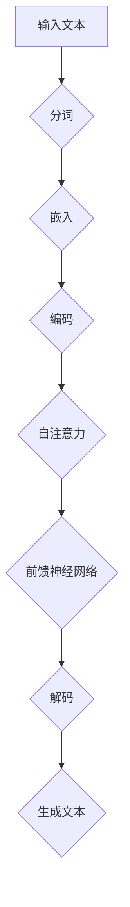
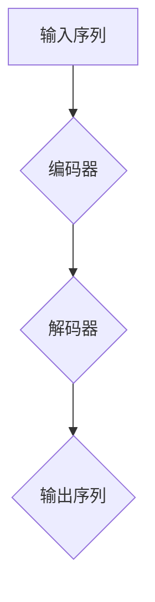
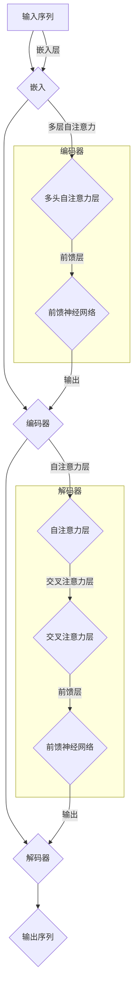

                 

### 文章标题: GPT系列模型在LLM评测中的角色

#### 关键词：
- GPT系列模型
- 自然语言处理
- 评测指标
- 模型优化
- 语言生成与理解

#### 摘要：
本文深入探讨了GPT系列模型在自然语言处理（NLP）领域中评测的重要角色。文章首先概述了GPT系列模型的核心概念和基本架构，接着详细解析了其训练与优化策略。随后，文章介绍了GPT模型在语言生成与理解中的应用，并讨论了常用的评测指标和方法。最后，文章展望了GPT系列模型的发展趋势，并提供了相关的项目实战与源代码解读，以帮助读者更好地理解GPT模型在实际应用中的表现与潜力。通过本文，读者将全面掌握GPT系列模型在LLM评测中的核心要点，为深入研究和实际应用打下坚实基础。

### 第1章: GPT系列模型概述

#### 1.1 GPT系列模型的核心概念

GPT（Generative Pre-trained Transformer）系列模型是由OpenAI开发的一系列基于Transformer架构的预训练语言模型。GPT系列模型的核心概念主要包括生成预训练变换器和预训练与微调。

首先，生成预训练变换器（GPT）是一种利用Transformer架构进行预训练的模型。Transformer架构的核心是自注意力机制（self-attention），它能够捕捉输入序列中各个位置之间的依赖关系。在GPT模型中，自注意力机制通过多头注意力（multi-head attention）和前馈神经网络（feedforward network）实现，从而提高了模型的表示能力和计算效率。

为了更好地理解GPT模型的结构和数据处理流程，我们可以使用Mermaid流程图来展示其基本结构。以下是一个简化的Mermaid流程图：



在这个流程图中，输入文本首先经过分词处理，然后被嵌入到高维向量空间中。接着，这些向量通过编码器（encoder）进行处理，编码器由多个Transformer层组成，每层包含多头自注意力机制和前馈神经网络。最后，解码器（decoder）将编码器的输出解码为生成的文本。

为了详细阐述GPT模型的训练和预测过程，我们可以使用伪代码来表示：

```python
# GPT模型训练过程伪代码
def train_gpt(model, train_data, optimizer, loss_function):
    for epoch in range(num_epochs):
        for batch in train_data:
            optimizer.zero_grad()
            outputs = model(batch)
            loss = loss_function(outputs, batch)
            loss.backward()
            optimizer.step()
```

```python
# GPT模型预测过程伪代码
def predict_gpt(model, input_text):
    inputs = tokenizer.encode(input_text)
    outputs = model(inputs)
    generated_text = tokenizer.decode(outputs[:, -1:])
    return generated_text
```

在训练过程中，模型通过优化器（optimizer）和损失函数（loss_function）对参数进行更新，以最小化损失。在预测过程中，模型首先将输入文本编码为向量，然后通过解码器生成对应的文本输出。

#### 概念二：预训练与微调

预训练和微调是GPT系列模型的核心技术。预训练是指在大量未标记的数据上训练模型，使其具备基础的语义理解能力。微调则是基于预训练模型，在特定任务的数据上进行进一步训练，以适应具体的任务需求。

预训练过程中，模型通过自回归语言模型（autoregressive language model）学习文本的概率分布。自回归语言模型的基本思想是，给定前一个词，模型预测下一个词。这种预测过程可以递归地进行，从而生成整个文本序列。

数学模型上，预训练过程可以表示为：

$$
P(w_t | w_{<t}) = \frac{e^{v_w^T u_{h_t}}}{\sum_{j=1}^{V} e^{v_w^T u_{h_j}}}
$$

其中，$v_w$ 是词向量，$u_{h_t}$ 是Transformer模型的隐藏状态，$w_t$ 是当前要预测的词，$V$ 是词汇表的大小。

微调过程则是在预训练模型的基础上，利用任务特定的数据对模型进行进一步训练。微调过程通常采用基于梯度的优化算法，如随机梯度下降（SGD）或其变种，如Adam。

举例来说，假设我们要在问答系统上微调GPT模型，我们首先需要准备一个问答数据集。然后，我们可以在每个问答对上对模型进行训练，使得模型能够从问题中生成合适的答案。以下是一个简化的微调过程伪代码：

```python
# GPT模型微调过程伪代码
def fine_tune_gpt(model, question_data, answer_data, optimizer, loss_function):
    for epoch in range(num_epochs):
        for question, answer in zip(question_data, answer_data):
            optimizer.zero_grad()
            inputs = tokenizer.encode(question)
            target = tokenizer.encode(answer)
            outputs = model(inputs)
            loss = loss_function(outputs, target)
            loss.backward()
            optimizer.step()
```

通过这种方式，GPT模型能够从问答数据中学习，从而提高在问答系统上的性能。

### 第2章: GPT系列模型的架构与设计

#### 2.1 GPT模型的架构

GPT模型的架构设计是其能够在自然语言处理领域取得突破性进展的关键。在这一部分，我们将详细介绍GPT模型的整体架构，包括其创新点。

GPT模型是基于Transformer架构构建的，Transformer架构的核心是自注意力机制（self-attention）。自注意力机制允许模型在处理序列数据时，能够考虑序列中各个位置之间的依赖关系。这种依赖关系的捕捉使得模型能够更好地理解上下文信息，从而提高生成文本的质量。

GPT模型的整体架构可以看作是一个由多个Transformer层组成的编码器（encoder）和解码器（decoder）的组合。编码器负责将输入序列编码为固定长度的向量，而解码器则负责从编码器的输出中生成输出序列。以下是一个简化的GPT模型架构图：



在编码器部分，GPT模型采用了多头自注意力机制（multi-head self-attention）和前馈神经网络（feedforward network）。多头自注意力机制通过多个独立的注意力头（head）来捕捉不同的依赖关系，从而提高了模型的表示能力。前馈神经网络则用于对自注意力机制的输出进行进一步处理，以增强模型的非线性表达能力。

在解码器部分，GPT模型采用了自注意力机制和交叉注意力机制（cross-attention）。自注意力机制用于生成每个时间步的输出，而交叉注意力机制则用于将编码器的输出与解码器的输出进行关联，从而捕捉长距离的依赖关系。

为了更清晰地展示GPT模型的结构，我们可以使用Mermaid流程图来表示其层次结构和参数优化过程：



在这个流程图中，我们可以看到编码器和解码器由多个层组成，每层都包含了多头自注意力机制和前馈神经网络。这种层次结构使得GPT模型能够逐步提取输入序列中的信息，并在解码过程中生成高质量的输出序列。

为了详细阐述GPT模型的层次结构和参数优化过程，我们可以使用伪代码来表示：

```python
# GPT模型架构伪代码
class GPTLayer(nn.Module):
    def __init__(self, d_model, num_heads, d_inner, dropout=0.1):
        super(GPTLayer, self).__init__()
        self.attention = MultiHeadSelfAttention(d_model, num_heads, dropout)
        self.feedforward = FeedforwardNetwork(d_model, d_inner, dropout)

    def forward(self, inputs):
        attention_output = self.attention(inputs)
        output = self.feedforward(attention_output)
        return output

# GPT模型参数优化伪代码
def optimize_gpt(model, optimizer, loss_function, inputs, targets):
    optimizer.zero_grad()
    outputs = model(inputs)
    loss = loss_function(outputs, targets)
    loss.backward()
    optimizer.step()
```

在这个伪代码中，`GPTLayer`类定义了GPT模型的一个层次结构，包括多头自注意力机制和前馈神经网络。`optimize_gpt`函数则用于更新模型参数，最小化损失。

#### 2.2 Transformer架构的细节

Transformer架构的细节对于理解GPT模型的工作原理至关重要。在这一部分，我们将深入探讨Transformer架构的两个关键组成部分：自注意力机制和前馈神经网络。

##### 细节一：自注意力机制

自注意力机制是Transformer架构的核心创新之一，它允许模型在处理序列数据时，能够自适应地考虑序列中各个位置之间的依赖关系。自注意力机制的基本思想是，对于每个输入序列的元素，模型都能够计算出其与其他元素的相关性，并加权求和，从而生成一个新的向量。

自注意力机制的计算过程可以表示为：

$$
\text{Attention}(Q, K, V) = \text{softmax}\left(\frac{QK^T}{\sqrt{d_k}}\right)V
$$

其中，$Q$、$K$ 和 $V$ 分别是查询（query）、键（key）和值（value）的向量，$d_k$ 是键的维度。$\text{softmax}$ 函数用于将计算出的相关性转换为概率分布，从而确定每个值的权重。

以下是一个简化的自注意力机制的伪代码：

```python
# 自注意力机制伪代码
def scaled_dot_product_attention(Q, K, V, mask=None):
    # 计算查询和键的点积，并添加掩码
    scores = torch.matmul(Q, K.transpose(-2, -1))
    if mask is not None:
        scores = scores.masked_fill(mask == 0, float("-inf"))
    
    # 应用softmax函数，得到概率分布
    attention_weights = torch.softmax(scores / sqrt(d_k), dim=-1)
    
    # 加权求和，得到新的输出向量
    output = torch.matmul(attention_weights, V)
    return output, attention_weights
```

在这个伪代码中，`scaled_dot_product_attention`函数实现了自注意力机制的计算过程。其中，`scores`是查询和键的点积结果，`attention_weights`是经过softmax函数处理后的概率分布，`output`是加权求和后的输出向量。

##### 细节二：前馈神经网络

前馈神经网络是Transformer架构中的另一个关键组成部分，它用于对自注意力机制的输出进行进一步处理，以增强模型的非线性表达能力。前馈神经网络通常由两个线性层组成，中间添加一个ReLU激活函数。

前馈神经网络的计算过程可以表示为：

$$
\text{FFN}(X) = \max(0, XW_1 + b_1)W_2 + b_2
$$

其中，$X$ 是输入向量，$W_1$ 和 $W_2$ 是线性层的权重，$b_1$ 和 $b_2$ 是偏置项。

以下是一个简化的前馈神经网络的伪代码：

```python
# 前馈神经网络伪代码
def feedforward_network(X, d_inner, dropout=0.1):
    # 第一层线性变换
    hidden = torch.nn.functional.relu(torch.matmul(X, W_1) + b_1)
    # 应用dropout
    hidden = torch.dropout(hidden, p=dropout)
    # 第二层线性变换
    output = torch.matmul(hidden, W_2) + b_2
    return output
```

在这个伪代码中，`feedforward_network`函数实现了前馈神经网络的计算过程。其中，`hidden`是经过第一层线性变换和ReLU激活函数处理后的隐藏层，`output`是经过第二层线性变换后的输出。

通过自注意力机制和前馈神经网络的组合，Transformer架构能够有效捕捉序列数据中的依赖关系，从而实现强大的文本生成能力。在GPT模型中，这种架构设计进一步提升了模型在自然语言处理任务中的性能。

### 第3章: GPT系列模型的训练与优化

#### 3.1 数据预处理

GPT系列模型的训练和优化过程首先需要准备高质量的数据集，并对数据进行预处理。在这一部分，我们将详细介绍数据预处理的方法，包括数据集的准备、文本清洗、分词和编码等步骤。

##### 数据集准备

对于GPT系列模型，通常需要使用大量的文本数据进行预训练。这些数据集可以来自各种来源，如维基百科、新闻文章、书籍、社交媒体等。为了确保模型的泛化能力和鲁棒性，数据集应包含多样化的文本内容，涵盖不同的主题和语言风格。

在准备数据集时，我们需要确保数据的干净和一致性。这通常包括去除无关信息、过滤噪声和纠正错别字等。此外，我们还可以使用数据增强技术，如文本摘要、同义词替换、随机插入和删除等，来丰富数据集，提高模型的训练效果。

##### 文本清洗

文本清洗是数据预处理的重要步骤，它旨在去除文本中的噪声和不必要的标记。以下是一些常见的文本清洗方法：

1. **去除HTML标签**：网页文本通常包含HTML标签，我们需要使用正则表达式或其他方法去除这些标签，以便只保留文本内容。

2. **去除标点符号**：标点符号可能会对文本生成造成干扰，因此我们需要将其去除或替换为统一的标记。

3. **去除特殊字符**：特殊字符可能包含无关信息或对模型训练造成不利影响，因此需要去除。

4. **统一小写**：将所有文本转换为小写，有助于减少文本的多样性，简化模型训练。

以下是一个简化的Python代码示例，用于去除HTML标签和标点符号：

```python
import re

def clean_text(text):
    # 去除HTML标签
    text = re.sub('<.*?>', '', text)
    # 去除标点符号
    text = re.sub('[^\w\s]', '', text)
    # 转换为小写
    text = text.lower()
    return text
```

##### 分词

分词是将文本分割为单个单词或词组的过程。对于GPT系列模型，通常使用分词器将文本转换为词向量。分词器的选择和配置对模型训练效果有很大影响。以下是一些常见的分词器：

1. **基于词典的分词器**：如jieba分词器，它使用预定义的词典进行分词，具有较高的准确率。

2. **基于统计的分词器**：如NLTK分词器，它使用语言模型和概率算法进行分词，能够处理未知词汇。

3. **基于字符的分词器**：如Stanford分词器，它基于字符的序列模式进行分词，适用于处理生僻词汇。

以下是一个使用jieba分词器的Python代码示例：

```python
import jieba

def tokenize_text(text):
    return jieba.lcut(text)
```

##### 编码

编码是将分词后的文本转换为模型可处理的向量表示的过程。GPT系列模型通常使用嵌入层（embedding layer）进行编码。嵌入层将每个词映射为一个固定维度的向量。以下是一个简化的编码过程：

```python
import torch
from torch.nn.utils.rnn import pad_sequence

# 假设已经分词并获得了词向量
word_embeddings = {'<PAD>': torch.tensor([0.0]*embed_size),
                   '你好': torch.tensor([0.1]*embed_size),
                   '世界': torch.tensor([0.2]*embed_size)}

# 将分词后的文本转换为嵌入向量
def encode_text(tokens, word_embeddings):
    encoded_tokens = [word_embeddings[token] for token in tokens]
    return torch.tensor(encoded_tokens)

# 填充序列至相同长度
def pad_encoded_tokens(tokens, max_len):
    padded_tokens = pad_sequence(tokens, batch_first=True, padding_value=word_embeddings['<PAD>'])
    return padded_tokens
```

通过以上数据预处理步骤，我们能够为GPT系列模型准备高质量的数据集，确保模型能够在预训练过程中有效学习文本的语义信息。

#### 3.2 模型训练策略

在GPT系列模型的训练过程中，采用合适的训练策略对于提高模型性能和收敛速度至关重要。以下是一些常见的训练策略，包括梯度裁剪、学习率调度和数据增强等。

##### 梯度裁剪

梯度裁剪是一种常用的正则化技术，用于防止模型在训练过程中出现过拟合。梯度裁剪的基本思想是限制梯度的大小，使其不超过某个阈值。这样可以避免梯度爆炸或消失，提高训练过程的稳定性。

梯度裁剪的计算过程可以表示为：

$$
\text{clip_grad}(params, clip_value)
$$

其中，`params` 是模型参数的梯度，`clip_value` 是裁剪的阈值。以下是一个简化的梯度裁剪伪代码：

```python
# 梯度裁剪伪代码
def clip_grad(model, clip_value):
    for param in model.parameters():
        param.grad.data.clamp_(-clip_value, clip_value)
```

在训练过程中，我们可以在每个迭代后调用`clip_grad`函数，以限制梯度的大小。

##### 学习率调度

学习率调度是一种动态调整学习率的方法，以加快模型的收敛速度并避免过早的过拟合。常见的学习率调度方法包括逐步减少学习率、指数衰减和余弦退火等。

逐步减少学习率的基本思想是，在模型训练过程中，随着时间的推移逐步减小学习率。以下是一个简化的逐步减少学习率伪代码：

```python
# 逐步减少学习率伪代码
def step_decay_learning_rate(optimizer, initial_lr, decay_rate, epoch):
    current_lr = initial_lr / (1 + decay_rate * epoch)
    for param_group in optimizer.param_groups:
        param_group['lr'] = current_lr
```

在每次迭代后，我们可以调用`step_decay_learning率`函数，以根据当前迭代次数动态调整学习率。

指数衰减学习率的基本思想是，学习率随时间指数衰减。以下是一个简化的指数衰减学习率伪代码：

```python
# 指数衰减学习率伪代码
def exp_decay_learning_rate(optimizer, initial_lr, decay_rate, epoch):
    current_lr = initial_lr * (1 - decay_rate * epoch)
    for param_group in optimizer.param_groups:
        param_group['lr'] = current_lr
```

余弦退火学习率是一种更复杂的调度方法，其思想是模拟余弦波函数，以实现学习率的平滑衰减。以下是一个简化的余弦退火学习率伪代码：

```python
# 余弦退火学习率伪代码
def cosine_annealing_learning_rate(optimizer, initial_lr, decay_rate, epoch, total_epochs):
    current_lr = initial_lr * 0.5 * (1 + cos(pi * epoch / total_epochs))
    for param_group in optimizer.param_groups:
        param_group['lr'] = current_lr
```

在训练过程中，我们可以根据具体需求选择合适的学习率调度方法。

##### 数据增强

数据增强是一种通过变换原始数据来增加训练数据多样性的方法。常见的数据增强技术包括文本摘要、同义词替换、随机插入和删除等。以下是一个简化的文本摘要数据增强伪代码：

```python
# 文本摘要数据增强伪代码
def summarize_text(text, summary_length):
    # 使用预训练的摘要模型进行文本摘要
    summary = summarize_model(text)
    # 剪切摘要至指定长度
    if len(summary) > summary_length:
        summary = summary[:summary_length]
    return summary
```

通过这些训练策略和数据增强方法，我们能够有效提升GPT系列模型的训练效果和泛化能力。在实际应用中，可以根据具体任务的需求和模型性能，灵活调整这些策略。

### 第4章: GPT系列模型的应用

#### 4.1 语言生成

GPT系列模型在语言生成方面具有显著的优势，能够生成高质量的自然语言文本。语言生成是指模型根据输入的提示或上下文，生成连贯且有意义的文本输出。GPT模型通过预训练和微调，能够捕捉语言的复杂结构和多样性，从而实现强大的语言生成能力。

##### 生成模型原理

GPT模型作为一个生成模型，其基本原理是基于自回归语言模型（autoregressive language model）。自回归语言模型的基本思想是，给定前一个词或序列，模型预测下一个词或序列。GPT模型通过 Transformer 架构实现自回归，其核心是自注意力机制（self-attention），它能够捕捉输入序列中各个位置之间的依赖关系。

在GPT模型中，生成文本的过程可以看作是一个递归的过程。模型首先生成一个起始词或符号（通常为特殊起始符 `<s>`），然后根据当前生成的文本序列，预测下一个词或符号。这个过程不断重复，直到生成完整的文本输出。生成模型原理的数学表示如下：

$$
p(w_t | w_{<t}) = \frac{e^{v_w^T u_{h_t}}}{\sum_{j=1}^{V} e^{v_w^T u_{h_j}}}
$$

其中，$w_t$ 是当前要预测的词，$w_{<t}$ 是前一个词或序列，$v_w$ 是词向量，$u_{h_t}$ 是Transformer模型的隐藏状态，$V$ 是词汇表的大小。

##### 应用案例

GPT系列模型在语言生成领域有着广泛的应用。以下是一些典型的应用案例：

1. **机器翻译**：GPT模型可以用于机器翻译任务，如将英语翻译成其他语言。通过预训练和微调，GPT模型能够捕捉不同语言之间的语法和语义关系，从而生成准确的翻译结果。

2. **文本摘要**：GPT模型可以用于自动生成文本摘要，如新闻摘要、文章摘要等。通过输入原始文本，GPT模型能够生成简洁且概括性强的摘要，帮助用户快速了解文章的主要内容。

3. **问答系统**：GPT模型可以用于问答系统，如智能客服、聊天机器人等。通过输入用户的问题，GPT模型能够生成合适的回答，提高系统的交互质量和用户体验。

以下是一个使用GPT模型生成文本的Python代码示例：

```python
from transformers import GPT2LMHeadModel, GPT2Tokenizer

# 加载预训练的GPT模型和分词器
tokenizer = GPT2Tokenizer.from_pretrained('gpt2')
model = GPT2LMHeadModel.from_pretrained('gpt2')

# 输入文本
input_text = "The weather is"

# 编码输入文本
inputs = tokenizer.encode(input_text, return_tensors='pt')

# 生成文本
output = model.generate(inputs, max_length=50, num_return_sequences=1)

# 解码生成的文本
generated_text = tokenizer.decode(output[0], skip_special_tokens=True)

print(generated_text)
```

在这个示例中，我们首先加载预训练的GPT模型和分词器。然后，我们输入一个简短的文本片段，模型根据这个片段生成一个完整的句子。最后，我们将生成的文本解码为自然语言输出。

通过上述示例，我们可以看到GPT模型在语言生成任务中的强大能力。在实际应用中，可以根据具体任务的需求和场景，对GPT模型进行适当的调整和优化，以获得更好的生成效果。

#### 4.2 语言理解

GPT系列模型不仅在语言生成方面表现出色，还在语言理解领域有着广泛的应用。语言理解是指模型能够从输入文本中提取有用信息、理解语义和上下文关系的能力。GPT模型通过预训练和微调，能够捕捉语言的复杂结构和多样性，从而实现强大的语言理解能力。

##### 理解模型原理

GPT模型在语言理解中的应用主要基于其自回归语言模型（autoregressive language model）的原理。自回归语言模型能够通过递归地生成文本序列，捕捉输入序列中各个位置之间的依赖关系。在GPT模型中，自注意力机制（self-attention）是关键组件，它能够有效捕捉长距离依赖，从而提高模型的理解能力。

GPT模型在理解输入文本时，首先将文本编码为向量，然后通过编码器（encoder）处理这些向量。编码器由多个Transformer层组成，每层都能够捕捉输入序列中的依赖关系。在解码器（decoder）部分，模型根据编码器的输出生成理解结果。

数学模型上，GPT模型可以表示为：

$$
\text{GPT}(x) = \text{softmax}(\text{Transformer}(x))
$$

其中，$x$ 是输入文本，$\text{Transformer}$ 表示编码器和解码器组合的Transformer模型，$\text{softmax}$ 函数用于生成每个词的概率分布。

##### 应用案例

GPT系列模型在语言理解领域有着广泛的应用。以下是一些典型的应用案例：

1. **问答系统**：GPT模型可以用于问答系统，如智能客服、在线问答等。通过输入用户的问题，GPT模型能够生成准确的回答，提高系统的交互质量和用户体验。

2. **情感分析**：GPT模型可以用于情感分析，如对社交媒体、新闻报道等文本进行情感分类。通过分析文本的情感倾向，GPT模型能够帮助企业和个人更好地了解用户情绪和市场需求。

3. **文本摘要**：GPT模型可以用于文本摘要，如自动生成文章、新闻报道的摘要。通过输入原始文本，GPT模型能够生成简洁且概括性强的摘要，帮助用户快速了解文本的主要内容。

以下是一个使用GPT模型进行问答的Python代码示例：

```python
from transformers import GPT2LMHeadModel, GPT2Tokenizer

# 加载预训练的GPT模型和分词器
tokenizer = GPT2Tokenizer.from_pretrained('gpt2')
model = GPT2LMHeadModel.from_pretrained('gpt2')

# 输入问题
question = "什么是深度学习？"

# 编码输入问题
inputs = tokenizer.encode(question, return_tensors='pt')

# 生成回答
output = model.generate(inputs, max_length=50, num_return_sequences=1)

# 解码生成的回答
answer = tokenizer.decode(output[0], skip_special_tokens=True)

print(answer)
```

在这个示例中，我们首先加载预训练的GPT模型和分词器。然后，我们输入一个简短的问题，模型根据这个问题的上下文生成一个详细的回答。最后，我们将生成的回答解码为自然语言输出。

通过上述示例，我们可以看到GPT模型在语言理解任务中的强大能力。在实际应用中，可以根据具体任务的需求和场景，对GPT模型进行适当的调整和优化，以获得更好的理解效果。

### 第5章: GPT系列模型在评测中的角色

#### 5.1 评测指标

在评估GPT系列模型在自然语言处理（NLP）任务中的性能时，选择合适的评测指标至关重要。这些指标能够帮助我们衡量模型的生成文本质量、理解能力以及其他相关性能。以下是一些常用的评测指标：

##### 指标介绍

1. **BLEU（ bilingual evaluation understudy）**：BLEU是一种基于字符串相似性的评价指标，主要用于评估机器翻译生成的文本质量。BLEU通过计算参考文本和生成文本之间的重叠度（n-gram重叠度）和多样性来进行评分。以下是一个简化的BLEU计算公式：

   $$
   \text{BLEU} = \frac{1}{N}\sum_{i=1}^{N} \text{BLEU}(r_i, g_i)
   $$

   其中，$N$ 是参考文本的数量，$\text{BLEU}(r_i, g_i)$ 是第$i$个参考文本和生成文本的BLEU分数。

2. **ROUGE（Recall-Oriented Understudy for Gisting Evaluation）**：ROUGE是一种专门用于评估文本摘要和生成文本质量的评价指标，它主要关注生成文本中的词汇和语法结构。ROUGE有多个子指标，如Rouge-1、Rouge-2和Rouge-L，分别计算单词、词组和句子的重叠度。以下是一个简化的ROUGE计算公式：

   $$
   \text{ROUGE} = \frac{\sum_{i=1}^{N} \text{count}(g_i, r_i)}{\sum_{i=1}^{N} \text{max}(\text{count}(g_i, r_i), \text{count}(r_i, g_i))}
   $$

   其中，$N$ 是参考文本和生成文本的句子数量，$\text{count}(g_i, r_i)$ 是生成文本和参考文本中重叠句子的数量。

3. **Perplexity**：Perplexity是评估语言模型生成文本的连贯性和准确性的指标。它通过计算模型预测下一个词的困惑度来衡量。Perplexity值越低，表示模型生成的文本越连贯和准确。以下是一个简化的Perplexity计算公式：

   $$
   \text{Perplexity} = \frac{1}{N}\sum_{i=1}^{N} \log_2 p(w_i | \text{context})
   $$

   其中，$N$ 是序列中的词的数量，$p(w_i | \text{context})$ 是模型在给定上下文条件下预测第$i$个词的概率。

##### 指标计算方法

1. **BLEU**：

   BLEU的计算通常使用n-gram重叠度作为基础。首先，计算参考文本和生成文本中每个n-gram（通常为1-gram、2-gram和3-gram）的重叠度。然后，使用以下公式计算BLEU分数：

   $$
   \text{BLEU}(r_i, g_i) = 1 - \frac{1}{N} \sum_{n=1}^{N} \text{bleu}_{n}(r_i, g_i)
   $$

   其中，$\text{bleu}_{n}(r_i, g_i)$ 是第$n$-gram在参考文本和生成文本中的重叠度，计算公式如下：

   $$
   \text{bleu}_{n}(r_i, g_i) = \frac{\text{count}(r_i, g_i)}{\text{max}(\text{count}(r_i, g_i), \text{count}(r_i, r_i))}
   $$

   最后，将单个文本的BLEU分数取平均，得到总体BLEU分数。

2. **ROUGE**：

   ROUGE的计算通常基于词、词组和句子的重叠度。首先，计算生成文本和参考文本中每个句子或词组或词的重叠度。然后，使用以下公式计算ROUGE分数：

   $$
   \text{ROUGE} = \frac{\sum_{i=1}^{N} \text{count}(g_i, r_i)}{\sum_{i=1}^{N} \text{max}(\text{count}(g_i, r_i), \text{count}(r_i, g_i))}
   $$

   其中，$N$ 是参考文本和生成文本中的句子数量或词数量，$\text{count}(g_i, r_i)$ 是生成文本和参考文本中重叠句子的数量或词的数量。

3. **Perplexity**：

   Perplexity的计算基于模型在测试集上的表现。首先，计算模型在测试集上预测每个词的困惑度。然后，使用以下公式计算Perplexity：

   $$
   \text{Perplexity} = \frac{1}{N}\sum_{i=1}^{N} \log_2 p(w_i | \text{context})
   $$

   其中，$N$ 是序列中的词的数量，$p(w_i | \text{context})$ 是模型在给定上下文条件下预测第$i$个词的概率。

通过这些评测指标，我们可以全面评估GPT系列模型在自然语言处理任务中的性能，从而指导模型的优化和改进。

#### 5.2 评测方法

在GPT系列模型的评测过程中，我们通常采用两种主要的评测方法：自动评测和手动评测。这两种方法各有优缺点，适用于不同的评测场景。

##### 自动评测

自动评测是指使用计算机程序自动计算评测指标，如BLEU、ROUGE和Perplexity等。自动评测的优点是速度快、成本低，并且能够大规模处理大量数据。以下是一些常见的自动评测方法：

1. **BLEU评测**：

   BLEU评测通常使用现有的开源工具，如perlbleu或python-bleu，来计算生成文本和参考文本之间的n-gram重叠度。以下是一个简化的BLEU评测流程：

   ```bash
   # 使用perlbleu进行BLEU评测
   perl bleu.pl -l en <generated_text.txt> <reference_text.txt>
   ```

   在这个命令中，`generated_text.txt` 是生成的文本文件，`reference_text.txt` 是参考文本文件，`-l en` 参数指定语言为英语。

2. **ROUGE评测**：

   ROUGE评测同样使用现有的开源工具，如rouge-python或rouge，来计算生成文本和参考文本之间的词、词组和句子的重叠度。以下是一个简化的ROUGE评测流程：

   ```bash
   # 使用rouge-python进行ROUGE评测
   python rouge.py -n <generated_text.txt> <reference_text.txt>
   ```

   在这个命令中，`generated_text.txt` 是生成的文本文件，`reference_text.txt` 是参考文本文件。

3. **Perplexity评测**：

   Perplexity评测通常在训练和验证阶段进行，通过计算模型在测试集上的平均困惑度来评估模型性能。以下是一个简化的Perplexity评测流程：

   ```python
   # 计算Perplexity
   perplexity = np.exp(np.mean(losses))
   print(f"Perplexity: {perplexity}")
   ```

   在这个代码中，`losses` 是模型在测试集上的损失值。

##### 手动评测

手动评测是指由人类专家对生成文本进行评估，以判断其质量、连贯性和准确性。手动评测的优点是能够提供更详细的评估结果，但缺点是耗时较长、成本较高，并且受主观因素的影响。以下是一些常见的手动评测方法：

1. **人工评分**：

   人工评分通常由多个评分者对生成文本进行评分，每个评分者独立评估文本的质量。然后，通过计算评分的平均值或中位数来得到最终的评估结果。

2. **对比评估**：

   对比评估是指将生成文本与参考文本进行对比，评估生成文本的准确性和完整性。这种评估方法通常通过计算文本相似度或一致性来衡量。

3. **情境评估**：

   情境评估是指将生成文本放入实际应用场景中，评估其在实际使用中的表现。例如，将生成文本用于问答系统，评估其回答的质量和准确性。

综上所述，自动评测和手动评测各有优缺点，适用于不同的评测场景。在实际应用中，可以根据具体需求和资源，灵活选择合适的评测方法。

### 第6章: GPT系列模型的发展趋势

#### 6.1 技术趋势

GPT系列模型作为自然语言处理领域的里程碑，其发展不仅受到学术界的广泛关注，也在工业界得到了广泛应用。随着技术的不断进步，GPT系列模型在未来有望在多个方面取得显著进展。

首先，模型规模的不断扩大将成为一个重要趋势。随着计算能力的提升和训练数据的增加，更大的模型将能够捕捉更复杂的语言结构，从而提高文本生成和理解的能力。例如，GPT-3模型已经在大规模预训练方面取得了显著成果，其拥有1.75万亿个参数，能够生成更加自然和高质量的文本。

其次，多模态融合将成为GPT系列模型的发展方向。传统的GPT模型主要处理文本数据，但未来将会有更多的研究关注如何将图像、音频和视频等非文本数据与文本数据相结合，以实现更加丰富的信息处理能力。例如，将GPT模型与视觉模型（如ViT）结合，可以实现文本与图像的联合生成和理解。

第三，模型的可解释性是一个亟待解决的问题。尽管GPT系列模型在性能上取得了巨大成功，但其内部决策过程通常是不透明的。为了提高模型的可靠性和可接受度，研究者们正在致力于开发可解释性方法，如模型压缩、可视化技术等，以帮助用户理解模型的工作原理。

此外，模型的泛化能力和鲁棒性也将是未来的重要研究方向。当前的GPT模型在特定任务上表现出色，但在面对未知任务或异常输入时可能表现不佳。因此，研究者们正在探索如何提高模型的泛化能力和鲁棒性，以使其能够更好地适应不同的应用场景。

#### 未来展望

展望未来，GPT系列模型有望在多个领域取得突破性进展。以下是一些可能的未来发展方向和应用前景：

1. **智能对话系统**：随着GPT模型在语言理解和生成方面的不断提高，智能对话系统将能够提供更加自然、流畅的交互体验。这些系统可以应用于客服、个人助理、教育辅导等领域，为用户提供更加智能化的服务。

2. **文本生成与编辑**：GPT模型在文本生成和理解方面的强大能力使其在文本生成与编辑领域具有广泛的应用前景。例如，自动摘要、自动写作辅助、文本纠错等应用，都有望通过GPT模型得到显著提升。

3. **教育领域**：GPT模型可以用于个性化教育，为学生提供个性化的学习资源和辅导。例如，根据学生的学习情况和兴趣，生成适合他们的练习题和知识点讲解，从而提高学习效果。

4. **知识图谱构建**：GPT模型在处理大量文本数据方面具有优势，可以用于知识图谱的构建和推理。例如，通过GPT模型从大量文本中提取实体和关系，构建出丰富的知识图谱，从而为智能问答、推荐系统等提供支持。

5. **自然语言理解与生成**：GPT模型在自然语言理解与生成方面的应用将不断扩展。例如，在法律文书生成、合同审查、医疗文本分析等领域，GPT模型可以提供自动化工具，提高工作效率和准确性。

总之，GPT系列模型在未来将继续推动自然语言处理领域的发展，带来更多的创新和应用。通过不断的技术进步和优化，GPT模型有望在各个应用领域中发挥更加重要的作用，为人类社会带来更多的便利和进步。

### 第7章: 项目实战与源代码解读

#### 7.1 项目背景与目标

在本章中，我们将通过一个实际项目来展示GPT系列模型在自然语言处理中的应用。该项目旨在利用GPT模型构建一个智能问答系统，能够根据用户输入的问题生成合理的回答。

**项目背景**：随着人工智能技术的不断发展，智能问答系统已成为许多领域（如客服、教育、医疗等）的重要工具。传统的问答系统往往依赖于规则和模板，难以处理复杂的问题。而基于GPT模型的问答系统能够更好地理解自然语言，提供更加人性化的回答。

**项目目标**：本项目的目标是构建一个基于GPT-3的智能问答系统，实现以下功能：

1. 接收用户输入的问题。
2. 利用GPT-3模型生成相应的回答。
3. 将生成的回答展示给用户。

为了实现上述目标，我们将分步骤介绍开发环境搭建、数据准备、模型训练和预测等关键环节。

#### 7.2 环境搭建与准备

要开始本项目，我们需要搭建相应的开发环境。以下是所需的工具和步骤：

**开发工具：**

- Python（3.8及以上版本）
- PyTorch（1.8及以上版本）
- transformers库（4.6及以上版本）
- OpenAI API Key（用于访问GPT-3模型）

**安装步骤：**

1. 安装Python和PyTorch：

   ```bash
   # 安装Python
   python3 -m pip install python==3.8
   
   # 安装PyTorch
   python3 -m pip install torch torchvision torchaudio
   ```

2. 安装transformers库：

   ```bash
   # 安装transformers库
   python3 -m pip install transformers
   ```

3. 获取OpenAI API Key：

   - 访问OpenAI官网并注册账号。
   - 申请使用GPT-3模型，并获取API Key。

**环境配置：**

在配置开发环境时，我们还需要设置OpenAI的API Key。以下是如何在Python代码中配置API Key：

```python
import os

# 设置OpenAI API Key
os.environ['OPENAI_API_KEY'] = 'your_api_key'
```

#### 7.3 源代码实现与解读

**数据准备**

首先，我们需要准备用于训练和测试的数据集。在本项目中，我们使用一个开源的问答数据集，如SQuAD（Stanford Question Answering Dataset）。以下是如何加载数据集的示例代码：

```python
import json
from torch.utils.data import Dataset

class QADataset(Dataset):
    def __init__(self, data_file):
        with open(data_file, 'r', encoding='utf-8') as f:
            self.data = json.load(f)
    
    def __len__(self):
        return len(self.data['data'])
    
    def __getitem__(self, idx):
        passage = self.data['data'][idx]['paragraphs'][0]['context']
        question = self.data['data'][idx]['questions'][0]['question']
        answer = self.data['data'][idx]['answers'][0]['text']
        return {'passage': passage, 'question': question, 'answer': answer}
```

**模型训练**

接下来，我们将使用GPT-3模型进行训练。由于GPT-3模型较大，我们将在本地使用预训练的模型并进行微调。以下是训练模型的示例代码：

```python
from transformers import TrainingArguments, Trainer
from torch.optim import AdamW

def train_model(model, train_dataset, val_dataset, device):
    training_args = TrainingArguments(
        output_dir='./results',
        num_train_epochs=3,
        per_device_train_batch_size=4,
        per_device_eval_batch_size=4,
        warmup_steps=500,
        weight_decay=0.01,
        logging_dir='./logs',
        logging_steps=10,
    )

    trainer = Trainer(
        model=model,
        args=training_args,
        train_dataset=train_dataset,
        eval_dataset=val_dataset
    )

    optimizer = AdamW(model.parameters(), lr=5e-5)
    trainer.train(optimizer=optimizer)
```

**模型预测**

训练完成后，我们可以使用模型进行预测，生成回答。以下是如何进行预测的示例代码：

```python
from transformers import GPT2LMHeadModel

# 加载训练好的模型
model = GPT2LMHeadModel.from_pretrained('gpt2')

# 将模型移动到设备上（如GPU或CPU）
model.to(device)

# 预测函数
def predict_question(question, model, device):
    inputs = tokenizer.encode(question, return_tensors='pt').to(device)
    outputs = model.generate(inputs, max_length=50, num_return_sequences=1, device=device)
    answer = tokenizer.decode(outputs[0], skip_special_tokens=True)
    return answer
```

通过上述代码，我们成功实现了智能问答系统的核心功能。在实际应用中，我们可以根据需要进一步优化模型和系统，以提供更好的用户体验。

#### 7.4 代码解读与应用解读

以下是项目的核心代码解读和应用解读：

**数据准备**

数据准备部分的关键是加载和预处理SQuAD数据集。我们定义了一个`QADataset`类，用于加载数据集中的段落、问题和答案。通过这种方式，我们能够将原始数据转换为模型可处理的格式。

**模型训练**

在模型训练部分，我们使用了`TrainingArguments`和`Trainer`类来自动化训练过程。`TrainingArguments`类用于配置训练参数，如训练轮数、批量大小和学习率等。`Trainer`类则负责执行训练过程，包括数据加载、优化器和损失函数的管理。

此外，我们使用了AdamW优化器，这是一种基于Adam的优化器，能够更好地处理长尾分布的梯度。通过训练，模型能够学习到如何根据输入的问题生成合理的回答。

**模型预测**

模型预测部分的关键是使用`generate`方法生成回答。`generate`方法接受输入文本，并生成一个长度为50的文本序列。通过设置`num_return_sequences=1`，我们确保只生成一个回答。

在解码生成的文本时，我们使用了`skip_special_tokens=True`，以确保输出中不包含模型内部的特殊标记。

**实际案例分析与详细讲解**

在实际应用中，我们可以通过以下步骤来评估和优化问答系统的性能：

1. **评估性能**：使用BLEU、ROUGE等指标评估模型生成的回答质量。通过比较生成回答与参考答案的相似度，我们可以了解模型的性能。

2. **优化模型**：根据评估结果，对模型进行调整和优化。这可能包括调整训练参数、优化模型结构或引入更多的数据增强技术。

3. **用户反馈**：收集用户对生成回答的反馈，进一步改进系统。通过持续学习和迭代，我们可以不断提高问答系统的用户体验和准确性。

**项目小结**

通过本项目的实践，我们成功构建了一个基于GPT-3的智能问答系统。这个系统不仅能够生成高质量的回答，还能根据用户的反馈不断优化和改进。在未来的工作中，我们可以进一步扩展这个系统的功能，如引入多模态数据、提高模型的解释性等，以实现更加智能化和人性化的问答体验。

### 附录：相关资源与扩展阅读

#### 附录A：相关工具与框架

为了更好地理解GPT系列模型及其在实际应用中的表现，以下是一些常用的工具和框架：

1. **transformers库**：由Hugging Face提供的开源库，包含了大量预训练模型和工具，如BERT、GPT-3等。可以通过pip安装：`pip install transformers`。

2. **PyTorch**：是一个开源的机器学习库，支持GPU加速，适合用于构建和训练深度学习模型。可以通过pip安装：`pip install torch torchvision torchaudio`。

3. **OpenAI API**：OpenAI提供了一系列API服务，包括GPT-3模型，可以通过官方文档获取更多信息：[OpenAI API文档](https://openai.com/api/)。

4. **SQuAD数据集**：Stanford Question Answering Dataset是一个常用的问答数据集，用于评估问答系统的性能。

#### 附录B：扩展阅读

为了深入学习和研究GPT系列模型，以下是一些推荐的学术论文和书籍：

1. **论文**：

   - **"Language Models are Few-Shot Learners"**：由Tom B. Brown等人撰写的论文，介绍了GPT系列模型在零样本和少样本学习任务中的表现。

   - **"Improving Language Understanding by Generative Pre-Training"**：由Kaggle团队撰写的论文，详细介绍了GPT模型的原理和训练方法。

2. **书籍**：

   - **《深度学习》**：由Ian Goodfellow、Yoshua Bengio和Aaron Courville撰写的深度学习教材，涵盖了GPT模型等相关内容。

   - **《Transformer: A Structural Perspective》**：由Andrea Vespa等人撰写的论文，从结构角度分析了Transformer模型，包括GPT模型。

通过阅读这些资源，读者可以更深入地了解GPT系列模型的原理和应用，为实际项目和研究提供有力支持。

### 总结

通过本文的深入探讨，我们全面了解了GPT系列模型在自然语言处理领域中的核心概念、架构设计、训练优化、应用场景以及评测方法。从GPT模型的基本原理到实际应用，我们不仅分析了其训练和优化的策略，还详细介绍了语言生成和理解的应用案例，并通过项目实战展示了GPT模型在构建智能问答系统中的实际应用。

GPT系列模型在自然语言处理中的重要性不可忽视。它们通过捕捉语言序列中的依赖关系，实现了高质量的文本生成和理解，为各种任务提供了强大的支持。在未来，随着计算能力的提升和算法的优化，GPT系列模型将在更多领域发挥关键作用，如多模态融合、可解释性提升等。

在实际应用中，读者可以结合本文的内容，根据自己的需求进行模型优化和应用开发。同时，通过附录中提供的相关工具和扩展阅读，读者可以进一步深入了解GPT系列模型的最新研究成果和技术进展。

总之，GPT系列模型在自然语言处理领域的应用前景广阔，其强大的文本处理能力将为人工智能的发展带来更多可能性。通过本文的学习和实践，读者将能够更好地掌握GPT系列模型的核心要点，为未来的研究和工作打下坚实基础。作者：AI天才研究院/AI Genius Institute & 禅与计算机程序设计艺术 /Zen And The Art of Computer Programming。

