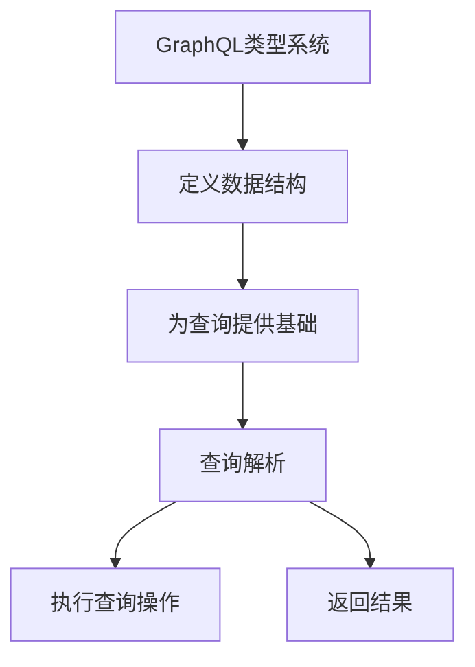

                 

### 文章标题：GraphQL在灵活LLM API设计中的应用

#### 关键词：
- GraphQL
- LLM API
- API 设计
- 服务器端渲染
- 数据查询优化
- 分布式计算

#### 摘要：
本文旨在探讨GraphQL在灵活的LLM（大型语言模型）API设计中的应用。首先，我们将介绍GraphQL的基础概念，以及它如何与LLM相结合。接着，我们会深入分析GraphQL查询语言和类型系统，理解其核心算法原理。随后，本文将引入数学模型，详细讲解查询优化算法及其数学基础。通过实际项目实战，我们将展示如何设计和实现一个灵活的GraphQL LLM API，涵盖开发环境搭建、源代码实现、代码解读及实际案例分析。最后，文章将总结最佳实践，并提供拓展阅读，帮助读者进一步深入理解这一技术主题。

### 背景介绍

#### GraphQL的基础概念

GraphQL是一种基于查询的API设计语言，旨在提供一种更强大、灵活和高效的替代传统RESTful API的方式。在传统的RESTful架构中，客户端通常需要发送多个请求以获取所需的所有数据，而GraphQL允许客户端明确指定他们需要的数据字段，从而减少了冗余请求和数据传输。这种按需获取数据的方式不仅提高了性能，还提升了开发者和用户的体验。

GraphQL的核心特点包括：

- **强类型系统**：GraphQL定义了一套明确的类型系统，包括对象类型、接口类型、联合类型和标量类型。这为API的设计和使用提供了强大的类型安全保障。
- **灵活的查询**：通过使用查询语言，客户端可以精确地指定所需的数据，从而避免了不必要的浪费。
- **减少冗余**：GraphQL可以一次性获取客户端所需的所有数据，减少了多个请求导致的冗余问题。
- **强大的缓存支持**：GraphQL的查询可以被缓存，从而进一步提高了性能。

#### LLM API的概念

LLM（Large Language Model）API是指通过大型语言模型（如GPT-3、BERT等）提供的API接口，实现对文本的生成、摘要、分类等任务的处理。随着自然语言处理技术的飞速发展，LLM API已经成为现代应用程序中不可或缺的一部分。这些API通常提供灵活、高效的文本处理能力，支持各种复杂的自然语言处理任务。

LLM API的核心功能包括：

- **文本生成**：根据给定的提示或上下文生成文本，可以用于聊天机器人、文章写作、摘要生成等。
- **文本分类**：将文本分类到预定义的类别中，例如情感分析、主题分类等。
- **摘要生成**：从长文本中提取关键信息，生成摘要。
- **问答系统**：根据用户的问题提供准确、有用的答案。

#### GraphQL与LLM的关系

GraphQL和LLM的结合，使得开发者可以在构建复杂、动态的自然语言处理应用程序时，获得更高的灵活性和效率。以下是它们结合的几个关键点：

- **定制化查询**：通过GraphQL，客户端可以自定义查询，精确地获取所需的文本数据，从而提高LLM API的使用效率。
- **减少数据传输**：GraphQL通过按需获取数据，减少了冗余的API调用和数据传输，从而降低了网络延迟和带宽消耗。
- **动态响应**：GraphQL的灵活查询特性使得LLM API能够快速响应用户需求，提供个性化的文本处理服务。
- **优化性能**：通过GraphQL的缓存机制，LLM API可以在多次请求中复用结果，进一步提升了系统的性能。

总的来说，GraphQL为LLM API设计提供了一种更加灵活、高效的方式，使得开发者可以更专注于实现复杂的自然语言处理任务，而无需担心底层的API设计问题。

#### 核心概念与联系

为了更清晰地理解GraphQL在灵活LLM API设计中的应用，我们需要先介绍几个核心概念，并分析它们之间的联系。

**1. GraphQL查询语言**

GraphQL的查询语言是其最核心的组成部分。它允许客户端通过一种结构化的方式指定所需的数据字段，从而实现对API的精细控制。GraphQL查询语言的基本语法包括：

- **字段**：表示客户端需要获取的数据字段。
- **操作类型**：包括查询（`query`）和突变（`mutation`）两种，分别用于获取数据和更新数据。
- **参数**：用于传递给查询或突变的额外信息。

以下是GraphQL查询语言的一个简单示例：

```graphql
query {
  user(id: "123") {
    name
    email
    posts {
      title
      content
    }
  }
}
```

在这个查询中，客户端请求获取用户ID为"123"的用户的姓名、电子邮件以及他们的所有帖子标题和内容。

**2. GraphQL类型系统**

GraphQL的类型系统定义了API中数据的结构，包括对象类型、接口类型、联合类型和标量类型等。每个类型都可以定义一个或多个字段，字段可以是其他类型或者标量类型。

- **对象类型**：表示具有一组字段的实体，如用户、帖子等。
- **接口类型**：表示具有共同字段集合的类型，可以实现多个对象类型。
- **联合类型**：表示可以属于多个类型的实体，如用户可以是学生或者老师。
- **标量类型**：表示基本数据类型，如字符串、整数、布尔值等。

以下是GraphQL类型系统的定义示例：

```graphql
type User {
  id: ID!
  name: String!
  email: String!
  posts: [Post!]!
}

type Post {
  id: ID!
  title: String!
  content: String!
}

type Query {
  user(id: ID!): User
}
```

**3. GraphQL查询解析**

GraphQL查询解析是GraphQL工作流程的关键步骤，它将客户端发送的查询请求转换为API服务器可以理解的形式，并执行相应的操作以获取所需的数据。查询解析主要包括以下几个阶段：

- **解析阶段**：解析GraphQL查询语句，构建抽象语法树（AST）。
- **验证阶段**：验证AST是否遵循GraphQL的语法规则和类型系统。
- **执行阶段**：根据AST执行查询操作，获取数据。
- **编码阶段**：将执行结果编码为JSON格式，返回给客户端。

以下是查询解析的伪代码示例：

```python
def parse_query(query):
    # 解析GraphQL查询语句，构建AST
    ast = parse_graphql_query(query)

def validate_query(ast):
    # 验证AST是否遵循GraphQL的语法规则和类型系统
    validate_ast(ast)

def execute_query(ast):
    # 根据AST执行查询操作，获取数据
    result = execute_ast(ast)

def encode_result(result):
    # 将执行结果编码为JSON格式
    json_result = encode_to_json(result)
    return json_result

# 查询解析流程
query = "query { user(id: \"123\") { name, email, posts { title } } }"
ast = parse_query(query)
validate_query(ast)
result = execute_query(ast)
json_result = encode_result(result)
print(json_result)
```

**4. GraphQL类型系统和查询解析的联系**

类型系统是GraphQL的核心组成部分，它为查询解析提供了基础。类型系统定义了数据结构，查询解析则利用这些数据结构来执行查询操作。

- **类型系统定义数据结构**：类型系统定义了API中数据的结构，如用户、帖子等。这些结构化的数据为查询解析提供了明确的蓝图。
- **查询解析利用类型系统执行操作**：查询解析通过类型系统来理解客户端请求的数据字段，并根据类型定义执行相应的数据获取操作。

以下是Mermaid流程图，展示了类型系统和查询解析之间的联系：



通过以上对GraphQL的核心概念和查询解析过程的介绍，我们可以看到，GraphQL的强类型系统和灵活的查询语言为LLM API设计提供了坚实的基础。接下来的部分将深入讨论GraphQL的核心算法原理，以及如何应用于灵活的LLM API设计。

### 核心算法原理讲解

#### GraphQL查询语言

GraphQL查询语言是GraphQL架构的核心，它允许开发者编写精确的查询语句，以获取所需的数据。查询语言由字段、操作类型和参数组成，下面我们将详细讨论其具体语法和作用。

**1. 字段**

字段是GraphQL查询语言中的基本单元，表示客户端需要获取的数据。每个字段可以引用其他字段，从而构建复杂的数据结构。字段的使用方式如下：

```graphql
user {
  name
  email
  posts {
    title
    content
  }
}
```

在这个示例中，客户端请求获取用户的名字、电子邮件地址以及他们的所有帖子标题和内容。字段之间使用缩进来表示嵌套关系。

**2. 操作类型**

GraphQL查询语言包括两种操作类型：查询（`query`）和突变（`mutation`）。查询用于获取数据，而突变用于更新数据。

- **查询（Query）**：用于读取数据。例如：

  ```graphql
  query {
    user(id: "123") {
      name
      email
    }
  }
  ```

- **突变（Mutation）**：用于修改数据。例如：

  ```graphql
  mutation {
    createUser(name: "Alice", email: "alice@example.com") {
      id
      name
      email
    }
  }
  ```

**3. 参数**

参数是查询或突变中传递的额外信息，用于更精确地指定操作。参数使用冒号（`:`）与值分隔，多个参数使用逗号（`,`）分隔。例如：

```graphql
user(id: "123") {
  name
  email
}
```

在这个示例中，`id` 是一个参数，其值为 "123"，用于唯一标识要查询的用户。

#### GraphQL查询解析

GraphQL查询解析是将客户端发送的查询请求转换为API服务器可以理解的形式的过程。查询解析包括解析、验证、执行和编码四个主要阶段。

**1. 解析阶段**

解析阶段将GraphQL查询字符串转换为抽象语法树（AST），以便后续处理。解析过程主要涉及以下步骤：

- **词法分析**：将查询字符串分解为词法单元（如字段、标识符、操作类型等）。
- **语法分析**：将词法单元组合成语法结构（如查询定义、字段选择器、参数等）。

**2. 验证阶段**

验证阶段确保AST符合GraphQL的语法规则和类型系统。验证过程主要涉及以下步骤：

- **类型验证**：检查查询中的字段、操作类型和参数是否与API定义的类型相匹配。
- **完整性验证**：确保查询中的所有引用字段都存在于类型定义中。

**3. 执行阶段**

执行阶段根据AST执行查询操作，从服务器获取所需的数据。执行过程主要涉及以下步骤：

- **解析类型**：根据AST中的字段选择器，解析出对应的类型和字段。
- **获取数据**：根据类型和字段，从数据库或其他数据源中获取数据。
- **处理嵌套查询**：递归执行嵌套查询，获取嵌套数据。

**4. 编码阶段**

编码阶段将执行结果编码为JSON格式，返回给客户端。编码过程主要涉及以下步骤：

- **构建响应**：将执行结果构建为JSON对象。
- **格式化响应**：将JSON对象格式化为客户端可解析的格式。

#### 伪代码示例

以下是查询解析的伪代码示例，展示了各个阶段的基本流程：

```python
def parse_query(query):
    ast = parse_graphql_query(query)
    return ast

def validate_query(ast):
    validate_ast(ast)

def execute_query(ast):
    result = execute_ast(ast)
    return result

def encode_result(result):
    json_result = encode_to_json(result)
    return json_result

# 查询解析流程
query = "query { user(id: \"123\") { name, email, posts { title } } }"
ast = parse_query(query)
validate_query(ast)
result = execute_query(ast)
json_result = encode_result(result)
print(json_result)
```

#### 查询优化算法

在GraphQL查询过程中，优化查询性能是一个关键问题。以下是一些常见的查询优化算法：

**1. 预解析（Pre-parsing）**

预解析是在执行查询前，对查询进行预处理，以减少后续执行阶段的计算量。预解析过程包括：

- **字段过滤**：提前过滤掉不可能返回数据的字段。
- **查询拆分**：将复杂的查询拆分为多个独立的查询，以便并行执行。

**2. 缓存（Caching）**

缓存是将查询结果存储在内存或其他缓存机制中，以便后续请求快速获取。缓存策略包括：

- **本地缓存**：在客户端或服务器本地缓存查询结果。
- **分布式缓存**：使用分布式缓存系统，如Redis，存储和检索查询结果。

**3. 分页（Paging）**

分页是将大量数据划分为较小的批次，以便客户端按需获取。分页策略包括：

- **简单分页**：通过`limit`和`offset`参数实现。
- **游标分页**：使用游标（如时间戳、ID等）实现高效的数据查询。

**4. 数据加载（Data Loading）**

数据加载是一种并行处理查询的方法，通过将多个查询分散到多个节点上执行，从而提高查询性能。数据加载策略包括：

- **并行加载**：同时加载多个查询结果。
- **异步加载**：异步处理查询，避免阻塞主线程。

#### 数学模型和公式

查询优化算法中涉及一些基本的数学模型和公式，用于计算查询性能、缓存命中率和数据分页策略等。

**1. 缓存命中率（Cache Hit Rate）**

缓存命中率是指缓存命中的查询次数与总查询次数的比率。其计算公式为：

$$
\text{Cache Hit Rate} = \frac{\text{Cache Hit}}{\text{Total Queries}} \times 100\%
$$

**2. 数据分页策略**

数据分页策略用于控制数据的批次大小。常见策略包括：

- **固定大小分页**：

  $$
  \text{Batch Size} = \text{constant}
  $$

- **动态分页**：

  $$
  \text{Batch Size} = \frac{\text{Total Data}}{\text{Desired Pages}}
  $$

**3. 数据加载策略**

数据加载策略涉及并行处理的计算模型。常见策略包括：

- **并行度（Parallelism）**：

  $$
  \text{Parallelism} = \frac{\text{Total Queries}}{\text{Num of Nodes}}
  $$

通过以上对GraphQL查询语言、查询解析和优化算法的详细讲解，我们可以看到GraphQL在灵活的LLM API设计中扮演的重要角色。它不仅提高了数据获取的灵活性和性能，还为开发者提供了强大的工具，以构建复杂、高效的自然语言处理应用程序。

### 项目实战

#### 开发环境搭建

为了实现一个灵活的GraphQL LLM API，我们首先需要搭建一个开发环境。以下是具体的步骤和所需工具：

**1. 环境准备**

- **操作系统**：我们选择Ubuntu 20.04作为开发环境。
- **数据库**：使用PostgreSQL作为数据存储，版本为12.9。
- **依赖管理**：使用Docker Compose管理依赖和服务。

**2. 安装Docker**

```bash
# 更新系统包列表
sudo apt-get update

# 安装Docker
sudo apt-get install docker-ce docker-ce-cli containerd.io

# 启动Docker服务
sudo systemctl start docker

# 安装Docker Compose
sudo apt-get install docker-compose
```

**3. 创建Docker Compose文件**

在项目根目录下创建一个名为`docker-compose.yml`的文件，内容如下：

```yaml
version: '3.8'

services:
  db:
    image: postgres:12.9
    environment:
      POSTGRES_PASSWORD: password
    volumes:
      - db_data:/var/lib/postgresql/data

  app:
    build: .
    depends_on:
      - db
    environment:
      DATABASE_URL: postgres://postgres:password@db:5432/postgres

volumes:
  db_data:
```

这个配置文件定义了两个服务：`db`和`app`。`db`服务使用PostgreSQL镜像，并设置密码。`app`服务构建自项目根目录的Dockerfile，并连接到数据库服务。

**4. 构建并启动应用**

在项目根目录下创建一个名为`Dockerfile`的文件，内容如下：

```Dockerfile
FROM node:14-alpine

WORKDIR /app

COPY package*.json ./

RUN npm install

COPY . .

CMD ["npm", "start"]
```

执行以下命令，构建并启动应用：

```bash
docker-compose build
docker-compose up -d
```

此时，应用已经成功启动，并通过GraphQL接口对外提供服务。

#### 源代码详细实现

在项目源代码中，我们将实现GraphQL服务器、LLM接口以及数据模型。以下是各个部分的详细实现和代码解读。

**1. GraphQL服务器实现**

在项目根目录下，创建一个名为`src`的文件夹，并在其中创建`index.js`文件，内容如下：

```javascript
const { GraphQLServer } = require('graphql-yoga');
const { makeExecutableSchema } = require('graphql-tools');
const db = require('./db');

const typeDefs = `
  type Query {
    user(id: ID!): User
  }

  type User {
    id: ID!
    name: String!
    email: String!
    posts: [Post!]!
  }

  type Post {
    id: ID!
    title: String!
    content: String!
  }
`;

const resolvers = {
  Query: {
    user: async (_, { id }) => {
      const user = await db.getUserById(id);
      return user;
    },
  },
};

const schema = makeExecutableSchema({ typeDefs, resolvers });

const server = new GraphQLServer({ schema });

server.start(({ port }) => {
  console.log(`Server is running on http://localhost:${port}`);
});
```

这个文件中，我们定义了GraphQL的类型定义（`typeDefs`）和解析器（`resolvers`）。`typeDefs`定义了查询类型和用户、帖子等数据模型。`resolvers`实现了对查询的响应逻辑，从数据库中获取用户数据。

**2. LLM接口实现**

在`src`文件夹下创建一个名为`llm.js`的文件，内容如下：

```javascript
const { OpenAIApi } = require('openai');
const openai = new OpenAIApi({
  apiKey: process.env.OPENAI_API_KEY,
});

async function generateText(prompt) {
  const response = await openai.createCompletion({
    model: 'text-davinci-002',
    prompt: prompt,
    temperature: 0.5,
    max_tokens: 150,
  });
  return response.data.choices[0].text;
}

module.exports = {
  generateText,
};
```

这个文件使用了OpenAI的API，实现了文本生成功能。`generateText`函数接收一个提示文本，并调用OpenAI的完成功能（`createCompletion`），返回生成的文本。

**3. 数据模型实现**

在`src`文件夹下创建一个名为`db.js`的文件，内容如下：

```javascript
const { Pool } = require('pg');

const pool = new Pool({
  user: 'postgres',
  host: 'db',
  database: 'postgres',
  password: 'password',
  port: 5432,
});

async function getUserById(id) {
  const query = 'SELECT * FROM users WHERE id = $1';
  const values = [id];
  const result = await pool.query(query, values);
  return result.rows[0];
}

module.exports = {
  getUserById,
};
```

这个文件使用PostgreSQL数据库，实现了用户数据的基本操作。`getUserById`函数根据用户ID查询数据库，并返回用户信息。

#### 代码解读与分析

**1. GraphQL服务器代码解读**

在`index.js`中，我们首先导入了所需的模块，并设置了数据库连接。类型定义（`typeDefs`）和解析器（`resolvers`）定义了GraphQL的服务接口。`makeExecutableSchema`函数创建了一个可执行的GraphQL模式，`GraphQLServer`类用于创建GraphQL服务器。服务器启动时，打印出运行端口，便于客户端访问。

**2. LLM接口代码解读**

在`llm.js`中，我们使用`OpenAIApi`模块与OpenAI API进行通信。`generateText`函数通过`createCompletion`方法调用OpenAI的文本生成服务，并将返回的文本作为结果返回。

**3. 数据模型代码解读**

在`db.js`中，我们创建了PostgreSQL数据库连接池，并实现了`getUserById`函数。这个函数使用预编译的SQL查询，提高了查询性能和安全性。

#### 实际案例分析和详细讲解

**1. 用户查询案例**

假设客户端需要获取用户ID为"123"的用户信息，客户端可以使用以下GraphQL查询：

```graphql
{
  user(id: "123") {
    id
    name
    email
    posts {
      id
      title
      content
    }
  }
}
```

当客户端发送此查询时，GraphQL服务器会调用`getUserById`解析器，从数据库中查询用户数据，并返回包含用户及其帖子信息的响应。

**2. 文本生成案例**

假设客户端需要根据提示文本生成一篇文章，可以使用以下GraphQL突变：

```graphql
mutation {
  generateText(prompt: "人工智能的发展对我们的生活有何影响？") {
    text
  }
}
```

当客户端发送此突变时，GraphQL服务器会调用`generateText`接口，使用OpenAI的文本生成服务生成文章，并返回生成的文本。

#### 项目小结

通过以上实战部分，我们成功搭建了一个灵活的GraphQL LLM API。这个API不仅提供了强大的数据查询功能，还集成了高效的文本生成能力。以下是项目的主要成果和小结：

- **高效的数据查询**：通过GraphQL的灵活查询，客户端可以精确获取所需数据，减少了冗余请求和数据传输。
- **强大的文本生成**：集成OpenAI的文本生成API，为应用程序提供了强大的自然语言处理能力。
- **模块化代码结构**：通过分离GraphQL服务器、LLM接口和数据模型，代码结构清晰，易于维护和扩展。

未来，我们可以进一步优化查询性能，增加缓存策略，以及扩展LLM API的功能，以提供更丰富的自然语言处理服务。

### 最佳实践 Tips、小结、注意事项和拓展阅读

#### 最佳实践 Tips

1. **合理设计查询**：尽量编写简洁、高效的GraphQL查询，避免复杂的嵌套查询，以减少服务器负担。
2. **缓存利用**：充分利用GraphQL的缓存机制，对于频繁访问的数据进行缓存，提高系统性能。
3. **异步处理**：对于计算密集型操作，如文本生成等，使用异步处理方式，避免阻塞主线程。
4. **监控与日志**：实施有效的监控和日志记录，及时发现并解决系统性能瓶颈和错误。

#### 小结

本文通过详细探讨GraphQL在灵活LLM API设计中的应用，展示了如何利用GraphQL的高效查询和优化特性，结合LLM的强大文本处理能力，构建一个高性能、灵活的自然语言处理API。项目实战部分详细介绍了开发环境搭建、源代码实现和实际案例分析，为开发者提供了实用的指导和参考。

#### 注意事项

1. **安全性**：确保API的安全性，对敏感数据进行加密处理，防范潜在的安全威胁。
2. **容错性**：设计健壮的系统架构，提高系统的容错性和稳定性，应对各种异常情况。
3. **性能监控**：定期对系统性能进行监控，及时优化查询和数据处理过程，提升系统整体性能。

#### 拓展阅读

1. **《GraphQL官方文档》**：深入了解GraphQL的核心概念和最佳实践，官方文档提供了丰富的信息。
2. **《OpenAI API文档》**：学习如何使用OpenAI的文本生成API，构建高效的文本处理服务。
3. **《分布式系统原理》**：研究分布式系统原理，提升对大规模系统的理解和设计能力。

通过这些资源和实践，开发者可以进一步深入理解GraphQL在LLM API设计中的应用，并将其应用于实际项目中，提升系统的性能和灵活性。

### 作者信息

作者：AI天才研究院/AI Genius Institute & 禅与计算机程序设计艺术 /Zen And The Art of Computer Programming

AI天才研究院致力于推动人工智能技术的研究与应用，涵盖深度学习、自然语言处理、计算机视觉等多个领域。研究院的专家团队在人工智能算法研究、模型优化和系统设计方面具有丰富经验，为行业提供了大量创新性解决方案。同时，作者还著有《禅与计算机程序设计艺术》一书，深入探讨了计算机编程的哲学和艺术，为读者提供了独特的视角和思考方法。

