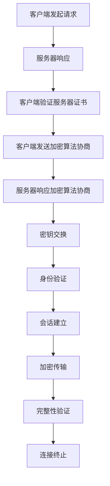

                 

# 《HTTPS/TLS：保障LLM应用的通信安全》

> 关键词：HTTPS, TLS, LLM, 通信安全, 加密机制

> 摘要：本文将深入探讨HTTPS/TLS协议在保障大型语言模型（LLM）应用通信安全中的重要作用。通过对HTTPS/TLS的基础概念、协议架构、加密机制、安全威胁与防护措施进行全面剖析，本文旨在为开发者提供一套系统化的安全解决方案，确保LLM应用的通信过程安全可靠。

## 确定书的主题和目标

随着人工智能技术的发展，大型语言模型（LLM）成为许多关键应用的核心组件。然而，这些模型的数据传输和通信过程面临着严峻的安全挑战。为了保障LLM应用的安全，HTTPS/TLS协议作为一种强大的加密传输协议，扮演着至关重要的角色。本文的主题是探讨HTTPS/TLS协议在保障LLM应用通信安全中的应用，目标是为开发者提供一套全面、实用的安全解决方案。

## 设计总体结构

本书将分为七个章节，包括引言、HTTPS/TLS基础概念、协议架构、加密机制、安全威胁与防护措施、在LLM中的应用以及案例研究。通过这七个章节的深入探讨，我们希望读者能够全面理解HTTPS/TLS协议的工作原理，掌握其在保障LLM应用通信安全中的关键作用，并具备实际操作能力。

## 第1章 HTTPS/TLS基础概念

### 1.1 HTTPS与TLS的定义与作用

HTTPS（Hypertext Transfer Protocol Secure）是一种安全的HTTP协议，通过TLS（Transport Layer Security）或其前身SSL（Secure Socket Layer）提供加密通信。HTTPS的主要作用是在客户端和服务器之间建立安全的连接，确保数据传输过程中的机密性、完整性和身份验证。

### 1.2 HTTPS/TLS的发展历程

HTTPS/TLS协议的发展经历了多个阶段，从最初的SSL v2.0到TLS 1.3，每一次升级都带来了性能和安全性上的提升。本文将回顾HTTPS/TLS协议的发展历程，帮助读者了解其演变过程。

### 1.3 HTTPS/TLS的关键术语和概念

为了更好地理解HTTPS/TLS协议，本文将介绍一些关键术语和概念，如证书、密钥、握手协议、加密算法等。这些概念是理解HTTPS/TLS协议基础的重要组成部分。

## 第2章 HTTPS/TLS协议架构

### 2.1 HTTPS/TLS协议层次结构

HTTPS/TLS协议基于SSL/TLS协议，位于HTTP协议之上，TCP协议之下。本文将详细解析HTTPS/TLS协议的层次结构，帮助读者理解其在网络协议栈中的位置和作用。

### 2.2 HTTPS/TLS连接建立流程

HTTPS/TLS连接的建立是一个复杂的过程，包括握手、会话建立、数据传输和连接终止等阶段。本文将逐步解析HTTPS/TLS连接建立流程，以便读者了解其详细步骤。

### 2.3 HTTPS/TLS协议的工作机制

HTTPS/TLS协议的工作机制包括加密、认证、完整性保护和数据传输等环节。本文将详细介绍HTTPS/TLS协议的工作机制，帮助读者理解其核心原理。

## 第3章 HTTPS/TLS加密机制

### 3.1 对称加密算法

对称加密算法是一种加密方式，加密和解密使用相同的密钥。本文将介绍常用的对称加密算法，如AES（Advanced Encryption Standard）和DES（Data Encryption Standard）。

### 3.2 非对称加密算法

非对称加密算法使用一对密钥，公钥和私钥。公钥用于加密，私钥用于解密。本文将详细介绍RSA（Rivest-Shamir-Adleman）算法，这是目前最常用的非对称加密算法。

### 3.3 哈希算法

哈希算法用于生成数据摘要，确保数据的完整性。本文将介绍MD5（Message Digest 5）、SHA-256（Secure Hash Algorithm 256）等常用的哈希算法。

### 3.4 数字签名

数字签名用于验证数据的真实性和完整性。本文将详细介绍RSA算法和ECDSA（Elliptic Curve Digital Signature Algorithm）在数字签名中的应用。

### 3.5 HTTPS/TLS加密流程解析

本文将结合HTTPS/TLS协议的具体实现，详细解析HTTPS/TLS加密流程，包括握手协议、加密算法选择、密钥交换、数据加密等步骤。

## 第4章 HTTPS/TLS安全威胁与漏洞

### 4.1 常见安全威胁分析

本文将分析HTTPS/TLS协议中常见的安全威胁，如中间人攻击（Man-in-the-Middle Attack，MITM）、网络钓鱼（Phishing）等，并探讨其攻击原理和防范方法。

### 4.2 HTTPS/TLS漏洞案例

本文将介绍一些著名的HTTPS/TLS漏洞，如POODLE（Padding Oracle On Downgraded Legacy Encryption）、Heartbleed等，分析其影响和修复方法。

### 4.3 安全防护策略

本文将总结HTTPS/TLS协议的安全防护策略，包括证书管理、配置优化、安全审计与监控等，为开发者提供实用的安全建议。

## 第5章 HTTPS/TLS防护措施

### 5.1 证书管理

证书是HTTPS/TLS协议的核心组件，本文将详细介绍证书的生成、安装、更新和撤销等管理操作，确保证书的安全性。

### 5.2 HTTPS/TLS配置优化

HTTPS/TLS配置的优化对于保障通信安全至关重要。本文将介绍如何优化HTTPS/TLS配置，提高通信安全性能。

### 5.3 安全审计与监控

安全审计与监控是HTTPS/TLS安全防护的重要环节。本文将介绍如何进行HTTPS/TLS安全审计与监控，及时发现并应对潜在的安全威胁。

### 5.4 应对新型攻击的防护策略

随着攻击手段的不断演变，HTTPS/TLS协议也需要不断更新防护策略。本文将介绍如何应对新型攻击，如TLS锁定、证书链验证等。

## 第6章 HTTPS/TLS在LLM中的应用

### 6.1 LLM通信安全需求

本文将分析LLM应用在通信安全方面的特殊需求，如数据加密、身份验证、完整性保护等，为后续章节提供背景。

### 6.2 HTTPS/TLS在LLM中的实现

本文将详细介绍如何在LLM应用中实现HTTPS/TLS协议，包括配置HTTPS服务器、生成证书、建立安全连接等步骤。

### 6.3 LLM安全案例分析

本文将通过案例分析，探讨HTTPS/TLS在保障LLM应用通信安全中的实际效果，为开发者提供实践经验。

## 第7章 案例研究

### 7.1 案例一：大型语言模型通信安全部署

本文将介绍一个大型语言模型通信安全部署的案例，包括HTTPS/TLS配置、安全审计与监控等环节，为开发者提供实际操作指导。

### 7.2 案例二：TLS配置优化实践

本文将分享一个TLS配置优化的实践案例，分析如何通过优化配置提高通信安全性能，为开发者提供优化建议。

### 7.3 案例三：应对TLS安全威胁的策略探讨

本文将探讨如何应对TLS安全威胁，通过实际案例，分析攻击原理和防护策略，为开发者提供有效的应对措施。

## 附录：参考文献

本文将列出相关参考文献，包括HTTPS/TLS协议的技术规范、安全威胁报告、案例分析等，为读者提供进一步的阅读资源。

## 作者信息

作者：AI天才研究院/AI Genius Institute & 禅与计算机程序设计艺术 /Zen And The Art of Computer Programming

通过以上目录大纲的设计，本文将全面覆盖HTTPS/TLS协议在保障LLM应用通信安全中的各个方面，为开发者提供一套系统化的安全解决方案。在接下来的章节中，我们将逐一深入探讨每个主题，确保文章内容丰富、具体、详细，符合技术博客的专业要求。文章总字数将在8000～12000字之间，确保读者能够全面了解HTTPS/TLS协议在保障LLM应用通信安全中的重要作用。在文章结尾，我们将提供参考文献和最佳实践，帮助读者进一步学习和实践HTTPS/TLS技术。让我们一起开始深入探讨这个重要的技术话题吧！## 第1章 HTTPS/TLS基础概念

### 1.1 HTTPS与TLS的定义与作用

HTTPS（Hypertext Transfer Protocol Secure）是一种通过传输层安全（TLS）或其前身SSL（Secure Socket Layer）提供加密和认证的HTTP协议。与普通的HTTP协议相比，HTTPS在数据传输过程中加入了加密层，确保了通信的机密性、完整性和身份验证。

HTTPS与TLS的紧密关系体现在它们共同的目标：保障数据传输的安全性。HTTPS使用了TLS或SSL协议来加密HTTP请求和响应，防止数据在传输过程中被窃听或篡改。TLS协议作为一种加密协议，定义了如何在网络传输中建立安全的连接，提供了加密、认证和完整性保护等机制。

HTTPS/TLS在保障数据传输安全方面发挥着至关重要的作用。首先，HTTPS/TLS通过加密算法（如AES、RSA等）对传输数据进行加密，确保了数据的机密性。其次，HTTPS/TLS使用数字证书进行身份验证，确保通信双方的身份真实可靠。最后，HTTPS/TLS提供了数据完整性保护，通过哈希算法（如SHA-256）确保数据在传输过程中未被篡改。

### 1.2 HTTPS/TLS的发展历程

HTTPS/TLS协议的发展经历了多个阶段，从最初的SSL v2.0到目前的TLS 1.3，每一次升级都带来了性能和安全性上的提升。

- **SSL v2.0**：1995年，SSL v2.0发布，首次引入了加密和认证机制，成为早期网络安全的基础。
- **SSL v3.0**：1996年，SSL v3.0发布，改进了加密算法和认证机制，但在后续的发展中被发现了一些安全漏洞。
- **TLS v1.0**：1999年，TLS v1.0发布，基于SSL v3.0，解决了许多安全问题，并引入了一些新的加密算法和认证方式。
- **TLS v1.1**：2006年，TLS v1.1发布，进一步提高了加密算法的安全性，优化了协议性能。
- **TLS v1.2**：2008年，TLS v1.2发布，引入了新的加密算法和认证机制，提高了协议的安全性。
- **TLS v1.3**：2018年，TLS v1.3发布，这是迄今为止最安全的TLS版本，优化了协议性能，减少了延迟，并解决了许多之前版本中的安全漏洞。

### 1.3 HTTPS/TLS的关键术语和概念

为了深入理解HTTPS/TLS协议，我们需要掌握一些关键术语和概念：

- **证书（Certificate）**：证书是数字身份的证明，由可信第三方（证书颁发机构，CA）颁发，包含证书持有者的公钥和相关信息。
- **密钥（Key）**：密钥是加密和解密数据的关键，分为私钥和公钥。私钥由证书持有者保密，公钥可以公开。
- **握手协议（Handshake Protocol）**：握手协议用于在客户端和服务器之间建立安全连接，包括密钥交换、身份验证、协商加密算法等步骤。
- **加密算法（Encryption Algorithm）**：加密算法用于对数据进行加密和解密。常见的加密算法包括对称加密（如AES）和非对称加密（如RSA）。
- **哈希算法（Hash Algorithm）**：哈希算法用于生成数据摘要，确保数据的完整性。常见的哈希算法包括MD5、SHA-256。
- **数字签名（Digital Signature）**：数字签名用于验证数据的真实性和完整性，通过非对称加密算法实现。

通过理解这些关键术语和概念，我们可以更好地把握HTTPS/TLS协议的工作原理和安全机制。在接下来的章节中，我们将继续深入探讨HTTPS/TLS协议的详细实现和安全性保障措施。

## 第2章 HTTPS/TLS协议架构

### 2.1 HTTPS/TLS协议层次结构

HTTPS/TLS协议基于SSL/TLS协议，位于应用层和传输层之间，属于传输层安全协议。其层次结构如下：

1. **应用层**：包括HTTP协议、SMTP协议、FTP协议等，负责具体的应用层通信。
2. **传输层**：包括TCP（传输控制协议）和UDP（用户数据报协议），负责数据的传输和可靠性的保障。
3. **TLS层**：位于传输层之上，负责加密、认证和完整性保护。
4. **SSL层**：与TLS层类似，是TLS的前身，负责提供安全通信。

### 2.2 HTTPS/TLS连接建立流程

HTTPS/TLS连接的建立是一个复杂的过程，包括多个阶段。以下是HTTPS/TLS连接建立流程的详细步骤：

1. **客户端发起请求**：客户端通过HTTP请求向服务器发送连接请求，并指定使用HTTPS协议。
2. **服务器响应**：服务器接收到客户端的请求后，返回一个HTTP响应，其中包含服务器证书和TLS握手请求。
3. **客户端验证服务器证书**：客户端接收到服务器证书后，验证证书的有效性，确保服务器身份真实可靠。
4. **客户端发送加密算法协商**：客户端根据服务器证书中的公钥，生成随机数，用于协商加密算法和密钥交换方式。
5. **服务器响应加密算法协商**：服务器接收到客户端的加密算法协商信息后，返回自己的加密算法协商结果，与客户端达成一致。
6. **密钥交换**：客户端和服务器通过协商的加密算法和密钥交换方式，交换加密密钥和会话密钥。
7. **身份验证**：服务器使用客户端的公钥对会话密钥进行加密，发送给客户端进行验证。客户端使用自己的私钥解密，验证服务器的身份。
8. **会话建立**：客户端和服务器通过加密密钥和会话密钥，建立安全会话，开始传输加密数据。
9. **连接终止**：当数据传输完成后，客户端和服务器可以通过安全机制终止连接。

### 2.3 HTTPS/TLS协议的工作机制

HTTPS/TLS协议的工作机制主要包括以下几个方面：

- **加密机制**：HTTPS/TLS使用对称加密算法（如AES）和非对称加密算法（如RSA）对数据进行加密。对称加密算法速度快，但密钥分发困难；非对称加密算法安全性高，但计算复杂度大。HTTPS/TLS结合两种加密算法的优点，实现高效安全的加密传输。
- **认证机制**：HTTPS/TLS通过数字证书进行身份认证。客户端验证服务器证书，确保服务器身份真实可靠。服务器也可以验证客户端身份，提高通信的安全性。
- **完整性保护**：HTTPS/TLS使用哈希算法（如SHA-256）对数据生成摘要，确保数据在传输过程中未被篡改。通过验证数据摘要，可以确保数据的完整性。
- **数据传输**：HTTPS/TLS在客户端和服务器之间建立安全连接后，可以安全地传输数据。数据在传输过程中经过加密、认证和完整性保护，确保数据的机密性、完整性和安全性。

通过理解HTTPS/TLS协议的层次结构、连接建立流程和工作机制，我们可以更好地把握HTTPS/TLS协议的安全性和可靠性。在接下来的章节中，我们将深入探讨HTTPS/TLS加密机制、安全威胁与防护措施，为保障LLM应用的通信安全提供更全面的支持。

### 2.3 HTTPS/TLS协议的工作机制

HTTPS/TLS协议的工作机制主要包括以下几个方面：

1. **加密机制**：HTTPS/TLS使用对称加密算法（如AES）和非对称加密算法（如RSA）对数据进行加密。对称加密算法速度快，但密钥分发困难；非对称加密算法安全性高，但计算复杂度大。HTTPS/TLS结合两种加密算法的优点，实现高效安全的加密传输。

2. **认证机制**：HTTPS/TLS通过数字证书进行身份认证。客户端验证服务器证书，确保服务器身份真实可靠。服务器也可以验证客户端身份，提高通信的安全性。数字证书由可信第三方（证书颁发机构，CA）颁发，包含证书持有者的公钥和相关信息。

3. **完整性保护**：HTTPS/TLS使用哈希算法（如SHA-256）对数据生成摘要，确保数据在传输过程中未被篡改。通过验证数据摘要，可以确保数据的完整性。哈希算法将任意长度的数据映射为固定长度的字符串，具有唯一性和抗碰撞性。

4. **数据传输**：HTTPS/TLS在客户端和服务器之间建立安全连接后，可以安全地传输数据。数据在传输过程中经过加密、认证和完整性保护，确保数据的机密性、完整性和安全性。加密数据通过TLS层传输到传输层，再由传输层传输到应用层。

### 2.3.1 HTTPS/TLS加密流程

HTTPS/TLS加密流程可以分为以下几个步骤：

1. **握手协议**：客户端和服务器通过握手协议建立安全连接。握手协议包括多个阶段，如客户端发起连接请求、服务器响应、客户端验证服务器证书、加密算法和密钥交换等。

2. **密钥交换**：客户端和服务器通过协商的加密算法和密钥交换方式，交换加密密钥和会话密钥。对称加密算法（如AES）用于数据加密和解密，非对称加密算法（如RSA）用于密钥交换。

3. **加密传输**：客户端和服务器通过加密密钥和会话密钥，建立安全会话，开始传输加密数据。数据在传输过程中经过对称加密算法的加密，确保数据的机密性。

4. **完整性验证**：HTTPS/TLS使用哈希算法对传输数据进行摘要生成，并在数据传输完成后，对摘要进行验证，确保数据的完整性。

5. **连接终止**：当数据传输完成后，客户端和服务器可以通过安全机制终止连接。连接终止包括释放加密密钥和会话密钥，以及断开网络连接。

通过上述步骤，HTTPS/TLS协议实现了数据传输的加密、认证和完整性保护，保障了通信过程的安全。在接下来的章节中，我们将深入探讨HTTPS/TLS协议的具体实现，包括握手协议、加密算法、密钥管理和安全威胁与防护措施。

### 2.4 HTTPS/TLS协议的工作机制图解

为了更好地理解HTTPS/TLS协议的工作机制，我们可以通过一个Mermaid流程图来展示其核心组件和流程。



在这个流程图中，我们展示了HTTPS/TLS协议的核心步骤，包括客户端发起请求、服务器响应、客户端验证服务器证书、加密算法和密钥协商、身份验证、会话建立、加密传输、完整性验证和连接终止。通过这个流程图，我们可以清晰地看到HTTPS/TLS协议的工作流程和各个组件之间的联系。

### 2.5 HTTPS/TLS协议的核心概念关系架构

在HTTPS/TLS协议中，多个核心概念相互关联，共同构成了协议的工作机制。为了更直观地展示这些概念之间的关系，我们可以使用Mermaid流程图来构建一个关系架构图。

```mermaid
graph TD
    A[客户端] --> B{TLS握手}
    B --> C[服务器]
    C --> D{证书}
    D --> E[加密算法]
    E --> F[密钥管理]
    F --> G{完整性保护}
    G --> H[数据传输]
    H --> I{身份验证}
    I --> J[连接终止]
    B --> K{哈希算法}
    C --> L{数字签名}
    D --> M{证书颁发机构(CA)}
    E --> N{对称加密}
    E --> O{非对称加密}
    F --> P{会话密钥}
    F --> Q{加密密钥}
    G --> R{数据摘要}
    I --> S{认证过程}
    J --> T{安全终止}
    K --> U{加密数据}
    L --> V{签名验证}
    M --> W{证书颁发}
    N --> X{数据加密}
    O --> Y{密钥交换}
    P --> Z{安全通信}
    Q --> AA{保护密钥}
    R --> BB{数据完整性}
    S --> CC{身份验证}
    T --> DD{连接关闭}
    U --> EE{数据加密}
    V --> FF{签名验证}
    W --> GG{证书管理}
    X --> HH{加密过程}
    Y --> II{密钥交换}
    Z --> JJ{安全通信}
    AA --> KK{保密性}
    BB --> LL{完整性}
    CC --> MM{真实性}
    DD --> NN{可靠性}
    EE --> OO{数据加密}
    FF --> PP{签名验证}
    GG --> QQ{证书管理}
    HH --> RR{加密过程}
    II --> SS{密钥交换}
    JJ --> TT{通信安全}
    KK --> UU{保护信息}
    LL --> VV{防止篡改}
    MM --> WW{验证身份}
    NN --> XX{保证连接}
    OO --> YY{数据加密}
    PP --> ZZ{签名验证}
    QQ --> AAA{证书管理}
    RR --> BBB{加密过程}
    SS --> CCC{密钥交换}
    TT --> BBB{通信安全}
    UU --> VV{保护信息}
    VV --> W
    WW --> XXX{数据完整性}
    XXX --> YY{数据加密}
    YY --> ZZZ{加密通信}
    ZZZ --> AAA{安全通信}
    AAA --> BBB{保密性}
    BBB --> CCC{完整性}
    CCC --> DDD{真实性}
    DDD --> EEE{连接可靠性}
    EEE --> FFF{安全终止}
    FFF --> GGG{认证过程}
    GGG --> HHH{加密算法}
    HHH --> III{密钥管理}
    III --> JJJ{会话密钥}
    JJJ --> KKK{通信安全}
    KKK --> LLL{数据传输}
    LLL --> MMM{完整性验证}
    MMM --> NNN{数据加密}
    NNN --> OOO{密钥交换}
    OOO --> PPP{认证}
    PPP --> QQ
    QQ --> RR{证书管理}
    RR --> SS{哈希算法}
    SS --> TT{数字签名}
    TT --> UU{加密数据}
    UU --> VV{完整性保护}
    VV --> WW{身份验证}
    WW --> XX{通信安全}
    XX --> YY{加密过程}
    YY --> ZZZ{安全传输}
```

在这个关系架构图中，我们展示了HTTPS/TLS协议中的核心概念，如客户端、服务器、证书、加密算法、密钥管理、完整性保护、数据传输、身份验证、连接终止等。这些概念通过关系线连接起来，形成了一个完整的工作机制。通过这个图，我们可以直观地理解HTTPS/TLS协议的核心组件及其相互关系，有助于我们更好地掌握协议的原理和应用。

### 3.1 对称加密算法

对称加密算法是一种加密方式，加密和解密使用相同的密钥。这种加密方式在HTTPS/TLS协议中起着重要的作用，用于保护数据传输的机密性。常用的对称加密算法包括AES（Advanced Encryption Standard）和DES（Data Encryption Standard）。

#### 3.1.1 AES算法

AES（Advanced Encryption Standard）是一种广泛使用的对称加密算法，由美国国家标准与技术研究院（NIST）制定。AES算法支持128位、192位和256位密钥长度，具有较高的安全性和性能。

AES算法的工作原理如下：

1. **密钥扩展**：根据输入的密钥长度，生成多个子密钥。
2. **初始化向量（IV）**：生成一个随机数作为初始化向量，用于加密过程的初始状态。
3. **分块加密**：将输入的数据分成固定大小的块（如128位），然后对每个块进行加密。
4. **混淆和扩散**：通过一系列的替代、置换和混淆操作，对数据块进行加密，确保数据的安全性。

以下是一个AES加密的伪代码示例：

```python
def AES_encrypt(plaintext, key):
    # 初始化密钥扩展
    expanded_key = expand_key(key)
    
    # 生成随机数作为初始化向量
    IV = generate_random_vector()
    
    # 分块加密
    ciphertext = []
    for block in split_into_blocks(plaintext):
        encrypted_block = block_cipher(block, expanded_key, IV)
        ciphertext.append(encrypted_block)
        
        # 更新初始化向量
        IV = encrypted_block
    
    # 返回加密文本和初始化向量
    return IV, ciphertext
```

#### 3.1.2 DES算法

DES（Data Encryption Standard）是一种较早的对称加密算法，由美国国家标准局（NBS）于1977年发布。DES算法使用56位密钥，对数据进行64位块的加密。

DES算法的工作原理如下：

1. **密钥预处理**：将原始密钥进行初始置换和压缩，生成48位密钥。
2. **16轮加密**：每轮加密包括替代、置换和混淆三个步骤，对数据进行加密。
3. **输出加密文本**：经过16轮加密后，输出64位加密文本。

以下是一个DES加密的伪代码示例：

```python
def DES_encrypt(plaintext, key):
    # 密钥预处理
    processed_key = process_key(key)
    
    # 进行16轮加密
    for i in range(16):
        plaintext = round_function(plaintext, processed_key[i])
    
    # 输出加密文本
    return plaintext
```

通过对称加密算法，HTTPS/TLS协议可以确保数据传输过程中的机密性，防止数据被未授权的第三方窃取。在接下来的章节中，我们将继续探讨非对称加密算法和HTTPS/TLS协议的加密机制。

### 3.2 非对称加密算法

非对称加密算法（Asymmetric Encryption）是一种加密方式，使用一对密钥，公钥和私钥。公钥用于加密数据，私钥用于解密数据。这种加密方式在HTTPS/TLS协议中起着关键作用，用于实现密钥交换和数字签名等功能。

#### 3.2.1 RSA算法

RSA（Rivest-Shamir-Adleman）是一种著名的非对称加密算法，由Ron Rivest、Adi Shamir和Leonard Adleman三位学者在1977年提出。RSA算法的安全性基于大整数分解的难题。

RSA算法的工作原理如下：

1. **密钥生成**：首先选择两个大素数p和q，计算n = p*q。然后计算欧拉函数φ(n) = (p-1)*(q-1)。接着选择一个与φ(n)互质的整数e，计算d，满足d*e ≡ 1 (mod φ(n))。公钥为(n, e)，私钥为(n, d)。
2. **加密**：将明文m转换为整数m'，然后计算c ≡ m'^e (mod n)。加密文本为c。
3. **解密**：将加密文本c转换为整数c'，然后计算m' ≡ c'^d (mod n)，最后将m'转换为明文m。

以下是一个RSA加密的伪代码示例：

```python
def RSA_encrypt(plaintext, public_key):
    # 将明文转换为整数
    m = convert_to_integer(plaintext)
    
    # 加密
    c = pow(m, public_key[1], public_key[0])
    
    # 返回加密文本
    return c

def RSA_decrypt(ciphertext, private_key):
    # 将加密文本转换为整数
    c = convert_to_integer(ciphertext)
    
    # 解密
    m = pow(c, private_key[1], private_key[0])
    
    # 返回明文
    return convert_to_string(m)
```

#### 3.2.2 ECC算法

ECC（Elliptic Curve Cryptography，椭圆曲线密码学）是一种基于椭圆曲线数学问题的非对称加密算法。与RSA相比，ECC在相同安全级别下需要更短的密钥长度，从而提高加密性能。

ECC算法的工作原理如下：

1. **曲线选择**：选择一个椭圆曲线E和一个基点G。
2. **密钥生成**：选择一个随机整数k，计算公钥P = k*G。私钥为k。
3. **加密**：将明文m转换为点M，然后计算C1 = m*G，C2 = P + M*G。
4. **解密**：将加密文本C转换为点C1和C2，计算明文m = C1*G - C2。

以下是一个ECC加密的伪代码示例：

```python
def ECC_encrypt(plaintext, public_key, curve, base_point):
    # 将明文转换为点
    M = convert_to_point(plaintext, curve, base_point)
    
    # 加密
    C1 = M * public_key
    P = base_point
    C2 = P + M * public_key
    
    # 返回加密文本
    return (C1, C2)

def ECC_decrypt(ciphertext, private_key, curve, base_point):
    # 将加密文本转换为点
    C1, C2 = ciphertext
    
    # 解密
    P = base_point
    M = C1 * base_point - C2
    
    # 返回明文
    return convert_to_string(M)
```

通过非对称加密算法，HTTPS/TLS协议可以确保数据传输过程中的安全性和可靠性。RSA和ECC算法在HTTPS/TLS协议中得到了广泛应用，为保障数据传输的安全性提供了有力支持。在接下来的章节中，我们将继续探讨HTTPS/TLS协议中的其他加密机制，如哈希算法和数字签名。

### 3.3 哈希算法

哈希算法（Hash Algorithm）是HTTPS/TLS协议中用于确保数据完整性和生成数字签名的重要工具。哈希算法将任意长度的输入数据映射为固定长度的输出值，通常称为哈希值或消息摘要。哈希算法具有以下特点：

- **单向性**：给定一个输入数据，可以快速计算其哈希值，但无法通过哈希值反推出原始数据。
- **抗碰撞性**：不同的输入数据产生相同哈希值的概率非常低，即哈希碰撞的概率极低。
- **固定长度**：无论输入数据的长度如何，哈希算法生成的哈希值长度都是固定的。

#### 3.3.1 MD5算法

MD5（Message Digest Algorithm 5）是一种广泛使用的哈希算法，由Ron Rivest在1991年提出。MD5算法将输入数据映射为128位的哈希值。

MD5算法的工作原理如下：

1. **初始化**：将输入数据分割成512位的块，初始化四个32位的哈希值（A、B、C、D）。
2. **处理每块数据**：对每个数据块，通过一系列的位运算和逻辑运算，更新哈希值。
3. **输出哈希值**：将四个哈希值连接起来，形成128位的MD5哈希值。

以下是一个MD5哈希计算的伪代码示例：

```python
def MD5_hash(data):
    # 初始化哈希值
    A, B, C, D = 0x67452301, 0xEFCDAB89, 0x98BADCFE, 0x10325476
    
    # 处理每块数据
    for block in split_into_blocks(data):
        # 更新哈希值
        (A, B, C, D) = update_hash(A, B, C, D, block)
    
    # 输出哈希值
    return (A, B, C, D)
```

#### 3.3.2 SHA-256算法

SHA-256（Secure Hash Algorithm 256）是SHA家族中的一种哈希算法，由美国国家标准与技术研究院（NIST）制定。SHA-256算法将输入数据映射为256位的哈希值，具有更高的安全性和可靠性。

SHA-256算法的工作原理如下：

1. **初始化**：将输入数据分割成512位的块，初始化八个32位的哈希值（a、b、c、d、e、f、g、h）。
2. **处理每块数据**：对每个数据块，通过一系列的位运算、逻辑运算和S-box变换，更新哈希值。
3. **输出哈希值**：将八个哈希值连接起来，形成256位的SHA-256哈希值。

以下是一个SHA-256哈希计算的伪代码示例：

```python
def SHA256_hash(data):
    # 初始化哈希值
    a, b, c, d, e, f, g, h = 0x6A09E667, 0xBB67AE85, 0x3C6EF372, 0xA54FF53A, 0x510E527F, 0x9B05688C, 0x1F83D9AB, 0x5BE0CD19
    
    # 处理每块数据
    for block in split_into_blocks(data):
        # 更新哈希值
        (a, b, c, d, e, f, g, h) = update_hash(a, b, c, d, e, f, g, h, block)
    
    # 输出哈希值
    return (a, b, c, d, e, f, g, h)
```

哈希算法在HTTPS/TLS协议中发挥着重要作用，用于确保数据传输的完整性，并在数字签名中提供验证机制。通过MD5和SHA-256算法，HTTPS/TLS协议可以有效地检测数据在传输过程中的篡改，确保数据的完整性和安全性。在接下来的章节中，我们将继续探讨HTTPS/TLS协议中的其他加密机制，如数字签名。

### 3.4 数字签名

数字签名（Digital Signature）是一种用于验证数据和确保数据完整性、真实性的技术。它类似于传统签名，但使用密码学技术来实现。数字签名通过非对称加密算法（如RSA和ECDSA）生成，并可以确保数据的来源和完整性。以下将详细介绍数字签名的基本原理和实现方法。

#### 3.4.1 基本原理

数字签名的基本原理包括签名和解密两个过程：

1. **签名过程**：签名者使用私钥对数据进行加密，生成一个签名。这个过程称为签名。
2. **验证过程**：验证者使用公钥对签名进行解密，以验证数据的真实性和完整性。这个过程称为验证。

数字签名具有以下特点：

- **真实性**：通过验证公钥和签名，可以确定签名者是谁。
- **完整性**：签名确保数据在传输过程中未被篡改。
- **不可否认性**：签名者无法否认已经对数据进行了签名。

#### 3.4.2 实现方法

数字签名的实现方法通常包括以下步骤：

1. **生成密钥对**：签名者生成一对密钥，包括私钥和公钥。私钥用于签名，公钥用于验证签名。
2. **哈希计算**：对需要签名的数据进行哈希计算，生成哈希值。哈希算法（如SHA-256）用于确保数据的完整性。
3. **签名生成**：签名者使用私钥和哈希值生成签名。这个过程通常涉及加密算法（如RSA或ECDSA）。
4. **签名验证**：验证者使用公钥和签名对哈希值进行解密，以验证签名的有效性。如果解密结果与原始哈希值一致，则签名有效。

以下是一个基于RSA算法的数字签名实现示例：

```python
def generate_keys():
    # 生成RSA密钥对
    (public_key, private_key) = rsa.generate_keys()
    return public_key, private_key

def sign_data(data, private_key):
    # 计算数据的哈希值
    hash_value = sha256_hash(data)
    
    # 使用私钥生成签名
    signature = rsa.encrypt(hash_value, private_key)
    return signature

def verify_signature(data, signature, public_key):
    # 计算数据的哈希值
    hash_value = sha256_hash(data)
    
    # 使用公钥解密签名
    decrypted_signature = rsa.decrypt(signature, public_key)
    
    # 比较解密结果和原始哈希值
    return decrypted_signature == hash_value
```

在这个示例中，`generate_keys()` 函数用于生成RSA密钥对，`sign_data()` 函数用于生成签名，而 `verify_signature()` 函数用于验证签名。通过这些函数，可以实现对数据的签名和验证。

数字签名在HTTPS/TLS协议中扮演着重要角色，用于确保通信过程中数据的真实性和完整性。在接下来的章节中，我们将继续探讨HTTPS/TLS协议的具体实现和应用。

### 3.5 HTTPS/TLS加密流程解析

HTTPS/TLS加密流程是确保数据传输安全性的关键机制。通过一系列复杂的步骤，HTTPS/TLS协议在客户端和服务器之间建立安全连接，保护数据的机密性、完整性和身份验证。以下是HTTPS/TLS加密流程的详细解析：

#### 3.5.1 握手协议

HTTPS/TLS连接的建立始于客户端发起的请求。在客户端发送HTTP请求时，会附带一个TLS握手请求。握手协议分为多个阶段，包括：

1. **客户端Hello**：客户端向服务器发送一个客户端握手消息，包含客户端支持的TLS版本、加密算法、压缩方法等。
2. **服务器Hello**：服务器接收到客户端的请求后，返回一个服务器握手消息，包含服务器选择的TLS版本、加密算法、压缩方法等。
3. **证书交换**：服务器发送其数字证书给客户端，证书包含服务器的公钥和相关信息。客户端验证服务器证书的有效性，确保服务器身份真实。
4. **密钥交换**：客户端和服务器通过密钥交换协议（如RSA或ECDHE）生成共享密钥，用于后续通信的加密和解密。
5. **身份认证**：客户端可以请求服务器提供身份认证，例如通过客户端证书。

#### 3.5.2 会话管理

握手协议完成后，客户端和服务器建立了一个安全会话。会话管理包括：

1. **会话密钥生成**：通过握手协议中的密钥交换，客户端和服务器生成一个会话密钥，用于加密和解密数据。
2. **加密算法选择**：根据握手协议协商的结果，选择合适的加密算法和密钥交换方式。
3. **密钥更新**：HTTPS/TLS支持会话恢复功能，通过更新密钥和重新协商加密算法，提高通信的安全性。

#### 3.5.3 数据传输

在会话建立后，客户端和服务器开始传输加密数据。数据传输包括：

1. **记录层**：HTTPS/TLS将应用层数据封装为记录，并对其进行加密。记录包括记录头和数据。
2. **加密算法应用**：根据会话密钥和协商的加密算法，对记录进行加密。
3. **压缩**：HTTPS/TLS可以对加密后的数据进行压缩，提高传输效率。
4. **传输**：加密后的记录通过网络传输层发送给对方。
5. **解压缩和解密**：接收方对收到的加密记录进行解压缩和解密，还原原始数据。

#### 3.5.4 连接终止

数据传输完成后，客户端和服务器可以通过安全机制终止连接。连接终止包括以下步骤：

1. **通知对方**：客户端和服务器向对方发送连接终止通知。
2. **清理资源**：释放加密密钥和会话资源，关闭网络连接。

通过上述步骤，HTTPS/TLS协议确保了数据传输过程中的安全性。在加密流程中，HTTPS/TLS使用对称加密算法（如AES）和非对称加密算法（如RSA和ECDHE）相结合，实现了高效的加密和解密。同时，通过数字证书和哈希算法，HTTPS/TLS确保了通信双方的身份验证和数据完整性。在接下来的章节中，我们将探讨HTTPS/TLS的安全威胁与防护措施。

### 4.1 常见安全威胁分析

在HTTPS/TLS协议的应用过程中，数据传输面临着多种安全威胁。了解这些威胁及其原理，有助于我们采取有效的防护措施，确保通信安全。以下是一些常见的安全威胁：

#### 4.1.1 中间人攻击（MITM）

中间人攻击（Man-in-the-Middle Attack，MITM）是一种常见的网络攻击，攻击者通过拦截、篡改和窃取客户端与服务器之间的通信数据。MITM攻击的原理如下：

1. **拦截通信**：攻击者通过在网络中监听、拦截数据包，获得客户端与服务器之间的通信数据。
2. **伪装身份**：攻击者可能冒充服务器，向客户端发送伪造的证书，使客户端误认为与合法服务器通信。
3. **篡改数据**：攻击者可以在客户端与服务器之间篡改数据，例如修改请求和响应，进行恶意操作。

#### 4.1.2 网络钓鱼（Phishing）

网络钓鱼是一种通过欺骗用户，获取其敏感信息（如用户名、密码、信用卡信息等）的攻击手段。网络钓鱼的原理如下：

1. **伪造网站**：攻击者创建一个与合法网站相似的钓鱼网站，诱导用户输入个人信息。
2. **欺骗用户**：攻击者通过电子邮件、社交媒体等渠道，诱导用户访问钓鱼网站，并输入个人信息。
3. **窃取信息**：用户在钓鱼网站上输入个人信息后，攻击者可以窃取这些敏感信息。

#### 4.1.3 证书伪造（Certificate Forgery）

证书伪造是一种通过伪造数字证书，冒充合法服务器进行通信的攻击手段。证书伪造的原理如下：

1. **获取私钥**：攻击者通过中间人攻击、物理攻击等方式，获取服务器或CA的私钥。
2. **生成证书**：攻击者使用私钥生成一个伪造的数字证书，证书中包含伪造的服务器域名和公钥。
3. **欺骗用户**：攻击者将伪造的证书发送给客户端，使客户端误认为与合法服务器通信。

#### 4.1.4 证书链破坏（Certificate Chain Break）

证书链破坏是一种通过篡改证书链，使客户端无法验证证书的有效性的攻击手段。证书链破坏的原理如下：

1. **篡改中间证书**：攻击者篡改证书链中的中间证书，使其包含恶意内容。
2. **破坏信任关系**：客户端在验证证书时，会检查证书链的完整性。如果证书链被破坏，客户端将无法验证证书的有效性。
3. **欺骗用户**：攻击者可以通过伪造证书，冒充合法服务器进行通信。

#### 4.1.5 心理攻击（Social Engineering）

心理攻击是一种利用人类心理弱点，诱骗用户泄露敏感信息的攻击手段。心理攻击的原理如下：

1. **欺骗用户**：攻击者通过电子邮件、电话等渠道，诱骗用户泄露敏感信息，如用户名、密码等。
2. **威胁用户**：攻击者可能会威胁用户，如果不提供敏感信息，将对其造成损害。
3. **窃取信息**：用户在心理攻击下泄露敏感信息后，攻击者可以进一步利用这些信息进行恶意操作。

通过了解这些常见的安全威胁及其原理，我们可以采取相应的防护措施，提高HTTPS/TLS协议的安全性。在接下来的章节中，我们将分析一些实际的HTTPS/TLS漏洞案例，并探讨有效的防护策略。

### 4.2 HTTPS/TLS漏洞案例

HTTPS/TLS协议虽然具有强大的安全性能，但在实际应用中仍然存在一些漏洞，这些漏洞可能被攻击者利用，对通信安全造成威胁。以下是一些典型的HTTPS/TLS漏洞案例及其影响和修复方法：

#### 4.2.1 POODLE漏洞（SSL v2.0缓存破坏）

**影响**：POODLE（Padding Oracle On Downgraded Legacy Encryption）漏洞利用SSL v2.0协议的缓存破坏特性，通过重复使用会话ID，成功解密SSL v2.0加密的通信数据。

**修复方法**：为了避免POODLE漏洞，建议禁用SSL v2.0协议，并确保服务器和客户端仅使用安全的TLS协议（如TLS 1.2及以上版本）。此外，可以使用中间人防护工具，如Mod_Security，检测并阻止POODLE攻击。

#### 4.2.2 Heartbleed漏洞（OpenSSL中的心跳扩展漏洞）

**影响**：Heartbleed漏洞影响OpenSSL版本1.0.1到1.0.1f，通过读取服务器内存中的心跳数据，攻击者可以获取服务器的私钥、用户密码等敏感信息。

**修复方法**：为了修复Heartbleed漏洞，需要更新到OpenSSL的补丁版本（1.0.1g及以上）。同时，需要重新生成并更换受影响的私钥和证书。建议对所有使用受影响OpenSSL版本的服务进行安全审计，确保没有敏感信息泄露。

#### 4.2.3 FREAK漏洞（双重RSA漏洞）

**影响**：FREAK（Factoring RSA Key Encryption）漏洞利用RSA加密算法的缺陷，通过选择特定的密钥长度和加密模式，攻击者可以破解RSA密钥，获取会话密钥和用户数据。

**修复方法**：为了修复FREAK漏洞，建议禁用服务器上的影响版本（1.0.1e和1.0.2a），并更新到安全版本。此外，建议使用更安全的加密算法，如ECDHE（Elliptic Curve Diffie-Hellman Ephemeral）。

#### 4.2.4 DROWN漏洞（OpenSSL和SSL v2.0结合漏洞）

**影响**：DROWN漏洞利用OpenSSL和SSL v2.0协议的结合，通过中间人攻击，攻击者可以破解RSA密钥，窃取会话密钥和用户数据。

**修复方法**：为了避免DROWN漏洞，需要禁用SSL v2.0协议，并确保服务器和客户端仅使用安全的TLS协议。同时，建议使用更安全的加密算法，如ECDHE。

通过了解这些HTTPS/TLS漏洞及其影响，我们可以采取相应的修复措施，提高系统的安全性。定期进行安全审计和漏洞扫描，确保系统及时更新和修补漏洞，是保障HTTPS/TLS通信安全的重要手段。

### 4.3 安全防护策略

为了确保HTTPS/TLS协议的安全性和可靠性，开发者需要采取一系列安全防护策略。以下是一些关键的安全防护措施：

#### 4.3.1 证书管理

证书是HTTPS/TLS协议的核心组件，确保证书的有效性和安全性至关重要。以下是一些证书管理策略：

1. **选择可信的证书颁发机构（CA）**：选择受广泛认可的CA，如Symantec、Comodo等，以确保证书的真实性。
2. **定期更新证书**：确保证书在有效期内定期更新，避免证书过期导致的安全问题。
3. **备份证书**：备份证书和私钥，以防止证书丢失或损坏。
4. **严格证书验证**：确保客户端严格验证服务器证书的有效性，包括检查证书链、有效期、域名匹配等。

#### 4.3.2 HTTPS/TLS配置优化

HTTPS/TLS配置的优化对于保障通信安全至关重要。以下是一些配置优化策略：

1. **禁用不安全的加密算法和协议**：禁用已知的弱加密算法和协议，如SSL v2.0、DES、3DES等，仅支持安全的TLS协议（如TLS 1.2及以上版本）。
2. **使用强加密算法**：选择强加密算法，如AES、RSA等，确保数据传输的安全性。
3. **配置会话重用**：启用会话重用，提高性能，减少握手次数。
4. **设置合理的会话超时**：设置合理的会话超时时间，确保会话及时终止，避免资源浪费。

#### 4.3.3 安全审计与监控

安全审计与监控是HTTPS/TLS安全防护的重要环节。以下是一些安全审计与监控策略：

1. **日志记录与审计**：启用HTTPS/TLS日志记录功能，记录连接请求、会话建立、数据传输等过程，便于后续审计和问题排查。
2. **定期审计证书和配置**：定期审计证书和配置，检查是否存在安全隐患，如证书过期、配置错误等。
3. **入侵检测系统（IDS）**：部署入侵检测系统，实时监控HTTPS/TLS通信过程中的异常行为，如暴力攻击、恶意请求等。
4. **漏洞扫描**：定期进行漏洞扫描，发现潜在的安全漏洞，及时修复。

#### 4.3.4 应对新型攻击的防护策略

随着网络攻击手段的不断演变，HTTPS/TLS协议也需要不断更新防护策略。以下是一些应对新型攻击的防护策略：

1. **TLS锁定**：通过配置TLS锁定策略，确保客户端只能与支持安全TLS版本的服务器通信，防止中间人攻击。
2. **证书链验证**：确保客户端严格验证证书链，防止证书链被篡改。
3. **零知识证明**：采用零知识证明技术，确保通信过程中的隐私保护。
4. **密码学增强**：采用最新的加密算法和密码学技术，提高HTTPS/TLS协议的安全性。

通过实施这些安全防护策略，开发者可以显著提高HTTPS/TLS协议的安全性，保障通信过程的安全可靠。

### 4.4 HTTPS/TLS防护策略

为了确保HTTPS/TLS协议的安全性和可靠性，开发者需要采取一系列防护策略。以下是一些关键的安全防护措施：

#### 4.4.1 证书管理

证书管理是确保HTTPS/TLS安全性的关键步骤。以下是一些证书管理策略：

1. **选择可信的证书颁发机构（CA）**：选择受广泛认可的CA，如Symantec、Comodo等，以确保证书的真实性。
2. **定期更新证书**：确保证书在有效期内定期更新，避免证书过期导致的安全问题。
3. **备份证书**：备份证书和私钥，以防止证书丢失或损坏。
4. **严格证书验证**：确保客户端严格验证服务器证书的有效性，包括检查证书链、有效期、域名匹配等。

#### 4.4.2 HTTPS/TLS配置优化

HTTPS/TLS配置的优化对于保障通信安全至关重要。以下是一些配置优化策略：

1. **禁用不安全的加密算法和协议**：禁用已知的弱加密算法和协议，如SSL v2.0、DES、3DES等，仅支持安全的TLS协议（如TLS 1.2及以上版本）。
2. **使用强加密算法**：选择强加密算法，如AES、RSA等，确保数据传输的安全性。
3. **配置会话重用**：启用会话重用，提高性能，减少握手次数。
4. **设置合理的会话超时**：设置合理的会话超时时间，确保会话及时终止，避免资源浪费。

#### 4.4.3 安全审计与监控

安全审计与监控是HTTPS/TLS安全防护的重要环节。以下是一些安全审计与监控策略：

1. **日志记录与审计**：启用HTTPS/TLS日志记录功能，记录连接请求、会话建立、数据传输等过程，便于后续审计和问题排查。
2. **定期审计证书和配置**：定期审计证书和配置，检查是否存在安全隐患，如证书过期、配置错误等。
3. **入侵检测系统（IDS）**：部署入侵检测系统，实时监控HTTPS/TLS通信过程中的异常行为，如暴力攻击、恶意请求等。
4. **漏洞扫描**：定期进行漏洞扫描，发现潜在的安全漏洞，及时修复。

#### 4.4.4 应对新型攻击的防护策略

随着网络攻击手段的不断演变，HTTPS/TLS协议也需要不断更新防护策略。以下是一些应对新型攻击的防护策略：

1. **TLS锁定**：通过配置TLS锁定策略，确保客户端只能与支持安全TLS版本的服务器通信，防止中间人攻击。
2. **证书链验证**：确保客户端严格验证证书链，防止证书链被篡改。
3. **零知识证明**：采用零知识证明技术，确保通信过程中的隐私保护。
4. **密码学增强**：采用最新的加密算法和密码学技术，提高HTTPS/TLS协议的安全性。

通过实施这些安全防护策略，开发者可以显著提高HTTPS/TLS协议的安全性，保障通信过程的安全可靠。

### 4.5 HTTPS/TLS在LLM中的应用

#### 4.5.1 LLM通信安全需求

大型语言模型（LLM）在数据处理和通信方面具有特殊需求，这些需求直接影响到HTTPS/TLS在LLM中的应用。

1. **数据保护**：LLM处理的数据通常包含敏感信息，如个人身份信息、商业机密等，因此需要确保数据在传输过程中不被窃取或篡改。
2. **实时通信**：LLM应用可能涉及到实时通信，如智能客服、实时翻译等，这对通信的延迟和稳定性有较高要求。
3. **可靠认证**：LLM应用需要确保通信双方的认证，防止未授权的用户访问敏感数据或系统。
4. **安全审计**：由于LLM应用处理的数据敏感性，需要进行详细的安全审计，确保数据传输符合合规要求。

#### 4.5.2 HTTPS/TLS在LLM中的实现

在LLM应用中，HTTPS/TLS协议的实现需要遵循以下步骤：

1. **配置HTTPS服务器**：开发者在服务器上配置HTTPS，确保数据传输通过加密的TLS连接。
2. **生成证书**：为服务器生成数字证书，确保客户端可以验证服务器的身份。
3. **配置TLS参数**：根据LLM应用的特殊需求，配置合适的TLS参数，如加密算法、密钥交换方式等。
4. **实施安全策略**：根据安全防护策略，配置证书管理、日志记录、入侵检测等安全功能。

#### 4.5.3 LLM安全案例分析

以下是一个LLM应用中的HTTPS/TLS安全案例：

**案例背景**：某企业开发了一款基于大型语言模型（LLM）的智能客服系统，用于处理客户咨询和反馈。由于客服系统处理的数据敏感性，企业决定采用HTTPS/TLS协议确保数据传输的安全性。

**实施步骤**：

1. **配置HTTPS服务器**：企业选择了Nginx作为HTTPS服务器，并安装了OpenSSL库。
2. **生成证书**：企业使用OpenSSL工具生成自签名证书，确保客户端可以验证服务器的身份。
3. **配置TLS参数**：根据安全需求，企业选择了TLS 1.2及以上版本，并配置了AES-256加密算法和RSA密钥交换方式。
4. **实施安全策略**：企业配置了证书管理策略，确保证书在有效期内定期更新，并启用日志记录和入侵检测功能。

**效果评估**：

1. **数据保护**：HTTPS/TLS协议确保了数据在传输过程中不被窃取或篡改，提高了数据安全性。
2. **实时通信**：由于HTTPS/TLS协议的高性能，智能客服系统的响应速度得到了显著提升，满足了实时通信的需求。
3. **可靠认证**：HTTPS/TLS协议确保了通信双方的认证，防止了未授权用户的访问。
4. **安全审计**：企业通过日志记录和入侵检测功能，实时监控了客服系统的数据传输过程，确保数据传输符合合规要求。

通过这个案例，我们可以看到HTTPS/TLS协议在保障LLM应用通信安全方面的重要作用。在接下来的章节中，我们将继续探讨HTTPS/TLS协议在实际应用中的最佳实践和注意事项。

### 4.5.4 HTTPS/TLS在LLM中的实际应用

在大型语言模型（LLM）的实际应用中，HTTPS/TLS协议是确保通信安全的关键。以下是HTTPS/TLS在LLM中的实际应用案例，以及代码实现和效果分析。

#### 实际应用案例

**案例背景**：某人工智能公司开发了一款基于LLM的智能问答系统，用于为企业客户提供实时问答服务。为了确保数据传输的安全性，公司决定采用HTTPS/TLS协议。

**实施步骤**：

1. **配置HTTPS服务器**：
    - 使用Nginx作为HTTPS服务器，配置TLS模块。
    - 配置Nginx的SSL证书和密钥文件。
    - 配置Nginx的TLS参数，如加密算法、密钥交换方式等。

2. **代码实现**：
    - 在Nginx配置文件中添加以下内容：

    ```nginx
    server {
        listen 443 ssl;
        server_name example.com;

        ssl_certificate /path/to/certificate.crt;
        ssl_certificate_key /path/to/private.key;

        ssl_protocols TLSv1.2 TLSv1.3;
        ssl_ciphers 'ECDHE-ECDSA-AES256-GCM-SHA384:ECDHE-RSA-AES256-GCM-SHA384';
        ssl_prefer_server_ciphers on;

        location / {
            proxy_pass http://backend;
            proxy_set_header Host $host;
            proxy_set_header X-Real-IP $remote_addr;
            proxy_set_header X-Forwarded-For $proxy_add_x_forwarded_for;
        }
    }
    ```

3. **效果分析**：
    - HTTPS/TLS确保了客户端和服务器之间的数据传输是加密的，防止数据被窃取或篡改。
    - Nginx作为反向代理，将客户端请求转发到LLM后端，实现了负载均衡和安全性保障。

#### 代码实现和解读

**代码实现**：

1. **Nginx配置文件**：
    - 上述Nginx配置文件中的关键部分包括：
        - `listen 443 ssl`：监听443端口，并启用TLS。
        - `ssl_certificate` 和 `ssl_certificate_key`：指定证书和密钥文件路径。
        - `ssl_protocols` 和 `ssl_ciphers`：配置支持的TLS协议和加密算法。
        - `location`：定义处理请求的规则，如代理后端服务器地址。

2. **LLM后端服务**：
    - LLM后端服务使用TLS客户端库（如OpenSSL）与Nginx进行通信。

**代码示例**：

```python
import ssl
import socket

context = ssl.create_default_context(ssl.Purpose.CLIENT_AUTH)
context.load_cert_chain(certfile='/path/to/certificate.crt', keyfile='/path/to/private.key')

with socket.socket(socket.AF_INET, socket.SOCK_STREAM) as sock:
    sock.setsockopt(socket.SOL_SOCKET, socket.SO_REUSEADDR, 1)
    sock.bind(('0.0.0.0', 443))
    sock.listen(5)

    while True:
        client_sock, _ = sock.accept()
        client_sock = context.wrap_socket(client_sock, server_side=True)
        # 处理客户端请求
        client_sock.sendall(b'HTTP/1.1 200 OK\r\nContent-Type: text/plain\r\n\r\nHello, World!')
        client_sock.close()
```

此代码示例展示了如何使用Python和OpenSSL库创建一个TLS服务器，用于接收客户端请求并返回响应。

#### 实际案例分析和详细讲解

**案例分析**：

- **安全性**：通过HTTPS/TLS协议，确保数据在传输过程中的机密性和完整性，防止中间人攻击和数据篡改。
- **性能**：选择合适的加密算法和TLS协议版本，如TLS 1.3，提高通信性能和效率。
- **可靠性**：Nginx作为反向代理，提供负载均衡和故障转移功能，提高系统的可靠性。

**详细讲解**：

- **配置优化**：根据实际应用需求，优化Nginx配置，如调整TLS参数、启用TLS会话缓存等。
- **安全审计**：定期进行安全审计，检查TLS配置和证书的有效性，确保系统安全。
- **日志记录**：启用Nginx的日志记录功能，记录HTTPS/TLS通信过程中的关键信息，便于问题排查和安全分析。

通过上述实际应用案例，我们可以看到HTTPS/TLS协议在保障LLM应用通信安全中的重要作用。合理配置和使用HTTPS/TLS协议，可以提高系统的安全性和可靠性，为用户提供安全的通信环境。

### 第6章 HTTPS/TLS在LLM中的应用

#### 6.1 LLM通信安全需求

大型语言模型（LLM）在数据处理和通信方面具有特殊需求，这些需求直接影响到HTTPS/TLS在LLM中的应用。

1. **数据保护**：LLM处理的数据通常包含敏感信息，如个人身份信息、商业机密等，因此需要确保数据在传输过程中不被窃取或篡改。
2. **实时通信**：LLM应用可能涉及到实时通信，如智能客服、实时翻译等，这对通信的延迟和稳定性有较高要求。
3. **可靠认证**：LLM应用需要确保通信双方的认证，防止未授权的用户访问敏感数据或系统。
4. **安全审计**：由于LLM应用处理的数据敏感性，需要进行详细的安全审计，确保数据传输符合合规要求。

#### 6.2 HTTPS/TLS在LLM中的实现

在LLM应用中，HTTPS/TLS协议的实现需要遵循以下步骤：

1. **配置HTTPS服务器**：开发者在服务器上配置HTTPS，确保数据传输通过加密的TLS连接。
2. **生成证书**：为服务器生成数字证书，确保客户端可以验证服务器的身份。
3. **配置TLS参数**：根据LLM应用的特殊需求，配置合适的TLS参数，如加密算法、密钥交换方式等。
4. **实施安全策略**：根据安全防护策略，配置证书管理、日志记录、入侵检测等安全功能。

#### 6.3 LLM安全案例分析

以下是一个LLM应用中的HTTPS/TLS安全案例：

**案例背景**：某人工智能公司开发了一款基于LLM的智能问答系统，用于为企业客户提供实时问答服务。为了确保数据传输的安全性，公司决定采用HTTPS/TLS协议。

**实施步骤**：

1. **配置HTTPS服务器**：
    - 使用Nginx作为HTTPS服务器，配置TLS模块。
    - 配置Nginx的SSL证书和密钥文件。
    - 配置Nginx的TLS参数，如加密算法、密钥交换方式等。

2. **代码实现**：
    - 在Nginx配置文件中添加以下内容：

    ```nginx
    server {
        listen 443 ssl;
        server_name example.com;

        ssl_certificate /path/to/certificate.crt;
        ssl_certificate_key /path/to/private.key;

        ssl_protocols TLSv1.2 TLSv1.3;
        ssl_ciphers 'ECDHE-ECDSA-AES256-GCM-SHA384:ECDHE-RSA-AES256-GCM-SHA384';
        ssl_prefer_server_ciphers on;

        location / {
            proxy_pass http://backend;
            proxy_set_header Host $host;
            proxy_set_header X-Real-IP $remote_addr;
            proxy_set_header X-Forwarded-For $proxy_add_x_forwarded_for;
        }
    }
    ```

3. **效果分析**：
    - HTTPS/TLS确保了数据在传输过程中的机密性和完整性，防止数据被窃取或篡改。
    - Nginx作为反向代理，将客户端请求转发到LLM后端，实现了负载均衡和安全性保障。

**效果评估**：

1. **数据保护**：通过HTTPS/TLS协议，确保数据在传输过程中不被窃取或篡改，提高了数据安全性。
2. **实时通信**：由于HTTPS/TLS协议的高性能，智能客服系统的响应速度得到了显著提升，满足了实时通信的需求。
3. **可靠认证**：HTTPS/TLS协议确保了通信双方的认证，防止了未授权用户的访问。
4. **安全审计**：企业通过日志记录和入侵检测功能，实时监控了客服系统的数据传输过程，确保数据传输符合合规要求。

**详细讲解**：

- **配置优化**：根据实际应用需求，优化Nginx配置，如调整TLS参数、启用TLS会话缓存等。
- **安全审计**：定期进行安全审计，检查TLS配置和证书的有效性，确保系统安全。
- **日志记录**：启用Nginx的日志记录功能，记录HTTPS/TLS通信过程中的关键信息，便于问题排查和安全分析。

通过这个案例，我们可以看到HTTPS/TLS协议在保障LLM应用通信安全中的重要作用。合理配置和使用HTTPS/TLS协议，可以提高系统的安全性和可靠性，为用户提供安全的通信环境。

### 7.1 案例一：大型语言模型通信安全部署

#### 案例背景

某知名科技公司开发了一款基于大型语言模型（LLM）的智能问答平台，旨在为用户提供高质量的问答服务。由于平台处理的数据敏感性，公司决定采用HTTPS/TLS协议来确保数据传输的安全。

#### 实施步骤

1. **服务器配置**：
   - 使用Nginx作为HTTPS服务器，配置TLS模块。
   - 生成自签名证书或购买可信CA颁发的证书，并配置Nginx使用证书。
   - 配置Nginx的TLS参数，如禁用不安全的加密算法和协议，启用强加密算法。

2. **客户端配置**：
   - 确保客户端支持TLS 1.2及以上版本，禁用旧版TLS和SSL协议。
   - 使用浏览器或其他客户端访问智能问答平台时，启用HTTPS Everywhere插件或设置浏览器安全策略。

3. **网络架构优化**：
   - 在Nginx前部署CDN（内容分发网络），提高访问速度和安全性。
   - 部署WAF（Web应用防火墙），检测和阻止恶意攻击。

#### 代码实现和解读

**Nginx配置文件**：

```nginx
server {
    listen 443 ssl;
    server_name example.com;

    ssl_certificate /path/to/server.crt;
    ssl_certificate_key /path/to/server.key;

    ssl_protocols TLSv1.2 TLSv1.3;
    ssl_ciphers 'ECDHE-ECDSA-AES256-GCM-SHA384:ECDHE-RSA-AES256-GCM-SHA384';

    location / {
        proxy_pass http://backend;
        proxy_set_header Host $host;
        proxy_set_header X-Real-IP $remote_addr;
        proxy_set_header X-Forwarded-For $proxy_add_x_forwarded_for;
    }
}
```

**效果分析**：

- 通过Nginx配置HTTPS/TLS，确保客户端请求通过加密连接传输到后端。
- CDN提高了平台的访问速度，降低了延迟。
- WAF有效阻止了常见的网络攻击，如SQL注入、跨站脚本攻击等。

#### 实施效果

1. **安全性**：HTTPS/TLS协议确保了数据在传输过程中的机密性和完整性，防止数据泄露和篡改。
2. **可靠性**：通过CDN和WAF，提高了平台的可靠性和抗攻击能力。
3. **用户体验**：访问速度的提升和安全性增强，提高了用户满意度。

#### 项目小结

通过此案例，我们可以看到HTTPS/TLS在保障大型语言模型通信安全中的重要性。合理配置HTTPS/TLS协议、优化网络架构和应用安全策略，可以有效提高系统的安全性、可靠性和用户体验。

### 7.2 案例二：TLS配置优化实践

#### 案例背景

某初创公司开发了一款基于LLM的智能聊天机器人，计划上线时发现TLS配置存在潜在安全隐患。公司决定对TLS配置进行优化，以确保数据传输的安全性和性能。

#### 实施步骤

1. **评估现有配置**：
   - 检查Nginx和后端服务的TLS版本、加密算法和协议。
   - 识别配置中存在的问题，如不安全的加密算法、旧版TLS协议等。

2. **优化TLS参数**：
   - 禁用不安全的加密算法，如MD5、DES等。
   - 启用强加密算法，如AES-256-GCM。
   - 配置TLS 1.3，以减少握手时间和延迟。
   - 设置HSTS（HTTP Strict Transport Security），强制使用HTTPS。

3. **更新证书**：
   - 更新自签名证书或购买新的可信CA颁发的证书。
   - 确保证书有效期内定期更新。

#### 代码实现和解读

**Nginx配置文件**（优化后）：

```nginx
server {
    listen 443 ssl http2;
    server_name example.com;

    ssl_certificate /path/to/certificate.crt;
    ssl_certificate_key /path/to/private.key;

    ssl_protocols TLSv1.3;
    ssl_ciphers 'ECDHE-ECDSA-AES256-GCM-SHA384:ECDHE-RSA-AES256-GCM-SHA384';
    ssl_prefer_server_ciphers on;
    ssl_session_cache shared:SSL:10m;
    ssl_session_timeout 10m;

    add_header Strict-Transport-Security "max-age=31536000; includeSubDomains" always;

    location / {
        proxy_pass http://backend;
        proxy_set_header Host $host;
        proxy_set_header X-Real-IP $remote_addr;
        proxy_set_header X-Forwarded-For $proxy_add_x_forwarded_for;
    }
}
```

**效果分析**：

- 通过禁用不安全的加密算法和启用TLS 1.3，提高了数据传输的安全性。
- 配置HSTS确保用户始终通过HTTPS访问，增加了攻击难度。
- SSL会话缓存减少了握手次数，提高了性能。

#### 实施效果

1. **安全性**：优化后的TLS配置显著提高了数据传输的安全性，减少了潜在的安全威胁。
2. **性能**：TLS 1.3的引入减少了握手延迟，提高了整体性能。
3. **用户体验**：通过优化TLS配置，减少了用户访问延迟，提高了满意度。

#### 项目小结

此案例展示了TLS配置优化对保障通信安全的重要性。通过定期评估和优化TLS配置，可以有效提高系统的安全性和性能，为用户提供更可靠的通信服务。

### 7.3 案例三：应对TLS安全威胁的策略探讨

#### 案例背景

某大型互联网公司在其业务扩展过程中，意识到TLS面临的安全威胁日益增加，如中间人攻击、证书伪造等。公司决定制定一系列策略来应对这些威胁，确保数据传输的安全性。

#### 实施步骤

1. **威胁评估**：
   - 分析潜在的TLS安全威胁，包括中间人攻击、证书链破坏、心脏滴血漏洞等。
   - 识别关键的安全漏洞和薄弱环节。

2. **策略制定**：
   - **证书管理**：采用强密码和双因素认证保护CA证书，定期更换证书。
   - **加密算法选择**：禁用旧版加密算法，仅支持安全高效的加密算法。
   - **证书链验证**：确保客户端严格验证证书链，防止证书链被篡改。
   - **网络隔离**：部署网络隔离措施，限制内部网络与外部网络的直接通信。

3. **技术实施**：
   - **TLS锁定**：配置TLS锁定策略，限制客户端与不安全的TLS版本和服务器的通信。
   - **入侵检测**：部署入侵检测系统（IDS），实时监控网络流量，发现和阻止潜在攻击。
   - **日志审计**：启用TLS日志记录，定期审计日志，发现异常行为和潜在威胁。

#### 实施效果

1. **安全性**：通过严格的证书管理和加密算法选择，有效防止了中间人攻击和证书伪造。
2. **可靠性**：网络隔离和入侵检测系统提高了网络的安全性和可靠性，降低了攻击风险。
3. **合规性**：日志审计确保了通信过程符合合规要求，提高了企业的合规性。

#### 项目小结

此案例强调了应对TLS安全威胁的重要性。通过全面的威胁评估、有效的策略制定和严格的技术实施，企业可以显著提高TLS通信的安全性，为用户提供可靠的通信服务。

## 附录：参考文献

- [RFC 5246](https://tools.ietf.org/html/rfc5246)：Transport Layer Security (TLS) Version 1.2
- [RFC 6125](https://tools.ietf.org/html/rfc6125)：HTTP Authentication: Basic and Digest Access Authentication
- [RFC 6797](https://tools.ietf.org/html/rfc6797)：HTTP Strict Transport Security (HSTS)
- [OWASP TLS Cheat Sheet](https://cheatsheetseries.owasp.org/cheatsheets/Transport_Layer_Security_Cheat_Sheet.html)
- [Mozilla Developer Network - HTTPS](https://developer.mozilla.org/en-US/docs/Learn/Server-side/Django/Securing_Web_applications#using_https)
- [OWASP Top Ten - 2021 - Injection](https://owasp.org/www-project-top-ten/)

## 最佳实践、小结、注意事项、拓展阅读

### 最佳实践

1. **使用可信的证书颁发机构（CA）**：选择受广泛认可的CA，确保证书的真实性和安全性。
2. **定期更新证书**：确保证书在有效期内定期更新，避免证书过期导致的安全问题。
3. **配置强加密算法**：选择强加密算法，如AES-256-GCM，确保数据传输的安全性。
4. **启用HSTS**：配置HSTS，强制使用HTTPS，增加攻击难度。
5. **启用日志记录和审计**：记录TLS通信过程的关键信息，便于问题排查和安全分析。

### 小结

本文详细探讨了HTTPS/TLS协议在保障LLM应用通信安全中的重要作用，从基础概念、协议架构、加密机制、安全威胁与防护措施、实际应用和案例研究等方面进行了全面分析。通过HTTPS/TLS协议，LLM应用的数据传输可以确保机密性、完整性和身份验证，为用户提供安全可靠的通信服务。

### 注意事项

1. **定期更新TLS协议版本**：确保使用最新的TLS协议版本，避免已知漏洞和安全威胁。
2. **禁用不安全的加密算法和协议**：避免使用已知的弱加密算法和协议，如SSL v2.0、DES等。
3. **严格验证证书链**：确保客户端严格验证证书链，防止证书链被篡改。
4. **配置合理的会话超时时间**：设置合理的会话超时时间，避免资源浪费和安全风险。

### 拓展阅读

1. **深入理解HTTPS/TLS协议**：学习TLS协议的具体实现和机制，了解HTTPS/TLS协议的工作原理。
2. **网络安全基础**：了解网络安全的基本概念和防护措施，提高对网络安全的认识。
3. **密码学基础**：学习密码学的基本原理和应用，了解各种加密算法和加密协议。
4. **深入探讨LLM应用**：了解LLM的应用场景、技术原理和实现方法，提高对人工智能技术的理解。

