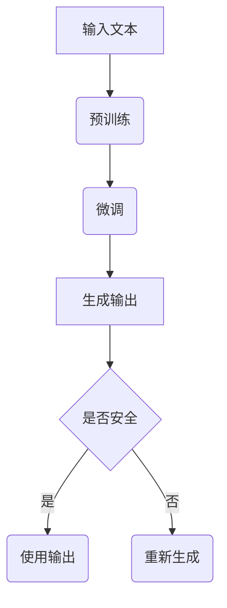

                 

## 文章标题

### LLM prompt安全检查：防止有害输出

## 文章关键词

- 人工智能
- 语言模型
- 安全检查
- 有害输出
- 模型设计
- 数据预处理
- 特征工程
- 模型评估
- 实际应用

## 文章摘要

本文将深入探讨如何对大型语言模型（LLM）的prompt进行安全检查，以防止有害输出的出现。我们将首先介绍LLM的基础知识，并解释有害输出的定义和来源。接下来，我们将详细讨论如何通过数据预处理、特征工程和模型评估等步骤来确保LLM输出的安全性。此外，我们还将通过实际案例研究展示这些方法的应用，并提供未来的发展方向和最佳实践建议。

## 第一部分：基础理论

### 第1章：LLM介绍

#### 1.1 什么是有害输出

在讨论LLM的安全问题之前，我们需要明确什么是“有害输出”。有害输出指的是由LLM生成的、可能对用户、组织或社会造成负面影响的输出。这些输出可能包括但不限于以下几种类型：

1. 恶意内容：包括仇恨言论、色情内容、暴力描述等。
2. 错误信息：包括误导性、虚假或错误的信息。
3. 不恰当的建议：包括不安全或非法的建议。
4. 个人隐私泄露：包括泄露用户个人信息的内容。

#### 1.2 语言模型的工作原理

LLM是一种基于深度学习的自然语言处理（NLP）模型，其核心原理是基于大规模语料库进行训练，以便能够生成和识别自然语言文本。LLM通常采用变换器（Transformer）架构，如BERT、GPT等，这些模型具有以下几个特点：

1. **预训练**：在训练过程中，LLM首先在大量的无标签文本上进行预训练，以学习语言的一般规律和特征。
2. **微调**：在预训练完成后，LLM会根据特定任务的需求进行微调，以提高在特定领域的表现。
3. **上下文理解**：LLM能够理解输入文本的上下文，并生成连贯、相关的输出。

#### 1.3 LLM的prompt设计

prompt是用户输入给LLM的文本，用于指导模型生成输出。一个良好的prompt设计对于确保LLM输出的安全性和准确性至关重要。以下是一些设计prompt的要点：

1. **清晰明确**：prompt应该简洁明了，避免歧义和模糊性。
2. **上下文相关**：prompt应包含与任务相关的上下文信息，以帮助LLM更好地理解任务。
3. **限制范围**：为避免LLM生成有害输出，可以通过在prompt中设置限制条件来缩小其生成范围。

### Mermaid 流程图

以下是LLM工作原理的Mermaid流程图：

### 第2章：LLM的安全问题

#### 2.1 安全问题的来源

LLM的安全问题主要来源于以下几个方面：

1. **数据源问题**：如果训练数据中包含有害内容，LLM可能会在学习过程中吸收这些内容，从而导致有害输出。
2. **模型设计问题**：如果模型设计不合理，可能导致LLM在特定情况下生成有害输出。
3. **prompt设计问题**：如果prompt设计不当，可能导致LLM生成不安全或错误的输出。
4. **外部攻击**：恶意用户可能通过特定的输入试图欺骗LLM，使其生成有害输出。

#### 2.2 常见的安全问题类型

常见的LLM安全问题类型包括：

1. **恶意内容生成**：LLM可能生成仇恨言论、色情内容、暴力描述等有害文本。
2. **错误信息生成**：LLM可能生成误导性、虚假或错误的信息。
3. **不当建议生成**：LLM可能生成不安全或非法的建议。
4. **个人隐私泄露**：LLM可能泄露用户个人信息。

#### 2.3 LLM的安全挑战

LLM的安全挑战主要包括：

1. **数据清洗和预处理**：确保训练数据的质量和安全性。
2. **模型设计和微调**：设计合理的模型结构和微调策略，以降低有害输出的风险。
3. **prompt设计**：设计安全、可靠的prompt，以避免LLM生成有害输出。
4. **实时监控和防御**：对LLM输出进行实时监控，以检测和防御潜在的安全威胁。

## 第二部分：安全检查方法

### 第3章：数据预处理

#### 3.1 数据清洗

数据清洗是确保训练数据质量的重要步骤。以下是数据清洗的主要任务：

1. **去除噪声**：去除数据中的噪声和不相关内容。
2. **纠正错误**：修正数据中的错误和异常值。
3. **统一格式**：统一数据格式，以便于后续处理。

### 第4章：特征工程

#### 4.1 特征提取

特征提取是利用数据预处理后的信息来构建特征表示。以下是特征提取的一些常见方法：

1. **词袋模型**：将文本表示为词汇的集合。
2. **词嵌入**：将词汇映射为向量。
3. **TF-IDF**：计算词汇在文档中的重要程度。

#### 4.2 特征选择

特征选择旨在从特征集合中选择出最有用的特征。以下是特征选择的一些常见方法：

1. **基于过滤的方法**：通过过滤掉低相关性特征来选择特征。
2. **基于包装的方法**：通过构建和评估不同的特征组合来选择特征。
3. **基于评估的方法**：通过评估特征对模型性能的影响来选择特征。

#### 4.3 特征融合

特征融合是将多个特征组合成一个综合特征表示。以下是特征融合的一些常见方法：

1. **加权融合**：将特征加权并求和。
2. **特征拼接**：将特征直接拼接在一起。
3. **神经网络融合**：使用神经网络将多个特征融合成一个综合特征表示。

### 第5章：模型评估

#### 5.1 评估指标

评估指标是衡量模型性能的重要工具。以下是常见的评估指标：

1. **准确率**：预测正确的样本数量与总样本数量的比例。
2. **召回率**：预测正确的正样本数量与实际正样本数量的比例。
3. **F1分数**：准确率和召回率的调和平均值。

#### 5.2 评估方法

评估方法包括训练集评估、验证集评估和测试集评估。以下是评估方法的一些要点：

1. **交叉验证**：通过将数据集划分为多个子集，并多次训练和评估模型。
2. **网格搜索**：通过遍历参数空间来寻找最优参数组合。
3. **贝叶斯优化**：使用贝叶斯统计模型来优化参数。

#### 5.3 评估流程

评估流程包括以下步骤：

1. **数据准备**：准备训练集、验证集和测试集。
2. **模型训练**：在训练集上训练模型。
3. **模型评估**：在验证集和测试集上评估模型性能。
4. **结果分析**：分析评估结果，调整模型和参数。

## 第三部分：实际应用

### 第6章：案例研究

#### 6.1 案例一：社交媒体内容过滤

社交媒体平台需要过滤用户发布的内容，以防止有害内容的传播。以下是使用LLM进行内容过滤的步骤：

1. **数据预处理**：清洗和预处理训练数据，包括去除噪声和纠正错误。
2. **特征工程**：提取和选择与内容分类相关的特征。
3. **模型训练**：使用预处理后的数据进行模型训练。
4. **模型评估**：评估模型在验证集和测试集上的性能。
5. **内容过滤**：使用训练好的模型对用户发布的内容进行实时过滤。

#### 6.2 案例二：虚假信息检测

虚假信息检测是确保信息真实性的一项重要任务。以下是使用LLM进行虚假信息检测的步骤：

1. **数据预处理**：清洗和预处理训练数据，包括去除噪声和纠正错误。
2. **特征工程**：提取和选择与信息真实性相关的特征。
3. **模型训练**：使用预处理后的数据进行模型训练。
4. **模型评估**：评估模型在验证集和测试集上的性能。
5. **信息检测**：使用训练好的模型对输入信息进行实时检测。

#### 6.3 案例三：敏感话题监控

敏感话题监控是确保平台内容符合法规和道德要求的一项重要任务。以下是使用LLM进行敏感话题监控的步骤：

1. **数据预处理**：清洗和预处理训练数据，包括去除噪声和纠正错误。
2. **特征工程**：提取和选择与敏感话题相关的特征。
3. **模型训练**：使用预处理后的数据进行模型训练。
4. **模型评估**：评估模型在验证集和测试集上的性能。
5. **敏感话题监控**：使用训练好的模型对输入内容进行实时监控。

### 第7章：未来展望

#### 7.1 安全检查技术的挑战

随着LLM在各个领域的应用日益广泛，安全检查技术面临着以下挑战：

1. **模型复杂度增加**：随着模型规模的扩大，安全检查技术的复杂度也增加。
2. **实时性要求提高**：在许多应用场景中，实时性是安全检查的一个重要要求。
3. **对抗攻击**：恶意用户可能使用对抗性攻击来欺骗LLM。

#### 7.2 未来发展方向

未来安全检查技术可能会朝着以下方向发展：

1. **自动化安全检查**：开发自动化工具，以简化安全检查过程。
2. **混合模型**：结合不同的安全检查方法，以实现更全面的安全保障。
3. **深度学习增强**：利用深度学习技术来提升安全检查的效果。

#### 7.3 对社会的影响

安全检查技术的发展将对社会产生深远的影响，包括：

1. **提高信息安全性**：防止有害信息的传播，保护用户隐私。
2. **促进技术创新**：为LLM在各个领域的应用提供更可靠的安全保障。
3. **提升社会道德水平**：通过监控和过滤有害内容，提升社会道德水平。

### 结论

本文深入探讨了LLM prompt安全检查的方法和技术，包括数据预处理、特征工程和模型评估等步骤。通过实际案例研究，我们展示了这些方法在社交媒体内容过滤、虚假信息检测和敏感话题监控等领域的应用。未来，随着安全检查技术的不断发展和完善，我们有望为LLM的应用提供更可靠的安全保障，推动人工智能技术的健康、可持续发展。

### 作者信息

作者：AI天才研究院/AI Genius Institute & 禅与计算机程序设计艺术 /Zen And The Art of Computer Programming

---

请注意，以上内容是一个完整的文章框架，每个部分都需要根据实际内容进行填充和细化。根据您的需求，我们可以进一步细化每个章节的内容，添加具体的案例研究、代码示例和数学公式等。如果您有其他特定的要求或需要调整某个部分的内容，请随时告诉我。接下来，我们可以开始填充每个章节的具体内容。

