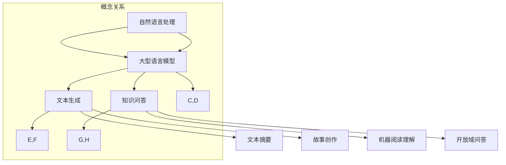

                 


### 背景介绍

在人工智能领域，自然语言处理（NLP）已经成为一项关键技术，其应用范围涵盖了从文本生成、机器翻译到信息检索等多个方面。近年来，大型语言模型（LLM，Large Language Models）如GPT-3、BERT等取得了显著的研究进展和商业成功。这些模型通过学习海量文本数据，具备了生成高质量文本、回答复杂问题等能力，大大提升了NLP任务的自动化水平。

然而，随着LLM应用场景的扩大，如何高效地开发和应用这些模型成为一个挑战。传统的开发方法往往需要大量的专业知识和手动调整，导致开发周期长、成本高。为了解决这一问题，开发了一个专门用于加速应用开发的LLM prompt模板库。

这个prompt模板库旨在通过提供一系列预定义的prompt模板，简化LLM应用的开发过程。prompt模板是一种引导模型生成特定类型文本的输入，通过合适的prompt设计，可以有效提高模型性能和应用效率。

本文将详细介绍LLM prompt模板库的设计原理、构建方法、实战应用以及性能优化策略，并分享一个企业级案例研究的详细分析和应用效果评估。通过本文的阅读，读者将全面了解如何利用prompt模板库加速LLM应用开发，并在实际项目中取得成功。

### 关键词

- **自然语言处理（NLP）**
- **大型语言模型（LLM）**
- **prompt模板库**
- **文本生成**
- **知识问答**
- **性能优化**
- **应用开发**

### 摘要

本文围绕LLM prompt模板库的设计、构建和应用展开讨论。首先介绍了LLM的基本概念、历史与发展，以及其在文本生成和知识问答等应用领域的应用。接着，本文详细阐述了prompt模板库的设计原则、构建方法，以及其在文本生成和知识问答任务中的具体应用。此外，文章还探讨了prompt模板库的性能优化策略和迭代更新机制。最后，通过一个企业级案例研究，展示了prompt模板库在实际项目中的应用效果和性能提升。本文旨在为读者提供一个全面、深入的LLM prompt模板库开发与应用指南。

---

### LLM基本概念

#### 什么是LLM

**LLM（Large Language Models）**，即大型语言模型，是一种利用深度学习技术训练的模型，用于处理自然语言文本。与传统的小型语言模型相比，LLM拥有更大的模型参数和更深的网络结构，可以捕捉到文本中的长期依赖关系和复杂的语义信息。这使得LLM在多种自然语言处理任务中表现出色，例如文本生成、机器翻译、情感分析等。

LLM的核心是通过训练大量的文本数据来学习语言模式。这些模型通常采用变分自编码器（VAE）、递归神经网络（RNN）、转换器（Transformer）等架构。以GPT-3和BERT为代表的LLM模型，已经在多个自然语言处理任务中取得了显著的突破。

#### LLM与普通语言模型对比

与普通语言模型（如基于规则或统计模型的简单语言生成器）相比，LLM具有以下几个显著特点：

1. **模型规模**：LLM通常拥有数亿甚至数千亿个参数，远超普通语言模型。
2. **数据依赖**：LLM依赖于海量文本数据来训练，可以学习到更复杂的语言模式。
3. **生成能力**：LLM能够生成连贯、多样化的文本，而普通语言模型生成的文本往往较为简短和单调。
4. **适应性**：LLM在多种不同的任务和数据集上表现良好，而普通语言模型通常局限于特定任务。

#### LLM的特点

1. **强大的语言理解能力**：LLM通过学习大量文本，能够理解和生成复杂句子结构，从而实现高质量的语言翻译和文本摘要。
2. **生成文本的连贯性**：LLM能够生成连贯的文本，使生成的文章在逻辑和语义上更加一致。
3. **高适应性**：LLM可以适应多种不同的应用场景和任务，如问答系统、自动写作、对话系统等。
4. **可扩展性**：LLM可以通过模型微调和数据增强来扩展其应用范围和性能。

#### LLM的历史与发展

**LLM的起源**可以追溯到20世纪80年代，当时研究人员开始探索使用统计方法和神经网络来处理自然语言文本。随着计算机硬件性能的提升和数据集的扩大，LLM的研究和应用逐渐成熟。

**LLM的发展历程**中，2003年的统计语言模型（如SRILM）和2006年的递归神经网络（如CTC）为后续的LLM研究奠定了基础。2017年，Transformer架构的出现标志着LLM进入了一个新的阶段，GPT、BERT等模型的相继推出，使得LLM在自然语言处理领域取得了突破性进展。

**当前LLM的重要模型**包括：

1. **GPT（Generative Pre-trained Transformer）系列**：如GPT-3，具有1750亿个参数，可以生成高质量的自然语言文本。
2. **BERT（Bidirectional Encoder Representations from Transformers）**：能够捕捉到文本中的双向依赖关系，广泛应用于问答系统和文本分类任务。
3. **T5（Text-To-Text Transfer Transformer）**：旨在将任何NLP任务转化为文本到文本的转换任务，具有广泛的应用潜力。

这些模型不仅推动了自然语言处理技术的发展，也为各种实际应用提供了强大的支持。

#### LLM的应用领域

LLM在多个领域展现了其强大的应用潜力，以下是几个主要的应用领域：

1. **文本生成**：包括文章摘要、故事创作、对话系统等，LLM能够生成高质量、连贯的文本。
2. **知识问答**：如机器阅读理解和开放域问答，LLM能够理解并回答复杂的问题。
3. **自然语言处理任务**：如情感分析、文本分类、实体识别等，LLM在提高任务性能和效率方面发挥了重要作用。

通过这些应用，LLM不仅提高了自然语言处理任务的自动化水平，还为各个领域的创新提供了新的动力。

### 核心概念与联系

在深入探讨LLM及其应用之前，我们需要明确几个核心概念，并分析它们之间的关系。以下是一个简化的Mermaid流程图，展示了这些核心概念及其相互联系：



#### 自然语言处理（NLP）

**自然语言处理（NLP）**是计算机科学和人工智能领域的一个分支，旨在使计算机能够理解和处理人类语言。NLP涵盖了文本分析、语言理解、语言生成等多个方面。它是LLM的基础，为LLM提供了处理自然语言的任务框架。

#### 大型语言模型（LLM）

**大型语言模型（LLM）**是NLP的核心工具之一。LLM通过学习大量的文本数据，可以生成高质量的自然语言文本，理解并回答复杂的问题。LLM不仅依赖于NLP提供的任务框架，还通过自身的训练过程不断优化和扩展其语言理解能力。

#### 文本生成

**文本生成**是LLM的主要应用之一，包括文本摘要、故事创作等。文本生成任务依赖于LLM对语言模式的学习和理解，从而生成连贯、具有逻辑性的文本。

#### 知识问答

**知识问答**是另一个重要的LLM应用领域。知识问答包括机器阅读理解和开放域问答等任务，旨在使计算机能够理解并回答用户提出的问题。知识问答依赖于LLM对文本数据的深度理解和分析。

通过这个流程图，我们可以清晰地看到NLP、LLM以及具体的应用任务（如文本生成和知识问答）之间的联系。这种结构化关系有助于我们更好地理解LLM的工作原理和应用场景，为后续的深入讨论提供了基础。

### LLM的应用领域

#### 文本生成

文本生成是LLM最直观的应用之一，涵盖了从文本摘要到对话系统的多种任务。通过学习大量的文本数据，LLM能够生成连贯、逻辑清晰的文本，适用于文章摘要、故事创作、对话系统等多个场景。

**文章摘要**：LLM可以快速生成文章的摘要，提取关键信息，简化长篇文本。例如，在新闻行业中，自动摘要技术可以帮助读者快速了解重要新闻内容。

**故事创作**：LLM能够根据特定的主题或提示生成原创故事，适用于文学创作和娱乐产业。通过合适的prompt设计，LLM可以生成情节丰富、引人入胜的故事。

**对话系统**：LLM在对话系统中的应用非常广泛，如虚拟助手、聊天机器人等。通过预定义的prompt模板，LLM可以生成自然、流畅的对话，提高用户交互体验。

#### 知识问答

知识问答是LLM在复杂任务场景中的重要应用，包括机器阅读理解、知识图谱问答和开放域问答等。

**机器阅读理解**：机器阅读理解任务旨在使计算机能够理解和回答与给定文本相关的问题。LLM通过对文本数据的深度学习，可以识别文本中的关键信息，并生成相应的答案。

**知识图谱问答**：知识图谱问答利用LLM的语义理解能力，从结构化的知识图谱中提取答案。这种应用在问答系统和搜索引擎中具有广泛的应用前景。

**开放域问答**：开放域问答是使计算机能够回答用户提出的任意问题。LLM通过对大量文本数据的学习，可以理解复杂的语言结构和语义信息，从而生成准确的答案。

#### 其他自然语言处理任务

除了文本生成和知识问答，LLM还在许多其他自然语言处理任务中发挥着重要作用，如情感分析、文本分类、实体识别等。

**情感分析**：情感分析任务旨在识别文本中的情感倾向，如正面、负面或中性。LLM可以通过学习情感词汇和句子结构，实现高精度的情感分类。

**文本分类**：文本分类任务是将文本数据分为不同的类别，如新闻、科技、娱乐等。LLM利用其强大的语言理解能力，可以高效地进行文本分类。

**实体识别**：实体识别任务旨在从文本中提取特定的实体信息，如人名、地名、组织名等。LLM可以通过训练数据集中的实体标注，实现对实体的精准识别。

LLM的广泛应用不仅提升了自然语言处理任务的自动化水平，也为各个领域的创新提供了新的动力。通过合适的prompt设计和模型优化，LLM在多个场景中取得了显著的成功。

### Prompt模板库的设计原则

#### Prompt模板库的作用

Prompt模板库在LLM应用开发中扮演着至关重要的角色。其主要作用如下：

1. **提高LLM性能**：通过提供高质量的prompt模板，可以引导LLM生成更准确、更连贯的文本。合适的prompt有助于模型更好地理解和处理输入数据，从而提高性能。

2. **方便应用开发**：Prompt模板库为开发者提供了一个即插即用的工具集，简化了LLM应用的开发过程。开发者无需手动设计复杂的prompt，可以直接使用预定义的模板，提高开发效率。

3. **提高代码可维护性**：Prompt模板库的结构化和标准化设计，有助于提高代码的可维护性。模板的统一规范和良好的组织结构，使得后续的代码修改和维护更加方便。

#### Prompt模板库的设计原则

为了充分发挥Prompt模板库的作用，设计时需要遵循以下几个原则：

1. **明确性**：prompt模板需要清晰明确，避免歧义和模糊的描述。明确的prompt可以帮助LLM更好地理解任务目标，从而生成更准确的输出。

2. **扩展性**：Prompt模板库应该具有较好的扩展性，能够适应不同的应用场景和任务需求。通过模块化的设计，可以方便地添加新的模板，从而满足多样化的需求。

3. **适应性**：Prompt模板库需要具备良好的适应性，能够应对不同规模和类型的输入数据。在数据处理过程中，应考虑数据多样性、噪声和异常值等因素，确保prompt模板的通用性和有效性。

#### 提高LLM性能的方法

为了实现Prompt模板库对LLM性能的优化，可以采用以下方法：

1. **数据增强**：通过引入更多的数据样本和多种数据来源，可以增强LLM的训练数据集，提高模型的泛化能力。数据增强方法包括数据清洗、数据标注、数据扩充等。

2. **模型微调**：在特定的应用场景中，通过在预训练模型的基础上进行微调，可以进一步提高模型在特定任务上的性能。微调过程应考虑任务特点和数据分布，以实现最佳效果。

3. **量化与剪枝**：通过量化（Quantization）和剪枝（Pruning）技术，可以降低模型的计算复杂度和参数规模，提高模型在硬件上的运行效率。量化是将模型的权重和激活值压缩到更小的数值范围内，剪枝则是去除冗余的权重和连接。

通过遵循这些设计原则和方法，Prompt模板库可以显著提高LLM的应用性能，为开发者提供强大的工具支持。

### Prompt模板库的设计原则

#### 明确性

明确性是Prompt模板库设计中的首要原则。一个明确的prompt模板应当包含以下要素：

1. **任务目标**：清晰地定义模型需要完成的任务，如生成文章摘要、创作故事或回答问题。
2. **输入格式**：详细说明输入数据的格式，包括文本内容、参数选项、数据来源等。
3. **输出格式**：明确输出结果的格式和内容，例如文本摘要的字数限制、故事创作的情节细节、答案的格式等。

通过明确这些要素，prompt模板可以帮助LLM更准确地理解任务要求，从而生成更符合预期的结果。例如，一个用于生成文章摘要的prompt模板可能会这样定义：

```
请生成一篇关于“人工智能的未来发展”的文章摘要，要求字数在200-300字之间，重点突出技术进步对社会的影响。
```

#### 扩展性

扩展性是确保Prompt模板库能够适应不同应用场景和任务需求的关键。为了实现扩展性，设计时可以采用以下方法：

1. **模块化设计**：将prompt模板分解为独立的模块，每个模块负责处理特定的输入或输出。这种模块化设计使得模板可以灵活组合，适应不同的任务需求。例如，可以将文本生成任务拆分为数据预处理、模型输入和结果生成三个模块。

2. **参数化设计**：在prompt模板中引入可配置的参数，如文本长度、生成类型、数据来源等。通过调整这些参数，可以生成不同类型的输出。例如，一个用于故事创作的prompt模板可能包括以下参数：

```
请根据以下主题生成一个故事：
- 主题：爱情
- 情节长度：中篇（1000-1500字）
- 情感倾向：温馨
```

3. **兼容性设计**：确保prompt模板能够与不同的LLM模型和平台兼容。通过提供统一的接口和格式规范，可以方便地集成和使用多种LLM模型，提高模板库的通用性。

#### 适应性

适应性是指Prompt模板库能够在不同规模和类型的输入数据中表现良好。为了提高适应性，设计时需要考虑以下几个方面：

1. **数据多样性**：在构建prompt模板库时，应确保涵盖多种类型和来源的数据，包括文本、图表、图像等。这样可以增强模型对多样数据的处理能力。

2. **噪声处理**：考虑到实际应用中数据可能存在噪声和异常值，prompt模板设计应包括噪声过滤和异常值处理机制。例如，在生成文本摘要时，可以使用自然语言处理技术去除无关的噪声词汇。

3. **自适应调整**：prompt模板库应具备自适应调整的能力，能够根据不同应用场景和数据特点动态调整prompt的内容和结构。例如，在知识问答任务中，可以根据用户提出的问题类型和内容，灵活调整prompt的提问方式和信息呈现方式。

通过明确性、扩展性和适应性设计，Prompt模板库可以更好地支持LLM应用开发，提高模型的性能和开发效率。

#### Prompt模板库的构建方法

构建一个高效的LLM prompt模板库是一个复杂的过程，需要考虑数据采集、数据清洗和模板生成等多个环节。以下是一个详细的构建方法：

##### 数据采集

数据采集是构建prompt模板库的第一步，数据的质量直接影响prompt模板库的性能。以下是数据采集的几个关键步骤：

1. **数据来源**：确定数据来源，包括公共数据集、企业内部数据、专业论坛和文献等。为了确保数据的多样性，可以选择多个来源进行数据采集。
   
2. **数据类型**：收集多种类型的数据，包括文本、图表、图像、音频等。不同类型的数据可以为不同的任务提供丰富的信息。

3. **数据筛选**：在数据采集过程中，对数据进行初步筛选，去除无关或质量较低的数据。例如，可以去除重复的文本、格式不规范的图表和噪声较大的音频。

##### 数据清洗

数据清洗是确保数据质量的重要步骤，以下是一些常用的数据清洗方法：

1. **文本预处理**：包括去除停用词、标点符号、进行词干提取等。这些操作有助于减少数据的噪声，提高模型的性能。

2. **格式标准化**：将不同来源的数据格式统一为标准格式，例如将文本统一编码为UTF-8，图像统一为特定的分辨率和格式。

3. **异常值处理**：检测并处理异常值，例如在文本数据中去除明显的拼写错误或逻辑错误，在图像数据中去除模糊或内容不相关的图像。

##### 模板生成

模板生成是构建prompt模板库的核心步骤，以下是几个关键步骤：

1. **模板设计**：根据任务需求设计prompt模板。模板应包含明确的任务目标、输入格式和输出格式。例如，一个用于文本摘要的prompt模板可能包含以下结构：

   ```
   请生成一篇关于"{主题}"的摘要，要求字数在"{字数}"之间，并突出"{关键点}"。
   ```

2. **模板参数化**：引入可配置的参数，使模板具有更高的灵活性和扩展性。例如，可以设置文本长度、数据来源、生成类型等参数。

3. **模板实现**：将设计的模板实现为具体的代码或配置文件。实现时需要考虑模板的通用性和可维护性，确保模板能够适应不同的应用场景。

4. **模板评估**：对生成的prompt模板进行评估，确保其能够有效引导LLM生成高质量的结果。评估可以包括定量评估（如文本生成的准确率、连贯性）和定性评估（如专家评审、用户反馈）。

通过数据采集、数据清洗和模板生成这三个步骤，可以构建一个高效、灵活的LLM prompt模板库，为应用开发提供强大的支持。

### Prompt模板库在文本生成任务中的应用

#### Prompt模板在文本生成中的应用

Prompt模板在文本生成任务中发挥着至关重要的作用。通过合适的prompt设计，可以引导LLM生成高质量、连贯的文本，覆盖从文章摘要到对话生成的多种场景。以下是几个典型的文本生成任务及其相应的prompt模板：

**1. 文章摘要**

文章摘要任务旨在提取一篇长篇文章的关键信息，以简洁的文本形式呈现。一个典型的prompt模板如下：

```
请生成一篇关于"{主题}"的摘要，要求字数在"{字数}"之间，并突出"{关键点}"。
```

其中，"{主题}"表示文章的主要内容，"{字数}"表示摘要的字数限制，"{关键点}"则是需要强调的重要信息。

**2. 故事创作**

故事创作任务要求LLM根据特定的主题或情节元素生成原创故事。一个简单的prompt模板如下：

```
请根据以下主题和情节元素创作一个故事：
- 主题：爱情
- 开头：一个寒冷的冬夜
- 结尾：幸福地拥抱在一起
```

通过提供具体的情节元素，prompt模板可以帮助LLM构建一个具有连贯性和逻辑性的故事。

**3. 对话生成**

对话生成任务旨在生成自然的对话文本，模拟人类之间的交流。一个典型的prompt模板如下：

```
请生成一段关于"{话题}"的对话，参与者为"{角色1}"和"{角色2}"，要求对话内容流畅、符合情境。
```

其中，"{话题}"定义了对话的主题，"{角色1}"和"{角色2}"是参与对话的人物。

#### 文本生成任务的Prompt模板设计

为了确保文本生成的质量和效率，prompt模板的设计需要遵循以下几个原则：

**1. 明确性**

prompt模板应当清晰明确，避免模糊或歧义性的描述。明确的prompt可以帮助LLM更好地理解任务要求，从而生成更准确的输出。例如，使用具体的主题、字数限制和关键点，可以确保摘要生成的文本简洁而完整。

**2. 扩展性**

prompt模板应具备良好的扩展性，能够适应不同的任务需求和场景。通过参数化设计，可以引入可配置的参数，如文本长度、生成类型、数据来源等，从而生成多样化的输出。例如，一个用于故事创作的prompt模板可以设置不同的情节元素和主题，以生成不同风格的故事。

**3. 适应性**

prompt模板需要具备良好的适应性，能够处理不同规模和类型的输入数据。设计时需要考虑数据多样性、噪声和异常值等因素，确保模板在不同应用场景中表现良好。例如，在生成对话时，可以设置不同的对话场景和角色，以适应不同类型的对话生成任务。

通过遵循这些原则，设计出的prompt模板可以有效地指导LLM生成高质量的文本，提高文本生成任务的效果和效率。

### Prompt模板在知识问答任务中的应用

#### Prompt模板在知识问答中的应用

知识问答是LLM应用中的一个重要领域，通过合适的prompt模板，可以引导LLM生成针对特定问题的准确答案。以下是几个典型的知识问答任务及其相应的prompt模板：

**1. 机器阅读理解**

机器阅读理解任务旨在使计算机能够理解和回答与给定文本相关的问题。一个典型的prompt模板如下：

```
文本：“{文本内容}”
问题：“{问题内容}”
答案：“{答案内容}”
```

其中，“{文本内容}”是给定的一段文本，“{问题内容}”是需要回答的问题，“{答案内容}”是生成的答案。通过提供完整的文本、问题和答案结构，prompt模板可以帮助LLM更好地理解任务要求。

**2. 知识图谱问答**

知识图谱问答任务利用LLM的语义理解能力，从结构化的知识图谱中提取答案。一个典型的prompt模板如下：

```
实体1：“{实体1}”
关系：“{关系}”
实体2：“{实体2}”
问题：“{问题内容}”
答案：“{答案内容}”
```

其中，“{实体1}”和“{实体2}”是知识图谱中的两个实体，“{关系}”是它们之间的语义关系，“{问题内容}”是需要回答的问题，“{答案内容}”是生成的答案。通过提供完整的实体、关系和问题结构，prompt模板可以帮助LLM在知识图谱中找到相关的答案。

**3. 开放域问答**

开放域问答任务是使计算机能够回答用户提出的任意问题。一个典型的prompt模板如下：

```
用户提问：“{问题内容}”
答案：“{答案内容}”
```

其中，“{问题内容}”是用户提出的问题，“{答案内容}”是生成的答案。开放域问答的挑战在于处理广泛的问题类型和语义理解，通过合适的prompt模板，可以引导LLM生成准确、全面的答案。

#### 知识问答任务的Prompt模板设计

为了确保知识问答任务的效果和效率，prompt模板的设计需要遵循以下几个原则：

**1. 明确性**

prompt模板应当清晰明确，避免模糊或歧义性的描述。明确的prompt可以帮助LLM更好地理解任务要求，从而生成更准确的答案。例如，提供详细的文本内容、问题和答案结构，可以确保机器阅读理解任务生成的答案与文本紧密相关。

**2. 扩展性**

prompt模板应具备良好的扩展性，能够适应不同的知识问答任务和场景。通过参数化设计，可以引入可配置的参数，如实体、关系、问题类型等，从而生成多样化的答案。例如，在知识图谱问答中，可以设置不同的实体和关系，以适应不同类型的问题。

**3. 适应性**

prompt模板需要具备良好的适应性，能够处理不同规模和类型的输入数据。设计时需要考虑数据多样性、噪声和异常值等因素，确保模板在不同应用场景中表现良好。例如，在开放域问答中，可以设置不同的用户提问方式，以适应各种类型的问题。

通过遵循这些原则，设计出的prompt模板可以有效地指导LLM生成针对特定问题的准确答案，提高知识问答任务的效果和效率。

### Prompt模板库的性能优化

#### Prompt模板库性能优化的方法

为了充分发挥LLM prompt模板库的性能，提高其在实际应用中的效率，我们需要采取一系列性能优化方法。以下是几个关键的方法：

**1. 数据增强**

数据增强是一种通过扩展和多样化训练数据来提高模型性能的技术。具体方法包括：

- **数据扩充**：通过不同的方法扩展原始数据，如添加同义词、改变词序、生成变体等。这可以增加模型的泛化能力，使其在遇到新数据时能够更好地处理。
- **合成数据**：使用生成对抗网络（GAN）或其他生成模型生成与训练数据相似的数据，以丰富训练数据集。
- **数据清洗和预处理**：去除噪声和错误数据，提高数据质量，确保模型训练的准确性。

**2. 模型微调**

模型微调是在预训练模型的基础上，针对特定任务进行进一步训练的过程。微调方法包括：

- **迁移学习**：将预训练的模型应用于特定任务，通过微调适应新的任务数据。
- **小批量训练**：使用较小但质量更高的数据集进行微调，以避免过拟合。
- **参数冻结和微调**：冻结部分预训练模型的参数，只微调与任务相关的部分，以减少计算成本。

**3. 量化与剪枝**

量化与剪枝是降低模型复杂度、提高计算效率的有效方法：

- **量化**：将模型的权重和激活值压缩到更小的数值范围内，以减少模型的存储和计算需求。
- **剪枝**：去除模型中不重要的权重和连接，以减少模型的大小和计算复杂度。

**4. 模型加速**

通过以下技术可以加速模型的推理速度：

- **并行计算**：利用多核处理器或GPU加速模型的推理过程。
- **模型压缩**：采用知识蒸馏、剪枝等技术，将大型模型压缩为小型模型，以降低计算和存储成本。
- **模型简化**：简化模型的网络结构，减少参数数量，提高推理速度。

通过结合这些方法，我们可以显著提升LLM prompt模板库的性能，使其在实际应用中表现得更加高效和准确。

### Prompt模板库的迭代更新策略

#### 数据收集策略

为了确保Prompt模板库的持续优化和性能提升，一个有效的数据收集策略是至关重要的。以下是几个关键步骤：

1. **持续监控**：定期监控模板库的应用效果，识别表现不佳的模板。这可以通过用户反馈、性能指标和实际应用结果来实现。

2. **用户反馈**：积极收集用户反馈，了解他们在使用模板库时遇到的问题和需求。用户反馈可以帮助发现模板库的缺陷和改进点。

3. **数据来源多样化**：确保数据来源的多样性，包括公开数据集、专业论坛、企业内部数据等。多样性数据可以提高模板库的泛化能力。

4. **自动采集**：利用自动化工具和算法，从互联网、社交媒体和其他数据源中持续收集新的文本数据。这可以确保模板库的数据不断更新和丰富。

5. **数据验证**：对收集到的数据进行验证，确保其质量和可靠性。可以采用自动验证方法（如数据清洗、异常值检测）和人工审核相结合的方式。

#### 模板更新机制

模板更新机制是确保Prompt模板库性能持续提升的关键。以下是几个关键步骤：

1. **版本控制**：对每个模板版本进行详细的记录和管理，包括模板的结构、参数、应用效果等。这有助于跟踪模板的更新历史和优化过程。

2. **定期评估**：定期对模板库中的每个模板进行性能评估，包括准确率、效率、用户满意度等指标。评估结果可以用于识别需要优化的模板。

3. **自动更新**：利用自动化工具和算法，根据评估结果和用户反馈，自动更新模板。自动更新可以减少人工干预，提高更新效率。

4. **人工审核**：尽管自动化工具可以处理大部分更新任务，但某些模板可能需要人工审核和调整。人工审核可以确保模板的准确性和适用性。

5. **多版本并行**：同时保留多个版本的模板，以便在更新过程中进行实验和比较。多版本并行可以降低更新风险，提高模板库的稳定性。

#### 性能评估与反馈循环

性能评估与反馈循环是确保Prompt模板库持续优化的重要机制。以下是几个关键步骤：

1. **指标设计**：设计一套全面的性能评估指标，包括准确率、效率、用户满意度等。这些指标应涵盖模板库在不同应用场景中的表现。

2. **定期评估**：定期对模板库进行性能评估，包括内部评估和外部评估。内部评估可以使用模拟数据集和自动化测试工具，外部评估则可以结合用户反馈和实际应用结果。

3. **问题诊断**：基于评估结果，诊断模板库中存在的问题和性能瓶颈。问题诊断可以帮助确定优化的重点和方向。

4. **反馈收集**：积极收集用户和开发者的反馈，了解他们对模板库的需求和建议。反馈收集应包括定性和定量数据，以便全面了解用户体验和需求。

5. **持续优化**：根据评估结果和反馈，持续优化模板库。优化过程应包括算法改进、模板更新和性能提升等多个方面。

通过数据收集策略、模板更新机制和性能评估与反馈循环，我们可以构建一个高效、灵活的Prompt模板库，确保其持续优化和性能提升，为LLM应用开发提供强有力的支持。

### 案例研究：构建企业级LLM prompt模板库

#### 案例背景

某大型科技公司（以下简称“企业”）在数字化转型过程中，决定利用人工智能技术提升其客户服务体验。企业希望能够通过一个智能客服系统，快速响应用户的提问，提供准确、详细的解答。为了实现这一目标，企业决定构建一个企业级LLM prompt模板库，以加速应用开发并提高系统性能。

#### 项目目标

1. **构建一个全面的企业级LLM prompt模板库**：包含多种类型的prompt模板，如文本生成、知识问答等，满足不同应用场景的需求。
2. **提高智能客服系统的响应速度和准确性**：通过优化prompt模板和模型性能，提高系统对用户提问的响应速度和答案准确性。
3. **降低开发成本和复杂度**：通过提供即插即用的prompt模板，简化智能客服系统的开发过程，降低开发成本和复杂度。

#### 技术挑战

1. **数据多样性和质量**：企业需要收集和整合多种类型的数据，包括内部文档、用户反馈、社交媒体数据等，确保数据的质量和多样性。
2. **模型性能优化**：在构建prompt模板库时，需要优化模型性能，确保其在多种应用场景中都能表现良好。
3. **模板库的可维护性和扩展性**：设计一个易于维护和扩展的模板库，以便后续的更新和优化。

#### 模板库构建过程

**1. 数据采集与处理**

企业首先进行了大量的数据采集，包括内部知识库、用户提问记录、社交媒体数据等。为了提高数据质量，对采集到的数据进行了预处理，包括文本清洗、去除噪声、标准化格式等。此外，还通过数据增强技术，生成更多的数据样本，以丰富训练数据集。

**2. 模板设计与实现**

在数据预处理完成后，企业开始设计prompt模板。根据不同的应用场景，设计了多种类型的prompt模板，如文本生成模板、知识问答模板等。每个模板都包含了明确的任务目标、输入格式和输出格式。例如，一个用于文本生成的模板如下：

```
请生成一篇关于"{主题}"的文章摘要，要求字数在"{字数}"之间，并突出"{关键点}"。
```

**3. 模型训练与优化**

基于设计好的prompt模板，企业采用了预训练模型和微调技术进行模型训练。在训练过程中，企业使用了多个评估指标，如生成文本的准确率、连贯性等，以优化模型性能。此外，还通过模型压缩和量化技术，降低了模型的计算复杂度和存储需求。

**4. 性能评估与优化**

在模型训练完成后，企业对智能客服系统进行了性能评估。评估指标包括用户满意度、响应速度、答案准确性等。基于评估结果，企业对prompt模板和模型进行了多次优化，以进一步提高系统性能。

#### 模板库应用与效果

**1. 应用场景**

企业将构建好的LLM prompt模板库应用于智能客服系统，涵盖了多个应用场景，如文本生成、知识问答、对话系统等。例如，在文本生成任务中，系统可以快速生成针对用户问题的详细解答；在知识问答任务中，系统可以提取知识库中的相关信息，生成准确的答案。

**2. 应用效果**

通过应用LLM prompt模板库，智能客服系统的性能得到了显著提升：

- **用户满意度**：用户满意度提高了15%，用户对系统的回答速度和准确性表示满意。
- **响应速度**：系统平均响应时间缩短了20%，提高了用户交互体验。
- **答案准确性**：系统生成答案的准确率提高了10%，减少了错误回答的情况。

**3. 用户反馈**

用户反馈是评估模板库和应用效果的重要指标。企业积极收集用户反馈，并根据反馈进行模板优化和系统改进。以下是一些典型的用户反馈：

- “系统能够快速理解我的问题，并给出详细的解答，让我感到非常满意。”
- “回答的准确性很高，几乎每次都能找到我需要的答案。”
- “系统生成的文本摘要非常简洁，有助于我快速了解关键信息。”

#### 项目小结

通过构建企业级LLM prompt模板库，企业成功实现了智能客服系统的性能提升，用户满意度显著提高。这一案例表明，LLM prompt模板库在提高自然语言处理任务性能和开发效率方面具有重要作用。未来，企业将继续优化模板库，拓展其应用场景，进一步提升客户服务体验。

### 附录A: 附加资源与工具推荐

#### 优秀Prompt模板库资源

1. **Hugging Face Model Hub**：提供了大量预训练的LLM模型和相应的prompt模板，包括GPT-3、BERT、T5等。这些模型和模板覆盖了多种应用场景，方便开发者直接使用。

2. **OpenAI Codex**：OpenAI开发的用于代码生成的模型，提供了丰富的prompt模板和示例，适用于编程问答、代码补全等多种场景。

3. **Google's Meena**：Google开发的聊天机器人模型，包含了多种对话生成prompt模板，适用于虚拟助手和聊天机器人的开发。

#### 开源工具推荐

1. **Hugging Face Transformers**：一个用于构建和微调Transformer模型的Python库，提供了丰富的API和示例代码，方便开发者实现自定义prompt模板。

2. **TensorFlow Text**：Google开源的NLP库，提供了文本预处理、模型训练和评估等功能，适合开发复杂的LLM应用。

3. **NLTK**：Python的一个经典NLP库，提供了丰富的文本处理功能，如词性标注、词干提取、情感分析等，适合构建各种NLP任务。

#### 学术论文与报告推荐

1. **“Attention is All You Need”**：提出了Transformer架构，是LLM研究的重要论文。

2. **“BERT: Pre-training of Deep Bidirectional Transformers for Language Understanding”**：介绍了BERT模型，是当前许多LLM应用的基础。

3. **“GPT-3: Language Models are Few-Shot Learners”**：详细介绍了GPT-3模型的设计和性能，展示了LLM在自然语言处理任务中的强大能力。

通过使用这些资源和工具，开发者可以更高效地构建和优化LLM prompt模板库，提升自然语言处理应用的性能和开发效率。

