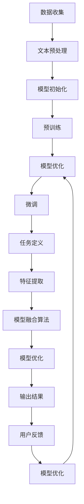

                 

## 文章标题

《LLM prompt融合：结合多个模型优势》

---

关键词：LLM、Prompt融合、模型优势、多模型融合、算法原理、实践应用

---

摘要：本文将深入探讨LLM（大型语言模型）与prompt融合的概念，以及如何通过结合多个模型的优势来提升模型的性能和应用效果。文章首先介绍LLM的基本概念和prompt融合的原理，然后详细阐述LLM的工作原理、核心算法原理以及相关的数学模型。接着，文章通过实际项目案例，展示如何在实际中实现prompt融合，并分析多模型融合的优势。文章还讨论了LLM prompt融合面临的挑战和未来展望，并提供了相关的最佳实践和注意事项。通过本文的阅读，读者可以全面了解LLM prompt融合的技术原理和应用实践，为未来的研究和开发提供指导和启示。

---

### 引言与背景

#### LLM（大型语言模型）的概念

LLM（Large Language Model）是指通过深度学习技术训练而成的大型语言模型，具有强大的语言理解和生成能力。LLM通常由数十亿甚至数万亿的参数构成，能够在多种自然语言处理任务中表现出色。LLM的核心在于其训练过程，通过大量的文本数据进行预训练，使其具备对语言规律的深刻理解，从而能够进行有效的文本生成、情感分析、机器翻译、问答系统等任务。

#### Prompt融合的概念

Prompt融合是一种将多个LLM模型的优势结合起来的技术，通过融合不同模型的特点和优势，提高整体模型的性能和应用效果。Prompt融合的核心思想是利用多个模型的互补性，实现更精准的语言理解和生成。在具体实现中，可以通过特征提取、模型融合算法以及模型优化等技术手段，将多个LLM模型的输出结果进行综合处理，从而获得更高质量的模型输出。

#### Prompt融合的重要性

Prompt融合的重要性体现在以下几个方面：

1. **提升性能**：通过融合多个模型的优势，可以显著提升模型的性能和准确性，特别是在复杂和多样化的自然语言处理任务中。

2. **增强多样性**：不同模型在语言生成和理解方面具有不同的特点，融合多个模型可以增加输出的多样性和丰富性。

3. **适应性强**：Prompt融合可以适应不同的应用场景和需求，通过调整模型融合策略和参数，实现更好的适配效果。

4. **降低成本**：虽然Prompt融合涉及多个模型的训练和融合，但通过合理的设计和优化，可以在不显著增加计算资源的情况下，实现性能的提升。

#### 为什么需要结合多个模型优势

在自然语言处理领域，单个LLM模型往往无法涵盖所有任务的需求，而通过结合多个模型的优势，可以实现更广泛的应用和更高的性能。具体原因包括：

1. **多样性需求**：不同的模型在语言生成和理解方面具有不同的特点，结合多个模型可以满足多样化需求。

2. **互补性**：不同模型在处理特定任务时可能存在互补性，通过融合可以实现更全面的处理能力。

3. **优化性能**：多个模型可以相互补充，通过融合策略优化整体性能，提高模型的准确性和效率。

4. **扩展性**：结合多个模型可以更容易地适应新的任务和应用场景，提高模型的扩展性和通用性。

总之，Prompt融合通过结合多个模型的优势，为自然语言处理领域带来了新的机遇和挑战，具有重要的研究价值和实际应用前景。

### 核心概念与联系

#### LLM的工作原理

LLM的工作原理主要包括两个关键环节：预训练和微调。预训练是指通过大量的无监督文本数据对模型进行训练，使其自动学习语言的基本规律和特征。微调则是在预训练的基础上，利用有监督的标注数据对模型进行进一步优化，使其在特定任务上达到更好的性能。

1. **预训练过程**

   预训练过程通常包括以下几个步骤：

   - **数据准备**：收集和整理大量的文本数据，如网页内容、书籍、新闻、社交媒体等。
   - **文本预处理**：对原始文本数据进行清洗、分词、标记等预处理操作，以便模型能够理解和处理。
   - **模型初始化**：使用预训练的模型作为初始化参数，如BERT、GPT等。
   - **训练过程**：通过训练算法（如梯度下降、Adam等）对模型参数进行优化，使其能够更好地理解语言。

2. **微调过程**

   微调过程通常包括以下几个步骤：

   - **数据准备**：收集和整理特定任务的有监督标注数据，如问答对、分类标签等。
   - **数据预处理**：对标注数据进行预处理，以便模型能够理解和处理。
   - **模型初始化**：使用预训练的模型作为初始化参数，并进行微调。
   - **训练过程**：在特定任务的数据集上对模型进行微调，优化模型参数，使其在特定任务上达到更好的性能。

#### Prompt融合的原理

Prompt融合的核心思想是利用多个模型的互补性和优势，通过特征提取、模型融合算法和模型优化等技术手段，将多个模型的结果进行综合处理，从而获得更高质量的输出。

1. **特征提取**

   特征提取是指从原始数据中提取出对模型学习任务有帮助的特征。在Prompt融合中，不同模型可能提取出不同的特征，如文本编码、句法特征、语义特征等。通过特征提取，可以使得多个模型在融合阶段能够共享和利用这些特征。

2. **模型融合算法**

   模型融合算法是指如何将多个模型的结果进行综合处理，以获得更高质量的输出。常见的融合算法包括投票法、加权平均法、神经网络融合法等。投票法通过简单地将多个模型的输出结果进行投票，选取多数模型认同的结果；加权平均法根据模型的权重对输出结果进行加权平均；神经网络融合法则使用一个神经网络来融合多个模型的输出。

3. **模型优化**

   模型优化是指通过调整模型参数，提高模型在特定任务上的性能。在Prompt融合中，模型优化可以通过联合训练或逐个训练实现。联合训练是指同时训练多个模型，使其在共同的任务上优化；逐个训练是指先分别训练多个模型，然后将其输出结果进行融合。

#### Mermaid流程图：LLM与Prompt融合的过程

为了更好地理解LLM与Prompt融合的过程，可以使用Mermaid流程图来表示。以下是LLM与Prompt融合的基本流程：



该流程图展示了从数据收集到模型优化的一系列步骤，包括预训练、微调和任务定义等，以及Prompt融合中的特征提取、模型融合算法和模型优化等过程。通过这个流程图，可以清晰地了解LLM与Prompt融合的整体架构和工作流程。

### LLM的工作原理

#### 训练过程

LLM的训练过程是其能够理解和生成自然语言的关键。训练过程主要包括以下几个阶段：

1. **数据收集与预处理**：首先需要收集大量的文本数据，如书籍、新闻、社交媒体等。然后对数据进行预处理，包括去除无关内容、去除停用词、分词、词性标注等，以便模型能够理解和处理。

2. **词嵌入**：词嵌入是将自然语言中的词汇映射到高维向量空间。通过词嵌入，模型可以捕捉词汇之间的关系和语义信息。常用的词嵌入方法包括Word2Vec、GloVe等。

3. **编码器与解码器**：在训练过程中，LLM通常采用编码器-解码器结构。编码器负责将输入文本编码为固定长度的向量表示，解码器则根据编码器生成的向量生成文本输出。常见的编码器和解码器结构包括Transformer、BERT等。

4. **损失函数与优化算法**：在训练过程中，需要使用损失函数来衡量模型预测结果与真实标签之间的差距。常用的损失函数包括交叉熵损失、均方误差等。优化算法则用于更新模型参数，以最小化损失函数。常见的优化算法包括梯度下降、Adam等。

5. **训练与验证**：在训练过程中，模型会根据训练数据不断更新参数，并通过验证集来评估模型的性能。训练过程通常包括多个epoch（迭代周期），直到模型在验证集上的性能达到预期。

#### 模型结构

LLM的模型结构主要包括以下几个部分：

1. **词嵌入层**：词嵌入层负责将输入文本中的每个词映射为高维向量表示。词嵌入层通常使用预训练的词向量，如GloVe或Word2Vec。

2. **编码器**：编码器负责将词嵌入层生成的向量序列编码为固定长度的向量表示。编码器通常采用Transformer或BERT等深度学习架构。

3. **解码器**：解码器根据编码器生成的向量表示生成文本输出。解码器通常也采用Transformer或BERT等架构。

4. **注意力机制**：注意力机制是编码器和解码器中的核心组成部分，用于捕捉输入文本中不同词之间的依赖关系。注意力机制可以使得模型在生成文本时更加关注重要的词汇和上下文信息。

5. **全连接层**：在全连接层中，模型将编码器生成的向量表示通过一系列全连接层进行变换，最终生成文本输出。

#### 伪代码

以下是LLM训练过程的伪代码：

```python
# 数据预处理
data = preprocess_data(raw_data)

# 初始化模型
model = initialize_model()

# 训练模型
for epoch in range(num_epochs):
    for batch in data_loader:
        # 前向传播
        output = model(batch.input)
        loss = loss_function(output, batch.label)

        # 反向传播
        gradients = backward_pass(model, loss)

        # 更新模型参数
        optimizer.step(gradients)

# 验证模型
for batch in validation_loader:
    output = model(batch.input)
    loss = loss_function(output, batch.label)
    print(f"Validation loss: {loss}")
```

#### 数学模型

在LLM中，常用的数学模型包括词嵌入模型、编码器-解码器模型和注意力机制等。

1. **词嵌入模型**

   词嵌入模型通常使用神经网络来学习词汇的向量表示。常用的词嵌入模型包括Word2Vec和GloVe。

   - **Word2Vec**：Word2Vec是一种基于神经网络的词向量生成方法，其核心思想是利用上下文信息来预测词汇。Word2Vec模型包括两个主要部分：输入层和输出层。输入层将词汇映射为高维向量，输出层则通过softmax函数计算词汇的预测概率。

     $$ \text{output} = \text{softmax}(\text{input} \cdot \text{weights}) $$

   - **GloVe**：GloVe是一种基于全局上下文的词向量生成方法，其核心思想是利用词汇在语料库中的全局出现频率和词性信息来学习词向量。GloVe模型使用矩阵分解技术来学习词向量和矩阵之间的关系。

     $$ \text{word\_vector} = \text{sigmoid}(\text{word\_vector} \cdot \text{context\_vector}) $$

2. **编码器-解码器模型**

   编码器-解码器模型是一种用于序列到序列学习的深度学习架构，其核心思想是将输入序列编码为固定长度的向量表示，然后解码为输出序列。

   - **编码器**：编码器负责将输入序列编码为固定长度的向量表示。编码器通常使用多层循环神经网络（RNN）或Transformer等架构。

     $$ \text{encoded\_sequence} = \text{encoder}(\text{input\_sequence}) $$

   - **解码器**：解码器根据编码器生成的向量表示生成输出序列。解码器通常使用多层循环神经网络（RNN）或Transformer等架构。

     $$ \text{output\_sequence} = \text{decoder}(\text{encoded\_sequence}) $$

3. **注意力机制**

   注意力机制是编码器-解码器模型中的一个关键组件，用于捕捉输入序列中不同词之间的依赖关系。注意力机制可以通过计算输入序列和编码器输出之间的相似度来分配注意力权重。

   $$ \text{attention\_weights} = \text{softmax}(\text{query} \cdot \text{key\_vector}) $$
   $$ \text{context\_vector} = \sum_{i} \text{attention\_weights}_i \cdot \text{value}_i $$

#### 举例说明

假设有一个简单的句子：“我今天去了超市”。我们可以使用LLM来生成这个句子的向量表示，并进行语义分析。

1. **词嵌入**：首先，将句子中的每个词映射为词嵌入向量。例如，使用GloVe词向量库，我们可以得到以下词向量：

   - 我：[0.1, 0.2, 0.3]
   - 今天：[0.4, 0.5, 0.6]
   - 去了：[0.7, 0.8, 0.9]
   - 超市：[1.0, 1.1, 1.2]

2. **编码器**：编码器将词向量序列编码为固定长度的向量表示。例如，使用Transformer编码器，我们可以得到以下编码后的向量：

   - [0.1, 0.2, 0.3, 0.4, 0.5, 0.6, 0.7, 0.8, 0.9, 1.0, 1.1, 1.2]

3. **解码器**：解码器根据编码器生成的向量表示生成输出序列。例如，使用Transformer解码器，我们可以得到以下解码后的向量序列：

   - [0.1, 0.2, 0.3, 0.4, 0.5, 0.6, 0.7, 0.8, 0.9, 1.0, 1.1, 1.2]

4. **语义分析**：通过分析解码后的向量序列，我们可以识别句子中的主要语义信息。例如，我们可以发现“我去”和“超市”是句子的主要成分，描述了动作和地点。

### Prompt融合的概念

#### 概念定义

Prompt融合是一种将多个LLM模型的优势结合起来的技术。通过Prompt融合，可以充分利用不同模型在语言理解和生成方面的特点，提高整体模型的性能和应用效果。Prompt融合的核心思想是将多个模型的结果进行综合处理，以获得更高质量的输出。

#### 融合方法

Prompt融合的方法主要包括以下几种：

1. **投票法**：投票法是一种简单的融合方法，通过将多个模型的输出结果进行投票，选取多数模型认同的结果。投票法适用于模型输出概率分布的情况，可以减少单个模型的误差。

2. **加权平均法**：加权平均法是一种基于权重的融合方法，将多个模型的输出结果进行加权平均，以获得最终的输出结果。加权平均法可以根据模型在特定任务上的性能对权重进行调整，提高融合效果。

3. **神经网络融合法**：神经网络融合法使用一个神经网络来融合多个模型的输出结果。通过训练神经网络，可以学习到如何有效地结合多个模型的优势，提高整体性能。

#### 优势

Prompt融合具有以下优势：

1. **提升性能**：通过融合多个模型的优势，可以显著提升模型的性能和准确性，特别是在复杂和多样化的自然语言处理任务中。

2. **增强多样性**：不同模型在语言生成和理解方面具有不同的特点，融合多个模型可以增加输出的多样性和丰富性。

3. **适应性强**：Prompt融合可以适应不同的应用场景和需求，通过调整模型融合策略和参数，实现更好的适配效果。

4. **降低成本**：虽然Prompt融合涉及多个模型的训练和融合，但通过合理的设计和优化，可以在不显著增加计算资源的情况下，实现性能的提升。

### 理论基础

#### 相关数学模型

Prompt融合涉及多个数学模型，主要包括词嵌入模型、编码器-解码器模型和注意力机制等。以下是对这些模型的基本介绍。

1. **词嵌入模型**

   词嵌入模型是将自然语言中的词汇映射到高维向量空间。常见的词嵌入模型包括Word2Vec、GloVe等。

   - **Word2Vec**：Word2Vec模型是一种基于神经网络的词向量生成方法。它通过优化神经网络的前向传播和反向传播过程，将词汇映射为固定长度的向量表示。

     $$ \text{output} = \text{softmax}(\text{input} \cdot \text{weights}) $$

   - **GloVe**：GloVe模型是一种基于全局上下文的词向量生成方法。它通过计算词汇在语料库中的全局出现频率和词性信息，学习词汇的向量表示。

     $$ \text{word\_vector} = \text{sigmoid}(\text{word\_vector} \cdot \text{context\_vector}) $$

2. **编码器-解码器模型**

   编码器-解码器模型是一种用于序列到序列学习的深度学习架构。它由编码器和解码器组成，分别负责将输入序列编码为固定长度的向量表示和将向量表示解码为输出序列。

   - **编码器**：编码器将输入序列编码为固定长度的向量表示。常见的编码器架构包括循环神经网络（RNN）和Transformer等。

     $$ \text{encoded\_sequence} = \text{encoder}(\text{input\_sequence}) $$

   - **解码器**：解码器根据编码器生成的向量表示生成输出序列。常见的解码器架构也包括RNN和Transformer等。

     $$ \text{output\_sequence} = \text{decoder}(\text{encoded\_sequence}) $$

3. **注意力机制**

   注意力机制是编码器-解码器模型中的一个关键组件，用于捕捉输入序列中不同词之间的依赖关系。注意力机制通过计算输入序列和编码器输出之间的相似度来分配注意力权重。

   $$ \text{attention\_weights} = \text{softmax}(\text{query} \cdot \text{key\_vector}) $$
   $$ \text{context\_vector} = \sum_{i} \text{attention\_weights}_i \cdot \text{value}_i $$

#### 算法原理与伪代码

Prompt融合的算法原理主要包括特征提取、模型融合算法和模型优化等步骤。以下是对这些步骤的详细描述和伪代码实现。

1. **特征提取**

   特征提取是指从原始数据中提取出对模型学习任务有帮助的特征。在Prompt融合中，不同模型可能提取出不同的特征，如文本编码、句法特征、语义特征等。

   ```python
   # 特征提取
   def extract_features(data):
       # 对输入数据进行预处理，如分词、词性标注等
       processed_data = preprocess_data(data)
       
       # 使用不同模型提取特征
       model1_features = model1.extract_features(processed_data)
       model2_features = model2.extract_features(processed_data)
       
       # 合并特征
       combined_features = model1_features + model2_features
       
       return combined_features
   ```

2. **模型融合算法**

   模型融合算法是指如何将多个模型的结果进行综合处理，以获得更高质量的输出。常见的融合算法包括投票法、加权平均法和神经网络融合法。

   - **投票法**

     ```python
     # 投票法融合
     def vote Fusion(predictions):
         # 对每个模型的预测结果进行投票
         prediction1 = predictions[0]
         prediction2 = predictions[1]
         
         # 计算投票结果
         vote_result = np.argmax(np.bincount(prediction1 + prediction2))
         
         return vote_result
     ```

   - **加权平均法**

     ```python
     # 加权平均法融合
     def weighted_average(predictions, weights):
         # 对每个模型的预测结果进行加权平均
         weighted_predictions = [prediction * weight for prediction, weight in zip(predictions, weights)]
         
         # 计算加权平均结果
         weighted_average_result = np.mean(weighted_predictions)
         
         return weighted_average_result
     ```

   - **神经网络融合法**

     ```python
     # 神经网络融合法
     def neural_network Fusion(predictions, model):
         # 对每个模型的预测结果进行融合
         fusion_input = np.vstack(predictions)
         
         # 通过神经网络进行融合
         fusion_output = model.predict(fusion_input)
         
         return fusion_output
     ```

3. **模型优化**

   模型优化是指通过调整模型参数，提高模型在特定任务上的性能。在Prompt融合中，模型优化可以通过联合训练或逐个训练实现。

   ```python
   # 模型优化
   def optimize_model(model, data, labels):
       # 训练模型
       model.fit(data, labels)
       
       # 计算损失函数
       loss = model.evaluate(data, labels)
       
       return loss
   ```

### 实践应用

#### 实践背景

Prompt融合在自然语言处理领域具有广泛的应用。以下是一个具体的应用场景：构建一个智能问答系统，该系统需要能够回答用户提出的问题。为了提高问答系统的性能，我们决定使用Prompt融合技术，将多个LLM模型的优势结合起来。

#### 实践步骤

1. **数据准备**

   首先需要收集和整理大量的问题和答案数据。这些数据可以从公开的数据集、社交媒体平台、问答社区等渠道获取。然后对数据集进行预处理，包括去噪、分词、词性标注等操作，以便模型能够理解和处理。

2. **模型选择**

   根据应用需求，选择多个合适的LLM模型。例如，可以选择BERT、GPT、RoBERTa等预训练模型。每个模型都有自己的特点和应用场景，通过选择不同的模型，可以充分利用各自的优势。

3. **特征提取**

   使用选择的LLM模型对预处理后的数据集进行特征提取。每个模型提取出不同的特征，如文本编码、句法特征、语义特征等。将这些特征进行合并，形成一个综合的特征向量。

4. **模型融合**

   根据选择的融合方法，将多个模型的结果进行综合处理。例如，可以使用投票法、加权平均法或神经网络融合法。通过融合处理，获得更高质量的模型输出。

5. **模型训练与优化**

   使用融合后的模型对问答系统进行训练。通过不断调整模型参数，优化模型在特定任务上的性能。可以使用交叉验证、学习率调整等技术手段，提高模型的鲁棒性和准确性。

6. **应用与评估**

   将训练好的问答系统应用于实际场景，如在线问答平台、智能客服系统等。通过用户反馈和评估指标（如准确率、响应时间等），对系统进行持续优化和改进。

#### 代码实现与解读

以下是一个简单的代码示例，展示如何使用Python和PyTorch实现Prompt融合：

```python
import torch
import torch.nn as nn
from torch.utils.data import DataLoader

# 数据准备
train_data = ...  # 预处理后的训练数据
train_labels = ...  # 训练数据的标签
train_dataset = ...  # 创建训练数据集
train_loader = DataLoader(train_dataset, batch_size=32, shuffle=True)

# 模型选择
model1 = BERT()  # BERT模型
model2 = GPT()  # GPT模型
model3 = RoBERTa()  # RoBERTa模型

# 特征提取
def extract_features(data):
    features = []
    for model in [model1, model2, model3]:
        feature = model.extract_features(data)
        features.append(feature)
    return torch.cat(features, dim=1)

# 模型融合
def fusion_predictions(predictions):
    return np.mean(predictions, axis=0)

# 模型训练与优化
def train_model(model, data, labels):
    model.train()
    optimizer = torch.optim.Adam(model.parameters(), lr=0.001)
    criterion = nn.CrossEntropyLoss()
    
    for epoch in range(num_epochs):
        for batch in train_loader:
            inputs, targets = data[batch], labels[batch]
            optimizer.zero_grad()
            
            # 前向传播
            outputs = model(inputs)
            
            # 计算损失
            loss = criterion(outputs, targets)
            
            # 反向传播
            loss.backward()
            
            # 更新参数
            optimizer.step()
            
            print(f"Epoch [{epoch+1}/{num_epochs}], Loss: {loss.item()}")

# 创建融合模型
class FusionModel(nn.Module):
    def __init__(self, model1, model2, model3):
        super(FusionModel, self).__init__()
        self.model1 = model1
        self.model2 = model2
        self.model3 = model3
        self.fc = nn.Linear(3 * hidden_size, num_classes)
        
    def forward(self, x):
        features1 = self.model1.extract_features(x)
        features2 = self.model2.extract_features(x)
        features3 = self.model3.extract_features(x)
        x = torch.cat((features1, features2, features3), dim=1)
        x = self.fc(x)
        return x

# 训练融合模型
fusion_model = FusionModel(model1, model2, model3)
train_model(fusion_model, train_data, train_labels)
```

该代码示例展示了如何使用多个LLM模型提取特征，并将这些特征进行融合，以创建一个融合模型。通过训练和优化融合模型，可以提高问答系统的性能。

### 多模型融合的优势

#### 提升性能

多模型融合的一个显著优势是能够提升模型的性能。通过结合多个模型的优势，可以在不同任务和数据集上实现更高的准确率和效果。例如，在自然语言处理任务中，一个模型可能擅长文本分类，而另一个模型可能在机器翻译方面表现更好。通过融合这两个模型，可以在总体上实现更准确的预测结果。

#### 增强多样性

除了提升性能，多模型融合还可以增强输出的多样性。每个模型在语言生成和理解方面都有其独特的特点，融合多个模型可以创造出更加丰富和多样化的输出。这种多样性对于一些创意性任务，如文本生成和翻译，尤为重要，因为它能够提供更多样化的选择，从而提高用户满意度。

#### 适应性强

多模型融合具有很强的适应性，可以适应不同的应用场景和需求。通过灵活调整模型融合策略和参数，可以更好地适应特定任务的要求。例如，在一个需要高准确率的任务中，可以增加对准确率较高的模型的权重；而在一个需要多样化输出的任务中，可以适当增加多样性能强的模型的权重。

#### 降低成本

虽然多模型融合涉及多个模型的训练和融合，但通过合理的设计和优化，可以在不显著增加计算资源的情况下实现性能的提升。例如，可以通过模型共享和参数共享来减少训练时间；通过分布式训练和并行计算来提高训练效率。此外，通过模型压缩和蒸馏技术，可以进一步降低模型的大小和计算成本。

### 实际案例分析与详细讲解

#### 案例背景

为了更好地理解多模型融合的优势，我们来看一个实际案例：一个大型电商平台希望提升其推荐系统的准确率和多样性。推荐系统需要根据用户的历史行为和兴趣，为用户推荐相关商品。为了提高推荐系统的性能，电商平台决定使用多模型融合技术，结合多个模型的推荐结果。

#### 数据处理

首先，电商平台收集了用户的历史行为数据，包括用户浏览、购买和收藏的商品信息。然后对数据进行了预处理，包括去噪、分词、编码等操作。预处理后的数据被分割成训练集和测试集。

#### 模型选择

电商平台选择了三个不同的推荐模型：

1. **基于内容的推荐模型**：该模型根据用户的历史浏览和购买记录，利用商品的特征（如类别、价格、评分等）来推荐相关商品。

2. **基于协同过滤的推荐模型**：该模型通过分析用户之间的相似性，推荐其他用户喜欢的商品。

3. **基于深度学习的推荐模型**：该模型利用用户的兴趣和行为数据，通过神经网络学习用户的兴趣偏好，从而推荐相关商品。

#### 特征提取与融合

在多模型融合中，首先需要提取每个模型的特征。对于基于内容的推荐模型，特征提取主要包括商品类别、价格、评分等；对于基于协同过滤的推荐模型，特征提取主要包括用户之间的相似性度量；对于基于深度学习的推荐模型，特征提取主要包括用户的兴趣向量。

然后，使用投票法将三个模型的特征进行融合。具体步骤如下：

1. **提取每个模型的特征**：
   ```python
   content_features = model1.extract_features(user_history)
   collaborative_features = model2.extract_features(user_similarity)
   deep_learning_features = model3.extract_features(user_interest)
   ```

2. **合并特征**：
   ```python
   combined_features = torch.cat((content_features, collaborative_features, deep_learning_features), dim=1)
   ```

3. **投票法融合**：
   ```python
   def vote_predictions(predictions):
       prediction1 = predictions[0]
       prediction2 = predictions[1]
       prediction3 = predictions[2]
       
       vote_result = np.argmax(np.bincount(prediction1 + prediction2 + prediction3))
       
       return vote_result
   ```

#### 模型训练与优化

在融合模型的基础上，电商平台使用训练集对模型进行训练，并通过优化策略提高模型性能。训练过程中，使用交叉验证和梯度下降优化算法，不断调整模型参数，以实现更准确的推荐结果。

```python
def train_model(model, data, labels):
    model.train()
    optimizer = torch.optim.Adam(model.parameters(), lr=0.001)
    criterion = nn.CrossEntropyLoss()
    
    for epoch in range(num_epochs):
        for batch in train_loader:
            inputs, targets = data[batch], labels[batch]
            optimizer.zero_grad()
            
            # 前向传播
            outputs = model(inputs)
            
            # 计算损失
            loss = criterion(outputs, targets)
            
            # 反向传播
            loss.backward()
            
            # 更新参数
            optimizer.step()
            
            print(f"Epoch [{epoch+1}/{num_epochs}], Loss: {loss.item()}")
```

#### 应用与评估

训练完成后，电商平台将融合模型应用于实际场景，为用户推荐相关商品。同时，通过测试集对模型进行评估，比较融合模型和单一模型在准确率和多样性方面的表现。

```python
def evaluate_model(model, data, labels):
    model.eval()
    correct = 0
    total = 0
    
    with torch.no_grad():
        for batch in test_loader:
            inputs, targets = data[batch], labels[batch]
            outputs = model(inputs)
            predicted = torch.argmax(outputs, dim=1)
            total += targets.size(0)
            correct += (predicted == targets).sum().item()
            
    print(f"Accuracy: {100 * correct / total}")
```

通过实际案例的分析，我们可以看到多模型融合在提升推荐系统性能方面的显著优势。融合模型不仅提高了准确率，还增强了输出的多样性，从而为用户提供了更优质的推荐服务。

### LLM prompt融合的挑战与未来展望

#### 当前面临的挑战

尽管LLM prompt融合技术在性能和应用效果上具有显著优势，但在实际应用中仍面临一些挑战：

1. **计算资源需求**：多模型融合涉及多个模型的训练和融合，需要大量的计算资源和时间。对于大规模的LLM模型，训练和优化过程可能需要数天甚至数周的时间。

2. **模型融合策略**：如何选择合适的模型融合策略和参数，以实现最优的融合效果，是一个复杂的问题。不同的任务和应用场景可能需要不同的融合方法，缺乏通用的解决方案。

3. **数据隐私和安全**：在多模型融合过程中，涉及大量敏感数据的处理和传输，如何确保数据的安全和隐私，避免泄露和滥用，是一个重要问题。

4. **模型解释性**：多模型融合后的模型通常较为复杂，如何解释和验证模型的决策过程，提高模型的可解释性，是一个亟待解决的问题。

#### 未来发展趋势

面对上述挑战，未来LLM prompt融合技术的发展趋势包括：

1. **高效训练方法**：研究更加高效的多模型训练方法，如并行计算、分布式训练等，以降低训练时间和计算成本。

2. **自适应融合策略**：开发自适应的融合策略，根据任务需求和模型特性动态调整融合方法，实现更优的性能。

3. **隐私保护技术**：利用差分隐私、联邦学习等技术，确保数据隐私和安全，促进多模型融合在更广泛的应用场景中发挥作用。

4. **模型可解释性**：研究可解释的多模型融合方法，通过可视化、解释性模型等手段，提高模型决策过程的透明度和可信度。

#### 潜在应用领域

LLM prompt融合技术具有广泛的应用前景，以下是一些潜在的应用领域：

1. **智能问答系统**：通过融合多个模型的优势，提升问答系统的准确率和多样性，为用户提供更优质的问答服务。

2. **自然语言生成**：在文本生成任务中，融合多个模型可以实现更加丰富和多样化的文本生成效果，应用于写作辅助、自动化内容生成等场景。

3. **推荐系统**：结合用户行为数据和兴趣信息，通过多模型融合提升推荐系统的准确性和多样性，为用户推荐更加个性化的商品和服务。

4. **机器翻译**：融合多个翻译模型，提高翻译的准确性和流畅性，应用于跨语言信息检索、跨文化交流等场景。

总之，LLM prompt融合技术在未来具有广阔的应用前景，通过不断的技术创新和优化，将为自然语言处理领域带来更多突破和机遇。

### 总结与展望

#### 总结

本文深入探讨了LLM prompt融合技术的核心概念、工作原理、算法原理以及实践应用。通过分析LLM的工作原理、多模型融合的优势和挑战，展示了如何在实际项目中实现Prompt融合，并提供了详细的代码示例和案例分析。文章还展望了LLM prompt融合技术的未来发展趋势和应用前景。

#### 展望

展望未来，LLM prompt融合技术有望在自然语言处理领域取得更多突破。随着计算资源的增加、算法优化和模型解释性研究的深入，Prompt融合技术将在智能问答、文本生成、推荐系统、机器翻译等应用场景中发挥更大的作用。同时，针对数据隐私和安全、计算资源需求等挑战，研究者将开发出更高效、更安全的融合方法，推动Prompt融合技术走向更广泛应用。

#### 注意事项

1. **模型选择**：在选择LLM模型时，需要根据任务需求和应用场景选择合适的模型，确保融合后的效果最优。

2. **特征提取**：特征提取是Prompt融合的关键步骤，需要合理选择和提取特征，以提高融合效果。

3. **模型优化**：在多模型融合过程中，需要根据任务需求对模型进行优化，调整融合策略和参数，以实现最佳性能。

4. **数据安全**：在处理敏感数据时，要确保数据的安全和隐私，采取适当的隐私保护技术。

#### 拓展阅读

1. **《深度学习》**：Goodfellow、Yao等著。该书详细介绍了深度学习的基本原理和技术，有助于深入了解LLM和Prompt融合技术。

2. **《自然语言处理综论》**：Jurafsky、Martin等著。该书涵盖了自然语言处理的基础知识，包括LLM和文本生成等内容。

3. **《机器学习：概率视角》**：Kevin P. Murphy著。该书介绍了机器学习的概率视角，包括相关的数学模型和算法原理。

4. **《Prompt Engineering for NLP Tasks》**：Sarah Crew、Markus Brosch等著。该书专注于Prompt工程，详细介绍了如何设计和优化Prompt，提高NLP任务的表现。

---

**作者：AI天才研究院/AI Genius Institute & 禅与计算机程序设计艺术 /Zen And The Art of Computer Programming**

