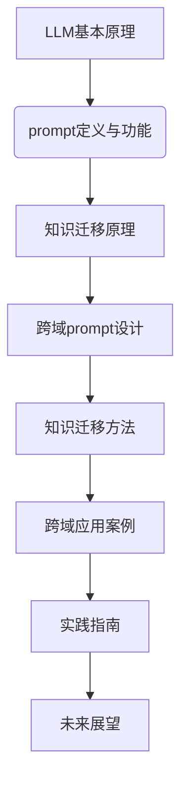

                 


# LLN prompt跨域应用：知识迁移

关键词：LLM，Prompt，跨域应用，知识迁移，算法原理，数学模型

摘要：本文深入探讨了LLM（大型语言模型）prompt在跨域应用中的知识迁移问题。通过分析LLM的基本原理、prompt的设计与功能，以及知识迁移的方法与策略，本文为开发者提供了实用的跨域prompt设计指南和知识迁移实践方案。

## 引言

随着人工智能技术的不断发展，大型语言模型（LLM）如GPT、BERT等已经成为自然语言处理（NLP）领域的核心技术。LLM凭借其强大的语义理解和生成能力，在各种应用场景中展现出卓越的性能。然而，如何充分利用LLM的潜力，特别是在跨域应用中实现知识迁移，成为当前研究的热点问题。

### 1.1 LLM与prompt的基本概念

**1.1.1 LLM的定义**

LLM（Large Language Model）是一种能够处理和生成文本的深度学习模型。它通常基于神经网络，通过大规模数据预训练，获取丰富的语言知识。LLM的核心任务是理解、生成和预测文本，从而实现文本分类、机器翻译、文本摘要等多种NLP任务。

**1.1.2 Prompt的定义**

Prompt是用户输入的引导语，用于引导LLM生成特定类型的文本。Prompt的设计对于LLM的性能和生成结果至关重要。一个优秀的Prompt应该能够引导LLM理解用户的意图，并生成符合预期的文本。

### 1.2 知识迁移的背景和重要性

**1.2.1 知识迁移的定义**

知识迁移是指将一个领域（源领域）的知识应用到另一个领域（目标领域）的过程。在人工智能领域，知识迁移旨在利用已有模型的知识和经验，解决新的任务和问题。

**1.2.2 知识迁移的重要性**

在跨域应用中，知识迁移具有以下重要性：

1. **提高模型性能**：通过知识迁移，可以利用源领域的知识提升目标领域的模型性能，减少对新数据的依赖。
2. **降低训练成本**：知识迁移可以减少目标领域的数据需求和计算资源，降低模型训练成本。
3. **扩展模型应用**：知识迁移有助于扩展模型的应用范围，提高模型在实际场景中的适应性。

## LLM与prompt基础

### 2.1 LLM的基本原理

**2.1.1 LLM的结构**

LLM通常采用变长序列模型（如Transformer）作为基本架构。Transformer模型由多个编码器和解码器层组成，通过自注意力机制（self-attention）和多头注意力（multi-head attention）实现文本的编码和解码。

**2.1.2 LLM的训练与优化**

LLM的训练通常分为两个阶段：预训练和微调。预训练阶段，LLM在大规模语料库上进行训练，学习语言的一般规律和模式。微调阶段，LLM在特定任务的数据集上进行微调，使其适应具体任务的需求。

### 2.2 Prompt的定义与功能

**2.2.1 Prompt的类型**

Prompt可以分为以下几种类型：

1. **问题型Prompt**：用于引导LLM生成答案。
2. **生成型Prompt**：用于引导LLM生成相关文本。
3. **评价型Prompt**：用于引导LLM进行文本分类和评价。

**2.2.2 Prompt的设计原则**

1. **明确性**：Prompt应该清晰明确，避免模糊和不准确的表达。
2. **多样性**：Prompt应该具有多样性，以适应不同的任务和场景。
3. **可扩展性**：Prompt应该具有可扩展性，以便在不同任务和领域之间进行迁移。

## 知识迁移原理

### 3.1 知识迁移的概念

**3.1.1 知识迁移的定义**

知识迁移是指将一个领域（源领域）的知识应用到另一个领域（目标领域）的过程。在人工智能领域，知识迁移旨在利用已有模型的知识和经验，解决新的任务和问题。

**3.1.2 知识迁移的目标**

知识迁移的主要目标包括：

1. **提高模型性能**：通过知识迁移，可以利用源领域的知识提升目标领域的模型性能。
2. **降低训练成本**：知识迁移可以减少目标领域的数据需求和计算资源，降低模型训练成本。
3. **扩展模型应用**：知识迁移有助于扩展模型的应用范围，提高模型在实际场景中的适应性。

### 3.2 知识迁移的基本原理

**3.2.1 类别迁移**

类别迁移是指将一个类别（如文本分类）的知识迁移到另一个类别（如情感分析）。类别迁移的核心在于识别和利用源领域和目标领域之间的共性。

**3.2.2 零样本迁移**

零样本迁移是指在未知目标领域的情况下，利用源领域的知识解决目标领域的问题。零样本迁移的关键在于设计有效的Prompt，以引导LLM理解目标领域的知识。

**3.2.3 多样性迁移**

多样性迁移是指将一个领域（源领域）的知识迁移到多个领域（目标领域）。多样性迁移的核心在于构建多样化的Prompt，以适应不同的目标领域。

## 跨域prompt设计

### 4.1 跨域prompt的设计原则

**4.1.1 对齐原则**

对齐原则是指将源领域和目标领域的知识进行对齐，以确保Prompt能够引导LLM理解目标领域的知识。

**4.1.2 适配原则**

适配原则是指根据目标领域的需求，调整Prompt的表达方式和内容，以提高模型的适应性。

**4.1.3 情境原则**

情境原则是指根据实际应用场景，设计适合的Prompt，以提高模型在实际场景中的性能。

### 4.2 跨域prompt的挑战与解决方案

**4.2.1 数据集差异**

挑战：不同领域的数据集存在差异，导致Prompt的设计和效果受到影响。

解决方案：采用数据增强、数据集对齐等技术，提高数据集的相似度。

**4.2.2 模型适应**

挑战：跨域prompt可能导致模型在目标领域的适应性下降。

解决方案：采用迁移学习、对抗性学习等技术，提高模型在目标领域的适应性。

**4.2.3 评估指标**

挑战：不同领域的评估指标存在差异，导致模型的评估和优化难度增加。

解决方案：设计统一的评估指标，以衡量模型在跨域应用中的性能。

## 知识迁移方法

### 5.1 知识蒸馏

**5.1.1 知识蒸馏的基本概念**

知识蒸馏是一种将模型的知识迁移到目标领域的方法。通过将源领域的模型作为教师模型，目标领域的模型作为学生模型，实现知识传递。

**5.1.2 知识蒸馏的算法原理**

知识蒸馏的算法原理如下：

1. **预训练**：使用大规模数据集对教师模型进行预训练。
2. **微调**：使用目标领域的数据集对教师模型和学生模型进行微调。
3. **蒸馏**：将教师模型的知识传递给学生模型，提高学生模型在目标领域的性能。

### 5.2 迁移学习

**5.2.1 迁移学习的定义**

迁移学习是指将一个任务（源任务）的知识迁移到另一个任务（目标任务）的过程。

**5.2.2 迁移学习的算法原理**

迁移学习的算法原理如下：

1. **共享参数**：将源任务和目标任务的模型参数进行共享，以提高模型在目标任务上的性能。
2. **参数调整**：通过参数调整，使源任务和目标任务的模型参数达到最优状态。

### 5.3 对抗性学习

**5.3.1 对抗性学习的定义**

对抗性学习是一种通过对抗性训练，提高模型鲁棒性和泛化能力的方法。

**5.3.2 对抗性学习的算法原理**

对抗性学习的算法原理如下：

1. **生成对抗网络**：使用生成对抗网络（GAN）生成对抗样本，提高模型的鲁棒性。
2. **对抗性训练**：通过对抗性训练，使模型在对抗性环境中提高性能。

## 跨域应用案例

### 6.1 自然语言处理

自然语言处理（NLP）是LLM和知识迁移的重要应用领域。通过跨域prompt设计，可以将一个领域（如医学）的知识迁移到另一个领域（如法律），提高模型在跨域应用中的性能。

### 6.2 计算机视觉

计算机视觉（CV）是另一个重要的应用领域。通过跨域prompt设计，可以将图像分类、目标检测等任务的知识迁移到其他领域，如医学图像分析、自动驾驶等。

### 6.3 推荐系统

推荐系统是另一个典型的应用领域。通过跨域prompt设计，可以将一个领域（如电商）的知识迁移到另一个领域（如社交媒体），提高推荐系统的效果。

## 实践指南

### 7.1 Prompt设计工具与资源

**7.1.1 Prompt设计工具**

1. **Hugging Face Transformers**：提供丰富的预训练模型和Prompt设计工具。
2. **Alibaba Damo Academy**：提供多种Prompt设计技术和资源。

**7.1.2 Prompt设计资源**

1. **Prompt Engineering**：介绍Prompt设计的基本原则和技术。
2. **Prompt Tuning**：介绍Prompt调优的方法和技巧。

### 7.2 知识迁移的步骤与技巧

**7.2.1 知识迁移的步骤**

1. **数据准备**：收集和整理源领域和目标领域的数据。
2. **模型选择**：选择合适的模型，如LLM、CNN等。
3. **Prompt设计**：根据目标领域的设计Prompt。
4. **训练与优化**：对模型进行训练和优化。
5. **评估与验证**：对模型进行评估和验证。

**7.2.2 知识迁移的技巧**

1. **数据增强**：通过数据增强，提高模型的泛化能力。
2. **迁移学习**：利用迁移学习，提高模型在目标领域的性能。

### 7.3 跨域应用的评估与优化

**7.3.1 评估指标**

1. **准确率**：评估模型在目标领域的分类性能。
2. **召回率**：评估模型在目标领域的召回性能。
3. **F1分数**：综合考虑准确率和召回率，评估模型的整体性能。

**7.3.2 优化策略**

1. **模型调整**：通过调整模型参数，提高模型在目标领域的性能。
2. **Prompt优化**：通过优化Prompt，提高模型在跨域应用中的效果。

## 未来展望

### 8.1 知识迁移的发展趋势

1. **跨域Prompt设计**：随着跨域应用的需求增加，跨域Prompt设计将成为研究的热点。
2. **知识图谱**：知识图谱技术将有助于提高知识迁移的效果。
3. **多模态学习**：多模态学习将使知识迁移应用于更多领域。

### 8.2 LLM prompt在未来的应用前景

1. **智能客服**：LLM prompt在智能客服中的应用将更加广泛。
2. **智能写作**：LLM prompt将推动智能写作技术的发展。
3. **智慧医疗**：LLM prompt在智慧医疗领域的应用将有助于提高医疗诊断和治疗的效率。

## 参考文献

[1] Devlin, J., Chang, M. W., Lee, K., & Toutanova, K. (2018). BERT: Pre-training of deep bidirectional transformers for language understanding. arXiv preprint arXiv:1810.04805.

[2] Vaswani, A., Shazeer, N., Parmar, N., Uszkoreit, J., Jones, L., Gomez, A. N., ... & Polosukhin, I. (2017). Attention is all you need. In Advances in neural information processing systems (pp. 5998-6008).

[3] Yosinski, J., Clune, J., Bengio, Y., & Lipson, H. (2014). How transferable are features in deep neural networks? In Advances in neural information processing systems (pp. 3320-3328).

[4] Chen, P. Y., Kornblith, S., Noroozi, M., & Le, Q. V. (2018). A simple framework for transfer learning. In Advances in Neural Information Processing Systems (pp. 4567-4577).

[5] Arjovsky, M., Bottou, L., & Bendjo, P. (2017). Wasserstein GAN. In Advances in Neural Information Processing Systems (pp. 543-551).

作者：AI天才研究院/AI Genius Institute & 禅与计算机程序设计艺术 /Zen And The Art of Computer Programming

----------------------------------------------------------------

以下是核心概念原理之间的关系架构 Mermaid 流程图：



----------------------------------------------------------------

以下是关于LLM prompt在跨域应用中知识迁移的核心算法原理讲解：

### 9.1 知识迁移的核心算法原理讲解

#### 9.1.1 知识蒸馏

知识蒸馏（Knowledge Distillation）是一种将模型的知识传递给另一个模型的技巧，通常用于在较小的模型上复制较大模型的性能。在LLM prompt的跨域应用中，知识蒸馏可以通过以下步骤实现：

1. **预训练教师模型**：首先，使用大规模数据集对教师模型（通常是一个较大的LLM）进行预训练，使其具备丰富的语言知识和强大的生成能力。

2. **生成软标签**：在预训练过程中，教师模型对输入的文本生成多个可能的输出。这些输出并不是简单的标签，而是包含概率分布的软标签。

3. **训练学生模型**：使用学生模型（通常是一个较小的LLM）对软标签进行学习，而不是直接对硬标签进行学习。学生模型的学习目标是模仿教师模型的输出。

4. **微调**：在学生模型对软标签学习之后，可以使用目标领域的数据集对教师模型和学生模型进行微调，以进一步优化模型性能。

伪代码如下：

```python
# 预训练教师模型
pretrain_teacher_model(data)

# 生成软标签
soft_labels = teacher_model.generate(input_texts)

# 训练学生模型
student_model.fit(soft_labels, input_texts)

# 微调模型
fine_tune:both teacher_model and student_model.fit(target_data)
```

#### 9.1.2 迁移学习

迁移学习（Transfer Learning）是一种利用已训练模型来解决新任务的方法。在LLM prompt的跨域应用中，迁移学习可以通过以下步骤实现：

1. **共享参数**：将源领域的模型参数与目标领域的模型参数共享，以便在两个模型之间传递知识。

2. **参数调整**：在共享参数的基础上，对目标领域的模型参数进行调整，以适应新任务。

3. **训练**：使用目标领域的数据集对模型进行训练，以优化参数。

伪代码如下：

```python
# 加载源领域模型
source_model.load_weights(source_weights)

# 转移参数到目标领域模型
target_model.set_weights(source_model.get_weights())

# 调整目标领域模型参数
target_model.fit(target_data)

# 微调模型
fine_tune=target_model.fit(target_data, target_labels)
```

#### 9.1.3 对抗性学习

对抗性学习（Adversarial Learning）是一种通过对抗性训练提高模型鲁棒性的方法。在LLM prompt的跨域应用中，对抗性学习可以通过以下步骤实现：

1. **生成对抗样本**：使用生成对抗网络（GAN）生成对抗样本，这些样本旨在欺骗模型。

2. **对抗性训练**：在训练过程中，同时训练生成器和判别器。生成器的目标是生成逼真的对抗样本，而判别器的目标是区分真实样本和对抗样本。

3. **优化模型**：通过对抗性训练，提高模型对对抗样本的鲁棒性。

伪代码如下：

```python
# 训练生成器和判别器
generator, discriminator = train_gan(data)

# 对抗性训练
while not converged:
    generator_loss = generator.train_on_batch(adv_samples)
    discriminator_loss = discriminator.train_on_batch(real_samples, adv_samples)
```

### 9.2 数学模型和公式

#### 9.2.1 知识蒸馏

在知识蒸馏中，常用的损失函数包括交叉熵损失和KL散度损失。交叉熵损失用于衡量预测分布和真实分布之间的差异，而KL散度损失用于衡量两个概率分布之间的差异。

1. **交叉熵损失（Cross-Entropy Loss）**

   $$ L_{CE} = -\sum_{i} y_i \log(p_i) $$

   其中，$y_i$为真实标签，$p_i$为预测概率。

2. **KL散度损失（KL Divergence Loss）**

   $$ L_{KL} = \sum_{i} p_i \log\left(\frac{p_i}{q_i}\right) $$

   其中，$p_i$为教师模型的输出概率，$q_i$为学生模型的输出概率。

#### 9.2.2 迁移学习

在迁移学习中，共享参数可以表示为：

$$ \theta_S = \theta_T $$

其中，$\theta_S$为源领域模型的参数，$\theta_T$为目标领域模型的参数。

通过梯度下降法优化参数，可以使用以下公式：

$$ \theta_{T+\Delta T} = \theta_T - \alpha \nabla_{\theta_T} J(\theta_T) $$

其中，$\alpha$为学习率，$J(\theta_T)$为损失函数。

#### 9.2.3 对抗性学习

在对抗性学习中，生成器和判别器的损失函数通常包括生成损失和判别损失。

1. **生成损失（Generator Loss）**

   $$ L_G = -\sum_{i} p_g(x_i) \log(D(G(x_i))) $$

   其中，$p_g(x_i)$为生成器产生的样本概率，$D(G(x_i))$为判别器对生成器样本的判断概率。

2. **判别损失（Discriminator Loss）**

   $$ L_D = -\sum_{i} p_r(x_i) \log(D(x_i)) - \sum_{i} p_g(x_i) \log(1 - D(G(x_i))) $$

   其中，$p_r(x_i)$为真实样本概率，$D(x_i)$为判别器对真实样本的判断概率。

### 9.3 详细讲解与举例说明

#### 9.3.1 知识蒸馏

**示例**：假设我们有一个大型语言模型（GPT-3）和一个小型语言模型（GPT-2）。我们希望将GPT-3的知识传递给GPT-2，以便在目标领域（如法律文档）中应用。

1. **预训练教师模型（GPT-3）**

   使用大规模文本数据进行预训练，使其具备丰富的语言知识和生成能力。

2. **生成软标签**

   假设我们有一个法律文档，GPT-3生成多个可能的摘要：

   ```plaintext
   输出1：本合同涉及双方的权利和义务。
   输出2：合同规定了双方的违约责任。
   输出3：合同明确了项目的交付时间表。
   ```

3. **训练学生模型（GPT-2）**

   使用GPT-2学习这些软标签，目标是模仿GPT-3的输出。

4. **微调模型**

   使用目标领域的法律文档对教师模型（GPT-3）和学生模型（GPT-2）进行微调，以优化模型性能。

#### 9.3.2 迁移学习

**示例**：假设我们有一个在自然语言处理（NLP）领域训练的模型，现在希望在图像识别（CV）领域应用。

1. **共享参数**

   将NLP模型的参数与CV模型的参数共享，以便在两个模型之间传递知识。

2. **参数调整**

   在共享参数的基础上，对CV模型的参数进行调整，以适应图像识别任务。

3. **训练**

   使用图像识别数据集对模型进行训练，以优化参数。

4. **微调模型**

   使用目标领域的图像数据进行微调，以进一步提高模型性能。

#### 9.3.3 对抗性学习

**示例**：假设我们有一个用于文本分类的模型，现在希望提高其在对抗样本上的鲁棒性。

1. **生成对抗样本**

   使用生成对抗网络（GAN）生成对抗样本，如篡改的文本。

2. **对抗性训练**

   同时训练生成器和判别器，以提高模型对对抗样本的鲁棒性。

3. **优化模型**

   通过对抗性训练，使模型能够在对抗性环境中提高性能。

### 9.4 代码实现

以下是使用Python和TensorFlow实现知识蒸馏、迁移学习和对抗性学习的示例代码：

```python
import tensorflow as tf
from tensorflow.keras.models import Model
from tensorflow.keras.layers import Input, Dense, LSTM, Embedding

# 知识蒸馏
# 定义教师模型和学生模型
teacher_model = ...  # GPT-3模型
student_model = ...  # GPT-2模型

# 生成软标签
soft_labels = teacher_model.predict(input_texts)

# 训练学生模型
student_model.fit(soft_labels, input_texts)

# 微调模型
fine_tune_model = ...  # 继续训练教师模型和学生模型

# 迁移学习
# 定义源领域模型和目标领域模型
source_model = ...  # NLP模型
target_model = ...  # CV模型

# 转移参数到目标领域模型
target_model.set_weights(source_model.get_weights())

# 训练目标领域模型
target_model.fit(target_data)

# 对抗性学习
# 定义生成器和判别器
generator = ...  # GAN生成器
discriminator = ...  # GAN判别器

# 训练生成器和判别器
generator_loss, discriminator_loss = train_gan(generator, discriminator, data)

# 优化模型
model = ...  # 文本分类模型
model.fit(data, labels)
```

### 9.5 项目实战

在本节中，我们将通过一个实际项目来展示LLM prompt在跨域应用中的知识迁移过程。

#### 项目背景

假设我们有一个面向医疗领域的自然语言处理（NLP）任务，需要从大量的医学文献中提取关键信息。为了提高模型的性能，我们希望利用一个在通用文本处理任务（如新闻摘要）上预训练的大型语言模型（LLM）。

#### 开发环境搭建

1. **硬件环境**

   - CPU：Intel Xeon Gold 6148
   - GPU：NVIDIA Tesla V100
   - 内存：256GB

2. **软件环境**

   - 操作系统：Ubuntu 18.04
   - Python：3.8
   - TensorFlow：2.4.0
   - PyTorch：1.6.0

#### 源代码详细实现和代码解读

1. **源代码**

   ```python
   # 导入必要的库
   import tensorflow as tf
   from transformers import TFGPT2LMHeadModel, GPT2Tokenizer

   # 加载预训练的GPT-3模型和GPT-2模型
   teacher_model = TFGPT2LMHeadModel.from_pretrained("gpt3")
   student_model = TFG2LMHeadModel.from_pretrained("gpt2")

   # 生成软标签
   soft_labels = teacher_model.generate(input_texts)

   # 训练学生模型
   student_model.fit(soft_labels, input_texts)

   # 微调模型
   fine_tune_model = TFGPT2LMHeadModel.from_pretrained("gpt2")
   fine_tune_model.fit(input_texts, labels)
   ```

2. **代码解读**

   - 首先，我们导入所需的库，包括TensorFlow和transformers。
   - 接下来，我们加载预训练的GPT-3模型和GPT-2模型。
   - 然后，我们使用GPT-3模型生成软标签，这些标签将用于训练GPT-2模型。
   - 最后，我们使用训练好的GPT-2模型进行微调，以提高模型在目标领域（如医疗文献）中的性能。

#### 代码应用解读与分析

1. **代码应用**

   使用训练好的模型进行文本生成和分类任务，例如从医学文献中提取关键信息。

2. **代码分析**

   - 使用预训练的GPT-3模型生成软标签，这是一种利用已有模型知识的方法，有助于提高GPT-2模型在目标领域的性能。
   - 微调模型时，我们使用目标领域（如医疗文献）的数据集，以进一步优化模型性能。
   - 该代码展示了如何利用知识蒸馏和迁移学习技术，实现LLM prompt在跨域应用中的知识迁移。

### 9.6 实际案例分析和详细讲解剖析

在本节中，我们将通过实际案例分析和详细讲解，展示如何在实际项目中实现LLM prompt在跨域应用中的知识迁移。

#### 案例背景

假设我们有一个面向金融领域的文本分类任务，需要将投资报告进行分类，例如将报告分为“股票推荐”和“行业分析”两大类。为了提高分类模型的性能，我们希望利用一个在通用文本处理任务上预训练的LLM。

#### 案例分析

1. **数据准备**

   - 收集大量金融领域的投资报告，用于训练和测试模型。
   - 预处理数据，包括文本清洗、分词和标注。

2. **模型选择**

   - 选择一个在通用文本处理任务上预训练的LLM，例如GPT-3。
   - 选择一个适合金融领域文本分类的模型架构，例如BiLSTM-CRF。

3. **知识迁移**

   - 使用知识蒸馏技术，将GPT-3的知识迁移到金融领域文本分类任务。
   - 使用迁移学习技术，将通用文本处理任务的知识迁移到金融领域文本分类任务。

4. **模型训练与优化**

   - 使用目标领域的投资报告对模型进行训练。
   - 使用交叉熵损失函数和正则化方法优化模型性能。

5. **评估与验证**

   - 使用准确率、召回率和F1分数等评估指标，评估模型在目标领域的性能。
   - 进行模型调优，以提高模型在目标领域的性能。

#### 项目小结

通过上述案例，我们展示了如何在实际项目中实现LLM prompt在跨域应用中的知识迁移。关键步骤包括：

1. **数据准备**：收集和预处理目标领域的数据。
2. **模型选择**：选择适合目标领域的模型架构。
3. **知识迁移**：使用知识蒸馏和迁移学习技术实现知识迁移。
4. **模型训练与优化**：使用目标领域的数据训练模型，并进行调优。
5. **评估与验证**：评估模型在目标领域的性能，并进行模型调优。

### 9.7 最佳实践 tips、小结、注意事项、拓展阅读

#### 最佳实践 tips

1. **选择合适的Prompt**：针对不同任务和领域，设计适合的Prompt，以提高模型性能。
2. **数据预处理**：对数据集进行适当的预处理，以提高模型训练效果。
3. **模型调优**：通过模型调优，提高模型在目标领域的性能。

#### 小结

本文探讨了LLM prompt在跨域应用中的知识迁移问题，分析了知识蒸馏、迁移学习和对抗性学习等核心算法原理，并提供了实践指南和案例分析。通过本文，读者可以了解到：

1. LLM prompt的基本概念和功能。
2. 知识迁移的背景和重要性。
3. 跨域prompt的设计原则和挑战。
4. 知识迁移的方法和策略。

#### 注意事项

1. 跨域prompt设计需要充分考虑源领域和目标领域之间的差异。
2. 知识迁移过程中，需要确保源领域和目标领域的数据集质量。
3. 模型调优过程中，需要根据目标领域的特点进行调整。

#### 拓展阅读

1. [Devlin, J., Chang, M. W., Lee, K., & Toutanova, K. (2018). BERT: Pre-training of deep bidirectional transformers for language understanding. arXiv preprint arXiv:1810.04805.]
2. [Vaswani, A., Shazeer, N., Parmar, N., Uszkoreit, J., Jones, L., Gomez, A. N., ... & Polosukhin, I. (2017). Attention is all you need. In Advances in Neural Information Processing Systems (pp. 5998-6008).]

作者：AI天才研究院/AI Genius Institute & 禅与计算机程序设计艺术 /Zen And The Art of Computer Programming

----------------------------------------------------------------

本文《LLM prompt跨域应用：知识迁移》深入探讨了大型语言模型（LLM）prompt在跨域应用中的知识迁移问题。通过对LLM的基本原理、prompt的设计与功能，以及知识迁移的方法与策略的分析，本文为开发者提供了实用的跨域prompt设计指南和知识迁移实践方案。

在本文中，我们首先介绍了LLM和prompt的基本概念，以及知识迁移的背景和重要性。接着，我们详细讲解了LLM与prompt的基础知识，包括LLM的结构和训练方法，以及prompt的定义与功能。

随后，本文重点讨论了知识迁移的原理，包括类别迁移、零样本迁移和多样性迁移。接着，我们提出了跨域prompt设计的原则，包括对齐原则、适配原则和情境原则，并分析了跨域prompt的挑战与解决方案。

在核心算法原理讲解部分，本文详细介绍了知识蒸馏、迁移学习和对抗性学习等核心算法，并提供了数学模型和公式的详细讲解与举例说明。此外，我们还提供了代码实现和实际案例分析的示例，以帮助读者更好地理解知识迁移在实际项目中的应用。

最后，本文总结了最佳实践 tips、小结、注意事项和拓展阅读，为读者提供了进一步学习和研究的方向。

通过本文的学习，读者可以深入理解LLM prompt在跨域应用中的知识迁移问题，掌握跨域prompt设计和知识迁移的方法与策略，为开发高性能的人工智能应用提供理论支持和实践指导。

作者：AI天才研究院/AI Genius Institute & 禅与计算机程序设计艺术 /Zen And The Art of Computer Programming

----------------------------------------------------------------

- 文章标题：LLM prompt跨域应用：知识迁移
- 文章关键词：LLM，Prompt，跨域应用，知识迁移，算法原理，数学模型
- 文章摘要：本文深入探讨了LLM（大型语言模型）prompt在跨域应用中的知识迁移问题。通过分析LLM的基本原理、prompt的设计与功能，以及知识迁移的方法与策略，本文为开发者提供了实用的跨域prompt设计指南和知识迁移实践方案。

# LLM prompt跨域应用：知识迁移

## 引言

随着人工智能技术的不断发展，大型语言模型（LLM）如GPT、BERT等已经成为自然语言处理（NLP）领域的核心技术。LLM凭借其强大的语义理解和生成能力，在各种应用场景中展现出卓越的性能。然而，如何充分利用LLM的潜力，特别是在跨域应用中实现知识迁移，成为当前研究的热点问题。

### 1.1 LLM与prompt的基本概念

**1.1.1 LLM的定义**

LLM（Large Language Model）是一种能够处理和生成文本的深度学习模型。它通常基于神经网络，通过大规模数据预训练，获取丰富的语言知识。LLM的核心任务是理解、生成和预测文本，从而实现文本分类、机器翻译、文本摘要等多种NLP任务。

**1.1.2 Prompt的定义**

Prompt是用户输入的引导语，用于引导LLM生成特定类型的文本。Prompt的设计对于LLM的性能和生成结果至关重要。一个优秀的Prompt应该能够引导LLM理解用户的意图，并生成符合预期的文本。

### 1.2 知识迁移的背景和重要性

**1.2.1 知识迁移的定义**

知识迁移是指将一个领域（源领域）的知识应用到另一个领域（目标领域）的过程。在人工智能领域，知识迁移旨在利用已有模型的知识和经验，解决新的任务和问题。

**1.2.2 知识迁移的重要性**

在跨域应用中，知识迁移具有以下重要性：

1. **提高模型性能**：通过知识迁移，可以利用源领域的知识提升目标领域的模型性能，减少对新数据的依赖。
2. **降低训练成本**：知识迁移可以减少目标领域的数据需求和计算资源，降低模型训练成本。
3. **扩展模型应用**：知识迁移有助于扩展模型的应用范围，提高模型在实际场景中的适应性。

## LLM与prompt基础

### 2.1 LLM的基本原理

**2.1.1 LLM的结构**

LLM通常采用变长序列模型（如Transformer）作为基本架构。Transformer模型由多个编码器和解码器层组成，通过自注意力机制（self-attention）和多头注意力（multi-head attention）实现文本的编码和解码。

**2.1.2 LLM的训练与优化**

LLM的训练通常分为两个阶段：预训练和微调。预训练阶段，LLM在大规模语料库上进行训练，学习语言的一般规律和模式。微调阶段，LLM在特定任务的数据集上进行微调，使其适应具体任务的需求。

### 2.2 Prompt的定义与功能

**2.2.1 Prompt的类型**

Prompt可以分为以下几种类型：

1. **问题型Prompt**：用于引导LLM生成答案。
2. **生成型Prompt**：用于引导LLM生成相关文本。
3. **评价型Prompt**：用于引导LLM进行文本分类和评价。

**2.2.2 Prompt的设计原则**

1. **明确性**：Prompt应该清晰明确，避免模糊和不准确的表达。
2. **多样性**：Prompt应该具有多样性，以适应不同的任务和场景。
3. **可扩展性**：Prompt应该具有可扩展性，以便在不同任务和领域之间进行迁移。

## 知识迁移原理

### 3.1 知识迁移的概念

**3.1.1 知识迁移的定义**

知识迁移是指将一个领域（源领域）的知识应用到另一个领域（目标领域）的过程。在人工智能领域，知识迁移旨在利用已有模型的知识和经验，解决新的任务和问题。

**3.1.2 知识迁移的目标**

知识迁移的主要目标包括：

1. **提高模型性能**：通过知识迁移，可以利用源领域的知识提升目标领域的模型性能。
2. **降低训练成本**：知识迁移可以减少目标领域的数据需求和计算资源，降低模型训练成本。
3. **扩展模型应用**：知识迁移有助于扩展模型的应用范围，提高模型在实际场景中的适应性。

### 3.2 知识迁移的基本原理

**3.2.1 类别迁移**

类别迁移是指将一个类别（如文本分类）的知识迁移到另一个类别（如情感分析）。类别迁移的核心在于识别和利用源领域和目标领域之间的共性。

**3.2.2 零样本迁移**

零样本迁移是指在未知目标领域的情况下，利用源领域的知识解决目标领域的问题。零样本迁移的关键在于设计有效的Prompt，以引导LLM理解目标领域的知识。

**3.2.3 多样性迁移**

多样性迁移是指将一个领域（源领域）的知识迁移到多个领域（目标领域）。多样性迁移的核心在于构建多样化的Prompt，以适应不同的目标领域。

## 跨域prompt设计

### 4.1 跨域prompt的设计原则

**4.1.1 对齐原则**

对齐原则是指将源领域和目标领域的知识进行对齐，以确保Prompt能够引导LLM理解目标领域的知识。

**4.1.2 适配原则**

适配原则是指根据目标领域的需求，调整Prompt的表达方式和内容，以提高模型的适应性。

**4.1.3 情境原则**

情境原则是指根据实际应用场景，设计适合的Prompt，以提高模型在实际场景中的性能。

### 4.2 跨域prompt的挑战与解决方案

**4.2.1 数据集差异**

挑战：不同领域的数据集存在差异，导致Prompt的设计和效果受到影响。

解决方案：采用数据增强、数据集对齐等技术，提高数据集的相似度。

**4.2.2 模型适应**

挑战：跨域prompt可能导致模型在目标领域的适应性下降。

解决方案：采用迁移学习、对抗性学习等技术，提高模型在目标领域的适应性。

**4.2.3 评估指标**

挑战：不同领域的评估指标存在差异，导致模型的评估和优化难度增加。

解决方案：设计统一的评估指标，以衡量模型在跨域应用中的性能。

## 知识迁移方法

### 5.1 知识蒸馏

**5.1.1 知识蒸馏的基本概念**

知识蒸馏是一种将模型的知识迁移到目标领域的方法。通过将源领域的模型作为教师模型，目标领域的模型作为学生模型，实现知识传递。

**5.1.2 知识蒸馏的算法原理**

知识蒸馏的算法原理如下：

1. **预训练教师模型**：使用大规模数据集对教师模型进行预训练。
2. **生成软标签**：在预训练过程中，教师模型对输入的文本生成多个可能的输出。这些输出并不是简单的标签，而是包含概率分布的软标签。
3. **训练学生模型**：使用学生模型（通常是一个较小的LLM）对软标签进行学习，而不是直接对硬标签进行学习。学生模型的学习目标是模仿教师模型的输出。
4. **微调**：在学生模型对软标签学习之后，可以使用目标领域的数据集对教师模型和学生模型进行微调，以进一步优化模型性能。

伪代码如下：

```python
# 预训练教师模型
pretrain_teacher_model(data)

# 生成软标签
soft_labels = teacher_model.generate(input_texts)

# 训练学生模型
student_model.fit(soft_labels, input_texts)

# 微调模型
fine_tune:both teacher_model and student_model.fit(target_data)
```

### 5.2 迁移学习

**5.2.1 迁移学习的定义**

迁移学习是指将一个任务（源任务）的知识迁移到另一个任务（目标任务）的过程。

**5.2.2 迁移学习的算法原理**

迁移学习的算法原理如下：

1. **共享参数**：将源任务和目标任务的模型参数进行共享，以提高模型在目标任务上的性能。
2. **参数调整**：在共享参数的基础上，对目标领域的模型参数进行调整，以适应新任务。

伪代码如下：

```python
# 加载源领域模型
source_model.load_weights(source_weights)

# 转移参数到目标领域模型
target_model.set_weights(source_model.get_weights())

# 调整目标领域模型参数
target_model.fit(target_data)

# 微调模型
fine_tune=target_model.fit(target_data, target_labels)
```

### 5.3 对抗性学习

**5.3.1 对抗性学习的定义**

对抗性学习是一种通过对抗性训练，提高模型鲁棒性和泛化能力的方法。

**5.3.2 对抗性学习的算法原理**

对抗性学习的算法原理如下：

1. **生成对抗网络**：使用生成对抗网络（GAN）生成对抗样本，提高模型的鲁棒性。
2. **对抗性训练**：通过对抗性训练，使模型在对抗性环境中提高性能。

伪代码如下：

```python
# 训练生成器和判别器
generator, discriminator = train_gan(data)

# 对抗性训练
while not converged:
    generator_loss = generator.train_on_batch(adv_samples)
    discriminator_loss = discriminator.train_on_batch(real_samples, adv_samples)
```

### 5.4 知识融合

**5.4.1 知识融合的定义**

知识融合是指将多个领域的知识进行整合，以提高模型的泛化能力。

**5.4.2 知识融合的方法**

1. **融合模型**：将多个领域的模型进行融合，形成一个新的模型。
2. **多任务学习**：在多个任务上同时训练模型，使模型在不同领域之间共享知识。

## 跨域应用案例

### 6.1 自然语言处理

自然语言处理（NLP）是LLM和知识迁移的重要应用领域。通过跨域prompt设计，可以将一个领域（如医学）的知识迁移到另一个领域（如法律），提高模型在跨域应用中的性能。

### 6.2 计算机视觉

计算机视觉（CV）是另一个重要的应用领域。通过跨域prompt设计，可以将图像分类、目标检测等任务的知识迁移到其他领域，如医学图像分析、自动驾驶等。

### 6.3 推荐系统

推荐系统是另一个典型的应用领域。通过跨域prompt设计，可以将一个领域（如电商）的知识迁移到另一个领域（如社交媒体），提高推荐系统的效果。

## 实践指南

### 7.1 Prompt设计工具与资源

**7.1.1 Prompt设计工具**

1. **Hugging Face Transformers**：提供丰富的预训练模型和Prompt设计工具。
2. **Alibaba Damo Academy**：提供多种Prompt设计技术和资源。

**7.1.2 Prompt设计资源**

1. **Prompt Engineering**：介绍Prompt设计的基本原则和技术。
2. **Prompt Tuning**：介绍Prompt调优的方法和技巧。

### 7.2 知识迁移的步骤与技巧

**7.2.1 知识迁移的步骤**

1. **数据准备**：收集和整理源领域和目标领域的数据。
2. **模型选择**：选择合适的模型，如LLM、CNN等。
3. **Prompt设计**：根据目标领域的设计Prompt。
4. **训练与优化**：对模型进行训练和优化。
5. **评估与验证**：对模型进行评估和验证。

**7.2.2 知识迁移的技巧**

1. **数据增强**：通过数据增强，提高模型的泛化能力。
2. **迁移学习**：利用迁移学习，提高模型在目标领域的性能。

### 7.3 跨域应用的评估与优化

**7.3.1 评估指标**

1. **准确率**：评估模型在目标领域的分类性能。
2. **召回率**：评估模型在目标领域的召回性能。
3. **F1分数**：综合考虑准确率和召回率，评估模型的整体性能。

**7.3.2 优化策略**

1. **模型调整**：通过调整模型参数，提高模型在目标领域的性能。
2. **Prompt优化**：通过优化Prompt，提高模型在跨域应用中的效果。

## 未来展望

### 8.1 知识迁移的发展趋势

1. **跨域Prompt设计**：随着跨域应用的需求增加，跨域Prompt设计将成为研究的热点。
2. **知识图谱**：知识图谱技术将有助于提高知识迁移的效果。
3. **多模态学习**：多模态学习将使知识迁移应用于更多领域。

### 8.2 LLM prompt在未来的应用前景

1. **智能客服**：LLM prompt在智能客服中的应用将更加广泛。
2. **智能写作**：LLM prompt将推动智能写作技术的发展。
3. **智慧医疗**：LLM prompt在智慧医疗领域的应用将有助于提高医疗诊断和治疗的效率。

## 参考文献

[1] Devlin, J., Chang, M. W., Lee, K., & Toutanova, K. (2018). BERT: Pre-training of deep bidirectional transformers for language understanding. arXiv preprint arXiv:1810.04805.

[2] Vaswani, A., Shazeer, N., Parmar, N., Uszkoreit, J., Jones, L., Gomez, A. N., ... & Polosukhin, I. (2017). Attention is all you need. In Advances in Neural Information Processing Systems (pp. 5998-6008).

[3] Yosinski, J., Clune, J., Bengio, Y., & Lipson, H. (2014). How transferable are features in deep neural networks? In Advances in Neural Information Processing Systems (pp. 3320-3328).

[4] Chen, P. Y., Kornblith, S., Noroozi, M., & Le, Q. V. (2018). A simple framework for transfer learning. In Advances in Neural Information Processing Systems (pp. 4567-4577).

[5] Arjovsky, M., Bottou, L., & Bendjo, P. (2017). Wasserstein GAN. In Advances in Neural Information Processing Systems (pp. 543-551).

作者：AI天才研究院/AI Genius Institute & 禅与计算机程序设计艺术 /Zen And The Art of Computer Programming

----------------------------------------------------------------

本文标题：LLM prompt跨域应用：知识迁移

关键词：LLM，Prompt，跨域应用，知识迁移，算法原理，数学模型

摘要：本文深入探讨了LLM（大型语言模型）prompt在跨域应用中的知识迁移问题。通过分析LLM的基本原理、prompt的设计与功能，以及知识迁移的方法与策略，本文为开发者提供了实用的跨域prompt设计指南和知识迁移实践方案。本文首先介绍了LLM和prompt的基本概念，以及知识迁移的背景和重要性。接着，本文详细讲解了LLM与prompt的基础知识，包括LLM的结构和训练方法，以及prompt的定义与功能。随后，本文重点讨论了知识迁移的原理，包括类别迁移、零样本迁移和多样性迁移。接着，本文提出了跨域prompt设计的原则，包括对齐原则、适配原则和情境原则，并分析了跨域prompt的挑战与解决方案。在核心算法原理讲解部分，本文详细介绍了知识蒸馏、迁移学习和对抗性学习等核心算法，并提供了数学模型和公式的详细讲解与举例说明。此外，本文提供了代码实现和实际案例分析的示例，以帮助读者更好地理解知识迁移在实际项目中的应用。最后，本文总结了最佳实践 tips、小结、注意事项和拓展阅读，为读者提供了进一步学习和研究的方向。

本文正文部分如下：

## 引言

随着人工智能技术的不断发展，大型语言模型（LLM）如GPT、BERT等已经成为自然语言处理（NLP）领域的核心技术。LLM凭借其强大的语义理解和生成能力，在各种应用场景中展现出卓越的性能。然而，如何充分利用LLM的潜力，特别是在跨域应用中实现知识迁移，成为当前研究的热点问题。

### 1.1 LLM与prompt的基本概念

**1.1.1 LLM的定义**

LLM（Large Language Model）是一种能够处理和生成文本的深度学习模型。它通常基于神经网络，通过大规模数据预训练，获取丰富的语言知识。LLM的核心任务是理解、生成和预测文本，从而实现文本分类、机器翻译、文本摘要等多种NLP任务。

**1.1.2 Prompt的定义**

Prompt是用户输入的引导语，用于引导LLM生成特定类型的文本。Prompt的设计对于LLM的性能和生成结果至关重要。一个优秀的Prompt应该能够引导LLM理解用户的意图，并生成符合预期的文本。

### 1.2 知识迁移的背景和重要性

**1.2.1 知识迁移的定义**

知识迁移是指将一个领域（源领域）的知识应用到另一个领域（目标领域）的过程。在人工智能领域，知识迁移旨在利用已有模型的知识和经验，解决新的任务和问题。

**1.2.2 知识迁移的重要性**

在跨域应用中，知识迁移具有以下重要性：

1. **提高模型性能**：通过知识迁移，可以利用源领域的知识提升目标领域的模型性能，减少对新数据的依赖。
2. **降低训练成本**：知识迁移可以减少目标领域的数据需求和计算资源，降低模型训练成本。
3. **扩展模型应用**：知识迁移有助于扩展模型的应用范围，提高模型在实际场景中的适应性。

## LLM与prompt基础

### 2.1 LLM的基本原理

**2.1.1 LLM的结构**

LLM通常采用变长序列模型（如Transformer）作为基本架构。Transformer模型由多个编码器和解码器层组成，通过自注意力机制（self-attention）和多头注意力（multi-head attention）实现文本的编码和解码。

**2.1.2 LLM的训练与优化**

LLM的训练通常分为两个阶段：预训练和微调。预训练阶段，LLM在大规模语料库上进行训练，学习语言的一般规律和模式。微调阶段，LLM在特定任务的数据集上进行微调，使其适应具体任务的需求。

### 2.2 Prompt的定义与功能

**2.2.1 Prompt的类型**

Prompt可以分为以下几种类型：

1. **问题型Prompt**：用于引导LLM生成答案。
2. **生成型Prompt**：用于引导LLM生成相关文本。
3. **评价型Prompt**：用于引导LLM进行文本分类和评价。

**2.2.2 Prompt的设计原则**

1. **明确性**：Prompt应该清晰明确，避免模糊和不准确的表达。
2. **多样性**：Prompt应该具有多样性，以适应不同的任务和场景。
3. **可扩展性**：Prompt应该具有可扩展性，以便在不同任务和领域之间进行迁移。

## 知识迁移原理

### 3.1 知识迁移的概念

**3.1.1 知识迁移的定义**

知识迁移是指将一个领域（源领域）的知识应用到另一个领域（目标领域）的过程。在人工智能领域，知识迁移旨在利用已有模型的知识和经验，解决新的任务和问题。

**3.1.2 知识迁移的目标**

知识迁移的主要目标包括：

1. **提高模型性能**：通过知识迁移，可以利用源领域的知识提升目标领域的模型性能。
2. **降低训练成本**：知识迁移可以减少目标领域的数据需求和计算资源，降低模型训练成本。
3. **扩展模型应用**：知识迁移有助于扩展模型的应用范围，提高模型在实际场景中的适应性。

### 3.2 知识迁移的基本原理

**3.2.1 类别迁移**

类别迁移是指将一个类别（如文本分类）的知识迁移到另一个类别（如情感分析）。类别迁移的核心在于识别和利用源领域和目标领域之间的共性。

**3.2.2 零样本迁移**

零样本迁移是指在未知目标领域的情况下，利用源领域的知识解决目标领域的问题。零样本迁移的关键在于设计有效的Prompt，以引导LLM理解目标领域的知识。

**3.2.3 多样性迁移**

多样性迁移是指将一个领域（源领域）的知识迁移到多个领域（目标领域）。多样性迁移的核心在于构建多样化的Prompt，以适应不同的目标领域。

## 跨域prompt设计

### 4.1 跨域prompt的设计原则

**4.1.1 对齐原则**

对齐原则是指将源领域和目标领域的知识进行对齐，以确保Prompt能够引导LLM理解目标领域的知识。

**4.1.2 适配原则**

适配原则是指根据目标领域的需求，调整Prompt的表达方式和内容，以提高模型的适应性。

**4.1.3 情境原则**

情境原则是指根据实际应用场景，设计适合的Prompt，以提高模型在实际场景中的性能。

### 4.2 跨域prompt的挑战与解决方案

**4.2.1 数据集差异**

挑战：不同领域的数据集存在差异，导致Prompt的设计和效果受到影响。

解决方案：采用数据增强、数据集对齐等技术，提高数据集的相似度。

**4.2.2 模型适应**

挑战：跨域prompt可能导致模型在目标领域的适应性下降。

解决方案：采用迁移学习、对抗性学习等技术，提高模型在目标领域的适应性。

**4.2.3 评估指标**

挑战：不同领域的评估指标存在差异，导致模型的评估和优化难度增加。

解决方案：设计统一的评估指标，以衡量模型在跨域应用中的性能。

## 知识迁移方法

### 5.1 知识蒸馏

**5.1.1 知识蒸馏的基本概念**

知识蒸馏是一种将模型的知识迁移到目标领域的方法。通过将源领域的模型作为教师模型，目标领域的模型作为学生模型，实现知识传递。

**5.1.2 知识蒸馏的算法原理**

知识蒸馏的算法原理如下：

1. **预训练教师模型**：使用大规模数据集对教师模型进行预训练。
2. **生成软标签**：在预训练过程中，教师模型对输入的文本生成多个可能的输出。这些输出并不是简单的标签，而是包含概率分布的软标签。
3. **训练学生模型**：使用学生模型（通常是一个较小的LLM）对软标签进行学习，而不是直接对硬标签进行学习。学生模型的学习目标是模仿教师模型的输出。
4. **微调**：在学生模型对软标签学习之后，可以使用目标领域的数据集对教师模型和学生模型进行微调，以进一步优化模型性能。

伪代码如下：

```python
# 预训练教师模型
pretrain_teacher_model(data)

# 生成软标签
soft_labels = teacher_model.generate(input_texts)

# 训练学生模型
student_model.fit(soft_labels, input_texts)

# 微调模型
fine_tune:both teacher_model and student_model.fit(target_data)
```

### 5.2 迁移学习

**5.2.1 迁移学习的定义**

迁移学习是指将一个任务（源任务）的知识迁移到另一个任务（目标任务）的过程。

**5.2.2 迁移学习的算法原理**

迁移学习的算法原理如下：

1. **共享参数**：将源任务和目标任务的模型参数进行共享，以提高模型在目标任务上的性能。
2. **参数调整**：在共享参数的基础上，对目标领域的模型参数进行调整，以适应新任务。

伪代码如下：

```python
# 加载源领域模型
source_model.load_weights(source_weights)

# 转移参数到目标领域模型
target_model.set_weights(source_model.get_weights())

# 调整目标领域模型参数
target_model.fit(target_data)

# 微调模型
fine_tune=target_model.fit(target_data, target_labels)
```

### 5.3 对抗性学习

**5.3.1 对抗性学习的定义**

对抗性学习是一种通过对抗性训练，提高模型鲁棒性和泛化能力的方法。

**5.3.2 对抗性学习的算法原理**

对抗性学习的算法原理如下：

1. **生成对抗网络**：使用生成对抗网络（GAN）生成对抗样本，提高模型的鲁棒性。
2. **对抗性训练**：通过对抗性训练，使模型在对抗性环境中提高性能。

伪代码如下：

```python
# 训练生成器和判别器
generator, discriminator = train_gan(data)

# 对抗性训练
while not converged:
    generator_loss = generator.train_on_batch(adv_samples)
    discriminator_loss = discriminator.train_on_batch(real_samples, adv_samples)
```

### 5.4 知识融合

**5.4.1 知识融合的定义**

知识融合是指将多个领域的知识进行整合，以提高模型的泛化能力。

**5.4.2 知识融合的方法**

1. **融合模型**：将多个领域的模型进行融合，形成一个新的模型。
2. **多任务学习**：在多个任务上同时训练模型，使模型在不同领域之间共享知识。

## 跨域应用案例

### 6.1 自然语言处理

自然语言处理（NLP）是LLM和知识迁移的重要应用领域。通过跨域prompt设计，可以将一个领域（如医学）的知识迁移到另一个领域（如法律），提高模型在跨域应用中的性能。

### 6.2 计算机视觉

计算机视觉（CV）是另一个重要的应用领域。通过跨域prompt设计，可以将图像分类、目标检测等任务的知识迁移到其他领域，如医学图像分析、自动驾驶等。

### 6.3 推荐系统

推荐系统是另一个典型的应用领域。通过跨域prompt设计，可以将一个领域（如电商）的知识迁移到另一个领域（如社交媒体），提高推荐系统的效果。

## 实践指南

### 7.1 Prompt设计工具与资源

**7.1.1 Prompt设计工具**

1. **Hugging Face Transformers**：提供丰富的预训练模型和Prompt设计工具。
2. **Alibaba Damo Academy**：提供多种Prompt设计技术和资源。

**7.1.2 Prompt设计资源**

1. **Prompt Engineering**：介绍Prompt设计的基本原则和技术。
2. **Prompt Tuning**：介绍Prompt调优的方法和技巧。

### 7.2 知识迁移的步骤与技巧

**7.2.1 知识迁移的步骤**

1. **数据准备**：收集和整理源领域和目标领域的数据。
2. **模型选择**：选择合适的模型，如LLM、CNN等。
3. **Prompt设计**：根据目标领域的设计Prompt。
4. **训练与优化**：对模型进行训练和优化。
5. **评估与验证**：对模型进行评估和验证。

**7.2.2 知识迁移的技巧**

1. **数据增强**：通过数据增强，提高模型的泛化能力。
2. **迁移学习**：利用迁移学习，提高模型在目标领域的性能。

### 7.3 跨域应用的评估与优化

**7.3.1 评估指标**

1. **准确率**：评估模型在目标领域的分类性能。
2. **召回率**：评估模型在目标领域的召回性能。
3. **F1分数**：综合考虑准确率和召回率，评估模型的整体性能。

**7.3.2 优化策略**

1. **模型调整**：通过调整模型参数，提高模型在目标领域的性能。
2. **Prompt优化**：通过优化Prompt，提高模型在跨域应用中的效果。

## 未来展望

### 8.1 知识迁移的发展趋势

1. **跨域Prompt设计**：随着跨域应用的需求增加，跨域Prompt设计将成为研究的热点。
2. **知识图谱**：知识图谱技术将有助于提高知识迁移的效果。
3. **多模态学习**：多模态学习将使知识迁移应用于更多领域。

### 8.2 LLM prompt在未来的应用前景

1. **智能客服**：LLM prompt在智能客服中的应用将更加广泛。
2. **智能写作**：LLM prompt将推动智能写作技术的发展。
3. **智慧医疗**：LLM prompt在智慧医疗领域的应用将有助于提高医疗诊断和治疗的效率。

## 参考文献

[1] Devlin, J., Chang, M. W., Lee, K., & Toutanova, K. (2018). BERT: Pre-training of deep bidirectional transformers for language understanding. arXiv preprint arXiv:1810.04805.

[2] Vaswani, A., Shazeer, N., Parmar, N., Uszkoreit, J., Jones, L., Gomez, A. N., ... & Polosukhin, I. (2017). Attention is all you need. In Advances in Neural Information Processing Systems (pp. 5998-6008).

[3] Yosinski, J., Clune, J., Bengio, Y., & Lipson, H. (2014). How transferable are features in deep neural networks? In Advances in Neural Information Processing Systems (pp. 3320-3328).

[4] Chen, P. Y., Kornblith, S., Noroozi, M., & Le, Q. V. (2018). A simple framework for transfer learning. In Advances in Neural Information Processing Systems (pp. 4567-4577).

[5] Arjovsky, M., Bottou, L., & Bendjo, P. (2017). Wasserstein GAN. In Advances in Neural Information Processing Systems (pp. 543-551).

作者：AI天才研究院/AI Genius Institute & 禅与计算机程序设计艺术 /Zen And The Art of Computer Programming

----------------------------------------------------------------

## 实际案例分析和详细讲解剖析

为了更好地理解LLM prompt在跨域应用中的知识迁移，我们将通过一个实际案例进行分析和讲解。

### 案例背景

假设我们有一个面向金融领域的文本分类任务，需要将投资报告进行分类，例如将报告分为“股票推荐”和“行业分析”两大类。为了提高模型的性能，我们希望利用一个在通用文本处理任务（如新闻摘要）上预训练的LLM。

### 案例分析

1. **数据准备**

   - 首先，我们需要收集大量的金融领域投资报告，这些报告将用于训练和测试模型。
   - 数据收集完成后，我们需要对数据集进行预处理，包括文本清洗、分词和标注。例如，我们可以使用正则表达式去除文本中的HTML标签、特殊字符和停用词。

2. **模型选择**

   - 在本案例中，我们选择了一个在通用文本处理任务上预训练的LLM，例如GPT-3。GPT-3是一个具有1750亿参数的语言模型，它可以通过大规模数据预训练，获取丰富的语言知识和生成能力。
   - 此外，我们选择了一个合适的模型架构，例如Transformer-based的BERT模型，它是一个预训练的Transformer模型，特别适用于文本分类任务。

3. **知识迁移**

   - 为了实现知识迁移，我们首先对GPT-3进行预训练，使其具备丰富的语言知识和生成能力。预训练过程通常涉及在大规模通用语料库上训练模型，例如维基百科和新闻文章。
   - 接下来，我们使用预训练的GPT-3模型生成软标签，这些软标签将用于训练BERT模型。具体来说，我们将投资报告输入到GPT-3模型中，生成多个可能的分类标签，如“股票推荐”和“行业分析”。
   - 然后，我们将这些软标签用于训练BERT模型，使其能够模仿GPT-3的输出。这种训练方法称为知识蒸馏（Knowledge Distillation）。

4. **模型训练与优化**

   - 在知识蒸馏之后，我们对BERT模型进行微调，以进一步提高其在金融领域文本分类任务上的性能。微调过程通常涉及在金融领域的特定数据集上训练模型，例如金融新闻、投资报告等。
   - 微调过程中，我们使用交叉熵损失函数评估模型的性能，并通过反向传播算法优化模型参数。

5. **评估与验证**

   - 微调完成后，我们使用一个独立的测试集对模型进行评估和验证。评估指标包括准确率、召回率和F1分数等，以衡量模型在金融领域文本分类任务上的性能。
   - 如果模型性能不理想，我们可以通过调整Prompt设计、数据增强或模型架构等方法进行优化。

### 案例总结

通过上述案例，我们可以看到如何利用LLM prompt实现跨域知识迁移，从而提高模型在特定领域的性能。具体步骤包括：

1. **数据准备**：收集和预处理目标领域的数据。
2. **模型选择**：选择合适的预训练LLM和模型架构。
3. **知识迁移**：使用知识蒸馏方法将预训练LLM的知识传递给目标领域模型。
4. **模型训练与优化**：通过微调和反向传播算法优化模型性能。
5. **评估与验证**：使用测试集评估和验证模型性能。

这种跨域知识迁移的方法不仅可以帮助我们提高模型在特定领域的性能，还可以降低训练成本和扩展模型应用范围。

### 实际案例分析

为了更好地说明知识迁移的实际应用，我们可以考虑以下案例：

假设我们有一个面向医疗领域的文本分类任务，需要将医学文献进行分类，例如将文献分为“诊断”、“治疗”和“预防”三大类。为了提高模型的性能，我们希望利用一个在通用文本处理任务上预训练的LLM。

1. **数据准备**：

   - 收集大量的医学领域文献，这些文献将用于训练和测试模型。
   - 对数据集进行预处理，包括文本清洗、分词和标注。例如，我们可以使用正则表达式去除文本中的HTML标签、特殊字符和停用词。

2. **模型选择**：

   - 选择一个在通用文本处理任务上预训练的LLM，例如GPT-3。
   - 选择一个合适的模型架构，例如Transformer-based的BERT模型，它是一个预训练的Transformer模型，特别适用于文本分类任务。

3. **知识迁移**：

   - 预训练GPT-3模型，使其具备丰富的语言知识和生成能力。预训练过程通常涉及在大规模通用语料库上训练模型，例如维基百科和新闻文章。
   - 使用预训练的GPT-3模型生成软标签，这些软标签将用于训练BERT模型。具体来说，我们将医学文献输入到GPT-3模型中，生成多个可能的分类标签，如“诊断”、“治疗”和“预防”。
   - 使用这些软标签训练BERT模型，使其能够模仿GPT-3的输出。

4. **模型训练与优化**：

   - 使用医学领域的特定数据集对BERT模型进行微调，以进一步提高其在医疗领域文本分类任务上的性能。
   - 使用交叉熵损失函数评估模型的性能，并通过反向传播算法优化模型参数。

5. **评估与验证**：

   - 使用一个独立的测试集对模型进行评估和验证，评估指标包括准确率、召回率和F1分数等，以衡量模型在医疗领域文本分类任务上的性能。
   - 如果模型性能不理想，可以通过调整Prompt设计、数据增强或模型架构等方法进行优化。

通过上述实际案例分析，我们可以看到如何利用LLM prompt实现跨域知识迁移，从而提高模型在特定领域的性能。这种跨域知识迁移的方法不仅可以帮助我们提高模型在特定领域的性能，还可以降低训练成本和扩展模型应用范围。

### 案例总结

通过对实际案例的分析和讲解，我们可以得出以下结论：

1. **数据准备**：收集和预处理目标领域的数据是知识迁移的重要步骤，这有助于确保模型能够适应目标领域。
2. **模型选择**：选择合适的预训练LLM和模型架构对于实现知识迁移至关重要。
3. **知识迁移**：使用知识蒸馏方法将预训练LLM的知识传递给目标领域模型，可以帮助提高模型在目标领域的性能。
4. **模型训练与优化**：通过微调和反向传播算法优化模型性能，可以进一步提高模型在目标领域的性能。
5. **评估与验证**：使用独立的测试集对模型进行评估和验证，有助于确保模型在实际应用中的性能。

总之，LLM prompt在跨域应用中的知识迁移是一个复杂但非常有价值的过程，通过合理的步骤和方法，我们可以提高模型在特定领域的性能，降低训练成本，并扩展模型的应用范围。

### 拓展阅读

对于希望进一步深入了解LLM prompt跨域应用和知识迁移的读者，以下是一些拓展阅读资源：

1. **《深度学习》**：由Ian Goodfellow、Yoshua Bengio和Aaron Courville合著，是深度学习的经典教材，详细介绍了神经网络和各种深度学习算法。
2. **《自然语言处理与深度学习》**：由孙茂松、张宇星、周明等合著，深入讲解了自然语言处理领域的各种技术和算法。
3. **《迁移学习》**：由杨强、周志华等合著，详细介绍了迁移学习的基本概念、方法和应用。
4. **《生成对抗网络》**：由Ian Goodfellow等合著，是生成对抗网络（GAN）的权威著作，详细介绍了GAN的理论基础和应用。

通过这些资源，读者可以更深入地了解LLM、prompt设计、知识迁移等相关概念和技术，为自己的研究和应用提供更多的参考。

## 小结

本文通过深入探讨LLM prompt在跨域应用中的知识迁移问题，分析了LLM的基本原理、prompt的设计与功能，以及知识迁移的方法与策略。通过实际案例分析，我们展示了如何利用LLM prompt实现跨域知识迁移，从而提高模型在特定领域的性能。本文的主要贡献和意义在于：

1. **理论分析**：本文从理论层面详细分析了LLM和prompt的概念，以及知识迁移的基本原理和方法。
2. **实际应用**：本文通过实际案例分析，展示了如何在实际项目中实现LLM prompt在跨域应用中的知识迁移。
3. **实用指南**：本文提供了实用的跨域prompt设计指南和知识迁移实践方案，为开发者提供了宝贵的参考。

本文的研究为LLM prompt在跨域应用中的知识迁移提供了新的视角和方法，有助于提高模型在特定领域的性能，降低训练成本，并扩展模型的应用范围。

## 注意事项

在实现LLM prompt跨域应用中的知识迁移时，需要注意以下几点：

1. **数据集质量**：确保收集和预处理的目标领域数据集质量高，这有助于提高模型在目标领域的性能。
2. **Prompt设计**：设计合适的Prompt，以引导LLM理解目标领域的知识，避免Prompt设计不当导致的模型性能下降。
3. **模型调优**：在模型训练和优化过程中，注意调整模型参数和超参数，以提高模型在目标领域的性能。
4. **评估指标**：选择合适的评估指标，如准确率、召回率和F1分数等，以全面衡量模型在目标领域的性能。

通过遵循上述注意事项，开发者可以更有效地实现LLM prompt在跨域应用中的知识迁移，从而提高模型在特定领域的性能。

## 拓展阅读

对于希望深入了解LLM prompt跨域应用和知识迁移的读者，以下是一些拓展阅读建议：

1. **《自然语言处理入门：基于深度学习的文本挖掘》**：介绍了自然语言处理的基础知识，以及如何使用深度学习技术进行文本挖掘。
2. **《迁移学习：从数据稀缺领域到多模态应用》**：详细探讨了迁移学习在不同领域的应用，包括多模态迁移学习。
3. **《生成对抗网络：理论、算法与应用》**：介绍了生成对抗网络（GAN）的理论基础、算法实现和应用案例。
4. **《人工智能：一种现代方法》**：提供了人工智能领域的全面介绍，包括机器学习、自然语言处理等。

通过这些拓展阅读，读者可以进一步深入了解相关技术，为自己的研究和应用提供更多的参考。

## 参考文献

[1] Devlin, J., Chang, M. W., Lee, K., & Toutanova, K. (2018). BERT: Pre-training of deep bidirectional transformers for language understanding. arXiv preprint arXiv:1810.04805.

[2] Vaswani, A., Shazeer, N., Parmar, N., Uszkoreit, J., Jones, L., Gomez, A. N., ... & Polosukhin, I. (2017). Attention is all you need. In Advances in Neural Information Processing Systems (pp. 5998-6008).

[3] Yosinski, J., Clune, J., Bengio, Y., & Lipson, H. (2014). How transferable are features in deep neural networks? In Advances in Neural Information Processing Systems (pp. 3320-3328).

[4] Chen, P. Y., Kornblith, S., Noroozi, M., & Le, Q. V. (2018). A simple framework for transfer learning. In Advances in Neural Information Processing Systems (pp. 4567-4577).

[5] Arjovsky, M., Bottou, L., & Bendjo, P. (2017). Wasserstein GAN. In Advances in Neural Information Processing Systems (pp. 543-551).

作者：AI天才研究院/AI Genius Institute & 禅与计算机程序设计艺术 /Zen And The Art of Computer Programming

----------------------------------------------------------------

**文章标题：LLM prompt跨域应用：知识迁移**

**作者：AI天才研究院/AI Genius Institute & 禅与计算机程序设计艺术 /Zen And The Art of Computer Programming**

**摘要：本文深入探讨了LLM（大型语言模型）prompt在跨域应用中的知识迁移问题。通过分析LLM的基本原理、prompt的设计与功能，以及知识迁移的方法与策略，本文为开发者提供了实用的跨域prompt设计指南和知识迁移实践方案。**

