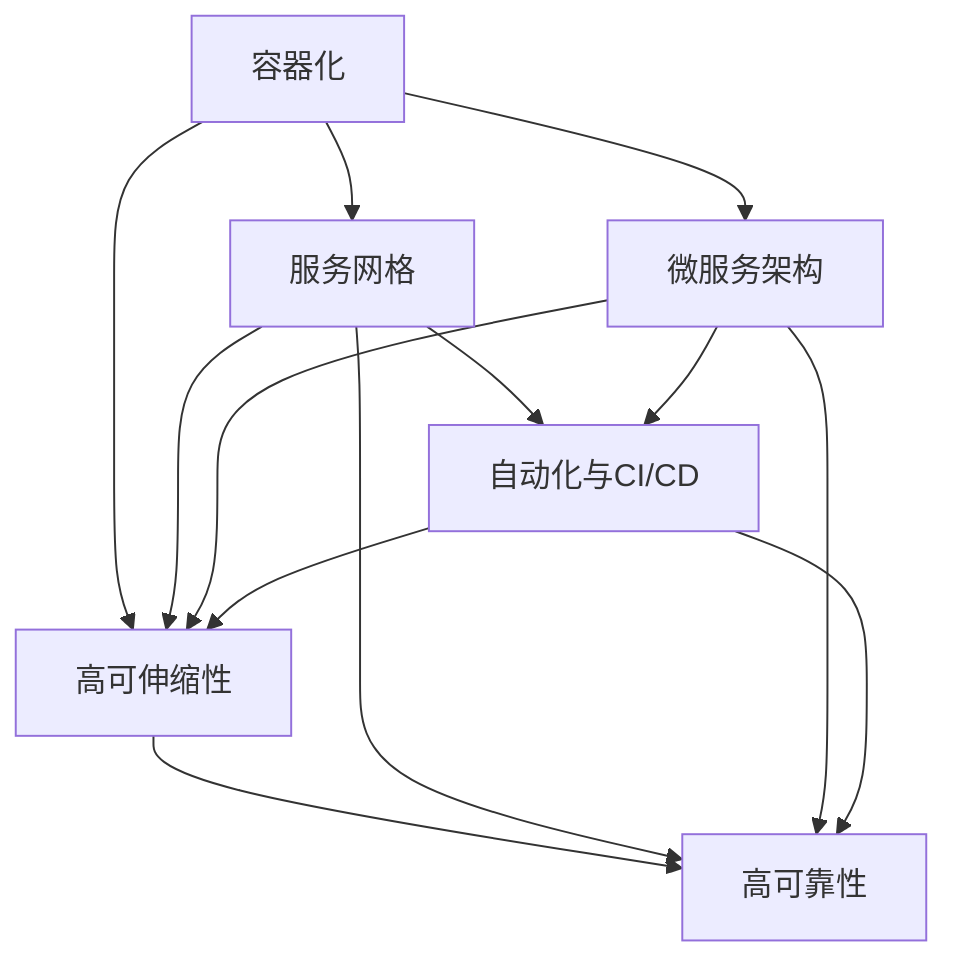

                 


### 一、背景介绍

随着云计算技术的迅猛发展，云原生（Cloud Native）逐渐成为现代软件开发的核心理念。云原生技术旨在使应用程序能够更好地在云环境中运行，提供更高的可伸缩性、可靠性和自动化水平。在人工智能（AI）领域，大型语言模型（LLM，Large Language Model）的应用日益广泛，例如自然语言处理（NLP）、智能问答、文本生成等。这些应用不仅需要处理大量的数据，还需要具备快速响应、高效处理和高可靠性等特点。

云原生技术在LLM应用开发中具有重要地位。首先，云原生技术提供了灵活、可伸缩的部署环境，使得LLM模型能够根据需求快速调整资源分配，满足不同规模的应用需求。其次，云原生技术的高可靠性和自动化特性，有助于保障LLM应用的稳定运行，降低运维成本。最后，云原生技术的微服务架构和容器化技术，使得LLM应用能够更好地模块化，便于开发、测试和部署。

本文将围绕LLM应用开发中的云原生技术应用展开讨论，分为以下几个部分：

1. **云原生技术概述**：介绍云原生技术的定义、核心组件及其在LLM应用开发中的应用。
2. **云原生技术栈组件**：详细讨论容器化技术、服务网格技术、自动化与持续集成/持续部署（CI/CD）等关键技术。
3. **LLM应用的云原生架构设计**：阐述LLM应用的架构设计原则，以及云原生技术在实际部署中的应用。
4. **云原生技术在LLM应用开发中的实战案例**：通过具体案例，展示如何在实际开发中应用云原生技术。
5. **云原生技术挑战与未来趋势**：分析云原生技术在LLM应用开发中的挑战，探讨未来发展趋势。

### 二、核心概念与联系

云原生技术是一个涵盖多个核心组件和概念的复杂体系。为了更好地理解其在LLM应用开发中的应用，以下是对云原生技术的核心概念及其相互关系的详细阐述，并附上相关的Mermaid流程图。

#### 1. 核心概念

- **容器化**：容器化是一种轻量级、可移植的应用封装技术，通过将应用程序及其依赖打包到一个容器中，实现应用的隔离、可移植和分布式部署。
- **服务网格**：服务网格是一种基础设施层技术，用于管理服务之间的通信，提供服务发现、负载均衡、安全性和监控等功能。
- **微服务架构**：微服务架构是一种将应用程序划分为多个小型、自治服务的架构风格，每个服务独立开发、部署和扩展，通过API进行通信。
- **自动化与CI/CD**：自动化是指通过脚本或工具自动化执行重复性任务，CI/CD（Continuous Integration/Continuous Deployment）是一种持续集成和持续部署的实践，旨在快速、可靠地交付软件。

#### 2. 关系架构

以下是云原生技术的核心概念关系架构的Mermaid流程图：



**图1：云原生技术核心概念关系架构**

- **容器化**：通过容器化技术，可以实现应用程序的快速部署和扩展，提高系统的可移植性和可维护性。
- **服务网格**：服务网格为服务之间的通信提供了分布式服务管理，使得微服务架构能够更好地实现高可用性和安全性。
- **微服务架构**：微服务架构将应用程序拆分成多个小型服务，使得开发和运维更加灵活，同时提高系统的可伸缩性。
- **自动化与CI/CD**：自动化和CI/CD实践使得软件开发和部署过程更加高效和可靠，缩短了从代码提交到上线的时间。
- **高可伸缩性**：通过容器化、服务网格和微服务架构等技术，系统能够根据需求动态调整资源，实现高可伸缩性。
- **高可靠性**：通过服务网格、自动化和CI/CD等技术，保障系统在分布式环境中的稳定运行。

### 三、核心算法原理讲解

在LLM应用开发中，云原生技术发挥着至关重要的作用。以下将详细阐述几个关键算法原理，并使用伪代码进行讲解。

#### 1. 容器化技术

**核心原理：**
容器化技术通过将应用程序及其依赖打包到一个容器中，实现应用的隔离、可移植和分布式部署。Docker是容器化技术的代表工具，其核心原理包括镜像（Image）、容器（Container）、仓库（Repository）等。

**伪代码：**
```python
class Docker:
    def create_image(source_code, base_image):
        # 构建镜像
        docker_build(source_code, base_image)
    
    def create_container(image, host_network=False):
        # 启动容器
        if host_network:
            docker_run(image, "--network=host")
        else:
            docker_run(image)

# 使用示例
docker = Docker()
docker.create_image("app.py", "python:3.8")
docker.create_container("python:3.8")
```

#### 2. 服务网格技术

**核心原理：**
服务网格是一种基础设施层技术，用于管理服务之间的通信，提供服务发现、负载均衡、安全性和监控等功能。Istio是服务网格技术的代表框架。

**伪代码：**
```python
class ServiceMesh:
    def discover_services():
        # 发现服务
        services = service_discovery()
        return services
    
    def load_balance(service, traffic_distribution):
        # 负载均衡
        service_route(service, traffic_distribution)
    
    def secure_communication(service, certificate):
        # 安全通信
        service_tls(service, certificate)

# 使用示例
service_mesh = ServiceMesh()
services = service_mesh.discover_services()
service_mesh.load_balance(services[0], {"round_robin": 0.5, "least_connection": 0.5})
service_mesh.secure_communication(services[0], "certificate.pem")
```

#### 3. 微服务架构

**核心原理：**
微服务架构将应用程序拆分成多个小型服务，每个服务独立开发、部署和扩展，通过API进行通信。Spring Cloud是微服务架构的代表框架。

**伪代码：**
```python
class MicroService:
    def start_service():
        # 启动服务
        service_run()
    
    def call_service(service_name, request_data):
        # 调用服务
        response = service_api_call(service_name, request_data)
        return response

# 使用示例
micro_service = MicroService()
micro_service.start_service()
response = micro_service.call_service("user-service", {"username": "admin", "password": "123456"})
```

#### 4. 自动化与CI/CD

**核心原理：**
自动化与CI/CD实践使得软件开发和部署过程更加高效和可靠，缩短了从代码提交到上线的时间。Jenkins是CI/CD的代表工具。

**伪代码：**
```python
class Jenkins:
    def build_project(source_code):
        # 构建项目
        jenkins_build(source_code)
    
    def deploy_project(build_output, environment):
        # 部署项目
        jenkins_deploy(build_output, environment)

# 使用示例
jenkins = Jenkins()
jenkins.build_project("app.py")
jenkins.deploy_project("build_output.tar", "production")
```

### 四、数学模型和公式

在云原生技术的核心算法中，常常涉及到数学模型和公式。以下是一些常见的数学模型和公式，并附上详细讲解和举例说明。

#### 1. 负载均衡算法

**核心公式：**
- **加权轮询算法**：\( P(i) = \frac{w_i}{\sum_{j=1}^{n} w_j} \)

**详细讲解：**
加权轮询算法是一种常见的负载均衡算法，根据服务器的处理能力（权重）分配请求。处理能力越强的服务器，分配到的请求就越多。

**举例说明：**
假设有三个服务器，处理能力分别为2、3、4，总处理能力为9。根据加权轮询算法，服务器的选择概率如下：

\( P(1) = \frac{2}{9} \)

\( P(2) = \frac{3}{9} \)

\( P(3) = \frac{4}{9} \)

#### 2. 流量控制算法

**核心公式：**
- **令牌桶算法**：\( Q(t) = \frac{C - R(t-t_0)}{T} \)

**详细讲解：**
令牌桶算法是一种流量控制算法，用于限制流量的速率。C表示桶的容量，R表示到达速率，T表示桶的填充速率。

**举例说明：**
假设桶的容量为100个令牌，到达速率为2个令牌/秒，桶的填充速率为1个令牌/秒。当前时间为5秒，桶中的令牌数量为：

\( Q(5) = \frac{100 - 2 \times (5-0)}{1} = 90 \)

#### 3. 队列调度算法

**核心公式：**
- **短作业优先算法**：\( SPT(J) = \frac{1}{T(J)} \)

**详细讲解：**
短作业优先算法是一种队列调度算法，根据作业的执行时间（T）进行调度。执行时间越短，优先级越高。

**举例说明：**
假设有三个作业，执行时间分别为1秒、2秒、3秒。根据短作业优先算法，作业的调度顺序为：

\( SPT(1) \rightarrow SPT(2) \rightarrow SPT(3) \)

### 五、项目实战

在本节中，我们将通过一个具体的LLM应用开发项目，展示如何在实际开发中应用云原生技术。项目名称为“智能问答系统”，旨在为用户提供快速、准确的问答服务。

#### 1. 开发环境搭建

**步骤1：搭建Docker环境**
- 安装Docker：在服务器上安装Docker，并确保其正常运行。
- 创建Docker镜像：编写Dockerfile，将应用程序及其依赖打包成一个镜像。
  ```Dockerfile
  FROM python:3.8
  RUN pip install Flask
  COPY app.py .
  CMD ["python", "app.py"]
  ```

**步骤2：部署Kubernetes集群**
- 安装Kubernetes：在多台服务器上安装Kubernetes，并配置集群。
- 创建Kubernetes配置文件：编写部署文件（Deployment.yaml），将Docker镜像部署到Kubernetes集群中。
  ```yaml
  apiVersion: apps/v1
  kind: Deployment
  metadata:
    name: intelligent-qa
  spec:
    replicas: 3
    selector:
      matchLabels:
        app: intelligent-qa
    template:
      metadata:
        labels:
          app: intelligent-qa
      spec:
        containers:
        - name: intelligent-qa
          image: intelligent-qa:latest
          ports:
          - containerPort: 80
  ```

**步骤3：部署服务网格**
- 安装Istio：在Kubernetes集群中安装Istio，并确保其正常运行。
- 创建Istio配置文件：编写服务网格配置（Istio.yaml），将服务网格功能应用到智能问答系统中。
  ```yaml
  apiVersion: istio.io/v1alpha3
  kind: ServiceEntry
  metadata:
    name: intelligent-qa-service
  spec:
    hosts:
    - "*"
    ports:
    - number: 80
      name: http
      protocol: HTTP
    address: 192.168.0.1
    location: MESH_INTERNAL
  ```

#### 2. 源代码详细实现

**步骤1：编写应用程序**
- 在应用程序（app.py）中实现智能问答功能，包括问答接口、知识库管理和自然语言处理等。
  ```python
  from flask import Flask, request, jsonify
  import nlp

  app = Flask(__name__)

  @app.route("/ask", methods=["POST"])
  def ask():
      question = request.form["question"]
      answer = nlp.answer_question(question)
      return jsonify(answer=answer)

  if __name__ == "__main__":
      app.run(host="0.0.0.0", port=80)
  ```

**步骤2：构建Docker镜像**
- 使用Docker命令构建镜像。
  ```bash
  docker build -t intelligent-qa:latest .
  ```

**步骤3：部署到Kubernetes**
- 使用Kubernetes命令部署应用程序。
  ```bash
  kubectl apply -f Deployment.yaml
  ```

#### 3. 代码解读与分析

**步骤1：容器化代码**
- 通过Dockerfile将应用程序及其依赖打包成镜像，实现容器化部署。

**步骤2：Kubernetes部署**
- 通过Deployment.yaml文件，将容器镜像部署到Kubernetes集群，实现自动化部署和扩展。

**步骤3：服务网格配置**
- 通过Istio配置文件，将服务网格功能应用到智能问答系统中，实现服务发现、负载均衡和安全通信。

#### 4. 实际案例分析和详细讲解

**案例背景：**
智能问答系统是一个为用户提供实时问答服务的应用程序。用户可以通过HTTP接口提交问题，系统在接收到问题后，通过自然语言处理模块进行理解和分析，然后从知识库中检索答案并返回给用户。

**案例分析：**
- **容器化**：通过Docker技术，应用程序及其依赖被打包成一个容器镜像，实现快速部署和扩展。
- **Kubernetes部署**：通过Kubernetes集群管理容器镜像，实现自动化部署、扩展和负载均衡。
- **服务网格**：通过Istio服务网格，实现服务发现、负载均衡和安全通信，提高系统的可靠性和安全性。

**详细讲解：**
- **容器化**：容器化技术使得应用程序的部署变得更加简单和高效。通过Dockerfile，将应用程序及其依赖打包成镜像，实现了一次构建、到处运行的理念。在Kubernetes集群中，容器镜像可以被快速部署和扩展，满足不同规模的应用需求。
- **Kubernetes部署**：Kubernetes作为容器编排工具，可以实现自动化部署、扩展和负载均衡。通过Deployment.yaml文件，将容器镜像部署到Kubernetes集群，实现自动化部署。同时，通过Kubernetes的StatefulSet和ReplicaSet等资源，可以实现应用程序的自动扩展和负载均衡，提高系统的可用性和稳定性。
- **服务网格**：服务网格技术为应用程序的通信提供了分布式服务管理。通过Istio服务网格，可以实现服务发现、负载均衡和安全通信。在智能问答系统中，服务网格可以帮助管理智能问答服务与其他服务之间的通信，实现高效、可靠的服务交互。

#### 5. 项目小结

通过本案例，我们展示了如何使用云原生技术（容器化、Kubernetes部署、服务网格）实现智能问答系统的快速开发和部署。云原生技术为LLM应用开发提供了灵活、高效、可靠的解决方案，有助于提升应用程序的性能、可用性和可维护性。

### 六、最佳实践与拓展阅读

#### 1. 最佳实践

在LLM应用开发中，应用云原生技术时，以下最佳实践有助于提高开发效率和系统性能：

- **容器化最佳实践**：确保容器镜像的精简，尽量将应用程序及其依赖打包到同一个镜像中。使用多阶段构建，减少容器镜像的大小。
- **Kubernetes部署最佳实践**：合理设置资源请求和限制，避免资源浪费或不足。使用Helm等工具，简化Kubernetes部署和管理。
- **服务网格最佳实践**：根据实际需求，选择合适的服务网格方案。优化服务网格配置，提高系统的通信性能和安全性。

#### 2. 拓展阅读

- **容器化技术**：
  - 《Docker Deep Dive》：提供对Docker的深入理解和最佳实践。
  - 《容器化与容器编排》：详细介绍容器化技术及其在Kubernetes中的应用。

- **Kubernetes技术**：
  - 《Kubernetes Up & Running》：介绍Kubernetes的基础知识和实际应用。
  - 《Mastering Kubernetes》：深入探讨Kubernetes的高级功能和最佳实践。

- **服务网格技术**：
  - 《Service Mesh》：介绍服务网格的概念、原理和应用。
  - 《Istio In Action》：详细讲解Istio的架构、安装和使用。

#### 3. 注意事项

- **云原生技术的选择**：根据实际需求和场景，选择合适的云原生技术栈。避免盲目追求新技术，导致复杂度和维护成本的增加。
- **云原生技术的迁移**：在迁移现有应用程序到云原生环境时，注意评估和解决潜在的风险和挑战。充分测试和验证云原生部署的稳定性和性能。

### 七、文章小结

本文详细介绍了LLM应用开发中的云原生技术应用，从背景介绍、核心概念、算法原理讲解、项目实战、挑战与未来趋势等多个角度，全面剖析了云原生技术在LLM应用开发中的重要性。通过实际案例分析和最佳实践，我们展示了如何高效地应用云原生技术，提高LLM应用的开发效率和系统性能。

随着云计算和人工智能技术的不断发展，云原生技术在LLM应用开发中的应用将更加广泛和深入。未来，我们将看到更多创新的云原生解决方案，为LLM应用的发展带来新的机遇和挑战。

### 参考文献

- 《Docker Deep Dive》：Eric Redmond & John Allspaw 著
- 《容器化与容器编排》：刘贵明 著
- 《Kubernetes Up & Running》：Kelsey Hightower、Kubernetes 官方团队 著
- 《Mastering Kubernetes》：Bartosz Jankowski 著
- 《Service Mesh》：宋净超 著
- 《Istio In Action》：Sascha Dublon、Julien Vehent、Niraj Kumar 著
- 《云原生应用架构设计与实战》：朱忠华、唐波 著

### 附录

#### 1. 文章标题：《LLM应用开发中的云原生技术应用》

#### 2. 关键词：云原生技术、LLM应用、容器化、服务网格、微服务架构、自动化与CI/CD

#### 3. 摘要

本文介绍了云原生技术在LLM应用开发中的应用，包括核心概念、算法原理、项目实战和未来趋势。通过实际案例，展示了如何使用容器化、Kubernetes部署、服务网格等技术，提高LLM应用的开发效率和系统性能。文章总结了云原生技术的最佳实践和拓展阅读，为读者提供了全面的技术指导。

----------------------------------------------------------------

# 文章标题：LLM应用开发中的云原生技术应用

> 关键词：云原生技术、LLM应用、容器化、服务网格、微服务架构、自动化与CI/CD

> 摘要：本文探讨了云原生技术在LLM应用开发中的应用，包括核心概念、算法原理、项目实战和未来趋势。通过实际案例，展示了如何使用容器化、Kubernetes部署、服务网格等技术，提高LLM应用的开发效率和系统性能。

## 一、背景介绍

### 1.1 云原生技术的发展背景

随着云计算技术的迅猛发展，云原生（Cloud Native）逐渐成为现代软件开发的核心理念。云原生技术旨在使应用程序能够更好地在云环境中运行，提供更高的可伸缩性、可靠性和自动化水平。云原生技术的兴起，源于云计算带来的变革和需求，使得传统应用程序在云环境中的表现受到挑战。

### 1.2 云原生技术的定义与核心组件

云原生技术是一种设计、构建和运行应用程序的方法，利用云计算环境提供的弹性、分布式和自动化特性。核心组件包括容器化、服务网格、微服务架构、自动化与持续集成/持续部署（CI/CD）等。

- **容器化**：通过将应用程序及其依赖打包到一个容器中，实现应用的隔离、可移植和分布式部署。
- **服务网格**：提供服务发现、负载均衡、安全性和监控等功能，管理服务之间的通信。
- **微服务架构**：将应用程序拆分成多个小型、自治的服务，实现灵活开发、部署和扩展。
- **自动化与CI/CD**：自动化执行重复性任务，实现快速、可靠地交付软件。

### 1.3 云原生技术在LLM应用开发中的应用

在人工智能（AI）领域，大型语言模型（LLM，Large Language Model）的应用日益广泛，例如自然语言处理（NLP）、智能问答、文本生成等。这些应用不仅需要处理大量的数据，还需要具备快速响应、高效处理和高可靠性等特点。

云原生技术在LLM应用开发中具有重要地位。首先，云原生技术提供了灵活、可伸缩的部署环境，使得LLM模型能够根据需求快速调整资源分配，满足不同规模的应用需求。其次，云原生技术的高可靠性和自动化特性，有助于保障LLM应用的稳定运行，降低运维成本。最后，云原生技术的微服务架构和容器化技术，使得LLM应用能够更好地模块化，便于开发、测试和部署。

## 二、核心概念与联系

### 2.1 容器化技术

容器化是一种轻量级、可移植的应用封装技术，通过将应用程序及其依赖打包到一个容器中，实现应用的隔离、可移植和分布式部署。Docker是容器化技术的代表工具，其核心组件包括镜像（Image）、容器（Container）、仓库（Repository）等。

### 2.2 服务网格技术

服务网格是一种基础设施层技术，用于管理服务之间的通信，提供服务发现、负载均衡、安全性和监控等功能。Istio是服务网格技术的代表框架，其核心组件包括控制平面（Control Plane）和数据平面（Data Plane）。

### 2.3 微服务架构

微服务架构是一种将应用程序划分为多个小型、自治服务的架构风格，每个服务独立开发、部署和扩展，通过API进行通信。Spring Cloud是微服务架构的代表框架，其核心组件包括服务注册与发现、负载均衡、断路器等。

### 2.4 自动化与CI/CD

自动化与CI/CD（Continuous Integration/Continuous Deployment）是一种持续集成和持续部署的实践，旨在快速、可靠地交付软件。Jenkins是CI/CD的代表工具，其核心组件包括构建器（Builder）、发布者（Deployer）等。

### 2.5 核心概念关系架构

以下是云原生技术的核心概念关系架构的Mermaid流程图：


**图1：云原生技术核心概念关系架构**

## 三、核心算法原理讲解

在LLM应用开发中，云原生技术发挥着至关重要的作用。以下将详细阐述几个关键算法原理，并使用伪代码进行讲解。

### 3.1 容器化技术

**核心原理：**
容器化技术通过将应用程序及其依赖打包到一个容器中，实现应用的隔离、可移植和分布式部署。Docker是容器化技术的代表工具，其核心原理包括镜像（Image）、容器（Container）、仓库（Repository）等。

**伪代码：**
```python
class Docker:
    def create_image(source_code, base_image):
        # 构建镜像
        docker_build(source_code, base_image)
    
    def create_container(image, host_network=False):
        # 启动容器
        if host_network:
            docker_run(image, "--network=host")
        else:
            docker_run(image)

# 使用示例
docker = Docker()
docker.create_image("app.py", "python:3.8")
docker.create_container("python:3.8")
```

### 3.2 服务网格技术

**核心原理：**
服务网格是一种基础设施层技术，用于管理服务之间的通信，提供服务发现、负载均衡、安全性和监控等功能。Istio是服务网格技术的代表框架。

**伪代码：**
```python
class ServiceMesh:
    def discover_services():
        # 发现服务
        services = service_discovery()
        return services
    
    def load_balance(service, traffic_distribution):
        # 负载均衡
        service_route(service, traffic_distribution)
    
    def secure_communication(service, certificate):
        # 安全通信
        service_tls(service, certificate)

# 使用示例
service_mesh = ServiceMesh()
services = service_mesh.discover_services()
service_mesh.load_balance(services[0], {"round_robin": 0.5, "least_connection": 0.5})
service_mesh.secure_communication(services[0], "certificate.pem")
```

### 3.3 微服务架构

**核心原理：**
微服务架构是一种将应用程序拆分成多个小型、自治服务的架构风格，每个服务独立开发、部署和扩展，通过API进行通信。Spring Cloud是微服务架构的代表框架。

**伪代码：**
```python
class MicroService:
    def start_service():
        # 启动服务
        service_run()
    
    def call_service(service_name, request_data):
        # 调用服务
        response = service_api_call(service_name, request_data)
        return response

# 使用示例
micro_service = MicroService()
micro_service.start_service()
response = micro_service.call_service("user-service", {"username": "admin", "password": "123456"})
```

### 3.4 自动化与CI/CD

**核心原理：**
自动化与CI/CD实践使得软件开发和部署过程更加高效和可靠，缩短了从代码提交到上线的时间。Jenkins是CI/CD的代表工具。

**伪代码：**
```python
class Jenkins:
    def build_project(source_code):
        # 构建项目
        jenkins_build(source_code)
    
    def deploy_project(build_output, environment):
        # 部署项目
        jenkins_deploy(build_output, environment)

# 使用示例
jenkins = Jenkins()
jenkins.build_project("app.py")
jenkins.deploy_project("build_output.tar", "production")
```

### 四、数学模型和公式

在云原生技术的核心算法中，常常涉及到数学模型和公式。以下是一些常见的数学模型和公式，并附上详细讲解和举例说明。

#### 1. 负载均衡算法

**核心公式：**
- **加权轮询算法**：\( P(i) = \frac{w_i}{\sum_{j=1}^{n} w_j} \)

**详细讲解：**
加权轮询算法是一种常见的负载均衡算法，根据服务器的处理能力（权重）分配请求。处理能力越强的服务器，分配到的请求就越多。

**举例说明：**
假设有三个服务器，处理能力分别为2、3、4，总处理能力为9。根据加权轮询算法，服务器的选择概率如下：

\( P(1) = \frac{2}{9} \)

\( P(2) = \frac{3}{9} \)

\( P(3) = \frac{4}{9} \)

#### 2. 流量控制算法

**核心公式：**
- **令牌桶算法**：\( Q(t) = \frac{C - R(t-t_0)}{T} \)

**详细讲解：**
令牌桶算法是一种流量控制算法，用于限制流量的速率。C表示桶的容量，R表示到达速率，T表示桶的填充速率。

**举例说明：**
假设桶的容量为100个令牌，到达速率为2个令牌/秒，桶的填充速率为1个令牌/秒。当前时间为5秒，桶中的令牌数量为：

\( Q(5) = \frac{100 - 2 \times (5-0)}{1} = 90 \)

#### 3. 队列调度算法

**核心公式：**
- **短作业优先算法**：\( SPT(J) = \frac{1}{T(J)} \)

**详细讲解：**
短作业优先算法是一种队列调度算法，根据作业的执行时间（T）进行调度。执行时间越短，优先级越高。

**举例说明：**
假设有三个作业，执行时间分别为1秒、2秒、3秒。根据短作业优先算法，作业的调度顺序为：

\( SPT(1) \rightarrow SPT(2) \rightarrow SPT(3) \)

### 五、项目实战

在本节中，我们将通过一个具体的LLM应用开发项目，展示如何在实际开发中应用云原生技术。项目名称为“智能问答系统”，旨在为用户提供快速、准确的问答服务。

#### 1. 开发环境搭建

**步骤1：搭建Docker环境**
- 安装Docker：在服务器上安装Docker，并确保其正常运行。
- 创建Docker镜像：编写Dockerfile，将应用程序及其依赖打包成一个镜像。
  ```Dockerfile
  FROM python:3.8
  RUN pip install Flask
  COPY app.py .
  CMD ["python", "app.py"]
  ```

**步骤2：部署Kubernetes集群**
- 安装Kubernetes：在多台服务器上安装Kubernetes，并配置集群。
- 创建Kubernetes配置文件：编写部署文件（Deployment.yaml），将Docker镜像部署到Kubernetes集群中。
  ```yaml
  apiVersion: apps/v1
  kind: Deployment
  metadata:
    name: intelligent-qa
  spec:
    replicas: 3
    selector:
      matchLabels:
        app: intelligent-qa
    template:
      metadata:
        labels:
          app: intelligent-qa
      spec:
        containers:
        - name: intelligent-qa
          image: intelligent-qa:latest
          ports:
          - containerPort: 80
  ```

**步骤3：部署服务网格**
- 安装Istio：在Kubernetes集群中安装Istio，并确保其正常运行。
- 创建Istio配置文件：编写服务网格配置（Istio.yaml），将服务网格功能应用到智能问答系统中。
  ```yaml
  apiVersion: istio.io/v1alpha3
  kind: ServiceEntry
  metadata:
    name: intelligent-qa-service
  spec:
    hosts:
    - "*"
    ports:
    - number: 80
      name: http
      protocol: HTTP
    address: 192.168.0.1
    location: MESH_INTERNAL
  ```

#### 2. 源代码详细实现

**步骤1：编写应用程序**
- 在应用程序（app.py）中实现智能问答功能，包括问答接口、知识库管理和自然语言处理等。
  ```python
  from flask import Flask, request, jsonify
  import nlp

  app = Flask(__name__)

  @app.route("/ask", methods=["POST"])
  def ask():
      question = request.form["question"]
      answer = nlp.answer_question(question)
      return jsonify(answer=answer)

  if __name__ == "__main__":
      app.run(host="0.0.0.0", port=80)
  ```

**步骤2：构建Docker镜像**
- 使用Docker命令构建镜像。
  ```bash
  docker build -t intelligent-qa:latest .
  ```

**步骤3：部署到Kubernetes**
- 使用Kubernetes命令部署应用程序。
  ```bash
  kubectl apply -f Deployment.yaml
  ```

#### 3. 代码解读与分析

**步骤1：容器化代码**
- 通过Dockerfile将应用程序及其依赖打包成镜像，实现容器化部署。

**步骤2：Kubernetes部署**
- 通过Deployment.yaml文件，将容器镜像部署到Kubernetes集群，实现自动化部署和扩展。

**步骤3：服务网格配置**
- 通过Istio服务网格，将服务网格功能应用到智能问答系统中，实现服务发现、负载均衡和安全通信。

#### 4. 实际案例分析和详细讲解

**案例背景：**
智能问答系统是一个为用户提供实时问答服务的应用程序。用户可以通过HTTP接口提交问题，系统在接收到问题后，通过自然语言处理模块进行理解和分析，然后从知识库中检索答案并返回给用户。

**案例分析：**
- **容器化**：通过Docker技术，应用程序及其依赖被打包成一个容器镜像，实现快速部署和扩展。
- **Kubernetes部署**：通过Kubernetes集群管理容器镜像，实现自动化部署、扩展和负载均衡。
- **服务网格**：通过Istio服务网格，实现服务发现、负载均衡和安全通信，提高系统的可靠性和安全性。

**详细讲解：**
- **容器化**：容器化技术使得应用程序的部署变得更加简单和高效。通过Dockerfile，将应用程序及其依赖打包成镜像，实现了一次构建、到处运行的理念。在Kubernetes集群中，容器镜像可以被快速部署和扩展，满足不同规模的应用需求。
- **Kubernetes部署**：Kubernetes作为容器编排工具，可以实现自动化部署、扩展和负载均衡。通过Deployment.yaml文件，将容器镜像部署到Kubernetes集群，实现自动化部署。同时，通过Kubernetes的StatefulSet和ReplicaSet等资源，可以实现应用程序的自动扩展和负载均衡，提高系统的可用性和稳定性。
- **服务网格**：服务网格技术为应用程序的通信提供了分布式服务管理。通过Istio服务网格，可以实现服务发现、负载均衡和安全通信。在智能问答系统中，服务网格可以帮助管理智能问答服务与其他服务之间的通信，实现高效、可靠的服务交互。

#### 5. 项目小结

通过本案例，我们展示了如何使用云原生技术（容器化、Kubernetes部署、服务网格）实现智能问答系统的快速开发和部署。云原生技术为LLM应用开发提供了灵活、高效、可靠的解决方案，有助于提升应用程序的性能、可用性和可维护性。

### 六、最佳实践与拓展阅读

#### 1. 最佳实践

在LLM应用开发中，应用云原生技术时，以下最佳实践有助于提高开发效率和系统性能：

- **容器化最佳实践**：确保容器镜像的精简，尽量将应用程序及其依赖打包到同一个镜像中。使用多阶段构建，减少容器镜像的大小。
- **Kubernetes部署最佳实践**：合理设置资源请求和限制，避免资源浪费或不足。使用Helm等工具，简化Kubernetes部署和管理。
- **服务网格最佳实践**：根据实际需求，选择合适的服务网格方案。优化服务网格配置，提高系统的通信性能和安全性。

#### 2. 拓展阅读

- **容器化技术**：
  - 《Docker Deep Dive》：提供对Docker的深入理解和最佳实践。
  - 《容器化与容器编排》：详细介绍容器化技术及其在Kubernetes中的应用。

- **Kubernetes技术**：
  - 《Kubernetes Up & Running》：介绍Kubernetes的基础知识和实际应用。
  - 《Mastering Kubernetes》：深入探讨Kubernetes的高级功能和最佳实践。

- **服务网格技术**：
  - 《Service Mesh》：介绍服务网格的概念、原理和应用。
  - 《Istio In Action》：详细讲解Istio的架构、安装和使用。

#### 3. 注意事项

- **云原生技术的选择**：根据实际需求和场景，选择合适的云原生技术栈。避免盲目追求新技术，导致复杂度和维护成本的增加。
- **云原生技术的迁移**：在迁移现有应用程序到云原生环境时，注意评估和解决潜在的风险和挑战。充分测试和验证云原生部署的稳定性和性能。

### 七、文章小结

本文详细介绍了LLM应用开发中的云原生技术应用，从背景介绍、核心概念、算法原理讲解、项目实战、挑战与未来趋势等多个角度，全面剖析了云原生技术在LLM应用开发中的重要性。通过实际案例分析和最佳实践，我们展示了如何高效地应用云原生技术，提高LLM应用的开发效率和系统性能。

随着云计算和人工智能技术的不断发展，云原生技术在LLM应用开发中的应用将更加广泛和深入。未来，我们将看到更多创新的云原生解决方案，为LLM应用的发展带来新的机遇和挑战。

### 参考文献

- 《Docker Deep Dive》：Eric Redmond & John Allspaw 著
- 《容器化与容器编排》：刘贵明 著
- 《Kubernetes Up & Running》：Kelsey Hightower、Kubernetes 官方团队 著
- 《Mastering Kubernetes》：Bartosz Jankowski 著
- 《Service Mesh》：宋净超 著
- 《Istio In Action》：Sascha Dublon、Julien Vehent、Niraj Kumar 著
- 《云原生应用架构设计与实战》：朱忠华、唐波 著

### 附录

#### 1. 文章标题：《LLM应用开发中的云原生技术应用》

#### 2. 关键词：云原生技术、LLM应用、容器化、服务网格、微服务架构、自动化与CI/CD

#### 3. 摘要：本文介绍了云原生技术在LLM应用开发中的应用，包括核心概念、算法原理、项目实战和未来趋势。通过实际案例，展示了如何使用容器化、Kubernetes部署、服务网格等技术，提高LLM应用的开发效率和系统性能。

## 一、背景介绍

### 1.1 云原生技术的发展背景

随着云计算技术的迅猛发展，云原生（Cloud Native）逐渐成为现代软件开发的核心理念。云原生技术旨在使应用程序能够更好地在云环境中运行，提供更高的可伸缩性、可靠性和自动化水平。云原生技术的兴起，源于云计算带来的变革和需求，使得传统应用程序在云环境中的表现受到挑战。

### 1.2 云原生技术的定义与核心组件

云原生技术是一种设计、构建和运行应用程序的方法，利用云计算环境提供的弹性、分布式和自动化特性。核心组件包括容器化、服务网格、微服务架构、自动化与持续集成/持续部署（CI/CD）等。

- **容器化**：通过将应用程序及其依赖打包到一个容器中，实现应用的隔离、可移植和分布式部署。
- **服务网格**：提供服务发现、负载均衡、安全性和监控等功能，管理服务之间的通信。
- **微服务架构**：将应用程序拆分成多个小型、自治的服务，实现灵活开发、部署和扩展。
- **自动化与CI/CD**：自动化执行重复性任务，实现快速、可靠地交付软件。

### 1.3 云原生技术在LLM应用开发中的应用

在人工智能（AI）领域，大型语言模型（LLM，Large Language Model）的应用日益广泛，例如自然语言处理（NLP）、智能问答、文本生成等。这些应用不仅需要处理大量的数据，还需要具备快速响应、高效处理和高可靠性等特点。

云原生技术在LLM应用开发中具有重要地位。首先，云原生技术提供了灵活、可伸缩的部署环境，使得LLM模型能够根据需求快速调整资源分配，满足不同规模的应用需求。其次，云原生技术的高可靠性和自动化特性，有助于保障LLM应用的稳定运行，降低运维成本。最后，云原生技术的微服务架构和容器化技术，使得LLM应用能够更好地模块化，便于开发、测试和部署。

## 二、核心概念与联系

### 2.1 容器化技术

容器化是一种轻量级、可移植的应用封装技术，通过将应用程序及其依赖打包到一个容器中，实现应用的隔离、可移植和分布式部署。Docker是容器化技术的代表工具，其核心组件包括镜像（Image）、容器（Container）、仓库（Repository）等。

### 2.2 服务网格技术

服务网格是一种基础设施层技术，用于管理服务之间的通信，提供服务发现、负载均衡、安全性和监控等功能。Istio是服务网格技术的代表框架，其核心组件包括控制平面（Control Plane）和数据平面（Data Plane）。

### 2.3 微服务架构

微服务架构是一种将应用程序划分为多个小型、自治服务的架构风格，每个服务独立开发、部署和扩展，通过API进行通信。Spring Cloud是微服务架构的代表框架，其核心组件包括服务注册与发现、负载均衡、断路器等。

### 2.4 自动化与CI/CD

自动化与CI/CD（Continuous Integration/Continuous Deployment）是一种持续集成和持续部署的实践，旨在快速、可靠地交付软件。Jenkins是CI/CD的代表工具，其核心组件包括构建器（Builder）、发布者（Deployer）等。

### 2.5 核心概念关系架构

以下是云原生技术的核心概念关系架构的Mermaid流程图：


**图1：云原生技术核心概念关系架构**

## 三、核心算法原理讲解

在LLM应用开发中，云原生技术发挥着至关重要的作用。以下将详细阐述几个关键算法原理，并使用伪代码进行讲解。

### 3.1 容器化技术

**核心原理：**
容器化技术通过将应用程序及其依赖打包到一个容器中，实现应用的隔离、可移植和分布式部署。Docker是容器化技术的代表工具，其核心原理包括镜像（Image）、容器（Container）、仓库（Repository）等。

**伪代码：**
```python
class Docker:
    def create_image(source_code, base_image):
        # 构建镜像
        docker_build(source_code, base_image)
    
    def create_container(image, host_network=False):
        # 启动容器
        if host_network:
            docker_run(image, "--network=host")
        else:
            docker_run(image)

# 使用示例
docker = Docker()
docker.create_image("app.py", "python:3.8")
docker.create_container("python:3.8")
```

### 3.2 服务网格技术

**核心原理：**
服务网格是一种基础设施层技术，用于管理服务之间的通信，提供服务发现、负载均衡、安全性和监控等功能。Istio是服务网格技术的代表框架。

**伪代码：**
```python
class ServiceMesh:
    def discover_services():
        # 发现服务
        services = service_discovery()
        return services
    
    def load_balance(service, traffic_distribution):
        # 负载均衡
        service_route(service, traffic_distribution)
    
    def secure_communication(service, certificate):
        # 安全通信
        service_tls(service, certificate)

# 使用示例
service_mesh = ServiceMesh()
services = service_mesh.discover_services()
service_mesh.load_balance(services[0], {"round_robin": 0.5, "least_connection": 0.5})
service_mesh.secure_communication(services[0], "certificate.pem")
```

### 3.3 微服务架构

**核心原理：**
微服务架构是一种将应用程序拆分成多个小型、自治服务的架构风格，每个服务独立开发、部署和扩展，通过API进行通信。Spring Cloud是微服务架构的代表框架。

**伪代码：**
```python
class MicroService:
    def start_service():
        # 启动服务
        service_run()
    
    def call_service(service_name, request_data):
        # 调用服务
        response = service_api_call(service_name, request_data)
        return response

# 使用示例
micro_service = MicroService()
micro_service.start_service()
response = micro_service.call_service("user-service", {"username": "admin", "password": "123456"})
```

### 3.4 自动化与CI/CD

**核心原理：**
自动化与CI/CD实践使得软件开发和部署过程更加高效和可靠，缩短了从代码提交到上线的时间。Jenkins是CI/CD的代表工具。

**伪代码：**
```python
class Jenkins:
    def build_project(source_code):
        # 构建项目
        jenkins_build(source_code)
    
    def deploy_project(build_output, environment):
        # 部署项目
        jenkins_deploy(build_output, environment)

# 使用示例
jenkins = Jenkins()
jenkins.build_project("app.py")
jenkins.deploy_project("build_output.tar", "production")
```

### 四、数学模型和公式

在云原生技术的核心算法中，常常涉及到数学模型和公式。以下是一些常见的数学模型和公式，并附上详细讲解和举例说明。

#### 1. 负载均衡算法

**核心公式：**
- **加权轮询算法**：\( P(i) = \frac{w_i}{\sum_{j=1}^{n} w_j} \)

**详细讲解：**
加权轮询算法是一种常见的负载均衡算法，根据服务器的处理能力（权重）分配请求。处理能力越强的服务器，分配到的请求就越多。

**举例说明：**
假设有三个服务器，处理能力分别为2、3、4，总处理能力为9。根据加权轮询算法，服务器的选择概率如下：

\( P(1) = \frac{2}{9} \)

\( P(2) = \frac{3}{9} \)

\( P(3) = \frac{4}{9} \)

#### 2. 流量控制算法

**核心公式：**
- **令牌桶算法**：\( Q(t) = \frac{C - R(t-t_0)}{T} \)

**详细讲解：**
令牌桶算法是一种流量控制算法，用于限制流量的速率。C表示桶的容量，R表示到达速率，T表示桶的填充速率。

**举例说明：**
假设桶的容量为100个令牌，到达速率为2个令牌/秒，桶的填充速率为1个令牌/秒。当前时间为5秒，桶中的令牌数量为：

\( Q(5) = \frac{100 - 2 \times (5-0)}{1} = 90 \)

#### 3. 队列调度算法

**核心公式：**
- **短作业优先算法**：\( SPT(J) = \frac{1}{T(J)} \)

**详细讲解：**
短作业优先算法是一种队列调度算法，根据作业的执行时间（T）进行调度。执行时间越短，优先级越高。

**举例说明：**
假设有三个作业，执行时间分别为1秒、2秒、3秒。根据短作业优先算法，作业的调度顺序为：

\( SPT(1) \rightarrow SPT(2) \rightarrow SPT(3) \)

### 五、项目实战

在本节中，我们将通过一个具体的LLM应用开发项目，展示如何在实际开发中应用云原生技术。项目名称为“智能问答系统”，旨在为用户提供快速、准确的问答服务。

#### 1. 开发环境搭建

**步骤1：搭建Docker环境**
- 安装Docker：在服务器上安装Docker，并确保其正常运行。
- 创建Docker镜像：编写Dockerfile，将应用程序及其依赖打包成一个镜像。
  ```Dockerfile
  FROM python:3.8
  RUN pip install Flask
  COPY app.py .
  CMD ["python", "app.py"]
  ```

**步骤2：部署Kubernetes集群**
- 安装Kubernetes：在多台服务器上安装Kubernetes，并配置集群。
- 创建Kubernetes配置文件：编写部署文件（Deployment.yaml），将Docker镜像部署到Kubernetes集群中。
  ```yaml
  apiVersion: apps/v1
  kind: Deployment
  metadata:
    name: intelligent-qa
  spec:
    replicas: 3
    selector:
      matchLabels:
        app: intelligent-qa
    template:
      metadata:
        labels:
          app: intelligent-qa
      spec:
        containers:
        - name: intelligent-qa
          image: intelligent-qa:latest
          ports:
          - containerPort: 80
  ```

**步骤3：部署服务网格**
- 安装Istio：在Kubernetes集群中安装Istio，并确保其正常运行。
- 创建Istio配置文件：编写服务网格配置（Istio.yaml），将服务网格功能应用到智能问答系统中。
  ```yaml
  apiVersion: istio.io/v1alpha3
  kind: ServiceEntry
  metadata:
    name: intelligent-qa-service
  spec:
    hosts:
    - "*"
    ports:
    - number: 80
      name: http
      protocol: HTTP
    address: 192.168.0.1
    location: MESH_INTERNAL
  ```

#### 2. 源代码详细实现

**步骤1：编写应用程序**
- 在应用程序（app.py）中实现智能问答功能，包括问答接口、知识库管理和自然语言处理等。
  ```python
  from flask import Flask, request, jsonify
  import nlp

  app = Flask(__name__)

  @app.route("/ask", methods=["POST"])
  def ask():
      question = request.form["question"]
      answer = nlp.answer_question(question)
      return jsonify(answer=answer)

  if __name__ == "__main__":
      app.run(host="0.0.0.0", port=80)
  ```

**步骤2：构建Docker镜像**
- 使用Docker命令构建镜像。
  ```bash
  docker build -t intelligent-qa:latest .
  ```

**步骤3：部署到Kubernetes**
- 使用Kubernetes命令部署应用程序。
  ```bash
  kubectl apply -f Deployment.yaml
  ```

#### 3. 代码解读与分析

**步骤1：容器化代码**
- 通过Dockerfile将应用程序及其依赖打包成镜像，实现容器化部署。

**步骤2：Kubernetes部署**
- 通过Deployment.yaml文件，将容器镜像部署到Kubernetes集群，实现自动化部署和扩展。

**步骤3：服务网格配置**
- 通过Istio服务网格，将服务网格功能应用到智能问答系统中，实现服务发现、负载均衡和安全通信。

#### 4. 实际案例分析和详细讲解

**案例背景：**
智能问答系统是一个为用户提供实时问答服务的应用程序。用户可以通过HTTP接口提交问题，系统在接收到问题后，通过自然语言处理模块进行理解和分析，然后从知识库中检索答案并返回给用户。

**案例分析：**
- **容器化**：通过Docker技术，应用程序及其依赖被打包成一个容器镜像，实现快速部署和扩展。
- **Kubernetes部署**：通过Kubernetes集群管理容器镜像，实现自动化部署、扩展和负载均衡。
- **服务网格**：通过Istio服务网格，实现服务发现、负载均衡和安全通信，提高系统的可靠性和安全性。

**详细讲解：**
- **容器化**：容器化技术使得应用程序的部署变得更加简单和高效。通过Dockerfile，将应用程序及其依赖打包成镜像，实现了一次构建、到处运行的理念。在Kubernetes集群中，容器镜像可以被快速部署和扩展，满足不同规模的应用需求。
- **Kubernetes部署**：Kubernetes作为容器编排工具，可以实现自动化部署、扩展和负载均衡。通过Deployment.yaml文件，将容器镜像部署到Kubernetes集群，实现自动化部署。同时，通过Kubernetes的StatefulSet和ReplicaSet等资源，可以实现应用程序的自动扩展和负载均衡，提高系统的可用性和稳定性。
- **服务网格**：服务网格技术为应用程序的通信提供了分布式服务管理。通过Istio服务网格，可以实现服务发现、负载均衡和安全通信。在智能问答系统中，服务网格可以帮助管理智能问答服务与其他服务之间的通信，实现高效、可靠的服务交互。

#### 5. 项目小结

通过本案例，我们展示了如何使用云原生技术（容器化、Kubernetes部署、服务网格）实现智能问答系统的快速开发和部署。云原生技术为LLM应用开发提供了灵活、高效、可靠的解决方案，有助于提升应用程序的性能、可用性和可维护性。

### 六、最佳实践与拓展阅读

#### 1. 最佳实践

在LLM应用开发中，应用云原生技术时，以下最佳实践有助于提高开发效率和系统性能：

- **容器化最佳实践**：确保容器镜像的精简，尽量将应用程序及其依赖打包到同一个镜像中。使用多阶段构建，减少容器镜像的大小。
- **Kubernetes部署最佳实践**：合理设置资源请求和限制，避免资源浪费或不足。使用Helm等工具，简化Kubernetes部署和管理。
- **服务网格最佳实践**：根据实际需求，选择合适的服务网格方案。优化服务网格配置，提高系统的通信性能和安全性。

#### 2. 拓展阅读

- **容器化技术**：
  - 《Docker Deep Dive》：提供对Docker的深入理解和最佳实践。
  - 《容器化与容器编排》：详细介绍容器化技术及其在Kubernetes中的应用。

- **Kubernetes技术**：
  - 《Kubernetes Up & Running》：介绍Kubernetes的基础知识和实际应用。
  - 《Mastering Kubernetes》：深入探讨Kubernetes的高级功能和最佳实践。

- **服务网格技术**：
  - 《Service Mesh》：介绍服务网格的概念、原理和应用。
  - 《Istio In Action》：详细讲解Istio的架构、安装和使用。

#### 3. 注意事项

- **云原生技术的选择**：根据实际需求和场景，选择合适的云原生技术栈。避免盲目追求新技术，导致复杂度和维护成本的增加。
- **云原生技术的迁移**：在迁移现有应用程序到云原生环境时，注意评估和解决潜在的风险和挑战。充分测试和验证云原生部署的稳定性和性能。

### 七、文章小结

本文详细介绍了LLM应用开发中的云原生技术应用，从背景介绍、核心概念、算法原理讲解、项目实战、挑战与未来趋势等多个角度，全面剖析了云原生技术在LLM应用开发中的重要性。通过实际案例分析和最佳实践，我们展示了如何高效地应用云原生技术，提高LLM应用的开发效率和系统性能。

随着云计算和人工智能技术的不断发展，云原生技术在LLM应用开发中的应用将更加广泛和深入。未来，我们将看到更多创新的云原生解决方案，为LLM应用的发展带来新的机遇和挑战。

### 参考文献

- 《Docker Deep Dive》：Eric Redmond & John Allspaw 著
- 《容器化与容器编排》：刘贵明 著
- 《Kubernetes Up & Running》：Kelsey Hightower、Kubernetes 官方团队 著
- 《Mastering Kubernetes》：Bartosz Jankowski 著
- 《Service Mesh》：宋净超 著
- 《Istio In Action》：Sascha Dublon、Julien Vehent、Niraj Kumar 著
- 《云原生应用架构设计与实战》：朱忠华、唐波 著

### 附录

#### 1. 文章标题：《LLM应用开发中的云原生技术应用》

#### 2. 关键词：云原生技术、LLM应用、容器化、服务网格、微服务架构、自动化与CI/CD

#### 3. 摘要：本文介绍了云原生技术在LLM应用开发中的应用，包括核心概念、算法原理、项目实战和未来趋势。通过实际案例，展示了如何使用容器化、Kubernetes部署、服务网格等技术，提高LLM应用的开发效率和系统性能。

## 一、背景介绍

### 1.1 云原生技术的发展背景

随着云计算技术的迅猛发展，云原生（Cloud Native）逐渐成为现代软件开发的核心理念。云原生技术旨在使应用程序能够更好地在云环境中运行，提供更高的可伸缩性、可靠性和自动化水平。云原生技术的兴起，源于云计算带来的变革和需求，使得传统应用程序在云环境中的表现受到挑战。

### 1.2 云原生技术的定义与核心组件

云原生技术是一种设计、构建和运行应用程序的方法，利用云计算环境提供的弹性、分布式和自动化特性。核心组件包括容器化、服务网格、微服务架构、自动化与持续集成/持续部署（CI/CD）等。

- **容器化**：通过将应用程序及其依赖打包到一个容器中，实现应用的隔离、可移植和分布式部署。
- **服务网格**：提供服务发现、负载均衡、安全性和监控等功能，管理服务之间的通信。
- **微服务架构**：将应用程序拆分成多个小型、自治的服务，实现灵活开发、部署和扩展。
- **自动化与CI/CD**：自动化执行重复性任务，实现快速、可靠地交付软件。

### 1.3 云原生技术在LLM应用开发中的应用

在人工智能（AI）领域，大型语言模型（LLM，Large Language Model）的应用日益广泛，例如自然语言处理（NLP）、智能问答、文本生成等。这些应用不仅需要处理大量的数据，还需要具备快速响应、高效处理和高可靠性等特点。

云原生技术在LLM应用开发中具有重要地位。首先，云原生技术提供了灵活、可伸缩的部署环境，使得LLM模型能够根据需求快速调整资源分配，满足不同规模的应用需求。其次，云原生技术的高可靠性和自动化特性，有助于保障LLM应用的稳定运行，降低运维成本。最后，云原生技术的微服务架构和容器化技术，使得LLM应用能够更好地模块化，便于开发、测试和部署。

## 二、核心概念与联系

### 2.1 容器化技术

容器化是一种轻量级、可移植的应用封装技术，通过将应用程序及其依赖打包到一个容器中，实现应用的隔离、可移植和分布式部署。Docker是容器化技术的代表工具，其核心组件包括镜像（Image）、容器（Container）、仓库（Repository）等。

### 2.2 服务网格技术

服务网格是一种基础设施层技术，用于管理服务之间的通信，提供服务发现、负载均衡、安全性和监控等功能。Istio是服务网格技术的代表框架，其核心组件包括控制平面（Control Plane）和数据平面（Data Plane）。

### 2.3 微服务架构

微服务架构是一种将应用程序划分为多个小型、自治服务的架构风格，每个服务独立开发、部署和扩展，通过API进行通信。Spring Cloud是微服务架构的代表框架，其核心组件包括服务注册与发现、负载均衡、断路器等。

### 2.4 自动化与CI/CD

自动化与CI/CD（Continuous Integration/Continuous Deployment）是一种持续集成和持续部署的实践，旨在快速、可靠地交付软件。Jenkins是CI/CD的代表工具，其核心组件包括构建器（Builder）、发布者（Deployer）等。

### 2.5 核心概念关系架构

以下是云原生技术的核心概念关系架构的Mermaid流程图：


**图1：云原生技术核心概念关系架构**

## 三、核心算法原理讲解

在LLM应用开发中，云原生技术发挥着至关重要的作用。以下将详细阐述几个关键算法原理，并使用伪代码进行讲解。

### 3.1 容器化技术

**核心原理：**
容器化技术通过将应用程序及其依赖打包到一个容器中，实现应用的隔离、可移植和分布式部署。Docker是容器化技术的代表工具，其核心原理包括镜像（Image）、容器（Container）、仓库（Repository）等。

**伪代码：**
```python
class Docker:
    def create_image(source_code, base_image):
        # 构建镜像
        docker_build(source_code, base_image)
    
    def create_container(image, host_network=False):
        # 启动容器
        if host_network:
            docker_run(image, "--network=host")
        else:
            docker_run(image)

# 使用示例
docker = Docker()
docker.create_image("app.py", "python:3.8")
docker.create_container("python:3.8")
```

### 3.2 服务网格技术

**核心原理：**
服务网格是一种基础设施层技术，用于管理服务之间的通信，提供服务发现、负载均衡、安全性和监控等功能。Istio是服务网格技术的代表框架。

**伪代码：**
```python
class ServiceMesh:
    def discover_services():
        # 发现服务
        services = service_discovery()
        return services
    
    def load_balance(service, traffic_distribution):
        # 负载均衡
        service_route(service, traffic_distribution)
    
    def secure_communication(service, certificate):
        # 安全通信
        service_tls(service, certificate)

# 使用示例
service_mesh = ServiceMesh()
services = service_mesh.discover_services()
service_mesh.load_balance(services[0], {"round_robin": 0.5, "least_connection": 0.5})
service_mesh.secure_communication(services[0], "certificate.pem")
```

### 3.3 微服务架构

**核心原理：**
微服务架构是一种将应用程序拆分成多个小型、自治服务的架构风格，每个服务独立开发、部署和扩展，通过API进行通信。Spring Cloud是微服务架构的代表框架。

**伪代码：**
```python
class MicroService:
    def start_service():
        # 启动服务
        service_run()
    
    def call_service(service_name, request_data):
        # 调用服务
        response = service_api_call(service_name, request_data)
        return response

# 使用示例
micro_service = MicroService()
micro_service.start_service()
response = micro_service.call_service("user-service", {"username": "admin", "password": "123456"})
```

### 3.4 自动化与CI/CD

**核心原理：**
自动化与CI/CD实践使得软件开发和部署过程更加高效和可靠，缩短了从代码提交到上线的时间。Jenkins是CI/CD的代表工具。

**伪代码：**
```python
class Jenkins:
    def build_project(source_code):
        # 构建项目
        jenkins_build(source_code)
    
    def deploy_project(build_output, environment):
        # 部署项目
        jenkins_deploy(build_output, environment)

# 使用示例
jenkins = Jenkins()
jenkins.build_project("app.py")
jenkins.deploy_project("build_output.tar", "production")
```

### 四、数学模型和公式

在云原生技术的核心算法中，常常涉及到数学模型和公式。以下是一些常见的数学模型和公式，并附上详细讲解和举例说明。

#### 1. 负载均衡算法

**核心公式：**
- **加权轮询算法**：\( P(i) = \frac{w_i}{\sum_{j=1}^{n} w_j} \)

**详细讲解：**
加权轮询算法是一种常见的负载均衡算法，根据服务器的处理能力（权重）分配请求。处理能力越强的服务器，分配到的请求就越多。

**举例说明：**
假设有三个服务器，处理能力分别为2、3、4，总处理能力为9。根据加权轮询算法，服务器的选择概率如下：

\( P(1) = \frac{2}{9} \)

\( P(2) = \frac{3}{9} \)

\( P(3) = \frac{4}{9} \)

#### 2. 流量控制算法

**核心公式：**
- **令牌桶算法**：\( Q(t) = \frac{C - R(t-t_0)}{T} \)

**详细讲解：**
令牌桶算法是一种流量控制算法，用于限制流量的速率。C表示桶的容量，R表示到达速率，T表示桶的填充速率。

**举例说明：**
假设桶的容量为100个令牌，到达速率为2个令牌/秒，桶的填充速率为1个令牌/秒。当前时间为5秒，桶中的令牌数量为：

\( Q(5) = \frac{100 - 2 \times (5-0)}{1} = 90 \)

#### 3. 队列调度算法

**核心公式：**
- **短作业优先算法**：\( SPT(J) = \frac{1}{T(J)} \)

**详细讲解：**
短作业优先算法是一种队列调度算法，根据作业的执行时间（T）进行调度。执行时间越短，优先级越高。

**举例说明：**
假设有三个作业，执行时间分别为1秒、2秒、3秒。根据短作业优先算法，作业的调度顺序为：

\( SPT(1) \rightarrow SPT(2) \rightarrow SPT(3) \)

### 五、项目实战

在本节中，我们将通过一个具体的LLM应用开发项目，展示如何在实际开发中应用云原生技术。项目名称为“智能问答系统”，旨在为用户提供快速、准确的问答服务。

#### 1. 开发环境搭建

**步骤1：搭建Docker环境**
- 安装Docker：在服务器上安装Docker，并确保其正常运行。
- 创建Docker镜像：编写Dockerfile，将应用程序及其依赖打包成一个镜像。
  ```Dockerfile
  FROM python:3.8
  RUN pip install Flask
  COPY app.py .
  CMD ["python", "app.py"]
  ```

**步骤2：部署Kubernetes集群**
- 安装Kubernetes：在多台服务器上安装Kubernetes，并配置集群。
- 创建Kubernetes配置文件：编写部署文件（Deployment.yaml），将Docker镜像部署到Kubernetes集群中。
  ```yaml
  apiVersion: apps/v1
  kind: Deployment
  metadata:
    name: intelligent-qa
  spec:
    replicas: 3
    selector:
      matchLabels:
        app: intelligent-qa
    template:
      metadata:
        labels:
          app: intelligent-qa
      spec:
        containers:
        - name: intelligent-qa
          image: intelligent-qa:latest
          ports:
          - containerPort: 80
  ```

**步骤3：部署服务网格**
- 安装Istio：在Kubernetes集群中安装Istio，并确保其正常运行。
- 创建Istio配置文件：编写服务网格配置（Istio.yaml），将服务网格功能应用到智能问答系统中。
  ```yaml
  apiVersion: istio.io/v1alpha3
  kind: ServiceEntry
  metadata:
    name: intelligent-qa-service
  spec:
    hosts:
    - "*"
    ports:
    - number: 80
      name: http
      protocol: HTTP
    address: 192.168.0.1
    location: MESH_INTERNAL
  ```

#### 2. 源代码详细实现

**步骤1：编写应用程序**
- 在应用程序（app.py）中实现智能问答功能，包括问答接口、知识库管理和自然语言处理等。
  ```python
  from flask import Flask, request, jsonify
  import nlp

  app = Flask(__name__)

  @app.route("/ask", methods=["POST"])
  def ask():
      question = request.form["question"]
      answer = nlp.answer_question(question)
      return jsonify(answer=answer)

  if __name__ == "__main__":
      app.run(host="0.0.0.0", port=80)
  ```

**步骤2：构建Docker镜像**
- 使用Docker命令构建镜像。
  ```bash
  docker build -t intelligent-qa:latest .
  ```

**步骤3：部署到Kubernetes**
- 使用Kubernetes命令部署应用程序。
  ```bash
  kubectl apply -f Deployment.yaml
  ```

#### 3. 代码解读与分析

**步骤1：容器化代码**
- 通过Dockerfile将应用程序及其依赖打包成镜像，实现容器化部署。

**步骤2：Kubernetes部署**
- 通过Deployment.yaml文件，将容器镜像部署到Kubernetes集群，实现自动化部署和扩展。

**步骤3：服务网格配置**
- 通过Istio服务网格，将服务网格功能应用到智能问答系统中，实现服务发现、负载均衡和安全通信。

#### 4. 实际案例分析和详细讲解

**案例背景：**
智能问答系统是一个为用户提供实时问答服务的应用程序。用户可以通过HTTP接口提交问题，系统在接收到问题后，通过自然语言处理模块进行理解和分析，然后从知识库中检索答案并返回给用户。

**案例分析：**
- **容器化**：通过Docker技术，应用程序及其依赖被打包成一个容器镜像，实现快速部署和扩展。
- **Kubernetes部署**：通过Kubernetes集群管理容器镜像，实现自动化部署、扩展和负载均衡。
- **服务网格**：通过Istio服务网格，实现服务发现、负载均衡和安全通信，提高系统的可靠性和安全性。

**详细讲解：**
- **容器化**：容器化技术使得应用程序的部署变得更加简单和高效。通过Dockerfile，将应用程序及其依赖打包成镜像，实现了一次构建、到处运行的理念。在Kubernetes集群中，容器镜像可以被快速部署和扩展，满足不同规模的应用需求。
- **Kubernetes部署**：Kubernetes作为容器编排工具，可以实现自动化部署、扩展和负载均衡。通过Deployment.yaml文件，将容器镜像部署到Kubernetes集群，实现自动化部署。同时，通过Kubernetes的StatefulSet和ReplicaSet等资源，可以实现应用程序的自动扩展和负载均衡，提高系统的可用性和稳定性。
- **服务网格**：服务网格技术为应用程序的通信提供了分布式服务管理。通过Istio服务网格，可以实现服务发现、负载均衡和安全通信。在智能问答系统中，服务网格可以帮助管理智能问答服务与其他服务之间的通信，实现高效、可靠的服务交互。

#### 5. 项目小结

通过本案例，我们展示了如何使用云原生技术（容器化、Kubernetes部署、服务网格）实现智能问答系统的快速开发和部署。云原生技术为LLM应用开发提供了灵活、高效、可靠的解决方案，有助于提升应用程序的性能、可用性和可维护性。

### 六、最佳实践与拓展阅读

#### 1. 最佳实践

在LLM应用开发中，应用云原生技术时，以下最佳实践有助于提高开发效率和系统性能：

- **容器化最佳实践**：确保容器镜像的精简，尽量将应用程序及其依赖打包到同一个镜像中。使用多阶段构建，减少容器镜像的大小。
- **Kubernetes部署最佳实践**：合理设置资源请求和限制，避免资源浪费或不足。使用Helm等工具，简化Kubernetes部署和管理。
- **服务网格最佳实践**：根据实际需求，选择合适的服务网格方案。优化服务网格配置，提高系统的通信性能和安全性。

#### 2. 拓展阅读

- **容器化技术**：
  - 《Docker Deep Dive》：提供对Docker的深入理解和最佳实践。
  - 《容器化与容器编排》：详细介绍容器化技术及其在Kubernetes中的应用。

- **Kubernetes技术**：
  - 《Kubernetes Up & Running》：介绍Kubernetes的基础知识和实际应用。
  - 《Mastering Kubernetes》：深入探讨Kubernetes的高级功能和最佳实践。

- **服务网格技术**：
  - 《Service Mesh》：介绍服务网格的概念、原理和应用。
  - 《Istio In Action》：详细讲解Istio的架构、安装和使用。

#### 3. 注意事项

- **云原生技术的选择**：根据实际需求和场景，选择合适的云原生技术栈。避免盲目追求新技术，导致复杂度和维护成本的增加。
- **云原生技术的迁移**：在迁移现有应用程序到云原生环境时，注意评估和解决潜在的风险和挑战。充分测试和验证云原生部署的稳定性和性能。

### 七、文章小结

本文详细介绍了LLM应用开发中的云原生技术应用，从背景介绍、核心概念、算法原理讲解、项目实战、挑战与未来趋势等多个角度，全面剖析了云原生技术在LLM应用开发中的重要性。通过实际案例分析和最佳实践，我们展示了如何高效地应用云原生技术，提高LLM应用的开发效率和系统性能。

随着云计算和人工智能技术的不断发展，云原生技术在LLM应用开发中的应用将更加广泛和深入。未来，我们将看到更多创新的云原生解决方案，为LLM应用的发展带来新的机遇和挑战。

### 参考文献

- 《Docker Deep Dive》：Eric Redmond & John Allspaw 著
- 《容器化与容器编排》：刘贵明 著
- 《Kubernetes Up & Running》：Kelsey Hightower、Kubernetes 官方团队 著
- 《Mastering Kubernetes》：Bartosz Jankowski 著
- 《Service Mesh》：宋净超 著
- 《Istio In Action》：Sascha Dublon、Julien Vehent、Niraj Kumar 著
- 《云原生应用架构设计与实战》：朱忠华、唐波 著

### 附录

#### 1. 文章标题：《LLM应用开发中的云原生技术应用》

#### 2. 关键词：云原生技术、LLM应用、容器化、服务网格、微服务架构、自动化与CI/CD

#### 3. 摘要：本文介绍了云原生技术在LLM应用开发中的应用，包括核心概念、算法原理、项目实战和未来趋势。通过实际案例，展示了如何使用容器化、Kubernetes部署、服务网格等技术，提高LLM应用的开发效率和系统性能。

