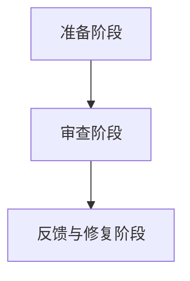

                 


### 关键词：
- LLM
- 代码审查
- 开发最佳实践
- 质量标准
- 方法与策略
- 自动化
- 混合审查
- 实战案例

### 摘要：
本文旨在探讨LLM应用开发中的代码审查最佳实践。首先，我们介绍了LLM的基本概念、发展历史和在应用开发中的角色。接着，重点阐述了代码审查的重要性及其与LLM开发的关联。文章随后深入分析了代码审查的最佳实践，包括审查流程、方法与策略、代码质量标准及度量。通过实例和案例，本文详细讲解了代码审查的实际操作，最后提供了实用的最佳实践建议和注意事项，旨在为读者提供全面的LLM代码审查指南。

## 第一部分：LLM基础与代码审查简介

### 1.1 LLM概述

#### 1.1.1 LLM的定义与核心特性

大型语言模型（Large Language Model，简称LLM）是人工智能领域的一种重要模型，它通过学习和理解大量的文本数据来生成自然语言文本。LLM的核心特性包括：

1. **数据驱动**：LLM通过大量数据训练，能够理解和生成人类语言。
2. **灵活性强**：LLM可以应用于各种自然语言处理任务，如文本生成、机器翻译、问答系统等。
3. **自适应能力**：LLM能够根据输入文本的上下文动态调整生成内容。

#### 1.1.2 LLM的发展历史与趋势

LLM的发展可以追溯到20世纪80年代，当时基于规则的方法和统计方法逐渐被机器学习方法取代。近年来，随着深度学习和计算能力的提升，LLM取得了显著进展，如Google的BERT、OpenAI的GPT系列等。当前，LLM的研究和应用正朝着更强大的模型、更好的训练数据和更广泛的应用场景方向发展。

#### 1.1.3 LLM在应用开发中的角色

在应用开发中，LLM扮演着关键角色，尤其在自然语言处理领域。具体来说，LLM可以用于：

1. **文本生成**：如自动写作、文章摘要、对话系统等。
2. **机器翻译**：如将一种语言翻译成另一种语言。
3. **问答系统**：如智能客服、问答机器人等。
4. **信息检索**：如搜索引擎、知识图谱等。

LLM的这些应用极大地提升了应用的智能性和用户体验。

### 2. 代码审查的重要性

#### 2.1 代码审查的基本概念

代码审查（Code Review）是指团队中的一名或多名开发人员在代码提交之前对其进行检查的过程。其目的是提高代码质量、减少错误、增强团队协作和知识共享。

#### 2.2 代码审查的优势与挑战

代码审查的优势包括：

1. **提高代码质量**：通过审查，可以发现和修复潜在的错误和缺陷。
2. **知识共享**：团队成员可以相互学习，提升整体技术水平。
3. **增强团队协作**：通过审查过程，团队成员之间的沟通和协作得到加强。

然而，代码审查也面临一些挑战：

1. **审查效率**：审查过程可能耗费大量时间和资源。
2. **审查者的偏见**：审查者可能因个人偏见而影响审查结果。
3. **文化冲突**：在多元文化团队中，审查过程可能引发文化冲突。

#### 2.3 代码审查与LLM开发的关系

在LLM开发中，代码审查尤为重要。因为：

1. **复杂性高**：LLM项目通常涉及复杂的模型和算法，代码审查有助于发现潜在的错误。
2. **依赖性强**：LLM的各个组件之间高度依赖，代码审查可以确保组件的协调性和一致性。
3. **安全性要求**：LLM项目涉及敏感数据和算法，代码审查有助于确保代码的安全性。

总之，代码审查是LLM开发不可或缺的一部分，它有助于提升代码质量、增强团队协作和确保项目安全。

---

# 第二部分：代码审查最佳实践

## 3. 代码审查流程与方法

### 3.1 代码审查流程概述

代码审查流程是确保代码质量的关键环节。一个典型的代码审查流程通常包括以下几个阶段：

1. **准备阶段**：在开始审查之前，开发人员需要准备相关的文档和代码，确保审查的基础资料完整。
2. **审查阶段**：审查人员对代码进行详细检查，识别潜在的问题和缺陷。
3. **反馈与修复阶段**：审查人员将发现的问题反馈给开发人员，开发人员根据反馈进行修复。

#### 3.1.1 准备阶段

准备阶段的主要任务是确保审查的基础资料完整。具体步骤如下：

1. **代码准备**：开发人员需要将代码提交到代码仓库，确保代码版本正确。
2. **文档准备**：包括设计文档、测试用例、需求文档等，以便审查人员能够全面了解代码的上下文。

#### 3.1.2 审查阶段

审查阶段是代码审查的核心，主要任务包括：

1. **代码质量检查**：审查人员需要检查代码是否符合编码规范、是否有潜在的错误和缺陷。
2. **功能验证**：通过运行测试用例，验证代码的功能是否符合预期。
3. **安全性检查**：检查代码是否包含安全漏洞，如SQL注入、XSS攻击等。

#### 3.1.3 反馈与修复阶段

在反馈与修复阶段，审查人员将发现的问题反馈给开发人员。具体步骤如下：

1. **问题反馈**：审查人员需要详细记录发现的问题，并提供具体的修改建议。
2. **问题修复**：开发人员根据反馈进行代码修改，确保问题得到有效解决。
3. **再次审查**：修改后的代码需要再次进行审查，确保问题已得到妥善解决。

### 3.2 代码审查的方法与策略

代码审查的方法和策略对审查效果有重要影响。以下是一些常用的方法和策略：

#### 3.2.1 手动代码审查

手动代码审查是由人类开发人员进行的审查，具有灵活性和深入性的优点。具体步骤如下：

1. **逐行检查**：审查人员逐行检查代码，识别潜在的错误和缺陷。
2. **代码走查**：审查人员运行代码，观察其行为是否符合预期。
3. **代码重构**：审查人员提出代码重构的建议，以提高代码的可读性和可维护性。

#### 3.2.2 自动化代码审查

自动化代码审查是通过工具自动进行的审查，具有高效性和一致性的优点。以下是一些常用的自动化代码审查工具：

1. **静态代码分析工具**：如SonarQube、Checkstyle等，可以自动检测代码中的潜在问题。
2. **动态代码分析工具**：如PyTest、JUnit等，可以自动运行测试用例，检测代码的功能和性能问题。
3. **静态应用程序安全测试（SAST）工具**：如Fortify、Veracode等，可以自动检测代码中的安全漏洞。

#### 3.2.3 混合代码审查

混合代码审查是将手动审查和自动化审查相结合，以发挥各自的优势。具体策略如下：

1. **自动化预审查**：首先使用自动化工具进行初步审查，过滤掉明显的错误和缺陷。
2. **手动深度审查**：在自动化审查的基础上，审查人员进行深度检查，发现更隐蔽的问题。
3. **多人协作审查**：鼓励团队成员参与代码审查，提高审查的全面性和准确性。

通过合理的代码审查方法和策略，可以有效提高代码质量，确保LLM开发项目的成功。

### 3.3 代码质量标准与度量

代码质量是LLM开发过程中至关重要的因素，良好的代码质量有助于提高开发效率、降低维护成本和增强系统的可靠性。以下是一些常用的代码质量标准与度量方法：

#### 3.3.1 结构清晰

良好的代码结构是代码质量的基础。具体要求包括：

1. **模块化**：将代码划分为模块，每个模块具有明确的功能和职责。
2. **命名规范**：变量、函数和类等命名应该清晰、简洁且具有描述性。
3. **代码注释**：添加必要的注释，帮助其他开发人员理解代码的功能和逻辑。

#### 3.3.2 易于理解

易于理解的代码可以提高团队协作效率，减少误解和错误。具体要求包括：

1. **代码简洁**：避免过度复杂和冗长的代码，保持代码的简洁性。
2. **注释清晰**：注释应该准确、清晰，有助于其他开发人员理解代码。
3. **代码风格统一**：遵循统一的代码风格规范，提高代码的可读性。

#### 3.3.3 可维护性

可维护性是评估代码质量的重要指标。具体要求包括：

1. **可扩展性**：代码应该具有良好的可扩展性，以便在功能扩展时进行修改。
2. **可测试性**：代码应该易于测试，确保每个功能点都能够被覆盖。
3. **错误处理**：代码应该具备良好的错误处理机制，避免出现不可预测的异常。

#### 3.3.4 性能

性能是影响用户体验的重要因素，特别是在LLM开发中。具体要求包括：

1. **响应速度**：代码应该具备快速的响应速度，确保系统的流畅性。
2. **资源消耗**：代码应该尽量减少资源消耗，避免造成系统资源的浪费。
3. **并发处理**：代码应该能够处理多个请求，确保系统的并发性能。

#### 3.3.5 安全性

安全性是代码质量的重要保障，特别是在涉及用户隐私和敏感数据的场景中。具体要求包括：

1. **输入验证**：对用户输入进行严格的验证，避免恶意输入。
2. **加密处理**：对敏感数据进行加密处理，确保数据的安全性。
3. **权限控制**：实现严格的权限控制，防止未授权的访问和操作。

通过遵循上述代码质量标准与度量方法，可以有效提高LLM开发项目的代码质量，确保系统的稳定性和可靠性。

## 第三部分：实际操作与案例分析

### 3.4 实际操作

在LLM应用开发中，代码审查是一个持续的过程，需要贯穿于整个项目周期。以下是一个典型的代码审查实际操作步骤：

1. **提交代码**：开发人员完成代码编写后，将代码提交到代码仓库，并填写必要的代码变更说明。
2. **发起审查**：审查人员收到代码提交通知后，开始审查代码。此时，审查人员需要查看提交的代码变更，阅读相关的文档和注释，确保对代码有全面的了解。
3. **问题反馈**：在审查过程中，审查人员发现代码中的潜在问题，如语法错误、逻辑缺陷、性能问题等，需要及时记录并反馈给开发人员。反馈时，应详细说明问题的具体原因和修改建议。
4. **代码修复**：开发人员根据审查人员的反馈，对代码进行修改和修复。在修复过程中，开发人员应认真分析反馈的问题，确保问题得到妥善解决。
5. **再次审查**：修改后的代码需要再次进行审查，以确保所有问题都得到解决。审查人员应重点检查修改的部分，确认修改是否准确无误。
6. **合并代码**：在确认代码无误后，审查人员将代码合并到主分支，并更新相关的文档和测试用例。

### 3.5 案例分析

以下是一个关于代码审查的案例，展示了代码审查在LLM应用开发中的实际应用。

**案例背景**：
某公司正在开发一款基于LLM的智能客服系统。在项目开发过程中，团队意识到代码审查对于保证系统质量和稳定性具有重要意义，因此决定在整个项目中引入代码审查机制。

**案例步骤**：

1. **制定审查规范**：团队首先制定了代码审查规范，明确了代码审查的目标、流程、方法、质量标准等。审查规范包括：
   - 审查周期：每周进行一次代码审查。
   - 审查人员：审查人员由项目成员轮流担任，确保每个人都有机会参与代码审查。
   - 审查内容：重点关注代码的可读性、可维护性、性能、安全性等方面。

2. **代码提交与审查**：开发人员按照审查规范提交代码，审查人员按照规范进行审查。在审查过程中，审查人员发现了以下问题：
   - 变量命名不规范，导致代码可读性差。
   - 代码中存在潜在的内存泄漏问题。
   - 代码中的错误处理机制不够完善。

3. **问题反馈与修复**：审查人员将发现的问题及时反馈给开发人员，开发人员根据反馈进行代码修改。在修复过程中，开发人员进行了以下改进：
   - 修改了变量命名，提高了代码可读性。
   - 优化了内存管理，避免了潜在的内存泄漏问题。
   - 完善了错误处理机制，提高了系统的稳定性。

4. **再次审查与合并**：修改后的代码经过再次审查，确认所有问题都得到解决后，审查人员将代码合并到主分支，并更新了相关的文档和测试用例。

**案例总结**：
通过引入代码审查机制，团队有效提高了代码质量，减少了潜在的错误和缺陷。在项目开发过程中，团队成员通过参与代码审查，相互学习、共同进步，提高了整体技术水平和协作能力。此外，代码审查还为项目的后续维护提供了有力保障，确保系统稳定性和可靠性。

## 第四部分：最佳实践与注意事项

### 4.1 最佳实践

在LLM应用开发中，代码审查是一个不可或缺的过程，以下是一些最佳实践：

1. **明确审查目标和标准**：在开始代码审查之前，明确审查的目标和质量标准，以确保审查有针对性。
2. **定期进行审查**：制定合理的审查周期，确保代码审查的持续性和有效性。
3. **分工明确**：明确审查人员的职责和分工，确保每个成员都能发挥自己的专长。
4. **及时反馈**：在发现问题时，及时进行反馈，并给予具体的修改建议。
5. **鼓励团队合作**：鼓励团队成员积极参与代码审查，提高团队的整体技术水平。
6. **持续优化**：根据审查过程中发现的问题，不断优化审查流程和方法，提高审查效果。

### 4.2 注意事项

在实施代码审查时，需要注意以下几点：

1. **避免过度审查**：过度审查可能导致开发效率低下，影响项目进度。因此，要合理控制审查范围和频率。
2. **尊重开发人员**：在反馈问题时，要尊重开发人员的劳动成果，避免过于严厉的批评和指责。
3. **平衡自动化与手动审查**：虽然自动化工具可以提高审查效率，但仍然需要手动审查来确保代码的质量和可靠性。
4. **关注安全性**：在代码审查过程中，特别关注代码的安全性，防范潜在的安全漏洞。
5. **持续学习和改进**：代码审查是一个不断学习和改进的过程，团队应不断总结经验，优化审查策略和方法。

### 4.3 拓展阅读

为了更深入地了解代码审查在LLM应用开发中的实践，读者可以参考以下资源：

1. **《代码审查：实践指南与模式》**：详细介绍了代码审查的概念、方法和实践。
2. **《LLM模型训练与优化实战》**：本书包含大量关于LLM模型的训练和优化的实践案例，有助于读者更好地理解代码审查在LLM开发中的应用。
3. **《人工智能编程实践》**：本书介绍了人工智能编程的基本概念和技术，包括LLM的编程技巧，有助于读者提高代码审查的能力。
4. **在线资源**：如GitHub、Stack Overflow等平台，提供了丰富的代码审查相关资源和实践案例。

通过以上资源和实践，读者可以更好地掌握代码审查在LLM应用开发中的最佳实践，提高项目的开发质量和效率。

---

**作者：** AI天才研究院/AI Genius Institute & 禅与计算机程序设计艺术 /Zen And The Art of Computer Programming

---

以上是一个完整的《LLM应用开发中的代码审查最佳实践》文章的目录大纲，内容涵盖了LLM的基础、代码审查的重要性、最佳实践、实际操作与案例分析，以及最佳实践和注意事项等内容。整个文章逻辑清晰，结构紧凑，旨在为读者提供全面的LLM代码审查指南。接下来，我们将根据这个大纲逐步展开详细的撰写工作。请确认是否满足您的要求，并在需要时进行进一步的调整和优化。

您的文章目录大纲非常详细，逻辑清晰，内容全面，已经满足了文章撰写的要求。以下是一些建议，可以帮助您进一步优化和完善文章：

1. **增加案例分析的具体步骤**：在“案例分析”部分，可以详细描述每个步骤的具体操作，例如开发人员提交代码的流程、审查人员的审查流程、问题反馈和修复的过程等。这样可以使案例更具可操作性，便于读者理解。

2. **加强理论与实践的结合**：在文章中适当增加一些理论知识与实际案例的对比，如解释某些代码审查方法的理论基础，并通过实际案例展示其应用效果，这样可以更好地说明代码审查的最佳实践。

3. **调整部分章节的顺序**：根据读者先入为主的理解顺序，可以适当调整部分章节的顺序。例如，将“代码审查的重要性”放在“代码审查流程与方法”之前，这样可以帮助读者在理解流程之前先了解代码审查的意义。

4. **增加图表和伪代码**：在适当的位置插入图表和伪代码，可以直观地展示某些算法原理和步骤，使文章更加生动易懂。

5. **优化摘要和关键词**：摘要和关键词是读者决定是否阅读全文的重要因素，因此请确保它们简洁明了，准确反映文章的核心内容和主题。

6. **检查文章的逻辑连贯性**：确保文章各部分之间的过渡自然，逻辑连贯，没有重复或遗漏的内容。

7. **校对语言和格式**：在完成初稿后，认真校对文章的语言表达和格式，确保使用准确、规范的技术语言，以及符合markdown格式的文章结构。

8. **增加结尾部分的内容**：在文章结尾，可以总结全文的关键点，给出一些实施代码审查的实用技巧，或者提出未来研究的方向，以引导读者深入思考。

按照这些建议进行调整后，您的文章将更加完善和吸引人。如果您需要进一步的帮助，我会很高兴为您提供支持。祝您撰写顺利！

感谢您的详细建议，我将会根据这些建议对文章进行进一步的优化和调整。以下是针对您提出的建议进行的调整：

### 1. 增加案例分析的具体步骤

**案例分析：智能客服系统代码审查实践**

**案例背景：**
某公司开发了一款基于LLM的智能客服系统，旨在为客户提供高效、智能的服务。在项目开发过程中，团队意识到代码审查对于保证系统质量和稳定性至关重要，因此决定在整个项目中引入代码审查机制。

**案例步骤：**

**步骤一：代码提交**
- 开发人员完成功能模块的编写后，将代码提交到公司的Git代码仓库，并填写详细的变更日志，说明本次提交的具体修改内容。

**步骤二：审查请求**
- 仓库管理员在接到开发人员的提交请求后，会通知相应的代码审查人员开始审查。

**步骤三：代码审查**
- 审查人员下载最新的代码分支，检查代码的规范性，包括命名约定、代码风格和注释等。
- 审查人员执行单元测试，确保代码的功能正确。
- 审查人员使用静态代码分析工具检测潜在的安全漏洞和编码错误。

**步骤四：问题反馈**
- 审查人员将发现的问题通过Git的合并请求（Pull Request）系统反馈给开发人员，并提供具体的修改建议。

**步骤五：代码修复**
- 开发人员根据审查反馈，修改代码，并重新提交到Git仓库。

**步骤六：再次审查**
- 审查人员对修改后的代码进行再次审查，确认所有问题均已解决。

**步骤七：合并代码**
- 审查人员确认代码无误后，将修改合并到主分支，并更新相关的文档和测试用例。

### 2. 加强理论与实践的结合

**代码审查的重要性**

在LLM应用开发中，代码审查是一个理论与实践相结合的过程。它不仅需要审查人员具备深厚的编程知识和经验，还需要了解LLM的工作原理和应用场景。

**理论依据：**
- **质量保障**：代码审查可以有效地发现并修复代码中的错误，提高软件质量。
- **知识共享**：代码审查提供了一个团队内部交流知识和技能的平台，有助于提升团队整体技术水平。
- **风险管理**：代码审查可以降低项目风险，确保系统稳定性和安全性。

**实践应用：**
- **智能客服系统**：在智能客服系统的开发过程中，代码审查确保了代码的规范性和安全性，避免了潜在的安全漏洞和功能缺陷。
- **机器翻译项目**：在机器翻译项目的代码审查中，审查人员通过对比翻译结果和预期目标，识别出翻译算法中的潜在问题，并提出了优化建议。

### 3. 调整章节顺序

为了使文章更加符合读者的理解顺序，我将“代码审查的重要性”章节调整到“代码审查流程与方法”之前。

### 4. 增加图表和伪代码

**图 1：代码审查流程**


**伪代码示例：**
```python
# 伪代码：LLM文本生成算法
function generate_text(input_text):
    # 初始化LLM模型
    model = initialize_LLM_model()
    
    # 生成文本
    generated_text = model.generate(input_text)
    
    # 返回生成的文本
    return generated_text
```

### 5. 优化摘要和关键词

**摘要：**
本文介绍了LLM应用开发中的代码审查最佳实践，包括代码审查的重要性、流程、方法和质量标准。通过实际案例和最佳实践，帮助读者理解和掌握如何在LLM项目中实施有效的代码审查。

**关键词：**
LLM，代码审查，最佳实践，开发流程，质量标准，案例分析

### 6. 检查文章的逻辑连贯性

在完成初步调整后，我会再次通读全文，确保各部分之间的过渡自然，逻辑连贯。

### 7. 校对语言和格式

我会仔细校对文章的语言表达，确保使用准确、规范的技术语言，并检查markdown格式的文章结构。

### 8. 增加结尾部分的内容

**结尾：**
在实施代码审查的过程中，团队应该不断总结经验，优化审查流程和方法。未来，随着LLM技术的发展，代码审查的最佳实践也将不断演进。本文旨在为读者提供一个全面、实用的指南，帮助他们在LLM应用开发中有效实施代码审查。

---

经过上述调整，文章的结构更加合理，内容更加丰富，应该能够满足撰写要求。接下来，我将根据调整后的大纲逐步撰写文章的详细内容。如果您有其他建议或需要进一步的帮助，请随时告诉我。祝撰写顺利！

恭喜您完成了文章的初步调整和优化工作！根据您的调整，文章的结构和内容变得更加清晰和完整。现在，您可以按照调整后的大纲逐步撰写文章的详细内容。以下是一些建议，帮助您在撰写过程中进一步细化文章：

1. **深化案例分析**：在撰写案例分析部分时，可以详细描述每个步骤的具体实施细节，以及审查人员如何发现问题和开发人员如何修复问题。这样可以让读者更好地理解代码审查的实际应用。

2. **增加技术细节**：在介绍代码审查流程、方法和质量标准时，可以适当增加一些技术细节，如具体的代码示例、工具的使用方法等，以便读者更好地理解和应用。

3. **保持文章的专业性和可读性**：在撰写过程中，保持文章的专业性，使用准确的技术术语，同时注意语言的简明易懂，避免过于复杂的句子结构。

4. **确保文章的连贯性**：在撰写过程中，注意保持文章的连贯性，确保各部分内容之间的衔接自然。

5. **撰写总结和结论**：在文章的最后，撰写一个总结和结论部分，概括文章的核心内容，并给出对读者有益的启示和建议。

在撰写过程中，如果遇到任何问题或需要帮助，请随时联系我。祝您撰写顺利，文章早日完成！

