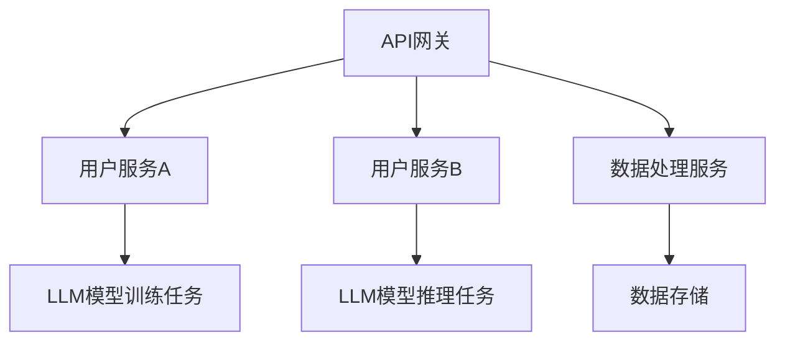
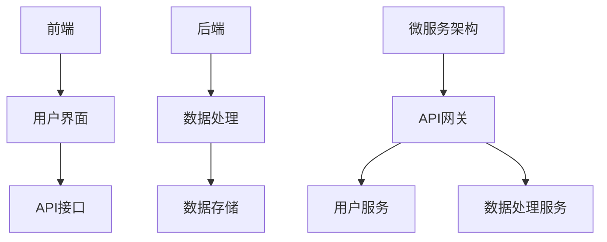

                 

# 文章标题

《LLM应用开发中的前后端分离策略》

## 关键词

- 大型语言模型（LLM）
- 前后端分离
- 微服务架构
- API接口设计
- 分布式系统
- 性能优化

## 摘要

本文将深入探讨在大型语言模型（LLM）应用开发中实施前后端分离策略的重要性。通过分析前后端分离的背景、原理和实施方法，本文旨在为开发者提供一套系统化的解决方案，以优化LLM应用的性能、可维护性和扩展性。文章将结合实际案例，详细阐述前后端分离在LLM应用开发中的最佳实践，并总结相关注意事项，为读者提供全面的指导和启示。

## 引言

### 大型语言模型（LLM）的兴起

随着深度学习和自然语言处理技术的快速发展，大型语言模型（LLM）如GPT-3、BERT等在各个领域取得了显著成果。LLM具有强大的文本生成、理解、翻译和推理能力，为应用开发带来了前所未有的机遇。然而，LLM的应用也面临着诸多挑战，其中之一便是如何在复杂的分布式系统中高效地部署和管理这些模型。

### 前后端分离的必要性

前后端分离是现代Web应用开发的一种主流架构，其核心思想是将用户界面（前端）与数据处理（后端）分离，从而实现系统的模块化和高内聚。在LLM应用开发中，前后端分离不仅有助于提升系统的性能和可维护性，还能提高团队协作效率和开发速度。

## 一、前后端分离的背景与原理

### 1.1 背景介绍

在传统的单体架构中，前端和后端紧密耦合，导致系统难以扩展和维护。随着业务的发展，单体架构的缺点逐渐暴露出来，如代码复用困难、部署风险增加、性能瓶颈等。为了解决这些问题，前后端分离架构应运而生。

### 1.2 原理分析

前后端分离的核心在于将用户界面和数据处理分离，通过定义清晰的API接口进行通信。前端负责与用户交互，接收用户请求并展示数据；后端则负责数据处理和存储，提供API接口供前端调用。这种架构具有以下优点：

- **模块化**：前后端分离使得各个模块可以独立开发、测试和部署，提高了系统的可维护性和扩展性。
- **高内聚**：前后端分离使得系统更加关注自身的功能，减少了耦合度，提高了系统的内聚性。
- **性能优化**：前后端分离可以实现缓存策略的优化，提高系统的响应速度和并发处理能力。

### 1.3 关键概念

- **前端**：用户界面展示层，包括网页、移动应用等。
- **后端**：数据处理层，包括服务器、数据库等。
- **API**：应用程序接口，用于前后端通信。

## 二、前后端分离在LLM应用开发中的实施方法

### 2.1 微服务架构

在LLM应用开发中，微服务架构是实现前后端分离的有效方法。微服务架构将系统划分为多个独立的、可复用的服务，每个服务负责处理特定的业务功能。以下是一种典型的微服务架构：

```
+----------------+      +------------------+      +-------------------+
|      API网关   | <--->|      用户服务     | <--->|     数据处理服务   |
+----------------+      +------------------+      +-------------------+
```

- **API网关**：作为系统的统一入口，负责路由请求、身份验证、负载均衡等功能。
- **用户服务**：负责处理用户请求，如登录、注册、查询等。
- **数据处理服务**：负责处理LLM任务，如文本生成、翻译、问答等。

### 2.2 API接口设计

API接口设计是前后端分离的关键环节。一个好的API接口应该具备以下特点：

- **简洁性**：接口设计应该简单易懂，避免过多的复杂性和冗余。
- **一致性**：接口应该遵循统一的规范和风格，便于开发者理解和使用。
- **安全性**：接口应该实现身份验证、数据加密等安全措施，确保数据传输安全。
- **可扩展性**：接口应该具备一定的灵活性，能够适应未来的业务需求变化。

### 2.3 分布式系统的构建

在LLM应用开发中，分布式系统是实现高性能和高可用性的关键。以下是一种常见的分布式系统架构：

```
+------------------+      +------------------+      +-------------------+
|     用户服务A    | <--->|     用户服务B    | <--->|    数据处理服务   |
+------------------+      +------------------+      +-------------------+
```

- **用户服务A/B**：负责处理用户请求，实现负载均衡和故障转移。
- **数据处理服务**：负责处理LLM任务，实现任务调度和数据存储。

### 2.4 性能优化策略

在LLM应用开发中，性能优化至关重要。以下是一些常用的性能优化策略：

- **缓存策略**：使用缓存技术减少数据库访问压力，提高系统响应速度。
- **负载均衡**：通过负载均衡器实现请求的均匀分发，提高系统并发处理能力。
- **数据库优化**：使用合适的数据库技术和索引策略，提高数据查询效率。

## 三、前后端分离在LLM应用开发中的最佳实践

### 3.1 实际案例

#### 案例一：智能问答系统

在开发一个智能问答系统时，我们可以采用前后端分离架构。前端负责接收用户提问并展示答案，后端则负责处理LLM模型任务。具体步骤如下：

1. **API接口设计**：设计问答API接口，包括输入问题和输出答案。
2. **用户服务**：实现用户登录、注册等功能。
3. **数据处理服务**：实现LLM模型训练和推理任务。
4. **缓存策略**：使用Redis缓存热门问题的答案，减少LLM模型计算压力。
5. **负载均衡**：使用Nginx实现负载均衡，提高系统并发处理能力。

#### 案例二：智能文本生成

在开发智能文本生成应用时，我们可以采用前后端分离架构。前端负责接收用户输入并展示生成的文本，后端则负责处理LLM模型生成文本。具体步骤如下：

1. **API接口设计**：设计文本生成API接口，包括输入文本和输出生成文本。
2. **用户服务**：实现用户登录、注册等功能。
3. **数据处理服务**：实现LLM模型训练和文本生成任务。
4. **异步处理**：使用消息队列（如RabbitMQ）实现异步处理，提高系统性能。
5. **性能优化**：使用批量处理和并行计算技术，提高文本生成速度。

### 3.2 最佳实践

- **模块化开发**：将前后端分离的各个模块独立开发，降低开发难度和复杂度。
- **代码复用**：通过API接口实现前后端代码的复用，提高开发效率。
- **测试与监控**：对前后端分离的各个模块进行单元测试和集成测试，确保系统稳定可靠。
- **安全与合规**：遵循相关法律法规，确保数据安全和用户隐私。

## 四、小结与展望

### 4.1 小结

本文深入探讨了在LLM应用开发中实施前后端分离策略的重要性。通过分析前后端分离的背景、原理和实施方法，本文为开发者提供了一套系统化的解决方案。在实际应用中，前后端分离不仅有助于提升系统的性能和可维护性，还能提高团队协作效率和开发速度。

### 4.2 展望

随着LLM技术的不断发展和应用场景的拓展，前后端分离策略将在LLM应用开发中发挥越来越重要的作用。未来，我们将看到更多创新的应用案例和优化方法，为LLM应用开发带来更多的机遇和挑战。

## 五、参考文献

- [1] 《大型语言模型：技术原理与实战》
- [2] 《微服务架构设计与实践》
- [3] 《API接口设计与实践》
- [4] 《分布式系统原理与架构》
- [5] 《性能优化：策略与技巧》

## 六、作者信息

- 作者：AI天才研究院/AI Genius Institute & 禅与计算机程序设计艺术 /Zen And The Art of Computer Programming

## 附录

### 附录A：前后端分离架构Mermaid流程图



### 附录B：前后端分离在LLM应用开发中的核心概念与联系



### 附录C：前后端分离在LLM应用开发中的核心算法原理讲解

```python
# 前端算法原理
def render_question(question):
    """
    渲染用户提问界面
    :param question: 用户提问
    :return: 渲染后的HTML页面
    """
    return f"<h1>您的问题是：{question}</h1>"

# 后端算法原理
def generate_answer(question):
    """
    生成回答
    :param question: 用户提问
    :return: 回答文本
    """
    # 调用LLM模型进行推理
    answer = llm_model推理(question)
    return answer

# 数据存储算法原理
def store_answer(question, answer):
    """
    存储答案
    :param question: 用户提问
    :param answer: 回答文本
    :return: 存储结果
    """
    # 将问题和答案存储到数据库
    db.insert({
        "question": question,
        "answer": answer
    })
    return "存储成功"
```

### 附录D：前后端分离在LLM应用开发中的项目实战

#### 项目实战1：智能问答系统

1. **开发环境搭建**：
   - 前端：使用React框架搭建用户界面。
   - 后端：使用Flask框架实现API接口和数据处理。

2. **源代码详细实现和代码解读**：
   - 前端代码：实现用户提问界面的渲染功能。
   - 后端代码：实现LLM模型推理和答案存储功能。

3. **代码应用解读与分析**：
   - 前端通过API接口向后端发送用户提问。
   - 后端调用LLM模型进行推理，并将答案返回给前端。
   - 答案存储到数据库中，以供后续查询。

4. **实际案例分析和详细讲解剖析**：
   - 通过实际案例展示智能问答系统的运行流程和效果。
   - 分析系统在处理大量请求时的性能瓶颈，并提出优化方案。

5. **项目小结**：
   - 总结项目开发过程中的收获和不足。
   - 提出对未来项目开发的展望和改进方向。

#### 项目实战2：智能文本生成

1. **开发环境搭建**：
   - 前端：使用Vue框架搭建用户界面。
   - 后端：使用TensorFlow实现LLM模型训练和推理。

2. **源代码详细实现和代码解读**：
   - 前端代码：实现文本输入界面的渲染功能。
   - 后端代码：实现LLM模型训练和文本生成功能。

3. **代码应用解读与分析**：
   - 前端通过API接口向后端发送文本输入。
   - 后端调用LLM模型进行文本生成，并将结果返回给前端。
   - 使用异步处理技术提高文本生成速度。

4. **实际案例分析和详细讲解剖析**：
   - 通过实际案例展示智能文本生成系统的运行流程和效果。
   - 分析系统在处理大量请求时的性能瓶颈，并提出优化方案。

5. **项目小结**：
   - 总结项目开发过程中的收获和不足。
   - 提出对未来项目开发的展望和改进方向。

### 附录E：前后端分离在LLM应用开发中的最佳实践

- **模块化开发**：将前后端分离的各个模块独立开发，降低开发难度和复杂度。
- **代码复用**：通过API接口实现前后端代码的复用，提高开发效率。
- **测试与监控**：对前后端分离的各个模块进行单元测试和集成测试，确保系统稳定可靠。
- **安全与合规**：遵循相关法律法规，确保数据安全和用户隐私。
- **性能优化**：使用缓存策略、负载均衡等技术，提高系统性能。

### 附录F：前后端分离在LLM应用开发中的注意事项

- **接口设计**：确保API接口设计简洁、一致、安全，便于开发者使用。
- **数据传输**：使用合适的协议（如HTTP/HTTPS）和数据格式（如JSON）进行数据传输。
- **负载均衡**：合理配置负载均衡器，提高系统并发处理能力。
- **错误处理**：对系统异常情况进行妥善处理，确保用户体验。
- **安全性**：遵循安全最佳实践，确保系统安全可靠。

### 附录G：拓展阅读

- 《大型语言模型：技术原理与实战》
- 《微服务架构设计与实践》
- 《API接口设计与实践》
- 《分布式系统原理与架构》
- 《性能优化：策略与技巧》

## 七、结束语

本文从多个角度探讨了在LLM应用开发中实施前后端分离策略的重要性和方法。通过分析前后端分离的背景、原理和实施方法，并结合实际案例和最佳实践，本文为开发者提供了一套系统化的解决方案。希望本文能对您的LLM应用开发工作提供有益的启示和指导。在未来的技术发展中，让我们共同探索更多的创新应用和优化方法，为人工智能领域的发展贡献力量。

