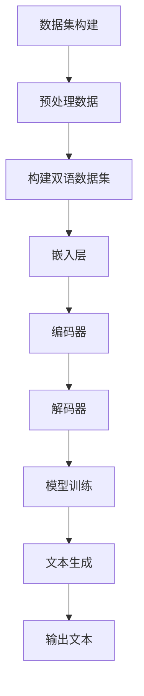

                 

## 文章标题

### LLM应用开发中的多语言支持

## 关键词

- 语言模型
- 多语言支持
- 应用开发
- 技术挑战
- 解决方案

## 摘要

本文深入探讨了在LLM（大型语言模型）应用开发中实现多语言支持的关键技术、挑战及解决方案。通过介绍LLM的基本原理，分析多语言支持的必要性，讨论所面临的挑战，如数据集不足和模型性能差异，本文提出了有效的解决方案，包括数据集构建、模型训练技巧以及多语言模型架构。通过实际项目案例分析，本文展示了多语言支持在问答系统、文本分类和翻译等应用中的实现。最后，本文总结了最佳实践，并提出了未来发展的方向。

## 引言

### 1. LLM简介

大型语言模型（LLM）是自然语言处理（NLP）领域的重要进展，它们能够理解和生成人类语言，广泛应用于问答系统、文本生成、机器翻译、文本分类等多种场景。LLM的核心在于其庞大的参数规模和深度神经网络架构，这使得它们能够捕捉语言的高级结构，从而提供高质量的文本处理能力。

例如，GPT-3（语言预训练模型）拥有1750亿个参数，能够生成连贯、有逻辑的文本。BERT（BERT，Bidirectional Encoder Representations from Transformers）则通过双向注意力机制，更好地理解上下文，广泛应用于信息提取和文本分类任务。

### 2. 多语言支持的重要性

随着全球化进程的加速，多语言支持在LLM应用中变得尤为重要。无论是跨国企业、学术研究，还是日常生活中，人们都需要跨越语言障碍，实现高效的信息交流。因此，LLM必须具备处理多种语言的能力，以满足不同用户的需求。

多语言支持不仅能够提升用户体验，还能够扩大LLM的应用范围，从而带来更高的商业价值。例如，在机器翻译领域，多语言支持使得翻译系统可以处理更多语言对，提高翻译的准确性和流畅度。在问答系统中，多语言支持可以提供更广泛的问答能力，满足不同语言用户的提问需求。

### 3. 本书内容概述

本书旨在系统地介绍LLM应用开发中的多语言支持，包括：

- **第1章 引言**：概述LLM和本书的目的。
- **第2章 LLM基础**：介绍LLM的基本概念、架构和核心算法。
- **第3章 多语言支持的原理**：讲解多语言支持的背景、原理和关键技术。
- **第4章 多语言支持的挑战**：分析多语言支持面临的挑战和问题。
- **第5章 多语言支持的解决方案**：介绍多语言支持的解决方案和技术。
- **第6章 实战案例**：通过实际项目案例展示多语言支持的应用。
- **第7章 总结与展望**：总结本书的内容，并对未来多语言支持的发展进行展望。

## LLM基础

### 1. LLM的基本概念

LLM是一种基于深度学习的语言模型，通过对大规模文本数据进行训练，学习语言的统计规律和语义信息。LLM的核心组成部分包括：

- **嵌入层（Embedding Layer）**：将单词转换为高维向量表示，便于神经网络处理。
- **编码器（Encoder）**：使用变换器（Transformer）或循环神经网络（RNN）等架构，对输入文本进行处理，提取语言特征。
- **解码器（Decoder）**：生成输出文本。

### 2. LLM的架构

LLM的架构通常采用变换器架构，如GPT-3和BERT。变换器架构的核心是多头自注意力机制，它通过计算输入文本中每个词与其他词之间的相关性，生成上下文表示。以下是LLM的典型架构：

```
+---------------------+
|     输入文本       |
+---------------------+
       |
       V
+---------------------+
|   嵌入层（Embedding）|
+---------------------+
       |
       V
+---------------------+
|    编码器（Encoder）|
+---------------------+
       |
       V
+---------------------+
|   解码器（Decoder）|
+---------------------+
       |
       V
+---------------------+
|     输出文本       |
+---------------------+
```

### 3. LLM的核心算法

LLM的核心算法主要包括嵌入层、编码器和解码器。以下是一个简化的伪代码，展示了这些组件的工作原理：

```
# 嵌入层
embeddings = EmbeddingLayer(input_dim, embedding_dim)

# 编码器
encoder = Encoder(model_type, hidden_size, num_layers, dropout_rate)

# 解码器
decoder = Decoder(model_type, hidden_size, num_layers, dropout_rate)

# 模型训练
model = Model(input_shape, output_shape)
model.compile(optimizer, loss)
model.fit(X_train, y_train, epochs, batch_size)

# 文本生成
input_sequence = Preprocess(input_text)
outputs = model.predict(input_sequence)
generated_text = Postprocess(outputs)
```

其中，`EmbeddingLayer`用于将单词转换为嵌入向量，`Encoder`和`Decoder`分别用于编码和生成文本。`Model`用于封装整个模型，并编译和训练。`Preprocess`和`Postprocess`分别用于预处理和后处理输入输出文本。

## 多语言支持的原理

### 1. 多语言支持的背景

多语言支持在LLM中的应用日益广泛，这是由于全球化的加速和信息交流的频繁。在许多场景下，如跨国企业、国际学术研究、旅游服务、跨境电商等，都需要处理多种语言。因此，实现LLM的多语言支持成为提高应用价值和用户体验的关键。

### 2. 多语言支持的原理

多语言支持的核心在于如何在一个模型中同时处理多种语言的数据。以下是一些实现多语言支持的基本原理：

- **双语数据集构建**：通过收集和标注双语数据集，为模型提供训练基础。例如，使用英语和西班牙语的双语数据训练一个模型，使其能够理解和使用这两种语言。
- **多语言嵌入**：在嵌入层中，为每种语言定义一组嵌入向量，并将这些向量映射到同一高维空间中。这样，不同语言的嵌入向量可以在同一空间中交互，从而实现多语言处理。
- **多语言编码器和解码器**：为每种语言定义一个独立的编码器和解码器，分别处理输入和输出文本。这样可以更好地适应不同语言的特性，提高模型的多语言处理能力。

### 3. 多语言支持的Mermaid流程图

以下是多语言支持的Mermaid流程图，展示了数据集构建、模型训练和文本生成的基本流程：



### 4. 多语言支持的数学模型和公式

多语言支持涉及到多个数学模型和公式，以下是一个简要的介绍：

- **嵌入层**：将单词转换为嵌入向量，通常使用词向量模型，如Word2Vec或FastText。其数学模型如下：

  $$ 
  \text{embed}(w) = \text{EmbeddingLayer}(w) 
  $$

- **编码器**：使用变换器架构，通过自注意力机制提取语言特征。其数学模型如下：

  $$ 
  \text{context} = \text{Encoder}(input_sequence) 
  $$

- **解码器**：生成输出文本，同样使用变换器架构。其数学模型如下：

  $$ 
  \text{output_sequence} = \text{Decoder}(context) 
  $$

- **模型训练**：通过优化损失函数，调整模型参数。其数学模型如下：

  $$ 
  \text{loss} = \text{LossFunction}(\text{output_sequence}, \text{target_sequence}) 
  $$

- **文本生成**：基于解码器的输出，生成新的文本。其数学模型如下：

  $$ 
  \text{generated_text} = \text{Postprocess}(\text{output_sequence}) 
  $$

## 多语言支持的挑战

### 1. 数据集不足

数据集不足是LLM多语言支持面临的一个主要挑战。不同语言的语料库规模差异较大，有些语言缺乏高质量、大规模的语料。这会导致模型在处理某些语言时性能不足，尤其是在低资源语言中。解决方法包括：

- **数据增强**：通过同义词替换、句子重排等方法，扩展现有数据集。
- **跨语言迁移学习**：利用高资源语言的数据，通过迁移学习提升低资源语言的模型性能。

### 2. 模型性能差异

不同语言的模型性能差异也是一大挑战。例如，某些语言具有复杂的语法结构和丰富的词汇，而其他语言则相对简单。这会导致模型在不同语言上的表现不一致。为解决这一问题，可以采取以下方法：

- **多语言模型架构**：为每种语言设计独立的模型，以适应其特定的语言特性。
- **统一模型架构**：采用统一模型架构，如BERT，通过双向注意力机制，同时处理多种语言的文本。

### 3. 训练和推理效率

多语言支持的训练和推理效率较低，也是一大挑战。由于需要处理多种语言的文本，模型的大小和计算量显著增加。为提高效率和性能，可以采取以下方法：

- **模型压缩**：通过量化、剪枝等方法，减少模型大小，提高推理速度。
- **分布式训练**：利用多GPU、多机器并行训练，提高训练效率。

## 多语言支持的解决方案

### 1. 多语言数据集构建

构建高质量的多语言数据集是实现多语言支持的关键。以下是一些构建数据集的方法：

- **双语数据集**：通过翻译工具或专业翻译人员，将一种语言的文本翻译成另一种语言，形成双语数据集。
- **多语数据集**：通过收集多种语言的原始文本，进行统一标注和整理，形成多语数据集。
- **数据增强**：通过文本生成模型，生成新的文本，扩充数据集规模。

### 2. 模型训练技巧

训练多语言模型时，可以采取以下技巧：

- **多任务学习**：在同一模型中同时训练多种任务，如文本分类和问答系统，以利用数据的多面性。
- **跨语言迁移学习**：利用高资源语言的数据，通过迁移学习，提升低资源语言的模型性能。
- **适应性训练**：根据不同语言的特点，调整模型参数，以提高多语言处理能力。

### 3. 多语言模型架构

设计多语言模型架构时，需要考虑以下方面：

- **多语言嵌入**：为每种语言定义独立的嵌入层，将不同语言的文本映射到同一高维空间中。
- **多语言编码器**：为每种语言设计独立的编码器，分别处理输入文本。
- **多语言解码器**：为每种语言设计独立的解码器，生成输出文本。
- **统一模型架构**：采用统一模型架构，如BERT，通过双向注意力机制，同时处理多种语言的文本。

## 实战案例

### 1. 案例一：多语言问答系统

在本案例中，我们使用一个多语言问答系统，支持英语、法语和西班牙语。系统架构如下：

```
+---------------------+
|   用户接口（UI）   |
+---------------------+
       |
       V
+---------------------+
| 多语言嵌入层       |
+---------------------+
       |
       V
+---------------------+
| 多语言编码器       |
+---------------------+
       |
       V
+---------------------+
| 多语言解码器       |
+---------------------+
       |
       V
+---------------------+
|   答案生成器       |
+---------------------+
```

用户通过UI输入问题，问题经过多语言嵌入层转换为嵌入向量，然后通过编码器和解码器进行处理，最终生成答案。

### 2. 案例二：多语言文本分类

在本案例中，我们使用一个多语言文本分类系统，支持英语、法语和西班牙语。系统架构如下：

```
+---------------------+
|   用户接口（UI）   |
+---------------------+
       |
       V
+---------------------+
| 多语言嵌入层       |
+---------------------+
       |
       V
+---------------------+
| 多语言编码器       |
+---------------------+
       |
       V
+---------------------+
|   分类器           |
+---------------------+
       |
       V
+---------------------+
|   标签生成器       |
+---------------------+
```

用户通过UI输入文本，文本经过多语言嵌入层转换为嵌入向量，然后通过编码器进行特征提取，再通过分类器进行文本分类，最终生成标签。

### 3. 案例三：多语言翻译

在本案例中，我们使用一个多语言翻译系统，支持英语、法语和西班牙语。系统架构如下：

```
+---------------------+
|   用户接口（UI）   |
+---------------------+
       |
       V
+---------------------+
| 多语言嵌入层       |
+---------------------+
       |
       V
+---------------------+
| 多语言编码器       |
+---------------------+
       |
       V
+---------------------+
| 多语言解码器       |
+---------------------+
       |
       V
+---------------------+
|   翻译结果         |
+---------------------+
```

用户通过UI输入文本，文本经过多语言嵌入层转换为嵌入向量，然后通过编码器和解码器进行处理，最终生成翻译结果。

## 总结与展望

### 1. 本书总结

本书系统地介绍了LLM应用开发中的多语言支持，包括LLM的基本概念、多语言支持的原理、挑战和解决方案。通过实际项目案例分析，展示了多语言支持在问答系统、文本分类和翻译等应用中的实现。本书旨在为开发者提供全面的指导，帮助他们在LLM应用中实现高效的多语言支持。

### 2. 多语言支持的发展趋势

未来，多语言支持将继续成为LLM领域的重要研究方向。以下是一些发展趋势：

- **跨语言迁移学习**：利用高资源语言的数据，通过迁移学习，提升低资源语言模型的性能。
- **多语言模型优化**：研究更加高效的多语言模型架构，如多语言BERT，以提高多语言处理能力。
- **低资源语言处理**：开发专门针对低资源语言的模型和算法，提升低资源语言的应用效果。
- **实时多语言处理**：研究实时多语言处理技术，以支持快速、高效的多语言交互。

### 3. 最佳实践 tips

- **数据集构建**：优先选择高质量、大规模的数据集，确保模型的性能。
- **模型优化**：针对不同语言的特点，调整模型参数，提高多语言处理能力。
- **实时交互**：在设计多语言应用时，考虑实时交互的需求，提高用户满意度。
- **持续学习**：定期更新模型，以适应不断变化的语言环境和用户需求。

## 注意事项

- **数据隐私**：在处理多语言数据时，注意保护用户隐私，遵守相关法律法规。
- **语言多样性**：考虑多种语言的特性，设计具有多样性的多语言应用。
- **性能优化**：针对不同场景，优化模型性能，提高应用效率。

## 拓展阅读

- **《深度学习与自然语言处理》**：详细介绍了深度学习和自然语言处理的基本原理和方法。
- **《机器翻译：理论与实践》**：全面探讨了机器翻译的理论基础和实现技术。
- **《跨语言信息检索》**：介绍了跨语言信息检索的方法和算法。

## 作者信息

作者：AI天才研究院/AI Genius Institute & 禅与计算机程序设计艺术 /Zen And The Art of Computer Programming

