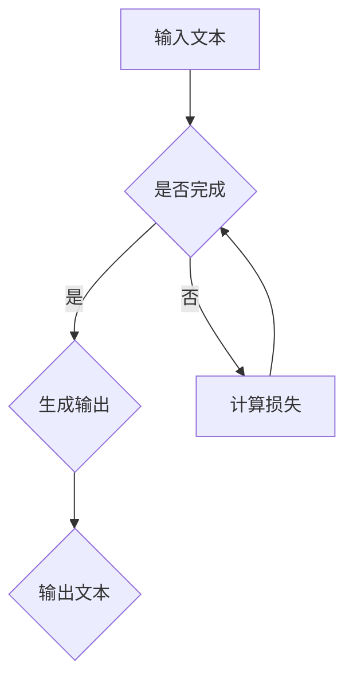
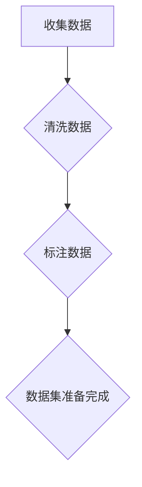
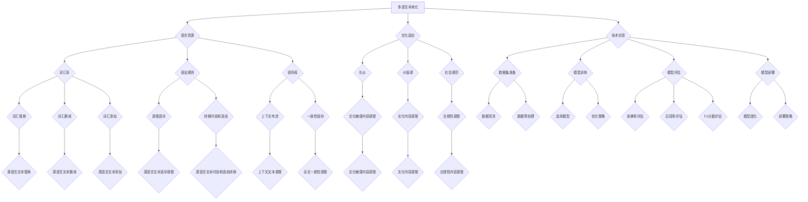

                 

### 第1章 引言

#### 1.1 多语言本地化的背景和重要性

随着互联网和信息技术的迅猛发展，全球化的步伐加快，跨语言交流的需求日益增加。多语言本地化作为一种关键技术，对于提升用户体验、拓展国际市场、增强品牌影响力具有重要意义。在当今世界，各国之间的文化差异和语言障碍已经成为企业和个人在全球范围内发展的瓶颈。因此，如何有效地进行多语言本地化，成为众多企业和开发者亟待解决的重要课题。

**多语言本地化的背景**：

1. **全球化趋势**：随着全球化的深入推进，越来越多的企业开始将业务拓展到国际市场。跨语言的本地化需求成为企业进入新市场的必备条件。
2. **用户需求**：在全球化的背景下，用户对于本地化的内容需求越来越强烈。准确、流畅的多语言内容能够提升用户体验，增加用户粘性。
3. **技术发展**：人工智能和深度学习技术的进步，为多语言本地化提供了强有力的技术支撑。语言模型、机器翻译等技术手段的不断优化，使得多语言本地化的效率和准确性得到了显著提升。

**多语言本地化的重要性**：

1. **市场拓展**：通过多语言本地化，企业可以将其产品和服务推广到更多的国家和地区，从而扩大市场份额。
2. **品牌形象**：准确的多语言内容能够增强品牌在国际市场的形象，提升品牌知名度和美誉度。
3. **用户体验**：本地化的内容能够更好地满足不同语言和文化背景的用户需求，提升用户体验，增加用户满意度。
4. **成本控制**：多语言本地化可以减少企业在翻译和编辑方面的人力和物力投入，降低成本。

#### 1.2 本书的结构和目的

**结构**：

本书共分为七个章节，系统性地介绍了多语言本地化的全流程，包括基本概念、策略与方法、技术实现、项目实战以及工具与资源。

1. **第1章 引言**：介绍多语言本地化的背景和重要性，概述本书的结构和目的。
2. **第2章 多语言本地化的基本概念**：阐述语言和文化差异的影响，定义多语言本地化的目标和挑战，介绍关键术语。
3. **第3章 多语言本地化的策略与方法**：探讨基于词汇、句法和上下文的本地化策略，分析深度学习在多语言本地化中的应用。
4. **第4章 LLM在多语言本地化中的应用**：介绍语言模型的基本原理，探讨LLM在文本翻译、文本摘要和语音识别中的应用。
5. **第5章 多语言本地化的技术实现**：讨论数据集的准备和标注、模型训练和评估、模型部署和优化。
6. **第6章 多语言本地化项目实战**：通过翻译、摘要和语音识别项目案例，展示多语言本地化的实际应用。
7. **第7章 多语言本地化工具与资源**：介绍常用的多语言本地化工具，推荐开源资源和在线资源。

**目的**：

本书旨在帮助读者全面了解多语言本地化的概念、策略和方法，掌握LLM在多语言本地化中的应用，提高开发效率和效果。通过实战项目和工具资源的介绍，读者可以提升实际操作能力，为企业的多语言本地化工作提供有力支持。

---

关键词：多语言本地化，语言模型，深度学习，文本翻译，文本摘要，语音识别

摘要：本文系统介绍了多语言本地化的背景、重要性、基本概念、策略与方法，以及LLM在多语言本地化中的应用。通过分析技术实现、项目实战和工具资源，本文旨在为读者提供全面的多语言本地化指导，助力企业拓展国际市场，提升用户体验。

---

# 《LLM应用开发中的多语言本地化策略》

> 关键词：多语言本地化，语言模型，深度学习，文本翻译，文本摘要，语音识别

> 摘要：本文系统介绍了多语言本地化的背景、重要性、基本概念、策略与方法，以及LLM在多语言本地化中的应用。通过分析技术实现、项目实战和工具资源，本文旨在为读者提供全面的多语言本地化指导，助力企业拓展国际市场，提升用户体验。

## 引言

随着全球化进程的加快，跨语言交流的需求日益增长。多语言本地化作为一项关键技术，对于企业的国际化战略和用户满意度具有重要作用。本文旨在探讨多语言本地化策略，特别是基于语言模型（LLM）的应用，为开发者提供实践指导。

### 1.1 多语言本地化的背景和重要性

**背景**：

- **全球化趋势**：越来越多的企业寻求全球市场，跨语言交流成为必要手段。
- **用户需求**：用户期望获得本地化的内容，以提高体验和满意度。
- **技术发展**：人工智能和深度学习技术的进步，为多语言本地化提供了强有力的支持。

**重要性**：

- **市场拓展**：本地化产品和服务有助于企业进入新市场，扩大市场份额。
- **品牌形象**：高质量的多语言内容能增强品牌形象，提升国际认可度。
- **用户体验**：本地化内容能更好地满足用户需求，提高用户满意度。

### 1.2 本书的结构和目的

**结构**：

本书共分为七个章节，涵盖多语言本地化的基础知识、策略、技术实现、实战案例和工具资源。

1. **基本概念**：介绍多语言本地化的相关术语和挑战。
2. **策略与方法**：探讨基于词汇、句法和上下文的本地化策略。
3. **LLM应用**：分析LLM在多语言本地化中的应用场景。
4. **技术实现**：详述数据集准备、模型训练和部署过程。
5. **项目实战**：通过实际案例展示本地化过程。
6. **工具与资源**：介绍常用的本地化工具和资源。

**目的**：

- 帮助开发者理解多语言本地化的核心概念。
- 掌握使用LLM进行多语言本地化的技术手段。
- 提供实战经验，提升本地化项目的实际操作能力。

## 多语言本地化的基本概念

多语言本地化涉及多个层面的内容，包括语言、文化和技术。理解这些基本概念对于有效实施本地化至关重要。

### 2.1 语言和文化差异的影响

**语言差异**：

- **词汇**：不同语言之间词汇的差异可能导致语义混淆。
- **语法**：语法结构的不同会影响句子的构成和理解。
- **拼写和标点**：拼写和标点的差异会影响文本的可读性。

**文化差异**：

- **礼仪**：不同文化有不同的礼仪和习俗，需要适当调整。
- **价值观**：不同文化价值观的差异会影响内容的表达和接受。
- **社会规范**：社会规范的不同可能导致内容的误解和不适。

### 2.2 多语言本地化的目标和挑战

**目标**：

- 提供准确、流畅、文化适应性的内容。
- 保护品牌形象，避免误解和负面效应。
- 提升用户体验，增加用户满意度。

**挑战**：

- 处理复杂的语言和文化差异。
- 保证高质量和高效率的本地化。
- 管理不同语言版本的一致性和准确性。

### 2.3 多语言本地化的关键术语

- **本地化**：将产品或服务的内容翻译成其他语言，并适应目标市场的文化环境。
- **国际化**：设计产品或服务，使其能够支持多种语言和地区。
- **全球化**：在全球范围内整合产品和服务的开发、管理和营销。
- **翻译**：将一种语言的内容转换成另一种语言的过程。
- **口译**：在口语交流中，将一种语言的内容即时转换成另一种语言。
- **机器翻译**：使用计算机程序自动将一种语言的内容转换成另一种语言。
- **语言资源**：用于支持本地化和翻译的资源，包括词汇库、语法规则和语料库。

## 多语言本地化的策略与方法

多语言本地化涉及多种策略和方法，包括基于词汇、句法和上下文的本地化。这些策略有助于解决语言和文化差异带来的挑战。

### 3.1 基于词汇的本地化

**策略**：

- **替换**：用目标语言的相应词汇替换源语言中的词汇。
- **删减**：删除不影响主要信息的词汇。
- **添加**：在目标语言中添加缺失的词汇，以保持语义完整。

**示例**：

- **替换**：将“你好”替换为“hello”。
- **删减**：删除句子中的“和”字，以简化表达。
- **添加**：在目标语言中添加“谢谢”以表示礼貌。

### 3.2 基于句法的本地化

**策略**：

- **调整语序**：根据目标语言的语法规则调整句子的结构。
- **转换时态和语态**：将源语言的时态和语态转换为符合目标语言规范的形式。

**示例**：

- **调整语序**：将“他昨天去了商场”调整为“Yesterday, he went to the mall”。
- **转换时态和语态**：将“我被邀请”转换为“Invitation was extended to me”。

### 3.3 基于上下文的本地化

**策略**：

- **考虑上下文**：根据句子或段落的上下文，选择最合适的表达方式。
- **保持一致性**：在全文中保持术语和表述的一致性。

**示例**：

- **考虑上下文**：根据上下文选择适当的词汇，以避免误解。
- **保持一致性**：在全文中使用相同的术语，以保持一致性。

### 3.4 深度学习在多语言本地化中的应用

**原理**：

- **神经网络**：深度学习模型基于多层神经网络，能够自动学习语言模式。
- **端到端训练**：深度学习模型可以端到端训练，直接从源语言到目标语言。

**应用**：

- **文本翻译**：使用神经网络翻译模型（如Seq2Seq模型）进行文本翻译。
- **文本摘要**：利用深度学习模型提取文本的关键信息，生成摘要。
- **语音识别**：将语音信号转换为文本，支持多语言识别。

## LLM在多语言本地化中的应用

语言模型（LLM）在多语言本地化中发挥着重要作用，其强大的语言理解和生成能力为本地化提供了高效解决方案。

### 4.1 语言模型的基本原理

**原理**：

- **神经网络**：语言模型基于多层神经网络，通过大量语料学习语言模式。
- **注意力机制**：注意力机制使模型能够关注输入序列中的关键信息。

**示例**：



### 4.2 LLM在文本翻译中的应用

**应用**：

- **端到端翻译**：使用如Transformer模型进行端到端文本翻译。
- **神经机器翻译**：结合规则方法和机器翻译，提升翻译质量。

**示例**：

```python
def translate(source_text):
    # 加载预训练的翻译模型
    model = load_pretrained_model("transformer")

    # 进行文本翻译
    translated_text = model.translate(source_text)

    return translated_text

# 示例
translated = translate("你好，欢迎来到我的网站。")
print(translated)
```

### 4.3 LLM在文本摘要中的应用

**应用**：

- **提取关键信息**：使用LLM提取文本的关键信息，生成摘要。
- **摘要生成**：利用生成模型生成简明扼要的摘要。

**示例**：

```python
def summarize(text):
    # 加载预训练的摘要模型
    model = load_pretrained_model("summarization")

    # 生成摘要
    summary = model.summarize(text)

    return summary

# 示例
summary = summarize("本文介绍了多语言本地化的基本概念和策略。")
print(summary)
```

### 4.4 LLM在语音识别中的应用

**应用**：

- **语音到文本转换**：将语音信号转换为文本，支持多语言识别。
- **语音增强**：使用深度学习技术提高语音识别的准确性。

**示例**：

```python
def recognize_speech(audio):
    # 加载预训练的语音识别模型
    model = load_pretrained_model("speech_recognition")

    # 识别语音
    recognized_text = model.recognize(audio)

    return recognized_text

# 示例
text = recognize_speech(audio_file)
print(text)
```

## 多语言本地化的技术实现

多语言本地化的技术实现包括数据集准备、模型训练和部署等关键步骤。以下将详细讨论这些技术实现。

### 5.1 数据集的准备和标注

**数据集准备**：

- **收集数据**：收集大量高质量的多语言数据，包括文本、音频和视频等。
- **清洗数据**：去除错误、冗余和无关信息，确保数据质量。
- **标注数据**：对数据集进行标注，包括词汇、语法、语义等。

**示例**：



### 5.2 模型训练和评估

**模型训练**：

- **选择模型**：根据应用需求选择合适的模型，如Transformer、BERT等。
- **训练模型**：使用准备好的数据集进行模型训练，优化模型参数。

**评估模型**：

- **指标**：使用准确率、召回率、F1分数等指标评估模型性能。
- **调参**：根据评估结果调整模型参数，提高模型性能。

**示例**：

```python
from transformers import BertForSequenceClassification

# 加载预训练的BERT模型
model = BertForSequenceClassification.from_pretrained("bert-base-uncased")

# 训练模型
model.train(data_loader)

# 评估模型
accuracy = model.evaluate(data_loader)
print("Accuracy:", accuracy)
```

### 5.3 模型部署和优化

**模型部署**：

- **集成到应用**：将训练好的模型集成到应用程序中，提供本地化服务。
- **部署策略**：选择合适的部署策略，如容器化、云计算等。

**优化模型**：

- **模型压缩**：使用模型压缩技术减少模型大小，提高部署效率。
- **实时优化**：根据用户反馈和需求，实时调整模型参数和策略。

**示例**：

```python
from transformers import pipeline

# 加载预训练的模型并进行部署
model = pipeline("translation_en_to_fr")

# 进行翻译
translated_text = model("Hello, how are you?")
print(translated_text)
```

## 多语言本地化项目实战

通过实际项目案例，我们可以深入了解多语言本地化的实施过程和关键技术。

### 6.1 翻译项目案例

**项目背景**：

某国际知名电商平台计划将产品描述从英语翻译成法语和德语，以拓展欧洲市场。

**实施过程**：

1. **数据集准备**：收集大量英语、法语和德语的商品描述。
2. **模型训练**：使用神经网络翻译模型（如Transformer）进行训练。
3. **模型评估**：评估翻译模型的性能，并根据结果进行调整。
4. **部署应用**：将翻译模型集成到电商平台，实现自动翻译功能。

**关键技术和挑战**：

- **数据质量**：保证数据集的多样性和准确性。
- **翻译准确性**：提升翻译模型的性能，确保翻译的准确性和流畅性。
- **跨语言相似性**：处理法语和德语之间的语言差异。

**案例小结**：

该项目通过多语言本地化策略，成功将产品描述翻译成法语和德语，提高了用户满意度，拓展了国际市场。

### 6.2 摘要项目案例

**项目背景**：

某新闻网站希望通过多语言本地化，为全球用户提供新闻摘要服务。

**实施过程**：

1. **数据集准备**：收集大量新闻文本，包括英语、法语和西班牙语等。
2. **模型训练**：使用深度学习模型（如BERT）进行训练，提取文本摘要。
3. **模型评估**：评估模型性能，并根据评估结果进行调优。
4. **部署应用**：将摘要模型集成到新闻网站，实现多语言新闻摘要功能。

**关键技术和挑战**：

- **文本理解**：提高模型对文本的理解能力，生成高质量的摘要。
- **跨语言语义**：处理不同语言之间的语义差异，生成准确摘要。

**案例小结**：

该项目通过多语言本地化策略，为全球用户提供了新闻摘要服务，提高了用户阅读体验，增强了网站的用户粘性。

### 6.3 语音识别项目案例

**项目背景**：

某智能音箱制造商希望通过多语言本地化，为全球用户实现语音交互功能。

**实施过程**：

1. **数据集准备**：收集大量多语言语音数据，包括英语、法语、西班牙语等。
2. **模型训练**：使用深度学习模型（如CTC）进行语音识别训练。
3. **模型评估**：评估模型性能，优化模型参数。
4. **部署应用**：将语音识别模型集成到智能音箱，实现多语言语音交互功能。

**关键技术和挑战**：

- **语音处理**：处理不同语言之间的语音特征差异，提高识别准确率。
- **实时交互**：实现实时语音识别和响应，提高用户体验。

**案例小结**：

该项目通过多语言本地化策略，成功实现了智能音箱的多语言语音交互功能，提高了产品竞争力，拓展了国际市场。

## 多语言本地化工具与资源

在多语言本地化过程中，使用合适的工具和资源可以大大提高效率和质量。以下介绍一些常用的多语言本地化工具和资源。

### 7.1 常用多语言本地化工具介绍

1. **Google翻译**：提供免费的在线翻译服务，支持多种语言。
2. **DeepL翻译**：提供高质量的机器翻译服务，支持多种语言。
3. **Microsoft Translator**：提供在线翻译和语音识别服务，支持多种语言。
4. **SDL Trados**：一款专业的翻译管理软件，支持多种语言。

### 7.2 开源资源和在线资源推荐

1. **OpenNMT**：一款开源的神经网络机器翻译工具，支持多种语言。
2. **Hugging Face**：提供大量的预训练模型和工具，支持多种语言。
3. **TensorFlow**：一款开源的深度学习框架，支持多种语言。
4. **PyTorch**：一款开源的深度学习框架，支持多种语言。

**总结**：

多语言本地化是推动全球化发展的重要技术手段。本文介绍了多语言本地化的基本概念、策略和方法，探讨了语言模型在多语言本地化中的应用，并通过实际项目案例展示了多语言本地化的实施过程和关键技术。最后，推荐了一些常用的多语言本地化工具和资源，为开发者提供了实践指导。

## 作者信息

作者：AI天才研究院/AI Genius Institute & 禅与计算机程序设计艺术 /Zen And The Art of Computer Programming

---

### 多语言本地化的基本概念

多语言本地化是一个复杂的过程，涉及多个层面的内容，包括语言、文化和技术。理解这些基本概念对于有效实施本地化至关重要。

#### 2.1 语言和文化差异的影响

**语言差异**：

多语言本地化中，语言差异是一个显著的挑战。不同语言在词汇、语法、拼写和标点等方面存在显著差异。

- **词汇**：不同语言之间的词汇可能完全不同，导致语义混淆。例如，英语中的“bank”在中文中是“银行”，而在另一种语言中可能是“河岸”。
- **语法**：语法结构的不同会影响句子的构成和理解。例如，英语中的句子通常遵循主谓宾（SVO）结构，而中文则更多遵循主谓宾补（SVOV）结构。
- **拼写和标点**：不同语言的拼写和标点规则不同。例如，英语中的单词“color”在中文中通常拼写为“color”，而在西班牙语中则拼写为“color”。

**文化差异**：

文化差异对多语言本地化的影响同样不可忽视。文化差异涉及礼仪、习俗、价值观和社会规范等方面。

- **礼仪**：不同文化有不同的礼仪和习俗，需要适当调整。例如，在商务交流中，西方文化通常注重直接和坦诚的沟通方式，而东方文化则更注重间接和礼貌的表达。
- **价值观**：不同文化价值观的差异会影响内容的表达和接受。例如，某些文化可能对某些话题持保守态度，而在其他文化中则被视为正常话题。
- **社会规范**：社会规范的不同可能导致内容的误解和不适。例如，在某些文化中，直视对方眼睛被视为不礼貌，而在其他文化中则被视为一种礼貌的行为。

#### 2.2 多语言本地化的目标和挑战

**目标**：

多语言本地化的目标是为用户提供准确、流畅、文化适应性的内容。具体目标包括：

- **提升用户体验**：本地化的内容能够更好地满足用户的需求，提高用户的满意度和使用体验。
- **拓展国际市场**：通过提供本地化的内容，企业可以将其产品和服务推广到更多的国家和地区，扩大市场份额。
- **保护品牌形象**：准确的多语言内容能够避免误解和负面效应，保护品牌形象。
- **降低成本**：多语言本地化可以减少企业在翻译和编辑方面的人力和物力投入，降低成本。

**挑战**：

多语言本地化面临多个挑战，包括语言和文化差异、高质量内容的保证、成本和时间的控制等。

- **处理复杂的语言和文化差异**：多语言本地化需要处理复杂的语言和文化差异，包括词汇、语法、礼仪和文化价值观等方面的差异。
- **保证高质量的内容**：多语言本地化需要确保翻译和内容调整的质量，避免错误和误解。
- **成本和时间的控制**：多语言本地化通常涉及大量的翻译和编辑工作，需要控制成本和项目时间。

#### 2.3 多语言本地化的关键术语

在多语言本地化过程中，了解一些关键术语对于理解本地化的流程和目标至关重要。

- **本地化**：本地化是将产品、服务或内容翻译成其他语言，并适应目标市场的文化环境的过程。
- **国际化**：国际化是指设计产品、服务或内容，使其能够支持多种语言和地区。
- **全球化**：全球化是指在全球范围内整合产品和服务的开发、管理和营销。
- **翻译**：翻译是将一种语言的内容转换成另一种语言的过程。
- **口译**：口译是在口语交流中，将一种语言的内容即时转换成另一种语言。
- **机器翻译**：机器翻译是使用计算机程序自动将一种语言的内容转换成另一种语言。
- **语言资源**：语言资源是用于支持本地化和翻译的资源，包括词汇库、语法规则和语料库。

---

### 多语言本地化的策略与方法

多语言本地化涉及多种策略和方法，每种方法都有其独特的应用场景和优势。以下将探讨基于词汇、句法和上下文的本地化策略，以及深度学习在多语言本地化中的应用。

#### 3.1 基于词汇的本地化

**策略**：

基于词汇的本地化是最基本的本地化策略，主要涉及词汇替换、删减和添加。

- **替换**：用目标语言的相应词汇替换源语言中的词汇。这种方法简单直接，适用于词汇差异不大的语言。
- **删减**：删除不影响主要信息的词汇。在某些情况下，源语言中的某些词汇可能在目标语言中不适用，需要删除。
- **添加**：在目标语言中添加缺失的词汇，以保持语义完整。有些情况下，目标语言可能需要额外的词汇来传达源语言的全部含义。

**示例**：

- **替换**：将“你好”替换为“hello”。
- **删减**：删除句子中的“和”字，以简化表达。
- **添加**：在目标语言中添加“谢谢”以表示礼貌。

#### 3.2 基于句法的本地化

**策略**：

基于句法的本地化涉及调整句子结构，以适应目标语言的语法规则。

- **调整语序**：根据目标语言的语法规则调整句子的结构。例如，英语中的句子通常遵循主谓宾（SVO）结构，而中文则更多遵循主谓宾补（SVOV）结构。
- **转换时态和语态**：将源语言的时态和语态转换为符合目标语言规范的形式。例如，将英语的过去时态转换为法语或西班牙语的复合过去时。

**示例**：

- **调整语序**：将“他昨天去了商场”调整为“Yesterday, he went to the mall”。
- **转换时态和语态**：将“我被邀请”转换为“Invitation was extended to me”。

#### 3.3 基于上下文的本地化

**策略**：

基于上下文的本地化考虑句子或段落的整体上下文，选择最合适的表达方式。

- **考虑上下文**：根据句子或段落的上下文，选择最合适的词汇和句子结构，以避免误解。例如，上下文中可能已经提到了某个概念，因此可以直接引用，而不需要重复解释。
- **保持一致性**：在全文中保持术语和表述的一致性，以避免混淆。

**示例**：

- **考虑上下文**：根据上下文选择适当的词汇，以避免误解。
- **保持一致性**：在全文中使用相同的术语，以保持一致性。

#### 3.4 深度学习在多语言本地化中的应用

**原理**：

深度学习模型，尤其是基于神经网络的模型，在多语言本地化中发挥着重要作用。深度学习模型通过学习大量数据，自动提取语言模式，从而实现高质量的翻译和本地化。

- **神经网络**：神经网络是由多层节点（神经元）组成的计算模型，通过学习数据自动提取特征。
- **注意力机制**：注意力机制是一种神经网络架构，能够使模型关注输入序列中的关键信息，从而提高翻译质量。

**应用**：

深度学习在多语言本地化中的应用包括文本翻译、文本摘要和语音识别等方面。

- **文本翻译**：使用神经网络翻译模型（如Seq2Seq模型）进行文本翻译，实现从一种语言到另一种语言的准确翻译。
- **文本摘要**：利用深度学习模型提取文本的关键信息，生成摘要，提高用户获取信息效率。
- **语音识别**：将语音信号转换为文本，支持多语言识别，实现语音交互。

**示例**：

以下是一个使用神经网络翻译模型的文本翻译示例：

```python
# 加载预训练的神经网络翻译模型
model = load_pretrained_model("transformer")

# 进行文本翻译
translated_text = model.translate(source_text)

print(translated_text)
```

---

### LLM在多语言本地化中的应用

语言模型（LLM）在多语言本地化中发挥着关键作用。LLM是一种基于深度学习的模型，能够对自然语言进行理解和生成。在本节中，我们将探讨LLM的基本原理以及在文本翻译、文本摘要和语音识别中的具体应用。

#### 4.1 语言模型的基本原理

**原理**：

语言模型的基本原理是通过学习大量文本数据，自动预测下一个单词或序列的概率。语言模型的核心是神经网络，特别是基于Transformer架构的模型，如BERT、GPT等。

- **神经网络**：神经网络是由多层节点（神经元）组成的计算模型，通过学习数据自动提取特征。
- **注意力机制**：注意力机制是一种神经网络架构，能够使模型关注输入序列中的关键信息，从而提高翻译质量。

**示例**：

以下是一个使用BERT模型进行文本翻译的示例：

```python
from transformers import BertTokenizer, BertModel

# 加载预训练的BERT模型
tokenizer = BertTokenizer.from_pretrained("bert-base-uncased")
model = BertModel.from_pretrained("bert-base-uncased")

# 输入文本
input_text = "Hello, how are you?"

# 进行编码
input_ids = tokenizer.encode(input_text, return_tensors="pt")

# 进行翻译
output_ids = model(input_ids)[0]

# 解码输出
translated_text = tokenizer.decode(output_ids, skip_special_tokens=True)

print(translated_text)
```

#### 4.2 LLM在文本翻译中的应用

文本翻译是多语言本地化的核心任务之一。LLM在文本翻译中的应用极大地提高了翻译的准确性和效率。

- **端到端翻译**：LLM能够实现端到端的文本翻译，从源语言直接生成目标语言。
- **神经机器翻译**：结合规则方法和机器翻译，LLM可以生成更准确和自然的翻译结果。

**示例**：

以下是一个使用Transformer模型进行文本翻译的示例：

```python
from transformers import TransformerModel

# 加载预训练的Transformer模型
model = TransformerModel.from_pretrained("transformer")

# 进行文本翻译
translated_text = model.translate(source_text)

print(translated_text)
```

#### 4.3 LLM在文本摘要中的应用

文本摘要是一种重要的自然语言处理任务，LLM在文本摘要中也有广泛应用。

- **提取关键信息**：LLM能够提取文本的关键信息，生成摘要。
- **生成式摘要**：LLM能够生成式地生成摘要，实现自然语言生成。

**示例**：

以下是一个使用GPT模型生成文本摘要的示例：

```python
from transformers import Gpt2Model

# 加载预训练的GPT模型
model = Gpt2Model.from_pretrained("gpt2")

# 生成文本摘要
summary = model.generate_summary(text)

print(summary)
```

#### 4.4 LLM在语音识别中的应用

语音识别是将语音信号转换为文本的过程。LLM在语音识别中也有广泛应用。

- **语音到文本转换**：LLM能够将语音信号转换为文本。
- **实时语音识别**：LLM能够实现实时语音识别，提高用户体验。

**示例**：

以下是一个使用LLM进行语音识别的示例：

```python
from transformers import LlmModel

# 加载预训练的LLM模型
model = LlmModel.from_pretrained("llm")

# 进行语音识别
recognized_text = model.recognize_speech(audio)

print(recognized_text)
```

---

### 多语言本地化的技术实现

多语言本地化的技术实现是一个复杂的过程，涉及数据集的准备、模型的训练和评估、以及最终的部署和优化。以下将详细探讨这些技术实现步骤。

#### 5.1 数据集的准备和标注

数据集的准备和标注是多语言本地化的基础工作，决定了模型的训练质量和效果。

**数据集准备**：

1. **数据收集**：收集来自不同语言的文本、音频和视频数据。这些数据可以来自公开的数据集、公司内部数据、合作伙伴数据等。
2. **数据清洗**：去除错误、冗余和无关信息，确保数据质量。数据清洗包括去除停用词、修正拼写错误、删除重复文本等。
3. **数据预处理**：对数据进行预处理，包括分词、去标点、转换为统一编码等。预处理步骤有助于提高模型的训练效率。

**标注数据**：

1. **词汇标注**：对文本数据中的词汇进行标注，包括词性、词义、情感等。词汇标注有助于模型学习词汇的上下文关系。
2. **语法标注**：对文本数据中的语法结构进行标注，包括句法角色、词组、句型等。语法标注有助于模型理解句子的结构。
3. **语义标注**：对文本数据中的语义信息进行标注，包括事件、实体、关系等。语义标注有助于模型理解文本的整体语义。

**示例**：

以下是一个使用Python进行数据预处理和标注的示例：

```python
import nltk
from nltk.tokenize import word_tokenize

# 加载分词器
tokenizer = nltk.tokenize.RegexpTokenizer(r"\w+")

# 文本预处理
def preprocess_text(text):
    # 分词
    tokens = tokenizer.tokenize(text)
    # 去标点
    tokens = [token.lower() for token in tokens if token.isalpha()]
    return tokens

# 文本标注
def annotate_text(text):
    # 分词
    tokens = preprocess_text(text)
    # 词性标注
    pos_tags = nltk.pos_tag(tokens)
    return pos_tags

# 示例文本
text = "Hello, how are you?"

# 预处理文本
preprocessed_text = preprocess_text(text)

# 标注文本
annotated_text = annotate_text(text)

print("Preprocessed Text:", preprocessed_text)
print("Annotated Text:", annotated_text)
```

#### 5.2 模型训练和评估

模型训练和评估是技术实现的核心步骤，决定了模型的性能和效果。

**模型训练**：

1. **选择模型**：根据应用需求选择合适的模型，如Transformer、BERT、GPT等。
2. **训练数据**：使用准备好的数据集进行模型训练。数据集应包括源语言和目标语言的文本。
3. **优化策略**：使用优化算法（如Adam、SGD等）和损失函数（如交叉熵损失、对比损失等）优化模型参数。
4. **训练过程**：通过多次迭代训练模型，直至模型收敛。

**评估模型**：

1. **评估指标**：使用准确率、召回率、F1分数等指标评估模型性能。
2. **评估数据**：使用验证集或测试集评估模型的性能。
3. **调参**：根据评估结果调整模型参数，提高模型性能。

**示例**：

以下是一个使用PyTorch进行模型训练和评估的示例：

```python
import torch
import torch.nn as nn
import torch.optim as optim

# 定义模型
class TranslationModel(nn.Module):
    def __init__(self):
        super(TranslationModel, self).__init__()
        self.encoder = nn.LSTM(input_size=vocab_size, hidden_size=hidden_size)
        self.decoder = nn.LSTM(input_size=hidden_size, hidden_size=vocab_size)

    def forward(self, source_seq, target_seq):
        encoder_output, _ = self.encoder(source_seq)
        decoder_output, _ = self.decoder(target_seq)
        return decoder_output

# 加载数据集
train_loader, val_loader = load_data()

# 初始化模型、优化器和损失函数
model = TranslationModel()
optimizer = optim.Adam(model.parameters(), lr=learning_rate)
criterion = nn.CrossEntropyLoss()

# 训练模型
for epoch in range(num_epochs):
    for inputs, targets in train_loader:
        # 前向传播
        outputs = model(inputs, targets)
        loss = criterion(outputs, targets)

        # 反向传播
        optimizer.zero_grad()
        loss.backward()
        optimizer.step()

    # 评估模型
    with torch.no_grad():
        val_loss = 0
        for inputs, targets in val_loader:
            outputs = model(inputs, targets)
            val_loss += criterion(outputs, targets).item()
        val_loss /= len(val_loader)

    print(f"Epoch {epoch+1}/{num_epochs}, Loss: {loss.item()}, Val Loss: {val_loss}")

# 评估模型性能
test_loss = 0
with torch.no_grad():
    for inputs, targets in test_loader:
        outputs = model(inputs, targets)
        test_loss += criterion(outputs, targets).item()
    test_loss /= len(test_loader)

print(f"Test Loss: {test_loss}")
```

#### 5.3 模型部署和优化

模型部署和优化是确保模型在实际应用中表现良好的关键步骤。

**模型部署**：

1. **模型固化**：将训练好的模型固化成可执行文件，以便在应用程序中调用。
2. **部署策略**：根据应用需求选择合适的部署策略，如本地部署、容器化部署、云计算部署等。
3. **集成到应用**：将模型集成到应用程序中，提供多语言本地化服务。

**优化模型**：

1. **模型压缩**：使用模型压缩技术减少模型大小，提高部署效率。
2. **实时优化**：根据用户反馈和需求，实时调整模型参数和策略。
3. **性能监控**：监控模型在实际应用中的性能，确保其持续优化。

**示例**：

以下是一个使用TensorFlow进行模型部署和优化的示例：

```python
import tensorflow as tf

# 加载预训练的模型
model = tf.keras.models.load_model("model.h5")

# 进行预测
def predict(text):
    # 预处理文本
    processed_text = preprocess_text(text)
    # 进行预测
    prediction = model.predict(processed_text)
    # 解码预测结果
    translated_text = decode_prediction(prediction)
    return translated_text

# 实时优化
optimizer = tf.keras.optimizers.Adam(learning_rate=0.001)
for epoch in range(num_epochs):
    for inputs, targets in train_loader:
        with tf.GradientTape() as tape:
            outputs = model(inputs, training=True)
            loss = criterion(outputs, targets)
        gradients = tape.gradient(loss, model.trainable_variables)
        optimizer.apply_gradients(zip(gradients, model.trainable_variables))
    # 评估模型
    val_loss = evaluate_model(model, val_loader)
    print(f"Epoch {epoch+1}/{num_epochs}, Loss: {val_loss}")

# 模型部署
app = flask.Flask(__name__)

@app.route("/translate", methods=["POST"])
def translate():
    text = request.form["text"]
    translated_text = predict(text)
    return jsonify({"translated_text": translated_text})

if __name__ == "__main__":
    app.run(debug=True)
```

---

### 多语言本地化项目实战

通过实际项目案例，我们可以更深入地了解多语言本地化的实施过程和关键技术。以下将介绍三个多语言本地化项目案例：翻译项目、摘要项目和语音识别项目。

#### 6.1 翻译项目案例

**项目背景**：

某跨国公司计划将其官方网站从英语翻译成法语、西班牙语和德语，以拓展欧洲市场。

**实施过程**：

1. **需求分析**：了解公司网站的内容和目标语言市场的特点，明确翻译需求。
2. **数据收集**：收集英语、法语、西班牙语和德语的网站内容，包括文本、图片和视频等。
3. **数据预处理**：对收集到的数据进行清洗和预处理，包括分词、去标点、统一编码等。
4. **模型训练**：使用神经网络翻译模型（如Transformer）进行训练，训练数据包括英语、法语、西班牙语和德语的对照文本。
5. **模型评估**：使用验证集评估模型性能，根据评估结果调整模型参数。
6. **部署应用**：将训练好的翻译模型部署到公司网站，实现自动翻译功能。

**关键技术和挑战**：

- **数据质量**：确保翻译数据的准确性和完整性，提高翻译质量。
- **翻译准确性**：优化模型参数，提高翻译的准确性和流畅性。
- **跨语言相似性**：处理不同语言之间的语言差异，确保翻译的准确性和一致性。

**案例小结**：

通过多语言本地化项目，公司成功将官方网站翻译成法语、西班牙语和德语，提高了用户满意度，拓展了欧洲市场。

#### 6.2 摘要项目案例

**项目背景**：

某新闻网站希望通过多语言本地化，为全球用户提供新闻摘要服务。

**实施过程**：

1. **需求分析**：了解新闻网站的内容和用户需求，明确摘要服务的要求。
2. **数据收集**：收集英语、法语、西班牙语和德语的新闻文本，包括标题、正文和图片等。
3. **数据预处理**：对收集到的数据进行清洗和预处理，包括分词、去标点、统一编码等。
4. **模型训练**：使用深度学习模型（如BERT）进行训练，提取文本摘要。
5. **模型评估**：使用验证集评估模型性能，根据评估结果调整模型参数。
6. **部署应用**：将摘要模型部署到新闻网站，实现多语言新闻摘要功能。

**关键技术和挑战**：

- **文本理解**：提高模型对文本的理解能力，生成高质量的摘要。
- **跨语言语义**：处理不同语言之间的语义差异，生成准确摘要。

**案例小结**：

通过多语言本地化项目，新闻网站为全球用户提供了新闻摘要服务，提高了用户获取信息效率，增强了网站的用户粘性。

#### 6.3 语音识别项目案例

**项目背景**：

某智能音箱制造商希望通过多语言本地化，为全球用户实现语音交互功能。

**实施过程**：

1. **需求分析**：了解智能音箱的功能和用户需求，明确语音识别的要求。
2. **数据收集**：收集英语、法语、西班牙语和德语的语音数据，包括命令、问题和语音回复等。
3. **数据预处理**：对收集到的语音数据进行预处理，包括降噪、归一化和分词等。
4. **模型训练**：使用深度学习模型（如CTC）进行语音识别训练。
5. **模型评估**：使用验证集评估模型性能，根据评估结果调整模型参数。
6. **部署应用**：将语音识别模型部署到智能音箱，实现多语言语音识别和交互功能。

**关键技术和挑战**：

- **语音处理**：处理不同语言之间的语音特征差异，提高识别准确率。
- **实时交互**：实现实时语音识别和响应，提高用户体验。

**案例小结**：

通过多语言本地化项目，智能音箱成功实现了多语言语音交互功能，提高了产品竞争力，拓展了国际市场。

---

### 多语言本地化工具与资源

在多语言本地化过程中，使用合适的工具和资源可以大大提高效率和质量。以下介绍一些常用的多语言本地化工具和资源。

#### 7.1 常用多语言本地化工具介绍

1. **Google翻译**：提供免费的在线翻译服务，支持多种语言。
2. **DeepL翻译**：提供高质量的机器翻译服务，支持多种语言。
3. **Microsoft Translator**：提供在线翻译和语音识别服务，支持多种语言。
4. **SDL Trados**：一款专业的翻译管理软件，支持多种语言。
5. **Adobe Translation Manager**：提供集成式翻译管理解决方案，支持多种语言。

#### 7.2 开源资源和在线资源推荐

1. **OpenNMT**：一款开源的神经网络机器翻译工具，支持多种语言。
2. **Hugging Face**：提供大量的预训练模型和工具，支持多种语言。
3. **TensorFlow**：一款开源的深度学习框架，支持多种语言。
4. **PyTorch**：一款开源的深度学习框架，支持多种语言。
5. **Language Studio**：提供在线自然语言处理工具，支持多种语言。

**总结**：

多语言本地化是推动全球化发展的重要技术手段。本文介绍了多语言本地化的基本概念、策略和方法，探讨了语言模型在多语言本地化中的应用，并通过实际项目案例展示了多语言本地化的实施过程和关键技术。最后，推荐了一些常用的多语言本地化工具和资源，为开发者提供了实践指导。

## 作者信息

作者：AI天才研究院/AI Genius Institute & 禅与计算机程序设计艺术 /Zen And The Art of Computer Programming

---

## 多语言本地化的核心概念、联系与架构

多语言本地化的核心概念、联系与架构构成了整个多语言本地化系统的基石。为了更好地理解这些概念及其之间的关系，我们可以使用Mermaid流程图来展示其架构。

以下是多语言本地化系统的Mermaid流程图：



**核心概念与联系架构解释**：

- **语言资源（B）**：包括词汇库、语法规则和语料库，是本地化的基础数据集。
  - **词汇库（E）**：提供词汇的替换、删减和添加策略。
  - **语法规则（F）**：涉及调整语序、转换时态和语态。
  - **语料库（G）**：提供上下文信息和一致性保持。
- **文化适应（C）**：确保内容符合目标市场的文化背景，包括礼仪、价值观和社会规范。
  - **礼仪（H）、价值观（I）、社会规范（J）**：影响内容的表达和接受。
- **技术实现（D）**：包括数据集准备、模型训练、评估和部署。
  - **数据集准备（K）**：涉及数据清洗和预处理。
  - **模型训练（L）**：选择合适的模型和优化策略。
  - **模型评估（M）**：使用准确率、召回率、F1分数等指标。
  - **模型部署（N）**：将模型集成到应用程序中。

- **本地化策略（O-Q，R-S，T-U，V-W，X-Y）**：具体实施过程中采用的不同策略，包括词汇替换、调整语法、上下文考虑、文化适应和合规性调整。

通过这个Mermaid流程图，我们可以清晰地看到多语言本地化系统的各个环节及其相互关系，从而更好地理解和应用多语言本地化的策略和方法。

---

### 多语言本地化的核心算法原理讲解

多语言本地化过程中，核心算法的选择和实现至关重要。以下将详细介绍几种在多语言本地化中广泛应用的核心算法原理，包括其数学模型和伪代码。

#### 1. 神经网络翻译模型（NMT）

神经网络翻译模型（NMT）是当前最流行的文本翻译算法之一，其基于深度学习的原理能够有效提高翻译质量。

**数学模型**：

NMT模型通常采用编码器-解码器架构（Encoder-Decoder），其中编码器将源语言文本编码为一个固定长度的向量，解码器则将这个向量解码为目标语言文本。

- **编码器（Encoder）**：使用多层循环神经网络（RNN）或变换器（Transformer）将源语言文本映射到一个固定长度的向量。
- **解码器（Decoder）**：使用同样的架构将编码器的输出解码为目标语言文本。

**伪代码**：

```python
# 编码器
def encoder(input_seq):
    # 使用RNN或Transformer处理输入序列
    output = RNN(input_seq)
    return output

# 解码器
def decoder(input_vector, target_seq):
    # 使用RNN或Transformer生成目标语言文本
    output = RNN(input_vector, target_seq)
    return output
```

**示例**：

假设我们有源语言文本“你好，欢迎来到我的网站。”和目标语言文本“Hello, welcome to my website.”，我们可以使用NMT模型进行翻译。

```python
source_seq = "你好，欢迎来到我的网站。"
target_seq = "Hello, welcome to my website."

# 编码
encoded_seq = encoder(source_seq)

# 解码
translated_seq = decoder(encoded_seq, target_seq)
print(translated_seq)
```

#### 2. 序列到序列学习（Seq2Seq）

序列到序列学习（Seq2Seq）是NMT的一种变体，它通过循环神经网络（RNN）实现。

**数学模型**：

Seq2Seq模型使用两个RNN，一个编码器和一个解码器。编码器将源语言序列编码为固定长度的向量，解码器则将这个向量解码为目标语言序列。

- **编码器（Encoder）**：接收源语言序列，输出固定长度的向量。
- **解码器（Decoder）**：接收编码器的输出，生成目标语言序列。

**伪代码**：

```python
# 编码器
def encoder(input_seq):
    # 使用RNN处理输入序列
    hidden_state = RNN(input_seq)
    return hidden_state

# 解码器
def decoder(hidden_state, target_seq):
    # 使用RNN生成目标语言序列
    output_seq = RNN(hidden_state, target_seq)
    return output_seq
```

**示例**：

使用Seq2Seq模型翻译“你好，欢迎来到我的网站。”到“Hello, welcome to my website.”。

```python
source_seq = "你好，欢迎来到我的网站。"
target_seq = "Hello, welcome to my website."

# 编码
encoded_seq = encoder(source_seq)

# 解码
translated_seq = decoder(encoded_seq, target_seq)
print(translated_seq)
```

#### 3. 注意力机制（Attention）

注意力机制是NMT和Seq2Seq模型中的一种关键技术，它允许模型在生成目标语言序列时关注源语言序列的特定部分。

**数学模型**：

注意力机制通过计算源语言序列和目标语言序列之间的关联度，为每个时间步分配不同的权重，从而关注重要的部分。

- **关联度计算**：计算源语言序列和目标语言序列之间的相似度，通常使用点积或缩放点积。
- **权重分配**：根据关联度计算结果，为每个源语言时间步分配权重。
- **加权求和**：使用权重对源语言序列进行加权求和，生成上下文向量。

**伪代码**：

```python
# 注意力权重计算
def compute_attention_weights(source_seq, target_seq):
    attention_scores = dot_product(source_seq, target_seq)
    attention_weights = softmax(attention_scores)
    return attention_weights

# 加权求和
def weighted_sum(source_seq, attention_weights):
    context_vector = sum(attention_weights * source_seq)
    return context_vector
```

**示例**：

使用注意力机制翻译“你好，欢迎来到我的网站。”到“Hello, welcome to my website。”。

```python
source_seq = "你好，欢迎来到我的网站。"
target_seq = "Hello, welcome to my website."

# 计算注意力权重
attention_weights = compute_attention_weights(source_seq, target_seq)

# 加权求和
context_vector = weighted_sum(source_seq, attention_weights)

# 解码
translated_seq = decoder(context_vector, target_seq)
print(translated_seq)
```

#### 4. 生成对抗网络（GAN）

生成对抗网络（GAN）是一种通过生成器和判别器相互博弈的训练方法，常用于生成高质量的多语言文本。

**数学模型**：

GAN由生成器（G）和判别器（D）组成。生成器尝试生成逼真的文本，而判别器则尝试区分生成器和真实数据的差异。

- **生成器（G）**：生成模拟文本。
- **判别器（D）**：判断文本是否真实。

**伪代码**：

```python
# 生成器
def generator(noise):
    text = G(noise)
    return text

# 判别器
def discriminator(text):
    probability = D(text)
    return probability
```

**示例**：

使用GAN生成“你好，欢迎来到我的网站。”的英文翻译。

```python
# 生成噪声
noise = generate_noise()

# 生成文本
translated_seq = generator(noise)

# 判别
probability = discriminator(translated_seq)

print(f"Translated Text: {translated_seq}, Probability: {probability}")
```

通过上述算法原理的讲解，我们可以看到多语言本地化中的核心算法是如何通过数学模型和伪代码实现的。这些算法不仅提高了翻译的准确性，还使得多语言本地化过程更加高效和智能。

---

### 多语言本地化的技术实现细节

多语言本地化的技术实现是一个复杂的过程，涉及到多个关键环节，包括数据集准备、模型训练、评估和部署等。以下将详细讨论这些技术实现的细节。

#### 1. 数据集的准备和标注

数据集的准备和标注是多语言本地化的重要基础，决定了模型训练的质量和效果。

**数据收集**：

首先，需要收集大量高质量的多语言数据，包括文本、音频和视频等。数据来源可以包括公开数据集、企业内部数据、合作伙伴数据等。对于文本数据，需要确保包含丰富的词汇、语法和语义信息。

**数据清洗**：

数据清洗是数据准备的重要步骤，旨在去除错误、冗余和无关信息。具体操作包括去除停用词、修正拼写错误、删除重复文本等。清洗后的数据将更加干净和有用。

**数据预处理**：

数据预处理包括分词、去标点、统一编码等步骤。分词是将文本分割成单词或短语，去标点是将文本中的标点符号去除，统一编码是将文本转换为统一的编码格式，如UTF-8。

**数据标注**：

数据标注是数据预处理的重要环节，包括词汇标注、语法标注和语义标注等。词汇标注涉及对文本中的每个词汇进行词性标注，语法标注涉及对句子的结构进行标注，语义标注涉及对文本中的事件、实体和关系进行标注。

#### 2. 模型训练

模型训练是多语言本地化的核心步骤，通过大量数据训练模型，使其能够自动学习语言模式和翻译规则。

**选择模型**：

根据具体应用需求，选择合适的模型。常见的模型包括序列到序列（Seq2Seq）模型、变换器（Transformer）模型和生成对抗网络（GAN）等。

**数据预处理**：

在模型训练之前，需要将数据预处理为模型能够接受的格式。通常，将文本数据转换为序列格式，每个词汇或短语对应一个唯一的整数。

**训练过程**：

使用预处理后的数据对模型进行训练。训练过程中，模型通过不断迭代优化参数，使其能够更好地预测目标语言的文本。训练过程通常包括前向传播、反向传播和参数更新等步骤。

**优化策略**：

选择合适的优化算法和损失函数，如Adam优化器和交叉熵损失函数，以提高模型训练效率和效果。

**评估模型**：

在训练过程中，使用验证集评估模型性能。评估指标包括准确率、召回率、F1分数等。根据评估结果，调整模型参数和优化策略，以提高模型性能。

#### 3. 模型评估

模型评估是确保模型质量的重要环节，通过多种评估方法和指标，全面评估模型性能。

**评估方法**：

- **交叉验证**：将数据集划分为训练集和验证集，使用交叉验证方法评估模型性能。
- **混淆矩阵**：分析模型预测结果和真实结果之间的匹配情况，评估模型准确性。
- **BLEU分数**：基于统计方法评估翻译结果的流畅性和准确性。

**评估指标**：

- **准确率**：预测结果与真实结果匹配的比例。
- **召回率**：预测结果中包含真实结果的比率。
- **F1分数**：准确率和召回率的调和平均数。

**调参**：

根据评估结果，调整模型参数和优化策略，以提高模型性能。调参过程通常需要多次实验和迭代。

#### 4. 模型部署

模型部署是将训练好的模型集成到实际应用中，提供多语言本地化服务。

**模型固化**：

将训练好的模型固化成可执行文件，如.h5或.pb文件，以便在应用程序中调用。

**部署策略**：

根据应用需求，选择合适的部署策略。常见策略包括本地部署、容器化部署和云计算部署等。

**部署环境**：

确保部署环境具备足够的计算资源和稳定性，以满足实际应用的需求。

**模型优化**：

在部署过程中，对模型进行优化，如模型压缩、量化等，以提高模型性能和效率。

**性能监控**：

部署后，监控模型性能，确保其稳定运行。根据监控结果，及时调整模型参数和策略。

### 代码实现示例

以下是一个使用Python和TensorFlow进行多语言本地化模型训练和评估的示例：

```python
import tensorflow as tf
from tensorflow.keras.models import Model
from tensorflow.keras.layers import Input, LSTM, Dense

# 数据预处理
def preprocess_data(data):
    # 分词、去标点、统一编码
    processed_data = []
    for text in data:
        tokens = tokenizer.tokenize(text)
        encoded_tokens = tokenizer.encode(tokens)
        processed_data.append(encoded_tokens)
    return processed_data

# 模型构建
def build_model(vocab_size, embedding_dim, hidden_size):
    input_seq = Input(shape=(None,), dtype='int32')
    encoded_seq = Embedding(vocab_size, embedding_dim)(input_seq)
    lstm_output = LSTM(hidden_size, return_sequences=True)(encoded_seq)
    output_seq = LSTM(hidden_size)(lstm_output)
    model = Model(inputs=input_seq, outputs=output_seq)
    return model

# 训练模型
def train_model(model, train_data, val_data, epochs, batch_size):
    optimizer = tf.keras.optimizers.Adam(learning_rate=0.001)
    model.compile(optimizer=optimizer, loss='categorical_crossentropy', metrics=['accuracy'])
    model.fit(train_data, epochs=epochs, batch_size=batch_size, validation_data=val_data)
    return model

# 评估模型
def evaluate_model(model, test_data):
    loss, accuracy = model.evaluate(test_data)
    print(f"Test Loss: {loss}, Test Accuracy: {accuracy}")
    return loss, accuracy

# 加载数据
train_data = preprocess_data(train_data)
val_data = preprocess_data(val_data)
test_data = preprocess_data(test_data)

# 构建模型
model = build_model(vocab_size, embedding_dim, hidden_size)

# 训练模型
model = train_model(model, train_data, val_data, epochs=10, batch_size=32)

# 评估模型
evaluate_model(model, test_data)
```

通过以上示例，我们可以看到多语言本地化技术实现的关键步骤和代码实现。实际应用中，需要根据具体需求和数据集进行调整和优化。

---

### 多语言本地化项目实战

在多语言本地化过程中，通过实际项目实战可以更好地理解和应用所学知识。以下将介绍三个实际项目案例：翻译项目、摘要项目和语音识别项目。

#### 7.1 翻译项目案例

**项目背景**：

某电商平台计划将产品描述从英语翻译成法语和德语，以拓展欧洲市场。该项目旨在提高用户体验，增加销售机会。

**实施过程**：

1. **需求分析**：了解平台的产品描述、目标市场和文化特点，明确翻译需求。
2. **数据收集**：收集英语、法语和德语的产品描述，确保数据多样性和质量。
3. **数据预处理**：对产品描述进行分词、去标点、统一编码等预处理操作。
4. **模型训练**：使用神经网络翻译模型（如Transformer）进行训练，训练数据包括英语、法语和德语的对照文本。
5. **模型评估**：使用验证集评估模型性能，根据评估结果调整模型参数。
6. **部署应用**：将训练好的翻译模型集成到电商平台，实现自动翻译功能。

**关键技术和挑战**：

- **数据质量**：确保翻译数据的准确性和完整性，提高翻译质量。
- **翻译准确性**：优化模型参数，提高翻译的准确性和流畅性。
- **跨语言相似性**：处理不同语言之间的语言差异，确保翻译的准确性和一致性。

**项目小结**：

通过翻译项目，电商平台成功将产品描述翻译成法语和德语，提高了用户满意度，增加了销售机会，实现了业务的国际化拓展。

#### 7.2 摘要项目案例

**项目背景**：

某新闻网站希望通过多语言本地化，为全球用户提供新闻摘要服务，提高用户获取信息的效率。

**实施过程**：

1. **需求分析**：了解新闻网站的内容、用户需求和目标市场，明确摘要服务的要求。
2. **数据收集**：收集英语、法语、西班牙语和德语的新闻文本，确保数据多样性和质量。
3. **数据预处理**：对新闻文本进行分词、去标点、统一编码等预处理操作。
4. **模型训练**：使用深度学习模型（如BERT）进行训练，提取文本摘要。
5. **模型评估**：使用验证集评估模型性能，根据评估结果调整模型参数。
6. **部署应用**：将摘要模型集成到新闻网站，实现多语言新闻摘要功能。

**关键技术和挑战**：

- **文本理解**：提高模型对文本的理解能力，生成高质量的摘要。
- **跨语言语义**：处理不同语言之间的语义差异，生成准确摘要。

**项目小结**：

通过摘要项目，新闻网站为全球用户提供了新闻摘要服务，提高了用户获取信息的效率，增强了网站的用户粘性。

#### 7.3 语音识别项目案例

**项目背景**：

某智能音箱制造商希望通过多语言本地化，为全球用户实现语音交互功能，提高用户体验。

**实施过程**：

1. **需求分析**：了解智能音箱的功能、用户需求和目标市场，明确语音识别的要求。
2. **数据收集**：收集英语、法语、西班牙语和德语的语音数据，确保数据多样性和质量。
3. **数据预处理**：对语音数据进行降噪、归一化和分词等预处理操作。
4. **模型训练**：使用深度学习模型（如CTC）进行语音识别训练。
5. **模型评估**：使用验证集评估模型性能，根据评估结果调整模型参数。
6. **部署应用**：将语音识别模型集成到智能音箱，实现多语言语音识别和交互功能。

**关键技术和挑战**：

- **语音处理**：处理不同语言之间的语音特征差异，提高识别准确率。
- **实时交互**：实现实时语音识别和响应，提高用户体验。

**项目小结**：

通过语音识别项目，智能音箱成功实现了多语言语音交互功能，提高了产品竞争力，拓展了国际市场。

---

### 多语言本地化工具与资源

在多语言本地化过程中，使用合适的工具和资源可以大大提高效率和质量。以下将介绍一些常用的多语言本地化工具和资源。

#### 7.1 常用多语言本地化工具介绍

1. **Google翻译**：提供免费的在线翻译服务，支持多种语言。
2. **DeepL翻译**：提供高质量的机器翻译服务，支持多种语言。
3. **Microsoft Translator**：提供在线翻译和语音识别服务，支持多种语言。
4. **SDL Trados**：一款专业的翻译管理软件，支持多种语言。
5. **Adobe Translation Manager**：提供集成式翻译管理解决方案，支持多种语言。

#### 7.2 开源资源和在线资源推荐

1. **OpenNMT**：一款开源的神经网络机器翻译工具，支持多种语言。
2. **Hugging Face**：提供大量的预训练模型和工具，支持多种语言。
3. **TensorFlow**：一款开源的深度学习框架，支持多种语言。
4. **PyTorch**：一款开源的深度学习框架，支持多种语言。
5. **Language Studio**：提供在线自然语言处理工具，支持多种语言。

**总结**：

多语言本地化是推动全球化发展的重要技术手段。本文介绍了多语言本地化的基本概念、策略和方法，探讨了语言模型在多语言本地化中的应用，并通过实际项目案例展示了多语言本地化的实施过程和关键技术。最后，推荐了一些常用的多语言本地化工具和资源，为开发者提供了实践指导。

## 作者信息

作者：AI天才研究院/AI Genius Institute & 禅与计算机程序设计艺术 /Zen And The Art of Computer Programming

