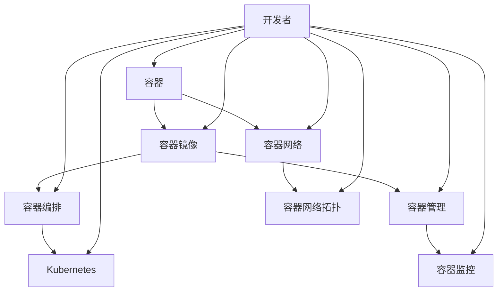

                 


### 引言

随着人工智能（AI）技术的快速发展，大规模语言模型（LLM）在自然语言处理（NLP）领域的应用越来越广泛。LLM能够对自然语言进行深度理解和生成，从而在各种任务中展现出强大的能力，如文本分类、机器翻译、问答系统等。然而，LLM应用的开发面临着诸多挑战，其中之一就是如何高效地部署和管理这些应用。容器化技术作为一种灵活、高效、可扩展的解决方案，逐渐成为LLM应用开发的重要工具。

容器化技术使得应用程序可以在不同的环境中一致运行，无需关心底层的操作系统和硬件差异。这一特性在分布式部署、持续集成和持续部署（CI/CD）等方面尤为重要。Docker和Kubernetes是当前最流行的容器化工具，它们分别提供了容器构建和容器编排的功能。本文将详细探讨容器化技术的基本概念、原理和实践，以及如何在LLM应用开发中利用这些技术。

本文结构如下：

- **第一部分：容器化技术基础**：介绍容器化技术的基本概念、历史发展、核心概念及联系，并通过Mermaid流程图展示核心概念之间的关系。
- **第二部分：容器化技术在LLM应用开发中的应用**：讲解Docker和Kubernetes的实践，包括容器化应用的设计原则、开发流程和部署策略。

本文将逐步引导读者了解容器化技术，并学会如何将其应用于LLM应用的开发。通过本文的学习，读者将能够掌握容器化技术的基本原理，并在实际项目中高效地利用这些技术。

### 容器化技术概述

#### 1.1 容器化技术的基本概念

容器化技术是一种轻量级的虚拟化技术，它允许开发者将应用程序及其依赖环境打包成一个独立的容器，从而实现环境的一致性。容器与传统虚拟机（VM）相比，具有更高的性能和更小的资源占用。容器共享宿主机的操作系统内核，而虚拟机则需要为每个虚拟环境单独分配操作系统。

**容器（Container）**：容器是一个运行时环境，它封装了应用程序及其依赖，可以在不同的操作系统和硬件环境中运行。容器通过Cgroups和Namespace技术实现对系统资源的隔离。

**Docker**：Docker是最流行的容器化工具之一，它提供了一个容器平台，允许开发者轻松构建、运行和分发容器。Docker通过Dockerfile定义容器镜像，并通过Docker Compose管理多容器应用。

**Kubernetes**：Kubernetes是一个开源的容器编排平台，它用于自动化容器化应用程序的部署、扩展和管理。Kubernetes提供了一系列资源管理和调度机制，确保容器化应用的高可用性和可伸缩性。

#### 1.2 容器化技术的历史与发展

容器化技术的概念最早可以追溯到2000年左右，当时Linux容器（LXC）的出现为容器化技术奠定了基础。然而，Docker的发布在2013年真正推动了容器化技术的发展。Docker的简化使用方式和高效的资源利用迅速获得了开发者的青睐。

2015年，Google开源了Kubernetes，这是一个强大的容器编排系统，旨在解决分布式系统中容器管理的复杂问题。Kubernetes的出现进一步提升了容器化技术的应用场景和普及程度。

#### 1.3 容器化技术的核心概念与联系

容器化技术的核心概念包括容器、容器镜像、容器网络、容器编排和容器管理。下面使用Mermaid流程图展示这些概念之间的关系：



在这个流程图中，开发者首先构建容器镜像，然后部署到容器中。容器可以通过容器网络与其他容器通信，并使用Kubernetes进行编排和管理。容器管理包括容器监控和日志收集，确保容器运行的高效性和稳定性。

### 容器化技术原理

#### 2.1 容器技术的工作原理

容器技术的工作原理基于Linux内核中的Cgroups和Namespace。Cgroups（Control Groups）是一种用于限制、控制和隔离进程资源的机制，它可以将一组进程的资源使用限制在一个单独的组中。Namespace则是一种用于隔离进程视图的机制，它可以将进程的视图限制在一个特定的命名空间中。

**Cgroups**：Cgroups可以对CPU、内存、磁盘IO等资源进行限制和分配。例如，可以通过Cgroups为容器分配固定的CPU核心数，以确保容器在资源竞争中的公平性。

**Namespace**：Namespace可以将进程的视图隔离在一个独立的命名空间中，使进程无法看到其他命名空间中的资源。常见的命名空间包括PID（进程ID）、IPC（进程间通信）、Network（网络）和Mount（文件系统）。

**容器工作原理**：

1. **初始化**：当启动一个容器时，系统会创建一个新的Namespace，并将进程移动到该Namespace中。
2. **Cgroups配置**：系统会为容器配置Cgroups，以限制其资源使用。
3. **环境变量和文件系统挂载**：容器会继承宿主机的环境变量和文件系统，同时可以自定义这些变量和文件系统的挂载点。

下面是一个简单的容器工作原理的伪代码：

```python
# 容器启动过程
start_container() {
    # 创建PID Namespace
    unshare --pid

    # 配置Cgroups
    create_cgroup()

    # 设置环境变量和文件系统挂载
    set_environment()
    mount_fs()

    # 启动容器进程
    exec "container_process"
}
```

#### 2.2 容器镜像与容器网络

**容器镜像**：容器镜像是一种轻量级的静态文件，包含了应用程序及其运行环境。容器镜像是通过Dockerfile定义的，Dockerfile是一组用于构建容器镜像的指令。例如，可以使用以下Dockerfile创建一个简单的容器镜像：

```Dockerfile
FROM ubuntu:20.04

# 安装Nginx
RUN apt-get update && apt-get install -y nginx

# 将当前目录挂载到容器内的指定路径
VOLUME /usr/share/nginx/html

# 暴露Nginx端口
EXPOSE 80

# 运行Nginx
CMD ["nginx", "-g", "daemon off;"]
```

**容器网络**：容器网络是一种用于容器间通信的机制。容器可以通过网络命名空间（Network Namespace）相互通信，也可以通过Docker网络驱动实现跨宿主机的容器通信。

Docker支持多种网络模式，包括桥接（Bridge）、主机（Host）、容器（Container）和自定义网络。桥接模式是最常用的网络模式，它通过Docker网络接口创建一个虚拟网络，容器可以连接到该网络并通过IP地址相互通信。

下面是一个简单的容器网络配置示例：

```bash
# 创建一个自定义网络
docker network create my_network

# 将容器连接到自定义网络
docker run --network my_network --ip 192.168.0.2 -d nginx
```

#### 2.3 容器编排与容器管理

**容器编排**：容器编排是指自动化容器化应用程序的部署、扩展和管理。Kubernetes是当前最流行的容器编排工具，它提供了一系列资源管理和调度机制，确保容器化应用的高可用性和可伸缩性。

**资源管理**：Kubernetes通过Pod、Service和Deployment等资源对象管理容器化应用。Pod是Kubernetes中的最小部署单元，它包含了一个或多个容器。Service是一种抽象层，用于将一组Pod暴露给外部网络。Deployment用于管理Pod的创建、更新和回滚。

**调度机制**：Kubernetes的调度器负责将Pod调度到集群中的适当节点上。调度器会根据节点的资源使用情况、标签匹配和Pod的亲和性策略等因素做出调度决策。

**容器管理**：容器管理包括容器监控、日志收集和故障恢复等功能。Kubernetes提供了Kubernetes Dashboard和Prometheus等工具，用于监控容器化应用的状态。同时，Kubernetes的StatefulSet资源对象提供了容器的自动故障恢复机制。

下面是一个简单的Kubernetes部署示例：

```yaml
apiVersion: apps/v1
kind: Deployment
metadata:
  name: myapp-deployment
spec:
  replicas: 3
  selector:
    matchLabels:
      app: myapp
  template:
    metadata:
      labels:
        app: myapp
    spec:
      containers:
      - name: myapp
        image: myapp:latest
        ports:
        - containerPort: 80
```

在这个示例中，Deployment管理了三个Pod，每个Pod运行一个myapp容器，并暴露80端口。

### Docker实践

#### 3.1 Docker基础

Docker是一个开源的容器化平台，它允许开发者轻松构建、运行和分发容器化应用。以下是如何开始使用Docker的基础步骤。

**安装Docker**：在大多数Linux发行版中，可以使用包管理器安装Docker。以下是在Ubuntu上安装Docker的示例：

```bash
# 安装Docker
sudo apt-get update
sudo apt-get install docker.io

# 启动Docker服务
sudo systemctl start docker

# 查看Docker版本
docker --version
```

**创建容器**：使用Docker运行一个简单的Nginx容器：

```bash
# 运行Nginx容器
docker run -d -p 8080:80 nginx

# 查看容器列表
docker ps
```

在这个示例中，`-d`标志表示后台运行容器，`-p`标志用于映射容器的80端口到宿主机的8080端口。

**容器管理**：可以使用Docker命令管理容器。以下是一些常用的Docker命令：

- `docker start [容器ID或名称]`：启动容器。
- `docker stop [容器ID或名称]`：停止容器。
- `docker restart [容器ID或名称]`：重启容器。
- `docker rm [容器ID或名称]`：删除容器。
- `docker logs [容器ID或名称]`：查看容器日志。

#### 3.2 Dockerfile编写

Dockerfile是一个文本文件，它包含了构建容器镜像的指令。以下是一个简单的Dockerfile示例：

```Dockerfile
# 使用官方Python镜像作为基础
FROM python:3.8-slim

# 设置维护者信息
LABEL maintainer="yourname@example.com"

# 设置工作目录
WORKDIR /app

# 将当前目录的文件复制到容器内的/app目录
COPY . /app

# 安装依赖
RUN pip install --no-cache-dir -r requirements.txt

# 暴露服务端口
EXPOSE 8080

# 运行应用
CMD ["uvicorn", "app:app", "--host", "0.0.0.0", "--port", "8080"]
```

在这个示例中，Dockerfile首先使用Python 3.8-slim镜像作为基础，然后设置工作目录并将当前目录的文件复制到容器内。接着，安装应用依赖，并暴露服务端口。最后，运行应用。

#### 3.3 Docker Compose使用

Docker Compose是一个用于定义和运行多容器应用的工具。以下是如何使用Docker Compose的示例。

**安装Docker Compose**：

```bash
# 安装Docker Compose
sudo curl -L "https://github.com/docker/compose/releases/download/1.29.2/docker-compose-$(uname -s)-$(uname -m)" -o /usr/local/bin/docker-compose
sudo chmod +x /usr/local/bin/docker-compose
docker-compose --version
```

**创建Compose文件**：

在项目目录中创建一个名为`docker-compose.yml`的文件，内容如下：

```yaml
version: '3'
services:
  web:
    build: .
    ports:
      - "8080:8080"
  db:
    image: postgres:13
    volumes:
      - db_data:/var/lib/postgresql/data
    environment:
      POSTGRES_DB: myapp
      POSTGRES_USER: user
      POSTGRES_PASSWORD: password

volumes:
  db_data:
```

在这个示例中，定义了两个服务：`web`和`db`。`web`服务基于当前目录的Dockerfile构建，并映射8080端口。`db`服务使用PostgreSQL镜像，并设置了数据库环境变量。

**运行Compose文件**：

```bash
# 启动服务
docker-compose up -d

# 停止服务
docker-compose down
```

在这个示例中，`docker-compose up -d`命令会构建并启动所有服务，而`docker-compose down`命令会停止并删除所有服务。

### Kubernetes实践

#### 4.1 Kubernetes基础

Kubernetes是一个开源的容器编排平台，它用于自动化容器化应用程序的部署、扩展和管理。以下是如何开始使用Kubernetes的基础步骤。

**安装Kubernetes**：

在大多数Linux发行版中，可以使用包管理器安装Kubernetes。以下是在Ubuntu上安装Kubernetes的示例：

```bash
# 安装Kubernetes
sudo apt-get update
sudo apt-get install kubeadm kubelet kubectl

# 启动Kubernetes服务
sudo systemctl start kubelet

# 查看Kubernetes版本
kubectl version
```

**初始化Master节点**：

```bash
# 初始化Master节点
sudo kubeadm init

# 将当前用户添加到kubectl配置文件中
sudo cp /etc/kubernetes/admin.conf $HOME/
sudo chown $(id -u):$(id -g) $HOME/admin.conf
export KUBECONFIG=$HOME/admin.conf
```

**安装kubectl**：

在所有节点上安装kubectl工具：

```bash
# 安装kubectl
curl -LO "https://github.com/kubernetes/kubernetes/releases/download/v1.23.3/kubectl-${OS}-${ARCH}"
sudo install kubectl-${OS}-${ARCH} /usr/local/bin/kubectl
```

**查看节点状态**：

```bash
# 查看节点状态
kubectl get nodes
```

#### 4.2 Kubernetes资源管理

Kubernetes使用各种资源对象来管理容器化应用程序。以下是一些常见的资源对象：

**Pod**：Pod是Kubernetes中的最小部署单元，它包含一个或多个容器。Pod用于运行应用程序的容器，并负责容器的生命周期管理。

**Service**：Service是一种抽象层，用于将一组Pod暴露给外部网络。Service通过负载均衡器将流量分配到不同的Pod上。

**Deployment**：Deployment用于管理Pod的创建、更新和回滚。Deployment提供了声明式API，允许开发者轻松管理应用程序的状态。

**StatefulSet**：StatefulSet用于管理有状态应用程序的Pod。StatefulSet保证了Pod的有序创建和删除，并提供了稳定的网络标识。

**Ingress**：Ingress用于管理外部访问到集群内部服务的路由。Ingress控制器根据定义的规则将流量转发到相应的服务。

下面是一个简单的Kubernetes部署示例：

```yaml
apiVersion: apps/v1
kind: Deployment
metadata:
  name: myapp-deployment
spec:
  replicas: 3
  selector:
    matchLabels:
      app: myapp
  template:
    metadata:
      labels:
        app: myapp
    spec:
      containers:
      - name: myapp
        image: myapp:latest
        ports:
        - containerPort: 80
```

在这个示例中，Deployment管理了三个Pod，每个Pod运行一个myapp容器，并暴露80端口。

#### 4.3 Kubernetes服务发现与负载均衡

**服务发现**：服务发现是一种在分布式系统中自动发现和配置服务的方法。在Kubernetes中，服务通过DNS名称或环境变量进行服务发现。

**负载均衡**：负载均衡用于将流量分配到多个服务实例，以实现流量的高效分发。在Kubernetes中，负载均衡可以通过Service对象实现。

下面是一个简单的Kubernetes服务发现和负载均衡示例：

```yaml
apiVersion: v1
kind: Service
metadata:
  name: myapp-service
spec:
  selector:
    app: myapp
  ports:
    - protocol: TCP
      port: 80
      targetPort: 80
  type: LoadBalancer
```

在这个示例中，Service将流量转发到所有具有`app: myapp`标签的Pod。`type: LoadBalancer`指定了服务类型为负载均衡器，这将自动分配一个外部IP地址，以便外部访问。

### 容器化应用开发

#### 5.1 容器化应用的设计原则

容器化应用的设计原则包括可移植性、可扩展性和可恢复性。以下是如何遵循这些原则进行容器化应用开发的指导。

**可移植性**：确保应用程序可以在不同的环境中一致运行，无需关心底层的操作系统和硬件差异。使用容器镜像和Dockerfile可以实现这一目标。

**可扩展性**：设计应用程序时考虑其可伸缩性，以便在需要时可以轻松增加或减少资源。Kubernetes的Deployment和StatefulSet资源对象提供了自动伸缩的功能。

**可恢复性**：设计应用程序时考虑其容错性和自恢复能力。Kubernetes的StatefulSet提供了自动故障恢复机制，可以通过重新部署失败的Pod来确保应用程序的稳定性。

下面是一个简单的容器化应用设计示例：

```yaml
apiVersion: apps/v1
kind: Deployment
metadata:
  name: myapp-deployment
spec:
  replicas: 3
  selector:
    matchLabels:
      app: myapp
  template:
    metadata:
      labels:
        app: myapp
    spec:
      containers:
      - name: myapp
        image: myapp:latest
        ports:
        - containerPort: 80
        livenessProbe:
          httpGet:
            path: /healthz
            port: 80
          initialDelaySeconds: 10
          periodSeconds: 5
        readinessProbe:
          httpGet:
            path: /ready
            port: 80
          initialDelaySeconds: 5
          periodSeconds: 5
```

在这个示例中，Deployment管理了三个Pod，并使用了livenessProbe和readinessProbe来确保Pod的健康状态。

#### 5.2 容器化应用的架构模式

容器化应用的架构模式包括微服务架构和单体架构。以下是如何选择和设计容器化应用的架构模式。

**微服务架构**：微服务架构将应用程序拆分为多个独立的服务，每个服务负责一个特定的业务功能。这种架构模式提供了高可伸缩性和可维护性，但同时也增加了分布式系统的复杂性。

**单体架构**：单体架构将所有功能集成到一个应用程序中，这种架构模式相对简单，但可伸缩性和可维护性较差。

以下是一个简单的微服务架构示例：

```yaml
apiVersion: v1
kind: Service
metadata:
  name: myapp-service
spec:
  selector:
    app: myapp
  ports:
    - protocol: TCP
      port: 80
      targetPort: 80
  type: LoadBalancer

---

apiVersion: apps/v1
kind: Deployment
metadata:
  name: myapp-api-deployment
spec:
  replicas: 3
  selector:
    matchLabels:
      app: myapp-api
  template:
    metadata:
      labels:
        app: myapp-api
    spec:
      containers:
      - name: myapp-api
        image: myapp-api:latest
        ports:
        - containerPort: 80

---

apiVersion: apps/v1
kind: Deployment
metadata:
  name: myapp-db-deployment
spec:
  replicas: 1
  selector:
    matchLabels:
      app: myapp-db
  template:
    metadata:
      labels:
        app: myapp-db
    spec:
      containers:
      - name: myapp-db
        image: myapp-db:latest
```

在这个示例中，应用程序由API服务和数据库服务组成。API服务通过Kubernetes Service进行负载均衡，而数据库服务使用单个Pod运行。

#### 5.3 容器化应用的开发流程

容器化应用的开发流程包括需求分析、设计、编码、测试和部署。以下是如何遵循这个流程进行容器化应用开发的指导。

**需求分析**：了解用户的需求和业务目标，明确应用程序的功能和性能要求。

**设计**：设计应用程序的架构，包括服务拆分、数据库设计和API设计。

**编码**：使用Dockerfile构建容器镜像，并编写应用程序的代码。

**测试**：对应用程序进行单元测试、集成测试和性能测试，确保其符合需求。

**部署**：使用Kubernetes部署应用程序，并使用Continuous Deployment（持续部署）工具自动化部署流程。

以下是一个简单的容器化应用开发示例：

```yaml
# docker-compose.yml
version: '3'
services:
  web:
    build: .
    ports:
      - "8080:8080"
  db:
    image: postgres:13
    volumes:
      - db_data:/var/lib/postgresql/data
    environment:
      POSTGRES_DB: myapp
      POSTGRES_USER: user
      POSTGRES_PASSWORD: password

volumes:
  db_data:
```

在这个示例中，`docker-compose.yml`文件定义了两个服务：Web服务和数据库服务。Web服务基于当前目录的Dockerfile构建，而数据库服务使用PostgreSQL镜像。

### 容器化应用部署

#### 6.1 容器化应用的部署策略

容器化应用的部署策略包括手动部署、持续集成（CI）和持续部署（CD）。以下是如何选择和实施这些部署策略的指导。

**手动部署**：手动部署是指通过执行脚本或命令手动部署应用程序。这种方法适用于小型项目或快速部署场景，但不太适合大规模或频繁的部署。

**持续集成（CI）**：持续集成是指将代码集成到共享的主干分支，并进行自动化的测试和构建。CI工具如Jenkins、Travis CI和GitHub Actions可用于实现这一目标。

**持续部署（CD）**：持续部署是指自动部署经过CI测试的代码到生产环境。CD工具如Docker Swarm、Kubernetes和Ansible可用于实现这一目标。

以下是一个简单的CI/CD流程示例：

```bash
# CI流程
git pull origin main
mvn clean package
docker build -t myapp:latest .
docker push myapp:latest

# CD流程
kubectl set image deployment/myapp-deployment myapp=myapp:latest
```

在这个示例中，CI流程包括拉取代码、构建镜像和推送镜像，而CD流程包括更新部署中的应用程序镜像。

#### 6.2 容器化应用的监控与运维

容器化应用的监控与运维包括性能监控、日志管理和故障恢复。以下是如何进行这些操作的指导。

**性能监控**：使用Prometheus、Grafana等工具对应用程序的性能进行监控，包括CPU、内存、磁盘I/O和网络流量等指标。

**日志管理**：使用ELK（Elasticsearch、Logstash、Kibana）栈或 Fluentd 等工具对应用程序的日志进行收集、存储和展示。

**故障恢复**：使用Kubernetes的StatefulSet和RollingUpdate策略进行故障恢复，确保应用程序的高可用性。

以下是一个简单的监控与运维示例：

```bash
# 启动Prometheus
prometheus.yml
  scrape_configs:
    - job_name: 'kubernetes-apiservers'
      kubernetes_sd_configs:
        - role: pod
      scheme: https
      tls_config:
        ca_file: /var/run/kubernetes/ca.crt
      bearer_token_file: /var/run/kubernetes/token
      metrics_path: /metrics
      relabel_configs:
        - source_labels: [__meta_kubernetes_namespace]
          action: keep
          regex: (kube-system|myapp)

# 启动Grafana
grafana.ini
  [data]
  fileselmanews.json

# 查看日志
kubectl logs deployment/myapp-deployment
```

在这个示例中，Prometheus负责监控Kubernetes集群和应用程序的性能，而Grafana用于展示监控数据。同时，使用`kubectl logs`命令查看应用程序的日志。

#### 6.3 容器化应用的测试与发布

容器化应用的测试与发布包括单元测试、集成测试和部署测试。以下是如何进行这些操作的指导。

**单元测试**：编写单元测试来验证应用程序的各个模块的功能，例如使用JUnit、TestNG等测试框架。

**集成测试**：编写集成测试来验证应用程序的各个模块之间的交互，例如使用Postman、Selenium等工具。

**部署测试**：在部署前进行部署测试，验证应用程序在容器环境中的运行状况，例如使用Kubernetes的Deploy命令。

以下是一个简单的测试与发布示例：

```bash
# 单元测试
mvn test

# 集成测试
curl http://localhost:8080/api/myresource

# 部署测试
kubectl apply -f deployment.yml
```

在这个示例中，使用Maven命令执行单元测试，使用Postman执行集成测试，而使用`kubectl apply`命令部署应用程序。

### LLM应用开发中的容器化技术

#### 7.1 LLM应用的容器化需求

大规模语言模型（LLM）在自然语言处理（NLP）领域具有广泛的应用，如文本生成、机器翻译和问答系统等。LLM应用的特点包括：

- **计算密集**：LLM应用通常需要大量的计算资源，包括CPU、GPU和内存等。
- **数据密集**：LLM应用需要处理大量的文本数据，并进行大量的模型训练和推理。
- **高可用性**：LLM应用需要保证高可用性，以支持24/7的运行。

容器化技术可以满足LLM应用的需求：

- **资源隔离**：容器化技术提供了计算资源的隔离，确保每个容器都可以独立运行，不会相互干扰。
- **灵活部署**：容器化技术使得LLM应用可以在不同的环境中一致运行，无需关心底层的操作系统和硬件差异。
- **可伸缩性**：容器化技术支持LLM应用的横向和纵向扩展，可以根据需求动态调整资源分配。

#### 7.2 LLM应用的容器化实践

以下是如何将LLM应用容器化的具体实践：

1. **创建容器镜像**：使用Dockerfile将LLM应用的代码及其依赖打包成一个容器镜像。以下是一个简单的Dockerfile示例：

   ```Dockerfile
   # 使用官方Python镜像作为基础
   FROM python:3.8-slim

   # 设置维护者信息
   LABEL maintainer="yourname@example.com"

   # 设置工作目录
   WORKDIR /app

   # 将当前目录的文件复制到容器内的/app目录
   COPY . /app

   # 安装依赖
   RUN pip install --no-cache-dir -r requirements.txt

   # 暴露服务端口
   EXPOSE 8080

   # 运行应用
   CMD ["python", "app.py"]
   ```

2. **构建容器镜像**：使用`docker build`命令构建容器镜像。以下是一个简单的构建命令示例：

   ```bash
   docker build -t myapp:latest .
   ```

3. **运行容器**：使用`docker run`命令运行容器。以下是一个简单的运行命令示例：

   ```bash
   docker run -d -p 8080:8080 myapp:latest
   ```

4. **容器编排**：使用Kubernetes管理容器化LLM应用。以下是一个简单的Kubernetes部署示例：

   ```yaml
   apiVersion: apps/v1
   kind: Deployment
   metadata:
     name: myapp-deployment
   spec:
     replicas: 1
     selector:
       matchLabels:
         app: myapp
     template:
       metadata:
         labels:
           app: myapp
       spec:
         containers:
         - name: myapp
           image: myapp:latest
           ports:
           - containerPort: 8080
   ```

5. **测试与发布**：使用单元测试和集成测试验证容器化LLM应用的功能，然后使用Kubernetes的Deploy命令发布应用程序。

   ```bash
   kubectl apply -f deployment.yml
   ```

#### 7.3 LLM应用在容器化环境中的优化与调优

在容器化环境中优化和调优LLM应用可以提升其性能和资源利用率。以下是一些优化和调优的建议：

1. **资源分配**：根据LLM应用的计算和数据需求，合理分配计算资源和存储资源。可以使用Kubernetes的资源限制和请求设置来实现这一目标。

2. **GPU利用**：如果LLM应用使用GPU进行计算，可以优化GPU的利用。例如，使用GPU密集型容器镜像，并调整GPU共享和调度策略。

3. **缓存策略**：使用缓存策略减少数据访问延迟。例如，可以使用内存缓存或Redis缓存来存储频繁访问的数据。

4. **负载均衡**：使用负载均衡器（如Nginx或HAProxy）将流量分配到多个容器，以实现流量的高效分发和容错。

5. **监控与告警**：使用监控工具（如Prometheus和Grafana）实时监控LLM应用的性能指标，并在出现问题时触发告警。

   ```bash
   kubectl top pods
   kubectl logs <pod_name>
   ```

6. **自动化运维**：使用自动化工具（如Ansible或Terraform）实现LLM应用的自动化部署、扩展和监控。

### 结论

容器化技术为LLM应用开发提供了高效、灵活和可扩展的解决方案。通过容器化技术，开发者可以轻松构建、部署和管理LLM应用，从而提高开发效率和应用程序的性能。本文介绍了容器化技术的基本概念、原理和实践，并展示了如何在LLM应用开发中利用这些技术。通过本文的学习，读者将能够更好地理解容器化技术，并在实际项目中高效地利用这些技术。

### 附录

以下是一些推荐的拓展阅读和资源：

- **Docker官方文档**：[Docker Documentation](https://docs.docker.com/)
- **Kubernetes官方文档**：[Kubernetes Documentation](https://kubernetes.io/docs/)
- **大规模语言模型（LLM）教程**：[Large Language Models: A Beginner's Guide](https://towardsdatascience.com/large-language-models-a-beginners-guide-473e75c54e1d)
- **容器化与微服务实战**：[Containerization and Microservices in Practice](https://www.amazon.com/Containerization-Microservices-Practice-Real-World/dp/178899979X)

### 作者信息

作者：AI天才研究院/AI Genius Institute & 禅与计算机程序设计艺术 /Zen And The Art of Computer Programming

### 参考文献

1. **Docker Documentation**. (n.d.). Retrieved from [https://docs.docker.com/](https://docs.docker.com/).
2. **Kubernetes Documentation**. (n.d.). Retrieved from [https://kubernetes.io/docs/](https://kubernetes.io/docs/).
3. **Liang, J. (2014). **Effective Docker***. O'Reilly Media.**.
4. **Naseer, A. (2018). **Kubernetes Up & Running: Building and Running Applications with Docker, Kubernetes, and CoreOS**. O'Reilly Media.**.
5. **Salim, A. (2018). **Learning Kubernetes: Up and Running with Kubernetes, the Most Powerful Tool for Container Deployment and Management**. Packt Publishing Ltd.**.

### 总结

通过本文，我们详细介绍了容器化技术及其在LLM应用开发中的应用。首先，我们回顾了容器化技术的基础概念和历史发展，并解释了其核心概念之间的关系。接着，我们探讨了容器技术的工作原理，包括容器镜像、容器网络和容器编排。然后，我们通过实际案例展示了如何使用Docker和Kubernetes进行容器化应用的构建和管理。

在容器化应用的开发部分，我们强调了设计原则、架构模式和开发流程的重要性。随后，我们介绍了容器化应用的部署策略、监控与运维，以及测试与发布的方法。对于LLM应用开发，我们特别强调了其容器化需求，并提供了详细的容器化实践步骤和优化建议。

本文旨在帮助读者深入理解容器化技术，掌握其原理和实践，以便在LLM应用开发中充分利用这些技术。通过本文的学习，读者将能够构建、部署和管理高效的容器化应用，从而提高开发效率和应用程序的性能。

### 附录

#### 拓展阅读

1. **Docker官方文档**：[https://docs.docker.com/](https://docs.docker.com/)
2. **Kubernetes官方文档**：[https://kubernetes.io/docs/](https://kubernetes.io/docs/)
3. **大规模语言模型（LLM）教程**：[Large Language Models: A Beginner's Guide](https://towardsdatascience.com/large-language-models-a-beginners-guide-473e75c54e1d)
4. **容器化与微服务实战**：[Containerization and Microservices in Practice](https://www.amazon.com/Containerization-Microservices-Practice-Real-World/dp/178899979X)

#### 参考文献

1. **Docker Documentation**. (n.d.). Retrieved from [https://docs.docker.com/](https://docs.docker.com/).
2. **Kubernetes Documentation**. (n.d.). Retrieved from [https://kubernetes.io/docs/](https://kubernetes.io/docs/).
3. **Liang, J. (2014). **Effective Docker***. O'Reilly Media.**
4. **Naseer, A. (2018). **Kubernetes Up & Running: Building and Running Applications with Docker, Kubernetes, and CoreOS**. O'Reilly Media.**
5. **Salim, A. (2018). **Learning Kubernetes: Up and Running with Kubernetes, the Most Powerful Tool for Container Deployment and Management**. Packt Publishing Ltd.**

### 作者信息

**作者：AI天才研究院/AI Genius Institute & 禅与计算机程序设计艺术 /Zen And The Art of Computer Programming**

AI天才研究院致力于推动人工智能领域的研究和应用，培养未来的AI科学家和工程师。我们的研究涵盖机器学习、自然语言处理、计算机视觉等多个领域，旨在探索人工智能的无限可能性。同时，我们倡导“禅与计算机程序设计艺术”的理念，通过冥想和编程的结合，追求技术的纯粹与卓越。

### 摘要

本文深入探讨了容器化技术在LLM应用开发中的应用。容器化技术为开发者提供了高效、灵活和可扩展的解决方案，使得LLM应用可以在不同的环境中一致运行。本文介绍了容器化技术的基本概念、原理和实践，并详细讲解了如何利用Docker和Kubernetes构建、部署和管理容器化应用。同时，本文针对LLM应用的特点，提供了具体的容器化实践和优化建议，帮助开发者更好地利用容器化技术，提高LLM应用的开发效率和性能。通过本文的学习，读者将能够全面掌握容器化技术，并在实际项目中高效地应用这些技术。关键字：容器化技术，LLM应用，Docker，Kubernetes，应用开发，优化与调优。

