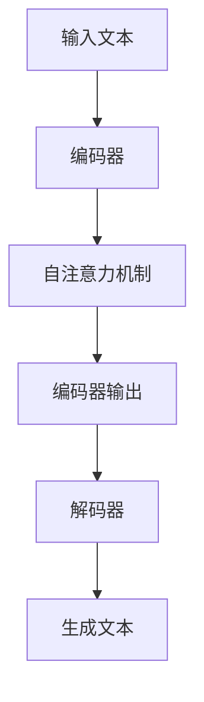

                 

### 1.1. LLM的基本原理

#### 1.1.1. 语言模型的定义

语言模型（Language Model，LM）是一种统计模型，用于预测下一个单词或词组。在自然语言处理（NLP）领域，语言模型是一个非常重要的工具，它能够对输入文本进行建模，并生成相应的输出。LLM（Large Language Model）则是大型语言模型的简称，具有数十亿级别的参数，能够对输入文本进行更细致、更复杂的建模。

语言模型的基本原理是基于统计模型，通过对大量文本数据的学习，从中提取出单词、短语和句子的统计规律。这些规律可以用于预测下一个单词或短语，从而生成连续的文本。

#### 1.1.2. Transformer模型

Transformer模型是一种基于自注意力机制的序列建模模型，主要由编码器和解码器组成。编码器（Encoder）将输入序列编码为固定长度的向量，解码器（Decoder）则根据编码器生成的向量生成输出序列。与传统的序列建模模型如RNN（递归神经网络）相比，Transformer模型具有更高效、更灵活的建模能力。

Transformer模型的核心是自注意力机制（Self-Attention），它允许模型在生成每个单词时，对输入序列中所有单词进行加权求和，从而更好地捕捉单词之间的关联性。

#### 1.1.3. LLM在NLP中的应用

LLM在自然语言处理（NLP）领域有广泛的应用，包括但不限于以下几种：

- **文本分类**：通过对文本进行建模，LLM可以判断文本所属的类别。例如，在新闻分类、情感分析等领域，LLM可以自动识别文本的主题和情感倾向。

- **机器翻译**：LLM可以学习不同语言之间的对应关系，从而实现机器翻译。例如，在英语和中文之间的翻译中，LLM可以理解并生成符合语法和语义规则的翻译文本。

- **问答系统**：LLM可以基于对大量文本的学习，回答用户提出的问题。例如，在搜索引擎、智能客服等领域，LLM可以自动生成回答，提高用户体验。

- **文本生成**：LLM可以根据输入的文本片段，生成连续的文本。例如，在写作辅助、自动摘要等领域，LLM可以自动生成文章、摘要等文本内容。

#### Mermaid 流程图

为了更清晰地展示LLM在NLP中的应用，我们使用Mermaid流程图来描述LLM的核心流程。



在这个流程图中，输入文本首先被编码器处理，通过自注意力机制生成编码器输出。然后，解码器根据编码器输出生成输出文本。

### 总结

在本文的第一部分，我们介绍了LLM的基本原理，包括语言模型的定义、Transformer模型的工作原理，以及LLM在NLP领域的应用。通过自注意力机制，LLM能够更好地捕捉文本中的关联性，从而在多种NLP任务中表现出色。接下来，我们将进一步探讨LLM的核心算法和数学基础，以便更好地理解LLM的工作原理和实现细节。敬请期待。


```markdown
### 2.2. 模型优化与调参

#### 2.2.1. 学习率调整

学习率（Learning Rate）是影响模型训练效果的关键参数。学习率过大可能导致模型无法收敛，而过小则可能导致训练过程缓慢。为了找到合适的学习率，常用的方法包括：

- **固定学习率**：训练过程中学习率保持不变。这种方法简单易行，但需要手动调整学习率，且在训练过程中可能需要多次调整。

- **指数衰减学习率**：学习率随着训练迭代次数的增加而指数衰减。公式如下：
  $$ 
  learning\_rate = initial\_learning\_rate \times decay
  $$
  其中，$initial\_learning\_rate$ 是初始学习率，$decay$ 是衰减率。

- **学习率衰减**：在训练过程中，根据预定的策略调整学习率。常见的策略有线性衰减、余弦衰减等。

#### 2.2.2. 梯度裁剪

梯度裁剪（Gradient Clipping）是一种防止模型在训练过程中出现过拟合的方法。其原理是将梯度裁剪到一定的范围内，以避免梯度过大或过小。

- **裁剪范围**：通常裁剪范围为 [-clip_value, clip_value]。
- **实现方法**：在每一步梯度更新之前，将梯度的每个元素裁剪到裁剪范围内。公式如下：
  $$
  clipped\_gradient = \begin{cases}
  gradient & \text{if } gradient \leq clip\_value \\
  clip\_value & \text{if } gradient > clip\_value
  \end{cases}
  $$

#### 2.2.3. 优化器选择

优化器（Optimizer）是用于更新模型参数的工具。不同的优化器有不同的优化策略，适用于不同的训练场景。以下是一些常用的优化器：

- **Adam**：结合了Adagrad和RMSProp的优点，适用于大部分场景。
- **RMSProp**：使用梯度平方的平均值来动态调整学习率，对稀疏数据有较好的适应性。
- **Adagrad**：为不同的特征分配不同的学习率，对稀疏数据有较好的优化效果。

在选择优化器时，需要考虑模型的复杂度、数据的特点以及训练的目标。通常，Adam是默认的选择，但在某些特殊场景下，其他优化器可能更为合适。

### 伪代码实现

下面是一个简单的伪代码，用于展示学习率调整、梯度裁剪和优化器选择的过程。

```python
# 初始化模型参数
model = initialize_model()

# 设置初始学习率、衰减率和裁剪值
initial_learning_rate = 0.01
decay_rate = 0.95
clip_value = 1.0

# 开始训练
for epoch in range(num_epochs):
    # 前向传播
    outputs = model(inputs)
    loss = compute_loss(outputs, labels)
    
    # 反向传播
    gradients = compute_gradients(model, loss)
    
    # 梯度裁剪
    clipped_gradients = gradient_clipping(gradients, clip_value)
    
    # 更新模型参数
    model = update_model(model, clipped_gradients, learning_rate=initial_learning_rate)
    
    # 学习率调整
    initial_learning_rate = initial_learning_rate * decay_rate

    # 打印当前 epoch 的损失值
    print(f"Epoch {epoch}: Loss = {loss}")
```

在这个伪代码中，我们首先初始化模型参数，然后进入训练循环。在每一轮迭代中，我们首先进行前向传播，计算损失值。接着，我们计算梯度，并对其进行裁剪。最后，我们使用裁剪后的梯度更新模型参数。在训练过程中，我们根据预定的衰减率调整学习率，以防止模型出现过拟合。

通过上述优化策略和伪代码实现，我们可以有效地提高模型的训练效果和收敛速度。在接下来的章节中，我们将进一步探讨LLM的数学基础，以更深入地理解其工作原理。敬请期待。
```

通过上述内容，我们详细介绍了模型优化与调参的几个关键环节，包括学习率调整、梯度裁剪和优化器选择。这些技术不仅有助于提高模型的训练效果，还能加速模型的收敛速度。在下一章节中，我们将进一步探讨LLM的数学基础，为理解其复杂的工作原理打下坚实的基础。敬请期待。

