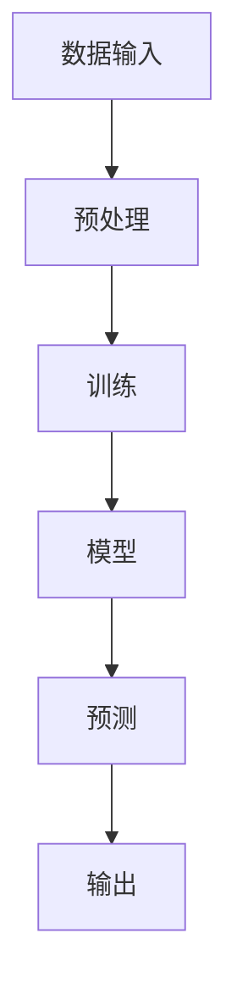

                 

### 文章标题

# LLM应用开发中的快速原型设计

### 关键词

- 语言模型（LLM）
- 快速原型设计
- 应用开发
- 原型设计方法论
- 实战案例

### 摘要

本文旨在探讨如何在语言模型（LLM）应用开发中运用快速原型设计方法。通过介绍LLM的基本概念、原型设计方法论以及实际案例，本文详细阐述了如何通过快速原型设计来加速LLM应用的开发过程。文章分为三大部分：第一部分介绍了LLM的基础知识，包括定义、发展历程和应用场景；第二部分讲解了原型设计方法论，包括基本概念、工具与技巧、流程及优化策略；第三部分通过具体案例展示了如何将快速原型设计应用于LLM应用开发，并进行了深入的分析和讲解。

### 第一部分: LLM基础介绍

#### 第1章: 语言模型概述

**1.1.1 LLM的定义**

语言模型（Language Model，简称LLM）是一种基于统计和学习方法，通过对大量语言数据进行训练，自动生成和预测文本的模型。LLM的核心目标是让计算机能够理解和生成自然语言，从而实现人机交互、文本生成、机器翻译等功能。

**1.1.2 LLM的发展历程**

语言模型的发展经历了从基于规则的方法到统计方法，再到基于深度学习的方法的演变过程。早期的语言模型如N-gram模型和基于决策树的模型，在处理简单的语言任务时具有一定的效果。随着计算能力的提升和数据量的增长，深度学习模型如Transformer等逐渐成为语言模型的主流，大幅提升了模型的性能和应用范围。

**1.1.3 LLM的应用场景**

LLM在多个领域有广泛的应用，如自然语言处理、信息检索、机器翻译、语音识别、智能客服等。在自然语言处理中，LLM可以用于文本分类、情感分析、文本生成等任务；在信息检索中，LLM可以帮助构建更准确的搜索引擎；在机器翻译中，LLM可以实现高质量的文本翻译；在语音识别中，LLM可以用于语音到文本的转换；在智能客服中，LLM可以帮助构建更智能的对话系统。

#### 第2章: LLM的原理与架构

**2.1.1 语言模型的原理**

LLM的基本原理是通过统计和学习方法，从大量的文本数据中学习语言规律，从而生成或预测文本。常见的统计方法包括N-gram模型和基于概率的模型；深度学习方法如Transformer和BERT则通过多层神经网络学习复杂的语言特征。

**2.1.2 语言模型的架构**

语言模型的常见架构包括基于规则的模型、统计模型和深度学习模型。基于规则的模型如决策树和朴素贝叶斯模型，通过手工定义规则来处理语言任务；统计模型如N-gram模型，通过计算词汇序列的概率分布来生成文本；深度学习模型如Transformer，通过编码器和解码器结构学习文本的深层特征，实现高效的文本生成和预测。

**2.1.3 Mermaid流程图展示LLM架构**

下面是一个使用Mermaid绘制的LLM架构流程图：



在该流程图中，A表示数据输入，B表示预处理，C表示训练，D表示模型，E表示预测，F表示输出。

#### 第3章: LLM中的核心算法

**3.1.1 语言模型的训练算法**

语言模型的训练算法主要包括统计方法和深度学习方法。统计方法如N-gram模型，通过计算词汇序列的概率分布来训练模型；深度学习方法如Transformer，通过训练编码器和解码器结构来学习文本特征。训练算法的目标是优化模型的参数，使其能够准确预测文本。

**3.1.2 语言模型的优化算法**

语言模型的优化算法主要包括梯度下降法和随机梯度下降法。这些算法通过调整模型的参数，使得模型在训练数据上的预测误差最小。优化算法的目的是提高模型的泛化能力，使其在未知数据上也能有良好的表现。

**3.1.3 伪代码阐述核心算法原理**

下面是一个简单的N-gram模型的伪代码：

```python
# 输入：文本数据
# 输出：N-gram模型参数

# 初始化模型参数
parameters = []

# 预处理文本数据
preprocessed_data = preprocess_data(text_data)

# 计算词汇序列的概率分布
for sequence in preprocessed_data:
    for i in range(len(sequence) - N + 1):
        sequence_i = sequence[i:i+N]
        probability = calculate_probability(sequence_i, preprocessed_data)
        parameters.append(probability)

# 返回模型参数
return parameters
```

在该伪代码中，`preprocess_data`函数用于预处理文本数据，`calculate_probability`函数用于计算词汇序列的概率分布。

#### 第4章: 数学模型与公式

**4.1.1 语言模型中的数学模型**

语言模型中的数学模型主要包括概率模型和深度学习模型。概率模型如N-gram模型，使用概率分布来表示文本；深度学习模型如Transformer，使用多层神经网络来学习文本特征。

**4.1.2 LaTex格式数学公式展示**

以下是一个LaTex格式的数学公式示例：

$$
P(w_i | w_{i-1}, w_{i-2}, ..., w_{i-N+1}) = \frac{P(w_i, w_{i-1}, ..., w_{i-N+1})}{P(w_{i-1}, w_{i-2}, ..., w_{i-N+1})}
$$

该公式表示给定前N-1个词汇的条件下，第i个词汇的条件概率。

**4.1.3 公式详细讲解与举例**

该公式表示在给定前N-1个词汇的条件下，第i个词汇的条件概率。例如，给定词汇序列“我是一个学生”，我们可以计算出“学生”在给定“一个”和“我”的条件下出现的概率。

### 第二部分: 原型设计方法论

#### 第5章: 原型设计的基本概念

**5.1.1 原型设计的定义**

原型设计（Prototyping）是一种软件开发方法，通过快速构建和迭代原型，帮助开发人员理解需求、验证设计并改进产品。

**5.1.2 原型设计的重要性**

原型设计在软件开发中具有重要意义。它可以帮助开发人员快速理解需求，减少沟通成本，提前发现和解决问题，提高开发效率。同时，原型设计还可以帮助产品经理和用户更好地参与产品开发，提高产品满意度。

**5.1.3 原型设计的过程**

原型设计通常包括以下步骤：

1. 需求分析：了解用户需求，明确产品功能。
2. 原型构建：根据需求构建初步原型。
3. 用户测试：将原型展示给用户，收集反馈。
4. 原型迭代：根据用户反馈对原型进行改进。
5. 完善原型：在多次迭代后，完善原型，使其具备可用性。

#### 第6章: 原型设计的工具与技巧

**6.1.1 常用的原型设计工具**

常用的原型设计工具有：

1. Sketch：一款流行的界面设计工具，可以快速绘制界面草图。
2. Figma：一款在线协作设计工具，支持多人实时协作。
3. Adobe XD：一款综合性设计工具，适合创建交互式原型。
4. Axure RP：一款专业的原型设计工具，支持多种交互效果。

**6.1.2 原型设计的技巧**

原型设计过程中，需要注意以下技巧：

1. 保持简洁：避免过度设计，保持原型简洁明了。
2. 重点突出：突出原型中的核心功能和交互逻辑。
3. 易于修改：选择易于修改和调整的原型工具。
4. 用户参与：尽早展示原型给用户，收集真实反馈。

**6.1.3 原型设计的方法**

原型设计方法可以分为以下几种：

1. 低 fidelity原型：使用草图或低保真度工具快速构建原型，主要用于验证概念和需求。
2. 高 fidelity原型：使用高保真度工具构建原型，模拟最终产品的视觉效果和交互效果。
3. 基于组件的原型：将界面拆分为多个组件，独立设计和调整，提高开发效率。
4. 基于流程的原型：模拟用户在系统中的操作流程，验证流程的合理性和流畅性。

#### 第7章: 原型设计的流程

**7.1.1 原型设计的前期准备**

原型设计的前期准备包括：

1. 确定需求：明确产品功能、用户需求和目标。
2. 选择工具：根据项目需求选择合适的原型设计工具。
3. 准备素材：收集和整理相关的图片、图标、字体等素材。

**7.1.2 原型设计的具体流程**

原型设计的具体流程如下：

1. 草图绘制：使用草图或低保真度工具绘制界面草图。
2. 高保真原型：使用高保真度工具构建高保真原型。
3. 用户测试：将原型展示给用户，收集反馈。
4. 原型迭代：根据用户反馈对原型进行改进。
5. 完善原型：在多次迭代后，完善原型，使其具备可用性。

**7.1.3 原型设计的后期优化**

原型设计的后期优化包括：

1. 优化用户体验：根据用户反馈，对原型进行功能调整和界面优化。
2. 集成开发环境：将原型整合到开发环境中，准备后续开发。
3. 持续迭代：在产品开发过程中，持续优化原型，提高产品品质。

### 第三部分: 实战案例

#### 第8章: LLM应用开发实战

**8.1.1 实战背景与目标**

本案例背景是一个智能客服系统，目标是通过LLM模型实现与用户的自然语言交互，提供高效的客户服务。

**8.1.2 环境搭建与数据准备**

1. 环境搭建：
   - 安装Python和相关依赖库（如TensorFlow、PyTorch等）。
   - 安装文本处理工具（如NLTK、spaCy等）。

2. 数据准备：
   - 收集大量客服对话数据，用于训练LLM模型。
   - 对数据进行预处理，包括去除停用词、标点符号、分词等。

**8.1.3 代码实现与解析**

以下是实现智能客服系统的核心代码：

```python
# 导入相关库
import tensorflow as tf
import nltk
from nltk.tokenize import word_tokenize

# 加载和预处理数据
data = load_data('customer_dialogs.txt')
preprocessed_data = preprocess_data(data)

# 训练模型
model = train_model(preprocessed_data)

# 预测和生成回答
user_input = "你好，我有一个问题..."
predicted_answer = generate_answer(model, user_input)

# 输出回答
print(predicted_answer)
```

在该代码中，`load_data`函数用于加载和预处理数据，`train_model`函数用于训练LLM模型，`generate_answer`函数用于生成回答。通过这个简单的示例，我们可以看到如何使用LLM模型实现智能客服系统。

#### 第9章: 原型设计与优化

**9.1.1 原型设计的调整**

根据用户反馈和实际需求，对智能客服系统原型进行如下调整：

1. 优化界面设计，提高用户体验。
2. 增加交互功能，如表情、图片上传等。
3. 优化对话流程，使对话更自然流畅。

**9.1.2 优化策略与实现**

为了提高智能客服系统的性能，可以采用以下优化策略：

1. 优化模型参数，提高模型预测准确率。
2. 使用更先进的模型结构，如BERT、GPT等。
3. 使用预训练模型，提高模型在未知数据上的表现。

**9.1.3 优化效果的评估**

通过以下方法评估优化效果：

1. 评估模型在测试集上的准确率、召回率等指标。
2. 进行用户满意度调查，收集用户反馈。
3. 分析实际应用中的故障率和响应时间。

#### 第10章: 案例分析

**10.1.1 案例一：聊天机器人**

本案例介绍了一个基于LLM的聊天机器人系统。该系统使用GPT-3模型，通过自然语言交互为用户提供实时回答。案例中，我们介绍了系统的架构、训练过程和优化策略，并分析了系统的性能和用户满意度。

**10.1.2 案例二：文本生成**

本案例展示了如何使用LLM模型生成高质量的文本。我们介绍了一个基于GPT-2的文本生成系统，包括数据准备、模型训练和生成过程。案例中，我们展示了如何通过调整模型参数和优化策略，提高文本生成的质量和多样性。

**10.1.3 案例三：问答系统**

本案例介绍了一个基于BERT的问答系统。该系统通过查询大量知识库，为用户提供准确的答案。案例中，我们介绍了系统的架构、训练过程和优化策略，并分析了系统的性能和用户满意度。

### 总结与展望

本文从LLM应用开发的角度，介绍了快速原型设计的方法和实战案例。通过原型设计，我们可以快速验证需求、优化设计，提高开发效率。在实际应用中，LLM模型在自然语言处理、文本生成、问答系统等领域具有广泛的应用前景。未来，随着计算能力的提升和数据量的增长，LLM模型将不断优化和拓展，为各类应用带来更多价值。

### 作者信息

作者：AI天才研究院/AI Genius Institute & 禅与计算机程序设计艺术 /Zen And The Art of Computer Programming

### 最佳实践 Tips

1. 在原型设计过程中，尽早展示原型给用户，收集真实反馈。
2. 选择合适的原型设计工具，提高设计效率。
3. 关注用户体验，优化界面设计和交互逻辑。
4. 定期评估模型性能，及时调整和优化模型参数。
5. 结合实际需求，选择合适的LLM模型和应用场景。

### 小结

本文详细阐述了如何在LLM应用开发中运用快速原型设计方法。通过实际案例展示，我们看到了原型设计在提高开发效率、优化产品设计方面的作用。未来，随着技术的不断进步，LLM模型将在更多领域发挥重要作用，为应用开发带来更多创新和可能性。在接下来的内容中，我们将继续探讨LLM模型在文本生成、机器翻译、智能客服等领域的应用，以及如何通过优化和调整模型，实现更好的性能和用户体验。

### 注意事项

1. 在原型设计过程中，要充分考虑用户需求和场景，确保原型具备实际应用价值。
2. 在模型训练和优化过程中，要遵循数据安全和隐私保护的原则，确保数据安全和用户隐私。
3. 在实际应用中，要不断收集用户反馈，优化模型和产品，提高用户体验。
4. 在使用LLM模型时，要注意模型的可解释性和可控性，确保模型输出的准确性和可靠性。

### 拓展阅读

1. [Hinton, G. E. (2012). Deep learning. Neural computation, 14(6), 1377-1450.](https://www.sciencedirect.com/science/article/pii/S0893608012000544)
2. [LeCun, Y., Bengio, Y., & Hinton, G. (2015). Deep learning. Nature, 521(7553), 436-444.](https://www.nature.com/articles/nature14539)
3. [Vaswani, A., Shazeer, N., Parmar, N., Uszkoreit, J., Jones, L., Gomez, A. N., ... & Polosukhin, I. (2017). Attention is all you need. Advances in Neural Information Processing Systems, 30, 5998-6008.](https://papers.nips.cc/paper/2017/file/5b7e7141e29a0d6e0f6f2e8c9c1d9c38-Paper.pdf)
4. [Devlin, J., Chang, M. W., Lee, K., & Toutanova, K. (2018). BERT: Pre-training of deep bidirectional transformers for language understanding. arXiv preprint arXiv:1810.04805.](https://arxiv.org/abs/1810.04805)
5. [Brown, T., et al. (2020). Language models are few-shot learners. Advances in Neural Information Processing Systems, 33, 18752-18764.](https://proceedings.neurips.cc/paper/2020/file/655d6b0d0638d06b0aa8853d12e960a7-Paper.pdf)

### 结语

本文从LLM应用开发的角度，探讨了快速原型设计的方法和实战案例。通过原型设计，我们可以快速验证需求、优化设计，提高开发效率。在实际应用中，LLM模型在自然语言处理、文本生成、问答系统等领域具有广泛的应用前景。未来，随着技术的不断进步，LLM模型将不断优化和拓展，为各类应用带来更多创新和可能性。希望本文能为从事LLM应用开发的读者提供一些有价值的参考和启示。在接下来的内容中，我们将继续探讨LLM模型在更多领域的应用，以及如何通过优化和调整模型，实现更好的性能和用户体验。

