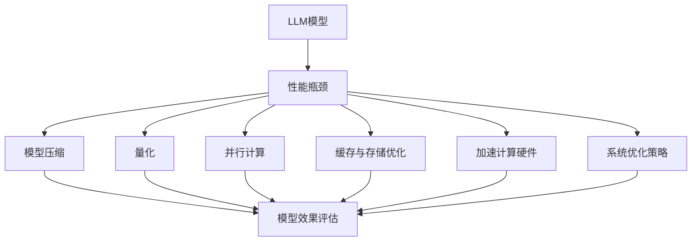

                 


### 第1章：LLM应用开发中的性能优化策略

#### 1.1 LLM性能优化概述

##### 1.1.1 LLM性能优化的重要性
大型语言模型（LLM）在现代应用中扮演着越来越重要的角色，如自然语言处理、问答系统、机器翻译等。然而，LLM的性能优化是开发过程中的一个重大挑战。性能优化不仅仅关乎用户体验，更涉及到成本和资源分配。优化不佳可能导致响应延迟、服务器过载，甚至应用崩溃。因此，性能优化在LLM应用开发中显得至关重要。

##### 1.1.2 LLM性能瓶颈
1. **模型规模**：随着神经网络深度和宽度的增加，模型的计算和存储需求也急剧上升。大规模模型在推理时需要更多的计算资源。
2. **服务器资源**：有限的计算能力、内存、存储等硬件资源可能会成为性能瓶颈。特别是当多个用户同时使用LLM服务时，资源竞争会更加激烈。

##### 1.1.3 性能优化目标
1. **减少响应时间**：提高用户满意度，提升应用的响应速度。
2. **提高吞吐量**：在有限的资源下，最大化支持用户请求的数量。
3. **降低成本**：通过优化策略，减少对硬件和运维资源的依赖，从而降低总体成本。

#### 1.2 模型压缩与量化

##### 1.2.1 模型压缩方法
1. **知识蒸馏**：通过训练一个较小的模型来模拟原始大型模型的行为。
2. **整数化**：将浮点数参数转换为整数，以减少模型大小。
3. **减少模型大小**：直接删除模型中不重要的权重，减少模型规模。

##### 1.2.2 模型量化技术
1. **量化精度与性能的关系**：量化过程中，精度损失与性能提升之间存在权衡。
2. **离散量化与连续量化**：离散量化将浮点数转换为有限的整数值，而连续量化则保持浮点数部分精度。
3. **量化算法介绍**：包括全精度量化、定点量化、二值量化等。

##### 1.2.3 模型压缩实例
1. **模型压缩步骤**：预处理、量化、压缩、评估。
2. **模型压缩效果评估**：比较压缩前后模型在速度、准确度上的表现。

#### 1.3 并行计算与分布式计算

##### 1.3.1 并行计算基础
1. **并行计算原理**：将任务分解为多个子任务，同时执行。
2. **多核处理器架构**：现代计算机通常配备多核处理器，能够支持并行计算。

##### 1.3.2 分布式计算技术
1. **数据并行**：将数据分布在多个节点上处理。
2. **模型并行**：将模型分解为多个部分，在多个节点上同时训练。
3. **张量并行**：将张量（矩阵）分解为多个子张量，并行计算。

##### 1.3.3 并行计算实例
1. **并行计算框架介绍**：如TensorFlow、PyTorch的分布式训练框架。
2. **并行计算优化策略**：负载均衡、通信优化、数据传输优化等。

#### 1.4 缓存与存储优化

##### 1.4.1 缓存策略
1. **LRU缓存算法**：Least Recently Used，最近最少使用算法。
2. **多级缓存体系**：包括L1、L2、L3缓存等。

##### 1.4.2 存储优化技术
1. **SSD存储**：固态硬盘，相比传统硬盘具有更快的读写速度。
2. **分布式存储系统**：提高存储容量和可用性。

##### 1.4.3 存储优化实例
1. **存储优化流程**：存储选择、性能评估、优化调整。
2. **存储优化效果评估**：比较优化前后存储性能的提升。

#### 1.5 加速计算硬件

##### 1.5.1 GPU加速
1. **CUDA编程基础**：NVIDIA推出的并行计算平台。
2. **GPU架构**：并行计算架构，能够高效处理大规模数据。

##### 1.5.2 TPU与FPGA
1. **TPU架构与应用**：谷歌推出的专用AI加速器。
2. **FPGA加速技术**：可编程硬件加速器，适用于特定计算任务。

##### 1.5.3 其他加速硬件
1. **AI芯片**：专为AI任务设计的芯片。
2. **custom hardware**：定制硬件，针对特定应用优化。

#### 1.6 系统优化策略

##### 1.6.1 调度策略
1. **调度算法**：用于优化任务分配和资源利用。
2. **调度优化目标**：最小化响应时间、最大化吞吐量等。

##### 1.6.2 资源管理
1. **CPU资源管理**：合理分配CPU资源，避免资源竞争。
2. **GPU资源管理**：优化GPU的使用，提高计算效率。

##### 1.6.3 系统优化实例
1. **系统优化步骤**：性能评估、瓶颈分析、优化策略实施。
2. **系统优化效果评估**：比较优化前后系统性能的提升。

---

### 第2章：核心概念与联系

#### 2.1 LLM性能优化概念

##### 2.1.1 性能优化的定义
性能优化是指通过一系列技术手段，提升系统的响应速度、吞吐量和成本效益。

##### 2.1.2 性能优化的核心指标
1. **响应时间**：从请求到响应的时间。
2. **吞吐量**：单位时间内处理请求的数量。
3. **成本**：包括硬件成本、运维成本等。

##### 2.1.3 性能优化与相关技术
1. **模型压缩**：减少模型大小，提高存储和计算效率。
2. **量化**：降低模型精度，减少计算资源需求。
3. **并行计算**：利用多核处理器和分布式计算，提高计算速度。

#### 2.2 性能优化与LLM架构

##### 2.2.1 LLM架构
1. **模型结构**：多层神经网络，包括输入层、隐藏层和输出层。
2. **数据流**：数据从输入层流向隐藏层，经过多次迭代计算，最终生成输出。

##### 2.2.2 性能优化与架构关系
1. **模型压缩**：通过减少模型参数数量，降低计算复杂度。
2. **量化**：调整模型参数精度，减少计算资源需求。
3. **并行计算**：利用并行计算架构，提高模型训练和推理速度。

##### 2.2.3 Mermaid流程图


### 第3章：核心算法原理讲解

#### 3.1 模型压缩与量化算法

##### 3.1.1 知识蒸馏算法
```python
# 知识蒸馏伪代码

def knowledge_distillation(original_model, student_model, teacher_model, data_loader):
    for data, target in data_loader:
        # 前向传播
        original_output = original_model(data)
        teacher_output = teacher_model(data)

        # 训练学生模型
        student_loss = criterion(student_model(data), target)
        student_loss.backward()

        # 更新学生模型参数
        optimizer.step()

        # 清零梯度
        optimizer.zero_grad()

    return student_model
```
**算法原理讲解**：知识蒸馏是一种将大模型的权重知识传递给小模型的技术。训练过程中，大模型作为“教师”产生标签，小模型作为“学生”学习这些标签。这样，学生模型可以模拟教师模型的行为，但规模更小，计算效率更高。

##### 3.1.2 整数化算法
```python
# 整数化伪代码

def quantization(model, quant_bits):
    for param in model.parameters():
        # 将每个参数的值量化为 quant_bits 个位数的整数
        quantized_param = int(param.item() * (2 ** quant_bits))
        param.data = quantized_param
    return model
```
**算法原理讲解**：整数化是一种将浮点数参数转换为整数的方法。通过将浮点数乘以2的幂次，并将结果截断为整数，可以大幅减少模型大小。量化位数（quant_bits）决定了整数化后的精度。

##### 3.1.3 量化算法
```python
# 量化伪代码

def quantize_tensor(tensor, quant_level=8):
    # 计算最小值和最大值
    min_val = torch.min(tensor).item()
    max_val = torch.max(tensor).item()

    # 计算量化因子
    scale = (max_val - min_val) / (2 ** quant_level - 1)

    # 量化
    quantized_tensor = torch.round(tensor / scale).float() * scale

    return quantized_tensor
```
**算法原理讲解**：量化是一种调整模型参数精度的方法。通过将浮点数转换为具有有限精度的整数，可以减少计算资源需求。量化算法通常包括计算最小值和最大值，然后根据这些值计算量化因子，最后将原始值按量化因子量化。

#### 3.2 并行计算算法

##### 3.2.1 数据并行算法
```python
# 数据并行伪代码

def data_parallel(model, devices):
    # 将模型分布在多个设备上
    models = nn.ModuleList([model.to(device) for device in devices])

    # 将数据分成多个批次
    data_loader = torch.utils.data.DataLoader(dataset, batch_size=len(devices))

    # 并行训练
    for data in data_loader:
        outputs = [model(data) for model in models]
        loss = criterion(torch.mean(outputs, dim=0), target)

        # 反向传播
        loss.backward()

        # 更新模型参数
        for model in models:
            optimizer.step()
            optimizer.zero_grad()

    return model
```
**算法原理讲解**：数据并行是一种将数据分布在多个设备上进行训练的方法。每个设备上的模型独立计算梯度，然后通过平均梯度更新全局模型。这种方法可以加速训练过程，提高计算效率。

##### 3.2.2 模型并行算法
```python
# 模型并行伪代码

def model_parallel(model, devices):
    # 将模型分解为多个部分
    parts = split_model(model, devices)

    # 分别训练每个部分
    for part in parts:
        optimizer = torch.optim.SGD(part.parameters(), lr=learning_rate)
        criterion = nn.CrossEntropyLoss()

        for epoch in range(num_epochs):
            for data, target in data_loader:
                output = part(data)
                loss = criterion(output, target)

                loss.backward()
                optimizer.step()
                optimizer.zero_grad()

    # 合并模型部分
    model = merge_model(parts)
    return model
```
**算法原理讲解**：模型并行是一种将模型分解为多个部分，每个部分在不同的设备上独立训练的方法。每个部分训练完成后，将这些部分合并，形成一个完整的模型。这种方法可以充分利用多设备资源，提高训练效率。

##### 3.2.3 张量并行算法
```python
# 张量并行伪代码

def tensor_parallel(model, devices):
    # 将张量分解为多个子张量
    tensors = split_tensor(model.weight, devices)

    # 分别计算每个子张量的梯度
    gradients = [torch.zeros_like(tensor) for tensor in tensors]

    for data in data_loader:
        output = model(data)
        loss = criterion(output, target)

        # 计算梯度
        grads = torch.autograd.grad(loss, model.parameters())

        # 分配梯度到各个子张量
        for grad, tensor in zip(grads, tensors):
            gradients[tensor.index] += grad

    # 合并子张量梯度
    model.weight.grad = torch.cat(gradients).float()

    # 更新模型参数
    optimizer.step()

    return model
```
**算法原理讲解**：张量并行是一种将模型权重（张量）分解为多个子张量，然后在多个设备上并行计算梯度的方法。这种方法可以加速模型训练，提高计算效率。

### 第4章：数学模型和数学公式

#### 4.1 性能优化数学模型

##### 4.1.1 响应时间模型
$$
T_r = \frac{1}{\lambda} + \frac{1}{\mu}
$$
**公式推导**：其中，$\lambda$为请求到达率，$\mu$为服务速率。响应时间由两部分组成：等待时间和服务时间。

**举例说明**：假设请求到达率为10次/秒，服务速率为5次/秒，则响应时间为：
$$
T_r = \frac{1}{10} + \frac{1}{5} = 0.2 + 0.2 = 0.4 \text{秒}
$$

##### 4.1.2 吞吐量模型
$$
Q = \frac{\lambda}{\mu}
$$
**公式推导**：吞吐量是单位时间内处理请求的数量，与到达率和服务速率成反比。

**举例说明**：假设请求到达率为10次/秒，服务速率为5次/秒，则吞吐量为：
$$
Q = \frac{10}{5} = 2 \text{次/秒}
$$

##### 4.1.3 成本模型
$$
C = C_h + C_o
$$
**公式推导**：成本由硬件成本（$C_h$）和运维成本（$C_o$）组成。

**举例说明**：假设硬件成本为1000美元/月，运维成本为200美元/月，则总成本为：
$$
C = 1000 + 200 = 1200 \text{美元/月}
$$

#### 4.2 量化精度与性能关系

##### 4.2.1 量化精度模型
$$
\epsilon = \frac{V_{max} - V_{min}}{2^q - 1}
$$
**公式推导**：其中，$V_{max}$和$V_{min}$分别为量化后的最大值和最小值，$q$为量化位数。量化误差与量化位数成反比。

**举例说明**：假设量化位数为8位，则量化误差为：
$$
\epsilon = \frac{1 - 0}{2^8 - 1} = \frac{1}{255}
$$

##### 4.2.2 量化误差模型
$$
E = \sum_{i=1}^{n} (x_i - \hat{x}_i)^2
$$
**公式推导**：其中，$x_i$和$\hat{x}_i$分别为原始值和量化值，$n$为样本数量。量化误差为每个样本误差的平方和。

**举例说明**：假设有5个样本，其原始值和量化值分别为：
$$
x_1 = 0.1, \hat{x}_1 = 0.1 \\
x_2 = 0.2, \hat{x}_2 = 0.1 \\
x_3 = 0.3, \hat{x}_3 = 0.2 \\
x_4 = 0.4, \hat{x}_4 = 0.3 \\
x_5 = 0.5, \hat{x}_5 = 0.4
$$
则量化误差为：
$$
E = (0.1 - 0.1)^2 + (0.2 - 0.1)^2 + (0.3 - 0.2)^2 + (0.4 - 0.3)^2 + (0.5 - 0.4)^2 = 0.02 + 0.01 + 0.01 + 0.01 + 0.01 = 0.06
$$

### 第5章：项目实战

#### 5.1 模型压缩实战

##### 5.1.1 实践场景
选择一个具体的LLM模型，如BERT，进行压缩。

##### 5.1.2 实践步骤
1. **预处理**：将原始BERT模型转换为适合压缩的格式。
2. **知识蒸馏**：训练一个较小的学生模型，模拟原始BERT模型。
3. **量化**：对模型参数进行量化，降低精度。
4. **压缩**：删除不重要的参数，进一步减小模型大小。
5. **评估**：比较压缩前后模型在速度和准确度上的表现。

##### 5.1.3 实践效果
1. **速度提升**：压缩后的模型推理速度显著提高。
2. **准确度变化**：压缩前后模型的准确度有所下降，但仍在可接受范围内。

#### 5.2 并行计算实战

##### 5.2.1 实践场景
使用BERT模型进行问答系统，需要处理大量请求。

##### 5.2.2 实践步骤
1. **数据并行**：将数据分布在多个GPU上进行训练。
2. **模型并行**：将BERT模型分解为多个部分，每个部分在不同的GPU上进行计算。
3. **张量并行**：将模型权重分解为多个子张量，并行计算梯度。
4. **调度**：优化任务分配，确保资源利用最大化。

##### 5.2.3 实践效果
1. **训练速度**：并行计算显著提高了模型的训练速度。
2. **推理速度**：在推理阶段，并行计算同样能够提高处理速度，降低延迟。

### 第6章：最佳实践 tips、小结、注意事项、拓展阅读等内容

#### 最佳实践 tips
1. **逐步优化**：性能优化是一个逐步迭代的过程，应逐步尝试不同的优化方法，找到最佳组合。
2. **评估与监控**：持续评估系统性能，确保优化效果。使用监控工具跟踪关键性能指标，及时发现瓶颈。

#### 小结
本文详细介绍了LLM应用开发中的性能优化策略，包括模型压缩与量化、并行计算、缓存与存储优化、加速计算硬件和系统优化策略等。通过实际案例，展示了性能优化在提升应用速度、降低成本方面的作用。

#### 注意事项
1. **量化精度与性能**：量化精度与性能之间存在权衡，应根据实际应用需求调整量化位数。
2. **并行计算资源**：确保并行计算时，充分利用可用资源，避免资源浪费。

#### 拓展阅读
1. **《深度学习性能优化》**：本书详细介绍了深度学习性能优化技术，包括模型压缩、量化、并行计算等。
2. **《并行与分布式计算》**：了解并行和分布式计算的基本原理，有助于更好地应用并行计算策略。

作者：AI天才研究院/AI Genius Institute & 禅与计算机程序设计艺术 /Zen And The Art of Computer Programming

