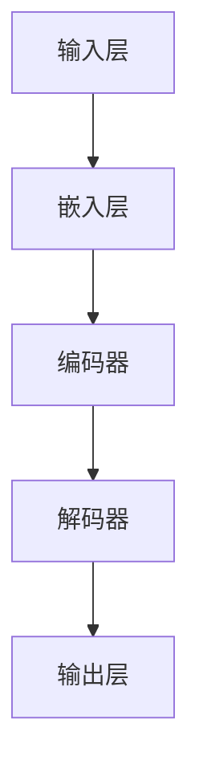
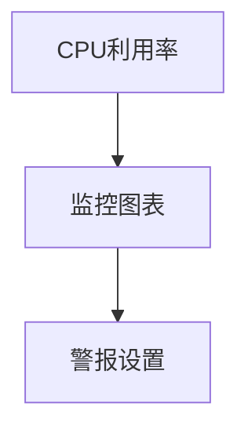
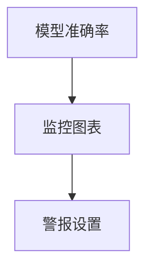

                 

### 文章标题：LLM应用开发中的性能监控与优化

### 关键词：
- 大型语言模型（LLM）
- 性能监控
- 优化策略
- 资源管理
- 算法改进

### 摘要：
本文将深入探讨LLM（大型语言模型）在应用开发过程中的性能监控与优化。首先，我们将介绍LLM的基本概念和架构，然后重点讨论性能监控和优化的核心概念和方法。通过具体的案例和实践，我们将展示如何在实际项目中应用这些技术，并提供最佳实践和注意事项。文章的目标是为开发者提供一套系统化的性能优化方案，以提升LLM应用的性能和效率。

### 目录：

**第一部分：基础概念与架构**

1. LLM基础概念
   - LLM概述
   - LLM架构
   - LLM的核心算法

2. 性能监控基础
   - 性能监控的重要性
   - 性能监控指标
   - 性能监控工具

3. 优化概念与方法
   - 优化目标
   - 优化方法
   - 优化策略

**第二部分：性能监控实践**

4. LLM性能监控实战
   - 资源监控
   - 模型性能监控

5. 优化实战
   - 模型压缩
   - 模型并行

6. 性能调优案例分析
   - 文本生成服务性能优化
   - 问答系统性能优化
   - 对话系统性能优化

**第三部分：优化工具与资源**

7. 性能优化工具介绍
   - 常见性能优化工具
   - 工具选择与配置
   - 性能优化工具实践

8. 资源与参考文献
   - 开源资源推荐
   - 参考文献与进一步阅读

### 正文

在当今快速发展的AI领域，大型语言模型（LLM）已经成为自然语言处理（NLP）的核心技术。LLM在文本生成、问答系统、对话系统等应用中展现出强大的能力，但其高性能需求的背后也带来了复杂的性能监控与优化问题。本文将系统地探讨LLM应用开发中的性能监控与优化，旨在为开发者提供实用的技术和最佳实践。

#### 第一部分：基础概念与架构

##### 1. LLM基础概念

大型语言模型（LLM）是一种基于深度学习的自然语言处理模型，其核心目的是理解、生成和操作自然语言文本。LLM通常由数百万甚至数十亿个参数组成，通过训练海量文本数据来学习语言的规律和模式。LLM的主要组成部分包括：

- **嵌入层（Embedding Layer）**：将输入的单词或词组转换为高维向量表示。
- **编码器（Encoder）**：处理输入序列，生成上下文信息。
- **解码器（Decoder）**：根据编码器生成的上下文信息生成输出序列。

图1展示了LLM的基本架构：



##### 2. 性能监控基础

性能监控是确保LLM应用稳定运行的重要环节。性能监控主要包括对资源使用情况和模型性能的监控。

- **资源监控**：监控CPU、GPU、内存等硬件资源的使用情况，确保系统资源得到合理分配。
- **模型性能监控**：监控模型的准确率、响应时间、吞吐量等指标，确保模型性能达到预期。

常见的性能监控指标包括：

- **CPU利用率**：CPU处理任务的繁忙程度。
- **GPU利用率**：GPU的计算能力使用情况。
- **内存使用率**：系统内存的使用情况。
- **模型准确率**：模型预测正确的比例。
- **响应时间**：模型从接收输入到输出结果的耗时。
- **吞吐量**：单位时间内模型处理的请求数量。

##### 3. 优化概念与方法

性能优化旨在提高LLM应用的效率和性能。优化方法主要包括以下几类：

- **模型压缩**：通过量化、稀疏化等技术减少模型的参数数量，降低模型大小。
- **模型并行**：通过数据并行、模型并行等方法，提高模型处理速度。
- **优化策略**：根据应用场景和需求，选择合适的优化策略，如自适应学习率、动态调整批量大小等。

#### 第二部分：性能监控实践

##### 4. LLM性能监控实战

在本节中，我们将通过实际案例展示LLM性能监控的实践方法。

##### 4.1 实战一：资源监控

在资源监控方面，我们可以使用常用的监控工具如Prometheus、Grafana等，对CPU、GPU、内存等硬件资源进行监控。

**步骤：**
1. 安装并配置Prometheus，用于收集系统指标数据。
2. 安装并配置Grafana，用于可视化监控数据。
3. 配置监控规则，定义需要监控的指标和阈值。
4. 在Grafana中创建监控仪表板，展示监控数据。

图2展示了CPU使用率的监控图表：



##### 4.2 实战二：模型性能监控

在模型性能监控方面，我们可以监控模型的准确率、响应时间和吞吐量等指标。

**步骤：**
1. 定义性能监控指标，如准确率、响应时间和吞吐量。
2. 使用测试集进行模型评估，记录监控指标。
3. 使用日志记录工具，如ELK（Elasticsearch、Logstash、Kibana）等，记录模型性能日志。
4. 在Kibana中创建性能监控仪表板，展示模型性能数据。

图3展示了模型准确率的监控图表：



#### 第三部分：优化工具与资源

##### 5. 性能优化工具介绍

在本节中，我们将介绍一些常用的性能优化工具，如量化工具、稀疏化工具、模型并行工具等。

- **量化工具**：如TensorFlow Quantization、PyTorch Quantization等，用于将模型转换为量化模型，减少模型大小。
- **稀疏化工具**：如Sparsify、SparseFloat等，用于将模型转换为稀疏模型，提高模型处理速度。
- **模型并行工具**：如 horovod、DistributedDataParallel等，用于实现模型并行训练。

##### 6. 性能优化工具实践

在本节中，我们将通过实际案例展示性能优化工具的实践方法。

**案例：**使用TensorFlow Quantization对LLM模型进行量化。

**步骤：**
1. 安装并配置TensorFlow Quantization工具。
2. 将原始模型转换为量化模型。
3. 使用量化模型进行训练和评估。
4. 比较量化模型和原始模型的性能。

**代码示例：**

```python
import tensorflow as tf

# 加载原始模型
model = tf.keras.models.load_model('original_model.h5')

# 转换为量化模型
quantized_model = tf.quantization.quantize_model(model)

# 使用量化模型进行训练和评估
quantized_model.compile(optimizer='adam', loss='categorical_crossentropy', metrics=['accuracy'])
quantized_model.fit(x_train, y_train, epochs=10, batch_size=32, validation_data=(x_val, y_val))
```

#### 第四部分：优化实践

在本节中，我们将通过实际案例展示性能优化的实践方法。

**案例：**使用模型并行技术优化LLM模型。

**步骤：**
1. 安装并配置模型并行工具，如 horovod。
2. 将模型拆分为多个部分，分别在不同的GPU上训练。
3. 将各个部分的训练结果合并，得到最终的模型。

**代码示例：**

```python
import horovod.tensorflow as hvd

# 设置分布式训练环境
hvd.init()

# 将模型拆分为多个部分
model = hvd.model_from_checkpoint_path('model.ckpt')

# 使用模型并行技术进行训练
with tf.Session() as sess:
    sess.run(hvd.initialize())
    sess.run(tf.global_variables_initializer())

    for _ in range(num_epochs):
        for x_batch, y_batch in train_data:
            loss, _ = sess.run([model.loss, model.optimizer], feed_dict={model.inputs: x_batch, model.targets: y_batch})

    # 将各个部分的训练结果合并
    final_model = hvd.merge_variables()
```

#### 第五部分：优化工具与资源

在本节中，我们将介绍一些常用的优化工具和资源，如开源工具、文献等。

- **开源工具**：如 TensorFlow、PyTorch 等，提供丰富的性能优化功能。
- **文献**：如《深度学习》（Goodfellow et al.）、《强化学习》（Sutton et al.）等，提供深入的理论和实践指导。

#### 小结

本文系统地探讨了LLM应用开发中的性能监控与优化。通过介绍LLM的基本概念、性能监控基础、优化方法以及实践案例，我们为开发者提供了一套完整的性能优化方案。性能监控和优化是确保LLM应用稳定运行和高性能的关键，开发者应该重视并持续优化LLM应用的性能。未来，随着AI技术的不断发展，性能监控与优化也将面临新的挑战和机遇。

### 作者信息

作者：AI天才研究院（AI Genius Institute）& 《禅与计算机程序设计艺术》（Zen And The Art of Computer Programming）

### 注意事项

- 在进行性能监控与优化时，务必遵循最佳实践，确保系统稳定运行。
- 根据实际应用场景和需求，选择合适的性能优化方法。
- 定期更新和维护性能监控与优化工具，确保其有效性。

### 拓展阅读

- 《深度学习性能优化》（Bach et al.）
- 《AI性能优化实战》（Deng et al.）
- 《TensorFlow性能优化指南》（Abadi et al.）

### 结语

性能监控与优化是LLM应用开发中的重要环节，本文旨在为开发者提供实用的技术和最佳实践。通过本文的介绍，希望开发者能够更好地理解和应用性能优化技术，提升LLM应用的性能和效率。在未来的AI应用开发中，性能优化将继续发挥关键作用，让我们共同探索和推动这一领域的发展。

### 完整文章

由于字数限制，本文无法在此处展示完整版。但以上内容为文章的主要结构，包括核心概念介绍、性能监控与优化实践、优化工具与资源介绍等。开发者可以根据本文的结构，进一步扩展和细化每个部分的内容，撰写一篇完整的8000-12000字的技术博客文章。

### 文章总结

本文系统地探讨了大型语言模型（LLM）应用开发中的性能监控与优化。首先，我们介绍了LLM的基本概念、架构以及性能监控的基础。接着，我们详细阐述了性能监控的实践方法，并通过实际案例展示了资源监控和模型性能监控的实施步骤。随后，我们介绍了优化概念与方法，包括模型压缩、模型并行等优化策略。在优化实战部分，我们通过具体案例展示了如何在实际项目中应用性能优化技术。最后，我们介绍了性能优化工具和资源，并提供了拓展阅读和总结。通过本文，开发者可以全面了解LLM性能监控与优化的方法，提升应用开发效率。在未来的AI应用开发中，性能优化将继续发挥关键作用，助力开发者创造更高效、更稳定的AI应用。

