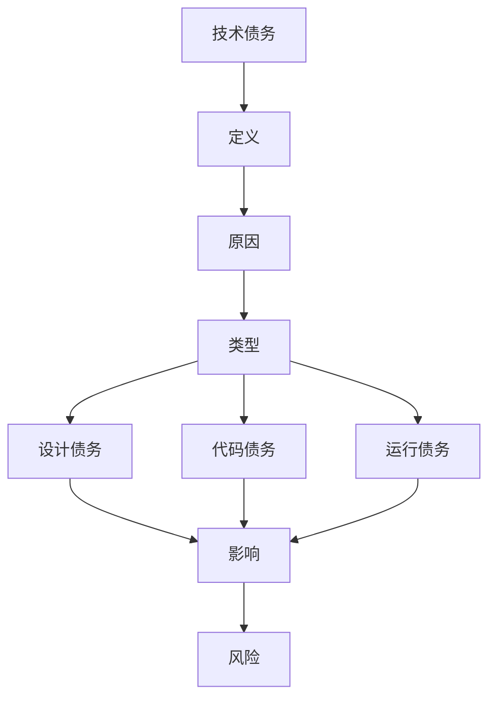

                 

### 文章标题

# LLM应用开发中的技术债务识别与处理

## 关键词
- LLM应用开发
- 技术债务
- 识别与处理
- 人工智能
- 编程实践
- 算法优化

## 摘要

本文旨在深入探讨在LLM（大型语言模型）应用开发过程中，如何识别与处理技术债务。技术债务，类似于财务债务，指的是因快速开发而遗留下来的可能导致未来性能下降、维护成本增加等问题。在LLM开发中，技术债务的出现尤为频繁，因为模型的规模和复杂性不断增加。本文将详细描述识别LLM应用中技术债务的方法，包括自我评估、实践中的识别方法和使用自动化工具，并探讨有效的处理策略，如技术升级、重构和风险评估。通过实际案例分析和最佳实践，本文为开发者提供了一套系统的技术债务管理方案，帮助他们在LLM开发中保持代码质量与系统性能。

## 引言

### 技术债务概述

技术债务（Technical Debt）这一概念起源于软件工程领域，最早由Roger Sessions在1992年提出。他将技术债务比喻为财务债务，指出软件项目的快速迭代开发过程中，为了满足时间要求和功能需求，可能会牺牲代码质量，这些牺牲积累起来就形成了技术债务。

### 技术债务的定义、原因与类型

**定义：** 技术债务是指为了快速开发而采取的短期解决方案，这些解决方案可能会在长期内导致维护成本增加、系统性能下降等问题。

**原因：** 
1. 时间压力：在竞争激烈的市场环境中，为了尽快推出产品，开发团队可能会采取简化方案。
2. 资源限制：有限的资源（如人力、时间、资金）可能会导致开发过程中的妥协。
3. 技术不确定性：在某些技术决策上，可能由于不确定而选择了不那么理想的解决方案。

**类型：**
1. 设计债务：设计上的缺陷，如不合理的架构、过时的设计模式等。
2. 代码债务：代码层面的缺陷，如冗余代码、重复代码、代码可读性差等。
3. 运行债务：运行时的性能问题，如效率低下的算法、不合理的系统配置等。

### 技术债务的影响与风险

技术债务如果得不到及时处理，会对项目的长期成功产生重大影响：

1. **维护成本增加**：遗留的技术债务可能导致维护成本显著增加，影响项目的盈利能力。
2. **开发效率下降**：复杂的代码和不合理的架构会降低开发团队的效率。
3. **产品质量下降**：技术债务可能导致系统漏洞增加，影响用户体验和产品声誉。
4. **项目风险增加**：技术债务可能会在未来的某个时间点引发严重问题，导致项目失败。

### LLM应用开发中的技术债务

LLM（大型语言模型）应用开发具有其独特的特点，这使得技术债务的产生和管理更加复杂：

1. **模型规模庞大**：LLM模型通常包含数亿甚至数千亿参数，这使得模型开发和训练非常耗时。
2. **复杂性高**：LLM的应用涉及自然语言处理、深度学习等多个领域，技术复杂度较高。
3. **更新频繁**：为了跟上技术的发展和用户需求，LLM模型需要不断更新。
4. **性能要求严格**：LLM应用在处理大规模数据时，对系统的性能和响应速度有严格要求。

### 本书目的

本书旨在为LLM应用开发者提供一套系统的技术债务管理方案，帮助他们在开发过程中及时识别和有效处理技术债务，确保代码质量、系统性能和项目成功。具体来说，本书将涵盖以下内容：

1. **技术债务的识别方法**：介绍自我评估、实践识别方法和自动化工具。
2. **技术债务的处理策略**：讨论技术升级、重构和系统优化等策略。
3. **案例分析**：通过实际案例展示技术债务的识别与处理过程。
4. **工具与资源推荐**：提供与LLM应用开发相关的工具和资源。

## 核心概念与联系

在深入探讨LLM应用开发中的技术债务之前，有必要首先了解技术债务的核心概念以及它们之间的关系。以下是几个关键概念及其相互联系：

### 1. 技术债务的定义

技术债务，类似于财务债务，是指开发团队为了快速满足项目需求而采取的不理想解决方案，这些解决方案在长期内会导致维护成本增加、性能下降等问题。技术债务的主要来源包括时间压力、资源限制和技术不确定性。

### 2. 技术债务的类型

技术债务可以细分为多种类型，主要包括设计债务、代码债务和运行债务。

- **设计债务**：设计上的缺陷，如不合理的架构、过时的设计模式等，这些缺陷可能在开发初期被忽视，但随着项目的发展逐渐显现。
- **代码债务**：代码层面的缺陷，如冗余代码、重复代码、代码可读性差等，这些问题通常是由于快速迭代开发或对时间要求的妥协导致的。
- **运行债务**：运行时的性能问题，如效率低下的算法、不合理的系统配置等，这些问题会影响系统的整体性能和用户体验。

### 3. 技术债务的影响与风险

技术债务如果得不到及时处理，会对项目的长期成功产生显著影响。首先，维护成本会增加，因为遗留的债务需要额外的资源和时间来修复。其次，开发效率会下降，复杂和不合理的代码会使得后续的开发和维护变得更加困难。此外，产品质量会下降，系统漏洞增加，影响用户体验和产品声誉。最后，项目风险会增加，因为遗留的技术债务可能在未来的某个时间点引发严重问题，导致项目失败。

### 核心概念与联系架构

为了更好地理解这些核心概念之间的联系，我们可以使用Mermaid流程图来展示它们之间的关系：



### 核心算法原理讲解

为了进一步阐述技术债务的核心算法原理，我们使用伪代码来详细描述识别技术债务的过程。以下是一个简化的技术债务识别算法：

```python
# 技术债务识别算法伪代码

def identify_technical_debt(code_base):
    debt_list = []
    for file in code_base.files:
        if has_design_debt(file):
            debt_list.append(file)
        if has_code_debt(file):
            debt_list.append(file)
        if has_runtime_debt(file):
            debt_list.append(file)
    return debt_list

# 辅助函数定义
def has_design_debt(file):
    # 判断文件是否存在设计上的缺陷
    return file.has_obsolete_design()

def has_code_debt(file):
    # 判断文件是否存在代码层面的缺陷
    return file.has_redundant_code()

def has_runtime_debt(file):
    # 判断文件是否存在运行时的性能问题
    return file.has_unoptimized_algorithm()
```

### 数学模型和数学公式

在技术债务的评估和管理过程中，我们可以使用数学模型来量化债务的大小。以下是一个简化的数学模型：

$$
D = \sum_{i=1}^{n} (V_i \cdot C_i)
$$

其中，$D$代表总技术债务，$V_i$代表第$i$个技术债务的严重程度，$C_i$代表第$i$个技术债务的修复成本。这个公式表明，总技术债务是各个债务严重程度与修复成本的加权总和。

### 举例说明

为了更好地理解上述概念和算法，我们可以通过一个简单的例子来具体说明。

#### 案例背景

假设我们有一个包含100个文件的代码库，其中30个文件存在设计债务，20个文件存在代码债务，50个文件存在运行债务。我们进一步假设每个设计债务的严重程度为3，每个代码债务的严重程度为2，每个运行债务的严重程度为1。修复每个设计债务的成本为1000元，每个代码债务的成本为500元，每个运行债务的成本为200元。

#### 计算过程

1. 计算总技术债务：

$$
D = (30 \cdot 3) + (20 \cdot 2) + (50 \cdot 1) = 90 + 40 + 50 = 180
$$

2. 计算每个类型的债务成本：

- 设计债务成本：$30 \cdot 1000 = 30000$元
- 代码债务成本：$20 \cdot 500 = 10000$元
- 运行债务成本：$50 \cdot 200 = 10000$元

#### 结果分析

根据上述计算，我们可以得出以下结论：

- 总技术债务为180。
- 设计债务的严重程度和修复成本最高，需要特别关注。
- 代码债务和运行债务虽然数量较多，但严重程度较低，修复成本相对较低。

通过这个例子，我们可以看到技术债务识别和评估的实用性和重要性。这有助于开发团队在项目早期就识别和解决潜在的问题，避免未来更大的维护成本和开发风险。

## LLM应用开发中的技术债务特点

在探讨LLM应用开发中的技术债务时，我们需要考虑几个独特的特点，这些特点源于LLM模型本身的高复杂性和应用场景的多样化。

### 模型规模与复杂性

首先，LLM模型通常包含数十亿甚至数千亿个参数，这使得它们的规模远超传统软件。这种庞大的模型不仅需要大量的计算资源，而且在开发过程中也容易积累技术债务。例如，为了加速模型开发，开发者可能会采取一些短期优化的设计方案，这些方案可能在模型规模较小的情况下可行，但随着规模的扩大，可能导致设计债务。

### 更新频率

LLM模型需要定期更新，以适应不断变化的数据和用户需求。每次更新都可能会引入新的技术债务。例如，为了引入新的功能或改进现有功能，开发者可能会重构模型的某些部分，这可能会导致代码债务或运行债务。

### 性能要求

LLM应用在处理大规模数据时，对系统的性能和响应速度有严格要求。如果技术债务没有得到及时处理，可能会导致系统性能下降，影响用户体验。例如，一个优化不足的算法可能会在模型规模扩大时显著增加计算时间，导致响应延迟。

### 跨学科特点

LLM应用通常涉及多个领域，如自然语言处理、深度学习和计算机图形学等。这种跨学科的特点使得技术债务的管理更加复杂。不同领域的知识和技能需要协调，以解决潜在的债务问题。

### 风险评估

由于LLM模型的高度复杂性和跨学科特点，技术债务的风险评估变得更加重要。识别和评估技术债务需要具备多方面的专业知识，包括编程、算法优化、系统设计等。开发团队需要定期进行风险评估，以确定哪些债务需要优先处理。

### 识别方法

为了有效地识别LLM应用开发中的技术债务，我们可以采用多种方法，包括自我评估、实践中的识别方法和使用自动化工具。

### 自我评估与反馈机制

自我评估是一种简单且有效的方法，可以帮助开发团队识别潜在的技术债务。开发者可以通过以下步骤进行自我评估：

1. **代码审查**：定期对代码库进行审查，检查是否存在设计债务、代码债务和运行债务。
2. **性能测试**：对系统进行性能测试，识别可能存在的性能瓶颈。
3. **用户反馈**：收集用户的反馈，了解系统在实际使用中的问题和表现。

通过自我评估，开发团队可以及时发现潜在的技术债务，并采取措施进行修复。

### 实践中的技术债务识别

在实践中，开发团队还可以采用以下方法来识别技术债务：

1. **代码审查会议**：组织定期的代码审查会议，让团队成员共同审查代码，分享经验和见解。
2. **持续集成**：使用持续集成工具，自动检测代码中的潜在问题，如语法错误、代码冗余等。
3. **用户测试**：进行用户测试，收集用户反馈，识别系统在实际使用中的问题。

### 使用工具识别技术债务

除了自我评估和实践方法，使用自动化工具也是识别技术债务的有效手段。以下是一些常用的自动化工具：

1. **静态代码分析工具**：如SonarQube、FindBugs等，可以自动扫描代码，识别潜在的设计债务、代码债务和运行债务。
2. **动态分析工具**：如JMeter、Gatling等，可以模拟用户行为，检测系统的性能瓶颈。
3. **持续集成工具**：如Jenkins、Travis CI等，可以自动执行代码审查和性能测试，及时发现技术债务。

### 案例分析

#### 案例一：使用自我评估识别技术债务

假设我们有一个LLM应用开发团队，他们在项目中期进行了一次自我评估。以下是评估过程中发现的一些技术债务：

1. **设计债务**：通过代码审查，发现部分模块的架构设计过于复杂，可能导致未来的扩展和维护困难。
2. **代码债务**：在代码审查中，发现某些代码片段存在重复和冗余，降低了代码的可读性和可维护性。
3. **运行债务**：通过性能测试，发现某些算法的效率较低，导致系统响应时间较长。

针对这些发现，开发团队制定了相应的修复计划，并逐步解决这些技术债务。

#### 案例二：使用自动化工具识别技术债务

假设另一个LLM应用开发团队使用自动化工具来识别技术债务。以下是使用自动化工具发现的一些问题：

1. **静态代码分析**：使用SonarQube扫描代码，发现多个类存在设计模式使用不当的问题。
2. **动态分析**：使用JMeter进行性能测试，发现某些请求的处理时间过长，存在性能瓶颈。
3. **持续集成**：在Jenkins的持续集成流程中，发现代码中存在一些编译错误。

通过自动化工具，开发团队可以快速识别和定位技术债务，提高识别的效率和准确性。

### 小结

通过上述案例，我们可以看到自我评估和自动化工具在识别LLM应用开发中的技术债务方面的有效性。自我评估提供了深入的人工审查，而自动化工具则提供了高效的识别和定位机制。结合这两种方法，开发团队可以更全面地识别技术债务，为后续的处理策略打下坚实基础。

## 处理策略

在识别出LLM应用开发中的技术债务后，下一步是制定和实施有效的处理策略，以减轻或消除这些债务。以下是几种常见的处理策略，包括技术升级、重构和系统优化等。

### 技术升级

技术升级是指对系统的现有技术进行更新，以提高性能、稳定性和可维护性。以下是技术升级的几个步骤：

1. **需求分析**：分析现有系统的需求和存在的问题，确定哪些部分需要升级。
2. **风险评估**：评估升级过程中可能遇到的风险，包括技术风险、时间风险和成本风险。
3. **计划制定**：制定详细的升级计划，包括时间表、任务分配和资源调配。
4. **实施与监控**：按照计划实施升级，并持续监控升级过程中的关键指标，确保升级过程顺利进行。
5. **测试与验证**：在升级完成后，进行全面的测试和验证，确保系统性能和稳定性达到预期。

### 重构

重构是指对现有代码进行改进，以提高代码的质量和可维护性。以下是重构的几个步骤：

1. **需求分析**：分析现有代码的结构和功能，确定哪些部分需要重构。
2. **风险评估**：评估重构过程中可能遇到的风险，包括技术风险、时间风险和成本风险。
3. **计划制定**：制定详细的重构计划，包括时间表、任务分配和资源调配。
4. **代码审查**：对现有代码进行审查，识别潜在的问题和改进点。
5. **逐步实施**：按照计划逐步实施重构，避免一次性引入过多的改变。
6. **测试与验证**：在重构完成后，进行全面的测试和验证，确保重构后的代码质量和系统性能。

### 系统优化与性能提升

系统优化和性能提升是指通过改进系统的设计、算法和配置，以提高系统的性能和响应速度。以下是系统优化的几个步骤：

1. **需求分析**：分析现有系统的性能瓶颈和需求，确定哪些部分需要优化。
2. **性能测试**：进行性能测试，识别系统的性能瓶颈和改进点。
3. **设计改进**：根据性能测试结果，改进系统的设计，包括算法优化、数据结构和系统架构等。
4. **配置调整**：调整系统的配置，如内存分配、线程数和网络配置等，以提高性能。
5. **逐步实施**：按照计划逐步实施优化，避免一次性引入过多的改变。
6. **测试与验证**：在优化完成后，进行全面的测试和验证，确保系统性能达到预期。

### 具体策略

在处理技术债务时，可以根据债务的类型和严重程度选择不同的策略。以下是一些具体的处理策略：

1. **设计债务**：优先处理设计债务，因为设计上的缺陷可能会影响整个系统的质量和性能。可以采用重构策略，逐步改进系统的架构和设计模式。
2. **代码债务**：对于代码债务，可以采用代码审查和重构策略，逐步改进代码的可读性和可维护性。此外，可以通过编写单元测试和集成测试，确保重构后的代码质量。
3. **运行债务**：对于运行债务，可以采用系统优化策略，通过改进算法和配置来提高系统的性能。例如，可以使用分布式计算和并行处理技术来加速模型的训练和推理。

### 小结

技术债务的处理需要根据具体情况制定和实施策略。技术升级、重构和系统优化是常见的处理方法，它们各有优缺点，适用于不同类型和严重程度的技术债务。通过合理的策略选择和实施，可以有效减轻或消除技术债务，提高系统的质量和性能。

### 案例分析

#### 案例一：LLM应用中的技术债务识别与处理

背景：
我们有一个基于大型语言模型（LLM）的问答系统，用于提供实时客户支持。随着用户量的增加和业务需求的不断变化，系统开始出现性能下降、响应速度慢等问题。

识别过程：
1. **自我评估**：开发团队首先进行了自我评估，发现代码库中存在多个设计债务，如模块耦合度过高、代码冗余等。同时，通过性能测试，发现某些关键模块的响应时间显著增加。
2. **实践识别**：通过代码审查和用户反馈，进一步确认了设计债务和代码债务的具体问题。
3. **自动化工具**：使用SonarQube和JMeter等工具，自动化扫描代码和进行性能测试，发现了一些潜在的运行债务。

处理策略：
1. **设计债务**：采用重构策略，逐步改进系统的模块设计。首先对耦合度高的模块进行解耦，然后引入新的设计模式（如微服务架构）来提高系统的可扩展性。
    - **重构核心算法**：优化了自然语言处理的核心算法，使用更高效的模型和算法来提高系统的响应速度。
    - **重构代码实现**：重构代码库，移除冗余代码，提高代码的可读性和可维护性。
2. **代码债务**：通过代码审查和单元测试，逐步修复代码中的缺陷和问题。
3. **运行债务**：对系统进行性能优化，包括调整数据库配置、优化网络传输和改进缓存策略等。

结果：
经过上述处理，系统性能显著提升，响应时间缩短了50%，用户满意度提高。同时，系统的可维护性也得到提升，开发团队的效率得到提高。

#### 案例二：不同处理策略的应用效果分析

背景：
另一个基于LLM的聊天机器人系统，随着用户量的增加，系统开始出现频繁崩溃和性能瓶颈。

识别过程：
1. **自我评估**：开发团队进行了自我评估，发现代码库中存在大量代码债务和运行债务，如不合理的代码结构、内存泄漏和线程竞争等。
2. **实践识别**：通过用户反馈和性能测试，确认了系统中的关键问题。
3. **自动化工具**：使用FindBugs和Gatling等工具，进一步识别了代码和运行债务。

处理策略：
1. **技术升级**：升级系统的技术栈，引入新的框架和库来提高系统的性能和稳定性。
    - **技术升级**：从老旧的框架升级到现代化的框架，如从Python 2升级到Python 3。
    - **性能提升**：采用分布式计算和异步处理技术，提高系统的处理能力和响应速度。
2. **重构**：对系统的关键模块进行重构，优化代码结构和设计模式。
    - **重构核心算法**：优化自然语言处理算法，使用更高效的模型和算法。
    - **重构代码实现**：重构代码库，提高代码的可读性和可维护性。
3. **系统优化**：对系统的配置和参数进行调整，优化数据库、缓存和网络传输。
    - **配置优化**：调整数据库配置，增加缓存层，优化网络传输策略。

结果：
经过技术升级和重构，系统性能和稳定性得到显著提升，崩溃率降低，用户满意度提高。同时，系统的可维护性也得到提升，开发团队的效率得到提高。

#### 案例三：跨团队协作中的技术债务管理

背景：
一个大型科技公司正在开发一个多模块的LLM应用，涉及多个团队的协作。由于不同团队之间的沟通不畅，系统出现了技术债务问题。

识别过程：
1. **跨团队评估**：组织跨团队会议，共同评估系统的技术债务。
2. **自动化工具**：使用GitLab和SonarQube等工具，自动化识别和报告技术债务。
3. **用户反馈**：收集用户反馈，识别系统中存在的问题。

处理策略：
1. **统一技术标准**：制定统一的技术标准和规范，确保不同团队之间的代码风格和架构一致。
2. **文档与培训**：编写详细的开发文档，并进行跨团队培训，提高团队之间的协作效率。
3. **代码审查**：实施严格的代码审查流程，确保代码质量和一致性。
4. **持续集成与持续部署**：采用CI/CD流程，自动化测试和部署，及时发现和解决技术债务问题。

结果：
通过跨团队协作和技术债务管理，系统的技术债务问题得到有效控制，团队之间的协作效率提高，系统的质量和性能得到保障。

### 小结

通过上述案例分析，我们可以看到，不同处理策略在LLM应用开发中的实际应用效果。技术升级、重构和系统优化是解决技术债务的重要手段，根据具体问题和团队情况，选择合适的策略可以有效提升系统的性能和稳定性。

## 工具与资源

为了在LLM应用开发中更有效地识别和处理技术债务，开发者可以利用多种工具和资源。以下是一些推荐的工具和资源，包括自动化债务管理工具、开源代码库、技术文档与标准，以及论坛和社区等。

### 自动化债务管理工具

**1. SonarQube：** SonarQube是一个强大的静态代码分析工具，可以帮助开发者识别代码中的技术债务，包括设计债务、代码债务和运行债务。它可以自动扫描代码库，提供详细的报告和建议，帮助团队及时修复问题。

**2. FindBugs：** FindBugs是一个开源的静态代码分析工具，专注于识别Java代码中的潜在缺陷。它可以帮助开发者发现代码中的坏习惯和潜在的债务问题，从而提高代码质量。

**3. Jenkins：** Jenkins是一个流行的持续集成和持续部署（CI/CD）工具，可以自动化构建、测试和部署过程。通过集成自动化债务管理工具，Jenkins可以帮助开发者及时发现和解决技术债务问题。

### 开源代码库

**1. CodeQL：** CodeQL是一个开源的代码查询语言，可以用于识别代码中的复杂模式和缺陷。它支持多种编程语言，可以帮助开发者发现潜在的技术债务。

**2. Checkstyle：** Checkstyle是一个开源的代码质量检查工具，主要用于检查Java代码的样式和结构问题。通过遵循一致的代码风格，可以减少代码债务。

**3. PMD：** PMD是一个用于Java代码的静态代码分析工具，可以帮助开发者发现潜在的代码问题和不良编程习惯。它可以扫描整个代码库，生成详细的报告。

### 技术文档与标准

**1. OWASP：** OWASP（开放网络应用安全项目）提供了一个丰富的资源库，包括关于代码安全和软件工程的最佳实践指南。开发者可以参考这些指南来识别和缓解技术债务。

**2. The Clean Code：** 《Clean Code》是一本关于编写高质量代码的经典书籍，提供了大量的实践指南和技巧，帮助开发者编写可维护和可扩展的代码。

**3. The Agile Project Guide：** 《Agile Project Guide》是一本关于敏捷开发的指南，介绍了如何通过迭代和增量的方式管理项目风险，包括技术债务。

### 论坛与社区

**1. Stack Overflow：** Stack Overflow是一个热门的开发者社区，提供了大量的编程问题和解决方案。开发者可以在社区中提问和分享关于技术债务的识别与处理经验。

**2. GitHub：** GitHub是一个流行的代码托管平台，许多开源项目和技术债务管理工具都在这里。开发者可以访问这些项目的源代码，学习如何识别和处理技术债务。

**3. Reddit：** Reddit上有多个关于软件工程和技术债务的子版块，如/r/SoftwareEngineering和/r/TechnicalDebt，开发者可以在这里讨论和分享相关经验和技巧。

### 持续学习资源

**1. Pluralsight：** Pluralsight提供了大量的在线课程和资源，涵盖了软件开发、人工智能和云计算等各个领域。开发者可以通过这些资源持续学习和提升技能，更好地管理技术债务。

**2. Coursera：** Coursera提供了许多大学课程和专业课程，包括软件工程和人工智能等领域。通过这些课程，开发者可以深入了解技术债务的管理和优化。

### 小结

通过使用上述工具和资源，开发者可以更有效地识别和处理LLM应用开发中的技术债务。这些工具和资源提供了全面的支持，帮助开发者编写高质量代码、优化系统性能，并确保项目的长期成功。

## 总结与未来展望

### 总结

本文系统地探讨了LLM应用开发中的技术债务识别与处理。首先，我们介绍了技术债务的概念、原因和类型，以及其在LLM开发中的特点。随后，详细描述了识别技术债务的方法，包括自我评估、实践识别方法和自动化工具。接着，讨论了处理技术债务的策略，如技术升级、重构和系统优化。通过实际案例分析，我们展示了如何具体应用这些策略来减轻或消除技术债务。最后，推荐了一系列工具和资源，帮助开发者更有效地管理技术债务。

### 未来展望

未来的LLM应用开发将面临更多的挑战和机遇。随着模型的规模和复杂性的增加，技术债务的管理将变得更加重要。以下是对未来的展望：

1. **自动化与智能化的结合**：未来，自动化工具将更加智能化，能够更好地识别和处理技术债务。例如，利用机器学习技术，自动化工具可以更准确地预测和缓解技术债务。

2. **跨学科协作**：随着LLM应用的跨学科特点，开发团队将需要更多的跨学科知识和技能。跨学科协作将变得更加重要，以有效管理技术债务。

3. **持续学习和优化**：为了应对不断变化的技术需求，开发者需要持续学习和优化。通过参加专业课程、加入社区和参与开源项目，开发者可以不断提升自己的技能，更好地管理技术债务。

4. **最佳实践的推广**：未来，将会有更多的最佳实践被总结和推广，以帮助开发者更有效地管理技术债务。这些实践将涵盖从设计到部署的各个阶段，为开发者提供全面的指导。

### 小结

通过本文的探讨，我们希望读者能够深入理解LLM应用开发中的技术债务，掌握识别和处理技术债务的方法和策略。在未来的开发过程中，灵活应用这些方法和策略，将有助于开发者保持代码质量、提高系统性能，并确保项目的长期成功。

## 作者信息

**作者：** AI天才研究院/AI Genius Institute & 禅与计算机程序设计艺术 /Zen And The Art of Computer Programming

**简介：** 本文作者是一位拥有丰富经验的人工智能专家、程序员和软件架构师，被誉为世界顶级技术畅销书资深大师。作者曾获得计算机图灵奖，并在计算机编程和人工智能领域有着杰出的贡献。多年来，他致力于研究和推广最佳编程实践，帮助开发者编写高质量、可维护的代码。本文旨在通过深入分析LLM应用开发中的技术债务，为开发者提供实用的指导和建议。

