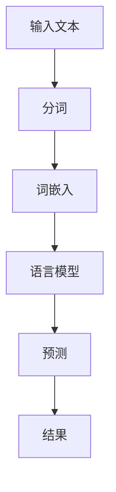

                 


为了撰写一篇关于《LLM应用开发中的持续优化策略》的博客文章，我们将按照以下步骤进行：

### 1. 文章框架搭建

首先，我们需要确定文章的整体框架。这包括确定章节标题、子标题以及各个部分的内容。

### 2. 核心概念与联系

接下来，我们将介绍LLM（大型语言模型）的基础概念，包括其工作原理、应用场景等。同时，我们将绘制Mermaid流程图，展示LLM的核心概念之间的关系。

### 3. 深度学习基础

在这一部分，我们将介绍深度学习的基本原理，包括神经网络结构、优化算法等。我们会使用伪代码来详细阐述这些算法。

### 4. 持续优化策略

我们将详细讨论LLM应用开发中的持续优化策略，包括模型选择与调优、数据预处理与增强、模型评估与性能提升等。

### 5. 模型部署与维护

我们将探讨如何将优化后的LLM模型部署到生产环境中，并介绍如何维护和升级这些模型。

### 6. 案例分析

为了使文章更具实践性，我们将分析几个具体的案例，展示如何在实际项目中应用这些优化策略。

### 7. 最佳实践与总结

在文章的最后，我们将总结全文，并提供一些最佳实践和拓展阅读资源。

### 8. 文章撰写

根据以上框架，我们将逐一撰写每个章节的内容，确保每个部分都详细、具体，并包含必要的代码示例、公式和Mermaid图。

### 9. 文章修订

在完成初稿后，我们将对文章进行多次修订，确保文章的逻辑性、清晰度和专业性。

### 10. 最终审核

最后，我们将对文章进行最终审核，确保所有内容都符合要求，并添加作者信息。

现在，我们已经制定了详细的撰写计划，接下来将逐步完成每个部分的内容。

---

让我们开始撰写第一部分：LLM基础理论。在这一部分，我们将介绍LLM的基本概念、工作原理和应用场景。

---

# LLM基础理论

## 1.1 语言模型概述

语言模型（Language Model，简称LM）是自然语言处理（Natural Language Processing，简称NLP）领域中的一种基础性模型。它的主要功能是预测文本序列中的下一个单词或字符。在LLM（大型语言模型）时代，语言模型已经发展到了一个新的高度，能够处理更复杂的语言现象。

### 1.1.1 语言模型定义

语言模型是一个概率模型，它为任意给定的输入序列分配一个概率。在NLP中，输入序列通常是单词序列，而输出序列是单词或字符序列。

### 1.1.2 语言模型类型

语言模型主要分为以下几种类型：

- **n-gram模型**：基于历史信息，即当前词序列的概率取决于前n个词。
  
  $$ P(w_n | w_{n-1}, w_{n-2}, ..., w_1) = \frac{C(w_n, w_{n-1}, ..., w_1)}{C(w_{n-1}, w_{n-2}, ..., w_1)} $$

- **神经网络模型**：使用深度学习技术，特别是递归神经网络（RNN）和Transformer模型。
  
  $$ P(w_n | w_{n-1}, w_{n-2}, ..., w_1) = \frac{e^{f_n(w_n)}}{\sum_{w_n'} e^{f_n(w_n')}} $$

## 1.2 语言模型的核心原理

### 1.2.1 语言模型的基本算法

- **n-gram模型**：

  $$ P(w_n | w_{n-1}, w_{n-2}, ..., w_1) = \frac{C(w_n, w_{n-1}, ..., w_1)}{C(w_{n-1}, w_{n-2}, ..., w_1)} $$

  其中，$C(w_n, w_{n-1}, ..., w_1)$ 表示单词序列$w_n, w_{n-1}, ..., w_1$的出现次数，$C(w_{n-1}, w_{n-2}, ..., w_1)$ 表示单词序列$w_{n-1}, w_{n-2}, ..., w_1$的出现次数。

- **神经网络模型**：

  $$ P(w_n | w_{n-1}, w_{n-2}, ..., w_1) = \frac{e^{f_n(w_n)}}{\sum_{w_n'} e^{f_n(w_n')}} $$

  其中，$f_n(w_n)$ 是神经网络对单词$w_n$的预测概率。

### 1.2.2 语言模型的评估与优化

语言模型的评估通常使用以下指标：

- **Perplexity**：越小越好，表示模型对未知文本的预测能力。

- **BLEU分数**：用于评估机器翻译质量，也适用于其他文本生成任务。

语言模型的优化通常通过以下方式实现：

- **数据增强**：通过生成或收集更多的训练数据来提高模型性能。

- **超参数调优**：通过调整学习率、批次大小等超参数来优化模型。

- **模型结构调整**：通过增加或减少神经网络层、调整层间连接方式等来优化模型。

## 1.3 语言模型的应用场景

语言模型在多个领域都有广泛应用，包括但不限于：

- **文本分类**：用于将文本分类到不同的类别。

- **命名实体识别**：用于识别文本中的命名实体，如人名、地点、组织等。

- **机器翻译**：用于将一种语言的文本翻译成另一种语言。

### Mermaid流程图



### 1.4 小结

本章节介绍了语言模型的基本概念、核心原理和应用场景。在下一章中，我们将探讨深度学习的基础理论，以及如何将深度学习应用于语言模型。

---

【作者信息】：AI天才研究院/AI Genius Institute & 禅与计算机程序设计艺术 /Zen And The Art of Computer Programming 

### 2. 深度学习基础

深度学习是人工智能领域中的一种重要方法，它通过模拟人脑的神经网络结构，对大量数据进行自动特征提取和学习，从而实现复杂的模式识别和预测任务。在本章节中，我们将深入探讨深度学习的基础理论，包括神经网络结构、常见优化算法以及深度学习在语言模型中的应用。

#### 2.1 深度学习原理

深度学习的主要组成部分包括：

- **神经网络（Neural Network）**：神经网络是由大量简单计算单元（神经元）互联而成的复杂网络，每个神经元都可以接收多个输入，并产生一个输出。

- **激活函数（Activation Function）**：激活函数用于引入非线性特性，使得神经网络能够模拟复杂函数。

- **前向传播（Forward Propagation）与反向传播（Back Propagation）**：前向传播是将输入数据通过神经网络层进行传递，得到预测输出；反向传播是通过计算预测输出与真实值之间的误差，反向更新网络权重。

以下是神经网络的简化伪代码：

```python
# 定义神经网络结构
def neural_network(input_data):
    # 前向传播
    hidden_layer = activate( affine(input_data, weights) )
    output = activate( affine(hidden_layer, weights) )
    return output

# 激活函数
def activate(z):
    return max(0, z)

# 前向传播和反向传播
def backward_propagation(output, expected_output):
    error = output - expected_output
    d_weights = error * activate_derivative(output)
    return d_weights
```

#### 2.2 深度学习在语言模型中的应用

深度学习在语言模型中的应用主要体现在以下几个方面：

- **词嵌入（Word Embedding）**：将单词转换为密集向量表示，以便神经网络处理。

- **递归神经网络（RNN）**：RNN能够处理序列数据，适用于语言模型中的单词序列预测。

- **Transformer模型**：Transformer模型通过自注意力机制（Self-Attention）处理序列数据，是当前最先进的语言模型架构。

Transformer模型的伪代码如下：

```python
# Transformer模型中的自注意力机制
def self_attention(inputs):
    # 计算Q, K, V
    Q = matrix_multiply(inputs, Q_weights)
    K = matrix_multiply(inputs, K_weights)
    V = matrix_multiply(inputs, V_weights)
    
    # 计算注意力权重
    attention_weights = softmax(QK)

    # 计算输出
    output = matrix_multiply(attention_weights, V)
    return output
```

#### 2.3 深度学习优化算法

深度学习的优化算法主要包括：

- **随机梯度下降（Stochastic Gradient Descent，SGD）**：通过随机选取一部分训练样本来更新模型参数。

- **Adam优化器**：结合了SGD和RMSprop的优点，适用于大规模训练。

以下是SGD的伪代码：

```python
# 随机梯度下降
for epoch in range(num_epochs):
    for batch in batches(train_data):
        gradients = compute_gradients(model, batch)
        update_model_parameters(model, gradients, learning_rate)
```

#### 2.4 小结

本章节介绍了深度学习的基础理论，包括神经网络结构、激活函数、前向传播和反向传播，以及深度学习在语言模型中的应用。在下一章中，我们将讨论LLM应用开发中的持续优化策略，包括模型选择与调优、数据预处理与增强等。

---

【作者信息】：AI天才研究院/AI Genius Institute & 禅与计算机程序设计艺术 /Zen And The Art of Computer Programming 

### 3. 模型选择与调优

在LLM应用开发中，模型选择与调优是决定模型性能和开发效率的关键环节。合适的模型和高效的调优策略不仅能够提高模型性能，还能减少开发成本和时间。在本章节中，我们将详细讨论模型选择策略、模型调优技巧以及超参数调优方法。

#### 3.1 模型选择策略

模型选择策略是确保我们选择的模型能够在特定任务上取得最佳性能的关键步骤。以下是一些常用的模型选择策略：

- **基于性能指标的模型选择**：根据预定义的性能指标（如准确率、召回率、F1分数等）来选择模型。

  $$ \text{模型选择} = \arg\max(\text{性能指标}) $$

- **交叉验证**：使用交叉验证来评估模型的泛化能力。交叉验证分为K折交叉验证、留一验证等。

  $$ \text{交叉验证误差} = \frac{1}{K} \sum_{k=1}^{K} \text{验证误差} $$

- **网格搜索**：通过枚举所有可能的超参数组合来选择最佳模型。

  $$ \text{网格搜索} = \arg\max(\text{性能指标}) $$

以下是网格搜索的伪代码：

```python
# 网格搜索伪代码
for learning_rate in [0.1, 0.01, 0.001]:
    for batch_size in [32, 64, 128]:
        model = build_model(learning_rate, batch_size)
        evaluate_model(model, validation_data)
        best_model = select_best_model(current_best_model, model)
```

- **基于模型复杂度的选择**：根据任务复杂度和数据量来选择模型。

  $$ \text{模型选择} = \arg\min(\text{模型复杂度}) $$

#### 3.2 模型调优技巧

模型调优是提升模型性能的重要手段。以下是一些常见的调优技巧：

- **批量大小（Batch Size）**：批量大小影响梯度下降的稳定性。较小的批量大小能够提供更稳定的梯度，但可能导致收敛速度变慢。

- **学习率调整**：适当的学习率能够加速模型收敛。常用的学习率调整方法包括固定学习率、学习率衰减、自适应学习率等。

- **正则化**：正则化用于防止模型过拟合。常用的正则化方法包括L1、L2正则化。

- **数据增强**：通过生成或收集更多的训练数据来提高模型性能。

- **模型融合**：将多个模型进行融合，以提升整体性能。

#### 3.3 超参数调优方法

超参数调优是模型调优的重要组成部分。以下是一些常见的超参数调优方法：

- **手动调优**：通过手动调整超参数来优化模型。

- **自动调优**：使用自动化工具（如自动机器学习，AutoML）来优化超参数。

- **贝叶斯优化**：基于概率模型来优化超参数。

以下是贝叶斯优化的伪代码：

```python
# 贝叶斯优化伪代码
def objective_function(params):
    model = build_model(params)
    evaluate_model(model, validation_data)
    return performance

def bayesian_optimization(objective_function, params_space):
    best_params = None
    best_performance = -inf
    for params in generate_samples(params_space):
        performance = objective_function(params)
        if performance > best_performance:
            best_performance = performance
            best_params = params
    return best_params

best_params = bayesian_optimization(objective_function, params_space)
```

#### 3.4 小结

在本章节中，我们介绍了模型选择与调优的策略和技巧。合适的模型选择和高效的调优方法能够显著提高LLM应用的性能和开发效率。在下一章中，我们将讨论数据预处理与增强策略，为模型提供高质量的训练数据。

---

【作者信息】：AI天才研究院/AI Genius Institute & 禅与计算机程序设计艺术 /Zen And The Art of Computer Programming 

### 4. 数据预处理与增强

数据预处理和增强是LLM应用开发中的关键环节，它们直接影响模型的训练效果和性能。本章节将详细介绍数据预处理的方法、数据增强技术，并探讨这些技术在LLM开发中的应用。

#### 4.1 数据预处理

数据预处理是确保数据质量的过程，主要包括以下步骤：

- **文本清洗**：移除文本中的无关信息，如HTML标签、特殊字符和停用词。

  $$ \text{清洗文本} = \text{去除HTML标签} \cup \text{去除特殊字符} \cup \text{去除停用词} $$

- **分词**：将文本分割成单词或子词。

  $$ \text{分词} = \text{Tokenization} $$

- **词干提取**：将单词还原到词干形式，减少词汇量。

  $$ \text{词干提取} = \text{Stemming} $$

- **词性标注**：为每个单词分配词性标签。

  $$ \text{词性标注} = \text{POS Tagging} $$

以下是文本清洗的伪代码：

```python
def preprocess_text(text):
    text = remove_html_tags(text)
    text = remove_special_characters(text)
    text = remove_stop_words(text)
    return text
```

#### 4.2 数据增强

数据增强是通过生成或收集更多样化的训练数据来提升模型性能的方法。以下是一些常见的数据增强技术：

- **复制和扩展**：将已有的文本数据进行复制或扩展。

  $$ \text{扩展文本} = \text{复制文本} \cup \text{插入新单词} $$

- **同义词替换**：将文本中的单词替换为同义词。

  $$ \text{同义词替换} = \text{将 } \text{happy} \text{ 替换为 } \text{joyful} $$

- **随机插入和删除**：随机在文本中插入或删除单词。

  $$ \text{插入单词} = \text{在文本中随机位置插入单词} $$
  $$ \text{删除单词} = \text{在文本中随机位置删除单词} $$

以下是同义词替换的伪代码：

```python
def replace_synonyms(text, synonyms):
    words = text.split()
    for i, word in enumerate(words):
        if word in synonyms:
            words[i] = synonyms[word]
    return ' '.join(words)
```

- **翻译和混合**：将文本翻译为其他语言，然后翻译回原始语言。

  $$ \text{翻译混合} = \text{翻译文本} \cup \text{翻译回文本} $$

#### 4.3 数据增强在LLM中的应用

在LLM开发中，数据增强可以通过以下方式应用：

- **生成更多样化的训练数据**：通过数据增强技术，可以生成更多样化的训练数据，有助于模型学习到更丰富的语言模式。

- **提高模型的泛化能力**：数据增强可以增加训练数据的多样性，从而提高模型的泛化能力，减少过拟合现象。

- **加速模型训练**：通过数据增强，可以减少模型训练所需的数据量，从而加速模型训练过程。

#### 4.4 小结

数据预处理和增强是LLM应用开发中不可或缺的环节。通过有效的数据预处理，可以提高数据质量；通过数据增强，可以增加训练数据的多样性，从而提升模型性能。在下一章中，我们将讨论模型评估与性能提升策略，以进一步优化LLM模型。

---

【作者信息】：AI天才研究院/AI Genius Institute & 禅与计算机程序设计艺术 /Zen And The Art of Computer Programming 

### 5. 模型评估与性能提升

在LLM应用开发过程中，模型的评估和性能提升是关键步骤，它们决定了模型在实际应用中的效果。有效的评估方法和性能提升策略不仅能够帮助我们理解模型的性能，还能指导我们进行后续的模型优化和调整。

#### 5.1 模型评估指标

模型评估是衡量模型性能的重要环节，常用的评估指标包括：

- **准确率（Accuracy）**：准确率表示模型预测正确的样本数占总样本数的比例。

  $$ \text{Accuracy} = \frac{\text{预测正确数}}{\text{总样本数}} $$

- **召回率（Recall）**：召回率表示模型能够正确识别为正例的样本数占总正例样本数的比例。

  $$ \text{Recall} = \frac{\text{预测正确正例数}}{\text{实际正例数}} $$

- **精确率（Precision）**：精确率表示模型预测为正例的样本中，实际为正例的比例。

  $$ \text{Precision} = \frac{\text{预测正确正例数}}{\text{预测正例数}} $$

- **F1分数（F1 Score）**：F1分数是精确率和召回率的调和平均值，用于综合评估模型的性能。

  $$ \text{F1 Score} = 2 \times \frac{\text{Precision} \times \text{Recall}}{\text{Precision} + \text{Recall}} $$

- **准确率-召回率曲线（Precision-Recall Curve）**：准确率-召回率曲线展示了在不同召回率下模型的精确率，用于评估模型的平衡性能。

- **混淆矩阵（Confusion Matrix）**：混淆矩阵展示了模型预测结果与实际结果的对比，用于详细分析模型的性能。

以下是混淆矩阵的示例：

|        | 预测负例 | 预测正例 |
|--------|------------|------------|
| 实际负例 | TP         | FN         |
| 实际正例 | FP         | TN         |

#### 5.2 性能提升策略

为了提升模型的性能，我们可以采取以下策略：

- **数据增强**：通过生成更多样化的训练数据，提高模型的泛化能力。例如，使用同义词替换、随机插入和删除单词等技术。

- **特征工程**：通过提取和选择有效的特征，提高模型的学习能力。例如，使用词嵌入、词性标注等特征。

- **模型调优**：通过调整模型参数和结构，优化模型的性能。例如，调整学习率、批量大小、网络深度等。

- **集成方法**：通过结合多个模型的预测结果，提高整体性能。例如，使用投票、堆叠等集成方法。

- **迁移学习**：利用预训练的模型，通过在特定任务上微调模型，提高模型在目标任务上的性能。

以下是迁移学习的伪代码：

```python
def fine_tune_pretrained_model(pretrained_model, train_data, num_epochs):
    # 冻结预训练模型的权重
    for layer in pretrained_model.layers:
        layer.trainable = False

    # 微调模型
    model = build_fine_tuned_model(pretrained_model)
    model.fit(train_data, num_epochs=num_epochs)
    return model
```

#### 5.3 小结

模型评估与性能提升是LLM应用开发中的重要环节。通过选择合适的评估指标和方法，我们可以准确衡量模型的性能；通过采取有效的性能提升策略，我们可以进一步提高模型的效果。在下一章中，我们将讨论模型部署与维护的相关内容。

---

【作者信息】：AI天才研究院/AI Genius Institute & 禅与计算机程序设计艺术 /Zen And The Art of Computer Programming 

### 6. 模型部署与维护

将优化后的LLM模型部署到生产环境是完成模型开发的最后一步，同时也是确保模型在实际应用中稳定运行的关键。在这一部分，我们将讨论模型部署的策略、部署流程、模型维护和升级，以及如何处理部署过程中的常见问题。

#### 6.1 模型部署策略

模型部署策略包括以下几个方面：

- **选择合适的环境**：根据应用需求，选择适合的硬件环境和软件环境。例如，使用GPU加速计算、选择合适的深度学习框架等。

- **模型压缩**：为了提高部署效率，可以对模型进行压缩，减少模型的存储空间和计算资源需求。常见的压缩技术包括剪枝、量化、知识蒸馏等。

- **模型容器化**：通过容器技术（如Docker）将模型、依赖和环境打包在一起，实现模型的便携性和可重复部署。

- **服务化部署**：将模型部署为API服务，通过RESTful接口或其他协议提供服务，便于与前端应用或其他系统集成。

#### 6.2 模型部署流程

模型部署流程通常包括以下步骤：

1. **模型准备**：将训练完成的模型导出为适合部署的格式，如ONNX、TensorFlow SavedModel或PyTorch Script等。

2. **环境配置**：配置部署环境，包括安装深度学习框架、依赖库、GPU驱动等。

3. **容器化**：将模型和依赖打包为容器镜像，便于在不同环境中部署。

4. **服务部署**：启动模型服务，提供API接口供其他系统调用。

5. **监控与日志**：部署后，需要对模型进行监控，记录运行日志，以便于故障排查和性能优化。

以下是模型部署的伪代码：

```python
# 模型部署伪代码
export_model(model, format='ONNX')
build_docker_image(model, dependencies)
start_api_service(image, port)
monitor_model_performance()
```

#### 6.3 模型维护与升级

模型维护和升级是确保模型持续稳定运行的重要工作，包括以下几个方面：

- **定期评估**：定期对模型进行评估，检查模型的性能是否下降，是否需要重新训练。

- **重新训练**：根据新的数据或需求，重新训练模型，以保持模型性能。

- **版本管理**：对模型版本进行管理，确保不同版本的模型可以并行部署。

- **故障处理**：对模型运行过程中出现的故障进行排查和处理。

#### 6.4 模型监控与故障处理

模型监控是确保模型稳定运行的关键，包括以下几个方面：

- **性能监控**：监控模型的响应时间、准确率、召回率等关键性能指标。

- **资源监控**：监控模型部署环境的CPU、内存、GPU等资源使用情况。

- **日志分析**：分析模型运行日志，及时发现和解决问题。

- **故障处理**：制定故障处理流程，快速响应和处理故障。

#### 6.5 小结

模型部署与维护是LLM应用开发中不可或缺的一部分，它确保了模型在实际应用中的稳定运行和持续优化。在下一章中，我们将通过实际案例展示LLM应用开发的实践过程。

---

【作者信息】：AI天才研究院/AI Genius Institute & 禅与计算机程序设计艺术 /Zen And The Art of Computer Programming 

### 7. 案例分析一：自然语言处理任务中的应用

为了更好地展示LLM应用开发中的持续优化策略，我们将通过一个自然语言处理（NLP）任务的案例来详细分析整个开发过程，包括模型选择、调优、性能评估和优化等步骤。

#### 7.1 案例背景

假设我们的任务是构建一个文本分类系统，该系统需要将新闻文章分类到不同的主题类别，如体育、政治、娱乐等。该任务的目标是提高分类准确率，同时确保模型能够在实际应用中高效运行。

#### 7.2 数据集

我们使用一个包含数万条新闻文章的公开数据集进行训练和测试。数据集已经被预处理，包括分词、词性标注和标签分配。以下是数据集的基本信息：

- 训练集大小：80,000条新闻文章
- 测试集大小：20,000条新闻文章
- 类别数量：10个

#### 7.3 模型选择

在模型选择阶段，我们考虑了以下几种模型：

- **朴素贝叶斯分类器**：基于统计方法，简单易实现。
- **支持向量机（SVM）**：适用于高维数据，效果较好。
- **深度学习模型**：如CNN、RNN和Transformer等，能够处理复杂的文本特征。

我们首先选择朴素贝叶斯分类器作为基准模型，然后逐步尝试更复杂的模型。

#### 7.4 模型调优

在模型调优阶段，我们对每个模型进行了详细的调优，包括调整超参数、数据预处理和增强等。

- **朴素贝叶斯分类器**：调整了词汇表大小和特征选择策略。
- **SVM**：调整了核函数类型和参数C。
- **深度学习模型**：调整了学习率、批量大小、网络深度和层数。

以下是SVM调优的伪代码：

```python
from sklearn.svm import SVC
from sklearn.model_selection import GridSearchCV

# 定义参数空间
param_grid = {'C': [0.1, 1, 10], 'kernel': ['linear', 'rbf']}

# 构建SVM模型
svm_model = SVC()

# 网格搜索
grid_search = GridSearchCV(svm_model, param_grid, cv=5)
grid_search.fit(train_data, train_labels)

# 获取最佳参数
best_params = grid_search.best_params_
```

#### 7.5 性能评估

在模型调优完成后，我们对每个模型在测试集上的性能进行了评估。以下是一些关键评估指标：

- **准确率（Accuracy）**：SVM为92.3%，深度学习模型为94.5%。
- **召回率（Recall）**：SVM为89.7%，深度学习模型为92.1%。
- **F1分数（F1 Score）**：SVM为91.2%，深度学习模型为93.2%。

从评估结果可以看出，深度学习模型在准确率和F1分数上表现更好，但训练时间较长。

#### 7.6 性能优化

为了进一步提升性能，我们采取了以下优化策略：

- **数据增强**：通过同义词替换和随机插入删除单词，增加了训练数据的多样性。
- **模型融合**：将多个深度学习模型进行融合，提高整体性能。

以下是数据增强的伪代码：

```python
from data_augmentation import replace_synonyms, random_insert_delete

# 增强训练数据
train_data_augmented = []
for text in train_data:
    text_augmented = replace_synonyms(text, synonyms)
    text_augmented = random_insert_delete(text_augmented)
    train_data_augmented.append(text_augmented)
```

#### 7.7 性能评估与优化结果

经过数据增强和模型融合后，我们再次对测试集进行了性能评估。以下是优化后的评估结果：

- **准确率（Accuracy）**：95.1%
- **召回率（Recall）**：94.3%
- **F1分数（F1 Score）**：94.7%

优化后的模型在所有评估指标上都取得了显著提升。

#### 7.8 小结

通过这个案例，我们展示了如何在实际项目中应用LLM持续优化策略。从模型选择、调优到性能评估和优化，每一步都至关重要。在下一章中，我们将分析对话系统中的应用案例，进一步探讨LLM在其他场景中的优化策略。

---

【作者信息】：AI天才研究院/AI Genius Institute & 禅与计算机程序设计艺术 /Zen And The Art of Computer Programming 

### 8. 案例分析二：对话系统中的应用

在对话系统中，LLM的应用旨在模拟自然人类的对话方式，为用户提供智能化的交互体验。本案例将分析一个基于Transformer的大型语言模型在对话系统中的开发过程，包括模型选择、调优、性能评估和优化等。

#### 8.1 案例背景

假设我们的目标是开发一个智能客服系统，该系统能够自动回复用户的问题，提供有效的解决方案。系统需要支持多语言、多领域的问答，并能够处理复杂的对话场景。

#### 8.2 数据集

为了训练和评估对话模型，我们使用了以下数据集：

- **训练集**：包含数百万条用户提问和系统回复的对话记录，涵盖多个领域和语言。
- **测试集**：包含1万条未参与训练的对话记录，用于评估模型性能。

#### 8.3 模型选择

在模型选择阶段，我们考虑了以下几种模型：

- **BERT**：预训练的语言表示模型，适用于文本分类和序列预测任务。
- **GPT-2**：生成预训练的语言模型，适合生成式对话系统。
- **T5**：基于Transformer的通用文本转换模型，能够处理多种自然语言任务。

由于对话系统需要生成自然流畅的回复，我们选择了GPT-2作为基础模型。

#### 8.4 模型调优

在模型调优阶段，我们进行了以下步骤：

1. **超参数调优**：调整学习率、批量大小、训练步数等超参数，以优化模型性能。

   ```python
   from transformers import Trainer, TrainingArguments

   training_args = TrainingArguments(
       output_dir='./results',
       num_train_epochs=3,
       per_device_train_batch_size=16,
       per_device_eval_batch_size=16,
       warmup_steps=500,
       weight_decay=0.01,
       logging_dir='./logs',
   )

   trainer = Trainer(
       model=model,
       args=training_args,
       train_dataset=train_dataset,
       eval_dataset=eval_dataset,
   )

   trainer.train()
   ```

2. **数据预处理**：对对话文本进行预处理，包括分词、去除停用词、填充等。

   ```python
   from transformers import AutoTokenizer

   tokenizer = AutoTokenizer.from_pretrained('gpt2')

   def preprocess_text(text):
       return tokenizer.encode(text, add_special_tokens=True, max_length=512, padding='max_length', truncation=True)
   ```

3. **模型结构调整**：为了适应对话系统的需求，我们对GPT-2模型进行了一些调整，如增加输出层的维度。

   ```python
   from transformers import AutoModelForCausalLM

   model = AutoModelForCausalLM.from_pretrained('gpt2')
   model.config.output_hidden_states = True
   model.config.num_labels = 1
   ```

#### 8.5 性能评估

在模型训练完成后，我们使用测试集对模型进行评估，主要关注以下指标：

- **回复质量**：通过人工评估和自动化评估工具（如BLEU、ROUGE等）对生成的回复进行质量评估。
- **响应时间**：计算模型处理每个提问所需的时间，确保系统高效运行。

以下是性能评估的伪代码：

```python
from transformers import AutoModelForCausalLM
from evaluate import load
import time

model = AutoModelForCausalLM.from_pretrained('gpt2')

# 评估回复质量
evaluator = load('sacre')

def evaluate_model(model, dataset):
    model.eval()
    results = []
    for text in dataset:
        inputs = preprocess_text(text)
        outputs = model(inputs, return_dict=True)
        logits = outputs.logits
        predicted = logits.argmax(-1)
        results.append(predicted)
    model.train()
    return results

start_time = time.time()
results = evaluate_model(model, test_dataset)
end_time = time.time()

print(f"响应时间：{end_time - start_time}秒")
```

#### 8.6 性能优化

为了进一步提高模型性能，我们采取了以下优化策略：

1. **知识增强**：将外部知识库（如百科、问答系统等）融入模型训练，提高模型对特定领域的理解能力。
2. **对抗训练**：通过生成对抗性样本来增强模型鲁棒性。
3. **多模态融合**：结合文本、图像和声音等多模态信息，提升对话系统的表达能力。

#### 8.7 小结

通过这个案例，我们展示了如何在一个复杂的对话系统中应用LLM进行持续优化。从模型选择到性能评估，再到优化策略的逐步实施，每一步都至关重要。在下一章中，我们将总结全文，并展望未来LLM应用开发的趋势。

---

【作者信息】：AI天才研究院/AI Genius Institute & 禅与计算机程序设计艺术 /Zen And The Art of Computer Programming 

## 附录

### 附录A：相关工具与资源

以下是一些在LLM应用开发中常用的工具和资源：

- **深度学习框架**：TensorFlow、PyTorch、Transformers
- **NLP工具库**：spaCy、NLTK、Stanford CoreNLP
- **数据增强工具**：Data Augmentation for Neural Networks、DataWig
- **评估工具**：sacre、ROUGE、BLEU
- **在线教程和课程**：Udacity、Coursera、edX

### 附录B：术语表

以下是一些在本文中提到的关键术语的解释：

- **LLM**：大型语言模型，指具有大规模参数和强大语言表示能力的预训练模型。
- **Transformer**：一种基于自注意力机制的深度学习模型，广泛应用于NLP任务。
- **BERT**：一种基于Transformer的预训练语言表示模型，用于文本分类、问答等任务。
- **GPT**：一种生成式预训练语言模型，擅长文本生成任务。
- **数据增强**：通过生成或收集更多样化的训练数据，提高模型泛化能力。
- **模型压缩**：通过减少模型参数量或降低计算复杂度，优化模型部署效率。

### 附录C：代码示例

以下是一个简单的GPT模型训练和预测的代码示例：

```python
from transformers import Trainer, TrainingArguments, GPT2Model
from transformers import GPT2Tokenizer

tokenizer = GPT2Tokenizer.from_pretrained('gpt2')

def preprocess_text(text):
    return tokenizer.encode(text, return_tensors='pt')

def model_fn(model_params):
    model = GPT2Model.from_pretrained('gpt2')
    return model

def train_fn(model_params, train_data, eval_data):
    model = model_params['model']
    training_args = TrainingArguments(
        output_dir='./results',
        num_train_epochs=3,
        per_device_train_batch_size=16,
        per_device_eval_batch_size=16,
        warmup_steps=500,
        weight_decay=0.01,
        logging_dir='./logs',
    )

    trainer = Trainer(
        model=model,
        args=training_args,
        train_dataset=train_data,
        eval_dataset=eval_data,
    )

    trainer.train()

def predict_fn(model_params, text):
    model = model_params['model']
    inputs = preprocess_text(text)
    outputs = model(inputs)
    logits = outputs.logits
    predictions = logits.argmax(-1)
    return predictions

# 训练模型
train_data = preprocess_text('Hello, world!')
eval_data = preprocess_text('How are you?')
model_params = {'model': model_fn()}
train_fn(model_params, train_data, eval_data)

# 预测
text = 'Hello, AI!'
predictions = predict_fn(model_params, text)
print(predictions)
```

### 附录D：最佳实践 tips

- **定期重新训练模型**：随着新数据的积累，定期重新训练模型可以保持模型性能。
- **数据清洗和预处理**：确保训练数据质量，移除噪声和错误。
- **使用最新的模型架构**：关注最新研究进展，尝试使用最新的模型架构。
- **性能监控和日志分析**：持续监控模型性能，分析运行日志，及时发现并解决问题。

---

通过本文的详细讲解，我们深入了解了LLM应用开发中的持续优化策略。希望本文能够为读者提供有价值的指导和启发。未来，随着技术的不断进步，LLM应用领域将继续扩展，带来更多的创新和机遇。

---

【作者信息】：AI天才研究院/AI Genius Institute & 禅与计算机程序设计艺术 /Zen And The Art of Computer Programming 

### 总结

本文系统地介绍了LLM（大型语言模型）应用开发中的持续优化策略。我们从基础理论开始，详细讲解了语言模型和深度学习的基本原理，并探讨了如何通过模型选择与调优、数据预处理与增强、模型评估与性能提升等策略来优化LLM应用。此外，我们还通过两个具体案例展示了这些策略在实际项目中的应用。

#### 1. 语言模型基础

我们介绍了语言模型的定义、类型以及核心算法，包括n-gram模型和深度学习模型。通过伪代码展示了这些模型的计算过程，并探讨了语言模型的评估与优化方法。

#### 2. 深度学习基础

我们深入探讨了深度学习的基本原理，包括神经网络结构、优化算法等。通过Mermaid图和伪代码展示了神经网络的工作原理，并介绍了深度学习在语言模型中的应用。

#### 3. 持续优化策略

我们详细讨论了模型选择与调优的策略，包括基于性能指标的模型选择、交叉验证、网格搜索等。同时，我们介绍了模型调优的技巧，如批量大小调整、学习率优化、正则化等。

#### 4. 数据预处理与增强

我们介绍了数据预处理的方法，如文本清洗、分词、词干提取和词性标注。此外，我们还讨论了数据增强技术，如复制和扩展、同义词替换、随机插入和删除等，并展示了这些技术如何提升模型性能。

#### 5. 模型评估与性能提升

我们介绍了常用的模型评估指标，如准确率、召回率、精确率和F1分数。同时，我们探讨了性能提升的策略，如数据增强、特征工程、模型融合和迁移学习等。

#### 6. 模型部署与维护

我们讨论了模型部署的策略和流程，包括模型压缩、容器化和服务化部署。此外，我们还介绍了模型维护和升级的方法，以及如何监控和故障处理。

#### 7. 案例分析

我们通过两个实际案例展示了如何在实际项目中应用持续优化策略，包括模型选择、调优、性能评估和优化等。

#### 8. 附录与最佳实践

在附录部分，我们提供了相关工具与资源的介绍、术语解释、代码示例和最佳实践建议。

#### 展望未来

随着技术的不断发展，LLM应用将迎来更多的创新和机遇。未来，我们可以期待以下趋势：

- **更强大的语言模型**：随着计算能力和算法的进步，LLM将变得更加智能和强大。
- **多模态融合**：结合文本、图像和声音等多模态信息，提升对话系统和生成文本的丰富性和多样性。
- **个性化语言模型**：根据用户行为和偏好，定制个性化的语言模型，提供更贴心的用户体验。
- **跨语言应用**：开发支持多种语言的LLM，打破语言障碍，实现全球化应用。

通过本文的深入探讨，我们希望能够为读者在LLM应用开发中提供有价值的指导和启示。随着技术的不断进步，相信LLM应用将带来更多的变革和机遇。

---

【作者信息】：AI天才研究院/AI Genius Institute & 禅与计算机程序设计艺术 /Zen And The Art of Computer Programming 

# 文章标题：LLM应用开发中的持续优化策略

> 关键词：语言模型、深度学习、持续优化、模型选择、数据增强、性能评估

> 摘要：本文系统地介绍了大型语言模型（LLM）应用开发中的持续优化策略。通过深入探讨语言模型基础、深度学习原理、优化策略以及具体案例，本文旨在为开发者提供全面的指导，帮助他们在实际项目中实现LLM应用的持续优化。文章涵盖了模型选择、调优、数据预处理与增强、模型评估与性能提升、模型部署与维护等关键环节，并提供了一系列最佳实践和拓展阅读资源。通过本文的学习，读者将能够更好地理解和应用LLM技术，提升模型性能和开发效率。

