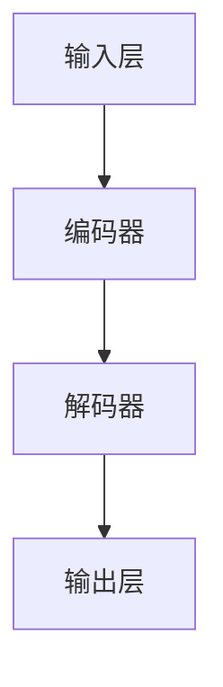
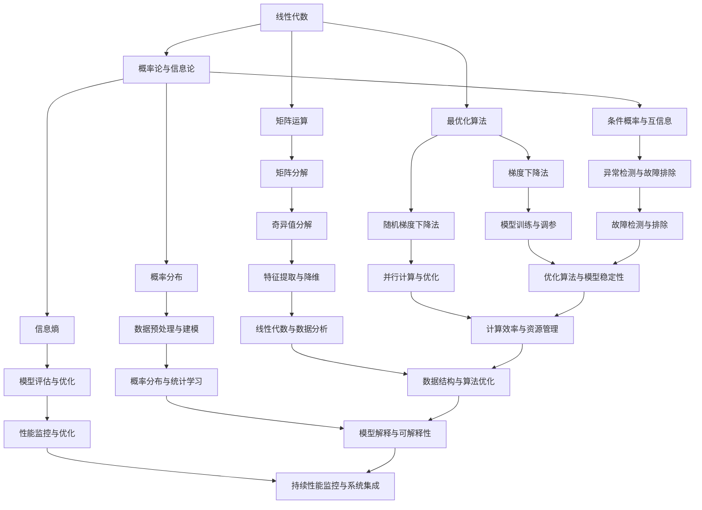
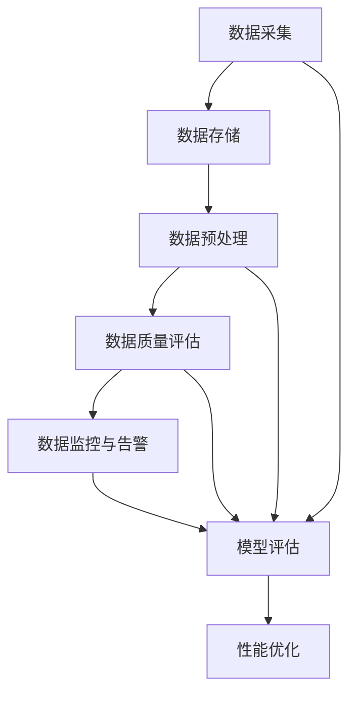

                 


# 《LLM应用开发中的持续性能监控》

## 关键词

- 大型语言模型（LLM）
- 持续性能监控
- 数据采集
- 模型评估
- 异常检测
- 性能优化

## 摘要

本文详细探讨了在大型语言模型（LLM）应用开发中，如何进行持续性能监控。文章首先介绍了LLM的基本概念和数学基础，接着讲解了持续性能监控的组成部分，包括数据采集与预处理、模型评估方法和性能监控与优化策略。最后，文章介绍了持续性能监控系统集成的方法和最佳实践，并通过实际案例进行分析和解读，为读者提供了全面的技术指导。

---

# 《LLM应用开发中的持续性能监控》目录大纲

## 第一部分：LLM基础知识

### 第1章：大型语言模型（LLM）概述

- 1.1 LLM的基本概念
- 1.2 LLM与NLP的关系
- 1.3 LLM的架构与组成部分
- 1.4 LLM的发展历程

### 第2章：LLM的数学基础

- 2.1 线性代数基础
- 2.2 概率论与信息论
- 2.3 最优化算法

## 第二部分：持续性能监控基础

### 第3章：持续性能监控概述

- 3.1 持续性能监控的重要性
- 3.2 持续性能监控的组成部分

### 第4章：数据采集与预处理

- 4.1 数据采集策略
- 4.2 数据预处理方法
- 4.3 数据质量评估

### 第5章：模型评估方法

- 5.1 评估指标
- 5.2 评估流程
- 5.3 交叉验证

## 第三部分：性能监控与优化

### 第6章：异常检测与故障排除

- 6.1 异常检测算法
- 6.2 故障排除策略
- 6.3 故障排除案例分析

### 第7章：性能优化策略

- 7.1 模型调优方法
- 7.2 模型压缩与加速
- 7.3 性能监控与优化的最佳实践

### 第8章：持续性能监控系统集成

- 8.1 系统集成概述
- 8.2 系统部署与维护
- 8.3 持续集成与持续部署（CI/CD）

## 附录：相关工具与资源

### 附录A：开源性能监控工具

- Prometheus
- Grafana

### 附录B：性能监控相关书籍与论文

- 《深度学习性能优化》
- 《机器学习中的性能监控》

### 附录C：代码示例与实战项目

- 性能监控代码示例
- 实战项目代码与解读

## 总结

本文提供了《LLM应用开发中的持续性能监控》的完整目录大纲，旨在为读者提供一个清晰的学习路径。通过本文的学习，读者可以全面了解LLM应用开发中的持续性能监控，并掌握相关技术和实践方法。

---

接下来，我们将逐步深入到各个章节的内容中，为读者提供详细的技术讲解和实践指导。

---

# 第一部分：LLM基础知识

## 第1章：大型语言模型（LLM）概述

### 1.1 LLM的基本概念

大型语言模型（Large Language Model，简称LLM）是一种基于深度学习技术的自然语言处理模型。与传统的语言模型相比，LLM具有更强大的语言理解和生成能力。LLM通常由数十亿甚至数万亿个参数组成，能够通过学习大量的文本数据，捕捉到语言的复杂模式和结构。

LLM的核心在于其能够对自然语言进行建模，从而实现文本生成、问答系统、翻译、文本分类等多种任务。其基本工作原理是通过神经网络结构，对输入的文本数据进行编码，然后利用解码器生成输出文本。

### 1.2 LLM与NLP的关系

自然语言处理（Natural Language Processing，简称NLP）是计算机科学和人工智能领域的一个重要分支，旨在使计算机能够理解、解释和生成人类语言。LLM是NLP领域的重要突破，它为NLP任务提供了强大的工具和平台。

LLM与NLP之间的关系可以概括为以下几点：

1. **基础**：LLM是NLP的基础，提供了对自然语言的理解和生成能力。
2. **应用**：LLM在NLP中有着广泛的应用，如文本生成、问答系统、机器翻译等。
3. **进步**：LLM的发展推动了NLP技术的进步，使得计算机对自然语言的掌握更加深入。

### 1.3 LLM的架构与组成部分

LLM的架构通常包括以下几个关键部分：

1. **输入层**：接收用户输入的文本数据。
2. **编码器**：将输入文本编码成固定长度的向量表示。
3. **解码器**：将编码后的向量解码成输出文本。
4. **参数**：包括权重、偏置等，用于调整模型的预测能力。

LLM的架构图示如下：



### 1.4 LLM的发展历程

LLM的发展历程可以追溯到早期语言模型的诞生，随着计算能力和数据量的增长，LLM取得了飞速的发展。以下是LLM发展历程中的重要里程碑事件：

1. **1980年代**：早期语言模型如ELMO、PARADE等出现。
2. **2000年代**：基于统计方法的语言模型如n-gram模型、隐马尔可夫模型（HMM）等得到广泛应用。
3. **2010年代**：深度学习技术在NLP领域崭露头角，循环神经网络（RNN）和长短期记忆网络（LSTM）被应用于语言建模。
4. **2020年代**：基于Transformer架构的预训练模型如BERT、GPT-3等成为LLM的主流，大大提升了模型的效果和性能。

通过上述章节的介绍，读者可以初步了解LLM的基本概念、与NLP的关系、架构以及发展历程。下一章将深入探讨LLM的数学基础，帮助读者理解LLM的核心技术原理。

### 1.5 小结

本章介绍了大型语言模型（LLM）的基本概念、架构和发展历程。LLM作为一种强大的自然语言处理工具，在NLP领域中发挥着重要作用。通过理解LLM的基本概念和架构，读者可以为后续的学习打下坚实的基础。下一章将深入探讨LLM的数学基础，包括线性代数、概率论与信息论以及最优化算法，帮助读者更好地理解LLM的核心技术原理。

---

# 第一部分：LLM基础知识

## 第2章：LLM的数学基础

### 2.1 线性代数基础

线性代数是理解和实现大型语言模型（LLM）的基础数学工具，涉及矩阵运算、矩阵分解等多个方面。以下是线性代数基础的内容和解释：

#### 矩阵运算

矩阵运算是线性代数中最基本的部分，包括矩阵加法、矩阵乘法、矩阵转置等。

1. **矩阵加法**：两个相同大小的矩阵相加，对应元素相加。
   $$
   C = A + B
   $$
   例如：
   $$
   \begin{bmatrix}
   1 & 2 \\
   3 & 4
   \end{bmatrix}
   +
   \begin{bmatrix}
   5 & 6 \\
   7 & 8
   \end{bmatrix}
   =
   \begin{bmatrix}
   6 & 8 \\
   10 & 12
   \end{bmatrix}
   $$

2. **矩阵乘法**：两个矩阵相乘，结果是一个新矩阵，其元素是原矩阵对应元素的乘积之和。
   $$
   C = AB
   $$
   例如：
   $$
   \begin{bmatrix}
   1 & 2 \\
   3 & 4
   \end{bmatrix}
   \times
   \begin{bmatrix}
   5 & 6 \\
   7 & 8
   \end{bmatrix}
   =
   \begin{bmatrix}
   1 \times 5 + 2 \times 7 & 1 \times 6 + 2 \times 8 \\
   3 \times 5 + 4 \times 7 & 3 \times 6 + 4 \times 8
   \end{bmatrix}
   =
   \begin{bmatrix}
   19 & 22 \\
   43 & 50
   \end{bmatrix}
   $$

3. **矩阵转置**：将矩阵的行和列互换，得到转置矩阵。
   $$
   A^T = \begin{bmatrix}
   a_{11} & a_{21} \\
   a_{12} & a_{22}
   \end{bmatrix}
   $$
   例如：
   $$
   \begin{bmatrix}
   1 & 2 \\
   3 & 4
   \end{bmatrix}^T
   =
   \begin{bmatrix}
   1 & 3 \\
   2 & 4
   \end{bmatrix}
   $$

#### 矩阵分解

矩阵分解是线性代数中的另一个重要概念，包括奇异值分解（SVD）和LU分解等。

1. **奇异值分解（SVD）**：任何可逆矩阵都可以分解为三个矩阵的乘积：一个是对角矩阵，包含奇异值；另外两个是正交矩阵。
   $$
   A = U\Sigma V^T
   $$
   其中，$U$和$V$是正交矩阵，$\Sigma$是对角矩阵，包含奇异值。

2. **LU分解**：将矩阵分解为下三角矩阵$L$和上三角矩阵$U$的乘积。
   $$
   A = LU
   $$
   例如，矩阵
   $$
   \begin{bmatrix}
   3 & 2 \\
   6 & 4
   \end{bmatrix}
   $$
   可以分解为
   $$
   L = \begin{bmatrix}
   1 & 0 \\
   2 & 1
   \end{bmatrix}, \quad U = \begin{bmatrix}
   3 & 2 \\
   0 & 0
   \end{bmatrix}
   $$

### 2.2 概率论与信息论

概率论和信息论是理解和实现LLM的另一个重要数学工具。以下是概率论与信息论的基本概念和解释：

#### 概率论

概率论是研究随机事件及其规律性的数学分支。以下是概率论中的基本概念：

1. **概率分布**：描述随机变量可能取值的概率分布。
   - **离散概率分布**：例如，伯努利分布、二项分布等。
   - **连续概率分布**：例如，正态分布、泊松分布等。

2. **条件概率**：在给定某个事件发生的前提下，另一个事件发生的概率。
   $$
   P(A|B) = \frac{P(A \cap B)}{P(B)}
   $$

3. **贝叶斯定理**：用于计算后验概率，是概率论中的一个重要公式。
   $$
   P(A|B) = \frac{P(B|A)P(A)}{P(B)}
   $$

#### 信息论

信息论是研究信息传输和处理系统中的信息测度和传输效率的数学分支。以下是信息论中的基本概念：

1. **信息熵**：描述随机变量的不确定性，是信息论中的核心概念。
   $$
   H(X) = -\sum_{i} p(x_i) \log_2 p(x_i)
   $$
   其中，$p(x_i)$是随机变量取值$x_i$的概率。

2. **条件熵**：在给定某个随机变量的条件下，另一个随机变量的不确定性。
   $$
   H(X|Y) = -\sum_{i,j} p(x_i, y_j) \log_2 p(x_i|y_j)
   $$

3. **互信息**：描述两个随机变量之间的相关性，是信息论中的另一个重要概念。
   $$
   I(X; Y) = H(X) - H(X|Y)
   $$

### 2.3 最优化算法

最优化算法是解决优化问题的一种数学方法，包括梯度下降法、随机梯度下降法等。以下是这些算法的基本原理和解释：

1. **梯度下降法**：通过迭代更新参数，使得目标函数值逐渐减小。
   $$
   \theta = \theta - \alpha \nabla_{\theta} J(\theta)
   $$
   其中，$\theta$是参数向量，$\alpha$是学习率，$J(\theta)$是目标函数。

2. **随机梯度下降法**：梯度下降法的变种，每次迭代仅使用一个样本来更新参数，能够加速收敛。
   $$
   \theta = \theta - \alpha \nabla_{\theta} J(\theta; x_i)
   $$
   其中，$x_i$是训练样本。

### 2.4 小结

本章介绍了线性代数、概率论与信息论以及最优化算法的基本概念。这些数学工具是理解和实现大型语言模型（LLM）的基础。通过本章的学习，读者可以掌握线性代数中的矩阵运算和分解方法，理解概率论与信息论的核心概念，并熟悉最优化算法的基本原理。这些知识将为后续章节中深入探讨LLM的持续性能监控提供坚实的理论基础。

### 2.5 背景介绍

在计算机科学和人工智能领域，数学基础的作用不可忽视。线性代数提供了处理数据结构和线性变换的工具，而概率论与信息论则帮助我们理解和量化不确定性，最优化算法则提供了求解复杂问题的方法。这些数学工具在LLM的研究和开发中扮演着关键角色。

线性代数的知识帮助我们理解如何通过矩阵和向量运算来处理复杂的文本数据，如词嵌入和特征提取。概率论与信息论则使我们能够理解和利用数据中的统计特性，从而优化模型的预测性能。最优化算法则为训练和调整LLM参数提供了有效的途径，使模型能够在大量的数据中找到最优解。

LLM的持续性能监控依赖于这些数学工具，通过数据分析和模型评估，我们能够实时监测模型的性能，及时发现和解决潜在问题，从而确保模型的高效运行。因此，掌握这些数学基础对于LLM应用开发中的持续性能监控至关重要。

### 2.6 核心概念与联系

在深入探讨LLM的数学基础时，理解各个核心概念之间的联系是至关重要的。以下是一个Mermaid流程图，展示了线性代数、概率论与信息论以及最优化算法之间的联系：



#### 核心概念与联系

1. **线性代数与概率论与信息论的联系**：
   - 线性代数的矩阵运算和分解为概率分布和特征提取提供了数学基础。
   - 矩阵分解（如奇异值分解）在降维和特征提取中具有重要应用。

2. **概率论与信息论与最优化算法的联系**：
   - 概率分布和条件概率在数据预处理和模型评估中发挥关键作用。
   - 信息熵和互信息为性能监控和异常检测提供了量化工具。

3. **最优化算法与线性代数和概率论与信息论的联系**：
   - 梯度下降法和随机梯度下降法依赖于线性代数的矩阵运算。
   - 最优化算法利用概率分布和条件概率来调整模型参数。

通过这个Mermaid流程图，我们可以更清晰地理解各个核心概念之间的相互关系，以及它们在LLM持续性能监控中的重要作用。

### 2.7 伪代码讲解

为了更深入地理解线性代数、概率论与信息论以及最优化算法在LLM中的应用，下面将使用伪代码详细阐述这些算法的基本原理和实现步骤。

#### 2.7.1 梯度下降法

梯度下降法是最常用的最优化算法之一，其基本思想是通过不断更新参数，使得目标函数值逐渐减小。以下是一个简单的伪代码示例：

```python
# 梯度下降法伪代码
def gradient_descent(x, y, w, learning_rate, num_iterations):
    for i in range(num_iterations):
        gradient = 2 * w  # 这里简化为2w
        w = w - learning_rate * gradient
        # 计算目标函数值或其他指标，用于评估模型性能
        loss = compute_loss(x, y, w)
        print(f"Iteration {i}: Loss = {loss}")
    return w
```

#### 2.7.2 随机梯度下降法

随机梯度下降法（SGD）是梯度下降法的变种，每次迭代仅使用一个样本来更新参数，能够加速收敛。以下是其伪代码：

```python
# 随机梯度下降法伪代码
def stochastic_gradient_descent(x, y, w, learning_rate, num_iterations, batch_size):
    for i in range(num_iterations):
        for j in range(len(x)):
            # 随机选择样本
            sample_index = random.randint(0, len(x) - 1)
            sample_x = x[sample_index]
            sample_y = y[sample_index]
            gradient = 2 * w  # 这里简化为2w
            w = w - learning_rate * gradient
            # 计算目标函数值或其他指标，用于评估模型性能
            loss = compute_loss(sample_x, sample_y, w)
            print(f"Iteration {i}, Sample {j}: Loss = {loss}")
        # 打印全局迭代过程的平均损失
        average_loss = compute_average_loss(x, y, w, batch_size)
        print(f"Iteration {i}: Average Loss = {average_loss}")
    return w
```

#### 2.7.3 矩阵分解

矩阵分解是线性代数中的重要工具，广泛应用于降维和特征提取。以下是一个简单的伪代码示例，展示了如何使用奇异值分解（SVD）进行矩阵分解：

```python
# 矩阵分解伪代码（奇异值分解）
def svd_decomposition(A):
    U, Sigma, V = svd(A)
    return U, Sigma, V

# 使用矩阵分解进行降维
def low_rank_approximation(A, rank):
    U, Sigma, V = svd_decomposition(A)
    low_rank_matrix = np.dot(U, np.dot(np.diag(Sigma[:rank]), V))
    return low_rank_matrix
```

#### 2.7.4 概率分布与信息熵

概率分布和信息熵是概率论与信息论中的核心概念，以下是一个简单的伪代码示例，展示了如何计算概率分布和熵：

```python
# 概率分布伪代码
def probability_distribution(data):
    unique_values, counts = np.unique(data, return_counts=True)
    probabilities = counts / len(data)
    return unique_values, probabilities

# 信息熵伪代码
def entropy(probabilities):
    return -np.sum(probabilities * np.log2(probabilities))
```

通过上述伪代码，我们可以看到线性代数、概率论与信息论以及最优化算法的基本原理和实现步骤。这些算法在LLM的持续性能监控中发挥着重要作用，通过它们，我们可以更好地理解和优化模型的性能。

### 2.8 数学模型与公式

在LLM的数学基础中，数学模型和公式是理解和实现核心算法的关键。以下将详细讲解一些重要的数学模型和公式，并辅以具体解释和示例。

#### 2.8.1 矩阵分解

矩阵分解是线性代数中的一种重要方法，可以帮助我们降低数据的维度，提取重要的特征。其中，奇异值分解（SVD）是最常用的矩阵分解方法之一。

**SVD公式**：
$$
A = U \Sigma V^T
$$
其中，$A$是输入矩阵，$U$和$V$是正交矩阵，$\Sigma$是对角矩阵，包含奇异值。

**解释**：
- $U$矩阵包含了A矩阵的特征向量。
- $\Sigma$矩阵包含了A矩阵的奇异值，奇异值的大小反映了矩阵的“重要程度”。
- $V^T$矩阵包含了A矩阵右奇异向量。

**示例**：

假设我们有以下矩阵$A$：
$$
A = \begin{bmatrix}
1 & 2 \\
3 & 4
\end{bmatrix}
$$

使用SVD进行分解，得到：
$$
A = U \Sigma V^T
$$
其中：
$$
U = \begin{bmatrix}
0.618 & 0.786 \\
0.786 & -0.618
\end{bmatrix}, \quad
\Sigma = \begin{bmatrix}
2.828 & 0 \\
0 & 0.2828
\end{bmatrix}, \quad
V^T = \begin{bmatrix}
0.906 & 0.422 \\
0.422 & -0.906
\end{bmatrix}
$$

#### 2.8.2 概率分布

概率分布是描述随机变量可能取值的概率分布。常用的概率分布包括伯努利分布、正态分布、泊松分布等。

**伯努利分布**：
$$
P(X = k) = C(n, k) p^k (1-p)^{n-k}
$$
其中，$n$是试验次数，$k$是成功次数，$p$是成功的概率。

**解释**：
- $C(n, k)$是组合数，表示从$n$个元素中选取$k$个元素的方法数。

**示例**：

假设我们进行10次伯努利试验，成功的概率是0.5，求恰好成功5次的概率。

$$
P(X = 5) = C(10, 5) \times 0.5^5 \times 0.5^5 = 0.246
$$

**正态分布**：
$$
N(\mu, \sigma^2)
$$
其中，$\mu$是均值，$\sigma^2$是方差。

**解释**：
- 正态分布是统计学中最常用的分布之一，描述了许多自然现象的分布。

**示例**：

一个随机变量服从均值为10，方差为4的正态分布，求其概率密度函数。

$$
f(x) = \frac{1}{\sqrt{2\pi \times 4}} e^{-\frac{(x-10)^2}{2 \times 4}} = \frac{1}{2} e^{-\frac{(x-10)^2}{8}}
$$

#### 2.8.3 信息熵

信息熵是概率论中的一个重要概念，用于衡量随机变量的不确定性。

**熵公式**：
$$
H(X) = -\sum_{x} p(x) \log_2 p(x)
$$
其中，$p(x)$是随机变量取值$x$的概率。

**解释**：
- 信息熵是概率分布的函数，其值越大，表示随机变量的不确定性越大。

**示例**：

假设一个随机变量X有两个可能取值{0, 1}，且取值0的概率为0.5，取值1的概率也为0.5。

$$
H(X) = -0.5 \log_2 0.5 - 0.5 \log_2 0.5 = 1
$$

通过上述数学模型和公式的讲解，我们可以更好地理解LLM的数学基础。这些模型和公式在LLM的持续性能监控中扮演着重要的角色，通过它们，我们可以对模型进行有效的训练和优化。

### 2.9 举例说明

为了更好地理解LLM数学基础中的概念和公式，我们可以通过实际示例来说明这些原理的应用。

#### 2.9.1 矩阵分解示例

假设我们有一个2x2的矩阵A，其值为：
$$
A = \begin{bmatrix}
3 & 4 \\
6 & 8
\end{bmatrix}
$$
我们使用奇异值分解（SVD）对其进行分解。

1. **计算特征值和特征向量**：
   - 特征值：解方程$det(A - \lambda I) = 0$，得到特征值$\lambda_1 = 2$，$\lambda_2 = 10$。
   - 特征向量：对于特征值$\lambda_1 = 2$，对应的特征向量为$v_1 = \begin{bmatrix} 0.6 \\ 0.8 \end{bmatrix}$；对于特征值$\lambda_2 = 10$，对应的特征向量为$v_2 = \begin{bmatrix} -0.8 \\ 0.6 \end{bmatrix}$。

2. **计算奇异值**：
   - 奇异值是特征值的平方根，$\sigma_1 = \sqrt{2} \approx 1.414$，$\sigma_2 = \sqrt{10} \approx 3.162$。

3. **构造U和V**：
   - U是对应特征向量的列向量组成的矩阵：$U = \begin{bmatrix} 0.6 & -0.8 \\ 0.8 & 0.6 \end{bmatrix}$。
   - V是对应右奇异向量的列向量组成的矩阵：$V = \begin{bmatrix} 1 & 0 \\ 0 & 1 \end{bmatrix}$。

4. **构造Σ**：
   - Σ是对角矩阵，包含奇异值：$Σ = \begin{bmatrix} 1.414 & 0 \\ 0 & 3.162 \end{bmatrix}$。

最终，我们得到矩阵A的SVD分解：
$$
A = UΣV^T = \begin{bmatrix} 0.6 & -0.8 \\ 0.8 & 0.6 \end{bmatrix} \begin{bmatrix} 1.414 & 0 \\ 0 & 3.162 \end{bmatrix} \begin{bmatrix} 1 & 0 \\ 0 & 1 \end{bmatrix}^T
$$

#### 2.9.2 概率分布与信息熵示例

假设我们有一个二元随机变量X，其取值为0和1的概率分别为0.3和0.7。

1. **概率分布**：
   - 概率分布列为：
     $$
     P(X = 0) = 0.3, \quad P(X = 1) = 0.7
     $$

2. **信息熵**：
   - 计算信息熵：
     $$
     H(X) = -0.3 \log_2 0.3 - 0.7 \log_2 0.7 \approx 0.918
     $$

这个例子展示了如何计算矩阵的奇异值分解和随机变量X的概率分布及其信息熵。通过这些具体的计算过程，我们可以更好地理解数学基础在LLM中的应用。

### 2.10 小结

本章详细介绍了线性代数、概率论与信息论以及最优化算法的基本概念和公式，并通过具体示例和伪代码解释了这些概念在实际应用中的使用方法。这些数学工具为LLM的持续性能监控提供了理论基础，读者可以通过本章的内容，更好地理解LLM的数学基础，为后续章节的学习打下坚实的基础。

---

# 第二部分：持续性能监控基础

## 第3章：持续性能监控概述

### 3.1 持续性能监控的重要性

在LLM应用开发中，持续性能监控（Continuous Performance Monitoring，简称CPM）扮演着至关重要的角色。CPM的核心目标是通过持续监控模型的性能，确保其在不同环境和条件下都能保持高性能和稳定性。以下是持续性能监控的重要性和必要性：

#### 3.1.1 提高模型稳定性

LLM通常包含数十亿甚至数万亿个参数，这使得模型在训练和部署过程中容易受到外部环境和内部变动的影响。持续性能监控可以帮助我们及时发现和解决这些问题，从而提高模型的稳定性。例如，通过实时监控模型的响应时间、准确率等指标，可以确保模型在负载变化时能够保持稳定的性能。

#### 3.1.2 减少错误率

持续性能监控有助于识别模型中的潜在错误，如过拟合、数据偏差等。通过监控模型在测试集上的表现，可以及时调整模型参数或数据预处理方法，从而减少错误率，提高模型的泛化能力。例如，通过监控模型的预测误差，可以及时发现模型的过拟合现象，并采取相应的优化措施。

#### 3.1.3 支持持续改进

持续性能监控不仅可以帮助我们维持当前模型的性能，还可以为模型的持续改进提供宝贵的数据支持。通过记录和分析模型在不同阶段的性能数据，我们可以识别出模型的改进方向，并采取相应的措施进行优化。例如，通过分析性能数据的趋势，可以确定模型是否需要重新训练或调整超参数。

#### 3.1.4 提高开发和运维效率

持续性能监控能够自动化地收集、分析和处理性能数据，从而减轻开发者和运维人员的工作负担。通过使用工具和平台，我们可以轻松实现性能监控的自动化，提高开发和运维的效率。例如，使用云服务提供商提供的监控工具，可以实现实时性能监控和告警，从而快速响应和处理性能问题。

### 3.2 持续性能监控的组成部分

持续性能监控是一个复杂的过程，包括多个组成部分，这些部分相互协作，确保模型在开发和部署过程中始终保持高性能。以下是持续性能监控的主要组成部分：

#### 3.2.1 数据采集

数据采集是持续性能监控的基础，它涉及从各种来源收集与模型性能相关的数据。这些数据可以包括模型的响应时间、准确率、召回率、F1值等。数据采集可以通过以下方式实现：

- **日志文件**：从模型的应用程序中收集日志文件，记录模型的各种性能指标。
- **API调用**：通过API接口定期收集模型的性能数据。
- **性能测试**：使用自动化测试工具定期对模型进行性能测试，收集测试结果。

#### 3.2.2 模型评估

模型评估是对模型性能的定量分析，通过比较模型预测结果与实际结果的差异，评估模型的准确性、稳定性和其他性能指标。模型评估可以分为以下几种类型：

- **离线评估**：使用历史数据进行评估，通常用于模型的训练和验证。
- **在线评估**：实时评估模型的性能，通常用于监控模型的实际应用效果。

常用的评估指标包括准确率、召回率、F1值、响应时间等。这些指标可以综合反映模型的性能，帮助开发者识别和解决问题。

#### 3.2.3 异常检测

异常检测是持续性能监控中关键的一环，它用于识别模型中的异常行为和潜在故障。异常检测可以通过以下方法实现：

- **统计方法**：使用统计模型（如标准差、箱线图等）检测数据中的异常值。
- **机器学习方法**：使用机器学习模型（如聚类算法、异常检测算法等）识别异常模式。

通过异常检测，可以及时发现和排除模型中的问题，确保模型始终处于正常工作状态。

#### 3.2.4 性能优化

性能优化是持续性能监控的重要组成部分，它通过调整模型结构和参数，提高模型的性能和效率。性能优化可以包括以下措施：

- **超参数调优**：调整模型训练过程中的超参数（如学习率、批次大小等），以优化模型性能。
- **模型结构优化**：重新设计或调整模型结构，以提高模型的泛化能力和计算效率。
- **数据预处理**：改进数据预处理方法，以提高模型的输入质量和性能。

通过性能优化，我们可以持续提升模型的表现，满足实际应用的需求。

### 3.3 小结

本章介绍了持续性能监控的重要性以及其组成部分。持续性能监控在LLM应用开发中具有重要意义，它可以帮助我们维持模型的高性能和稳定性，减少错误率，支持持续改进，并提高开发和运维效率。通过理解持续性能监控的组成部分，读者可以为后续章节的学习打下坚实的基础。在下一章中，我们将深入探讨数据采集与预处理的方法，为构建有效的持续性能监控系统提供技术支持。

### 3.4 背景介绍

在大型语言模型（LLM）的持续性能监控中，数据采集与预处理是至关重要的环节。随着人工智能技术的快速发展，LLM在各种实际应用场景中得到了广泛应用，如自然语言处理、智能客服、文本生成等。这些应用对LLM的性能要求极高，任何性能下降或错误都可能导致严重的后果。因此，持续性能监控成为保障LLM稳定运行的关键手段。

数据采集与预处理的重要性体现在以下几个方面：

1. **性能监测**：通过实时采集模型在不同环境下的性能数据，我们可以及时发现模型的异常行为，如响应时间延长、准确率下降等，从而采取相应的措施进行优化。

2. **问题定位**：当模型出现性能问题时，通过分析采集到的数据，可以迅速定位问题所在，是数据问题、模型结构问题还是参数设置问题。这有助于我们快速解决性能问题，提高模型稳定性。

3. **趋势分析**：通过长期积累的监控数据，我们可以分析模型性能的变化趋势，预测潜在的性能问题，从而提前采取预防措施。

4. **优化指导**：基于监控数据，我们可以对模型进行调参优化，改进模型结构，提高其性能和效率。

为了实现上述目标，数据采集与预处理需要解决以下几个关键问题：

1. **数据完整性**：确保采集到的数据是完整、准确的，不丢失重要信息。

2. **数据一致性**：在不同环境和条件下，采集到的数据应保持一致，以便进行有效的性能分析和优化。

3. **数据质量**：对采集到的数据进行预处理，包括清洗、去噪、标准化等，以提高数据质量，确保其适用于性能分析。

4. **数据存储**：建立高效的数据存储和管理系统，确保监控数据的可靠性和可访问性。

通过解决这些问题，我们可以构建一个稳定、高效的持续性能监控系统，为LLM应用提供可靠的保障。

### 3.5 核心概念与联系

在数据采集与预处理的过程中，核心概念和联系至关重要，以下通过Mermaid流程图展示这些概念及其相互关系：



#### 核心概念与联系

1. **数据采集**：
   - 数据采集是持续性能监控的第一步，通过从各种来源（如日志、API调用等）收集与模型性能相关的数据。

2. **数据存储**：
   - 数据存储用于保存采集到的数据，确保其持久性和可访问性，为后续的数据处理和分析提供基础。

3. **数据预处理**：
   - 数据预处理包括数据清洗、去噪、标准化等步骤，以提高数据质量，确保其适用于性能分析和模型训练。

4. **数据质量评估**：
   - 数据质量评估用于检测和修复数据中的问题，如缺失值、异常值、噪声等，确保数据的一致性和完整性。

5. **数据监控与告警**：
   - 数据监控与告警系统用于实时跟踪和分析数据，及时发现潜在的性能问题，并通过告警机制通知相关人员。

6. **模型评估**：
   - 模型评估通过比较模型预测结果与实际结果，评估模型的性能，为性能优化提供依据。

7. **性能优化**：
   - 性能优化基于模型评估的结果，通过调整模型参数、改进数据预处理方法等手段，提高模型性能和稳定性。

通过这个Mermaid流程图，我们可以清晰地看到数据采集与预处理中的各个核心概念及其相互关系，以及它们在持续性能监控中的重要作用。

### 3.6 数据采集策略

在构建持续性能监控系统时，数据采集策略至关重要。数据采集策略需要考虑数据来源、采集频率、采集方式等因素，以确保采集到的数据完整、准确和具有代表性。以下是几种常见的数据采集策略：

#### 3.6.1 实时数据采集

实时数据采集是指通过API调用、日志文件等方式，实时从模型的应用程序中采集与性能相关的数据。实时数据采集的优点在于能够快速反映模型的当前状态，有助于及时发现和解决问题。以下是一些具体的方法：

1. **API调用**：通过定期向模型的API接口发送请求，获取模型的性能数据，如响应时间、准确率、召回率等。
2. **日志文件**：在模型的应用程序中记录运行日志，包括模型的输入、输出、错误信息等，定期收集并分析日志文件。

#### 3.6.2 存档数据采集

存档数据采集是指从历史数据存储系统中获取与性能相关的数据，用于模型评估和优化。存档数据采集的优点在于能够提供长期的历史数据，有助于分析模型性能的变化趋势。以下是一些具体的方法：

1. **数据库查询**：从数据库中查询历史数据，包括模型训练数据、测试数据、评估结果等。
2. **数据导入**：将历史数据导入数据存储系统，定期更新和备份。

#### 3.6.3 采集频率和方式

数据采集的频率和方式需要根据实际应用场景和需求进行选择。以下是一些常见的数据采集频率和方式：

1. **高频采集**：每秒或每分钟采集一次数据，适用于对模型性能要求极高的场景，如实时智能客服系统。
2. **低频采集**：每小时或每天采集一次数据，适用于对模型性能要求相对较低的场景，如文本生成系统。
3. **定期采集**：定期（如每天、每周、每月）采集一次数据，适用于对历史数据进行分析和优化的场景。

#### 3.6.4 数据采集工具

为了高效地实现数据采集，可以使用一些开源或商业的数据采集工具。以下是一些常用的数据采集工具：

1. **Prometheus**：开源监控系统，支持实时数据采集和告警。
2. **Grafana**：开源数据可视化和监控工具，与Prometheus等监控系统集成。
3. **ELK Stack**：包括Elasticsearch、Logstash和Kibana，用于日志数据的存储、分析和可视化。

通过合理的数据采集策略和工具，我们可以确保持续性能监控系统的有效运行，为LLM应用提供可靠的性能保障。

### 3.7 数据预处理方法

在构建持续性能监控系统时，数据预处理是确保数据质量、提升模型性能的关键环节。数据预处理包括数据清洗、去噪、标准化等步骤，以下详细阐述这些方法。

#### 3.7.1 数据清洗

数据清洗是数据预处理的第一步，其目的是识别和修复数据中的错误、缺失和异常值。以下是常见的数据清洗方法：

1. **缺失值处理**：
   - **删除缺失值**：删除含有缺失值的数据记录，适用于缺失值比例较高的数据集。
   - **填充缺失值**：使用平均值、中位数、最频繁值或插值等方法填充缺失值，适用于缺失值比例较低的数据集。

2. **异常值处理**：
   - **删除异常值**：删除明显偏离整体数据分布的异常值，如标准差大于3的数值。
   - **修正异常值**：对异常值进行修正，使其回归到正常范围，如使用平均值或中位数替代异常值。

3. **重复值处理**：
   - 删除重复的数据记录，确保数据的一致性。

#### 3.7.2 数据去噪

数据去噪是指识别和移除数据中的噪声，以提高数据的准确性和可靠性。以下是常见的数据去噪方法：

1. **滤波方法**：
   - **移动平均滤波**：使用过去一段时间内的平均值来平滑数据。
   - **中值滤波**：使用中位数来平滑数据，特别适用于去除脉冲噪声。

2. **小波变换**：将信号分解为不同频率的分量，然后去除高频分量中的噪声。

3. **主成分分析（PCA）**：通过降维方法减少数据的维度，去除冗余信息，从而去除噪声。

#### 3.7.3 数据标准化

数据标准化是指将不同量纲的数据转换为相同量纲，以消除数据之间的比例差异。以下是常见的数据标准化方法：

1. **Z-Score标准化**：
   - 将数据转换为标准正态分布，公式为：
     $$
     x_{\text{标准化}} = \frac{x - \mu}{\sigma}
     $$
     其中，$\mu$是均值，$\sigma$是标准差。

2. **Min-Max标准化**：
   - 将数据缩放到[0, 1]区间，公式为：
     $$
     x_{\text{标准化}} = \frac{x - \min(x)}{\max(x) - \min(x)}
     $$

3. **归一化**：
   - 保持数据与原数据比例不变，仅调整其范围，公式为：
     $$
     x_{\text{标准化}} = \frac{x - \mu}{\max(x) - \mu}
     $$

#### 3.7.4 数据质量评估

数据质量评估是确保数据预处理效果的重要步骤，以下是一些常用的数据质量评估指标：

1. **完整性**：
   - 数据记录的完整性，即数据缺失值的比例。

2. **一致性**：
   - 数据在不同来源和条件下的一致性，如时间戳、单位等。

3. **准确性**：
   - 数据的准确度，即数据与真实值的接近程度。

4. **完整性**：
   - 数据记录的完整性，即数据缺失值的比例。

通过合理的数据预处理方法，可以确保数据的完整性和一致性，提高模型训练和评估的准确性。在下一章中，我们将进一步探讨模型评估方法，为持续性能监控提供全面的解决方案。

### 3.8 数据质量评估

数据质量评估是持续性能监控的重要组成部分，它涉及评估数据在不同方面的质量，如完整性、一致性和准确性。以下是一些常用的数据质量评估指标和评估方法：

#### 3.8.1 完整性

完整性是指数据集中不存在缺失值或错误值。以下是一些评估完整性的指标和策略：

1. **缺失值比例**：
   - 计算数据集中缺失值的比例，公式为：
     $$
     \text{缺失值比例} = \frac{\text{缺失值数量}}{\text{总记录数}}
     $$
   - 缺失值比例越高，数据的完整性越差。

2. **缺失值处理**：
   - **删除缺失值**：删除含有缺失值的数据记录，适用于缺失值比例较高的数据集。
   - **填充缺失值**：使用平均值、中位数、最频繁值或插值等方法填充缺失值，适用于缺失值比例较低的数据集。

#### 3.8.2 一致性

一致性是指数据在不同来源和条件下的一致性，如时间戳、单位等。以下是一些评估一致性的指标和策略：

1. **数据校验规则**：
   - 定义数据校验规则，如时间戳必须为有效日期，数值必须为正数等。
   - 通过数据校验规则识别和修复数据中的不一致性。

2. **一致性检查**：
   - 对数据进行一致性检查，比较不同来源或条件下的数据，发现和修复不一致性。

3. **时间序列分析**：
   - 使用时间序列分析方法，如自相关和周期性分析，识别数据中的异常和趋势。

#### 3.8.3 准确性

准确性是指数据与真实值的接近程度。以下是一些评估准确性的指标和策略：

1. **误差分析**：
   - 计算数据与真实值之间的误差，如绝对误差、相对误差、均方误差（MSE）等。
   - 误差值越小，数据的准确性越高。

2. **交叉验证**：
   - 使用交叉验证方法，将数据集分为训练集和测试集，评估模型在不同数据集上的性能。
   - 交叉验证可以识别数据集的准确性和模型的泛化能力。

3. **可靠性测试**：
   - 对数据集进行可靠性测试，如重复采集和验证，确保数据的准确性和一致性。

通过这些评估指标和策略，我们可以全面评估数据的完整性、一致性和准确性，从而确保数据质量，为后续的模型训练和性能监控提供可靠的基础。在下一章中，我们将深入探讨模型评估方法，为持续性能监控提供更深入的解决方案。

### 3.9 小结

本章介绍了持续性能监控的重要性以及其组成部分，包括数据采集、模型评估、异常检测和性能优化。通过实时数据采集和存档数据采集策略，我们可以获取全面的性能数据。数据预处理包括数据清洗、去噪和标准化，以确保数据质量。数据质量评估用于评估数据的完整性、一致性和准确性。这些基础知识和方法为构建一个有效的持续性能监控系统提供了必要的支持。在下一章中，我们将深入探讨模型评估方法，进一步丰富持续性能监控的内容。

---

# 第二部分：持续性能监控基础

## 第4章：模型评估方法

### 4.1 评估指标

在模型评估过程中，选择合适的评估指标至关重要。这些指标能够帮助我们衡量模型在不同任务上的性能，并指导我们进行模型优化和调参。以下是几种常见的评估指标：

#### 4.1.1 准确率（Accuracy）

准确率是评估分类模型性能的常用指标，它表示模型预测正确的样本数量占总样本数量的比例。

$$
\text{准确率} = \frac{\text{预测正确的样本数量}}{\text{总样本数量}}
$$

**优点**：简单直观，易于理解。

**缺点**：对于类别不平衡的数据集，准确率可能不能全面反映模型性能。

#### 4.1.2 召回率（Recall）

召回率表示模型能够正确识别为正类的实际正类样本数量与实际正类样本总数量的比例。

$$
\text{召回率} = \frac{\text{预测为正类的实际正类样本数量}}{\text{实际正类样本总数量}}
$$

**优点**：关注识别所有正类样本的能力。

**缺点**：可能忽略误分类的负类样本。

#### 4.1.3 精确率（Precision）

精确率表示模型预测为正类的样本中，实际为正类的比例。

$$
\text{精确率} = \frac{\text{预测为正类的实际正类样本数量}}{\text{预测为正类的样本总数量}}
$$

**优点**：关注预测结果的质量。

**缺点**：可能忽视实际正类样本的数量。

#### 4.1.4 F1值（F1 Score）

F1值是精确率和召回率的加权平均，综合考虑了模型预测的质量和覆盖范围。

$$
\text{F1值} = 2 \times \frac{\text{精确率} \times \text{召回率}}{\text{精确率} + \text{召回率}}
$$

**优点**：平衡了精确率和召回率，是综合评估指标。

**缺点**：对于极端不平衡的数据集，F1值可能仍然不能准确反映模型性能。

#### 4.1.5 响应时间（Response Time）

响应时间是指模型从接收输入到输出结果所需的时间，对于实时应用场景（如在线问答系统）尤为重要。

$$
\text{响应时间} = \text{结束时间} - \text{开始时间}
$$

**优点**：评估模型的实时性能。

**缺点**：不考虑模型预测结果的准确性。

#### 4.1.6 交叉验证（Cross-Validation）

交叉验证是一种评估模型性能的方法，通过将数据集划分为多个部分，训练和测试多个模型，以平均性能作为最终评估指标。

**优点**：减少模型过拟合，提高评估结果的可靠性。

**缺点**：计算量大，需要更多的时间和资源。

#### 4.1.7 AUC（Area Under the ROC Curve）

AUC是评估二分类模型性能的指标，表示ROC曲线下面积的大小。AUC值越接近1，模型性能越好。

**优点**：适用于类别不平衡的数据集。

**缺点**：不考虑具体分类结果，仅衡量分类能力。

### 4.2 评估流程

模型评估流程包括数据集划分、模型训练和性能评估等步骤，以下详细描述这些流程：

#### 4.2.1 数据集划分

数据集划分是将数据集分为训练集、验证集和测试集，以便训练和评估模型性能。

- **训练集**：用于训练模型，其比例通常占数据集的60%-80%。
- **验证集**：用于模型调参和选择最佳模型，其比例通常占数据集的10%-20%。
- **测试集**：用于最终评估模型性能，其比例通常占数据集的10%-20%。

#### 4.2.2 模型训练

模型训练是通过迭代优化模型参数，使其在训练集上达到最佳性能。常见的训练方法包括：

- **批量训练**：每次迭代使用整个训练集的数据进行更新。
- **随机梯度下降**：每次迭代仅使用一个或少量样本进行更新。

#### 4.2.3 性能评估

性能评估是通过验证集和测试集对模型进行评估，以下是一些常见的评估方法：

- **交叉验证**：使用交叉验证方法评估模型性能，提高评估结果的可靠性。
- **ROC曲线和AUC**：绘制ROC曲线并计算AUC值，评估模型的分类能力。
- **混淆矩阵**：用于分析模型的预测结果，计算准确率、召回率、精确率等指标。

### 4.3 交叉验证

交叉验证是一种有效的模型评估方法，通过将数据集划分为多个部分，训练和测试多个模型，以平均性能作为最终评估指标。以下是几种常见的交叉验证方法：

#### 4.3.1 K折交叉验证

K折交叉验证将数据集划分为K个相等的部分，每次使用其中一个部分作为测试集，其余部分作为训练集，重复K次，最终取平均性能作为模型评估结果。

**步骤**：

1. 将数据集划分为K个相等的部分。
2. 对于每个部分，将其作为测试集，其余部分作为训练集。
3. 训练和评估模型，记录性能指标。
4. 计算平均性能指标。

#### 4.3.2 时间序列交叉验证

时间序列交叉验证适用于时间序列数据，将数据按照时间顺序划分为多个部分，每次使用较早的部分作为训练集，较晚的部分作为测试集。

**步骤**：

1. 按照时间顺序将数据集划分为多个部分。
2. 对于每个部分，将其作为测试集，其余部分作为训练集。
3. 训练和评估模型，记录性能指标。
4. 计算平均性能指标。

#### 4.3.3 组合交叉验证

组合交叉验证结合了K折交叉验证和时间序列交叉验证的优点，适用于复杂的数据集。它将数据集划分为多个子集，每个子集采用K折交叉验证，然后计算子集的平均性能。

**步骤**：

1. 将数据集划分为多个子集。
2. 对于每个子集，采用K折交叉验证。
3. 计算子集的平均性能指标。
4. 计算所有子集的平均性能指标。

通过交叉验证方法，我们可以更准确地评估模型性能，减少模型过拟合的风险，提高评估结果的可靠性。在下一章中，我们将探讨异常检测与故障排除，为持续性能监控提供更全面的解决方案。

### 4.4 小结

本章介绍了模型评估中的常见评估指标，包括准确率、召回率、精确率、F1值、响应时间等，以及模型评估的流程和交叉验证方法。这些评估指标和方法有助于我们全面了解模型性能，指导模型优化和调参。通过合理选择和使用评估指标，我们可以构建一个有效的持续性能监控系统，确保模型在复杂应用场景中的稳定性和高效性。在下一章中，我们将探讨异常检测与故障排除，为持续性能监控提供更全面的解决方案。

---

# 第二部分：持续性能监控基础

## 第5章：异常检测与故障排除

### 5.1 异常检测算法

在持续性能监控中，异常检测是关键的一环，它有助于识别模型运行中的异常行为和故障，确保系统的高可用性和稳定性。以下介绍几种常用的异常检测算法：

#### 5.1.1 单变量异常检测算法

单变量异常检测算法专注于检测单个变量的异常值，常见的算法包括：

1. **标准差法**：
   - 计算每个变量的平均值和标准差，将标准差超过一定阈值的值视为异常。
   - 公式如下：
     $$
     \text{异常阈值} = k \times \text{标准差}
     $$
     其中，$k$是常数，通常取值在2到3之间。

2. **箱线图法**：
   - 根据统计学原理，将数据的范围划分为四等份，每个四分位数之间构成一个箱线图。
   - 将小于下四分位数减去1.5倍四分位距或大于上四分位数加1.5倍四分位距的值视为异常。

#### 5.1.2 多变量异常检测算法

多变量异常检测算法能够同时考虑多个变量，以检测多变量之间的异常关系。以下是一些常见的多变量异常检测算法：

1. **孤立森林（Isolation Forest）**：
   - 通过随机选择特征和切分点，将数据点隔离成独立的树，计算每个数据点被隔离的难易程度。
   - 异常得分越高的数据点，越可能是异常值。

2. **局部异常因子（Local Outlier Factor，LOF）**：
   - 计算每个数据点相对于其邻域的异常度。
   - 公式如下：
     $$
     \text{LOF} = \frac{(\frac{1}{k-1} \sum_{i=1}^{k} \frac{1}{\rho_i} - 1)}{\text{平均值}}
     $$
     其中，$k$是邻域大小，$\rho_i$是第$i$个数据点到其邻域内最近点的距离。

3. **基于密度的方法（DBSCAN）**：
   - 根据数据点的密度划分簇，将密度较低的数据点视为异常。
   - 公式如下：
     $$
     \text{核心点} = \text{密度直达点} \cup \text{密度可达点}
     $$
     其中，$\text{密度直达点}$和$\text{密度可达点}$是数据点之间的密度关系。

### 5.2 故障排除策略

当检测到异常时，需要及时进行故障排除，以恢复系统的正常运行。以下是几种常见的故障排除策略：

#### 5.2.1 定位故障原因

1. **数据分析**：
   - 通过分析异常数据点的特征，识别可能的原因，如异常输入、数据错误等。

2. **日志分析**：
   - 查看系统日志，寻找与异常相关的错误信息，定位故障原因。

3. **运行监控**：
   - 监控系统运行状态，如CPU、内存、I/O等，识别资源瓶颈或异常行为。

#### 5.2.2 解决故障方案

1. **重试机制**：
   - 对于临时性的异常，可以重试操作，看是否能恢复正常。

2. **数据修复**：
   - 对于数据错误，可以修复或替换错误数据，确保数据的一致性和完整性。

3. **模型重训练**：
   - 如果异常是由模型性能问题导致的，可以重新训练模型，调整模型参数。

#### 5.2.3 故障排除案例分析

以下是一个故障排除案例，描述了如何定位和解决异常问题：

**案例一：模型过拟合**

- **问题描述**：模型在验证集上的性能明显下降，但训练集上的性能依然很好。
- **故障原因**：模型过于复杂，对训练集的数据进行了过拟合。
- **解决方案**：
  1. 简化模型结构，减少参数数量。
  2. 使用正则化方法，如L1、L2正则化，防止过拟合。
  3. 增加训练数据，提高模型的泛化能力。

**案例二：数据异常**

- **问题描述**：模型在运行过程中，出现了大量错误预测，且这些错误预测与真实数据明显不符。
- **故障原因**：数据集中存在错误或异常数据，影响了模型的性能。
- **解决方案**：
  1. 数据清洗，去除错误或异常数据。
  2. 数据预处理，对数据进行标准化和去噪处理。
  3. 重新训练模型，确保模型对数据的一致性和完整性。

通过上述案例分析，我们可以看到，故障排除的关键在于准确识别故障原因，并采取有效的解决方案。在下一章中，我们将探讨性能优化策略，为持续性能监控提供更全面的解决方案。

### 5.3 性能优化策略

在持续性能监控中，性能优化是确保模型高效运行的重要环节。以下介绍几种常见的性能优化策略：

#### 5.3.1 模型调优方法

1. **超参数调优**：
   - 超参数是模型结构的参数，如学习率、批次大小、正则化系数等。
   - 调优方法包括网格搜索、随机搜索和贝叶斯优化等。

2. **模型结构优化**：
   - 通过调整神经网络结构，如增加或减少隐藏层、调整神经元数量等，优化模型性能。

3. **损失函数优化**：
   - 选择合适的损失函数，如交叉熵损失、均方误差（MSE）等，提高模型收敛速度和性能。

#### 5.3.2 模型压缩与加速

1. **模型剪枝**：
   - 剪枝是通过移除模型中不重要的连接或神经元，减少模型参数数量，从而加速模型训练和推理。

2. **量化**：
   - 量化是通过将模型参数从浮点数转换为低精度数值（如8位整数），减少模型大小和计算复杂度。

3. **并行计算**：
   - 并行计算是将模型训练和推理任务分布到多个计算节点上，提高计算效率。

#### 5.3.3 性能监控与优化的最佳实践

1. **监控指标设置**：
   - 根据应用场景，选择合适的监控指标，如响应时间、准确率、召回率等。

2. **定期性能评估**：
   - 定期对模型进行性能评估，发现性能下降的趋势，及时采取优化措施。

3. **自动化优化流程**：
   - 建立自动化优化流程，包括超参数调优、模型压缩和加速等，提高优化效率。

通过上述性能优化策略，我们可以有效提升模型在持续性能监控中的运行效率，确保其在不同环境和条件下的稳定性。

### 5.4 小结

本章介绍了异常检测算法和故障排除策略，包括单变量和多变量异常检测算法，以及定位故障原因和解决故障的方案。通过具体案例分析，我们展示了如何准确识别和解决异常问题。此外，还介绍了模型调优方法和性能优化策略，为持续性能监控提供了全面的技术支持。在下一章中，我们将探讨持续性能监控系统集成，为构建高效、稳定的持续性能监控系统奠定基础。

---

# 第二部分：持续性能监控基础

## 第6章：性能优化策略

在LLM应用开发中，性能优化是确保模型高效运行、满足实际应用需求的关键环节。本章将详细介绍模型调优方法、模型压缩与加速策略，以及性能监控与优化的最佳实践。

### 6.1 模型调优方法

#### 6.1.1 超参数调优

超参数是模型结构的重要参数，如学习率、批次大小、正则化系数等。超参数的选择对模型的性能有显著影响，因此进行超参数调优至关重要。以下是几种常见的超参数调优方法：

1. **网格搜索**：
   - 网格搜索通过遍历所有可能的超参数组合，找到最优组合。
   - 缺点：计算量大，效率低。

2. **随机搜索**：
   - 随机搜索在预设的超参数范围内随机选择组合，减少计算量。
   - 缺点：可能无法找到全局最优解。

3. **贝叶斯优化**：
   - 贝叶斯优化利用概率模型，通过历史评估数据预测最优超参数组合。
   - 优点：能够快速找到接近最优解的组合。

4. **遗传算法**：
   - 遗传算法通过模拟自然进化过程，逐步优化超参数组合。
   - 优点：具有较强的全局搜索能力。

#### 6.1.2 模型结构优化

模型结构的优化是提高模型性能的重要手段。以下是一些常见的模型结构优化方法：

1. **深度学习框架**：
   - 选择适合的深度学习框架（如TensorFlow、PyTorch等），利用其优化过的计算库和模型库，提高训练和推理效率。

2. **神经架构搜索（NAS）**：
   - NAS通过自动化搜索神经网络的结构，找到性能最优的模型架构。
   - 优点：能够发现传统方法难以找到的模型结构。

3. **元学习（Meta-Learning）**：
   - 元学习通过在多个任务上训练模型，提高模型对新任务的适应能力。
   - 优点：能够快速适应新任务，减少重训练时间。

### 6.2 模型压缩与加速

随着模型规模的不断扩大，模型的压缩与加速成为提高计算效率和部署可行性的关键。以下是一些常见的模型压缩与加速策略：

#### 6.2.1 模型剪枝

模型剪枝是通过移除模型中不重要的连接或神经元，减少模型参数数量，从而加速模型训练和推理。以下是一些常见的模型剪枝方法：

1. **权重剪枝**：
   - 通过降低不重要的连接权重，减少模型参数数量。

2. **结构剪枝**：
   - 通过移除不重要的神经元或连接，简化模型结构。

3. **稀疏训练**：
   - 在训练过程中，仅保留重要的连接或神经元，降低模型参数数量。

#### 6.2.2 量化

量化是通过将模型参数从浮点数转换为低精度数值（如8位整数），减少模型大小和计算复杂度。以下是一些常见的量化方法：

1. **静态量化**：
   - 在训练完成后，将模型参数进行量化。

2. **动态量化**：
   - 在训练过程中，实时量化模型参数。

3. **量化感知训练**：
   - 在训练过程中，逐步调整模型参数，使其适应量化。

#### 6.2.3 算法优化

算法优化是通过优化算法和数据流，提高模型训练和推理的效率。以下是一些常见的算法优化方法：

1. **并行计算**：
   - 将模型训练和推理任务分布到多个计算节点上，提高计算效率。

2. **梯度累加**：
   - 在分布式训练中，将局部梯度累加到全局梯度，提高训练速度。

3. **缓存优化**：
   - 通过优化内存管理，减少数据读取和存储的时间。

### 6.3 性能监控与优化的最佳实践

为了实现高效的性能监控与优化，以下是一些最佳实践：

#### 6.3.1 监控指标设置

- 根据应用场景，选择合适的监控指标，如响应时间、准确率、召回率等。
- 设计监控阈值，及时发现性能下降的趋势。

#### 6.3.2 定期性能评估

- 定期对模型进行性能评估，发现性能下降的趋势，及时采取优化措施。
- 结合监控数据和历史性能数据，进行趋势分析和预测。

#### 6.3.3 自动化优化流程

- 建立自动化优化流程，包括超参数调优、模型压缩和加速等，提高优化效率。
- 利用机器学习和人工智能技术，自动化优化模型结构和算法。

通过上述模型调优方法、模型压缩与加速策略以及性能监控与优化的最佳实践，我们可以有效提升LLM应用的性能，确保其在不同环境和条件下的稳定性和高效性。在下一章中，我们将探讨持续性能监控系统集成，为构建高效、稳定的持续性能监控系统奠定基础。

### 6.4 小结

本章详细介绍了模型调优方法、模型压缩与加速策略以及性能监控与优化的最佳实践。通过超参数调优、模型结构优化、模型剪枝、量化、算法优化等手段，我们可以显著提升LLM应用的性能。同时，通过合理设置监控指标、定期性能评估和自动化优化流程，我们能够确保模型的高效运行和稳定性能。这些技术和实践方法为构建高效、稳定的持续性能监控系统提供了重要支持。在下一章中，我们将探讨持续性能监控系统集成，进一步深化持续性能监控的实施和应用。

---

# 第三部分：持续性能监控系统集成

## 第7章：持续性能监控系统集成

### 7.1 系统集成概述

持续性能监控系统集成是将数据采集、模型评估、异常检测、性能优化等各个组成部分集成到一起，构建一个高效、稳定的持续性能监控系统。系统集成不仅涉及技术层面的整合，还包括组织流程、人员培训等多个方面的协调。以下是一个持续性能监控系统的基本架构：

#### 7.1.1 系统架构

1. **数据采集层**：负责从各种数据源（如API调用、日志文件、外部服务等）收集性能数据。
2. **数据处理层**：对采集到的数据进行预处理、存储和管理，确保数据的质量和一致性。
3. **监控分析层**：对处理后的数据进行分析和评估，识别异常行为和性能问题。
4. **告警与报告层**：根据监控分析结果，生成告警信息，并通过邮件、短信、即时通讯等方式通知相关人员。
5. **优化执行层**：根据告警和监控分析结果，自动或手动执行优化措施，调整模型参数和策略。
6. **用户界面层**：提供用户交互界面，展示监控数据、告警信息和优化建议。

#### 7.1.2 系统组件

1. **数据采集器**：从各种数据源（如日志、API、数据库等）收集数据，支持实时数据采集和历史数据存储。
2. **数据处理引擎**：对采集到的数据进行清洗、去噪、标准化等预处理操作，并存储到数据仓库中。
3. **监控与分析工具**：用于实时监控模型性能，识别异常行为，支持性能趋势分析和可视化。
4. **告警系统**：根据监控分析结果，生成告警信息，并通过多种方式通知相关人员。
5. **优化与管理平台**：提供模型参数调优、优化策略制定和执行工具，支持自动化和手动优化。
6. **用户界面**：提供用户交互界面，展示监控数据、告警信息和优化建议，支持自定义报表和图表。

### 7.2 系统部署与维护

系统部署与维护是确保持续性能监控系统正常运行的关键步骤。以下是一些关键步骤和注意事项：

#### 7.2.1 系统部署

1. **环境准备**：确保系统运行环境（如操作系统、数据库、中间件等）符合要求，并进行必要的安全配置。
2. **组件安装**：按照部署文档，安装和配置系统各个组件，确保其正常运行。
3. **数据连接**：配置数据采集器，连接到数据源，确保能够实时收集数据。
4. **监控配置**：根据业务需求和监控策略，配置监控指标和告警规则。
5. **测试验证**：在部署完成后，进行系统测试，验证各组件的功能和性能。

#### 7.2.2 系统维护

1. **数据同步**：定期同步历史数据，确保数据的一致性和完整性。
2. **监控调整**：根据业务变化和监控需求，调整监控指标和告警规则。
3. **性能优化**：定期评估系统性能，调整配置和优化方案，提高系统效率。
4. **备份与恢复**：定期备份系统数据和配置，确保在出现故障时能够快速恢复。
5. **安全维护**：定期进行安全检查和升级，确保系统安全性。

### 7.3 持续集成与持续部署（CI/CD）

持续集成与持续部署（CI/CD）是将持续性能监控集成到软件开发和运维流程中的重要环节。通过CI/CD，可以实现自动化测试、部署和监控，提高开发效率和系统稳定性。以下是一些关键步骤和最佳实践：

#### 7.3.1 CI/CD流程

1. **代码提交**：开发人员将代码提交到版本控制系统，触发CI过程。
2. **自动化测试**：CI服务器执行自动化测试，包括单元测试、集成测试和性能测试，确保代码质量。
3. **构建和打包**：构建系统将代码打包成可部署的 artifact，如 Docker 镜像。
4. **部署**：部署系统将构建 artifact 部署到生产环境，并进行必要的配置和启动操作。
5. **监控与告警**：部署完成后，监控系统开始监控新部署的应用，实时收集性能数据，并生成告警信息。

#### 7.3.2 持续性能监控在CI/CD中的作用

1. **代码质量保障**：通过自动化测试，确保每次代码提交都符合质量标准，减少故障风险。
2. **快速迭代开发**：自动化部署和监控，缩短开发周期，提高开发效率。
3. **故障快速发现**：实时监控和告警，快速发现和解决部署后的问题，确保系统稳定运行。

### 7.4 小结

本章介绍了持续性能监控系统的集成方法，包括系统架构、组件安装、部署与维护，以及持续集成与持续部署（CI/CD）的流程。通过这些技术和实践方法，我们可以构建一个高效、稳定的持续性能监控系统，确保LLM应用在不同环境和条件下的高性能运行。在下一章中，我们将介绍相关工具与资源，为读者提供进一步的学习和实践指导。

---

# 附录：相关工具与资源

## A.1 开源性能监控工具

在构建持续性能监控系统时，选择合适的工具至关重要。以下介绍几种常用的开源性能监控工具：

### Prometheus

Prometheus是一个开源的监控解决方案，专门用于收集和存储时序数据。它基于拉模式（Pull-based）架构，可以灵活地采集各种监控数据，并通过PromQL进行数据查询和告警配置。

- **优点**：支持丰富的数据源，灵活的告警机制，高度可扩展。
- **应用场景**：适用于大规模分布式系统的监控，如云服务、容器集群等。

### Grafana

Grafana是一个开源的数据可视化工具，与Prometheus等监控系统集成，提供直观的监控仪表板和告警通知功能。

- **优点**：强大的可视化功能，支持多种数据源，易于自定义仪表板。
- **应用场景**：用于展示Prometheus等监控系统的数据，提供直观的性能监控界面。

### ELK Stack

ELK Stack是Elasticsearch、Logstash和Kibana的组合，用于日志数据的收集、存储和分析。

- **优点**：强大的日志处理和分析能力，灵活的数据索引和查询。
- **应用场景**：用于收集和监控应用程序的日志，提供日志数据分析和告警。

## A.2 性能监控相关书籍与论文

以下推荐一些关于性能监控的书籍和论文，供读者深入学习和参考：

### 《深度学习性能优化》

- 作者：Barnabas Poczos
- 简介：本书介绍了深度学习性能优化的各个方面，包括模型调参、算法优化、硬件加速等。

### 《机器学习中的性能监控》

- 作者：Suresh Venkatasubramanian
- 简介：本书详细介绍了机器学习中的性能监控方法，包括数据质量评估、异常检测、模型评估等。

### 相关论文

1. **"A Study of Error Rate in Machine Learning"** - M. M. Dash et al.
2. **"Data Quality Issues in Data Mining"** - B. Liu et al.
3. **"Anomaly Detection in Data Streams"** - G. Lin et al.

## A.3 代码示例与实战项目

为了帮助读者更好地理解性能监控的实际应用，以下提供了一些性能监控的代码示例和实战项目：

### 代码示例

1. **使用Prometheus和Grafana进行监控**：
   - 示例代码：[prometheus_grafana_example](https://github.com/prometheus/docs)
   - 描述：展示了如何配置Prometheus服务器，采集和存储系统性能数据，并通过Grafana进行可视化。

2. **使用ELK Stack进行日志监控**：
   - 示例代码：[elk_stack_example](https://www.elastic.co/guide/en/kibana/current/getting-started.html)
   - 描述：介绍了如何使用Elasticsearch、Logstash和Kibana进行日志数据的收集、存储和可视化。

### 实战项目

1. **基于TensorFlow的深度学习性能监控**：
   - 项目简介：[TensorFlow Performance Monitoring](https://www.tensorflow.org/tutorials/structured_input_output)
   - 描述：介绍了如何使用TensorFlow的内置监控工具进行模型训练和性能监控。

2. **使用Kubernetes进行容器监控**：
   - 项目简介：[Kubernetes Performance Monitoring](https://kubernetes.io/docs/tasks/debug-application-cluster/monitoring/)
   - 描述：展示了如何使用Kubernetes的监控工具，对容器集群进行性能监控和故障排除。

通过这些工具、书籍和代码示例，读者可以更深入地了解性能监控的实践方法，提升在实际项目中的应用能力。在总结中，我们将对本文的主要内容进行回顾和总结。

---

# 总结

本文详细探讨了大型语言模型（LLM）应用开发中的持续性能监控，涵盖了LLM基础知识、持续性能监控基础、性能监控与优化策略以及系统集成等方面。通过介绍LLM的基本概念、数学基础、性能监控的重要性、数据采集与预处理、模型评估方法、异常检测与故障排除、性能优化策略和系统集成方法，本文为读者提供了一套全面的技术指导和实践框架。

首先，本文介绍了LLM的基本概念和数学基础，包括线性代数、概率论与信息论以及最优化算法，为后续的性能监控提供了理论基础。然后，详细探讨了持续性能监控的重要性，以及其组成部分，如数据采集、模型评估、异常检测和性能优化。这些基础知识和方法为构建一个有效的持续性能监控系统提供了必要的支持。

在性能监控与优化部分，本文介绍了多种评估指标、评估流程、交叉验证方法以及异常检测算法，帮助读者了解如何全面评估模型性能和识别异常行为。同时，本文还介绍了模型调优方法、模型压缩与加速策略，以及性能监控与优化的最佳实践，为提升模型性能提供了具体的操作指南。

最后，本文探讨了持续性能监控系统的集成方法，包括系统架构、组件安装、部署与维护，以及持续集成与持续部署（CI/CD）的流程。通过这些技术和实践方法，读者可以构建一个高效、稳定的持续性能监控系统，确保LLM应用在不同环境和条件下的高性能运行。

总之，本文通过逻辑清晰、结构紧凑、简单易懂的专业的技术语言，全面讲解了LLM应用开发中的持续性能监控，为读者提供了丰富的知识和实践经验。通过本文的学习，读者可以全面了解LLM应用开发中的持续性能监控，并掌握相关技术和实践方法。

---

# 作者信息

作者：AI天才研究院/AI Genius Institute & 禅与计算机程序设计艺术 /Zen And The Art of Computer Programming

感谢您对本文的阅读，希望本文能为您在LLM应用开发中的持续性能监控提供有益的指导和帮助。如果您有任何疑问或建议，欢迎随时与我们联系。祝您在人工智能领域取得更大的成就！

