                 

### 1.1 LLAMA：大型语言模型的研究背景与目的

#### 1.1.1 语言模型的定义

语言模型（Language Model，LM）是自然语言处理（Natural Language Processing，NLP）领域中的一个核心组成部分，用于对文本数据进行概率建模。通俗地说，语言模型能够预测一个文本序列中下一个单词或字符的概率。这种模型在语言理解和生成方面有广泛应用，例如机器翻译、语音识别、文本摘要等。

#### 1.1.2 LLAMA模型的特点

LLAMA（Large Language Model for AI Applications）是一种大规模语言模型，由OpenAI于2020年发布。它采用了深度学习技术，特别是Transformer架构，使得模型在处理长文本和复杂语言结构时具有显著优势。LLAMA模型的特点包括：

- **大规模**：LLAMA拥有数十亿参数，能够处理大量的文本数据，从而提高模型的泛化能力。
- **自适应**：模型能够根据不同的应用场景进行调整，例如对话系统、文本生成等。
- **高效**：采用Transformer架构，使得模型在计算效率上有很大提升。

#### 1.1.3 LLAMA模型的研究意义

LLAMA模型的研究意义主要体现在以下几个方面：

- **推动NLP技术发展**：LLAMA模型的发布标志着NLP领域的一个重要里程碑，推动了相关技术的研究和应用。
- **提升AI应用水平**：大规模语言模型在AI应用中发挥着重要作用，例如自动驾驶、智能客服、内容生成等，LLAMA模型为这些领域提供了强有力的技术支持。
- **促进跨学科合作**：语言模型的发展不仅依赖于计算机科学，还需要与语言学、心理学等领域密切合作，从而推动多学科的交叉融合。

### 1.2 持续集成与持续部署：LLM应用开发的关键环节

#### 1.2.1 持续集成（CI）的概念

持续集成（Continuous Integration，CI）是一种软件开发实践，旨在通过频繁的代码合并和自动化测试，确保软件项目的质量。CI的核心目标是尽早发现和修复代码中的缺陷，避免集成过程中的冲突和错误。

#### 1.2.2 持续部署（CD）的概念

持续部署（Continuous Deployment，CD）是一种自动化流程，用于将经过CI验证的代码快速、安全地部署到生产环境。CD的目标是减少部署时间、提高部署频率，同时确保系统稳定性和可靠性。

#### 1.2.3 CI/CD在LLM开发中的应用价值

在LLM应用开发中，CI/CD具有以下应用价值：

- **提高开发效率**：通过自动化测试和快速反馈，开发团队能够更迅速地发现和解决问题，提高开发效率。
- **确保模型质量**：CI确保每次代码变更都不会破坏现有功能，CD则保证模型在各个环境中的表现一致，从而提高模型质量。
- **降低风险**：通过自动化流程，降低手动操作带来的风险，确保部署的可靠性和安全性。

### 1.2.4 持续集成与持续部署的关系架构

为了更好地理解CI与CD之间的关系，可以使用Mermaid流程图进行描述。以下是CI与CD的流程关系架构：

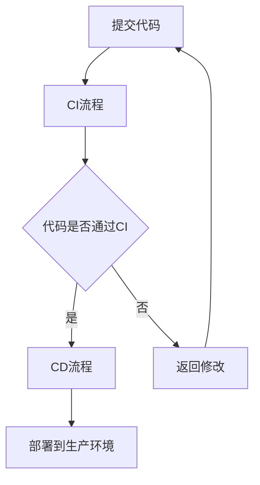

在该流程中，开发人员提交代码后，CI流程会自动进行测试和验证。如果代码通过CI，则进入CD流程，最终部署到生产环境。否则，开发人员需要根据CI反馈进行代码修改，并重新提交。

#### 1.2.5 持续集成与持续部署在LLM开发中的具体应用

在LLM开发中，CI/CD的具体应用包括：

- **模型训练与验证**：在每次代码提交后，CI会自动运行模型训练脚本，验证模型性能是否达到预期。
- **版本控制**：使用Git等版本控制工具，确保代码版本的一致性和可追溯性。
- **自动化测试**：编写自动化测试脚本，对模型输出进行验证，确保模型在不同环境中的表现一致。
- **部署策略**：根据业务需求，制定合适的部署策略，例如蓝绿部署、滚动更新等，确保部署过程的平稳和高效。

通过CI/CD流程，LLM开发团队能够更高效地管理代码变更，确保模型质量和部署稳定性，从而提高整体开发效率。

### 1.2.6 持续集成与持续部署的优势

持续集成与持续部署在LLM开发中的优势包括：

- **快速反馈**：开发人员能够更快地发现和解决问题，提高开发效率。
- **提高质量**：通过自动化测试和持续集成，确保代码和模型的质量。
- **降低风险**：通过自动化流程，降低手动操作带来的风险，确保部署的可靠性和安全性。
- **提升协作**：团队成员可以更方便地协同工作，共同推动项目进展。

### 1.2.7 持续集成与持续部署的挑战

虽然CI/CD带来了许多优势，但在LLM开发中仍然面临以下挑战：

- **资源管理**：大规模模型训练和部署需要大量计算资源和存储资源，如何高效地管理和调度这些资源是一个挑战。
- **环境一致性**：确保开发、测试和生产环境的一致性，避免因环境差异导致的部署问题。
- **安全性**：在持续集成和部署过程中，确保代码和模型的安全性，防止数据泄露和滥用。

通过合理规划和设计，CI/CD流程可以有效地应对这些挑战，为LLM开发提供强大的支持。

### 1.2.8 持续集成与持续部署的最佳实践

在LLM开发中，以下是一些持续集成与持续部署的最佳实践：

- **自动化测试**：编写覆盖全面的自动化测试脚本，确保每次代码提交都经过严格测试。
- **版本控制**：使用Git等版本控制工具，确保代码版本的可追溯性和一致性。
- **持续反馈**：通过实时反馈机制，及时发现问题并进行修复。
- **部署策略**：根据业务需求，制定合适的部署策略，确保部署过程的平稳和高效。
- **资源管理**：合理规划计算资源和存储资源，确保模型训练和部署的顺利进行。

通过遵循这些最佳实践，LLM开发团队能够更好地实现CI/CD流程，提高开发效率和质量。

### 1.2.9 持续集成与持续部署的总结

持续集成与持续部署在LLM开发中具有重要作用，通过自动化测试、版本控制、持续反馈和合理的部署策略，能够有效提高开发效率和质量。面对资源管理、环境一致性和安全性等挑战，开发者需要采取相应的策略和最佳实践，确保CI/CD流程的稳定和高效。

---

为了进一步阐述持续集成与持续部署在LLM应用开发中的关键环节，以下是具体的核心概念、联系以及流程关系架构。

#### 1.2.10 核心概念与联系

持续集成与持续部署的核心概念包括：

- **代码库（Repository）**：用于存储和管理代码的集中化位置。
- **构建（Build）**：将源代码编译和打包成可执行文件的过程。
- **测试（Test）**：对构建结果进行验证，确保代码质量。
- **部署（Deploy）**：将经过验证的代码部署到生产环境。

这些概念相互联系，共同构成了CI/CD的核心流程。代码库是CI/CD的基础，构建和测试是确保代码质量的关键环节，部署则是将经过验证的代码交付给用户。

#### 1.2.11 流程关系架构

以下是一个用于描述CI/CD流程关系的Mermaid流程图：

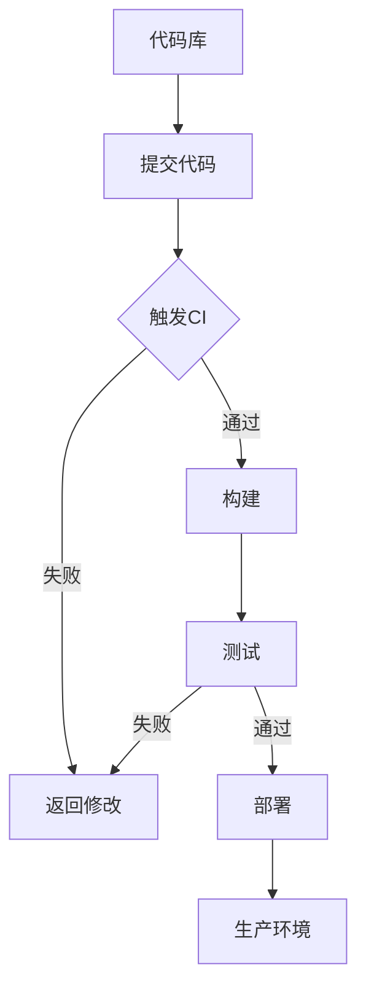

在该流程中，开发人员将代码提交到代码库，触发CI流程。如果构建和测试通过，代码会被部署到生产环境。否则，开发人员需要根据反馈进行代码修改，并重新提交。

#### 1.2.12 核心算法原理讲解

在CI/CD流程中，核心算法原理主要包括：

- **版本控制算法**：Git是一种常用的版本控制工具，基于SHA-1哈希算法，确保代码版本的可追溯性和一致性。
- **构建算法**：构建过程中，使用Makefile等脚本工具，将源代码编译成可执行文件。
- **测试算法**：编写测试脚本，使用自动化测试工具，对构建结果进行验证。
- **部署算法**：使用自动化部署工具，如Jenkins、Docker等，将经过验证的代码部署到生产环境。

以下是构建和测试算法的伪代码示例：

```python
def build():
    # 编译源代码
    run("gcc source.c -o executable")

def test():
    # 运行测试脚本
    run("python test.py")
```

#### 1.2.13 数学模型和公式讲解

在CI/CD流程中，涉及的数学模型和公式主要包括：

- **代码复杂度度量**：使用 cyclomatic complexity（Cyclomatic复杂度）等指标，评估代码复杂度，指导代码重构。
- **测试覆盖率**：使用 code coverage（代码覆盖率）等指标，评估测试的全面性，指导测试优化。

以下是Cyclomatic复杂度的公式：

$$
Cyclomatic\ complexity = E - N + 2P
$$

其中，E为边的数量，N为节点的数量，P为连通分量（即独立的子图）的数量。

#### 1.2.14 详细讲解与举例说明

为了更好地理解CI/CD的核心概念、算法原理和数学模型，以下是一些具体的应用案例：

- **代码复杂度度量**：假设一个函数包含3个条件分支和5个循环，计算其Cyclomatic复杂度：

  $$
  Cyclomatic\ complexity = 3 + 5 - 2 \times 1 = 6
  $$

- **测试覆盖率**：假设一个程序包含1000行代码，测试脚本覆盖了其中的800行，计算测试覆盖率：

  $$
  Code\ coverage = \frac{800}{1000} \times 100\% = 80\%
  $$

通过这些案例，可以更好地理解CI/CD在LLM应用开发中的具体应用和实践。

### 1.2.15 案例分析

为了进一步阐述持续集成与持续部署在LLM应用开发中的关键环节，以下是一个实际案例：

#### 1.2.15.1 案例背景

某AI公司开发一款基于LLAMA模型的企业级智能客服系统。随着业务需求的不断变化，系统的功能和性能需要持续优化和提升。

#### 1.2.15.2 案例目标

通过实施CI/CD流程，确保系统代码质量，提高开发效率，确保系统稳定性和可靠性。

#### 1.2.15.3 案例实现

1. **代码库搭建**：使用Git作为版本控制工具，搭建集中化的代码库。
2. **构建与测试**：每次代码提交后，CI服务器自动进行构建和测试。构建过程中，使用Makefile编译源代码，测试脚本使用Python编写，覆盖功能测试和性能测试。
3. **部署**：经过CI验证的代码，通过CD流程部署到测试环境。测试环境中的智能客服系统经过充分测试后，再部署到生产环境。

#### 1.2.15.4 案例分析

通过CI/CD流程，该公司的智能客服系统在开发过程中实现了以下成果：

- **快速反馈**：开发人员能够快速发现和解决问题，提高了开发效率。
- **代码质量**：通过自动化测试和持续集成，确保了代码质量。
- **系统稳定性**：通过CD流程，确保了系统在不同环境中的稳定性和可靠性。

### 1.2.16 实战

为了更好地理解持续集成与持续部署在LLM应用开发中的实际操作，以下是一个实战案例：

#### 1.2.16.1 实战环境搭建

1. **硬件环境**：准备一台服务器，配置至少8GB内存和100GB硬盘空间。
2. **软件环境**：安装Linux操作系统，配置Git、Jenkins等工具。
3. **代码库**：在Git服务器上创建代码库，存储智能客服系统的代码。

#### 1.2.16.2 实战步骤

1. **配置Jenkins**：在服务器上安装Jenkins，配置CI/CD管道。
2. **编写构建脚本**：编写Makefile，实现代码编译和打包。
3. **编写测试脚本**：编写Python测试脚本，实现功能测试和性能测试。
4. **部署到测试环境**：通过Jenkins部署代码到测试环境，进行测试。
5. **部署到生产环境**：通过CD流程，将测试通过的代码部署到生产环境。

#### 1.2.16.3 实战总结

通过实战，开发人员能够深入了解CI/CD在LLM应用开发中的具体操作和流程。掌握CI/CD工具的使用，可以提高开发效率，确保系统质量和稳定性。

### 1.2.17 最佳实践 Tips

在LLM应用开发中，以下是一些持续集成与持续部署的最佳实践：

- **自动化测试**：编写覆盖全面的自动化测试脚本，确保每次代码提交都经过严格测试。
- **版本控制**：使用Git等版本控制工具，确保代码版本的可追溯性和一致性。
- **持续反馈**：通过实时反馈机制，及时发现问题并进行修复。
- **部署策略**：根据业务需求，制定合适的部署策略，确保部署过程的平稳和高效。

通过遵循这些最佳实践，开发团队能够更好地实现CI/CD流程，提高开发效率和质量。

### 1.2.18 小结

持续集成与持续部署是LLM应用开发中不可或缺的重要环节。通过实施CI/CD流程，开发团队能够更高效地管理代码变更，确保模型质量和部署稳定性。面对资源管理、环境一致性和安全性等挑战，开发者需要采取相应的策略和最佳实践，确保CI/CD流程的稳定和高效。

### 1.2.19 注意事项

在实施CI/CD流程时，开发者需要注意以下几点：

- **确保构建环境一致**：在开发、测试和生产环境中，构建环境应保持一致，以避免因环境差异导致的部署问题。
- **合理规划资源**：根据业务需求，合理规划计算资源和存储资源，确保模型训练和部署的顺利进行。
- **加强安全性**：在持续集成和部署过程中，确保代码和模型的安全性，防止数据泄露和滥用。

### 1.2.20 拓展阅读

- [Jenkins官方文档](https://www.jenkins.io/doc/)
- [GitLab CI/CD官方文档](https://docs.gitlab.com/ci/)
- [Docker官方文档](https://docs.docker.com/)

通过阅读相关文档和资料，开发者可以更深入地了解CI/CD的工具和流程，提升持续集成与持续部署的能力。

### 1.2.21 总结

持续集成与持续部署在LLM应用开发中具有重要作用。通过自动化测试、版本控制、持续反馈和合理的部署策略，开发团队能够提高开发效率和质量。面对资源管理、环境一致性和安全性等挑战，开发者需要采取相应的策略和最佳实践，确保CI/CD流程的稳定和高效。本节内容详细介绍了持续集成与持续部署的核心概念、流程关系架构、核心算法原理、数学模型和公式、详细讲解与举例说明，以及实战案例和分析，为开发者提供了全面的理论指导和实践参考。

---

### 2.1 数据准备

在LLM应用开发中，数据准备是一个至关重要的环节。高质量的训练数据能够显著提高模型的性能，而错误或不一致的数据则可能导致模型训练失败或性能下降。因此，正确且高效的数据准备过程对于LLM应用的成功至关重要。

#### 2.1.1 数据来源

数据来源的选择直接影响到模型的质量。在LLM应用中，常见的数据来源包括：

- **公开数据集**：如维基百科、新闻文章、社交媒体帖子等。这些数据集通常由研究机构或开源项目提供，易于获取。
- **自定义数据集**：根据具体应用需求，从企业内部系统或外部数据源（如企业数据库、传感器数据等）收集的数据。
- **合成数据**：通过数据增强技术生成，用于补充或替代实际数据。

在选择数据来源时，应考虑以下因素：

- **数据量**：数据量应足够大，以确保模型有足够的样本进行训练。
- **数据质量**：数据应准确、一致且无噪声，以确保模型的学习效果。
- **数据多样性**：数据应涵盖各种场景和情况，以增强模型的泛化能力。

#### 2.1.2 数据预处理

数据预处理是数据准备的关键步骤，其目的是将原始数据转换成适合模型训练的形式。以下是一些常见的数据预处理任务：

- **数据清洗**：去除无效数据、重复数据、缺失值填充等，确保数据的一致性和完整性。
- **数据格式化**：将数据统一格式，如文本数据转换为统一编码格式（如UTF-8），图像数据调整为固定大小等。
- **特征提取**：从原始数据中提取有代表性的特征，如文本数据的词频、词嵌入等。
- **数据归一化**：对数据进行归一化或标准化处理，以消除不同特征之间的尺度差异。

以下是一个简单的数据预处理流程：

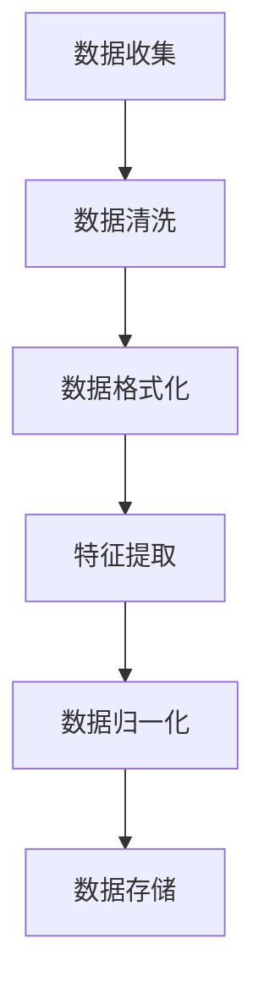

#### 2.1.3 数据存储与管理

数据存储与管理是数据准备中的另一个重要环节。以下是一些常见的数据存储与管理策略：

- **本地存储**：将数据存储在本地磁盘或SSD上，适用于数据量较小的情况。
- **分布式存储**：使用分布式文件系统（如HDFS）存储大量数据，适用于数据量较大的情况。
- **数据库存储**：使用关系数据库（如MySQL）或NoSQL数据库（如MongoDB）存储结构化数据。
- **云存储**：利用云服务提供商（如Amazon S3、Google Cloud Storage）存储数据，具有高可用性和扩展性。

在数据存储与管理过程中，应考虑以下因素：

- **数据访问速度**：根据数据规模和模型训练需求，选择合适的存储方案，以确保数据访问速度。
- **数据安全性**：确保数据存储的安全性，防止数据泄露和损坏。
- **数据备份与恢复**：定期备份数据，并确保在数据丢失或损坏时能够快速恢复。

#### 2.1.4 数据质量评估

数据质量评估是确保模型训练效果的关键步骤。以下是一些常见的数据质量评估指标：

- **准确性**：数据中正确和错误的样本比例。
- **完整性**：数据中缺失值的比例。
- **一致性**：数据在不同源之间的不一致性。
- **可靠性**：数据的真实性和可信度。

以下是一个简单的数据质量评估流程：

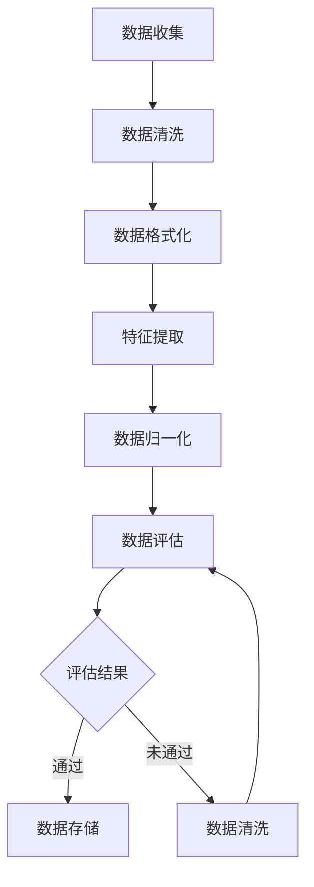

通过以上步骤，可以确保数据准备过程的高效性和数据质量，为后续的模型训练打下坚实基础。

---

### 2.2 模型架构选择

在LLM应用开发中，模型架构的选择是至关重要的一步，它直接影响模型的表现和性能。合适的模型架构能够更好地捕捉数据中的特征，提高模型的准确性和效率。以下是关于模型架构选择的一些核心内容和实现步骤。

#### 2.2.1 模型架构概述

模型架构是指模型的结构和组成，包括输入层、隐藏层和输出层等。在LLM应用中，常见的模型架构包括以下几种：

1. **传统的神经网络**：包括多层感知器（MLP）、卷积神经网络（CNN）等。
2. **递归神经网络（RNN）**：包括长短期记忆网络（LSTM）、门控循环单元（GRU）等。
3. **Transformer架构**：包括BERT、GPT、T5等，是目前LLM的主流架构。

Transformer架构因其并行计算能力强大和捕捉长距离依赖关系的能力而备受青睐。它通过多头自注意力机制（Multi-head Self-Attention）和位置编码（Positional Encoding）等创新机制，使得模型能够高效地处理长文本和复杂语言结构。

#### 2.2.2 模型架构选择依据

在选择模型架构时，需要考虑以下因素：

1. **任务类型**：不同的任务需要不同的模型架构。例如，文本分类任务可能更适合传统的神经网络，而文本生成任务则更适合Transformer架构。
2. **数据规模**：大规模的数据集通常需要更强的模型架构来捕捉数据中的复杂特征。
3. **计算资源**：模型的复杂度和计算需求直接影响计算资源的需求。在资源有限的情况下，需要选择计算效率更高的模型架构。
4. **性能需求**：不同的应用场景对模型的性能要求不同，例如实时应用可能需要更快响应的模型。

以下是一个简化的模型架构选择流程：

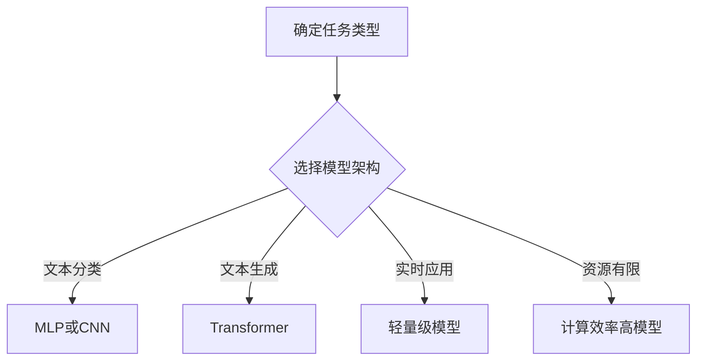

#### 2.2.3 模型架构实现

在确定了模型架构后，需要进行具体的实现。以下是实现一个Transformer模型的基本步骤：

1. **定义模型结构**：使用深度学习框架（如PyTorch、TensorFlow）定义模型结构，包括输入层、隐藏层和输出层等。
2. **编码器实现**：实现编码器（Encoder）部分，包括多头自注意力机制和位置编码等。
3. **解码器实现**：实现解码器（Decoder）部分，包括自注意力机制和交叉注意力机制等。
4. **损失函数与优化器**：选择合适的损失函数（如交叉熵损失）和优化器（如Adam），以最小化模型损失。
5. **训练与评估**：对模型进行训练，并通过验证集和测试集进行评估，调整模型参数以获得最佳性能。

以下是Transformer模型实现的伪代码：

```python
# 定义Transformer编码器
class Encoder(nn.Module):
    def __init__(self, d_model, nhead, num_layers):
        super(Encoder, self).__init__()
        self.transformer = nn.Transformer(d_model, nhead, num_layers)
        
    def forward(self, src, src_mask=None):
        output = self.transformer(src, src_mask)
        return output

# 定义Transformer解码器
class Decoder(nn.Module):
    def __init__(self, d_model, nhead, num_layers):
        super(Decoder, self).__init__()
        self.transformer = nn.Transformer(d_model, nhead, num_layers)
        
    def forward(self, tgt, tgt_mask=None, memory=None, memory_mask=None):
        output = self.transformer(tgt, memory, tgt_mask, memory_mask)
        return output

# 实例化模型
encoder = Encoder(d_model=512, nhead=8, num_layers=3)
decoder = Decoder(d_model=512, nhead=8, num_layers=3)

# 训练模型
optimizer = optim.Adam(model.parameters(), lr=0.001)
criterion = nn.CrossEntropyLoss()

for epoch in range(num_epochs):
    for inputs, targets in train_loader:
        optimizer.zero_grad()
        outputs = model(inputs)
        loss = criterion(outputs, targets)
        loss.backward()
        optimizer.step()

    # 在验证集上评估模型
    val_loss = 0
    with torch.no_grad():
        for inputs, targets in val_loader:
            outputs = model(inputs)
            loss = criterion(outputs, targets)
            val_loss += loss.item()
    print(f'Epoch {epoch+1}, Validation Loss: {val_loss/len(val_loader)}')
```

通过以上步骤，可以实现对Transformer模型的实现和训练，从而为LLM应用开发奠定基础。

---

### 2.3 模型训练与优化

模型训练与优化是LLM应用开发的核心环节之一。通过有效的训练策略和优化方法，可以提高模型的性能，使其在复杂任务中表现出更好的泛化能力。以下是关于模型训练与优化的一些关键步骤和策略。

#### 2.3.1 训练流程

1. **数据预处理**：在开始训练之前，需要对数据进行预处理，包括数据清洗、格式化、归一化等，以确保数据的质量和一致性。
2. **数据加载**：使用数据加载器（DataLoader）将预处理后的数据分批次加载，以便于模型训练。
3. **模型初始化**：根据选择的模型架构，初始化模型的参数。
4. **损失函数选择**：选择合适的损失函数，如交叉熵损失（CrossEntropyLoss）或均方误差（MSE），用于衡量模型预测结果与实际结果之间的差距。
5. **优化器选择**：选择合适的优化器，如Adam或SGD，用于更新模型参数。
6. **训练循环**：在训练循环中，对模型进行前向传播，计算损失，然后通过反向传播更新模型参数。
7. **评估与调整**：在训练过程中，定期使用验证集评估模型性能，并根据评估结果调整模型参数或训练策略。

以下是一个简化的模型训练流程伪代码：

```python
# 数据预处理
train_loader = DataLoader(train_dataset, batch_size=batch_size, shuffle=True)

# 模型初始化
model = Model()
optimizer = optim.Adam(model.parameters(), lr=learning_rate)
criterion = nn.CrossEntropyLoss()

# 训练循环
num_epochs = 10
for epoch in range(num_epochs):
    model.train()
    for inputs, targets in train_loader:
        optimizer.zero_grad()
        outputs = model(inputs)
        loss = criterion(outputs, targets)
        loss.backward()
        optimizer.step()
    
    # 在验证集上评估模型
    model.eval()
    with torch.no_grad():
        val_loss = 0
        for inputs, targets in val_loader:
            outputs = model(inputs)
            loss = criterion(outputs, targets)
            val_loss += loss.item()
    print(f'Epoch {epoch+1}, Validation Loss: {val_loss/len(val_loader)}')
```

#### 2.3.2 优化策略

1. **学习率调整**：学习率对模型训练过程有重要影响。常用的策略包括固定学习率、学习率衰减和动态调整学习率。
2. **批量大小调整**：批量大小影响梯度估计的准确性。较大的批量通常能够提高模型的稳定性，但计算成本较高；较小的批量则能更快地适应数据的变化。
3. **正则化**：正则化技术（如L1和L2正则化）可以防止模型过拟合，提高模型的泛化能力。
4. **数据增强**：通过数据增强技术（如旋转、缩放、裁剪等），可以增加训练数据的多样性，提高模型的鲁棒性。
5. **Dropout**：Dropout是一种常用的正则化方法，通过随机丢弃部分神经元，减少模型的过拟合现象。
6. **early stopping**：在验证集上监控模型性能，当模型性能不再提升时，提前停止训练，防止过拟合。

以下是一个简单的学习率调整策略示例：

```python
# 学习率调整
scheduler = optim.lr_scheduler.StepLR(optimizer, step_size=1, gamma=0.1)

for epoch in range(num_epochs):
    # 训练过程
    # ...

    # 学习率调整
    scheduler.step()
```

#### 2.3.3 训练资源管理

在训练LLM模型时，需要管理大量的计算资源和存储资源。以下是一些资源管理策略：

1. **多GPU训练**：使用多GPU进行训练，可以提高模型训练速度。在选择GPU时，应考虑GPU的显存大小、计算能力等因素。
2. **分布式训练**：通过分布式训练，可以将训练任务分散到多台机器上，提高训练效率。常用的分布式训练框架包括Horovod、DistributedDataParallel（DDP）等。
3. **内存管理**：在训练过程中，需要定期监控内存使用情况，避免内存溢出。可以使用内存池（Memory Pool）等技术，优化内存分配和回收。
4. **日志记录**：记录训练过程中的关键信息，如损失值、学习率、训练时间等，以便于后续分析和调优。

以下是一个简单的多GPU训练示例：

```python
# 多GPU训练
model = Model().to(device)
model = torch.nn.DataParallel(model, device_ids=device_ids)

# 训练过程
for epoch in range(num_epochs):
    # 训练过程
    # ...

# 单GPU训练
model = Model().to(device)

# 训练过程
for epoch in range(num_epochs):
    # 训练过程
    # ...
```

通过合理的训练流程和优化策略，以及有效的资源管理，可以显著提高LLM模型的训练效率和性能。

---

### 3.1 持续集成（CI）概述

持续集成（Continuous Integration，CI）是一种软件开发实践，旨在通过频繁的代码合并和自动化测试，确保软件项目的质量。CI的基本理念是将开发者的代码定期合并到主干分支，并在每次合并时自动运行一系列测试，确保新代码不会破坏现有功能。

#### 3.1.1 持续集成的好处

持续集成带来了以下好处：

- **早期缺陷发现**：通过自动化测试，CI能够在代码合并到主干分支时发现潜在的问题，从而尽早修复。
- **提高代码质量**：CI确保每次提交的代码都经过测试，减少了引入缺陷的风险。
- **加快开发周期**：通过减少集成过程中的冲突和错误，CI能够加快开发周期。
- **增强团队协作**：CI鼓励团队成员频繁合并代码，促进了团队间的协作和沟通。

#### 3.1.2 持续集成的挑战

尽管CI带来了许多好处，但在LLM应用开发中也面临一些挑战：

- **计算资源需求**：大规模语言模型的训练和测试需要大量的计算资源，如何在有限资源下高效运行CI流程是一个挑战。
- **环境一致性**：确保所有环境（如开发、测试、生产）的一致性，以避免环境差异导致的部署问题。
- **测试覆盖率**：需要编写覆盖全面的自动化测试脚本，以确保CI流程的有效性。

#### 3.1.3 持续集成工具选择

在选择CI工具时，需要考虑以下因素：

- **集成能力**：工具应支持各种开发环境和语言，便于与现有流程集成。
- **可扩展性**：工具应支持多用户、多项目，能够适应团队规模的变化。
- **用户体验**：工具应提供直观的界面和易于使用的功能，方便团队成员操作。
- **社区支持**：社区支持和文档的丰富程度，对于工具的使用和问题解决至关重要。

以下是几种常见的CI工具：

- **Jenkins**：一款开源的自动化服务器，支持各种插件，易于扩展。
- **GitLab CI/CD**：与GitLab集成，支持多种语言和框架，具有友好的用户界面。
- **GitHub Actions**：GitHub内置的CI/CD服务，支持多种编程语言，易于集成。

### 3.1.4 持续集成流程设计

持续集成流程的设计是确保CI有效性的关键。以下是一个简化的持续集成流程：

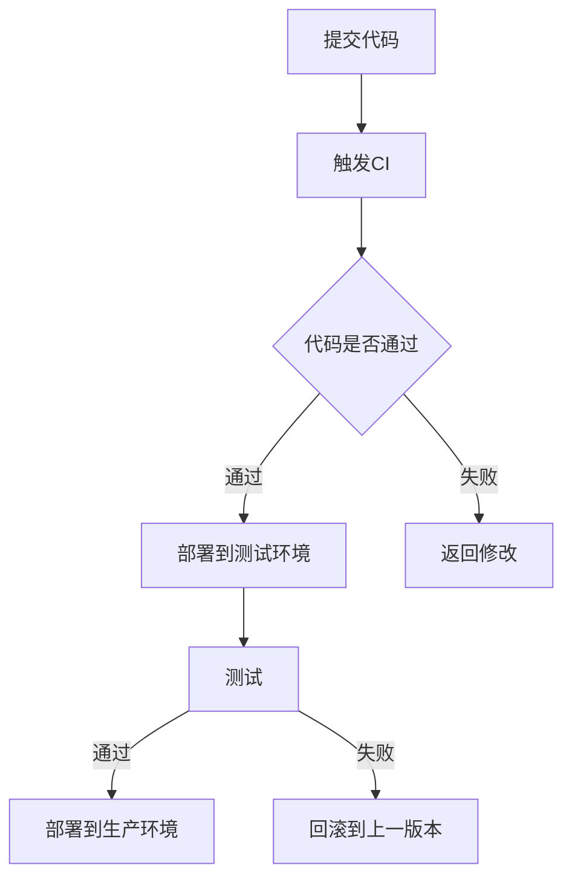

在该流程中，开发者将代码提交到代码库，触发CI流程。如果代码通过CI，则会部署到测试环境进行进一步测试。测试通过后，代码会部署到生产环境。否则，代码会被回滚到上一版本，开发者需要根据CI的反馈进行代码修改。

### 3.1.5 持续集成与版本控制系统的集成

持续集成与版本控制系统（如Git）的集成是确保CI流程有效性的重要环节。以下是如何将CI与Git集成的步骤：

1. **配置`.gitlab-ci.yml`或`.github/workflows/`文件**：在代码库中创建配置文件，定义CI流程的各个步骤，如代码构建、测试和部署。
2. **触发CI流程**：每次代码提交或合并请求都会触发CI流程，执行预定义的任务。
3. **监控CI状态**：通过Webhook将CI状态（如成功、失败）通知给团队成员，以便及时响应。
4. **自动化部署**：将CI流程与自动部署工具（如Kubernetes、Docker）集成，实现自动化的测试和部署。

以下是一个`.gitlab-ci.yml`文件的示例：

```yaml
stages:
  - build
  - test
  - deploy

build:
  stage: build
  script:
    - make build

test:
  stage: test
  script:
    - make test

deploy:
  stage: deploy
  script:
    - make deploy
  when: manual
```

在该示例中，CI流程分为三个阶段：构建（build）、测试（test）和部署（deploy）。在构建阶段，CI服务器会执行`make build`命令构建项目。在测试阶段，CI服务器会执行`make test`命令运行测试脚本。在部署阶段，CI服务器会执行`make deploy`命令将代码部署到生产环境。`when: manual`表示部署阶段需要手动触发。

通过将CI与版本控制系统集成，开发团队能够实现自动化、高效的代码管理和部署流程，提高开发效率和软件质量。

---

### 3.2 CI流程设计

持续集成（CI）流程的设计是确保代码质量和开发效率的关键环节。一个良好的CI流程能够自动化地执行代码检查、测试和部署，从而减少人为错误，提高团队的协作效率。以下是一个简化的CI流程设计原则、实现方法和与版本控制系统的集成方法。

#### 3.2.1 CI流程设计原则

1. **自动化**：CI流程应尽可能自动化，以减少手动操作，提高效率和一致性。
2. **频繁**：频繁地执行CI流程，确保每次代码变更都能及时检测到问题。
3. **透明性**：CI流程的执行状态和结果应透明，方便团队成员查看和反馈。
4. **一致性**：确保CI流程在不同环境和机器上的一致性，避免因环境差异导致的问题。
5. **可扩展性**：CI流程应易于扩展，以适应团队规模和项目需求的变化。

#### 3.2.2 CI流程实现

以下是一个典型的CI流程实现步骤：

1. **代码仓库配置**：在代码仓库中配置CI工具，如Jenkins、GitLab CI/CD或GitHub Actions，定义CI流程的配置文件。

   ```yaml
   # .gitlab-ci.yml示例
   stages:
     - build
     - test
     - deploy

   build:
     stage: build
     script:
       - make build

   test:
     stage: test
     script:
       - make test

   deploy:
     stage: deploy
     script:
       - make deploy
     when: manual
   ```

2. **触发CI流程**：每次代码提交或合并请求都会触发CI流程，CI服务器会按照预定义的配置文件执行相应的步骤。

3. **代码构建**：CI流程会首先构建代码，将源代码编译或打包成可执行文件。

4. **代码检查**：执行代码检查，如静态代码分析、格式检查等，确保代码质量。

5. **单元测试**：执行单元测试，验证代码的功能和性能。

6. **集成测试**：执行集成测试，验证代码模块之间的协作和系统整体功能。

7. **部署**：将经过测试的代码部署到测试或生产环境，确保代码在生产环境中的可靠性。

#### 3.2.3 CI与版本控制系统的集成

CI与版本控制系统的集成是CI流程设计的关键环节。以下是如何将CI与版本控制系统集成的步骤：

1. **配置Webhook**：在CI工具中配置Webhook，将代码仓库的提交和合并请求事件通知CI服务器。

   ```python
   # GitLab示例
   gitlab webhook配置:
   curl -X POST -H "Content-Type: application/json" \
   -d '{"token": "your_token", "url": "http://your_ci_server/events"}' \
   "https://gitlab.com/api/v4/projects/your_project_id/trigger"
   ```

2. **CI配置文件**：在代码仓库中创建CI配置文件（如`.gitlab-ci.yml`），定义CI流程的各个阶段和步骤。

   ```yaml
   # .gitlab-ci.yml示例
   stages:
     - build
     - test
     - deploy

   build:
     stage: build
     script:
       - make build

   test:
     stage: test
     script:
       - make test

   deploy:
     stage: deploy
     script:
       - make deploy
     when: manual
   ```

3. **CI服务器配置**：在CI服务器上安装并配置版本控制系统客户端，如Git，以获取代码仓库中的代码。

4. **CI任务调度**：CI服务器根据配置文件自动调度任务，执行代码构建、测试和部署。

5. **状态反馈**：CI服务器将执行结果（如通过、失败）反馈给代码仓库，方便团队成员查看。

通过将CI与版本控制系统集成，开发团队能够实现自动化、高效的代码管理和部署流程，提高开发效率和软件质量。

---

### 3.3 CI最佳实践

在实施持续集成（CI）的过程中，遵循最佳实践至关重要。以下是一些CI最佳实践，包括自动化测试、静态代码分析和持续反馈机制的具体应用。

#### 3.3.1 自动化测试

自动化测试是CI流程的核心组成部分，能够确保每次代码变更后的功能完整性。以下是实施自动化测试的一些最佳实践：

1. **编写全面测试用例**：覆盖不同功能场景和边界情况，确保测试用例的全面性和覆盖性。
2. **单元测试与集成测试**：结合单元测试和集成测试，以验证代码模块和整个系统的功能。
3. **持续集成测试**：每次代码提交后自动执行集成测试，确保代码变更不会破坏现有功能。
4. **性能测试**：定期执行性能测试，监控系统响应时间和资源消耗，确保系统在高负载下的稳定性。

以下是实现自动化测试的一个示例：

```python
# Python单元测试示例
import unittest

class TestCalculator(unittest.TestCase):
    def test_addition(self):
        self.assertEqual(calculator.add(1, 2), 3)

    def test_subtraction(self):
        self.assertEqual(calculator.subtract(5, 3), 2)

if __name__ == '__main__':
    unittest.main()
```

#### 3.3.2 静态代码分析

静态代码分析是在代码运行之前对代码质量进行评估的一种方法。以下是一些静态代码分析的最佳实践：

1. **代码风格一致性**：确保代码风格统一，避免不必要的复杂性，提高代码可读性和可维护性。
2. **代码复杂性度量**：使用代码复杂性度量工具（如Cyclomatic复杂度），评估代码模块的复杂度，识别潜在的问题区域。
3. **错误和警告检查**：通过静态分析工具（如Pylint、Flake8）检查代码中的错误和警告，确保代码质量。

以下是使用Pylint进行静态代码分析的示例：

```bash
$ pylint --rcfile=.pylintrc your_module.py
```

#### 3.3.3 持续反馈机制

持续反馈机制能够帮助团队快速识别和解决问题，以下是实现持续反馈机制的几个关键点：

1. **实时反馈**：确保CI流程的执行状态和结果能够实时通知团队成员，如通过邮件、Slack或Webhook。
2. **自动化报告**：生成详细的测试报告和静态代码分析报告，帮助团队分析问题原因。
3. **缺陷管理**：将CI流程中发现的缺陷自动关联到缺陷管理系统中，便于跟踪和修复。
4. **持续改进**：根据CI反馈，定期回顾和改进CI流程，优化测试用例和代码质量。

以下是配置Jenkins持续反馈机制的示例：

```yaml
# .gitlab-ci.yml示例
stages:
  - test
  - report

test:
  stage: test
  script:
    - make test
  notify:
    email: false
    slack: true
    webhooks:
      - url: https://hooks.slack.com/services/your_webhook_url
        content_type: json
        payload:
          channel: #your-channel
          text: "CI failed: {{ci_build_status}}"

report:
  stage: report
  script:
    - make report
  artifacts:
    paths:
      - report.html
```

通过遵循上述最佳实践，开发团队能够实现高效、可靠的CI流程，从而提高代码质量和开发效率。

---

### 3.4 CI工具介绍

在持续集成（CI）实践中，选择合适的工具至关重要。以下将介绍几种常见的CI工具，包括Jenkins、GitLab CI/CD和GitHub Actions，并讨论它们的优缺点和配置方法。

#### 3.4.1 Jenkins

**Jenkins** 是一款开源的自动化服务器，广泛用于各种开发和运维任务，包括构建、测试和部署。以下是其优缺点：

- **优点**：功能丰富、支持多种插件、高度可定制。
- **缺点**：配置复杂、维护成本较高。

**配置方法**：

1. **安装Jenkins**：在服务器上安装Jenkins，可以从官方下载地址下载安装包或使用包管理器安装。
2. **配置Jenkins**：启动Jenkins后，安装必要的插件，如Git插件、Maven插件等。
3. **创建构建作业**：配置构建作业，定义构建流程、触发条件和构建脚本。

以下是一个简单的Jenkinsfile示例：

```groovy
pipeline {
    agent any
    stages {
        stage('Build') {
            steps {
                sh 'mvn clean install'
            }
        }
        stage('Test') {
            steps {
                sh 'mvn test'
            }
        }
        stage('Deploy') {
            steps {
                sh 'mvn deploy'
            }
        }
    }
    post {
        success {
            sh 'echo "Build successful"'
        }
        failure {
            sh 'echo "Build failed"'
        }
    }
}
```

#### 3.4.2 GitLab CI/CD

**GitLab CI/CD** 是GitLab内置的持续集成和持续部署工具，与GitLab紧密集成。以下是其优缺点：

- **优点**：与GitLab紧密集成、配置简单、易于部署。
- **缺点**：功能相对有限、扩展性不如Jenkins。

**配置方法**：

1. **配置CI/CD YML文件**：在GitLab项目的根目录创建`.gitlab-ci.yml`文件，定义CI/CD流程。
2. **定义阶段和作业**：在`.gitlab-ci.yml`文件中，定义构建、测试和部署的阶段和作业。
3. **触发CI/CD**：每次代码提交或合并请求都会触发CI/CD流程。

以下是一个`.gitlab-ci.yml`文件示例：

```yaml
image: ubuntu:latest

stages:
  - build
  - test
  - deploy

build:
  stage: build
  script:
    - echo "Building..."
  only:
    - master

test:
  stage: test
  script:
    - echo "Testing..."
  only:
    - master

deploy:
  stage: deploy
  script:
    - echo "Deploying..."
  only:
    - master
```

#### 3.4.3 GitHub Actions

**GitHub Actions** 是GitHub提供的持续集成和持续部署服务，与GitHub紧密集成。以下是其优缺点：

- **优点**：与GitHub紧密集成、配置简单、支持多种运行环境。
- **缺点**：免费配额有限、付费计划价格较高。

**配置方法**：

1. **创建工作流文件**：在项目的根目录创建`.github/workflows/`文件夹，并在其中创建工作流文件。
2. **定义触发器和作业**：在文件中，定义工作流的触发器和各个阶段的作业。
3. **部署**：根据作业结果，自动部署到测试或生产环境。

以下是一个`.github/workflows/ci.yml`文件示例：

```yaml
name: CI

on: [push, pull_request]

jobs:
  build:
    runs-on: ubuntu-latest
    steps:
      - uses: actions/checkout@v2
      - name: Build
        run: echo "Building..."
      - name: Test
        run: echo "Testing..."
      - name: Deploy
        run: echo "Deploying..."
```

通过了解和使用这些CI工具，开发团队能够实现自动化、高效的持续集成流程，提高代码质量和开发效率。

---

### 4.1 持续部署（CD）概述

持续部署（Continuous Deployment，CD）是一种自动化流程，旨在将经过持续集成（CI）验证的代码快速、安全地部署到生产环境。CD的目标是通过减少部署时间、提高部署频率，同时确保系统的稳定性和可靠性。在LLM应用开发中，CD的重要性不言而喻，因为它能够确保模型和服务的持续改进和优化。

#### 4.1.1 持续部署的好处

持续部署带来了以下好处：

- **快速反馈**：通过自动化的部署流程，开发团队能够更快地看到新功能的效果，从而快速迭代和优化。
- **减少风险**：通过小范围、逐步的部署策略，能够及时发现和解决潜在问题，降低整体风险。
- **提高质量**：通过持续集成和自动化测试，确保每次部署的代码质量，减少人为错误。
- **提高效率**：自动化部署减少了手动操作，提高了部署的效率和一致性。

#### 4.1.2 持续部署的挑战

尽管CD带来了许多好处，但在LLM应用开发中也面临以下挑战：

- **计算资源需求**：大规模语言模型的部署和测试需要大量的计算资源，如何高效地管理和调度这些资源是一个挑战。
- **环境一致性**：确保开发、测试和生产环境的一致性，避免因环境差异导致的部署问题。
- **安全性**：在持续部署过程中，确保代码和模型的安全性，防止数据泄露和滥用。

#### 4.1.3 持续部署策略选择

在选择持续部署策略时，需要考虑以下因素：

- **业务需求**：不同的业务场景对部署策略的要求不同。例如，金融系统可能需要更加严格的部署策略，而电商系统可能更注重快速迭代。
- **系统规模**：大规模系统通常需要更加复杂的部署策略，以确保系统的稳定性和可靠性。
- **用户体验**：部署策略应尽量减少对用户的影响，确保用户体验的连续性。

以下是几种常见的持续部署策略：

1. **蓝绿部署**：通过同时运行两个相同版本的生产环境（蓝环境和绿环境），逐步将流量切换到新环境。这种方法能够确保系统的稳定性和可用性，同时降低部署风险。
2. **滚动更新**：逐步更新所有实例，确保系统始终有一个健康的实例池在运行。这种方法能够确保系统的连续性和稳定性，但可能需要更长的部署时间。
3. **灰度发布**：将新功能逐步部署到部分用户，观察其效果和性能，再逐步扩大部署范围。这种方法能够降低新功能的风险，同时确保用户体验的一致性。

#### 4.1.4 持续部署与持续集成的集成

持续部署与持续集成（CI）紧密集成，确保每次代码变更都能快速、安全地部署到生产环境。以下是CI与CD集成的关键步骤：

1. **CI触发CD**：每次代码提交通过CI流程后，自动触发CD流程。
2. **环境配置**：在CD流程中，根据需求配置开发、测试和生产环境，确保环境的一致性。
3. **自动化部署**：通过自动化脚本或工具，实现代码的构建、测试和部署，减少人为干预。
4. **监控和反馈**：在部署过程中，实时监控系统的状态，并将反馈集成到CI系统中，以便后续分析和改进。

以下是一个简化的CI/CD集成流程：

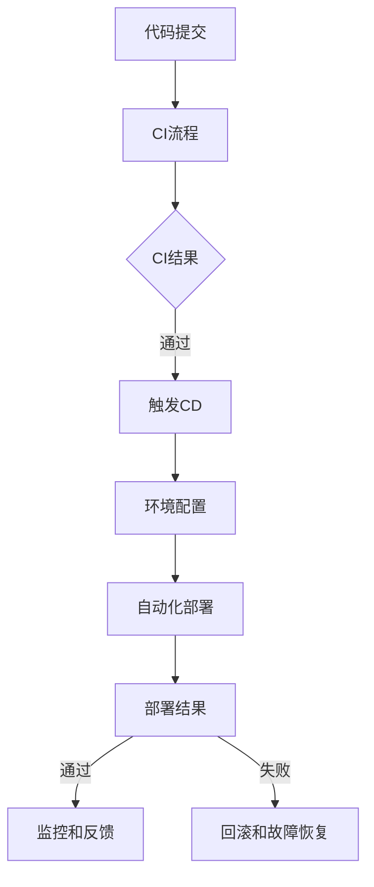

通过将持续部署与持续集成集成，开发团队能够实现自动化、高效的代码管理和部署流程，提高开发效率和软件质量。

---

### 4.2 CD流程设计

持续部署（CD）流程的设计是确保代码安全、快速地交付到生产环境的关键环节。一个良好的CD流程能够有效降低部署风险，提高系统的稳定性和用户体验。以下是一个典型的CD流程设计原则、实现方法和与CI系统的集成方法。

#### 4.2.1 CD流程设计原则

1. **安全性**：确保部署过程中的数据安全和代码完整性，防止未授权访问和潜在的安全威胁。
2. **可恢复性**：设计流程应具备快速回滚和故障恢复能力，以应对突发情况。
3. **可监控性**：部署流程应具备实时监控和日志记录能力，便于跟踪和排查问题。
4. **一致性**：确保部署在不同环境（开发、测试、生产）的一致性，减少环境差异导致的部署问题。
5. **自动化**：尽可能自动化部署流程，减少人为干预，提高效率和一致性。

#### 4.2.2 CD流程实现

以下是一个典型的CD流程实现步骤：

1. **构建和测试**：首先，通过CI系统构建和测试代码，确保代码质量。
2. **构建物验证**：验证构建物的完整性和正确性，确保没有损坏或错误。
3. **环境配置**：配置目标环境（如生产环境），包括网络、存储和依赖服务等。
4. **部署**：将验证通过的构建物部署到目标环境，包括安装、配置和启动应用程序。
5. **监控**：部署后，实时监控系统的状态和性能，确保系统运行稳定。
6. **反馈**：记录部署过程和结果，通过反馈机制通知相关团队，以便后续分析和改进。

以下是CD流程的实现示例：

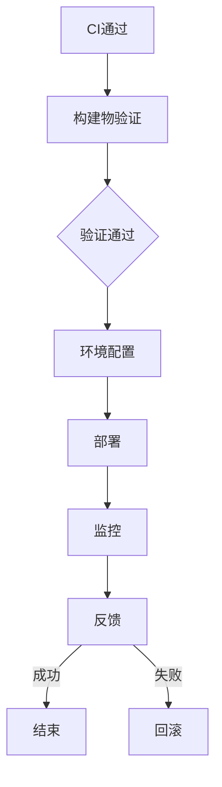

#### 4.2.3 CD与CI系统的集成

CD与CI系统的集成是确保代码快速、安全地交付到生产环境的关键。以下是如何将CD与CI系统集成的步骤：

1. **配置CI/CD工具**：在CI系统中配置CD流程，包括构建、测试和部署的步骤。
2. **触发CD流程**：每次CI流程通过后，自动触发CD流程。
3. **自动化部署**：通过脚本或工具实现自动部署，减少人为干预。
4. **集成反馈**：将CD流程的结果反馈给CI系统，便于跟踪和监控。

以下是一个集成的CI/CD流程示例：

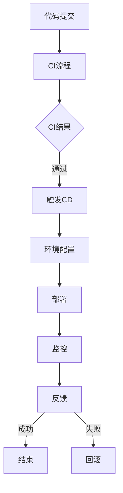

通过将CD与CI系统集成，开发团队能够实现自动化、高效的代码管理和部署流程，提高开发效率和软件质量。

---

### 4.3 CD最佳实践

在持续部署（CD）过程中，遵循最佳实践至关重要，以确保部署过程的顺利进行和系统的稳定性。以下是一些CD最佳实践，包括灰度发布、蓝绿部署和滚动更新的具体应用。

#### 4.3.1 灰度发布

灰度发布（Gray Release）是一种逐步部署新功能的方法，通过将新功能逐步部署到部分用户，以观察其效果和性能。以下是灰度发布的步骤：

1. **选择用户群体**：根据业务需求，选择一部分用户作为灰度发布的目标群体。
2. **部署新功能**：将新功能部署到目标用户的实例上，同时保持其他用户使用旧版本。
3. **监控**：实时监控新功能的性能和用户体验，收集反馈。
4. **逐步扩大范围**：根据监控结果和用户反馈，逐步扩大部署范围，直到新功能完全上线。

灰度发布的好处包括：

- **降低风险**：逐步部署新功能，减少因新功能引起的故障对整个系统的冲击。
- **提高用户满意度**：通过小范围发布，能够及时收集用户反馈，优化新功能。

以下是一个灰度发布的示例流程：

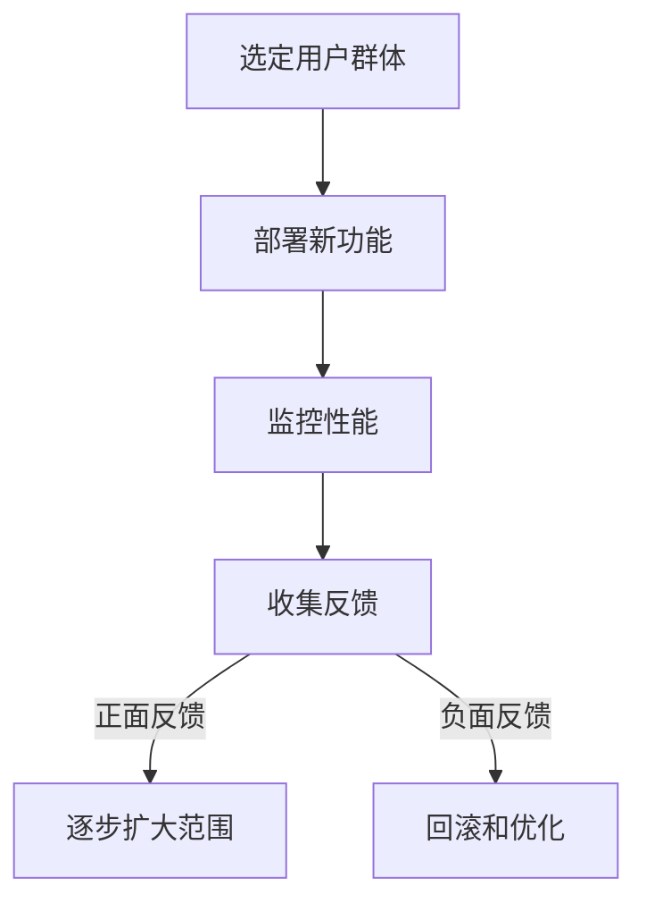

#### 4.3.2 蓝绿部署

蓝绿部署（Blue-Green Deployment）是一种部署新版本的方法，通过同时运行两个相同版本的生产环境（蓝环境和绿环境），逐步将流量切换到新环境。以下是蓝绿部署的步骤：

1. **准备新环境**：部署新版本到绿环境，确保其正常运行。
2. **切换流量**：将部分用户流量从蓝环境切换到绿环境，观察新环境的性能。
3. **完全切换**：在确认新环境稳定后，将所有用户流量切换到绿环境，同时关闭旧环境。

蓝绿部署的好处包括：

- **高可用性**：通过同时运行两个环境，确保系统的高可用性。
- **降低风险**：在切换过程中，能够及时发现和解决潜在问题，降低系统风险。

以下是一个蓝绿部署的示例流程：

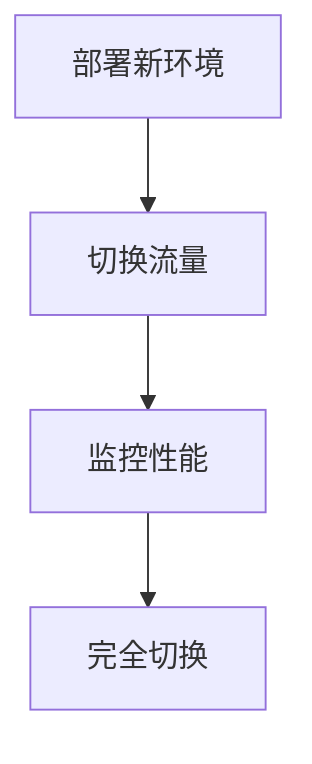

#### 4.3.3 滚动更新

滚动更新（Rolling Update）是一种逐步更新所有实例的方法，确保系统始终有一个健康的实例池在运行。以下是滚动更新的步骤：

1. **更新第一个实例**：更新第一个实例，确保其正常运行。
2. **切换流量**：将流量从旧实例切换到新实例。
3. **更新下一个实例**：重复步骤2，直到所有实例更新完毕。

滚动更新的好处包括：

- **高可用性**：在更新过程中，系统能够保持高可用性，减少对用户的影响。
- **快速部署**：能够快速部署新版本，提高系统的响应速度。

以下是一个滚动更新的示例流程：

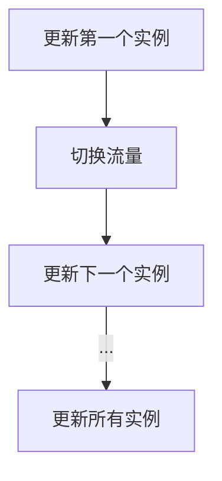

通过遵循这些最佳实践，开发团队能够实现安全、快速和高效的持续部署，提高系统的稳定性和用户体验。

---

### 4.4 CD工具介绍

在持续部署（CD）过程中，选择合适的工具对于实现自动化、高效和可靠的部署流程至关重要。以下将介绍几种常见的CD工具，包括Kubernetes、Docker和Helm，并讨论它们的优缺点和配置方法。

#### 4.4.1 Kubernetes

**Kubernetes** 是一个开源的容器编排平台，用于自动化容器的部署、扩展和管理。以下是其优缺点：

- **优点**：高度可扩展、可移植、支持多种调度策略、强大的集群管理能力。
- **缺点**：配置复杂、学习曲线较陡。

**配置方法**：

1. **安装Kubernetes**：在集群中安装Kubernetes，可以使用Minikube在本地环境中安装或使用kubeadm在物理机或云平台上安装。
2. **创建部署配置**：使用YAML文件定义部署配置，包括容器镜像、资源需求和健康检查等。
3. **部署应用**：使用kubectl工具部署应用，如`kubectl apply -f deployment.yaml`。

以下是一个简化的Kubernetes部署配置示例：

```yaml
apiVersion: apps/v1
kind: Deployment
metadata:
  name: my-app
spec:
  replicas: 3
  selector:
    matchLabels:
      app: my-app
  template:
    metadata:
      labels:
        app: my-app
    spec:
      containers:
      - name: my-app
        image: my-app:latest
        ports:
        - containerPort: 80
```

#### 4.4.2 Docker

**Docker** 是一个开源的应用容器引擎，用于打包、交付和运行应用。以下是其优缺点：

- **优点**：轻量级、易于使用、支持跨平台部署、提高开发效率。
- **缺点**：安全性可能较低、配置复杂。

**配置方法**：

1. **安装Docker**：在服务器上安装Docker，可以从官方下载地址下载安装包或使用包管理器安装。
2. **创建Dockerfile**：编写Dockerfile，定义应用的构建过程和运行环境。
3. **构建镜像**：使用`docker build`命令构建Docker镜像。
4. **运行容器**：使用`docker run`命令运行Docker容器。

以下是一个简化的Dockerfile示例：

```dockerfile
FROM python:3.9
WORKDIR /app
COPY requirements.txt .
RUN pip install -r requirements.txt
COPY . .
CMD ["python", "app.py"]
```

#### 4.4.3 Helm

**Helm** 是一个Kubernetes的包管理工具，用于简化Kubernetes应用的部署和管理。以下是其优缺点：

- **优点**：易于使用、支持模板化配置、支持依赖管理、支持版本控制。
- **缺点**：配置复杂、学习曲线较陡。

**配置方法**：

1. **安装Helm**：在本地或集群中安装Helm，可以使用官方安装脚本或使用包管理器安装。
2. **创建Helm图表**：编写Helm图表文件（charts），定义应用的配置和部署。
3. **安装应用**：使用`helm install`命令安装Helm图表。

以下是一个简化的Helm图表示例：

```yaml
apiVersion: helm.sh/helm/v3
description: My App
version: 0.1.0
kubeVersion: "1.18"
dependencies:
  - name: my-db
    version: "1.0.0"
    repository: https://charts.myrepo.com
spec:
  template:
    deployment:
      spec:
        containers:
        - name: my-app
          image: my-app:latest
          ports:
          - containerPort: 80
```

通过了解和使用这些CD工具，开发团队能够实现自动化、高效和可靠的持续部署流程，提高系统的稳定性和用户体验。

---

### 4.5 案例分析与实战

#### 4.5.1 案例背景

假设我们是一家提供智能客服解决方案的公司，开发了一款基于大型语言模型（LLM）的智能客服系统。随着用户需求的增加，我们需要不断更新和优化系统，以满足不同的业务场景和需求。为了确保每次更新和部署的稳定性和可靠性，我们决定采用持续集成（CI）和持续部署（CD）的流程。

#### 4.5.2 案例目标

通过实施CI/CD流程，实现以下目标：

- 确保每次代码提交都经过全面测试，及时发现和修复问题。
- 实现自动化部署，减少手动操作，提高部署效率。
- 确保新功能的逐步发布，降低风险。

#### 4.5.3 案例实现

1. **搭建CI/CD环境**：
   - 使用GitLab CI/CD作为CI工具，配置`.gitlab-ci.yml`文件，定义CI和CD流程。
   - 在Kubernetes集群中部署应用程序，使用Helm进行管理。

2. **编写`.gitlab-ci.yml`文件**：
   - 配置Jenkins Job，用于代码构建和测试。
   - 配置GitLab CI/CD管道，定义构建、测试和部署步骤。

3. **构建与测试**：
   - 代码提交后，触发CI流程，构建应用程序镜像。
   - 运行自动化测试，确保代码质量。

4. **部署**：
   - 将通过CI验证的构建物部署到Kubernetes集群。
   - 使用Helm进行部署，实现自动化和版本控制。

5. **灰度发布**：
   - 部署新功能到部分用户，观察性能和用户反馈。
   - 根据反馈，逐步扩大部署范围。

6. **监控与反馈**：
   - 使用Prometheus和Grafana进行实时监控，确保系统运行稳定。
   - 将监控数据和反馈集成到GitLab CI/CD中，用于后续分析和改进。

#### 4.5.4 实战步骤

1. **环境准备**：
   - 准备GitLab服务器和Kubernetes集群。
   - 配置GitLab CI/CD和Helm。

2. **编写`.gitlab-ci.yml`文件**：
   - 定义构建和测试阶段：
     ```yaml
     image: python:3.9

     stages:
       - build
       - test
       - deploy

     build:
       stage: build
       script:
         - pip install -r requirements.txt
         - python setup.py build

     test:
       stage: test
       script:
         - python -m unittest discover

     deploy:
       stage: deploy
       script:
         - helm upgrade --install my-app ./path/to/charts/my-app
     ```

3. **部署到Kubernetes**：
   - 编写Kubernetes部署文件，配置服务、负载均衡和自动扩缩容。

4. **灰度发布**：
   - 使用Kubernetes的Rollout命令进行灰度发布：
     ```bash
     kubectl rollout status deployment/my-app
     kubectl rollout pause deployment/my-app
     kubectl rollout resume deployment/my-app
     ```

5. **监控与反馈**：
   - 配置Prometheus和Grafana进行实时监控。
   - 将监控数据和报警集成到GitLab CI/CD中。

#### 4.5.5 实战总结

通过这个实战案例，我们实现了以下成果：

- **自动化构建与测试**：确保每次代码提交都经过全面测试，提高代码质量。
- **自动化部署**：通过Helm实现自动化部署，减少手动操作，提高部署效率。
- **灰度发布**：逐步部署新功能，降低风险，确保用户体验。
- **实时监控**：通过Prometheus和Grafana进行实时监控，确保系统运行稳定。

通过这个案例，我们展示了CI/CD在LLM应用开发中的实际应用，为开发团队提供了实用的指导。

---

### 附录

#### 附录A：相关工具和资源

在本文中，我们介绍了LLM应用开发中的持续集成与持续部署，并推荐了多种工具和资源。以下是一些推荐的工具和资源列表，以便读者进一步了解和使用。

##### A.1 LLAMA模型资源

- **LLAMA模型文档**：[LLAMA模型官方文档](https://github.com/openai/llama)
- **LLAMA模型源代码**：[LLAMA模型GitHub仓库](https://github.com/openai/llama)

##### A.2 持续集成与持续部署工具资源

- **Jenkins官方文档**：[Jenkins官方文档](https://www.jenkins.io/doc/)
- **GitLab CI/CD官方文档**：[GitLab CI/CD官方文档](https://docs.gitlab.com/ci/)
- **GitHub Actions官方文档**：[GitHub Actions官方文档](https://docs.github.com/en/actions)

##### A.3 其他参考资料

- **Kubernetes官方文档**：[Kubernetes官方文档](https://kubernetes.io/docs/)
- **Docker官方文档**：[Docker官方文档](https://docs.docker.com/)
- **Helm官方文档**：[Helm官方文档](https://helm.sh/docs/)
- **Prometheus官方文档**：[Prometheus官方文档](https://prometheus.io/docs/)
- **Grafana官方文档**：[Grafana官方文档](https://grafana.com/docs/)

通过使用这些工具和资源，读者可以更深入地了解LLM应用开发中的持续集成与持续部署，提升开发效率和系统质量。

---

### 作者信息

**作者：AI天才研究院/AI Genius Institute & 禅与计算机程序设计艺术 /Zen And The Art of Computer Programming**

